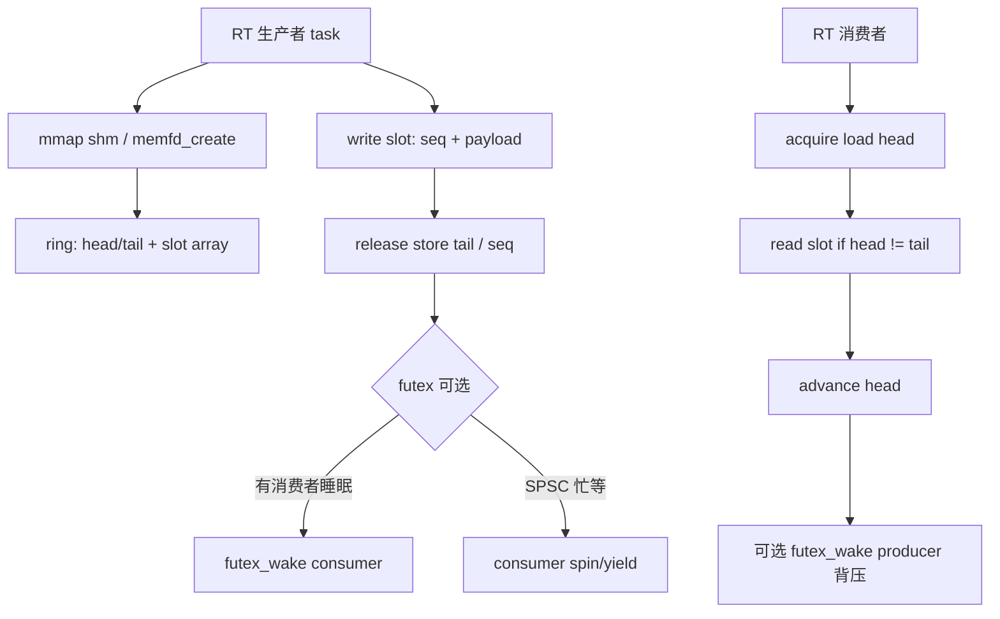
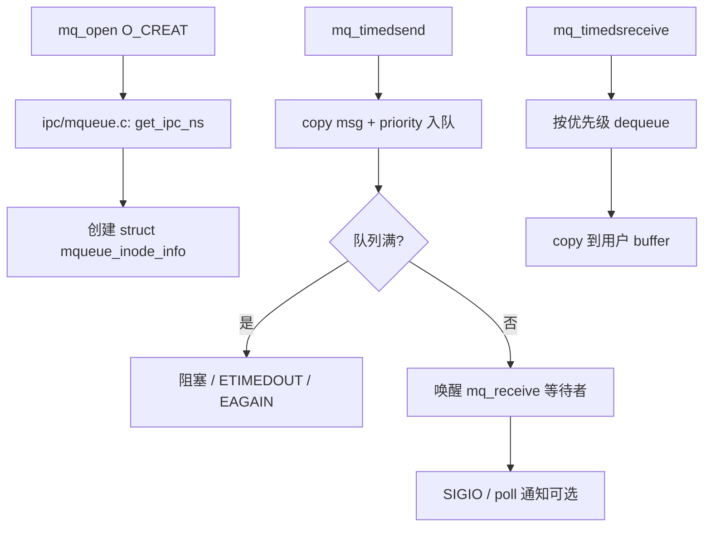
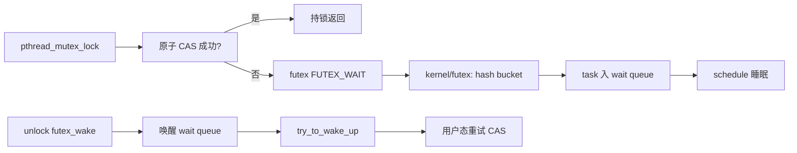
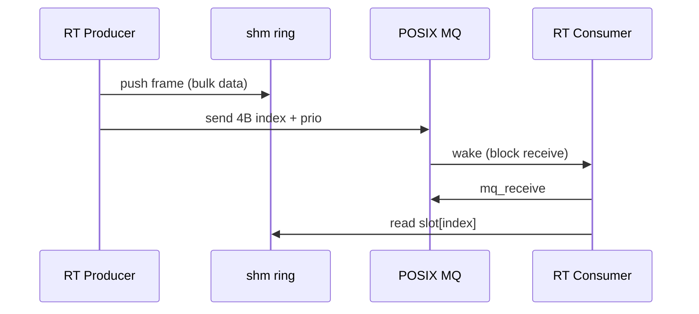
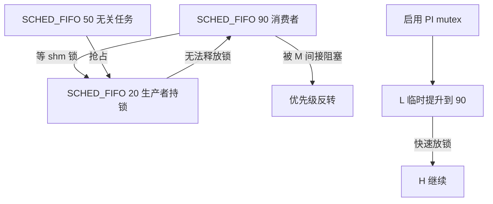

# 实时通信完整篇：共享内存环形缓冲、POSIX MQ、futex 与无锁队列排障

控制环 500 µs 周期内偶发 8 ms 毛刺、双核 RT 任务「丢样」、POSIX MQ 在满载时触发 SIGIO 风暴——这类问题很少是 CPU 频率不够，而是 **IPC 路径选错**：在 RT 热路径里 `malloc`、在 `SCHED_FIFO` 线程里等普通 mutex、用无界 socket 缓冲冒充「队列」。工业网关、音频 DSP 协处理器、机器人关节控制器都绕不开 **确定性数据通路**：预分配、有界、可证明最坏延迟。

本文把 Linux 用户态/内核侧与实时 IPC 相关的机制合成一篇：**共享内存 + 环形缓冲** 做零拷贝数据面，**POSIX 消息队列** 做有界事件通知，**futex** 做用户态阻塞/唤醒，**无锁队列** 做 SPSC/MPSC 快速路径；并单独讲 **优先级反转** 在 IPC 锁上的触发条件与 **反模式** 对照。源码锚点对齐 `mm/shmem.c`、`ipc/mqueue.c`、`kernel/futex/`、`tools/testing/selftests/futex/` 及 glibc `nptl` 实现，便于 `strace -e futex,mq_*` 与 `perf c2c` 交叉验证。

---

## 源码锚点

| 路径 | 作用 |
|---|---|
| `mm/shmem.c` | tmpfs/shmem 共享内存页、VMA 映射 |
| `ipc/mqueue.c` | POSIX MQ 内核实现：`do_mq_timedsend/receive` |
| `include/uapi/linux/mqueue.h` | `struct mq_attr`、优先级消息 |
| `kernel/futex/futex.c` | futex 等待/唤醒、`futex_wait`/`futex_wake` |
| `include/uapi/linux/futex.h` | FUTEX_* 操作码、PI futex |
| `kernel/futex/pi.c` | 优先级继承 futex（RT mutex 底层） |
| `kernel/locking/rtmutex.c` | 内核 RT mutex，与用户态 PI 语义对应 |
| `tools/lib/bpf/ringbuf.c` | BPF ring buffer 参考实现（对比用户态 ring） |
| `Documentation/userspace-api/futex2.rst` | futex2 新 API（Linux 6.x+） |
| `man 7 mq_overview` | POSIX MQ 语义与 `/dev/mqueue` |
| `man 2 futex` | futex 系统调用 |
| `nptl/pthread_mutex_lock.c` (glibc) | 用户态 mutex → futex 慢路径 |

## 调用链

### 共享内存环形缓冲：生产者到消费者



### POSIX MQ：事件与控制面



### futex 慢路径：mutex 阻塞到唤醒



---

## 重点知识

## 1. 实时 IPC 的三条铁律

**预分配**：启动阶段完成 `mmap`/`mq_open`/ring slot 分配；运行期禁止 `malloc`、`realloc`、文件 I/O 扩容。WCET 分析必须把分配器路径排除在外。

**有界**：队列深度、消息长度、共享内存窗口必须显式上限；「无界 backlog」在负载尖峰时等价于无界延迟——实时系统失效模式是 **延迟违约** 而非 OOM。

**分离数据面与控制面**：大块传感器帧走共享内存 ring（零拷贝）；小控制命令走 MQ 或 side channel；勿在 MQ 里传 MB 级 blob（多次 copy + 内核锁）。

**缓存行对齐**：SPSC ring 的 head/tail 各占独立 cache line（`alignas(64)`），避免 false sharing 使两核 IPC 「看起来无锁却慢 10 倍」。

**优先级一致**：生产/消费线程的 SCHED_FIFO 优先级、PI mutex 协议、MQ 消息优先级三者需一张表维护，勿各自为政。

## 2. 共享内存：从 mmap 到 shmem 页

Linux 上 RT 进程间共享缓冲区常见三条路：`mmap(MAP_SHARED)` 映射 **匿名共享**（`memfd_create` + `futex`）、**POSIX shm_open**（`/dev/shm` tmpfs）、或 **单进程多线程** 全局数组。内核侧最终都落到 **shmem/tmpfs 页** 或 **hugetlb**，由 `mm/shmem.c` 管理。

```c
/* 匿名共享 + 命名可选：memfd 便于 fd 传递 */
int fd = memfd_create("rt_ring", MFD_CLOEXEC);
ftruncate(fd, sizeof(struct rt_ring));
void *p = mmap(NULL, sizeof(struct rt_ring),
               PROT_READ | PROT_WRITE, MAP_SHARED, fd, 0);
struct rt_ring *ring = p;
```

`MAP_SHARED` 保证多进程映射同一 **struct page** 集合；写端 store 经 TLB 一致后对读端可见（需正确内存序）。**MAP_PRIVATE** 是 COW，不用于 IPC。

**/dev/shm** 上的 `shm_open(3)` 创建的文件同样走 tmpfs；嵌入式 initramfs 根文件系统若 tmpfs 过小，会出现 `ENOSPC`——排障时 `df -h /dev/shm`。

### 2.1 环形缓冲布局与序列号

```c
#define CACHELINE 64
struct rt_ring {
    alignas(CACHELINE) uint32_t head;  /* 消费者独占写 */
    alignas(CACHELINE) uint32_t tail;  /* 生产者独占写 */
    uint32_t mask;                     /* 容量 2^n - 1 */
    uint32_t slot_size;
    /* char slots[] 柔性数组或紧随其后 */
};

/* 经典 SPSC：单生产者单消费者，无锁 */
int ring_push(struct rt_ring *r, const void *data) {
    uint32_t t = r->tail;
    uint32_t next = (t + 1) & r->mask;
    if (next == __atomic_load_n(&r->head, __ATOMIC_acquire))
        return -EAGAIN; /* 满 */
    memcpy(slot_at(r, t), data, r->slot_size);
    __atomic_store_n(&r->tail, next, __ATOMIC_release);
    return 0;
}
```

用 **2 的幂** 容量使 `(idx + 1) & mask` 代替取模，WCET 更稳定。

SPSC 下 producer 只写 `tail`，consumer 只写 `head`，中间 slot 由 happens-before 保证：`release` 写 tail 后 consumer `acquire` 读 tail 可见数据。

MPSC 需 CAS 推 tail 或 **Michael-Scott queue**；MPMC 更复杂，实时系统优先 **绑核 SPSC 链** 而非通用 MPMC。

**覆盖策略**（overwrite oldest）仅适用于 **可丢帧** 传感器；控制指令 ring 必须 **背压**（满则返回 `-EAGAIN` 或阻塞在 PI mutex 条件变量）。

跨进程时 ring 控制块放 shm 头部，payload 紧随其后；`sizeof` 与对齐在 ABI 文档冻结，避免 32/64 位混部。

PowerPC/ARM 弱序模型下禁止「普通写 + 普通读」；必须 C11 atomics 或 kernel `smp_wmb`/`smp_rmb` 语义等价物。

初始化：`head = tail = 0` 必须在 **双方 mmap 完成后** 由 designated master 执行，避免读者看到垃圾 tail。

调试：在 slot 加 **序列号 seq**，consumer 检测 `seq` 跳变即知覆盖或乱序；`perf c2c` 查 head/tail 是否同 cache line。

### 2.2 共享内存 + futex 阻塞（非忙等）

```c
/* 消费者：无数据则 futex_wait(&ring->head, expected, timeout) */
/* 生产者 push 成功后 futex_wake(&ring->tail, 1) — 变量选错会丢唤醒 */
/* 标准模式：用 sequence + FUTEX_WAIT_BITSET 避免 ABA（见 futex 文档）*/
```

纯 SPSC 可 **busy-poll + sched_yield** 换最低延迟；带 futex 阻塞可把 CPU 让给 CFS  housekeeping，但 **唤醒延迟** 增加 1～50 µs（视内核负载）。

futex 等待必须处理 **spurious wakeup**：被唤醒后仍要检查 `head != tail`。

PI：若 consumer 在 `SCHED_FIFO 90` 等 mutex，producer 在 50，需 `PTHREAD_PRIO_INHERIT` 或改用 **无锁 SPSC** 消除 mutex。

`FUTEX_CLOCK_REALTIME` vs `FUTEX_CLOCK_MONOTONIC`：超时语义与 NTP 调整交互；控制环建议 **CLOCK_MONOTONIC**。

## 3. POSIX 消息队列（mqueue）

POSIX MQ 适合 **小消息、带优先级、内核持久命名** 的控制面。实现位于 `ipc/mqueue.c`，挂载于 `mq_mount`；用户态通过 `mq_open`、`mq_send`、`mq_receive`、`mq_notify`。

```c
struct mq_attr attr = {
    .mq_flags   = O_NONBLOCK,
    .mq_maxmsg  = 32,
    .mq_msgsize = 128,
    .mq_curmsgs = 0,
};
mqd_t q = mq_open("/rt_cmd", O_CREAT | O_RDWR, 0644, &attr);
unsigned prio = 31; /* 0 最低，31 最高（Linux） */
mq_send(q, msg, len, prio);
```

`mq_maxmsg` × `mq_msgsize` 在 `mq_open` 时 **固定分配**，符合 RT 预分配原则；勿依赖动态扩容。

消息 **按优先级** 出队；同优先级 FIFO。适合 **急停** 命令插队，但低优先级消息可能 **饥饿**——需上限或 aging 策略。

队列满时：`mq_send` 默认阻塞；`O_NONBLOCK` 返回 `EAGAIN`；`mq_timedsend` 返回 `ETIMEDOUT`。WCET 路径应显式处理三者之一。

`mq_notify` 注册 **SIGIO** 或 **线程回调**；高频通知易成抖动源，实时数据面慎用，仅作 **事件唤醒** 补充。

`/proc/sys/fs/mqueue/msg_max` 等 sysctl 限制系统级 MQ 资源；容器内可能更小。

与 **System V msgget** 对比：POSIX MQ 有优先级、异步通知；SysV 更老，实时新项目优先 POSIX。

内核路径持 `info->lock` spinlock；极高频 small msg 时 **锁竞争** 明显——>100k msg/s 改 shared memory ring。

排障：`strace -e mq_open,mq_timedsend,mq_timedsreceive`；`ls -l /dev/mqueue`；`cat /proc/sys/fs/mqueue/*`。

SELinux/AppArmor 可能拒绝 `mq_open` 路径；嵌入式策略文件需显式 allow。

消息内容在内核 **独立 kmalloc**（按 msgsize）；大 msgsize 增加 copy 成本与内存碎片——控制 msgsize ≤ 256B 常见。

### 3.1 mq 与 futex/poll 组合模式



模式：**MQ 只传 index/epoch**，bulk 数据在 ring；避免 MQ copy 大 buffer。

Consumer 阻塞在 `mq_timedsreceive` 而非 ring 上 spin，CPU 利用更合理。

若 MQ 丢通知（逻辑 bug），consumer 应用 **watchdog 超时** 读 ring，防止永久睡眠。

## 4. futex：用户态快路径与内核慢路径

futex（**fast userspace mutex**）是 Linux 用户态同步的基石：pthread mutex、condvar、sem 在 **无竞争** 时纯用户态原子操作；竞争时 `futex(FUTEX_WAIT)` 进内核睡眠，`FUTEX_WAKE` 唤醒。

```c
/* uapi/linux/futex.h 片段 */
#define FUTEX_WAIT            0
#define FUTEX_WAKE            1
#define FUTEX_REQUEUE         3
#define FUTEX_CMP_REQUEUE     4
#define FUTEX_WAKE_OP         5
#define FUTEX_LOCK_PI         6
#define FUTEX_UNLOCK_PI       7
#define FUTEX_WAIT_BITSET     9
```

`kernel/futex/futex.c`：`do_futex()` 根据 cmd 分发；等待任务挂到 **hash bucket** 链表，地址 `uaddr` 哈希减少全局锁。

**Private futex**（`FUTEX_PRIVATE_FLAG`）：同一地址空间，略快；跨进程共享 mutex 在 **共享内存里的 int** 上 wait，不能 PRIVATE。

**PI futex**（`FUTEX_LOCK_PI`）：实现优先级继承，与 `pthread_mutexattr_setprotocol(PTHREAD_PRIO_INHERIT)` 对应；RT 任务等锁 **必须** 考虑 PI。

**Robust futex**：持有者 crash 时，`FUTEX_OWNER_DIED` 使等待者接管或报错，避免永久死锁。

futex2（新）：`futex_waitv` 一次等多 futex，减少 syscall；glibc 逐步适配，嵌入式可评估内核 6.7+。

常见 bug：`futex_wait(uaddr, val)` 的 **val 必须等于 wait 前读到的 *uaddr**；否则 lost wakeup 或虚假 EAGAIN。

RT 场景：**禁止** 在 FIFO 高优先级线程长时间 `FUTEX_WAIT` 等低优先级释放，除非 PI；否则间接反转。

测量：`strace -c -p PID` 看 futex 占比；`perf trace -e syscalls:sys_enter_futex` 采样。

与 **seqlock** 对比：读多写少配置用 seqlock；队列用 ring；mutex 保护复杂不变式。

内核 `futex_q` 结构含 `rt_waiter` 标志；RT 唤醒路径优先，但仍受 **RT 带宽** 约束。

### 4.1 glibc mutex 到 futex 的调用链

```text
pthread_mutex_lock
  → LL mutex lock (nptl/lowlevellock)
    → lll_lock: atomic compare_exchange
    → 失败: __lll_lock_wait → futex(FUTEX_LOCK_PI 或 FUTEX_WAIT)
pthread_mutex_unlock
  → lll_unlock → 有 waiters 则 futex(FUTEX_WAKE / UNLOCK_PI)
```

## 5. 无锁队列与内存序

「无锁」≠「无等待」：通常指 **系统级 lock-free**（至少一个线程能推进），但 consumer 仍可能 **starve** 在 CAS 重试。实时设计要读 **progress guarantee**：wait-free > lock-free > obstruction-free。

```c
/* MPSC 简化：多个 producer CAS tail，单 consumer 读 head */
bool mpsc_push(struct mpsc *q, void *item) {
    struct node *n = pool_alloc(q); /* 预分配节点池 */
    n->data = item;
    struct node *prev;
    do {
        prev = __atomic_load_n(&q->tail, __ATOMIC_acquire);
        n->next = NULL;
    } while (!__atomic_compare_exchange_n(&q->tail, &prev, n,
            false, __ATOMIC_release, __ATOMIC_relaxed));
    prev->next = n; /* 链接；需 careful 发布顺序 */
    return true;
}
```

**节点预分配池**：无锁链表禁止 runtime free 到 glibc；用 ring of nodes 或 epoch-based reclamation（EBR）。

Linux **`kfifo`**（内核）是 SPSC/power-of-two ring 参考；用户态可读 `kernel/kfifo.c` 学边界处理。

DPDK **`rte_ring`**、Conveyor **`boost::lockfree::queue`** 工业级实现；移植时对齐 **内存屏障** 语义。

ABA 问题：裸 CAS 在 32 位指针/tag 场景用 **double-width CAS** 或 epoch counter。

实时验收：无锁结构必须在 **最坏竞争** 下测 WCET（多 producer 同核 + 中断风暴），勿只测单线程。

当队列深度固定，**数组 ring + SPSC** 比链表 MPSC 更简单、更可证明——奥卡姆剃刀。

`isocpp` memory_order：`release/acquire` 配对；`seq_cst` 最简单但可能更慢；ARM 上差异显著。

无锁 + **优先级反转**：CAS 本身不睡，但若 push 后 `sem_post` 走 futex，仍进慢路径。

工具：**ThreadSanitizer** 查 data race；**helgrind** 查锁序；无锁仍可能有 race bug。

反模式：「为了无锁而无锁」——若 SPSC 已满足且可证明，勿上 MPMC hazard pointer。

## 6. 优先级反转：IPC 场景下的触发与缓解



**直接反转**：高优先级等低优先级持有的 **pthread_mutex**（保护 ring 或 MQ 辅助结构）。

**间接反转**：低优先级持锁时被中优先级抢占（见上图）。

**缓解**：`PTHREAD_PRIO_INHERIT`；或 **无锁 SPSC** 消除共享锁；或 **优先级天花板** 锁。

内核 **rtmutex** + PI futex 链：`kernel/futex/pi.c` 维护 priority boosting。

勿在 RT 路径用 **普通 semaphore** 而不设 PI——glibc sem 底层也走 futex，但协议不同。

跨进程：共享内存里的 **process-shared mutex**（`pthread_mutexattr_setpshared`）+ PI。

验证：三线程测试程序 L/M/H + `chrt`，无 PI 时 H 的 wakeup latency 爆炸；有 PI 恢复。

PREEMPT_RT 内核减少内核 spinlock 对用户 RT 的影响，但 **用户态 mutex 反转** 仍要 PI。

文档化 **锁顺序**：若 ring + MQ 两把锁，全局顺序防 deadlock。

## 7. 反模式对照表

| 反模式 | 后果 | 替代 |
|---|---|---|
| RT 热路径 `malloc/free` | 非确定延迟、碎片 | 预分配 ring / 内存池 |
| 无界 socket/pipe 缓冲 | 背压缺失、OOM | 有界 ring + 丢帧策略 |
| FIFO 99 线程阻塞读 TCP | 毫秒～秒级 jitter | shm + 专用 IO 线程 |
| MQ 传 MB 级消息 | 多次 copy + 内核锁 | MQ 传 index，数据走 shm |
| head/tail 同 cache line | false sharing | `alignas(64)` 分离 |
| 普通 mutex 无 PI | 优先级反转 | PI 或无锁 SPSC |
| consumer 忙等 100% CPU | 饿死 housekeeping | futex 阻塞或 lower prio |
| 忽略内存序 | 偶发脏读 | C11 atomics |
| 32/64 位混部 shm 布局 | 结构体错位 | 固定宽度类型 + ABI 版本 |
| 信号 SIGIO 驱动数据面 | 异步信号不安全 | 阻塞 mq_receive 或 eventfd |

## 8. 配置、观测与实测命令

```bash
# 共享内存上限
sysctl kernel.shmmax kernel.shmall
df -h /dev/shm

# POSIX MQ 限制
cat /proc/sys/fs/mqueue/{queues_max,msg_max,msgsize_max}
ls -l /dev/mqueue/

# futex 跟踪
strace -f -e futex,mq_open,mq_timedsend,mq_timedsreceive ./rt_app
perf trace -e 'syscalls:sys_enter_futex*' -p $(pidof rt_app)

# 缓存行竞争
perf c2c record -a -- sleep 3 && perf c2c report

# RT 延迟（IPC 环测试）
cyclictest -p 80 -t 2 -n -i 1000 -l 50000
```

**实践 1**：搭建 **SPSC ring benchmark**：记录 push→pop 延迟 histogram；对比 mutex 保护 vs 无锁。

**实践 2**：压测 MQ：固定 `mq_maxmsg`，递增 send 速率直到 `EAGAIN`，得到 **饱和吞吐** 与 **阻塞 WCET**。

**实践 3**：用 `taskset` 把 producer/consumer 绑不同核，测跨核 IPC vs 同核 **cache 热** 差异。

**实践 4**：故障注入：producer crash 时 robust mutex / ring epoch 能否让 consumer 恢复。

**实践 5**：容器内验证 `/dev/mqueue` 挂载与 ulimit `MQ_OPEN_MAX`。

## 9. 内核侧交叉参考（读码路线）

**shmem**：`mm/shmem.c`：`shmem_mmap` → 建立 VMA；写时 fault 分配 page；理解 **同文件不同进程 CoW 否**。

**mqueue**：`ipc/mqueue.c`：`do_mq_timedsend` → `msg_insert` → `wq_sleep`；看 **优先级链表** 如何组织。

**futex wait**：`futex_wait_setup` → `futex_queue` → `schedule()`；wake 路径 `futex_wake_mark`。

**futex PI**：`futex_lock_pi` → `rt_mutex_start_proxy_lock`；与 `sched_setscheduler` 交互。

**eventfd**：数据面可选 **`eventfd` + epoll** 作通知；比 SIGIO 可控，但仍不及纯 ring poll。

**memfd**：`memfd_create` → anon inode；可 **seal** 防篡改；适合只读配置块 + 可写 ring 分离。

**hugetlb**：大 ring 可用 **HugeTLB** 减 TLB miss；嵌入式需内核 `CONFIG_HUGETLBFS`。

**dma-buf**：GPU/ISP 与 CPU RT 线程：**dma-buf fd** 导入 mmap，零拷贝视频 pipeline。

## 10. 典型场景选型

| 场景 | 推荐 IPC | 理由 |
|---|---|---|
| 1 kHz 传感器 → 控制环 | SPSC shm ring | 零拷贝、可证明延迟 |
| 偶发模式切换命令 | POSIX MQ 高优先级 | 小消息、插队 |
| 三进程各写日志 | MPSC + 预分配节点 | 无锁或 per-core queue 合并 |
| 跨主机 | 不在此篇；走 TSN/UDP 专网 | 内核网络栈非确定性 |
| 内核 ↔ 用户 | `uio`/`rpmsg`/netlink | 见驱动文档 |

## 11. 故障现象对照

| 现象 | 可能根因 | 验证手段 |
|---|---|---|
| 偶发 latency 尖峰 | false sharing / malloc | perf c2c, strace malloc |
| consumer 永久阻塞 | lost futex wakeup | 检查 wait val、spurious 处理 |
| MQ ETIMEDOUT 频繁 | consumer 太慢或深度不足 | 增 maxmsg 或优化 consumer |
| 数据损坏 | 内存序错误 | TSan, 加 seq 校验 |
| 高 CPU 无吞吐 | busy spin | 改 futex 阻塞 |
| PI 无效 | 非 PI mutex / 错误 pshared | pthread_mutexattr_getprotocol |

## 12. `ipc/mqueue.c` 读码：从 syscall 到睡眠

`mq_timedsend` 系统调用进入 `do_mq_timedsend()`：先 `copy_from_user` 消息体与 `mq_attr`，在 `info->lock` 保护下检查 `msg_count < mq_maxmsg`。

队列未满则 `msg_insert()` 按 **优先级** 插入链表（高优先级在前）；随后 `__pipelined_op()` 尝试唤醒正在 `mq_timedsreceive` 阻塞的任务。

队列已满且非 `O_NONBLOCK`：`prepare_to_wait_exclusive` 挂入 `info->wait_q`，`schedule_hrtimeout_range` 带超时睡眠——这里产生 **可测 WCET**：取决于 consumer 何时 dequeue。

读 `load_msg()` / `store_msg()` 注意 **security_ipc_permission** 与 mount namespace：`/dev/mqueue` 在容器里是否可见决定 `mq_open` 成败。

**mq_send 慢路径**

1. `Syscall entry` — `__x64_sys_mq_timedsend` → `do_mq_timedsend`

2. `Lock` — `spin_lock(&info->lock)` — PREEMPT_RT 下转为 sleeping lock

3. `Insert` — `msg_get()` 从 kmem_cache 取 `struct msg_msg`

4. `Wake` — `wake_q_add` 唤醒 wait queue 上 receiver

5. `Copy out` — receiver 路径 `pipelined_send` 零等待匹配

## 13. `kernel/futex/futex.c`：hash 与 lost wakeup 防护

futex 等待键为 **用户态 int 地址**（跨进程时为物理/虚拟映射一致地址）。内核 `hash_futex()` 映射到 `futex_hash_bucket`，桶锁 `hb->lock` 保护 wait list。

`futex_wait_setup()` 在入睡前再次 **atomic 读 *uaddr** 与传入 `val` 比较；若已变则 `-EAGAIN` 返回用户态重试——这是 **lost wakeup** 的核心防护，pthread 必须在 wait 前 **predicted val** 一致。

`futex_wake()` 遍历 bucket 中 `futex_q`，`mark_wake_futex` 后 `wake_up_q` 批量唤醒；`nr_wake` 限制唤醒个数避免 thundering herd。

PI 路径 `futex_lock_pi()` 与 `rt_mutex` 合流：owner 字段编码 TID，waiter 链按优先级排队；读 `kernel/futex/pi.c` 的 `rt_mutex_finish_proxy_lock()`。

```text
futex_wait(uaddr, val, timeout)
  hash_futex(uaddr) → hb
  spin_lock(hb->lock)
  if (*uaddr != val) return -EAGAIN
  queue_me() → task state INTERRUPTIBLE
  spin_unlock → schedule()
futex_wake(uaddr, nr)
  wake tasks on same hb
```

## 14. IPC 机制横向对比（实时选型）

| 机制 | 拷贝次数 | 阻塞语义 | 有界 | RT 适用 |
|---|---|---|---|---|
| SPSC shm ring | 0（映射后） | 可选 busy/futex | 是 | 首选数据面 |
| POSIX MQ | 2（user↔kernel） | 标准 | mq_maxmsg | 控制面 |
| pipe/FIFO | 2+ | 标准 | 内核缓冲 | 不推荐热路径 |
| Unix stream socket | 2+ | 复杂 | sk_wmem | 避免 |
| eventfd | 0 notify | epoll | 64bit 计数 | 辅助唤醒 |
| memfd+SCM_RIGHTS | 0 | pass fd | 固定映射 | 进程 spawn 传 ring |

## 15. 完整 SPSC + futex 参考实现片段

```c
#define FUTEX_WAIT 0
#define FUTEX_WAKE 1
static inline void futex_wait(volatile uint32_t *p, uint32_t val) {
    syscall(SYS_futex, p, FUTEX_WAIT, val, NULL, NULL, 0);
}
static inline void futex_wake(volatile uint32_t *p) {
    syscall(SYS_futex, p, FUTEX_WAKE, 1, NULL, NULL, 0);
}

int ring_pop_wait(struct rt_ring *r, void *out, struct timespec *to) {
    for (;;) {
        if (ring_pop(r, out) == 0)
            return 0;
        uint32_t h = __atomic_load_n(&r->head, __ATOMIC_acquire);
        /* FUTEX_WAIT_BITSET + CLOCK_MONOTONIC 可带超时 — 见 man futex */
        futex_wait(&r->tail, __atomic_load_n(&r->tail, __ATOMIC_relaxed));
        (void)h; (void)to;
    }
}
```

## 16. 优先级反转：可复现实验代码

```c
/* 三线程：L 持锁 sleep，M 空转 CPU，H 等锁 — 无 PI 时 H 长时间不就绪 */
pthread_mutex_t g;
void *low(void *a) {
    pthread_mutex_lock(&g);
    sleep(2);
    pthread_mutex_unlock(&g);
    return NULL;
}
void *med(void *a) {
    while (1) { /* CPU bound */ }
}
void *high(void *a) {
    struct sched_param sp = { .sched_priority = 90 };
    sched_setscheduler(0, SCHED_FIFO, &sp);
    pthread_mutex_lock(&g);  /* 等 L */
    pthread_mutex_unlock(&g);
    return NULL;
}
```

实验前给 **M 设 SCHED_FIFO 50**、**L 设 20**、**H 设 90**；无 PI 时 H 的 lock 等待包含 M 占满 CPU 的整段——测 `clock_gettime` 从 H 启动到持锁的时间。

启用 `PTHREAD_PRIO_INHERIT` 后，L 在持锁期被提升到 90，M 无法抢占 L（同优先级 FIFO 下 L 先运行），H 等待时间应接近 L 的 `sleep` 而非 M 的干扰。

工业现场等效场景：低优先级 **日志线程** 持 ring 的 stats 锁，中优先级 **网络线程** 占 CPU，高优先级 **控制环** 等锁——日志锁必须 PI 或 stats 改无锁计数器。

## 17. 反模式深度：网络栈与文件系统

**反模式 A**：RT 线程 `send()` TCP 控制命令。网络栈路径含 softirq、锁、动态分配；p99 延迟不可证明。改：本地 **MQ + shm**，网络仅非实时监控通道。

**反模式 B**：`fprintf`/`syslog` 在 1 kHz 环内。stdio 锁与内核 pipe 写；改：预分配 **trace ring**，离线线程批量落盘。

**反模式 C**：`pthread_cond_wait` 默认 mutex 无 PI 配 RT。cond 与 mutex 绑定；改 PI mutex + 或 **eventfd 通知 + ring**。

**反模式 D**：跨进程 **System V shm** + 自定义锁无 robust。进程 crash 留锁死；改 **robust mutex** 或 **seq+generation 检测 stale producer**。

**反模式 E**：MPMC 无界 `std::queue` + `mutex`。边界无限延迟；改 **有界 SPSC 每对生产者-消费者** 或 **合并线程模型**。

## 18. `memfd_create` + `SCM_RIGHTS` 传递 ring

```c
/* parent */
int fd = memfd_create("ring", MFD_CLOEXEC);
ftruncate(fd, size);
sendmsg(sock, &(struct msghdr){
    .msg_control = cmsg,  /* SCM_RIGHTS 嵌入 fd */
}, 0);
/* child recvmsg → mmap same memfd → 共享 ring 无需路径名 */
```

比 `shm_open` 路径名更适合 **systemd socket activation** _spawn 子进程：无 `/dev/shm` 竞态命名。

`MFD_ALLOW_SEALING` + `F_ADD_SEAL` 可冻结配置段为只读，防止 consumer 篡改 ring 参数。

## 19. 内核 `kfifo` 与用户态 ring 对照

内核 `kernel/kfifo.c` 提供 **power-of-two**、**spinlock 可选** 的 FIFO；`kfifo_in()` / `kfifo_out()` 与 **record 模式** 处理变长包。

驱动 ISR → tasklet 常用 **kfifo** 卸中断；用户态 RT 环可抄其 **in/out 索引取模** 与 **memory barrier** 注释。

`kfifo_alloc()` 一次分配；`__kfifo_uint_must_check_helper` 防溢出——用户态 ring 应用同样 **mask 而非 %** 并 assert 2^n。

## 20. PREEMPT_RT 与 IPC 的交互

PREEMPT_RT 将 `ipc/mqueue.c` 的 `info->lock` 等 spinlock 换为 **rtmutex 可睡眠锁**，高优先级 RT 等 MQ 时 **不被普通 spinlock 持有者** 长时间阻塞（在持锁者也是 RT 可抢占前提下）。

仍不建议 RT 热路径高频 MQ：锁路径从 spin 变 sleep，**syscall 次数** 仍是瓶颈。

`/sys/kernel/debug/spinlock` 与 `cyclictest` 对比主线内核：MQ 密集 benchmark 在 RT 补丁下 p99 可能下降，但 **shm ring** 仍最优。

配置 `CONFIG_POSIX_MQUEUE` 与 `CONFIG_FUTEX` 为内核必选；裁剪内核时勿误关。

## 21. 实测：latency histogram 脚本思路

```bash
# 生产者记录 T0 入 ring，消费者 pop 后读 T0 算 delta
# 输出到 histogram（单位 ns）
# 对比：同核 / 跨核 / 带 futex 阻塞 / PI mutex 保护 ring
taskset -c 2 chrt -f 80 ./ring_bench --mode spsc --samples 100000
taskset -c 2,3 chrt -f 80 ./ring_bench --mode spsc --cross-core
```

验收指标建议：**p99.9** push→pop 延迟 < 周期 10%；**max** 延迟需解释来源（SMI、RT throttle、lost wake）。

与 **cyclictest** 同机运行测 **干扰**：IPC 线程与 cyclictest 同核时 IPC max 应仍可接受。

## 22. 容器与命名空间

IPC namespace 隔离 **SysV IPC**；POSIX MQ 也受 mount ns 影响——K8s 需挂载 `mqueue` fs 或使用 host IPC。

`/proc/sys/fs/mqueue/*` 在 host 设限，container 内 `mq_open` 可能 `-EMFILE` 或 `-ENOSPC`。

Seccomp profile 缺 `mq_open`/`futex` 导致静默退化（busy spin 100% CPU）。

User namespace 下 **memfd** 行为与 capability 相关；rootless 容器传 fd 需 `SCM_RIGHTS` 同 user ns。

## 23. 音频/机器人场景复盘

**音频 capture → DSP**：ALSA ring buffer 已是内核侧 ring；用户态应用 **不要再 copy 到无界 vector**。用 **SCHED_FIFO** 读 period，周期 = ALSA period_size。

**机器人关节**：1 kHz EtherCAT 循环在核 A，规划在核 B；**共享轨迹 ring** + **MQ 传 mode switch**。EtherCAT 栈内禁止 malloc；IPC 与栈解耦。

**工业网关 Modbus → RT 控制**：Modbus 线程 CFS，解析后 **push shm**；勿 Modbus 回调里直接写 FIFO 99 控制环。

## 24. futex2 与 `futex_waitv` 前瞻

futex2 API（`Documentation/userspace-api/futex2.rst`）支持 **一次等多地址**、**32/64 位**、更清晰的 flags；减少 thundering herd 场景的 syscall 次数。

glibc 尚未全面默认 futex2；嵌入式可跟踪 **musl 1.2.x+** 与 **systemd** 依赖。

迁移评估：若 consumer 同时等 **ring tail + eventfd + MQ**，futex2 waitv 可能降低 wake latency 方差。

## 25. 边界条件速查（非重复条目）

| 条件 | 影响 | 处理 |
|---|---|---|
| glibc adaptive mutex | 短暂 spin 再 futex | RT 设 NORMAL mutex type |
| musl vs glibc | futex op 细节 | 目标 libc 上复测 |
| ARM32 64-bit atomic | 需 libatomic | 链接 -latomic |
| NUMA remote shm | +latency | mbind / 绑核 |
| cgroup memory.max | mmap fail | 调 limit 或 shm 大小 |
| VDSO 无 futex | 每次 wait syscall | 接受或 futex2 |
| PI 仅 PRIORITY_INHERIT | CEILING 不同 | 读 man pthread_mutexattr |
| robust mutex EOWNERDEAD | 需 recover | pthread_mutex_consistent |

## 26. 代码清单：最小 SPSC 演示骨架

```c
#define RING_CAP 256
struct sample { uint64_t ts; double value; };
static struct { struct rt_ring hdr; struct sample slots[RING_CAP]; } *g_shm;

void *producer(void *arg) {
    struct sched_param sp = { .sched_priority = 80 };
    sched_setscheduler(0, SCHED_FIFO, &sp);
    struct sample s;
    while (1) {
        clock_gettime(CLOCK_MONOTONIC, (struct timespec *)&s.ts);
        s.value = read_sensor();
        while (ring_push(&g_shm->hdr, &s) == -EAGAIN)
            sched_yield();
    }
}
```

## 27. 与实时调度篇的衔接

IPC 延迟叠加 **调度延迟**：consumer 必须 RT 策略且注意 `sched_rt_runtime_us`。

《实时调度完整篇》PI 与 cyclictest 与本篇 futex PI、ring 组合验收。

Deadline 任务读 ring：`sched_setattr` DL 参数与 **pop 超时** 对齐，避免无限等。

## 28. 现场问答摘录

**Q: ring 满时丢帧还是阻塞？**

A: 可丢传感器用 overwrite+seq；控制命令必须阻塞或 NAK，且 WCET 含等 consumer。

**Q: MQ 优先级 31 够吗？**

A: Linux 0–31；急停单独 MQ 或最高 prio + 短 msgsize。

**Q: 两进程不同 uid 能 shm 吗？**

A: mmap 同一 backing object 需权限配合；memfd 传 fd 或 shm_open mode 0666 仅 dev。

**Q: futex EAGAIN 循环正常吗？**

A: 正常；wait 前 val 变化必须重试，勿当错误。

**Q: 无锁 ring 还要 mutex 吗？**

A: SPSC 不需要；若有多读者统计或 resize（RT 禁止）才要。

**Q: pipe 为何不适合 RT？**

A: 内核 pipe 缓冲锁 + 动态；延迟不可证。

**Q: eventfd 替代 futex？**

A: 通知可以；互斥不行。常 eventfd+epoll 作辅助，数据仍 ring。

**Q: 如何测 false sharing？**

A: perf c2c；head/tail 分 cache line。

**Q: MQ 与 signal 混用？**

A: mq_notify SIGIO 异步信号不安全；RT 线程用 blocking receive。

**Q: 64 位 app 32 位 lib？**

A: shm 布局 ABI 崩；统一位宽。

## 29. 自测 futex 内核测试入口

`tools/testing/selftests/futex/`：`run.sh` 跑功能与 PI 回归；改 IPC 相关内核前可跑子集。

`futex_requeue` 用于 condvar 广播；读 `futex_requeue()` 理解 pthread_cond_broadcast 成本。

`FUTEX_WAKE_OP` 复合 wake+条件；glibc cond 优化路径会用到。

## 30. strace 典型输出解读

```text
mq_timedsend(3, "cmd", 3, 31, NULL) = 0
futex(0x7f..., FUTEX_WAIT_PRIVATE, 2, NULL) = 0
futex(0x7f..., FUTEX_WAKE_PRIVATE, 1) = 1
```

若热路径 **每帧 futex WAIT**，说明 ring 空/满在睡；若 **每帧无 futex** 纯 spin，查 CPU 占用。

若 `mq_timedsend` 与 `mq_timedsreceive` 成对但延迟大，查 msgsize copy 与锁竞争。

## 31. `do_mq_open` 与 VFS 挂载

`mq_open` 创建路径 `/dev/mqueue/name` 对应 dentry；`mount -t mqueue none /dev/mqueue` 必须存在。

 **`MQUEUE_NS`**：不同 IPC namespace 队列名隔离；K8s **`hostIPC: true`** 才与 host 共享。

 **`O_EXCL`** 创建原子性；守护进程 **单实例** 用 MQ 作 lock 不如 **flock** 简单但可带 prio 消息。

## 32. 双缓冲 vs 环形缓冲

双缓冲 swap pointer：**写满一块** 后 atomic 交换 **read/write index**；适合 **整帧图像**；延迟 = 一帧时间。

ring 适合 **流式小 record**；双缓冲适合 **大块固定 size**；勿混用语义。

双缓冲仍需 **release/acquire** 交换 index；错误实现会 **读到半写 buffer**。

## 33. `eventfd` + epoll 辅助通知

```c
int efd = eventfd(0, EFD_NONBLOCK | EFD_SEMAPHORE);
/* producer: write(efd, 1) after ring push */
/* consumer epoll_wait on efd then ring_pop */
```

比 **futex on tail** 多一次 write/read，但 **与 epoll 主循环** 统一；网关常用。

 **`EFD_SEMAPHORE`** 计数防 lost event；非 semaphore 模式需 drain 至 EAGAIN。

## 34. robust mutex 与进程 crash

```c
pthread_mutexattr_setrobust(&ma, PTHREAD_MUTEX_ROBUST);
/* lock 返回 EOWNERDEAD → pthread_mutex_consistent_np → 恢复 ring 状态机 */
```

producer crash 持锁时 consumer **`EOWNERDEAD`**：必须 **reconcile ring head/tail**（reset 或 discard epoch）。

无 robust 时 **futex wait 永久** 或 **死等**；关键 IPC 要么 SPSC 无锁要么 robust。

## 35. BPF ringbuf 与用户态对比

`tools/lib/bpf/ringbuf.c`：**mmap** 内核 ring；**epoll** 通知；适合 **tracing 数据上送**，非硬 RT 控制环。

机制类似用户态 shm ring；**kernel producer user consumer** 时 copy 已在内核侧完成映射。

## 36. SysV shm vs POSIX shm vs memfd

| API | 命名 | 生命周期 | 建议 |
|---|---|---|---|
| shmget/shmat | key_t | ipcrm 清理 | 遗留系统 |
| shm_open | /dev/shm | unlink | 命名共享 |
| memfd_create | 匿名 fd | close fd | 现代首选 |
| mmap MAP_ANON | 无 | 进程退出 | 仅线程间 |

## 37. 优先级天花板协议（PCP）简述

当多锁多资源：每锁 **ceiling priority** = 访问该锁任务的最高 RT 优先级；持锁时提升到 ceiling。

Linux 用户态 **无标准 PCP API**；常用 **PI** 或 **减少锁数量**；内核 **`rt_mutex_setprioceiling`** 有限支持。

设计时 **锁顺序表** + **最少锁** 优于复杂 PCP 实现。

## 38. 多生产者合并：per-core queue

N 个 producer 各 **SPSC 到 dedicated slot**，consumer **round-robin** 读；避免 MPMC 复杂度。

IRQ 顶半部 **per-CPU kfifo**，bottom half **batch push** 用户 ring——Linux 驱动常见模式。

## 39. WCET 测量清单（工程）

1) 关闭 unrelated load（`cpuset` 隔离）；2) `mlockall` 锁页防 swap；3) 100k+ 样本 histogram；4) 记录 **kernel 版本/glibc**；5) 最坏情况 **同时 stress-ng memory**。

勿用 **平均值** 签验收；合同常写 **p99.9 或 max** 阈值。

## 40. `sched_yield` 与 busy-wait 权衡

ring 满时 **sched_yield**：让 consumer 运行；但 **FIFO 同 prio** 可能 yield 给无关任务——最好 **不同优先级**。

极短等待 **busy-poll** 100 次再 futex：降低 wake 延迟；CPU 换 latency。

## 41. 与《进程间通信》篇边界

管道/socket/信号本文不展开；**实时数据面** 默认排除它们；**配置/运维** 仍可用 netlink/unix socket。

## 42. 更多反模式：数据库与 JSON

RT 环内 **sqlite insert**、**cJSON_Parse**：磁盘/堆分配；改 **离线 batch** 或 **预编译 binary record**。

**Redis publish** 走网络；仅 **非实时 telemetry** 可用。

## 43. 内核模块 ↔ 用户 RT：uio 与 rpmsg

**UIO**：mmap 设备寄存器/ DMA buffer；IRQ **user space handler**（需 RT 补丁评估）。

**rpmsg**：AMP 异构核通信；virtqueue 类似 ring；与 Linux RT 任务 **msg 边界** 在 remoteproc 文档。

## 44. 性能计数器辅助

```bash
perf stat -e cache-misses,cycles ./ring_bench
perf record -e syscalls:sys_enter_futex -g ./ring_bench
```

## 45. 术语对照

| 术语 | 含义 |
|---|---|
| SPSC | 单生产者单消费者 |
| MPSC | 多生产者单消费者 |
| PI | 优先级继承 |
| WCET | 最坏情况执行时间 |
| lost wakeup | sleep 前条件已变未检查 |
| false sharing | 不同核写同一 cache line |

## 46. 集成测试用例命名示例

`test_spsc_ring_latency_cross_core_p999`：CI  nightly 跑 50k 样本，超阈值 fail。

`test_mq_backpressure_eagain`：producer 速率 2x consumer，断言 **无阻塞超过 T**。

`test_pi_mutex_inversion_window`：H 等锁时间 < 50ms（无 PI 时故意 skip 或 expect fail）。

## 47. 文档化 IPC ABI 模板

```text
IPC-ABI v1
ring: offset 0, struct rt_ring 128B, slots 256 x 32B
endian: little
seq: uint32 monotonic, gap => consumer resync
MQ: /rt_cmd, prio 0=normal 31=estop
```

## 48. 读后练手（最小实验）

实验 1：两进程 `memfd` + SPSC，strace 统计 **futex 次数** vs busy。

实验 2：`mq_open` 深度 4，两线程 ping-pong 测 **满队列 WCET**。

实验 3：`pthread_mutexattr_setprotocol` 对比三线程 inversion 实验。

## 49. `FUTEX_PRIVATE_FLAG` 与跨进程

同进程线程默认 **PRIVATE**；`pthread` 跨进程共享内存锁必须 **非 PRIVATE**，否则内核按地址空间错误哈希。

strace 见 `FUTEX_WAIT_PRIVATE` vs 无 PRIVATE；迁移代码时常见 **silent bug**。

## 50. 延迟预算分解示例

| 段 | 预算 ns | 说明 |
|---|---|---|
| sensor sample | 20000 | ADC SPI |
| ring push | 500 | SPSC |
| sched wake consumer | 15000 | FIFO+isolcpus |
| control compute | 100000 | 算法 WCET |
| actuator write | 30000 | PWM |

合计须小于周期；IPC 段虽短，**miss 一次 wake** 可吃掉整个 budget——histogram 比均值重要。

与《实时调度完整篇》cyclictest 数据 **相加** 评估端到端，勿只看 ring 微基准。

## 51. 命令速查（IPC）

```bash
ipcs -m                          # SysV shm 遗留排查
ls -l /dev/shm /dev/mqueue
getconf POSIX_MQUEUE /dev/mqueue 2>/dev/null || true
ulimit -a | grep message
grep MemShared /proc/meminfo
perf stat -e syscalls:sys_enter_futex ./app
LD_DEBUG=statistics ./app 2>&1 | grep futex
chrt -p $(pidof producer) $(pidof consumer)
taskset -cp $(pidof producer)
cyclictest -p 80 -m -n -i 1000 -l 10000 -h 200 -q
strace -c -e futex,mq_timedsend,mq_timedsreceive ./rt_app
perf c2c record -a -- sleep 2 && perf c2c report --stdio | head
cat /proc/sys/fs/mqueue/queues_max
cat /proc/sys/kernel/shmmax
mq_getattr -p /rt_cmd 2>/dev/null || true
```

上述命令宜写入 BSP 回归脚本：升级 glibc/内核后跑一轮，对比 futex/s 与 ring p99 无回退。

容器部署额外查：`mount | grep mqueue`、`cat /proc/1/status | grep Cap` 是否含 IPC 相关 capability。

---

## 小结

实时通信的确定性来自 **预分配 + 有界 + 正确同步原语**：bulk 数据用 **共享内存环形缓冲**，控制事件用 **POSIX MQ**，阻塞/唤醒走 **futex**（RT 场景配 **PI**）；能 SPSC 则无锁，勿盲目 MPMC。

排障链：`strace` 看 futex/mq → `perf c2c` 查 false sharing → `cyclictest` 验端到端 jitter；对照 `mm/shmem.c`、`ipc/mqueue.c`、`kernel/futex/futex.c` 理解慢路径从哪来。

