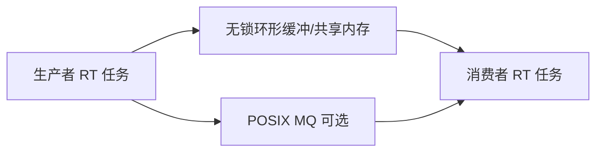

# 实时通信：共享内存、消息队列与确定性数据路径

实时任务之间交换数据，若走错误路径（阻塞分配、无界队列、锁优先级反转），再快的 CPU 也抖。本文聚焦常见 IPC 在实时场景的取舍。

## 源码锚点

| 路径 / 手册 | 作用 |
|-------------|------|
| `man mmap` | 共享映射 |
| `man mq_overview` | POSIX 消息队列 |
| `man futex` | 用户态快速锁 |
| `include/linux/futex.h` | futex API |

## 调用链

## 重点知识

### 优先共享内存 + 预分配

启动时分配环形缓冲，运行中避免 `malloc`。用序列号/位图处理覆盖策略。

### 消息队列

`mq_open` 可设消息数与长度上限，避免无界增长。注意信号通知与优先级。

### 反模式

在 RT 路径调用会睡的锁、网络协议栈、文件系统。跨核通信注意缓存行伪共享。
