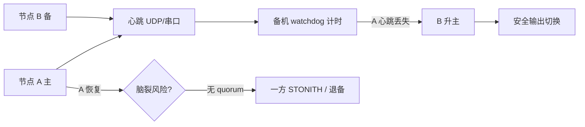
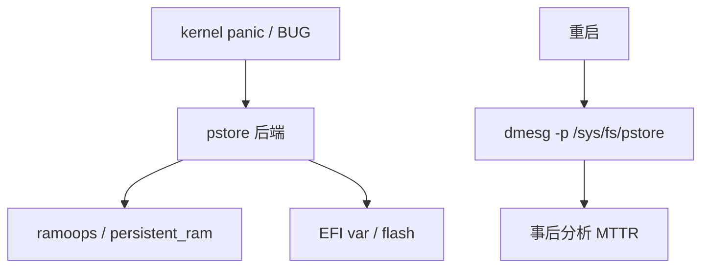

# 实时容错设计完整篇：看门狗、冗余、故障检测与恢复

产线 PLC **死机无复位** 导致整线停产、**软锁死** 后 systemd 仍显示 active、双机热备 **脑裂** 同时写输出——实时系统容错不是「加个 try-catch」，而是 **故障模型 → 检测 → 隔离 → 安全状态 → 恢复** 的闭环。Linux 上 **hardware watchdog（/dev/watchdog）**、**systemd WatchdogSec**、**心跳协议**、**双机冗余** 与 **黑匣子日志** 各有边界与坑。

本文合并实时系统 chapter 049–054，覆盖 **故障模型、硬件/软件看门狗、心跳、双机冗余、安全状态、日志与黑匣子、Linux 实现锚点与排障**，附源码路径与可复现命令。

---

## 源码锚点

| 路径 / 手册 | 作用 |
|-------------|------|
| `drivers/watchdog/watchdog_core.c` | 看门狗核心框架 |
| `drivers/watchdog/*.c` | 各 SoC/PCI 看门狗驱动 |
| `include/uapi/linux/watchdog.h` | `WDIOC_*` ioctl |
| `Documentation/watchdog/watchdog-api.rst` | 用户态 API |
| `systemd/src/core/service.c` | `WatchdogSec`、`sd_notify(WATCHDOG=1)` |
| `systemd/man/systemd.service.xml` | 单元看门狗配置 |
| `kernel/hung_task.c` | 软锁死检测（CONFIG_DETECT_HUNG_TASK） |
| `kernel/watchdog.c` | 内核 lockup detector（NMI/watchdog） |
| `fs/pstore/` | persistent ram / efivars 崩溃日志 |
| `drivers/md/md*.c` | 软件 RAID 冗余（存储域） |
| `include/linux/reboot.h` | `kernel_restart`、`emergency_restart` |
| `man 4 watchdog` | 看门狗设备说明 |

用户态喂狗骨架：

```c
#include <linux/watchdog.h>
int fd = open("/dev/watchdog", O_WRONLY);
int timeout = 30;
ioctl(fd, WDIOC_SETTIMEOUT, &timeout);
ioctl(fd, WDIOC_KEEPALIVE, 0);  /* 或 write(fd, "", 1) */
```

---

## 调用链

### ① systemd 服务看门狗到硬件复位

```mermaid
flowchart TD
    UNIT[systemd service WatchdogSec=30] --> MAIN[主进程 sd_notify WATCHDOG=1]
    MAIN --> SD[systemd 监督计时]
    SD -->|超时未喂| KILL[SIGABRT / restart / kill]
    KILL --> HW[可选 RuntimeWatchdogSec]
    HW --> WDT[/dev/watchdog 驱动]
    WDT -->|全系统无喂| RST[硬件复位]
```

### ② 双机心跳与故障切换



### ③ 崩溃到 pstore 黑匣子



---

## 重点知识

## 一、故障模型

### 1.1 故障分类

| 类型 | 示例 | 检测手段 |
|------|------|----------|
| 瞬态 | 网络闪断、EMI 位翻转 | 重试、CRC |
| 间歇 | 内存弱位、接触不良 | 统计、BIST |
| 永久 | CPU 损坏、固件 bug | 自检失败、替换 |
| 拜占庭 | 恶意/复杂故障 | 冗余投票（少见于工控） |

实时控制常见 **fail-stop**（停止+安全态）优于 **silent wrong**（静默错输出）。

### 1.2 故障域

| 域 | 范围 | 容错策略 |
|----|------|----------|
| 进程 | 单应用崩溃 | supervisor 重启 |
| 节点 | OS  hang | 硬件 WDT |
| 机架 | 电源/网络 | 双机冗余 |
| 站点 | 地震/断网 | 离线安全模式 |

**明确 SLA**：**RTO**（恢复时间）、**RPO**（数据丢失窗口）。

### 1.3 安全状态（Fail-Safe）

故障后输出须 **已知安全**：
- 电机：**抱闸**、**零扭矩**
- 阀门：**失电关闭/打开**（按工艺）
- 通信：**拒绝远程命令**

**不能** 默认「保持最后输出」— 除非 **硬件设计** 保证安全。

### 1.4 故障注入（测试）

```bash
# 软 lockup 测试（勿生产）
echo 1 > /proc/sys/kernel/sysrq
echo c > /proc/sysrq-trigger   # 故意 panic — 仅 lab
stress-ng --hang 1              # 挂起线程测 hung_task
```

**混沌工程** 须有 **隔离环境**。

---

## 二、硬件看门狗

### 2.1 /dev/watchdog 语义

打开 `/dev/watchdog` 后，**默认启用** 倒计时；**必须在 timeout 内喂狗**，否则 **硬件复位**。

```bash
ls -l /dev/watchdog /dev/watchdog0
cat /sys/class/watchdog/watchdog0/timeout
cat /sys/class/watchdog/watchdog0/state
cat /sys/class/watchdog/watchdog0/status
```

### 2.2 用户态喂狗

```c
int fd = open("/dev/watchdog", O_WRONLY);
int to = 15;
ioctl(fd, WDIOC_SETTIMEOUT, &to);
for (;;) {
    do_work();
    ioctl(fd, WDIOC_KEEPALIVE, 0);
    sleep(5);
}
/* 正常关闭：magic close */
write(fd, "V", 1);
close(fd);
```

**Magic close** `'V'`：部分驱动 **停止 WDT**；未写则 **close 仍复位** — 读 **Documentation/watchdog/**。

### 2.3 WDIOC 常用 ioctl

| ioctl | 作用 |
|-------|------|
| WDIOC_GETSUPPORT | 能力结构 |
| WDIOC_SETTIMEOUT | 设超时（秒） |
| WDIOC_GETTIMEOUT | 读超时 |
| WDIOC_KEEPALIVE | 喂狗 |
| WDIOC_SETOPTIONS | WDIOS_ENABLECARD / DISABLECARD |

### 2.4 内核 watchdog 驱动

SoC **IMX、TI、Broadcom** 等 **`drivers/watchdog/imx2_wdt.c`** 等；DT：

```dts
watchdog0: watchdog@3028000 {
    compatible = "fsl,imx21-wdt";
    reg = <0x3028000 0x4000>;
    interrupts = <GIC_SPI 80 IRQ_TYPE_LEVEL_HIGH>;
    timeout-sec = <20>;
};
```

**probe 失败** → 无 `/dev/watchdog` → **仅软件监督**。

### 2.5 硬件 WDT 与 RT 环

**RT 控制环本身不应直接喂硬件 WDT** — 环 **hang** 时 WDT 应复位。**独立 supervisor 线程**（**SCHED_OTHER**）监控 **RT 心跳计数** 再喂 **硬件 WDT**。

```
[RT 环] --递增 heartbeat--> [supervisor] --ioctl KEEPALIVE--> [HW WDT]
```

### 2.6 多级看门狗

**外层**：硬件 WDT **15 s**。**内层**：systemd **WatchdogSec=5s**。**应用**：**100 ms 心跳** — **分层超时** 避免 **单点**。

---

## 三、软件看门狗与 systemd

### 3.1 systemd WatchdogSec

```ini
[Service]
Type=notify
WatchdogSec=30
Restart=on-failure
```

主进程须 **sd_notify**：

```c
#include <systemd/sd-daemon.h>
sd_notify(0, "READY=1");
while (running) {
    sd_notify(0, "WATCHDOG=1");
    sleep(10);
}
```

**超时未 WATCHDOG=1** → systemd **SIGABRT** 或 **restart**（视配置）。

### 3.2 RuntimeWatchdogSec（系统级）

```ini
# /etc/systemd/system.conf
[Manager]
RuntimeWatchdogSec=10
RebootWatchdogSec=10min
```

systemd 向 **/dev/watchdog** 喂狗；**全系统 hang**（含 systemd 可检测范围）→ **硬件复位**。

```bash
systemctl show | grep Watchdog
```

### 3.3 与 Type=simple 区别

**Type=notify** 要求 **READY=1** 后才视为启动完成；**Watchdog** 仅对 **notify** 或 **支持协议** 的服务有效。

### 3.4 supervisor 替代

**supervisord**、**runit**、**自定义 daemon** — 进程 crash **重启**；**不替代** 硬件 WDT（**kernel hang** 无效）。

---

## 四、内核 lockup 检测

### 4.1 soft lockup / hard lockup

```bash
zcat /proc/config.gz | grep -E 'SOFTLOCKUP|HARDLOCKUP'
cat /proc/sys/kernel/watchdog
cat /proc/sys/kernel/watchdog_thresh
cat /proc/sys/kernel/softlockup_panic
cat /proc/sys/kernel/hardlockup_panic
```

**soft lockup**：CPU **长时间不调度**。**hard lockup**：**关中断过久**（**NMI watchdog**）。

### 4.2 hung_task

```bash
cat /proc/sys/kernel/hung_task_timeout_secs
cat /proc/sys/kernel/hung_task_panic
```

**D 状态** 不可中断睡眠 **过久** — **驱动 bug** 常见。

### 4.3 panic 策略

```bash
kernel.panic=10
kernel.panic_on_oops=1
```

**panic 后** **自动 reboot** — 配合 **pstore** 留 **crash log**。

---

## 五、心跳与活性检测

### 5.1 心跳语义

**周期递增序列** 或 **时间戳**；接收方 **超时** 则 **故障**。

```c
struct heartbeat {
    atomic_uint seq;
    atomic_uint64_t t_ns;
};
/* RT 环每周期 seq++ */
```

### 5.2 假活（livelock）

CPU **忙但无进展** — 心跳仍更新但 **业务无效**。对策：**进展检测**（**输出反馈**、**传感器闭环**）。

### 5.3 网络心跳

**UDP** 低延迟；**TCP keepalive** 太慢。**超时 = 3×RTT + jitter margin**。

### 5.4 串口/共享内存心跳

**双机** 背板 **UART** 或 **GPIO pulse** — **比以太更确定**（无 switch 风暴）。

---

## 六、双机冗余

### 6.1 主备（Active-Standby）

**主** 运行控制；**备** 热待机 **同步状态**。**主故障** → **备升主**。

**切换时间** = **检测 + 升主 + 输出稳定** — 常 **100 ms～s**。

### 6.2 双活（Active-Active）

两节点 **分担负载**；**故障** 时 **重分配**。**复杂度高** — 工控 **主备更常见**。

### 6.3 脑裂（Split-Brain）

**网络分区** 后 **双主** → **双输出冲突**。

对策：
- **STONITH**：一方 **强制 kill/power off** 对端
- **Quorum**：**仲裁节点/磁盘**
- **硬件互锁**：**仅一路** 能 **使能驱动**

### 6.4 状态同步

| 数据 | 同步方式 |
|------|----------|
| 设定值 | 双写 / 仲裁 |
| 积分项 | 周期同步 |
| 大历史 | 不同步，备 **冷启动** |

**强一致** 与 **低延迟** 权衡 — RT **有界同步块**。

### 6.5 Linux 集群栈（对照）

**Pacemaker + Corosync** — **通用 HA**；**硬 RT 控制环** 常 **自定义主备** + **FPGA 互锁**，非直接跑 Corosync 在 **RT 环内**。

---

## 七、故障检测技术

### 7.1 断言与不变量

```c
if (pos > MAX_POS) {
    enter_safe_state();
    log_fault(FAULT_LIMIT);
}
```

**运行期断言** 须 **O(1)** — 禁 **printf 链**。

### 7.2 校验和与 CRC

**通信帧**、**配置块** **CRC32**；**内存** **EDC**（硬件）。

### 7.3 双通道对比

**冗余传感器** **投票**；**差超阈** → **降级** 或 **安全态**。

### 7.4 看门狗 + 心跳组合

| 层 | 检测对象 |
|----|----------|
| 应用心跳 | 逻辑 hang |
| systemd WDT | 进程无响应 |
| 内核 lockup | 驱动关中断 |
| 硬件 WDT | 全系统死 |

---

## 八、恢复策略

### 8.1 重启分级

1. **重试当前操作**（瞬态）
2. **重启进程**（systemd Restart=）
3. **重启服务链**
4. **reboot**（`systemctl reboot` / WDT）

### 8.2 状态恢复

**冷启动**：输出 **安全态** → **读持久配置** → **Homing** → **运行**。

**热备升主**：**同步最后已知 good 状态** — **积分 windup** 须 **处理**。

### 8.3 降级模式

**单传感器失效** → **开环限幅**；**通信断** → **本地自主**。

文档化 **每种故障 → 模式矩阵**。

---

## 九、日志与黑匣子

### 9.1 环形缓冲（flight recorder）

```c
struct log_entry { uint64_t t; uint32_t code; uint32_t data; };
struct log_ring {
    struct log_entry buf[N];
    atomic_uint idx;
};
/* 覆写最旧 — 常数内存 */
```

**RT 环** 只 **写内存 ring**；**低优先级线程** **异步刷盘**。

### 9.2 pstore / ramoops

```bash
cat /sys/fs/pstore/
dmesg -p
```

**boot 参数**：

```text
ramoops.mem_address=0x... ramoops.mem_size=0x100000
```

**panic/oops** 后 **重启仍可读**。

### 9.3 journald 持久化

```ini
# /etc/systemd/journald.conf
Storage=persistent
SystemMaxUse=500M
```

**SyncIntervalSec** 权衡 **丢电丢日志** vs **磁盘 wear**。

### 9.4 ftrace / perf 快照

故障触发时 **写 trace 缓冲**：

```bash
echo 1 > /sys/kernel/debug/tracing/snapshot
cat snapshot > /var/crash/trace.dat
```

---

## 十、Linux 实现锚点与排障

### 10.1 看门狗不工作

```bash
dmesg | grep -i watchdog
lsmod | grep wdt
cat /sys/class/watchdog/watchdog0/identity
```

**原因**：驱动未加载、**DT disabled**、**权限**、**conflict 多客户端**。

### 10.2 systemd 误杀

```bash
journalctl -u myservice -b
systemctl status myservice
```

**WatchdogSec 过短** + **GC 停顿** → **误 restart** — **调大** 或 **优化 WATCHDOG 频率**。

### 10.3 双机切换失败

**检查**：心跳 **防火墙**、**STONITH 权限**、**输出互锁 GPIO**、**升主脚本** **chrt** 是否阻塞。

### 10.4 WDT 与 debug 冲突

**kgdb**、**lockdep** **极慢** → **WDT 复位** — lab **disable WDT** 或 **加长 timeout**。

---

## 十一、案例

### 11.1 案例：RT 环 hang，systemd 仍 active

**现象**：输出 **冻结**，`systemctl` **running**。**根因**：**FIFO 90 死循环**，**未 sd_notify WATCHDOG**。**修复**：**supervisor 线程** 监控 **seq** + **独立喂 HW WDT**。

### 11.2 案例：magic close 未用导致 reboot

**现象**：**正常 shutdown** 后 **复位**。**根因**：**close(/dev/watchdog)** 触发 **复位**。**修复**：**'V' magic close** 或 **WDIOS_DISABLECARD**。

### 11.3 案例：脑裂双主

**现象**：**两节点同时驱动**。**根因**：**网络分区** 无 **quorum**。**修复**：**STONITH IPMI** + **硬件 enable 链**。

### 11.4 案例：pstore 为空

**根因**：**ramoops 地址** 与 **内核 reserved 冲突**。**修复**：DT **reserved-memory** 对齐 **手册**。

---

## 十二、反模式

| 反模式 | 后果 |
|--------|------|
| RT 环直接喂 HW WDT | hang 不复位 |
| 仅软件 supervisor 无 HW WDT | kernel hang 无效 |
| WatchdogSec 过短 | 误杀 |
| 心跳仅进程级 | 假活 |
| 无安全态设计 | 故障危险输出 |
| 双主无互锁 | 设备冲突 |
| 黑匣子仅 disk | 掉电无 log |

---

## 十三、与功能安全标准（对照）

**IEC 61508 SIL**、**ISO 13849** — **WDT、冗余、诊断覆盖率** 有 **定量要求**。**Linux 通常非 SIL 单核证据**；**安全 PLC** 在 **MCU** + **Linux 作 HMI**。

---

## 十四、容器与嵌入式

### 14.1 容器内 WDT

**/dev/watchdog** 须 **--device** 传入；**多容器** **不能** 同时 **open** — **单所有者**。

### 14.2 Yocto / init

**busybox watchdog** 守护；**systemd** 更常见。**Mender** 等 **OTA** 与 **WDT** 协调 **升级窗口喂狗**。

---

## 附录 A：watchdog.conf（legacy）

部分发行版 **/etc/watchdog.conf**：

```text
watchdog-device = /dev/watchdog
interval = 10
max-load-1 = 24
```

**watchdog daemon** 综合 **load/内存/ping** — 与 **纯硬件 WDT** 互补。

---

## 附录 B：WDIOC_GETSUPPORT

```c
struct watchdog_info ident;
ioctl(fd, WDIOC_GETSUPPORT, &ident);
printf("options=%x firmware_version=%u identity=%s\n",
       ident.options, ident.firmware_version, ident.identity);
```

**WDIOF_SETTIMEOUT** 等 **能力位** 决定 **能否改 timeout**。

---

## 附录 C：systemd 完整单元示例

```ini
[Unit]
Description=RT Control Service
After=network.target

[Service]
Type=notify
ExecStart=/usr/bin/rt_control
WatchdogSec=20
Restart=on-failure
RestartSec=2
LimitMEMLOCK=infinity
AmbientCapabilities=CAP_SYS_NICE

[Install]
WantedBy=multi-user.target
```

---

## 附录 D：IPMI STONITH

```bash
ipmitool -H bmc -U user -P pass chassis power off
```

**Pacemaker fence_ipmilan** — **云/机房** 常用。

---

## 附录 E：GPIO 输出互锁

```dts
fail-safe-gpio = <&gpio 12 GPIO_ACTIVE_LOW>;
```

**备机升主** 前 **读互锁**；**仅 enable=1 一路** 有效。

---

## 附录 F：/proc/sysrq

```text
kernel.sysrq=1
```

**SysRq** 紧急 **sync/remount/reboot** — **现场救援**；**生产可限制**。

---

## 附录 G：kdump

```bash
systemctl status kdump
```

**第二内核** 捕获 **vmcore** — **比 pstore 完整**；**RT 系统** 权衡 **预留内存**。

---

## 附录 H：audit 与容错

**auditd** 记录 **配置变更** — **故障后** **谁改了参数**。

---

## 附录 I：冗余电源 / ECC

**硬件层** **ECC RAM**、**双 PSU** — **OS 层之上**；**mcelog** / **rasdaemon** 报告 **可纠正/不可纠正**。

```bash
ras-mc-ctl --summary
```

---

## 附录 J：术语

| 术语 | 含义 |
|------|------|
| WDT | Watchdog Timer |
| STONITH | Shoot The Other Node In The Head |
| RTO | Recovery Time Objective |
| RPO | Recovery Point Objective |
| fail-safe | 故障进入安全态 |
| fail-stop | 故障停止服务 |

---

## 附录 K：heartbeat 协议 sketch

```text
MSG: MAGIC(4) | seq(u32) | state(u8) | crc32
Period: 100ms
Timeout: 500ms → FAULT_PEER
```

---

## 附录 L：升主状态机

```text
STANDBY → (peer lost) → CANDIDATE → (win arbitration) → PRIMARY
PRIMARY → (peer back + higher prio) → STANDBY
ANY → (local fault) → SAFE → RECOVER
```

---

## 附录 M：ramoops 参数示例

```text
ramoops.record_size=0x10000
ramoops.console_size=0x10000
ramoops.ftrace_size=0x10000
ramoops.pmsg_size=0x10000
ramoops.mem_size=0x80000
```

---

## 附录 N：watchdog 与 suspend

**suspend** 路径须 **stop WDT** 或 **加长 timeout** — **drivers/watchdog** **`suspend/resume`** 回调；漏实现 → **resume 后误复位**。

---

## 附录 O：测试矩阵

| 注入 | 期望 |
|------|------|
| kill -9 主进程 | systemd restart |
| RT 死循环 | supervisor/HW WDT |
| ifdown 心跳网 | 备升主 |
| flash 满 | 日志降级仍安全态 |

---

## 附录 P：与《确定性》《PREEMPT_RT》边界

- **确定性篇**：WCET、干扰 — **预防** 超时。
- **容错篇**：**超时/故障后** **怎么办**。

---

## 附录 Q：userspace watchdog 库

**libwatchdog** 封装 **ioctl**；**systemd** 优先 **sd_notify**。

---

## 附录 R：cgroup OOM 与容错

**MemoryMax** 触 **OOM kill** — **Restart=** 恢复；**RT 进程** **单独 cgroup** 避免 **被其它 OOM**。

---

## 附录 S：固件 WDT 窗口

Bootloader **短 WDT** — **kernel 未 feed** 前 **须 early_wdt** 或 **bootloader 停 WDT** — **bring-up** 常见坑。

---

## 附录 T：日志速率限制

```c
/* 避免 fault 风暴写满 disk */
RATE_LIMIT("[fault] code=%u", code);
```

---

## 附录 U：双机时间同步

**升主** 前 **PTP/NTP** 偏差过大 → **拒绝同步输出** — **时间_fault** 标志。

---

## 附录 V：MD RAID 与 RT

**mdadm** **重建** **IO 延迟** — RT 节点 **cache 策略** / **独立 OS 盘**。

---

## 附录 W：BTRFS/ZFS scrub

**后台 scrub** — **cyclictest 尖刺**；**维护窗口** 执行。

---

## 附录 X：交付文档

容错交付含：**故障模型、WDT 拓扑图、心跳参数、安全态表、切换时间实测、STONITH 权限、黑匣子读取步骤**。

---

## 附录 Y：QEMU 看门狗测试

```bash
qemu-system-x86_64 -watchdog i6300esb ...
```

**guest 不喂** → **reset** — **CI 测试** WDT 逻辑。

---

## 附录 Z：参考命令速查

```bash
# 硬件 WDT
wdctl -f /dev/watchdog0
# systemd
systemd-analyze critical-chain
journalctl -k -b -1
# pstore
ls /sys/fs/pstore/
# lockup
sysctl kernel.softlockup_panic kernel.hardlockup_panic
```

---

## 附录 AA：imx_wdt 驱动锚点

`drivers/watchdog/imx2_wdt.c`：**imx_wdt_ping** 写 **WMR**；**suspend** 时 **imx_wdt_stop**，**resume** 重新 **set_timeout**。读 DT **`fsl,wdt-timeout`** 与 **实际 ioctl** 是否一致：

```bash
grep imx /sys/class/watchdog/watchdog0/identity
```

---

## 附录 AB：nowayout 模块参数

```bash
cat /sys/module/watchdog/parameters/nowayout
# Y → 用户态无法 magic close 停 WDT
```

**生产** 常 **nowayout=Y** 防 **误 disable**；**开发** 需 **可关闭** 避免 **调试 reboot 循环**。

---

## 附录 AC：software watchdog daemon 与 systemd 分工

| 组件 | 监控范围 |
|------|----------|
| watchdog(d) | load、/proc、ping、可选 script |
| systemd WatchdogSec | 单服务 notify |
| systemd RuntimeWatchdogSec | 全系统 |
| kernel lockup | 驱动/内核 bug |
| hardware WDT | 最后防线 |

**五层** 超时须 **单调递增**，避免 **内层未触发外层已复位**。

---

## 附录 AD：keepalive 实现差异

部分驱动 **write(fd,"\\0",1)** 喂狗；部分仅 **WDIOC_KEEPALIVE**；**multi-card** 时 **identity** 不同 — 移植时 **读 GETSUPPORT**。

```bash
strace -e ioctl ./feed_wdog
```

---

## 附录 AE：双机串口心跳示例

```c
/* 每 50ms 发送 */
uint8_t frame[8] = { 0xAA, seq, state, crc8 };
write(uart_fd, frame, sizeof(frame));
/* 接收侧：select 100ms 超时 → FAULT */
```

**CRC8** 防 ** EMI 假心跳**；**seq 回绕** 用 **uint32** 足够。

---

## 附录 AF：安全态硬件接线

**急停链** 串 **继电器常闭** → **驱动 enable**；**软件 fail-safe** 仍须 **硬件** 能在 **MCU/GPU 疯跑** 时 **切断功率** — **IEC 60204-1** 思想。

---

## 附录 AG：journald 与 RT 分离

```ini
# rt_control.service：无 StandardOutput=journal
StandardOutput=null
```

**故障日志** 走 **内存 ring → 异步 journal** 由 **supervisor** 写，避免 **RT 线程** 触发 **journal sync**。

---

## 附录 AH：pstore ramoops 与 DT reserved-memory

```dts
reserved-memory {
    ramoops@110000 {
        compatible = "ramoops";
        reg = <0x110000 0xf0000>;
        record-size = <0x10000>;
        console-size = <0x10000>;
    };
};
```

**reg** 与 **实际 RAM 布局** 冲突 → **silent fail** 或 **boot hang** — **必须与 SoC TRM 对齐**。

---

## 附录 AI：fence 与 RT 输出

**Pacemaker** 做 **资源级 HA**；**RT 环** 内 **禁止** 长 **corosync** 调用 — **升主逻辑** 在 **独立管理线程**，**SCHED_OTHER** + **短临界区** 更新 **共享 role 变量**。

---

## 附录 AJ：watchdog 与 OTA

**Mender/swupdate** 刷写 **数分钟** — **须**：
1. **加长 WDT timeout** 或
2. **升级进程独占 feed** 或
3. **bootloader 阶段停 WDT**

否则 **半片 flash** + **reset** → **砖机**。

---

## 附录 AK：/proc/watchdog 与 NMI

**hard lockup detector** 用 **NMI** 采样 **每个 CPU** 的 **hrtimer 进度** — 与 **external WDT** 独立；**两者同时 enable** 时 **panic 日志** 可能 **双份** — **择一策略文档化**。

---

## 附录 AL：故障树分析（FTA）简例

```text
顶事件：危险运动
├─ 软件 hang → HW WDT → 安全态继电器
├─ 传感器漂移 → 双通道投票 → 降级
└─ 通信丢失 → 心跳超时 → 本地 autonomous
```

**FTA** 与 **FMEA** 表格是 **功能安全** 交付常见附件；Linux 进程 **对应叶子节点** 的 **检测/恢复** 手段。

---

## 附录 AM：vmcore-dmesg 提取

```bash
ls /var/crash/
virsh dump ... # 或 kexec
crash /usr/lib/debug/vmlinux vmcore
```

**kdump** 比 **pstore** 适合 **深内核栈** 分析；**RT 产线** 预留 **crashkernel=256M**。

---

## 附录 AN：冗余网口 bonding

```bash
cat /proc/net/bonding/bond0
```

**mode=1 active-backup** 心跳走 **bond0** — **切换** 时 **数十 ms 丢包**；心跳 **timeout** 须 **大于 switchover**。

---

## 附录 AO：看门狗 ioctl 权限

```bash
ls -l /dev/watchdog
getfacl /dev/watchdog
```

**非 root** 服务须 **udev ACL** 或 **Capability CAP_SYS_RAWIO**（视驱动）— **权限不足** 表现为 **open EACCES** 且 **无 WDT 保护**。

---

## 附录 AP：长期运行内存泄漏与容错

**supervisor** 除 **WATCHDOG** 外监控 **RSS 斜率** — **泄漏** 最终 **OOM**；**Restart=** 可 **恢复** 但须 **根因** — **Valgrind 不在 RT 环**。

---

## 附录 AQ：Triage 流程

1. **复现** → journal **-b -1** + **pstore**
2. **分层** → 应用心跳 / systemd / lockup / HW WDT 哪层触发
3. **时间线** → **黑匣子 seq** 对齐 **dmesg T-**
4. **修复** → **单变量** 验证 **切换时间** 与 **cyclictest** 不退化

---

*合并自实时系统 049–054；容错闭环 = 故障模型 + 分层检测 + 安全态 + 可恢复黑匣子。*
