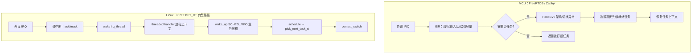
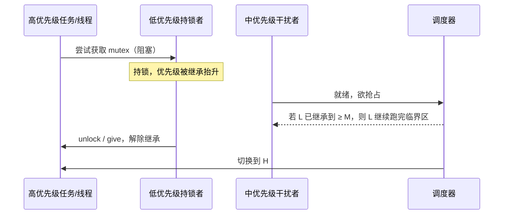
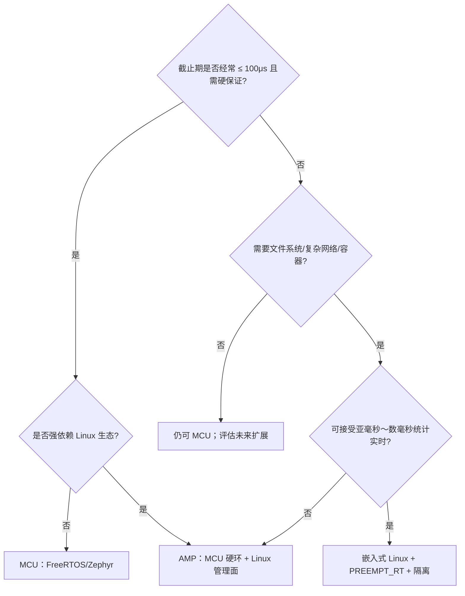

# MCU 上 FreeRTOS 够用还是上 PREEMPT_RT？嵌入式实时从中断到调度对照讲透

电流环偶发超 80 μs、网关采集线程 P99 抖到 5 ms、换了「实时 Linux」后 cyclictest Max 仍上千微秒——三类现场都在问同一句话：**MCU 上 FreeRTOS/Zephyr 够用，还是该上带 PREEMPT_RT 的嵌入式 Linux？** 很多人只比「谁更实时」，却跳过中断上下文长度、Tickless 对抖动的影响、优先级继承是否真正打开、Linux 侧 threaded IRQ 与 `SCHED_FIFO` 是否同核竞争。结果是：MCU 上关中断过久把控制环拖死，或 Linux 上只 `chrt -f 99` 却从未用 cyclictest 在隔离核上验收。

本文合并源归属 **实时系统/chapters/073～078-嵌入式实时***（核心概念、实现机制、关键技术、源码级分析、配置使用、常见问题），按 **中断 → 任务/线程调度 → Tickless 与定时 → 优先级继承 → Linux RT 验收 → 选型边界** 六层对照讲透。与已发的「实时 Linux / PREEMPT_RT」专篇交叉时：**本文主轴是 RTOS↔Linux 对照与选型**；PREEMPT_RT 细调（isolcpus、IRQ 亲和）以专篇为准。符号与路径以各上游树为准；芯片相关中断优先级、BASEPRI 行为等不确定处标 **「以平台手册为准」**。

---

## 阅读地图

| 层 | 主问题 | 读完能做什么 |
|----|--------|--------------|
| 一、指标与边界 | 硬/软实时差在哪、MCU 与 Linux 量级差多少 | 先写清截止期再选型，不空喊「要硬实时」 |
| 二、中断到调度 | FreeRTOS/Zephyr 与 Linux 从 IRQ 到切任务怎么走 | 画出本项目的 ISR/任务边界，控制临界区 |
| 三、任务模型与优先级 | 优先级位图、就绪队列、同优级轮转差在哪 | 配齐任务优先级与 ISR 优先级，避免反转 |
| 四、Tickless 与定时 | 关 tick 省电会怎样伤抖动 | 控制环绑硬件定时器还是软件 tick |
| 五、Linux RT 验收 | `SCHED_FIFO`、threaded IRQ、cyclictest 如何闭环 | 在目标板上复现延迟直方图 |
| 六、选型边界 | 何时留在 MCU RTOS、何时上 Linux、何时 AMP | 给出可评审的架构结论 |

**源码锚点（对照用，勿混树）**

| 栈 | 路径 / 符号 | 作用 |
|----|-------------|------|
| FreeRTOS | `tasks.c`：`xTaskCreate`、`vTaskSwitchContext`、`vTaskPriorityInherit` | 任务创建、切上下文、优先级继承 |
| FreeRTOS | `queue.c`：互斥量 take/give 路径 | 继承触发与解除 |
| FreeRTOS | `portable/.../port.c`、`portmacro.h`：`portENTER_CRITICAL`、`PendSV`/`SysTick` | 临界区与架构相关切换 |
| FreeRTOS | `FreeRTOSConfig.h`：`configUSE_TICKLESS_IDLE`、`configUSE_MUTEXES` | Tickless / 互斥量开关 |
| Zephyr | `kernel/sched.c`、`include/zephyr/kernel.h`：`k_thread_create`、`k_mutex_lock` | 线程与互斥 |
| Zephyr | `kernel/timeout.c`、`CONFIG_TICKLESS_KERNEL` | 超时与 Tickless |
| Zephyr | `arch/*/core/isr_wrapper*`、`IRQ_CONNECT` | 中断注册与包装 |
| Linux | `kernel/sched/rt.c`：`pick_next_task_rt` | `SCHED_FIFO`/`RR` 选任务 |
| Linux | `kernel/locking/rtmutex.c` | RT mutex / PI |
| Linux | `kernel/irq/manage.c`：`request_threaded_irq`、`irq_thread` | 线程化中断 |
| Linux | `kernel/Kconfig.preempt`：`CONFIG_PREEMPT_RT` | 全抢占模型 |
| Linux | `tools/testing/selftests/rt-tests/cyclictest.c`（或发行版 `rt-tests`） | 唤醒延迟测量 |

---

## 一、先把指标钉死：硬实时、软实时与量级对照

### 1.1 截止期不是「越快越好」

硬实时：错过截止期视为系统失效（安全相关控制环、部分工业总线周期）。软实时：错过会降质但可容忍（UI、音视频缓冲、部分采集网关）。嵌入式项目里最常见的错误是：**把「平均延迟很低」当成「最坏延迟可控」**。MCU RTOS 的价值主要在 **最坏执行时间（WCET）可分析空间更小**；Linux（即便 PREEMPT_RT）价值在 **生态、文件系统、网络栈、多核与复杂协议**，最坏延迟通常只能用统计与隔离手段压低，而非形式化硬保证。

对照表（量级为工程经验区间，具体板级以实测为准）：

| 维度 | FreeRTOS / Zephyr（MCU） | 嵌入式 Linux + PREEMPT_RT |
|------|--------------------------|---------------------------|
| 典型控制环周期 | 数十 μs～数 ms | 数百 μs～数十 ms（隔离后可压） |
| 中断顶半部 | 常直接在 ISR 做短处理 | 顶半部宜短，慢路径进 threaded IRQ |
| 调度延迟 | 微秒级常见 | 数十～数百 μs 常见；尖刺需治理 |
| 内存/Flash | KB～数百 KB 级 | 数十 MB 起更现实 |
| 证明手段 | WCET、静态优先级分析、硬件追踪 | cyclictest、ftrace、latencytop |

### 1.2 选型前必须写清的三行需求

写进评审材料即可，不必长篇：

1. **周期与截止期**：例如「PWM 电流环 10 kHz，ISR+控制计算合计 WCET ≤ 40 μs」。
2. **抖动预算**：例如「P99 ≤ 5 μs，绝对禁止超过 80 μs」。
3. **非实时负载**：是否需要文件系统、TLS、容器、复杂 UI——这决定能否纯 MCU。

若第 1、2 条落在「数十微秒硬保证」且无复杂 OS 需求，**优先 MCU RTOS**；若第 3 条很重且截止期在「亚毫秒～数毫秒软/准硬」区间，再评估 **Linux + PREEMPT_RT** 或 **AMP（MCU 硬环 + Linux 管理面）**。

### 1.3 与「实时」无关却常被当成实时问题的噪声

- Flash 擦写、文件系统 sync、日志刷盘（Linux 侧尤甚）。
- 调试口半主机（semihosting）、频繁 `printf`。
- 动态内存分配在关键路径（FreeRTOS heap、Linux page fault）。
- 电源管理：MCU 深睡眠唤醒、Linux C-state / cpufreq。

这些不进调度器源码，却能把延迟尖刺抬一个数量级。排障顺序应是：**先排除 I/O 与电源，再查调度与中断**。

---

## 二、从中断到调度：两条调用链对照

### 2.1 总览：MCU RTOS vs Linux RT



读图要点：MCU 上「中断直接驱动就绪队列」路径短；Linux 上为降低硬中断内长临界区，常把慢路径推到 **irq 线程**，再唤醒用户态/内核线程——多一跳换来的是可抢占与可阻塞，但同核竞争与线程优先级配置错误会反过来拉高延迟。

### 2.2 FreeRTOS：SysTick / PendSV 与临界区

典型 Cortex-M 移植（路径因厂商 port 而异，逻辑一致）：

```text
外设 ISR
  → 置事件 / xQueueSendFromISR / xSemaphoreGiveFromISR
  → portYIELD_FROM_ISR（若更高优先级任务就绪）
  → PendSV_Handler
  → vTaskSwitchContext（tasks.c）
  → 恢复最高优先级就绪 TCB
```

周期心跳常由 SysTick（或厂商 tick 源）触发 `xPortSysTickHandler` → 递增 tick、检查延时链表、可能请求切换。临界区宏：

```c
/* include/task.h → portmacro.h（以具体 port 为准） */
#define taskENTER_CRITICAL()    portENTER_CRITICAL()
#define taskEXIT_CRITICAL()     portEXIT_CRITICAL()
```

在 Cortex-M 上，`portENTER_CRITICAL` 常见实现是抬高 `BASEPRI` 屏蔽可配置优先级的中断，而不是无脑关全局中断——**具体屏蔽哪些 IRQ，以平台手册与所用 port 为准**。工程含义：ISR 若优先级高于 `configMAX_SYSCALL_INTERRUPT_PRIORITY`，则 **不能** 调用带 FromISR 的 API；违反会表现为偶发 HardFault 或队列损坏。

### 2.3 Zephyr：IRQ_CONNECT 与调度点

Zephyr 用 `IRQ_CONNECT` / `irq_connect_dynamic` 把 ISR 挂到向量表，包装层负责调用用户 ISR。ISR 内通常只做短工作，通过 `k_sem_give`、`k_msgq_put` 等唤醒线程；退出中断路径上若发现需要重调度，则进入架构相关的 switch。互斥与线程 API 在 `include/zephyr/kernel.h`，调度实现集中在 `kernel/sched.c`（符号随版本演进，读码时以当前树为准）。

与 FreeRTOS 对照时记住三点：

1. Zephyr 更强调 **设备树 + Kconfig** 配置中断与 tick；FreeRTOS 更常见手写 `FreeRTOSConfig.h`。
2. Zephyr 的线程优先级数值约定（数字大/小谁更高）与 FreeRTOS **相反方向的习惯差异** 容易配错——以所用版本文档为准。
3. 两者都支持协作式让出与抢占；控制环任务应避免在关键路径里长时间关调度。

### 2.4 Linux：硬中断 → threaded IRQ → RT 任务

主线路径（PREEMPT_RT 下尤为重要）：

```text
设备 IRQ
  → arch 入口 → handle_irq_event
  → 若 threaded：硬中断仅 ack/mask + wake irq_thread
  → kernel/irq/manage.c：irq_thread 跑 thread_fn
  → wake_up / 完成 → 业务 SCHED_FIFO 线程就绪
  → schedule → kernel/sched/rt.c：pick_next_task_rt
  → context_switch
```

注册接口：

```c
/* kernel/irq/manage.c */
int request_threaded_irq(unsigned int irq,
			 irq_handler_t handler,
			 irq_handler_t thread_fn,
			 unsigned long flags,
			 const char *name, void *dev);
```

`handler` 顶半部应短；`thread_fn` 可睡眠、可拿 mutex。启动参数 `threadirqs`（配合 `CONFIG_IRQ_FORCED_THREADING`）可强制更多 IRQ 线程化——是否适合某驱动，**以驱动是否声明 `IRQF_NO_THREAD` 及厂商说明为准**。查看：

```bash
cat /proc/interrupts
ps -eLo pid,tid,class,rtprio,comm | grep -E 'irq/|IRQ'
```

若 `irq/NN-foo` 与业务 `SCHED_FIFO` 同核且优先级不当，会出现「开了 RT 内核，延迟仍尖刺」的典型假象。

### 2.5 中断上下文长度：用预算表钉死边界

不要用空话条目堆砌；用一张预算表钉死：

| 路径 | 允许做什么 | 禁止做什么 |
|------|------------|------------|
| MCU ISR（短） | 清标志、DMA 描述符推进、FromISR 入队 | 浮点重计算、Flash 擦、阻塞锁 |
| MCU 任务 | 控制算法、协议状态机 | 无限关临界区 |
| Linux hardirq | ack、mask、wake thread | 长循环、阻塞 |
| Linux irqthread / RT 任务 | 协议与计算 | 无界自旋、文件系统同步路径 |

---

## 三、任务 / 线程模型与优先级继承

### 3.1 FreeRTOS 就绪队列与同优先级

`tasks.c` 中就绪结构本质是 **按优先级分桶的链表 + 就绪位图**（具体成员名随版本略有差异）。调度策略：永远跑 **当前最高优先级上的就绪任务**；同优先级默认时间片轮转（若开启）。创建：

```c
BaseType_t xTaskCreate(TaskFunction_t pxTaskCode,
                       const char * const pcName,
                       const configSTACK_DEPTH_TYPE usStackDepth,
                       void *pvParameters,
                       UBaseType_t uxPriority,
                       TaskHandle_t *pxCreatedTask);
```

优先级范围由 `configMAX_PRIORITIES` 决定。常见坑：把「业务重要」直接设成最高，却压过定时器守护或通信任务，导致队列堆积。建议分层：**硬件相关最快响应 > 控制周期任务 > 通信 > 日志**，数字落差要留余量给 ISR 触发的紧急任务。

### 3.2 Zephyr 线程与协作点

```c
k_tid_t k_thread_create(struct k_thread *new_thread,
                        k_thread_stack_t *stack,
                        size_t stack_size,
                        k_thread_entry_t entry,
                        void *p1, void *p2, void *p3,
                        int prio, uint32_t options, k_timeout_t delay);
```

超时统一走 `kernel/timeout.c` 与系统 tick/Tickless 子系统。`k_mutex_lock` 在开启优先级继承相关 Kconfig 时会抬升持锁线程优先级（选项名随版本，以当前 `Kconfig` 为准）。与 FreeRTOS 对照：**都是静态优先级抢占内核**；差异在配置入口（Kconfig vs `FreeRTOSConfig.h`）和驱动模型（西风设备模型 vs 裸机驱动习惯）。

### 3.3 优先级反转与继承：RTOS ↔ Linux 同构问题

经典场景：高优先级 H 等互斥量，低优先级 L 持锁，中优先级 M 抢跑 L → H 间接被 M 阻塞。FreeRTOS 在 `configUSE_MUTEXES` 与继承相关配置打开后，`queue.c` 路径会调用 `vTaskPriorityInherit`：

```c
/* tasks.c（逻辑概要，以树内实现为准） */
#if ( configUSE_MUTEXES == 1 )
void vTaskPriorityInherit( TaskHandle_t const pxMutexHolder );
#endif
```

Linux 侧对应 **rt_mutex 优先级继承**（`kernel/locking/rtmutex.c`）。PREEMPT_RT 下大量原 spinlock 变为可睡眠锁，PI 路径对延迟尾部影响更大：持锁低优先级线程会被临时抬升，减少「锁持有者被中等优先级饿死」导致的尖刺。

工程注意：

- FreeRTOS：**二进制信号量不继承**；要用互斥量才走继承。混用会「以为开了 PI，实际没有」。
- Linux：普通 `mutex` 与 `rt_mutex` 行为在 RT/非 RT 内核上表现不同；业务关键路径优先明确锁类型。
- 继承不能解决 **锁持有时间过长**——PI 只是缓解反转，不是许可证。

### 3.4 调用链：拿锁反转时调度如何介入



对照验证手段：MCU 上用 GPIO 翻转 + 逻辑分析仪看「H 等待时长」；Linux 上用 `cyclictest` 叠加人为中等负载，对比开/关 PI 或换锁类型前后的 Max。

---

## 四、Tickless：省电与抖动的权衡

### 4.1 FreeRTOS Tickless Idle

`FreeRTOSConfig.h`：

```c
#define configUSE_TICKLESS_IDLE    1
```

空闲时停止周期性 SysTick，睡到「下一个超时」再补偿 tick 计数（`vPortSuppressTicksAndSleep` 一类 port 函数）。收益是功耗；代价是：

- 唤醒源与晶振稳定时间引入抖动；
- 补偿算法误差在长时间睡眠后放大；
- 若控制环依赖「每 tick 醒来」，Tickless 会直接破坏周期确定性。

**控制环任务应绑定硬件定时器中断或高精度定时，而不是假设 tick 永远匀速。** 是否启用 Tickless、浅睡/深睡水位，**以平台手册与功耗测试为准**。

### 4.2 Zephyr Tickless Kernel

`CONFIG_TICKLESS_KERNEL=y` 时，系统按下一超时编程硬件计数器，而非固定周期 tick。`kernel/timeout.c` 管理超时队列。与 FreeRTOS 同构结论：**通信/人机空闲场景适合 Tickless；硬周期控制优先独立硬件定时源。**

### 4.3 Linux：`nohz_full` 与 RT 测量

Linux 的 `nohz_full=` 让指定 CPU 在仅有一个可运行任务时关闭调度时钟滴答，降低干扰。与 RT 搭配时常和 `isolcpus`、`rcu_nocbs` 一起出现。注意：

- 关闭 tick ≠ 保证低延迟；错误隔离反而让远核 IPI、RCU 回调堆积。
- cyclictest 应在 **最终部署的同款隔离参数** 下跑，否则测的是另一套系统。

```bash
# 示例启动参数片段（按板级裁剪，以手册与发行版文档为准）
isolcpus=2,3 nohz_full=2,3 rcu_nocbs=2,3
```

### 4.4 定时源选型对照

| 需求 | MCU 建议 | Linux 建议 |
|------|----------|------------|
| 硬周期 ≤ 100 μs | 硬件 TIM + ISR/任务分工 | 慎用；考虑 MCU 侧或 FPGA |
| 软周期 1～10 ms | 任务 `vTaskDelayUntil` / `k_timer` | `clock_nanosleep` + `SCHED_FIFO` + hrtimer |
| 省电为主 | Tickless + 事件唤醒 | `nohz` + 运行时 PM，但先测延迟 |

`vTaskDelayUntil` 相对 `vTaskDelay` 更能保持相位；Linux 侧用绝对时间 `TIMER_ABSTIME` 同理——cyclictest 正是按绝对时间睡眠测偏差。

---

## 五、Linux 侧：SCHED_FIFO、threaded IRQ 与 cyclictest 闭环

### 5.1 调度策略：别只记「99 最高」

```c
/* include/uapi/linux/sched.h 逻辑 */
SCHED_NORMAL  /* CFS */
SCHED_FIFO    /* 实时，无时间片，同优级 FIFO */
SCHED_RR      /* 实时，有时间片 */
SCHED_DEADLINE /* EDF + CBS，另文专题 */
```

用户态设置：

```bash
chrt -f 80 ./control_app
# 或 pthread_setschedparam / sched_setscheduler
```

内核选路：`kernel/sched/rt.c` 的 `pick_next_task_rt` 在 per-CPU RT runqueue 上按优先级取最高。默认还有 **RT 运行时节流**（`kernel.sched_rt_runtime_us` / `sched_rt_period_us`），防止 RT 任务饿死系统——调试时若感觉「FIFO 跑一会被掐」，先查节流再查业务。

PREEMPT_RT（`kernel/Kconfig.preempt`）缩短不可抢占窗口，把多数 spinlock 变为可睡眠锁；它 **不自动** 把你的进程变成实时进程，也不替代 CPU 隔离。

### 5.2 threaded IRQ 与业务线程的优先级关系

推荐关系（需按负载微调）：

```text
硬中断顶半部（最短）
  < irq_thread 优先级（应足够高以快速完成设备事务）
  ≤ 或略低于 关键控制 SCHED_FIFO 线程
  > 普通 CFS 任务 / 日志
```

若 irq_thread 优先级过低，设备事件在线程里排队，业务线程再快也无数据；过高则可能抢占控制线程导致计算抖动。用：

```bash
chrt -p $(pgrep -f 'irq/.*(eth|spi|can)')
```

查看并调整（部分发行版用 `irqbalance` 会改亲和，RT 场景常禁用或钉死）。

### 5.3 cyclictest：测的是什么

cyclictest（`rt-tests` / 主线 `tools/testing/selftests/rt-tests/cyclictest.c`）循环绝对时间睡眠，统计 **实际唤醒 − 期望唤醒**。它测的是 **定时器唤醒路径延迟**，不是你的业务算法 WCET。用法示例：

```bash
# 在隔离核上、FIFO 高优先级、直方图
cyclictest -a 2 -t 1 -n -p 90 -i 1000 -l 100000 -m -q
# -a CPU  -p 优先级  -i 间隔(us)  -m mlockall  -h 直方图桶宽
```

解读：

- **Max** 才是实时验收关键；Avg 好看没有意义。
- 同一板子：默认内核 vs PREEMPT_RT、是否 `isolcpus`、是否压磁盘，Max 可差一个数量级。
- 业务验收应另写「业务截止期探针」（GPIO 翻转或时间戳环），与 cyclictest **同时** 看，避免「系统延迟好、业务仍 miss」。

### 5.4 可复现的最小实验矩阵

| 实验 | 操作 | 观察 |
|------|------|------|
| A 基线 | 发行版默认内核，cyclictest 不绑核 | Max 往往数百 μs～ms |
| B RT | PREEMPT_RT 内核，同命令 | Max 下降但仍有尖刺 |
| C 隔离 | +isolcpus/nohz_full，绑核 -a | Max 进一步收敛 |
| D 干扰 | 同核跑 `dd`/`hackbench` | 无隔离时 Max 爆炸；有隔离应仍稳 |
| E 业务 | 开真实驱动与网络 | 对照 irq 亲和与优先级 |

实验 C→E 才接近产线；停在 B 就宣称「已实时」是常见误判。

### 5.5 与 FreeRTOS 测量手段的对照

| 目标 | MCU | Linux |
|------|-----|-------|
| 调度/中断延迟 | DWT 周期计数、逻辑分析仪、SEGGER SystemView | cyclictest、ftrace、`osnoise` |
| 业务 WCET | 关中断测段、静态分析（以工具链为准） | 用户态时间戳 + TRACE_EVENT |
| 优先级反转 | 人为插入中优先级任务 | 同核 CFS 干扰 + PI 开关对比 |

---

## 六、选型边界：够用、不够用、该拆分

### 6.1 决策树



### 6.2 典型场景落点

| 场景 | 更合适 | 理由 |
|------|--------|------|
| 电机 FOC 电流环 | MCU RTOS | 周期短、WCET 可钉死 |
| 机器人全身协调 + ROS 2 | Linux RT 或混合 | 生态与多核；关节硬环可下放 MCU |
| 工业网关 Modbus/TCP + 轻采集 | Linux 或 Zephyr | 看协议栈与 RAM；硬实时点不多时可 Linux |
| 电池传感器节点 | Zephyr/FreeRTOS + Tickless | 功耗与体积 |
| 车载仪表 + 部分控制 | 常 AMP/多核异构 | HMI 与安全域隔离，**以功能安全流程与平台手册为准** |

### 6.3 「FreeRTOS 够用」的充要条件（工程表述）

同时满足再坚持纯 MCU：

1. 截止期与抖动预算在 MCU 中断+任务模型内可证明或可测。
2. 无强制 Linux 唯一生态依赖（或可接受协议瘦身移植）。
3. Flash/RAM 余量覆盖最坏栈与队列。
4. 团队能维护驱动与安全启动，而不是只有应用层人力。

任一长期不满足，评估 Linux 或 AMP，而不是继续加「更高优先级任务」硬扛。

### 6.4 「必须上 PREEMPT_RT」的信号

- 已确定用 Linux，且默认/`PREEMPT` 内核下 cyclictest Max 无法进入预算。
- 存在可阻塞的驱动慢路径，必须靠 threaded IRQ + 可抢占锁缩短尾延迟。
- 多线程实时负载需要 PI 与统一调度可见性。

反过来：**不是**「听说 RT 就换内核」。无隔离、无 mlock、业务狂刷盘时，PREEMPT_RT 也救不了 Max。

### 6.5 AMP 拆分接口要先定

MCU↔Linux 常见桥：RPMsg、共享内存环、硬件邮箱、PCIe/网络。接口契约至少包含：周期、字节序、超时、双方优先级与看门狗。实时性在桥上会再加一跳延迟——预算表必须把桥延迟算进去，而不是只测两端本地。

---

## 七、配置与落地要点（按栈分开）

### 7.1 FreeRTOSConfig 关键项

```c
#define configMAX_PRIORITIES                 8
#define configUSE_PREEMPTION                 1
#define configUSE_MUTEXES                    1
#define configUSE_TIMERS                     1
#define configUSE_TICKLESS_IDLE              0   /* 控制产品先关，功耗产品再评估 */
#define configCHECK_FOR_STACK_OVERFLOW       2
#define configUSE_MALLOC_FAILED_HOOK         1
/* configMAX_SYSCALL_INTERRUPT_PRIORITY：以所用 port 与芯片手册为准 */
```

栈溢出检测与 malloc 失败钩子能把「偶发复位」变成可定位事件。定时器守护任务优先级勿低于依赖软件定时器的通信任务。

### 7.2 Zephyr Kconfig 方向

- `CONFIG_PREEMPT_ENABLED`、线程优先级范围；
- `CONFIG_TICKLESS_KERNEL` 与电源相关选项；
- 互斥/优先级继承相关选项（名称随版本，读 `Kconfig`）；
- 驱动 IRQ 优先级在设备树或板级文件中的数值，**以 SoC 手册为准**。

### 7.3 Linux 启动与运行时

```bash
# 确认抢占模型
zcat /proc/config.gz 2>/dev/null | grep PREEMPT
grep PREEMPT /boot/config-$(uname -r)

# RT 带宽（调试时可临时放宽，生产需评估）
sysctl kernel.sched_rt_runtime_us
sysctl kernel.sched_rt_period_us

# 业务：锁内存、绑核、FIFO
ulimit -l unlimited
```

应用侧：`mlockall(MCL_CURRENT|MCL_FUTURE)`、避免关键路径 `malloc`/缺页、日志异步化。内核侧：IRQ 亲和、禁用非必要的 `irqbalance` 乱动、慎重 cpufreq。

### 7.4 双栈对照调试口令

| 现象 | MCU 先查 | Linux 先查 |
|------|----------|------------|
| 周期偶尔拉长 | ISR 过长、临界区、同优级任务 | 同核 IRQ/kworker、C-state、未 mlock |
| 高优先级像被卡住 | 是否用了无继承的 semaphore、谁持锁 | rt_mutex/PI、RT throttling |
| 一开省电就抖 | Tickless/深睡唤醒 | nohz + idle 状态退出延迟 |
| 测着很好、量产差 | 编译优化/断言宏差异 | 发行版内核选项、后台服务 |

---

## 八、源码级阅读路径（跟着符号走）

### 8.1 FreeRTOS：一次切换读哪些函数

1. `xTaskResumeAll` / `vTaskSuspendAll`：临界与调度锁。
2. `xTaskIncrementTick`：tick 前进、延时唤醒。
3. `vTaskSwitchContext`：选最高优先级 TCB。
4. `vTaskPriorityInherit` / `xTaskPriorityDisinherit`：与 `queue.c` 互斥路径交叉阅读。
5. port 层 `PendSV_Handler`：真正换寄存器与 PSP。

建议打印或 Trace：任务名、优先级、切换原因（tick / yield / ISR）。SystemView 一类工具可把 ISR→任务因果连成时间线。

### 8.2 Zephyr：一次唤醒读哪些点

1. ISR 内 `k_sem_give` → 等待线程入就绪。
2. `z_swap` / 架构 switch（名称随 arch）。
3. `k_mutex_lock` 竞争路径与优先级变化。
4. timeout 到期如何把线程重新就绪。

### 8.3 Linux：从 cyclictest 反查内核

1. 用户态 `clock_nanosleep` → hrtimer（`kernel/time/hrtimer.c`）。
2. 到期 `try_to_wake_up` → RT enqueue。
3. `pick_next_task_rt` → `context_switch`。
4. 若中间穿插 irq_thread，用 ftrace：`irq_handler_entry`、`sched_switch`。

```bash
trace-cmd record -e irq:irq_handler_entry -e sched:sched_switch -e timer:* sleep 2
trace-cmd report | head -100
```

把「尖刺时刻」对齐到具体 IRQ 或进程，比空谈「内核不够实时」有效。

---

## 九、常见问题：对照着修

### 9.1 MCU：FromISR API 用错优先级

症状：随机 HardFault、队列计数错乱。原因：过高优先级 ISR 调了未允许的 FreeRTOS API。处理：按 port 文档调整 NVIC 优先级分组与 `configMAX_SYSCALL_INTERRUPT_PRIORITY`，**以芯片手册优先级数含义为准**（有的厂商数字越大优先级越低）。

### 9.2 MCU：栈溢出只在优化版出现

`configCHECK_FOR_STACK_OVERFLOW` 在调试态抓住、量产关检测后静默踩内存。处理：保留水位钩子或外部看门狗 + 栈漆花模式；关键任务栈按最坏调用链留余量。

### 9.3 Linux：chrt 了但 Max 不动

常见原因：未 RT 内核、未隔离、测量线程与干扰同核、未 `mlockall`、图形/网卡 IRQ 钉在同核。按第五节实验矩阵 A→D 逐步加条件，不要一次改十个参数。

### 9.4 Linux：threaded IRQ 后吞吐下降

线程化增加调度次数；吞吐敏感设备可能需要保留短硬中断路径或 `IRQF_NO_THREAD`。实时与吞吐是不同目标，验收指标分开写。

### 9.5 两边都常见：动态分配在实时路径

FreeRTOS `pvPortMalloc` 与 Linux 缺页都会引入不可控延迟。关键路径改静态池或启动期预分配。

### 9.6 「优先级越高越好」综合症

结果是日志任务饿死、看门狗误判、调试困难。优先级是稀缺资源，按延迟预算分层，而不是按部门话语权分层。

---

## 十、把对照落成可执行步骤

### 10.1 新项目第一周

1. 写出截止期、抖动预算、非实时负载三行需求。
2. 用第六节决策树得到候选架构（MCU / Linux RT / AMP）。
3. 在候选平台上跑通「最小周期探针」（GPIO 或时间戳），先不接业务。
4. MCU 候选：确认 ISR 优先级与 FromISR 规则；Linux 候选：确认能否刷 PREEMPT_RT 并跑 cyclictest。

### 10.2 进入业务后的回归节奏

- 每次改中断或锁协议，重测最坏路径。
- Linux：保留一份「隔离参数 + cyclictest 命令 + Max 基线」随版本存档。
- MCU：保留 SystemView/逻辑分析仪截图基线，防止「优化编译」偷偷拉长路径。

### 10.3 文档里应出现的锚点句（评审可用）

- 「控制环在 TIM ISR/任务，截止期 xx μs，已关 Tickless。」
- 「Linux 业务线程 `SCHED_FIFO` prio=xx，绑核 x，IRQ yy 亲和到 z，cyclictest Max=aa μs（N 次）。」
- 「跨核桥延迟预算 bb μs，已计入总截止期。」

没有这些句子的「我们用了实时系统」无法评审。

---

## 十一、重点知识压缩对照

### 11.1 中断

- MCU：ISR 短、FromISR 入队、架构切换异常切任务。
- Linux：硬中断短、threaded 慢路径、再唤醒 FIFO 线程。

### 11.2 调度

- 两者关键路径都是静态优先级；同优级策略细节不同。
- Linux 多了 CFS 背景海量任务与 RT throttling，必须隔离与配置。

### 11.3 锁与继承

- FreeRTOS：互斥量才 PI；信号量不继承。
- Linux：rt_mutex PI；PREEMPT_RT 扩大可睡眠锁覆盖面。

### 11.4 Tickless

- 省电友好、硬周期不友好；控制环绑定硬件定时源。

### 11.5 验收

- MCU：WCET + 硬件追踪。
- Linux：cyclictest Max + 业务探针 + 干扰矩阵。

### 11.6 选型

- 硬微秒级 → MCU 或 AMP。
- 亚毫秒～毫秒 + 重生态 → Linux + PREEMPT_RT。
- 不要用「口号式实时」替代预算表。

---

## 十二、与源章节 073～078 的映射

| 源章节 | 本文落点 |
|--------|----------|
| 073 核心概念与原理 | 第一层指标；硬/软实时与量级表 |
| 074 实现机制 | 第二层中断→调度调用链；Mermaid 总览 |
| 075 关键技术 | Tickless、优先级继承、threaded IRQ、cyclictest |
| 076 源码级分析 | 第八层符号阅读路径与 ftrace |
| 077 配置与使用 | 第七层 FreeRTOSConfig / Kconfig / sysctl |
| 078 常见问题 | 第九层对照排障 |

源章节原稿多为领域模板骨架；本文按工程可验证内容重写并补全 RTOS↔Linux 对照，避免空概念重复。细节以 **FreeRTOS 内核源码、Zephyr 当前 LTS 文档、Linux 主线（含 PREEMPT_RT）与具体 SoC 手册** 为准；凡涉及 NVIC 优先级编码、深睡唤醒时长、厂商闭源驱动是否允许线程化 IRQ 等，文中已标或在此统一提醒：**以平台手册为准**。

---

## 十三、实践附录：两段最小探针

### 13.1 FreeRTOS 周期任务相位（示意）

```c
void vControlTask(void *arg)
{
    TickType_t xLast = xTaskGetTickCount();
    const TickType_t xPeriod = pdMS_TO_TICKS(1); /* 1ms 示例；硬环请改硬件定时 */

    for (;;) {
        /* 控制计算：禁止在此 malloc / 长临界区 */
        DoControlStep();
        vTaskDelayUntil(&xLast, xPeriod);
    }
}
```

硬实时电流环请改为 **定时器 ISR 置标志 + 高优先级任务等待**，或 ISR 内短计算——取舍 **以平台手册与电磁噪声/执行时间实测为准**。

### 13.2 Linux FIFO 周期线程（示意）

```c
/* 编译时链接 -lpthread；运行前 chrt/绑核/mlock 按第五节 */
void *rt_loop(void *arg)
{
    struct timespec next;
    clock_gettime(CLOCK_MONOTONIC, &next);

    for (;;) {
        next.tv_nsec += 1000 * 1000; /* 1ms */
        if (next.tv_nsec >= 1000000000L) {
            next.tv_nsec -= 1000000000L;
            next.tv_sec++;
        }
        clock_nanosleep(CLOCK_MONOTONIC, TIMER_ABSTIME, &next, NULL);
        DoControlStep();
    }
    return NULL;
}
```

用同一 `DoControlStep` 在两套 OS 上对比「调度唤醒抖动」时，才能公平谈论 FreeRTOS 与 PREEMPT_RT，而不是拿不同算法比延迟。

### 13.3 Zephyr 侧等价思路

使用 `k_timer` 或 `k_thread` + `k_sleep` 绝对到期逻辑（API 以当前版本文档为准），同样坚持：**探针与业务截止期分离测量**，先证明调度器抖动，再叠加驱动与协议。

---

## 十四、架构复盘：为什么对照要比「单栈深挖」优先

团队若只深挖 PREEMPT_RT，会把本该放 MCU 的环硬塞进 Linux，然后用越来越多的 isolcpus/屏蔽 IRQ 掩盖架构错误；若只深挖 FreeRTOS，会把文件系统、TLS、复杂 UI 全堆进 MCU，最后在 Flash 寿命与协议合规上崩溃。对照文的目标不是和稀泥，而是：

1. 用同一套词汇（截止期、抖动、临界区、PI、Tickless、验收 Max）描述两边；
2. 用同一张预算表决定功能放哪一侧；
3. 用可复现命令与源码锚点让评审可证伪。

当预算表显示「环在 MCU、管理在 Linux」时，AMP 不是折中偷懒，而是把两类最优模型拼在真实截止期上。当预算表显示「全部在亚毫秒且强依赖 Linux 生态」时，上 PREEMPT_RT 并做隔离，而不是因为 MCU「更实时」就拒绝 Linux。

---

## 十五、延迟预算表示例（可直接贴进设计说明）

假设采集+轻控制网关，目标周期 1 ms，抖动预算 P99 ≤ 100 μs，绝对 Max ≤ 300 μs：

| 项 | 分配 | 备注 |
|----|------|------|
| 传感器 SPI 事务 | 80 μs | DMA + 短 ISR |
| 协议解析 | 60 μs | 任务上下文 |
| 控制计算 | 40 μs | 无动态分配 |
| 调度/OS 抖动预留 | 50 μs | MCU 更宽裕；Linux 需隔离证明 |
| 日志/后台 | 0（禁入周期） | 异步队列 |
| 合计 | 230 μs | 仍低于 300 μs Max |

若 Linux cyclictest 在目标核 Max 已 200 μs，则「调度预留 50 μs」不成立——要么继续削 Linux 延迟，要么把 SPI+控制下放到 MCU。预算表逼出架构决策，避免口头争论。

另一例：纯 MCU 电机环 50 μs 周期，计算 25 μs，ISR 清标志 2 μs，调度 5 μs，余量 18 μs——此时上 Linux 几乎必然破坏余量，除非 AMP。

---

## 十六、优先级数字怎么落（避免口头「再调高一点」）

### 16.1 FreeRTOS 示例分层（数字越大越高，以配置为准）

| 优先级带 | 用途 |
|----------|------|
| 最高 | 极短紧急任务（故障锁定、安全停机） |
| 高 | 控制周期任务、关键通信接收 |
| 中 | 协议状态机、非关键通信 |
| 低 | 日志、统计、Flash 写入 |
| 空闲 | Idle / Tickless 入口 |

ISR 优先级（NVIC）与任务优先级是两套数字空间，必须分开画表；只调任务优先级解决不了「ISR 被同优级外设拖住」。

### 16.2 Linux 示例分层

| 范围 | 用途 |
|------|------|
| 90～99 | 慎用；留给真正截止期最紧的线程 |
| 70～89 | 控制/采集主线程 |
| 50～69 | irq_thread（按设备调） |
| CFS | 日志、包管理、无关服务 |

部分发行版对非 root 的 RT 优先级有 `RLIMIT_RTPRIO` 限制；容器场景还受 cgroup cpu 控制器影响——**以运行时环境文档为准**。

---

## 十七、结束前的对照结论

**MCU 上 FreeRTOS/Zephyr「够不够」**，看截止期能否在中断与任务模型里被测量和维持，不看营销词「实时操作系统」本身。**该不该上 PREEMPT_RT**，看你是否已经站在 Linux 生态里、且默认抢占模型无法把 Max 压进预算，并愿意做隔离与测量闭环。中间地带用 AMP，把硬环与富生态拆开，用明确的桥延迟预算连接。

从中断到调度，两边同构点是：短顶半部、可分析的临界区、正确的锁与 PI、独立于省电路径的周期源、用 Max 而非 Avg 验收。差异点是：MCU 用极简调度换可证明性；Linux 用复杂子系统换能力，必须用 PREEMPT_RT、threaded IRQ、`SCHED_FIFO` 与 cyclictest 把尾延迟从「不可见」变成「可治理」。

合并源：`articles/实时系统/chapters/073-嵌入式实时核心概念与原理.md` 至 `078-嵌入式实时的常见问题与解决方案.md`。本文面向选型与对照落地；PREEMPT_RT 参数深挖、CFS 细节、SCHED_DEADLINE 专题见仓库内已有实时 Linux / 调度专篇。

（全文完）
