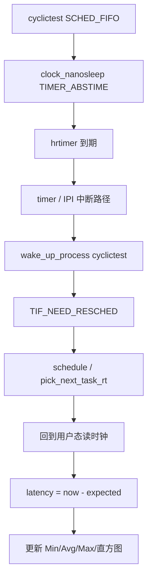
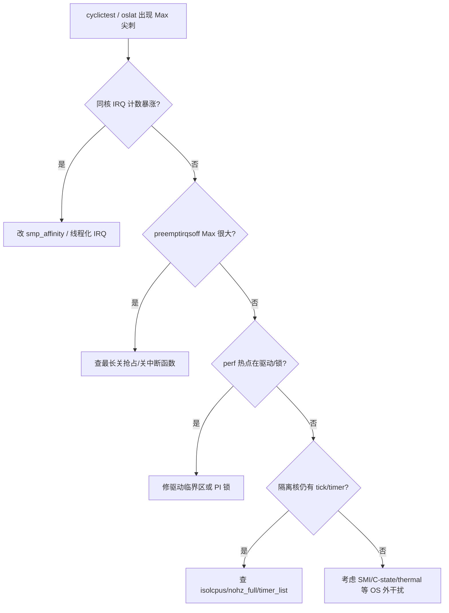

# cyclictest 毛刺从哪来？从 ftrace、latencytop、perf 到 IRQ/调度延迟定位

空载 **cyclictest Max 18 µs**，一上产线负载就 **800 µs～数 ms**；`oslat` 直方图拖出长尾；`perf top` 却只看到无关符号——这类「测得出、说不清」的毛刺，根因往往不在「再开一次 PREEMPT_RT」，而在 **未把延迟拆成 IRQ / 关抢占 / 调度 / timer / 干扰核** 几段分别钉死。实时性能分析的核心不是堆工具名，而是：**先量化（cyclictest/oslat）→ 再分层（ftrace preemptirqsoff、latencytop）→ 再归因（/proc/interrupts、timer_list、perf）→ 最后用 isolcpus/nohz_full 验证隔离是否生效**。

本文合并实时系统 chapter **057–062（性能分析\*）**，围绕延迟测量、追踪与定位写一条可复现路径，附内核锚点与命令。章节原文偏模板骨架，正文按工程实践与内核文档路径展开，避免空话。

---

## 阅读地图

按六层推进，每层只回答一个主问题：

| 层 | 主问题 | 你带走什么 |
|----|--------|------------|
| 一、延迟是什么 | Max/Avg/百分位各自代表什么 | 不再用「感觉卡」代替指标 |
| 二、先测后猜 | cyclictest / oslat 怎么测才可信 | 可对比的基线命令 |
| 三、关抢占与关中断 | preemptirqsoff 如何钉住最长临界区 | ftrace / trace-cmd 工作流 |
| 四、谁在抢 CPU | IRQ、软中断、timer、调度 | `/proc/interrupts`、`timer_list`、latencytop |
| 五、热点与调用栈 | 毛刺瞬间在跑什么 | perf record / script / annotate |
| 六、隔离与回归 | isolcpus/nohz_full 是否真生效 | 调参前后同一套测量闭环 |

源码与手册锚点见下表；调用链见其后两幅 Mermaid。

---

## 源码锚点

| 路径 / 接口 | 作用 |
|-------------|------|
| `tools/testing/rt-tests/cyclictest/` | 周期唤醒延迟直方图（rt-tests） |
| `tools/testing/rt-tests/oslat/` | OS 延迟探测（忙等/采样风格） |
| `kernel/trace/trace_irqsoff.c` | irqsoff / preemptoff / preemptirqsoff tracer |
| `kernel/trace/trace.c` | ftrace ring buffer、tracer 切换 |
| `kernel/sched/core.c` | `schedule`、`preempt_schedule`、延迟相关路径 |
| `kernel/time/hrtimer.c` | 高精度定时器唤醒（cyclictest 依赖） |
| `kernel/irq/manage.c` | IRQ affinity、threaded IRQ |
| `fs/proc/interrupts.c` | `/proc/interrupts` |
| `kernel/time/timer_list.c` | `/proc/timer_list` |
| `Documentation/trace/ftrace.rst` | ftrace 用法与 tracer 说明 |
| `Documentation/admin-guide/kernel-parameters.txt` | `isolcpus`、`nohz_full`、`rcu_nocbs` |
| `tools/perf/` | `perf record` / `report` / `script` |
| `Documentation/scheduler/sched-rt-group.rst` | RT throttling 相关行为 |
| `man 1 cyclictest` `man 1 trace-cmd` `man 1 perf` | 用户态入口 |

关中断/关抢占 tracer 在内核侧挂在 preempt/irq 开关点上（概念路径，版本细节以本机 `Documentation/trace/ftrace.rst` 为准）：

```c
/* kernel/trace/trace_irqsoff.c — 思路示意 */
void start_critical_timing(unsigned long ip, unsigned long parent_ip)
{
    /* 记录临界区起点时间戳与调用栈 */
}

void stop_critical_timing(unsigned long ip, unsigned long parent_ip)
{
    /* 若时长 > tracing_thresh，写入最大延迟记录 */
}
```

---

## 调用链

### ① 从周期唤醒到「测到的延迟」



### ② 毛刺定位决策流



---

## 重点知识

## 一、延迟指标：先把「毛刺」说清楚

### 1.1 实时场景里三类延迟

| 名称 | 含义 | 典型工具 |
|------|------|----------|
| 调度延迟 | 任务变为可运行 → 真正上 CPU | cyclictest、wakeup tracer |
| 关中断/关抢占延迟 | `local_irq_disable` / `preempt_disable` 窗口 | preemptirqsoff |
| 执行抖动 | 同段业务代码完成时间波动 | 业务时间戳、oslat、GPIO |

**cyclictest 测的是「定时器唤醒到跑起来」的调度侧延迟**，不是业务算法 WCET。算法本身慢，要另做分段计时。

### 1.2 Max 与百分位

- **Avg**：吞吐友好，**掩盖尖刺**。
- **Max**：验收硬指标，但单次尖刺可能是启动期 page fault。
- **直方图 / 百分位**：看长尾形状；产线更关心 **P99.9 与 Max 是否同量级**。

空载 Max 好、负载 Max 差 → **干扰**；两者都差 → **内核配置/测量方法** 先查。

### 1.3 测量本身会引入噪声

| 干扰源 | 表现 | 处理 |
|--------|------|------|
| 同核打日志 | 偶发数百 µs | 测时禁 printk 风暴 |
| NFS/journal | 写盘尖刺 | 测机本地盘或关无关服务 |
| 动态调频 | Max 无规律 | 固定频率 / performance governor |
| 追踪开销 | ftrace 开着 Max 变差 | 短时采样；对比开关前后 |

**规则**：先固定一台「干净机」建基线，再叠加业务负载做差分。

---

## 二、量化：cyclictest 与 oslat

### 2.1 cyclictest 在测什么

rt-tests 的 **cyclictest** 用 **绝对定时器** 周期睡眠，醒来后算「实际时刻 − 期望时刻」。优先级、绑核、`mlockall`（`-m`）是否打开，会直接改变 Max。

常用基线（示例：隔离核 2、3）：

```bash
# 空载基线：绑核、FIFO 99、锁内存、nanosleep、1ms 周期
cyclictest -a2,3 -t2 -p99 -n -i1000 -l100000 -m -q

# 要直方图（看长尾，不只看 Max）
cyclictest -a2,3 -t2 -p99 -n -i1000 -l200000 -m -h1000 --histfile=/tmp/cy.hist -q

# 更紧周期：200 µs，更容易暴露 IRQ 同核问题
cyclictest -a2 -t1 -p99 -n -i200 -l500000 -m -q
```

关键参数含义（以本机 `cyclictest --help` 为准）：

| 参数 | 作用 |
|------|------|
| `-a` / `--affinity` | 绑 CPU |
| `-t` | 线程数 |
| `-p` | FIFO 优先级 |
| `-n` | 用 `clock_nanosleep` |
| `-i` | 周期（µs） |
| `-l` | 循环次数 |
| `-m` | `mlockall`，压掉冷启动缺页 |
| `-h` / `--histfile` | 直方图 |

### 2.2 如何读结果

```text
T: 0 ( 1234) P:99 I:1000 C: 100000 Min:   4 Act:   8 Avg:   9 Max:  42
```

- **Min/Act/Avg/Max** 单位通常为 **µs**。
- 空载 Max 从 **几十 → 上千**：先查 **是否绑错核、是否忘了 -m、是否有同核 IRQ**。
- 只报 Max、不看直方图：无法区分「偶发一次」与「稳定长尾」。

### 2.3 负载下对比：同一命令两次跑

```bash
# 终端 A：业务或压力
stress-ng --cpu 4 --io 2 --timeout 120s

# 终端 B：同参数 cyclictest
cyclictest -a2,3 -t2 -p99 -n -i1000 -l100000 -m -q
```

**差分表**（自己填）：

| 场景 | Avg | Max | 备注 |
|------|-----|-----|------|
| 空载隔离核 | | | |
| stress 在 housekeeping 核 | | | |
| stress 误跑到 RT 核 | | | |
| 网络洪泛 + 同核 IRQ | | | |

Max 仅在「应力落在 RT 核 / IRQ 同核」时爆 → 隔离与亲和问题；任意场景都爆 → 内核路径或测量环境问题。

### 2.4 oslat：另一类 OS 延迟视角

**oslat**（同属 rt-tests）偏 **忙等采样 / OS 延迟探测**，与 cyclictest 的「睡眠唤醒」路径不同。两者互补：

| 工具 | 更敏感于 | 不适合单独当 |
|------|----------|--------------|
| cyclictest | 定时器唤醒、调度延迟 | 业务 WCET |
| oslat | 运行中被抢占/打断的间隙 | 替代全部验收 |

```bash
# 示例：绑核跑 oslat（具体选项以本机 man/help 为准）
oslat -c 2,3 -D 60s
```

**实践**：cyclictest Max 正常但业务仍抖 → 用 oslat 或业务内时间戳；oslat 长尾大而 cyclictest 也好 → 重点查 **运行中抢占与 IRQ**，不只查唤醒路径。

### 2.5 测量纪律（避免自欺）

1. **固定内核与 cmdline**，记录 `uname -r` 与 `/proc/cmdline`。
2. **固定频率**：`cpupower frequency-set -g performance`（若平台支持）。
3. **先 -m**，排除缺页假毛刺。
4. **足够循环**（≥1e5～1e6）再谈 Max。
5. **追踪开销单独测**：开 ftrace 时的 Max 不能与关追踪时的验收混用。

---

## 三、ftrace preemptirqsoff：钉最长临界区

### 3.1 三个 tracer 各自管什么

| tracer | 记录什么 | 典型用途 |
|--------|----------|----------|
| `irqsoff` | 关本地中断时长 | 驱动关中断过长 |
| `preemptoff` | 关抢占时长 | 持锁/关抢占窗口 |
| `preemptirqsoff` | 两者并集意义上的「不可调度窗口」 | RT 毛刺首选总览 |

文档入口：`Documentation/trace/ftrace.rst`。debugfs 通常挂在 `/sys/kernel/debug/tracing/`（部分发行版为 `/sys/kernel/tracing/`）。

### 3.2 手工打开 preemptirqsoff

```bash
mount | grep tracing   # 确认 debugfs/tracefs
cd /sys/kernel/debug/tracing

echo 0 > tracing_on
echo preemptirqsoff > current_tracer
echo 0 > tracing_max_latency    # 清最大记录
echo 1 > tracing_on

# 另开终端复现毛刺
cyclictest -a2 -t1 -p99 -n -i1000 -l50000 -m -q

echo 0 > tracing_on
cat tracing_max_latency
cat latency_trace | head -n 80
```

`latency_trace`（或 `trace`）里会给出 **最长一次** 的调用栈与时长。**先看函数名是否在驱动/锁路径**，再决定是否下钻源码。

### 3.3 tracing_thresh：只要「超过阈值」的事件

```bash
# 单位：µs。只关心 >50µs 的关抢占/关中断
echo 50 > /sys/kernel/debug/tracing/tracing_thresh
```

阈值过低 → 刷屏；过高 → 漏掉刚好卡验收线的窗口。建议与 **cyclictest 验收 Max** 对齐（例如验收 100 µs，则 thresh 设 80～100）。

### 3.4 用 function_graph 看「谁包住了长窗口」（辅助）

```bash
echo function_graph > current_tracer
echo 1 > options/funcgraph-proc
# 可配合 set_ftrace_filter 缩小范围，避免缓冲爆掉
```

**注意**：function_graph 开销大，适合 **短时、缩小过滤** 的二次确认，不宜与长时 cyclictest 验收并行。

### 3.5 常见误读

| 现象 | 误解 | 更可能的事实 |
|------|------|--------------|
| Max latency 很大 | 「一定是调度器坏了」 | 某驱动 `spin_lock_irqsave` 窗口长 |
| 开 tracer 后 Max 更差 | 「追踪没用」 | 追踪开销叠加；应短时采样 |
| 栈顶是 `schedule` | 「调度本身慢」 | 进入 schedule 前已积压延迟 |

PREEMPT_RT 上大量锁可变睡眠，**irqsoff 尖刺形态会与主线内核不同**——对比时标注内核是否 RT。

---

## 四、trace-cmd：可保存、可对比的追踪会话

### 4.1 为何还要 trace-cmd

直接写 debugfs 适合交互；**trace-cmd** 适合：打包事件、事后 `report`、团队间传递 `.dat`。

```bash
# 记录调度切换 + 唤醒（定位「谁抢走了 CPU」）
trace-cmd record -e sched:sched_switch -e sched:sched_wakeup \
  -e irq:irq_handler_entry -e irq:irq_handler_exit \
  cyclictest -a2 -t1 -p99 -n -i1000 -l20000 -m -q

trace-cmd report | less
```

### 4.2 与 preemptirqsoff 组合思路

1. **先** cyclictest 确认尖刺可复现。
2. **再** preemptirqsoff 抓最长临界区符号。
3. **再** `trace-cmd record` 抓尖刺前后几百毫秒的 `sched_switch` / IRQ。
4. 对照时间轴：尖刺前是否有 **同核硬中断爆发** 或 **高优先级线程插入**。

### 4.3 缓冲与丢事件

```bash
trace-cmd record -b 8192 -e sched:sched_switch ...
# -b 增大每 CPU buffer（KB 量级，以 man 为准）
```

丢事件时报告会提示；**丢事件的会话不能用来谈「绝对 Max」**，只能定性。

### 4.4 只看某 CPU

隔离场景下应 **聚焦 RT 核**：

```bash
trace-cmd record -M 2 -e sched:sched_switch -e irq:* \
  cyclictest -a2 -t1 -p99 -n -i1000 -l10000 -m -q
```

（`-M` 等 CPU 掩码选项以本机 `trace-cmd record -h` 为准。）

---

## 五、/proc/interrupts：IRQ 是否砸在 RT 核上

### 5.1 读法

```bash
watch -n1 'cat /proc/interrupts'
# 或两次快照差分
cat /proc/interrupts > /tmp/i1
sleep 5
cat /proc/interrupts > /tmp/i2
diff -u /tmp/i1 /tmp/i2 | head
```

关注：

- **RT 核列**上是否有 **网卡 / 存储 / USB / GPU** 计数狂涨。
- **LOC / RES / CAL / TLB** 等体系结构行：IPI、TLB shootdown 是否异常。
- **NMI**：与 perf、看门狗相关；过多会吃确定性。

### 5.2 改亲和

```bash
# 把 IRQ 42 绑到 housekeeping 核 0-1（示例号请换成真实 IRQ）
echo 0-1 | sudo tee /proc/irq/42/smp_affinity_list
cat /proc/irq/42/smp_affinity_list
```

**isolcpus 不会自动搬走 IRQ**。只 isolcpus 不改 affinity，是经典「假隔离」。

### 5.3 与 cyclictest 联测

```bash
# 终端 A
cyclictest -a2 -t1 -p99 -n -i200 -l200000 -m -q

# 终端 B：对 eth0 打流或 iperf，同时 watch /proc/interrupts 的 CPU2 列
```

若 Max 与 **CPU2 上 eth0 中断计数** 同步上涨 → 优先迁 IRQ，而不是先改业务算法。

### 5.4 threaded IRQ 注意点

PREEMPT_RT / `request_threaded_irq` 下，硬 ISR 变短，但 **IRQ 线程仍可能与 RT 任务同核竞争**。要用 `ps -eLo pid,tid,rtprio,psr,comm | grep irq` 看线程落核，必要时对 IRQ 线程也设亲和与优先级策略（以驱动与发行版文档为准）。

---

## 六、/proc/timer_list：谁还在 RT 核上滴答

### 6.1 看什么

```bash
sudo cat /proc/timer_list | less
```

关注每 CPU 段落下的：

- **hrtimer** / **timer** 队列是否堆积在 **隔离核**。
- 到期函数符号是否指向 **无关子系统**（网络、电源、监控）。
- 与 `nohz_full` 预期是否一致：隔离核应尽量 **少周期性 tick**。

### 6.2 和 nohz_full 的关系

cmdline 示例：

```text
isolcpus=2,3 nohz_full=2,3 rcu_nocbs=2,3
```

| 参数 | 作用 |
|------|------|
| `isolcpus` | 默认调度器少往这些核塞普通任务（细节随内核版本演变，以文档为准） |
| `nohz_full` | 指定核可进入 full dynticks，减少 tick |
| `rcu_nocbs` | RCU 回调卸载到其他核 |

**验证**：

```bash
cat /proc/cmdline
# 跑 RT 负载时，对比隔离核与 housekeeping 核的 timer / 中断速率
grep LOC /proc/interrupts
```

若声明了 `nohz_full=2,3`，但 CPU2 上仍有高频定时行为 → 查是否有 **用户态周期性任务、内核未卸载的 timer、旁路绑核失败**。

### 6.3 timer 导致的典型毛刺

- **1 ms tick 残留**：直方图出现近似周期尖刺。
- **hrtimer 风暴**：某驱动频繁重编程定时器。
- **watchdog**：软锁检测路径偶发插入（调试期常见）。

处理顺序：**迁走无关 timer 源 → 确认 nohz → 再谈业务周期**。

---

## 七、latencytop：谁在「等」与「睡」

### 7.1 定位

**latencytop** 从内核延迟记账角度展示进程因何阻塞（调度器延迟类信息，依赖内核配置如 `CONFIG_LATENCYTOP`）。适合回答：「这个进程时间花在哪类等待上？」

```bash
# 内核需支持；用户态工具 latencytop
sudo latencytop
```

### 7.2 与 ftrace 分工

| 工具 | 强项 | 弱项 |
|------|------|------|
| latencytop | 快速看进程级等待原因 | 细到某次关中断栈较弱 |
| preemptirqsoff | 最长不可调度窗口与栈 | 不直接给「业务语义」 |
| cyclictest | 可复现数值基线 | 不解释原因 |

**建议顺序**：cyclictest 发现尖刺 → latencytop / `/proc/<pid>/sched` 看等待类型 → preemptirqsoff / trace-cmd 钉栈 → interrupts / timer_list 钉干扰源。

### 7.3 `/proc/<pid>/sched` 补充

```bash
cat /proc/$(pgrep -n cyclictest)/sched
```

可观察 se 统计、迁移相关字段（字段随版本变化）。频繁迁移与 **未绑核** 强相关。

---

## 八、perf：毛刺瞬间的热点与调用栈

### 8.1 何时上 perf

- preemptirqsoff 已给出候选函数，需要 **占比与调用链**。
- 怀疑 **自旋/锁竞争、驱动 BH、软中断**。
- 需要对比 **优化前后同一符号的周期占比**。

### 8.2 周期采样

```bash
# 对 cyclictest 进程采样
cyclictest -a2 -t1 -p99 -n -i1000 -l100000 -m -q &
CTPID=$!
perf record -g -p $CTPID -- sleep 30
kill $CTPID
perf report --stdio | head -n 80
```

或对 CPU 绑定采样：

```bash
perf record -g -C 2 -- sleep 20
perf script | head -n 100
```

### 8.3 看调度与唤醒（perf 事件）

```bash
perf sched record -- cyclictest -a2 -t1 -p99 -n -i1000 -l20000 -m -q
perf sched latency
perf sched map
```

`perf sched latency` 对「谁等了多久」有直观表；与 cyclictest Max **交叉验证**。

### 8.4 注解到指令

```bash
perf annotate <symbol>
```

若热点落在 **驱动拷贝循环 / 无界重试**，回到驱动修；若落在 **锁慢路径**，查是否缺 PI、是否错误地在 RT 路径用可睡眠锁与非 RT 混持。

### 8.5 perf 自身干扰

长时间 `perf record -g` 会抬高 Max。做法：

1. 验收用 **关 perf** 的 cyclictest。
2. 归因用 **短窗口 perf**。
3. 报告里分开写「验收 Max」与「分析会话 Max」。

---

## 九、isolcpus / nohz_full：隔离是否「真的」生效

### 9.1 最小可验证 cmdline

```text
isolcpus=2,3 nohz_full=2,3 rcu_nocbs=2,3
```

用户态：

```bash
taskset -c 2 chrt -f 99 cyclictest -t1 -p99 -n -i1000 -l100000 -m -q
# 注意：有的环境用 -a 即可；不要让 stress 默认跑满所有核
taskset -c 0,1 stress-ng --cpu 2 --timeout 60s
```

### 9.2 验收隔离的四象限

| 条件 | 期望 |
|------|------|
| RT 在 2，压力在 0–1，IRQ 在 0–1 | Max 接近空载 |
| RT 在 2，压力误在 2 | Max 明显变差 |
| RT 在 2，IRQ 留在 2 | Max 随流量变差 |
| 声明 nohz_full 但 timer 仍打 2 | Max 呈周期纹波 |

**只有第一象限达标，才叫隔离生效。**

### 9.3 cpuset / cgroup 补充

仅靠 boot 参数在部分发行版行为有差异；可用 cpuset 再钉一层（路径随 cgroup v1/v2 而变）：

```bash
# 示意：把 RT 任务放进仅含 CPU2-3 的 cpuset
mkdir -p /sys/fs/cgroup/cpuset/rt
echo 2-3 > /sys/fs/cgroup/cpuset/rt/cpuset.cpus
echo 0 > /sys/fs/cgroup/cpuset/rt/cpuset.mems
echo $RT_PID > /sys/fs/cgroup/cpuset/rt/tasks
```

### 9.4 RT throttling 假毛刺

若开启 RT 运行时限（`kernel.sched_rt_runtime_us`），FIFO 可能被节流，**cyclictest Max 突然台阶式变差**。排查：

```bash
sysctl kernel.sched_rt_period_us kernel.sched_rt_runtime_us
# 分析期可按文档临时放宽；生产需明确策略，不是无脑 -1
```

文档参考：`Documentation/scheduler/sched-rt-group.rst`。

---

## 十、把工具串成一条定位剧本

### 10.1 剧本 A：空载好、负载差

1. `cyclictest` 空载 / 负载各跑一轮，记录 Max。
2. 负载期 `watch /proc/interrupts`，看 RT 核列。
3. 迁 IRQ → 重测。
4. 仍差 → `preemptirqsoff` 抓最长栈。
5. 栈指向驱动 → 修驱动或降到 housekeeping；指向锁 → 查 PI / 优先级。
6. `perf sched` / `trace-cmd` 确认尖刺前后切换序列。

### 10.2 剧本 B：空载就已经数百 µs～ms

1. 确认是否 RT 内核、`uname`、`/sys/kernel/realtime`。
2. 加 `-m`、绑核、关无关服务、performance 频率。
3. `preemptirqsoff`：若 Max 已很大 → **内核/驱动临界区** 优先于业务。
4. `/proc/timer_list` + cmdline：隔离与 tick 是否按预期。
5. x86 上若 ftrace 无对应 IRQ、尖刺无规律 → 考虑 **SMI / BIOS**（OS 工具看不见）。

### 10.3 剧本 C：直方图有固定周期纹波

1. 纹波周期 ≈ 1 ms / 4 ms / 10 ms？对照 HZ、监控采样、journal。
2. `timer_list` 找同周期 timer。
3. 查 `nohz_full` 是否真正减少隔离核 tick。
4. 用 `trace-cmd -e timer:*` 短采确认。

### 10.4 剧本 D：oslat 差、cyclictest 好

1. 说明 **运行中抢占** 重于 **唤醒延迟**。
2. 查同核 IRQ 线程、软中断、CFS 任务漏网。
3. 对业务线程做与 cyclictest 相同的 **亲和 + 优先级 + mlock** 纪律。

---

## 十一、内核侧机制：延迟从哪几段叠出来

### 11.1 一段响应时间的分解

对「事件 → RT 线程跑起来」：

\[
R \approx t_{irq} + t_{hardirq} + t_{wake} + t_{sched} + t_{preempt\_off} + t_{cache}
\]

| 分量 | 观测 |
|------|------|
| \(t_{irq}\) 到达 | 逻辑分析仪 / 设备时间戳 |
| \(t_{hardirq}\) | irqsoff、IRQ 入口退出事件 |
| \(t_{wake}\) | `sched_wakeup` |
| \(t_{sched}\) | `sched_switch` 间隔 |
| \(t_{preempt\_off}\) | preemptoff / preemptirqsoff |
| \(t_{cache}\) | 难直接测；靠隔离与预热降低 |

cyclictest 把多段揉成一个数；**ftrace 负责拆开**。

### 11.2 关抢占为何毒害 RT

关抢占期间即使高优先级任务就绪也不能立刻上 CPU。PREEMPT_RT 缩短了许多路径，但 **显式 `preempt_disable`、raw_spinlock、NMI** 仍在。preemptirqsoff 的价值是：**用数据指出当前内核镜像上最长的那次**。

### 11.3 调度器选择

`SCHED_FIFO` 同优先级按 FIFO；更高优先级可抢占。若误把监控线程也设到接近 99，会 **系统性抬高** cyclictest Max。优先级表应文档化：控制环、IRQ 线程、日志、非 RT。

---

## 十二、配置与环境清单（可执行，非空话）

### 12.1 内核配置相关（分析期）

| 配置/能力 | 用途 |
|-----------|------|
| `CONFIG_PREEMPT_RT` 或相应抢占模型 | 降低最坏延迟基线 |
| `CONFIG_FTRACE`、`FUNCTION_TRACER`、irqsoff 等 | preemptirqsoff |
| `CONFIG_LATENCYTOP` | latencytop |
| `CONFIG_PERF_EVENTS` | perf |
| `CONFIG_HIGH_RES_TIMERS` | hrtimer / cyclictest 精度 |

```bash
zcat /proc/config.gz 2>/dev/null | egrep 'PREEMPT|FTRACE|LATENCYTOP|IRQSOFF|HRTIMER' 
# 或 /boot/config-$(uname -r)
```

### 12.2 用户态包

```bash
# Debian/Ubuntu 示意
sudo apt-get install rt-tests trace-cmd linux-perf latencytop
which cyclictest oslat trace-cmd perf latencytop
```

### 12.3 一键基线脚本骨架

```bash
#!/bin/bash
set -euo pipefail
OUT=${1:-/tmp/rt-baseline-$(date +%Y%m%d%H%M)}
mkdir -p "$OUT"
uname -a | tee "$OUT/uname.txt"
cat /proc/cmdline | tee "$OUT/cmdline.txt"
cpupower frequency-info 2>/dev/null | tee "$OUT/cpufreq.txt" || true
cyclictest -a2 -t1 -p99 -n -i1000 -l100000 -m -h500 --histfile="$OUT/cy.hist" -q \
  | tee "$OUT/cyclictest.txt"
cat /proc/interrupts > "$OUT/interrupts.txt"
sudo cat /proc/timer_list > "$OUT/timer_list.txt" || true
echo "done: $OUT"
```

每次改 IRQ / cmdline / 驱动后跑同一脚本，**用目录差分** 而不是凭记忆对比。

---

## 十三、常见问题与对策

### 13.1 Max 只在开机后前几秒巨大

**缺页 / 冷缓存**。cyclictest 加 `-m`；业务 `mlockall` + 预触达代码/数据页。

### 13.2 开了 isolcpus，Max 仍随网络变

**IRQ 仍在 RT 核**。查 `/proc/interrupts` 与 `/proc/irq/*/smp_affinity_list`。

### 13.3 preemptirqsoff 指向 `native_queued_spin_lock_slowpath`

锁竞争。查持锁者是否同核长时间关抢占；RT 上评估是否应路径拆分或降低共享。

### 13.4 perf 显示热点在 `copy_user` / `memcpy`

大数据拷贝在 RT 路径。改为环形缓冲、DMA、预分配；把拷贝移出截止期路径。

### 13.5 虚拟机里测 RT

嵌套虚拟化、偷时钟、宿主机调度会毁基线。**RT 验收应在裸机或明确的 RT 虚拟化方案上**；VM 数据只作功能参考。

### 13.6 容器里 cyclictest

未授 `CAP_SYS_NICE`、cpuset 未隔离、混部旁路进程 → Max 无意义。容器 RT 需 **显式 CPU、IRQ、权限** 设计。

### 13.7 直方图双峰

常为 **两条路径**（命中缓存 vs 未命中、或偶发进慢路径）。用 ftrace 对「慢峰时刻」做条件抓取，而不是只看 Avg。

### 13.8 工具互相矛盾

cyclictest Max 低、业务迟到：业务 **自己的阻塞**（锁、IO、分配）。oslat/业务时间戳优先。  
cyclictest Max 高、业务「看起来还行」：可能 **周期松** 或 **统计窗口不够**——以 Max 与长尾为准。

---

## 十四、案例：三条真实形态的定位短复盘

### 14.1 网卡 MSI 与控制环同核

**现象**：空载 Max 25 µs；iperf 时 Max 1.2 ms。  
**证据**：`/proc/interrupts` 中 CPU2 上 eth0 与 cyclictest 同列上涨。  
**处理**：`smp_affinity_list` 迁到 0–1；重测 Max 回 40 µs 量级。  
**教训**：**isolcpus ≠ IRQ 隔离**。

### 14.2 驱动关中断拷贝

**现象**：任意负载 Max～600 µs；stress 位置不敏感。  
**证据**：`preemptirqsoff` 最长栈顶在某 `xxx_irq_save` + 大块 `memcpy`。  
**处理**：硬 ISR 只排队；拷贝到线程并限制批量。  
**教训**：先钉临界区，再谈调度参数。

### 14.3 nohz_full 未生效的周期纹波

**现象**：直方图每 ~1 ms 一个小峰。  
**证据**：`/proc/cmdline` 有 `nohz_full`，但隔离核 LOC 仍高；`timer_list` 有周期性回调。  
**处理**：迁走回调源进程；确认 rcu_nocbs；减少隔离核上的旁路 timer。  
**教训**：**参数写了不等于观测符合预期**。

---

## 十五、与相邻主题的边界

| 主题 | 本文职责 | 交给其他篇 |
|------|----------|------------|
| PREEMPT_RT 机制 | 用它解释延迟形态差异 | 补丁与锁模型专篇 |
| 确定性 / WCET | 测量与干扰归因 | 形式化 WCET、PI 专篇 |
| 实时 I/O | IRQ 亲和与观测命令 | DMA/上下半部深挖 |
| 功能调试 | ftrace/perf 用法 | 业务逻辑 bug |

性能分析篇的交付物应是：**可复现命令、差分表、最长栈符号、IRQ/timer 证据**，而不是「建议优化系统」一类空句。

---

## 十六、命令速查（按阶段）

### 16.1 测量

```bash
cyclictest -a2,3 -t2 -p99 -n -i1000 -l100000 -m -h1000 --histfile=/tmp/cy.hist -q
oslat -c 2,3 -D 60s
```

### 16.2 追踪

```bash
cd /sys/kernel/debug/tracing
echo preemptirqsoff > current_tracer
echo 0 > tracing_max_latency
echo 1 > tracing_on
# ... 复现 ...
echo 0 > tracing_on
cat latency_trace | head -n 100

trace-cmd record -e sched:sched_switch -e sched:sched_wakeup -e irq:irq_handler_entry \
  cyclictest -a2 -t1 -p99 -n -i1000 -l20000 -m -q
trace-cmd report | less
```

### 16.3 干扰源

```bash
cat /proc/interrupts
echo 0-1 | sudo tee /proc/irq/N/smp_affinity_list
sudo cat /proc/timer_list | less
cat /proc/cmdline   # isolcpus / nohz_full
```

### 16.4 热点

```bash
perf record -g -C 2 -- sleep 20
perf report
perf sched record -- cyclictest -a2 -t1 -p99 -n -i1000 -l20000 -m -q
perf sched latency
sudo latencytop
```

---

## 十七、设计层面：为何「工具链」必须分层

实时性能问题有一个坏特性：**单一指标无法定位**。Max 只证明「发生了坏事」，不证明「哪段坏」。分层的原因是因果链本身分层：

1. **应用可见延迟**（cyclictest/oslat/业务戳）证明问题存在。  
2. **不可调度窗口**（preemptirqsoff）证明是否内核关抢占/关中断过长。  
3. **外部打断**（interrupts/timer_list）证明是否被 IRQ/tick 反复揍。  
4. **调度决策**（sched 事件、perf sched）证明是否被错误优先级/迁移戏弄。  
5. **指令热点**（perf annotate）证明是否算法/拷贝本身过重。

跳层（例如一上来就 annotate）容易优化错对象；停在一层（只看 Max）会陷入调参迷信。

### 17.1 验收与分析分离

| 活动 | 允许的开销 | 输出 |
|------|------------|------|
| 验收 | 尽量零追踪 | Max/直方图、环境指纹 |
| 分析 | 可接受开销 | 栈、事件时间轴、IRQ 差分 |
| 回归 | 同验收命令 | 与基线目录对比 |

把分析会话的 Max 写进产品规格，是常见流程错误。

### 17.2 记录环境指纹

```bash
{
  echo "=== uname ==="; uname -a
  echo "=== cmdline ==="; cat /proc/cmdline
  echo "=== realtime ==="; cat /sys/kernel/realtime 2>/dev/null
  echo "=== governors ==="; cpupower frequency-info 2>/dev/null | head
  echo "=== irq affinity sample ==="; for f in /proc/irq/*/smp_affinity_list; do
    echo -n "$f: "; cat "$f"
  done | head
} > /tmp/rt-env.txt
```

没有指纹的 Max 数字，三个月后无法复现，也就无法证明回归。

---

## 十八、源码阅读路径（跟 057–062 模块对应）

章节 057–062 在仓库中对应「概念 → 机制 → 要点 → 源码 → 配置 → 问题」。落到内核树，建议按这条线读，避免只背工具名：

1. **概念（057）**：延迟分量与测量语义 —— 对照本文第一、二、十一节。  
2. **机制（058）**：hrtimer 唤醒 → `wake_up` → `schedule` —— 读 `kernel/time/hrtimer.c`、`kernel/sched/core.c`。  
3. **要点（059）**：IRQ 亲和、隔离参数、追踪开销 —— `kernel/irq/manage.c`、kernel-parameters 文档。  
4. **源码（060）**：`trace_irqsoff.c` 如何统计 max latency —— 对照 `latency_trace` 输出字段。  
5. **配置（061）**：ftrace sysfs、cmdline、rt-tests 安装 —— 本文第十二、十六节。  
6. **问题（062）**：假隔离、缺页、throttling、SMI —— 本文第十三、十四节。

读 `trace_irqsoff.c` 时抓住两点即可：**起点时间戳挂在哪里**、**超过 thresh 时如何保存 max 栈**。能把一次 `latency_trace` 手读下来，比背十个工具开关有用。

---

## 十九、实验课：两小时内跑通闭环

### 19.1 准备（20 分钟）

- 安装 `rt-tests`、`trace-cmd`、`perf`。  
- 选两核：housekeeping=`0-1`，候选 RT=`2`。  
- 记录 cmdline；若不能改 boot，至少 `taskset` + IRQ 亲和能做半隔离实验。

### 19.2 基线（20 分钟）

```bash
cyclictest -a2 -t1 -p99 -n -i1000 -l100000 -m -q | tee /tmp/base.txt
```

### 19.3 制造可逆故障（30 分钟）

```bash
# 故意把某繁忙 IRQ 绑到 CPU2，或 taskset stress 到 CPU2
taskset -c 2 stress-ng --cpu 1 --timeout 60s &
cyclictest -a2 -t1 -p99 -n -i1000 -l50000 -m -q | tee /tmp/bad.txt
```

### 19.4 归因（30 分钟）

- `diff` 两次 `/proc/interrupts`。  
- 开 `preemptirqsoff` 看 max 是否同步变差。  
- `trace-cmd` 抓 `sched_switch` 十秒。

### 19.5 修复与回归（20 分钟）

- 迁回 IRQ / 停掉同核 stress。  
- 重跑基线命令，确认 Max 回到同一量级。  
- 保存两份 hist 与环境指纹。

能跑完这五步，才算「会用」性能分析，而不是「会背工具列表」。

---

## 二十、边界：工具看不到的东西

| 干扰 | 为何难在 ftrace 里直接看到 | 旁证 |
|------|------------------------------|------|
| x86 SMI | 进 SMM，OS 不知 | 无对应 irq 事件的无规律尖刺；厂商工具 |
| 热降频 | 频率变化 | `rapl`/`turbostat`、温度 |
| 内存 patroller / patrol scrub | 平台固件 | 长周期尖刺 |
| 另一边 hypervisor | 宿主机抢 vCPU | 仅裸机可排除 |

当 **cyclictest + preemptirqsoff + interrupts** 三条线都「干净」仍有尖刺，把调查升到 **平台/固件**，不要在调度器参数上无限打转。

---

## 二十一、写作与协作时的最小证据包

定位结论对外同步时，建议固定带齐：

1. `uname` + cmdline  
2. cyclictest **完整命令行**与 Max/直方图  
3. 一张 IRQ 差分（或说明无关）  
4. 一段 `latency_trace` 头（若动过临界区）  
5. 修复动作与回归命令  

缺证据的「已优化」无法评审，也无法在内核升级后回归。

---

## 收束

cyclictest 给出的毛刺是 **结果**；ftrace preemptirqsoff、trace-cmd、latencytop、perf、`/proc/interrupts`、`/proc/timer_list` 给出的是 **分段原因**；`isolcpus`/`nohz_full` 是 **验证隔离假设** 的旋钮而非神符。把测量、追踪、干扰源、热点、隔离串成闭环，Max 才能从「玄学」变成「可回归的工程量」。

*合并自实时系统 chapters 057–062（性能分析\*）；工具行为以本机内核文档与 man 为准。*
