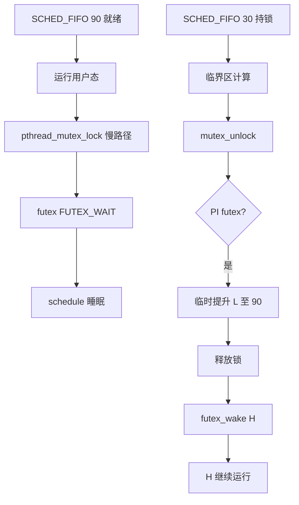
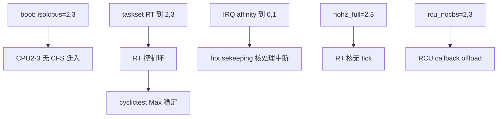

# 实时确定性保证完整篇：最坏执行时间、优先级与干扰隔离

机器人关节 **500 µs 截止期** 偶发违约、多线程共享 **mutex** 后低优先级任务反而长期占用 CPU、cyclictest 空载 **Max 20 µs** 一上产线负载就 **2 ms**——这类问题不是「再调高一点 chrt 优先级」能根治，而是 **WCET 未证明、优先级反转未处理、干扰源（SMI、C-state、page fault、IRQ）未隔离**。Linux PREEMPT_RT 提供 **sleeping lock、PI、isolcpus**，但不自动给出 **确定性证书**。

本文合并实时系统 chapter 041–046，覆盖 **确定性定义、WCET 分析、优先级反转与继承、CPU/中断亲和、mlockall 与禁页错误、SMI/电源管理等干扰源、cyclictest/stress/rt-tests 验证方法**，附内核锚点与可复现实验。

---

## 源码锚点

| 路径 / 手册 | 作用 |
|-------------|------|
| `kernel/sched/core.c` | `schedule`、`preempt_enable` |
| `kernel/sched/rt.c` | `SCHED_FIFO/RR`、`pick_next_task_rt` |
| `kernel/sched/deadline.c` | `SCHED_DEADLINE` EDF |
| `kernel/locking/rtmutex.c` | RT mutex、优先级继承 PI |
| `kernel/futex/pi.c` | 用户态 PI futex |
| `include/uapi/linux/sched.h` | `sched_setscheduler`、`sched_attr` |
| `mm/mlock.c` | `mlock`、`mlockall` 系统调用 |
| `mm/memory.c` | 缺页、`do_user_addr_fault` |
| `kernel/irq/manage.c` | IRQ affinity、`irq_set_affinity` |
| `kernel/time/hrtimer.c` | 高精度定时器、周期唤醒 |
| `Documentation/admin-guide/kernel-parameters.txt` | `isolcpus`、`nohz_full` |
| `tools/testing/rt-tests/cyclictest/` | 延迟验证 |
| `tools/testing/rt-tests/pi_stress/` | PI 压力测试 |
| `man 2 mlock` `man 7 sched` | 内存锁定与调度 API |

RT mutex 优先级继承入口（`kernel/locking/rtmutex.c`）：

```c
static int rt_mutex_adjust_prio_chain(struct rt_mutex *lock,
                                      enum rtmutex_chainwalk chwalk,
                                      struct rt_mutex_waiter *orig_waiter,
                                      struct task_struct *top_task)
{
    /* 提升 lock owner 优先级至等待者 */
}
```

---

## 调用链

### ① 高优先级 RT 任务被阻塞到恢复



### ② page fault 引入的非确定性


### ③ isolcpus 与干扰隔离



---

## 重点知识

## 一、确定性的定义与层次

### 1.1 硬实时 vs 软实时

| 类型 | 定义 | 违约后果 | Linux 能力 |
|------|------|----------|------------|
| 硬实时 | 每个作业 **必须在截止期内完成** | 系统失效/安全事故 | **不可证明**（best-effort） |
|  firm | 允许极少违约若可检测 | 降级/重传 | 部分场景可测 |
| 软实时 | 平均满足，偶发违约可接受 | 体验下降 | CFS + tuning |

**PREEMPT_RT** 目标是 **降低最坏延迟**，不是 **形式化硬实时证书**。安全 PLC、航空电子仍倾向 **MCU/FPGA/AMP**。

### 1.2 确定性三要素

1. **有界执行时间（WCET）**：每条路径有上界。
2. **有界干扰（BCET + interference）**：已知外部事件最大延迟。
3. **可验证（measurement + analysis）**：cyclictest、RMA、静态分析工具链。

缺任一项 → 「感觉很快」≠ 确定性。

### 1.3 时间约束类型

| 约束 | 符号 | 示例 |
|------|------|------|
| 截止期 | D | 1 ms 内完成采样+控制 |
| 周期 | T | 每 1 ms 触发一次 |
| 执行时间 | C | WCET ≤ 200 µs |
| 响应时间 | R | R = C + 阻塞 + 干扰 |

**可调度性**（速率单调 RM）：n 个周期任务，Σ(Ci/Ti) ≤ n(2^(1/n)-1)（充分非必要）。

### 1.4 Linux 上的现实目标

工业网关常见 SLA：**99.99% 周期 < 500 µs，Max < 2 ms（特定负载下）** — 文档化 **测量条件** 比空喊「硬实时」诚实。

---

## 二、WCET：最坏执行时间

### 2.1 WCET 与 BCET/ACET

| 指标 | 含义 | 用途 |
|------|------|------|
| BCET | 最好情况 | 优化参考 |
| ACET | 平均 | 吞吐评估 |
| WCET | 最坏 | **安全分析必须** |

**ACET 低、WCET 高** → 典型 **cache miss、分支、共享锁** 导致 — RT 验收看 **WCET/Max**。

### 2.2 静态分析 vs 测量

| 方法 | 工具/手段 | 优点 | 缺点 |
|------|-----------|------|------|
| 静态 | aiT、Bound-T、LLVM WCET | 可证明 | 需模型、难覆盖全 OS |
| 测量 | cyclictest、GPIO toggle、logic analyzer | 贴近真实 | 可能未触最坏路径 |
|  hybrid | 静态界 + 测量验证 | 工业常用 | 工作量大 |

Linux 用户态任务 WCET 须 **排除**：malloc、syscall 冷路径、首次 page fault。

### 2.3 控制环 WCET 分解示例

1 kHz 环，截止期 **1000 µs**：

| 阶段 | WCET 预算 |
|------|-----------|
| 读传感器（mmap ring） | 30 µs |
| 算法（浮点 PID） | 80 µs |
| 写执行器（shared mem） | 20 µs |
| 框架开销（sched、futex） | 50 µs |
| **干扰裕量** | 820 µs |

裕量用于 **IRQ、cache miss、偶发 PI** — 裕量过小则 **负载尖峰违约**。

### 2.4 代码层 WCET 友好写法

```c
/* 坏：运行期分配 */
double *buf = malloc(n * sizeof(double));

/* 好：静态或启动期分配 + mlock */
static double buf[MAX_N];
mlockall(MCL_CURRENT | MCL_FUTURE);

/* 坏：无界循环 */
while (queue_pop(&q, &item) == 0) process(item);

/* 好：每周期最多处理 K 项 */
for (int k = 0; k < K && queue_pop(&q, &item) == 0; k++)
    process(item);
```

**禁止**：RT 路径 `qsort`、无界 `snprintf`、递归深度不受控。

### 2.5 编译器与 WCET

- **-O2**：常降低 ACET 但 **代码膨胀** 影响 I-cache → WCET 可能升。
- **-ffast-math**：非确定性浮点 reorder — 安全控制 **禁用**。
- **LTO/PGO**：ACET 优，WCET 需 **单独 worst-case 编译单元** 分析。

```bash
gcc -O2 -fno-strict-aliasing -c control.c -o control.o
objdump -d control.o | wc -l   # 代码体积粗查
```

---

## 三、优先级反转与优先级继承

### 3.1 经典优先级反转

三任务：**H**（高）、**M**（中）、**L**（低）。**L** 持锁，**H** 等锁睡眠，**M** 抢占 **L** → **H** 间接被 **M** 阻塞 — **M 不需要那把锁** 却造成反转。

### 3.2 优先级继承（PI）

**H** 等 **L** 的锁时，**临时提升 L 至 H 的优先级**，使 **M** 无法抢占 **L**，**L** 尽快释放锁。

Linux：
- 内核：**rt_mutex** + `CONFIG_RT_MUTEXES`
- 用户态：**PTHREAD_PRIO_INHERIT** 或 **PI futex**

```c
pthread_mutexattr_t attr;
pthread_mutexattr_init(&attr);
pthread_mutexattr_setprotocol(&attr, PTHREAD_PRIO_INHERIT);
pthread_mutex_init(&lock, &attr);
```

### 3.3 优先级天花板（PCP）

每个资源 **天花板优先级** = 可能访问它的最高任务优先级。持锁时提升到天花板 — **避免链式 PI**，但需 **静态资源表**。

Linux 主流 **PI**；PCP 多在 **OSEK/RTOS** 或用户态框架自建。

### 3.4 pi_stress 验证

```bash
pi_stress --groups=4 --threads=8 -l 100000
# 无 PI 时高优先级线程 starvation；有 PI 应完成
```

### 3.5 常见 PI 误用

| 误用 | 后果 |
|------|------|
| 普通 mutex 非 PI | 反转 |
| 跨进程 shm 锁未 PI | 反转 |
| **SCHED_OTHER** 持锁，**FIFO** 等待 | **无 PI**（CFS 不参与 PI 协议） |
| 优先级倒置：低 prio 线程创建锁，高 prio 后 attach | 设计错误 |

**规则**：RT 线程间共享锁 **必须 PI**；与 **非 RT** 线程共享 → **分离锁** 或 **非 RT 永不持锁跨 RT 周期**。

### 3.6 ftrace 观测 PI

```bash
echo 1 > /sys/kernel/debug/tracing/events/sched/sched_pi_setprio/enable
cat /sys/kernel/debug/tracing/trace_pipe
```

---

## 四、CPU 与中断亲和

### 4.1 为何 affinity 是确定性基础

**迁移** → cache cold、runqueue 锁、**timer 重编程**。**IRQ 同核** → RT 被 ISR/softirq 打断。**load balance** → 意外迁核。

### 4.2 isolcpus + taskset

```text
# cmdline
isolcpus=2,3 nohz_full=2,3 rcu_nocbs=2,3
```

```bash
taskset -c 2 chrt -f 90 ./control
taskset -c 3 chrt -f 85 ./acquire
```

**isolcpus 不绑 IRQ** — 须手工：

```bash
echo 0-1 | sudo tee /proc/irq/NN/smp_affinity_list
```

### 4.3 cpuset 硬隔离

```bash
mkdir -p /sys/fs/cgroup/rt/cpuset.cpus
echo 2-3 > /sys/fs/cgroup/rt/cpuset.cpus
echo 0 > /sys/fs/cgroup/rt/cpuset.mems
echo $PID > /sys/fs/cgroup/rt/cgroup.procs
```

比 **taskset** 更强：**内核线程、部分迁移** 也受限。

### 4.4 IRQ 与 threaded IRQ 优先级

```bash
ps -Lo pid,tid,class,rtprio,comm | grep irq
```

**IRQ thread** 与 RT 同核且 prio 更高 → 业务被打断。**移 IRQ** 优于降 prio。

### 4.5 NUMA

```bash
numactl --cpunodebind=0 --membind=0 ./rt_app
lstopo
```

**跨 node 内存** → WCET +30~100% 常见。

### 4.6 irqbalance

RT 系统 **disable irqbalance**，静态表写入 **udev** 或 **init script**。

---

## 五、内存锁定与禁页错误

### 5.1 为何 page fault 破坏确定性

**首次触页**、**swap in**、**COW**、**compaction** 均可 **毫秒级**。RT 线程 **所有工作集** 须在运行前 **resident**。

### 5.2 mlockall

```c
#include <sys/mman.h>
if (mlockall(MCL_CURRENT | MCL_FUTURE) != 0)
    perror("mlockall");
```

```bash
ulimit -l unlimited   # /etc/security/limits.d/rt.conf
```

**MCL_FUTURE**：后续映射也锁定 — 仍须在 **运行 RT 前** 完成 **所有 mmap**。

### 5.3 stack prefault

```c
#define STACK_SIZE (256 * 1024)
static unsigned char stack[STACK_SIZE];

static void prefault_stack(void)
{
    long ps = sysconf(_SC_PAGESIZE);
    for (size_t i = 0; i < STACK_SIZE; i += ps)
        stack[i] = 0;
}
```

或 **pthread_attr_setstack** 提供 **预分配栈**。

### 5.4 heap prefault

```c
char *heap = mmap(NULL, HEAP_SIZE, PROT_READ|PROT_WRITE,
                  MAP_PRIVATE|MAP_ANONYMOUS, -1, 0);
mlock(heap, HEAP_SIZE);
memset(heap, 0, HEAP_SIZE);  /* 触页 */
```

**禁止运行期 malloc** — glibc **arena 锁** 与 **新 mmap** 均不可控。

### 5.5 swap 与 THP

```bash
swapoff -a
echo never > /sys/kernel/mm/transparent_hugepage/enabled
```

**THP collapse** 可在运行期 **stall** 数百 ms。

### 5.6 madvise

```c
madvise(rt_region, size, MADV_DONTFORK | MADV_RANDOM);
```

**MADV_WILLNEED** 可用于 **启动阶段** 预触页，非 RT 环。

### 5.7 cyclictest -m

```bash
cyclictest -a -t1 -p80 -m -i1000 -l100000 -q
```

**-m** 即 mlockall — 对比 **有无 -m** 的 Max 差异常 → **page fault 嫌疑**。

---

## 六、干扰源：SMI、电源管理与其他

### 6.1 SMI（System Management Interrupt）

x86 **BIOS/ME** 触发，**OS 不可屏蔽**，**数十 µs～数 ms**。cyclictest **无规律尖刺**，ftrace **无对应 irq 事件**。

缓解（非根除）：
- 工业 PC、简化 BIOS
- `processor.max_cstate=0`、`intel_idle.max_cstate=0`
- 避免 **consumer laptop**

### 6.2 C-state / P-state

**C-state 退出** → **百 µs**。**P-state 迁移** → 频率瞬变影响 **执行时间**。

```bash
cpupower frequency-set -g performance
echo 0 | sudo tee /dev/cpu_dma_latency
cat /sys/devices/system/cpu/cpu0/cpufreq/scaling_governor
```

### 6.3 定时器 tick 与 hrtimer

**HZ=1000** 时 **1 ms tick**；**nohz_full** 隔离核 **无 tick**。**hrtimer** 用于 **周期唤醒** — 精度 **sub-tick**。

```bash
cat /proc/timer_list | head -50
```

### 6.4 RCU、workqueue、kworker

**RCU grace period**、**kworker** 可在 **housekeeping 核** 堆积；若 **affinity 错误** 跑到 RT 核 → 干扰。

```text
rcu_nocbs=2,3
```

### 6.5 虚拟化 steal time

```bash
grep steal /proc/stat
mpstat -P ALL 1
```

**KVM steal** → WCET **无界** — 硬 RT **勿未 pin vCPU**。

### 6.6 GPU、DMA 引擎

**GPU 驱动**、**NVMe 中断** 与 RT **同核** — **affinity 分离**。

### 6.7 内存 balloon（VM）

**virtio-balloon** 回收内存 → ** compaction** → RT **尖刺** — 虚拟机 **disable balloon** 或 **reservation**。

---

## 七、调度策略与确定性

### 7.1 SCHED_FIFO / SCHED_RR

```bash
chrt -f 90 ./task
chrt -p 90 $PID
```

**同优先级 FIFO**；**RR** 有时间片。**高 prio 忙等** → **饿死系统** — 须 **block/yield**。

### 7.2 sched_rt_runtime_us

```bash
sysctl kernel.sched_rt_runtime_us
# 默认 950000 / 1000000 → 每秒 RT 最多 950ms
sysctl -w kernel.sched_rt_runtime_us=-1  # 取消带宽 cap（慎用）
```

### 7.3 SCHED_DEADLINE

```c
struct sched_attr attr = {
    .size = sizeof(attr),
    .sched_policy = SCHED_DEADLINE,
    .sched_runtime = 200000,    /* 200µs */
    .sched_deadline = 1000000,  /* 1ms */
    .sched_period = 1000000,
};
sched_setattr(0, &attr, 0);
```

**EDF** 可分析 **utilization**；须 **CONFIG_SCHED_DEADLINE**。

### 7.4 优先级设计表

| 线程 | policy | prio | 核 |
|------|--------|------|-----|
| 控制环 | FIFO | 90 | 2 |
| 采集 | FIFO | 85 | 3 |
| 通信 | FIFO | 70 | 0-1 |
| 日志 | OTHER | nice 10 | 0 |

**文档化** — 禁止 **临时 chrt** 无记录。

---

## 八、验证方法

### 8.1 cyclictest 基准

```bash
cyclictest -a2,3 -t2 -p99 -n -i1000 -l1000000 -m -h1000 -q
```

记录：**Min/Act/Avg/Max**、**负载条件**、**内核版本**。

### 8.2 负载下验证

```bash
stress-ng --cpu 4 --io 2 --vm 1 --timeout 600s &
hackbench -p -l 1000 &
cyclictest -a2,3 -t2 -p99 -n -i200 -l500000 -m -q
```

**Max(负载) / Max(空载)** 作为 **退化系数**。

### 8.3 signaltest / pmqtest

```bash
signaltest -p 90 -l 100000
pmqtest -p 90 -l 100000
```

测 **信号**、**POSIX MQ** 路径延迟。

### 8.4 ftrace / perf

```bash
perf record -e sched:sched_switch -e sched:sched_wakeup -a sleep 10
perf sched latency
```

找 **max latency** 链：**H 等锁 → L 运行 → M 插入**。

### 8.5 硬件 GPIO 环回

**RT 线程 toggle GPIO** + **logic analyzer** 测 **实际周期 jitter** — 比 cyclictest **更贴近业务**。

### 8.6 长期 soak

**72h** cyclictest + 产线负载；**Max 漂移** → **thermal、内存 leak、log 满**。

---

## 九、案例与反模式

### 9.1 案例：mutex 无 PI 导致超时

**现象**：FIFO 90 周期任务 **偶发 5 ms**。**根因**：与 **FIFO 50** 共享 **普通 mutex**，中间 **CFS 60** 插入。**修复**：`PTHREAD_PRIO_INHERIT` 或 **SPSC 无锁队列** 分离数据。

### 9.2 案例：未 mlock 的首周期尖刺

**现象**：启动后 **首 10 次周期 Max 3 ms**，后 **20 µs**。**根因**：**代码/数据 page fault**。**修复**：`mlockall` + prefault + **-m cyclictest 对照**。

### 9.3 案例：SMI 尖刺

**现象**：**每 30 s** 一次 **200 µs** 尖刺，与负载无关。**根因**：**BIOS SMM**。**修复**：换工业板 + **max_cstate=0**；接受 **无法 100% 消除**。

### 9.4 反模式表

| 反模式 | 后果 |
|--------|------|
| 只测 ACET | 产线违约 |
| RT 线程 malloc | fault + 锁 |
| 全系统 SCHED_FIFO | 饿死 init |
| 忽略 IRQ affinity | 随机 Max |
| swap 开启 | ms 尖刺 |
| 虚拟机无 pin | steal |
| printf 在 RT 环 | I/O 阻塞 |

---

## 十、RMA 与响应时间分析（概要）

### 10.1 固定优先级 RMA

n 个独立周期任务，**RM 优先级分配**（周期短 → prio 高）。**响应时间迭代**：

Ri = Ci + Σ_{j∈hp(i)} ⌈Rj/Tj⌉·Cj

迭代至收敛 — **手工或脚本**（非 Linux 内核提供）。

### 10.2 阻塞时间 Bi

持 **s 个资源**，每个 **最大持锁时间** ℓ → Bi = Σ ℓ。**PI** 减少 **有效 Bi**。

### 10.3 Linux 上实用做法

**测量 Max** + **RMA 粗算** + **裕量 30%** — 三重 **才上线**。

---

## 十一、形式化与标准（对照）

### 11.1 DO-178C / IEC 61508

航空/功能安全要求 **WCET 证据** — Linux **通常作 QM 或非安全路径**；**安全链** 在 **MCU**。

### 11.2 POSIX.1 RT 扩展

**SCHED_FIFO/RR**、**mlock**、**sigwait** — Linux **部分符合**；**硬实时** **不声称全符合**。

---

## 十二、容器与 RT 确定性

```bash
docker run --cap-add SYS_NICE --ulimit rtprio=99 \
  --cpuset-cpus="2,3" --cpu-quota=-1 ...
```

**K8s static CPU** + **Guaranteed**；**Burstable** **破坏** 确定性。

---

## 附录 A：cyclictest 参数

| 参数 | 含义 |
|------|------|
| -a | CPU 列表 |
| -t N | 线程数 |
| -p P | FIFO 优先级 |
| -i us | 间隔 |
| -l N | 循环 |
| -m | mlockall |
| -h us | histogram |
| -n | clock_nanosleep |

---

## 附录 B：limits.conf

```text
@rtgroup   soft   rtprio   99
@rtgroup   hard   rtprio   99
@rtgroup   soft   memlock  unlimited
@rtgroup   hard   memlock  unlimited
```

---

## 附录 C：boot 参数汇总

```text
isolcpus=2,3 nohz_full=2,3 rcu_nocbs=2,3
processor.max_cstate=0 intel_idle.max_cstate=0
threadirqs
```

---

## 附录 D：/proc/PID/sched

```bash
cat /proc/$PID/sched
# policy, prio, se.sum_exec_runtime
```

---

## 附录 E：sched_setattr 示例

```c
#define _GNU_SOURCE
#include <sched.h>
#include <sys/syscall.h>
/* sched_setattr(2) via syscall if glibc old */
```

---

## 附录 F：perf sched 输出解读

**sched latency** 报告 **每个任务 max delay** — 找 **wait for cpu** vs **wait for block**。

---

## 附录 G：stress-ng 组合

```bash
stress-ng --cpu 8 --io 4 --vm 2 --fork 4 --timeout 3600s
```

---

## 附录 H：watchdog 与确定性

**soft lockup detector** — RT **死循环** 触发 panic；**硬件 WDT** 独立 — 见《容错设计完整篇》。

---

## 附录 I：EVL / Xenomai

**OOB** 线程 **更低 jitter**；与 **PREEMPT_RT 单内核** 路径不同 — **选型** 影响 **WCET 工具链**。

---

## 附录 J：术语

| 术语 | 含义 |
|------|------|
| WCET | Worst-Case Execution Time |
| BCET | Best-Case Execution Time |
| PI | Priority Inheritance |
| PCP | Priority Ceiling Protocol |
| EDF | Earliest Deadline First |
| RMA | Rate Monotonic Analysis |
| SMI | System Management Interrupt |

---

## 附录 K：测量报告模板

```text
Platform: Intel i7-8700T / 32GB / PREEMPT_RT 6.6.30-rt
Boot: isolcpus=2,3 nohz_full=2,3 rcu_nocbs=2,3 max_cstate=0
Load: none | stress-ng cpu=4 io=2
Command: cyclictest -a2,3 -t2 -p99 -n -i1000 -l1000000 -m -q
Result: Min 3 Avg 8 Max 45 (none) / Max 120 (stress)
Notes: eth0 IRQ on CPU0; mlockall enabled
```

---

## 附录 L：优先级继承 trace 脚本

```bash
#!/bin/bash
echo 1 > /sys/kernel/debug/tracing/events/sched/sched_pi_setprio/enable
echo 1 > /sys/kernel/debug/tracing/tracing_on
sleep 30
echo 0 > /sys/kernel/debug/tracing/tracing_on
grep sched_pi_setprio /sys/kernel/debug/tracing/trace | tail -50
```

---

## 附录 M：mlock 失败排障

```bash
grep MemTotal /proc/meminfo
ulimit -l
dmesg | grep -i mlock
```

**RLIMIT_MEMLOCK** 不足 → **silent fault** 或 **ENOMEM**。

---

## 附录 N：SCHED_FIFO 带宽

```bash
cat /proc/sys/kernel/sched_rt_runtime_us
cat /proc/sys/kernel/sched_rt_period_us
```

**RT  throttling** 触发时 **FIFO 被 CFS 抢占** — cyclictest **Max 尖刺**。

---

## 附录 O：big.LITTLE

```bash
taskset -c 4-7 chrt -f 90 ./loop  # big cores
```

**sched_energy** 可能迁移 — **cpuset** 限制。

---

## 附录 P：lockdep 与 RT

开发内核 **CONFIG_PROVE_LOCKING** — **生产 RT 禁用**（开销）。

---

## 附录 Q：/dev/cpu_dma_latency

```bash
exec 3>/dev/cpu_dma_latency
echo 0 >&3
# 保持 fd 打开 pin C0
```

---

## 附录 R：timer_migration

```bash
sysctl kernel.timer_migration
# 0 → 减少 timer 跨核迁移
```

---

## 附录 S：与《PREEMPT_RT》《实时调度》边界

- **实时调度篇**：CFS/RT/EDF 通用机制。
- **PREEMPT_RT 篇**：补丁、isolcpus、cyclictest。
- **本文**：**WCET、PI、mlock、干扰、验证方法论**。

---

## 附录 T：静态 WCET 工具链（参考）

- **aiT**（AbsInt）：商业，支持多种 MCU；Linux 用户态 **有限**。
- **Bound-T**（Tidorum）：部分 **ARM** 二进制。
- **SWEET** / 学术工具：研究用。

Linux 工业实践 **以测量为主**，静态 **辅助关键循环**。

---

## 附录 U：周期任务实现

```c
int tfd = timerfd_create(CLOCK_MONOTONIC, TFD_NONBLOCK);
struct itimerspec its = {
    .it_interval = {0, 1000000},
    .it_value = {0, 1000000},
};
timerfd_settime(tfd, TFD_TIMER_ABSTIME, &its, NULL);
for (;;) {
    uint64_t exp;
    read(tfd, &exp, sizeof(exp));
    control_step();
}
```

比 **usleep** **漂移小** — 仍须 **mlock + 无 blocking I/O**。

---

## 附录 V：futex PI 内核路径

`FUTEX_LOCK_PI` → `futex_lock_pi` → **rt_mutex** — 与 **pthread PI mutex** 对齐。

---

## 附录 W：内存屏障与 WCET

**relaxed atomics** 可能 **reorder** — 控制环 **acquire/release** 语义须 **显式**：

```c
atomic_store_explicit(&tail, new_tail, memory_order_release);
atomic_load_explicit(&head, memory_order_acquire);
```

---

## 附录 X：长期确定性退化

| 退化源 | 观测 |
|--------|------|
| thermal | `perf sched` Max 升 |
| disk full | 日志阻塞 |
| memory leak | swap 压力 |
| kernel upgrade | 回归 cyclictest |

**版本锁定** + **CI cyclictest** 门禁。

---

## 附录 Y：多核 RT 任务同步

**避免全局锁** — **per-CPU 数据**、**SPSC 每对线程**。**MPSC** 无锁 **WCET 难证** — 用 **有界 + 测量**。

---

## 附录 Z：交付物清单（工程）

交付 RT 子系统文档应含：**优先级表、WCET 分解、mlock 范围、boot 参数、cyclictest 命令与 Max（空载/负载）、已知干扰源（SMI 等）、PI mutex 列表** — **非 Checklist 口号**，而是 **可审计附件**。

---

## 附录 AA：cyclictest histogram 分析

```bash
cyclictest -p99 -a2 -t1 -i1000 -l200000 -m -h1000 --histfile=/tmp/cy.hist
# 观察 >200µs 桶计数是否随负载阶跃上升
```

**长尾** 比 **Max 单点** 更能反映 **确定性退化**；交付时附 **histogram 摘要**（P99.9、P99.99）。

---

## 附录 AB：schedutil 与 WCET

```bash
cat /sys/devices/system/cpu/cpu0/cpufreq/scaling_driver
```

**schedutil** 按 **利用率** 调频 — **WCET 随频率变**。**performance governor** 或 **定频** 是 RT **基准测试前提**。

---

## 附录 AC：内核 printk 干扰

```bash
dmesg -n 1
echo 0 > /proc/sys/kernel/printk
```

**大量 printk** 持 **logbuf lock** — RT 测试期 **降低 console loglevel**；**persistent journal** 仍可在 **housekeeping** 核写。

---

## 附录 AD：FUTEX_PRIVATE vs FUTEX_SHARED

跨进程 **shm 锁** 须 **FUTEX_SHARED** + **PI**；**线程内 mutex** 用 **PRIVATE** — 混用导致 **PI 不生效** 或 **EFAULT**。

---

## 附录 AE：响应时间测量 GPIO 脚本

```bash
# 示波器 CH1: GPIO18 toggle
# cyclictest 同机对比 software vs hardware jitter
gpioget gpiochip0 18  # libgpiod 读回环
```

**硬件测量** 排除 **cyclictest 自身** 对 **调度路径** 的简化假设。

---

## 附录 AF：实时性回归 CI 门禁

```yaml
# 伪代码：CI job
- cyclictest -a2 -t1 -p90 -n -i1000 -l50000 -m -q
- test $MAX -lt 100  # µs 阈值，按平台校准
```

**内核/驱动升级** 触发 **自动回归** — **Max 漂移** 阻塞合并。

---

*合并自实时系统 041–046；确定性来自测量与隔离，不来自单独一次 cyclictest 空载 Max。*
