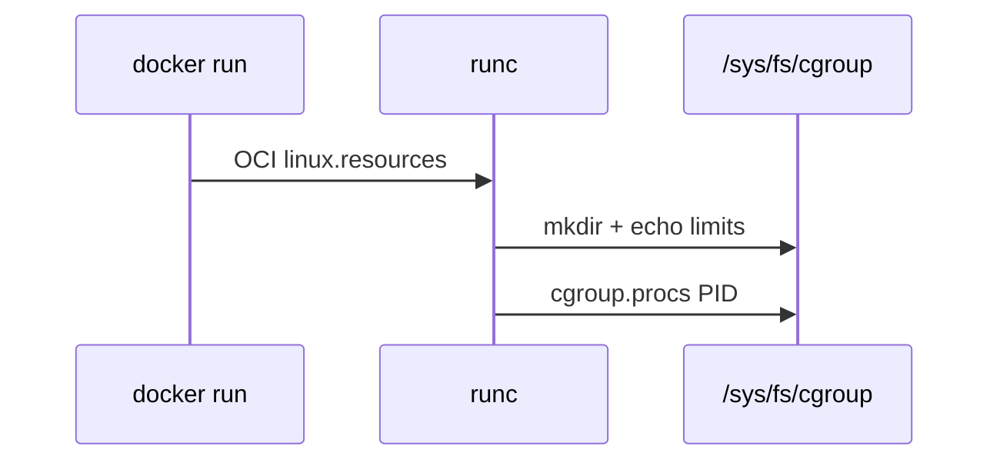

# Linux Cgroups 完整篇：从 v1/v2、cpu/memory 控制器到容器限额排障

容器「CPU 限了仍跑满」「memory limit 设了仍 OOM 杀别的进程」「cgroup 文件找不到」——根因在 **v1/v2 混用、systemd delegation、memory 语义** 与 **写错 hierarchy**。本文按 `kernel/cgroup/`、`mm/memcontrol.c` 与 `/sys/fs/cgroup` 展开。

## 源码锚点

| 路径 / 符号 | 作用 |
|-------------|------|
| kernel/cgroup/cgroup.c | cgroup 核心挂载 css |
| kernel/cgroup/rstat.c | 递归统计 |
| kernel/sched/fair.c | CFS bandwidth cpu.max |
| mm/memcontrol.c | memory 控制器 OOM |
| block/blk-cgroup.c | blkio/io |
| kernel/cgroup/pids.c | pids 控制器 |
| kernel/cgroup/cpuset.c | cpuset |
| Documentation/admin-guide/cgroup-v2.rst | v2 官方 |
| /sys/fs/cgroup/ | 挂载点 |
| /proc/cgroups | 已启用控制器 |
| /proc/PID/cgroup | 进程所属路径 |
| man systemd.resource-control | MemoryMax CPUQuota |
| runc / containerd | OCI → cgroup 写限额 |

```bash
mount | grep cgroup; cat /proc/cgroups; cat /proc/self/cgroup; systemd-cgtop
```

## 调用链

### 进程加入 cgroup

```mermaid
flowchart TD
    A[fork] --> B[继承父 cgroup]
    B --> C[write cgroup.procs]
    C --> D[cgroup_attach_task
    D --> E[各 controller account/limit]
    E --> F[cpu.max memory.max io.weight]
```

### memory 超限 OOM

```mermaid
flowchart LR
    W[malloc] --> M[memcg charge]
    M --> L{超 memory.max?}
    L -->|是| R[memcg OOM killer
    R --> K[杀 cgroup 内进程
    K --> LOG[dmesg Memory cgroup out of memory]
```

### Docker 写 cgroup



## 重点知识

### cgroup v1 与 v2

v1：每控制器独立 hierarchy，多次挂载 `/sys/fs/cgroup/cpu` 等。v2：单 unified 树，`+cpu +memory +io` 一次挂载。

systemd v239+ 默认 hybrid 或 unified，视发行版。容器运行时需与 host 模式一致。

| 对比 | v1 | v2 |
|------|----|----|
| 挂载 | 多棵 | 单棵 unified |
| CPU | cpu.shares/quota | cpu.max cpu.weight |
| 内存 | memory.limit_in_bytes | memory.max memory.high |

```bash
grep cgroup /proc/filesystems
stat -fc %T /sys/fs/cgroup
cat /sys/fs/cgroup/cgroup.controllers 2>/dev/null
```

### 挂载与目录树

`mount | grep cgroup` 看 v1/v2；v2 根有 `cgroup.controllers`、`cgroup.subtree_control`。

委派：`echo '+cpu +memory' > cgroup.subtree_control` 允许子 cgroup 使用控制器。

```bash
mount | grep cgroup
findmnt -R /sys/fs/cgroup
ls /sys/fs/cgroup/
```

### cpu 与 cpuset

v2 `cpu.max`：`QUOTA PERIOD`（50000 100000 = 0.5 CPU）。`cpu.weight` 默认 100 相对权重。

v1：`cpu.cfs_quota_us`/`cpu.cfs_period_us`。cpuset 绑核：`cpuset.cpus`、`cpuset.mems`。

```bash
echo '50000 100000' > /sys/fs/cgroup/bench/cpu.max
cat /sys/fs/cgroup/system.slice/cpu.stat
cat /sys/fs/cgroup/cpuset/cpuset.cpus 2>/dev/null
```

### memory 与 OOM

v2：`memory.max` 硬限；`memory.high` 节流；`memory.current` 当前。OOM 日志 `Memory cgroup out of memory`。

swap：`memory.swap.max`；v1 `memory.memsw.limit_in_bytes` 含 mem+swap 合计。

```bash
cat /sys/fs/cgroup/system.slice/memory.current
cat /sys/fs/cgroup/system.slice/memory.max
cat /sys/fs/cgroup/system.slice/memory.events
dmesg -T | grep -i 'memory cgroup'
```

### io 与 blkio

v2：`io.max`、`io.weight`、`io.stat`；v1：`blkio.throttle.read_bps_device` 等。

```bash
cat /sys/fs/cgroup/system.slice/io.stat 2>/dev/null
# echo '8:0 rbps=1048576' > io.max
```

### pids 控制器

`pids.max` 限制 cgroup 内进程数，防 fork 炸弹。

```bash
echo 256 > pids.max
cat pids.events 2>/dev/null
```

### systemd slice 与 scope

unit 资源：`MemoryMax=`、`CPUQuota=`、`TasksMax=`。slice 层级 `system.slice` → `docker.slice`。

```bash
# [Service]
MemoryMax=512M
CPUQuota=50%
systemctl show foo -p MemoryCurrent -p CPUUsageNSec
systemd-cgtop
```

### Docker/containerd 写限额

`docker run --cpus 0.5 --memory 256m` → OCI resources → runc 写 cgroup。路径因 cgroup driver 而异（systemd/cgroupfs）。

```bash
docker run -d --name t --cpus 0.5 --memory 256m nginx
docker inspect t --format '{{.HostConfig.Memory}} {{.HostConfig.NanoCpus}}'
PID=$(docker inspect -f '{{.State.Pid}}' t)
cat /proc/$PID/cgroup
```

### 压力观测 PSI

Pressure Stall Information：`/proc/pressure/cpu|memory|io`；v2 cgroup 内也有 `*.pressure`。

```bash
cat /proc/pressure/memory
cat /proc/pressure/io
cat /sys/fs/cgroup/system.slice/memory.pressure 2>/dev/null
```

### 排障与验证

限额不生效：确认进程在目标 `cgroup.procs`；v1/v2 路径别写错。

### cgroup 深化

#### 深化 1：memory.stat

anon/file/kernel 分解

```bash
cat memory.stat | head
```

#### 深化 2：cpu.stat throttled

nr_periods nr_throttled

```bash
cat cpu.stat
```

#### 深化 3：cgroup.freeze

v2 冻结

```bash
echo 1 > cgroup.freeze 2>/dev/null
```

#### 深化 4：hugetlb

大页 v1

```bash
cat /sys/fs/cgroup/hugetlb/hugetlb.limit_in_bytes 2>/dev/null
```

#### 深化 5：devices allow

设备白名单 v1

```bash
echo 'a *:* rmw' > devices.allow 2>/dev/null
```

#### 深化 6：freezer

暂停 cgroup v1

```bash
echo FROZEN > freezer.state 2>/dev/null
```

#### 深化 7：kubepods

K8s pod 路径

```bash
ls /sys/fs/cgroup/kubepods.slice 2>/dev/null | head
```

#### 深化 8：runc spec

OCI JSON

```bash
runc spec 2>/dev/null | head -5 || true
```

#### 深化 9：memsw v1

mem+swap

```bash
cat memory.memsw.limit_in_bytes 2>/dev/null
```

#### 深化 10：delegation

子树可用控制器

```bash
cat cgroup.controllers
```

#### 深化 11：subtree_control

已委派

```bash
cat cgroup.subtree_control
```

#### 深化 12：cgroup.type

threaded/domain

```bash
cat cgroup.type 2>/dev/null
```

#### 深化 13：cgroup.threads

threaded cgroup

```bash
# v2 线程模式
```

#### 深化 14：memory.low

保护阈值

```bash
cat memory.low 2>/dev/null
```

#### 深化 15：memory.min

硬保护

```bash
cat memory.min 2>/dev/null
```

#### 深化 16：cpu.idle

SCHED_IDLE

```bash
cat cpu.idle 2>/dev/null
```

#### 深化 17：cpuset.mems

NUMA 节点

```bash
cat cpuset.mems 2>/dev/null
```

#### 深化 18：rdma

RDMA controller

```bash
grep rdma /proc/cgroups
```

#### 深化 19：systemd run scope

触发 cgroup OOM

```bash
systemd-run --scope -p MemoryMax=100M stress-ng --vm 1 --vm-bytes 150M
```

#### 深化 20：docker update

运行时改限额

```bash
docker update --memory 512m t
```

#### 深化 21：ctr resources

containerd

```bash
ctr c info 2>/dev/null | head || true
```

#### 深化 22：cgget

cgroup-tools

```bash
cgget -g memory:/system.slice 2>/dev/null | head
```

#### 深化 23：find procs

定位 cgroup

```bash
grep -l PID /sys/fs/cgroup/**/cgroup.procs 2>/dev/null | head
```

#### 深化 24：cgroup v1 cpu shares

相对权重 1024 default

```bash
cat cpu.shares 2>/dev/null
```

#### 深化 25：blkio v1

IOPS 限

```bash
cat blkio.throttle.read_iops_device 2>/dev/null
```

#### 深化 26：io.max v2

per-device 限

```bash
cat io.max 2>/dev/null
```

#### 深化 27：memory.oom.group

v2 OOM 整组

```bash
cat memory.oom.group 2>/dev/null
```

#### 深化 28：cgroup.kill

v2 杀整组

```bash
echo 1 > cgroup.kill 2>/dev/null
```

#### 深化 29：psi full

some/full avg10

```bash
grep some /proc/pressure/memory
```

#### 深化 30：kernel doc

文档路径

```bash
ls /usr/share/doc/linux-doc*/cgroup-v2.txt 2>/dev/null | head
```

### 排障场景

#### 限额不生效

```bash
cat /proc/PID/cgroup
grep PID /sys/fs/cgroup/**/cgroup.procs 2>/dev/null | head
```

#### v1 v2 混用

```bash
mount | grep cgroup
stat -fc %T /sys/fs/cgroup
```

#### OOM 杀错进程

```bash
dmesg | grep -i oom
cat /proc/PID/oom_score_adj
```

#### CPU 仍满

```bash
cat cpu.max
nproc
```

#### memory high 节流

```bash
cat memory.high memory.current
memory.events
```

#### Docker cgroup 路径

```bash
docker inspect -f '{{.State.Pid}}' CID
cat /proc/PID/cgroup
```

#### systemd 限额

```bash
systemctl show svc -p MemoryMax -p MemoryCurrent
systemd-cgtop
```

#### swap 超限

```bash
cat memory.swap.current memory.swap.max 2>/dev/null
free -h
```

#### pids 满

```bash
cat pids.current pids.max 2>/dev/null
ps --ppid PID
```

#### io 饱和

```bash
cat io.stat 2>/dev/null
iostat -xz 1
```

### v1/v2 接口对照

| 资源 | cgroup v1 | cgroup v2 |
|------|-----------|-----------|
| CPU 限额 | cpu.cfs_quota_us + period | cpu.max |
| CPU 权重 | cpu.shares | cpu.weight |
| 内存硬限 | memory.limit_in_bytes | memory.max |
| 内存软限 | memory.soft_limit_in_bytes | memory.high |
| swap | memory.memsw.limit_in_bytes | memory.swap.max |
| IO | blkio.throttle.* | io.max |
| 进程数 | pids.max | pids.max |
| 进程迁移 | 各树 cgroup.procs | 统一 cgroup.procs |


## 控制器压测配方

### cpu.max 限额验证

cgroup v2 路径示例：`/sys/fs/cgroup/stress-cpu`。

```bash
mkdir -p /sys/fs/cgroup/stress-cpu
echo '+cpu' > /sys/fs/cgroup/cgroup.subtree_control 2>/dev/null || true
echo 50000 > /sys/fs/cgroup/stress-cpu/cpu.max   # 50ms/100ms = 0.5 CPU
echo $$ > /sys/fs/cgroup/stress-cpu/cgroup.procs
stress-ng --cpu 4 --timeout 30s --metrics-brief
cat /sys/fs/cgroup/stress-cpu/cpu.stat
```

期望：`nr_throttled` 上升；`usage_usec` 约为 wall time × 50%。

### memory.max 硬限与 OOM

```bash
CG=/sys/fs/cgroup/stress-mem
mkdir -p $CG
echo 64M > $CG/memory.max
stress-ng --vm 2 --vm-bytes 80M --vm-keep --timeout 20s &
echo $! > $CG/cgroup.procs
sleep 3
cat $CG/memory.events
dmesg | tail -5 | grep -i oom
```

### io.max 带宽 throttle

```bash
DEV=$(lsblk -ndo NAME,TYPE | awk '$2=="disk"{print $1; exit}')
CG=/sys/fs/cgroup/stress-io
mkdir -p $CG
echo '+io' > /sys/fs/cgroup/cgroup.subtree_control
echo "8:0 rbps=1048576 wbps=1048576" > $CG/io.max   # 1MiB/s，maj:min 用 lsblk
echo $$ > $CG/cgroup.procs
dd if=/dev/zero of=/tmp/cgtest bs=1M count=512 oflag=direct
cat $CG/io.stat
```

### pids.max 进程风暴

```bash
CG=/sys/fs/cgroup/stress-pids
mkdir -p $CG
echo 32 > $CG/pids.max
bash -c 'echo \$BASHPID > $CG/cgroup.procs; for i in $(seq 1 100); do sleep 60 & done'
cat $CG/pids.current $CG/pids.events
```

### PSI 压力解读

| 文件 | 含义 | 读法 |
|------|------|------|
| memory.pressure | some/full | full 持续高→内存硬限或泄漏 |
| io.pressure | some/full | full 高→磁盘或 io.max 过紧 |
| cpu.pressure | some/full | some 高→CPU 竞争 |

```bash
cat /proc/pressure/memory
cat /proc/pressure/io
cat /proc/pressure/cpu
while sleep 1; do cat /proc/pressure/memory; done
```

### systemd 委派 Delegate

单元片段：`Delegate=yes`、`DelegateSubgroup=...`。

```bash
mkdir -p /etc/systemd/system/user-1000.slice.d
printf '[Slice]\nDelegate=cpu cpuset io memory pids\n' > /etc/systemd/system/user-1000.slice.d/delegate.conf
systemctl daemon-reload
systemd-run --uid=1000 --user --scope -p Delegate=yes sleep infinity
ls /sys/fs/cgroup/user.slice/user-1000.slice/user@1000.service/
```

### Docker 限额到 cgroup 文件

| docker run | cgroup v2 文件 |
|------------|----------------|
| `--cpus=1.5` | `cpu.max` ≈ 150000 100000 |
| `--memory=512m` | `memory.max` |
| `--pids-limit=100` | `pids.max` |
| `--device-read-bps` | `io.max` rbps |

```bash
CID=$(docker run -d --cpus=0.5 --memory=128m alpine sleep 300)
CG=$(docker inspect -f '{{.HostConfig.CgroupParent}}{{if .HostConfig.CgroupParent}}/{{end}}{{.Id}}' $CID)
find /sys/fs/cgroup -name cgroup.procs -exec grep -l $(docker inspect -f '{{.State.Pid}}' $CID) {} \; 2>/dev/null | head -1 | xargs dirname
cat $(find /sys/fs/cgroup -path '*docker*' -name memory.max 2>/dev/null | head -1)
docker rm -f $CID
```

### OOM killer 日志链

```bash
journalctl -k | grep -i 'out of memory'
dmesg -T | grep -E 'Killed process|oom-kill'
grep -i oom /var/log/messages 2>/dev/null | tail
cat /sys/fs/cgroup/system.slice/memory.events
```

cgroup v2 OOM：`memory.events` 中 `oom_kill` 计数；容器内 `dmesg` 可能不可见，用 host journal。

### 嵌套 cgroup 与 rootless

```bash
cat /sys/fs/cgroup/cgroup.controllers
cat /sys/fs/cgroup/cgroup.subtree_control
podman run --memory=64m docker.io/library/alpine stress-ng --vm 1 --vm-bytes 128M --timeout 5s 2>&1 | tail
podman unshare cat /proc/self/cgroup
grep cgroup /proc/self/mountinfo | head
```

rootless：user@.service 下 cgroup 由 systemd 用户实例管理；`loginctl show-user $USER` 看 Linger。

### cgroup 排障矩阵

| 症状 | 查 | 命令 |
|------|-----|------|
| 限额不生效 | 进程是否在子 cgroup | `cat /proc/PID/cgroup` |
| memory 超限未杀 | memory.max=max | `cat memory.max` |
| CPU 仍 100% | 多 cgroup 或未设 max | `cat cpu.max cpu.stat` |
| io 无限速 | maj:min 错 | `lsblk -o NAME,MAJ:MIN` |
| 无法 mkdir cgroup | 非 delegate | `cat cgroup.controllers` |

```bash
systemd-cgls /
systemd-analyze critical-chain
cat /proc/cgroups
mount | grep cgroup
```

#### 补充配方 1：blkio 权重（v1 遗留）

```bash
echo 500 > /sys/fs/cgroup/blkio/blkio.weight
cat /sys/fs/cgroup/blkio/blkio.weight
```

#### 补充配方 2：cpuset 绑核

```bash
mkdir -p /sys/fs/cgroup/cpuset-test
echo 0-1 > /sys/fs/cgroup/cpuset-test/cpuset.cpus
echo 0 > /sys/fs/cgroup/cpuset-test/cpuset.mems
```

#### 补充配方 3：memory.high 软限

```bash
echo 128M > /sys/fs/cgroup/stress-mem/memory.high
cat /proc/pressure/memory
```

### containerd cgroup 路径

```bash
ctr tasks ls
PID=$(ctr tasks ls -q | head -1 | xargs ctr tasks inspect | jq .pid)
cat /proc/$PID/cgroup
find /sys/fs/cgroup -name cgroup.procs -exec grep -l $PID {} \; 2>/dev/null | head -3
```

### Kubernetes pod QoS 映射

| QoS | requests/limits | cgroup 表现 |
|-----|-----------------|-------------|
| Guaranteed | 相等且设 limit | memory.max=limit |
| Burstable | 只 requests | memory.high 软限 |
| BestEffort | 无 | 父 slice 共享 |

```bash
kubectl get pod -o json | jq '.items[0].spec.containers[0].resources'
crictl inspect $(crictl ps -q | head -1) | jq .info.runtimeSpec.linux.resources
cat /sys/fs/cgroup/kubepods.slice/kubepods-burstable.slice/*/memory.max 2>/dev/null | head
```

### v1 迁移 v2 采样

```bash
grep cgroup /proc/mounts
systemd-cgtop -1 | head -15
cat /sys/fs/cgroup/cgroup.controllers
test -f /sys/fs/cgroup/memory.max && echo v2-unified
```

### memory.oom.group 行为

```bash
CG=/sys/fs/cgroup/oomgrp
mkdir -p $CG
echo 1 > $CG/memory.oom.group
echo 32M > $CG/memory.max
stress-ng --vm 1 --vm-bytes 64M --timeout 10s &
echo $! > $CG/cgroup.procs
cat $CG/memory.events
```

### cpu.weight 与 shares 对照

```bash
mkdir -p /sys/fs/cgroup/cpu-a /sys/fs/cgroup/cpu-b
echo 100 > /sys/fs/cgroup/cpu-a/cpu.weight
echo 900 > /sys/fs/cgroup/cpu-b/cpu.weight
stress-ng --cpu 1 --timeout 20s & echo $! > /sys/fs/cgroup/cpu-a/cgroup.procs
stress-ng --cpu 1 --timeout 20s & echo $! > /sys/fs/cgroup/cpu-b/cgroup.procs
cat /sys/fs/cgroup/cpu-a/cpu.stat /sys/fs/cgroup/cpu-b/cpu.stat
```

### 排障扩展矩阵

| 场景 | 线索 | 动作 |
|------|------|------|
| 容器 OOM 无 dmesg | cgroup events | host `journalctl -k | grep oom` |
| CPU 限无效 | 在 k8s pod 外 | 查 kubepods path |
| io.max EINVAL | 文件系统非 block | 对 loop/nbd 无效 |
| pids 泄漏 | 僵尸未回收 | `ps -el | awk '\$3==Z'` |

```bash
cat /sys/fs/cgroup/user.slice/user-1000.slice/memory.peak 2>/dev/null
systemctl show user@1000.service -p MemoryCurrent -p CPUUsageNSec
```

### systemd 属性与 cgroup 联动

#### 联动 1：slice 限额

```bash
systemd-run -p MemoryMax=64M -p CPUQuota=50% --scope sleep 60
systemctl status run-*.scope | head -10
```

#### 联动 2：cgroup v1 cpuquota

```bash
systemctl set-property user.slice CPUQuota=200%
systemctl show user.slice -p CPUQuotaPerSecUSec
```

#### 联动 3：memory.low 保护

```bash
echo 256M > /sys/fs/cgroup/stress-mem/memory.low
cat /sys/fs/cgroup/stress-mem/memory.current
```

#### 联动 4：io.weight

```bash
echo 100 > /sys/fs/cgroup/stress-io/io.weight
cat /sys/fs/cgroup/stress-io/io.stat
```

#### 联动 5： freezer  cgroup v1

```bash
echo 1 > /sys/fs/cgroup/freezer/frozen/tasks 2>/dev/null
cat /sys/fs/cgroup/freezer/state 2>/dev/null
```

### runc 与 crun 限额路径

```bash
runc spec | jq .linux.resources
crun run --memory-limit 67108864 -f config.json container 2>&1 | head
```

### 压测对照表

| 控制器 | 加压命令 | 观测 |
|--------|----------|------|
| cpu.max | `stress-ng --cpu 4 --timeout 20s` | cpu.stat nr_throttled |
| memory.max | `stress-ng --vm 1 --vm-bytes 200M` | memory.events oom_kill |
| io.max | `dd if=/dev/zero of=/tmp/t bs=1M count=200 oflag=direct` | io.stat rbytes |
| pids.max | `bash -c 'for i in $(seq 200); do sleep 30 & done'` | pids.current |

#### 控制器延伸 1：hugetlb 限额

```bash
grep Hugetlb /proc/cgroups
cat /sys/fs/cgroup/hugetlb.current 2>/dev/null
```

#### 控制器延伸 2：rdma 控制器

```bash
grep rdma /proc/cgroups
ls /sys/fs/cgroup/*.max 2>/dev/null | head
```

#### 控制器延伸 3：misc 设备

```bash
grep misc /proc/cgroups
cat /sys/fs/cgroup/cgroup.controllers
```

#### 控制器延伸 4：cgroup.kill

```bash
echo 1 > /sys/fs/cgroup/stress-mem/cgroup.kill 2>/dev/null
cat /sys/fs/cgroup/stress-mem/cgroup.procs
```

#### 控制器延伸 5：memory.swap.max

```bash
echo 0 > /sys/fs/cgroup/stress-mem/memory.swap.max
cat memory.swap.current
```

#### 控制器延伸 6：cpu.max.burst

```bash
echo '50000 100000 20000' > /sys/fs/cgroup/stress-cpu/cpu.max.burst 2>/dev/null
cat cpu.stat
```

### LXC/lxcfs 限额

```bash
lxc-info -n c1 -s 2>/dev/null
grep lxc.cgroup /var/lib/lxc/c1/config 2>/dev/null
cat /sys/fs/cgroup/lxc/*.scope/memory.max 2>/dev/null | head
```

### 压测后清理

```bash
rmdir /sys/fs/cgroup/stress-cpu /sys/fs/cgroup/stress-mem 2>/dev/null
rm -f /tmp/cgtest /tmp/t
killall stress-ng 2>/dev/null
```


#### 观测延伸 1

```bash
cat /sys/fs/cgroup/system.slice/memory.current 2>/dev/null
```

#### 观测延伸 2

```bash
cat /sys/fs/cgroup/user.slice/cpu.stat 2>/dev/null
```

#### 观测延伸 3

```bash
ls /sys/fs/cgroup/init.scope/
```

#### 观测延伸 4

```bash
systemctl show init.scope -p CPUUsageNSec -p MemoryCurrent
```

#### 观测延伸 5

```bash
cat /proc/self/cgroup
```

#### 观测延伸 6

```bash
grep memory /proc/cgroups
```

#### 观测延伸 7

```bash
cat /sys/fs/cgroup/system.slice/memory.current 2>/dev/null
```

#### 观测延伸 8

```bash
cat /sys/fs/cgroup/user.slice/cpu.stat 2>/dev/null
```

#### 观测延伸 9

```bash
ls /sys/fs/cgroup/init.scope/
```

#### 观测延伸 10

```bash
systemctl show init.scope -p CPUUsageNSec -p MemoryCurrent
```

#### 观测延伸 11

```bash
cat /proc/self/cgroup
```

#### 观测延伸 12

```bash
grep memory /proc/cgroups
```

#### 观测延伸 2

```bash
cat /sys/fs/cgroup/system.slice/memory.current 2>/dev/null
```

