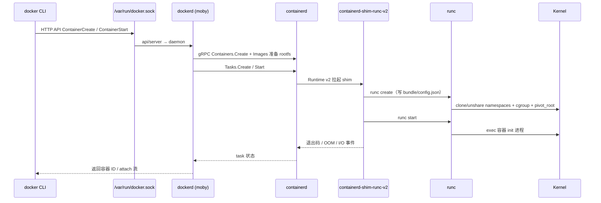
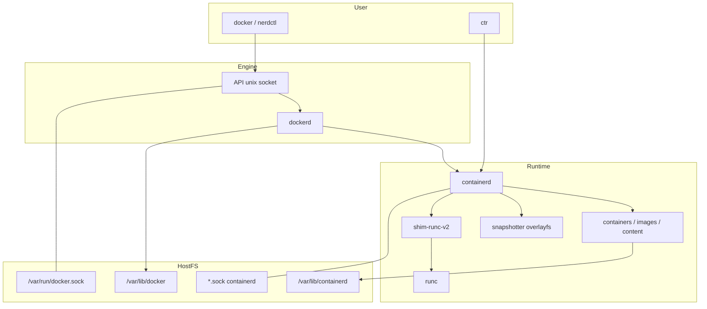
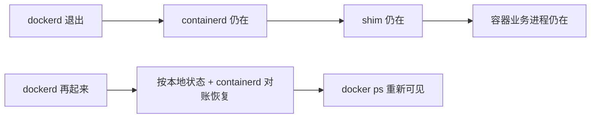

# docker run 起不来？从 dockerd、containerd 到 runc 一条线讲透

`Cannot connect to the Docker daemon at unix:///var/run/docker.sock`；`docker ps` 空的但 `ps aux | grep containerd-shim` 一堆还在；`ctr -n moby containers ls` 看得到、`docker inspect` 却报 not found；升级后 `runc` 报 `OCI runtime create failed`——这些不是「Docker 玄学」，而是 **CLI → dockerd（Moby）→ containerd → containerd-shim-runc-v2 → runc → 内核 namespaces/cgroup** 这条链某一环断了。本文按真实上游路径（moby/moby、containerd/containerd、opencontainers/runc）把 daemon、镜像/容器生命周期、socket、配置与排障串成一条可验证主线。

## 阅读地图

1. **第一层：角色分工与 OCI 边界**——解决「dockerd / containerd / runc / shim 各自管什么、镜像与容器状态落在哪」。
2. **第二层：docker run 主调用链**——解决「从 API 到 create/start，gRPC、task、shim、OCI bundle 如何接力」。
3. **第三层：配置、socket 与存储布局**——解决「daemon.json、containerd config.toml、数据目录、rootless 差在哪」。
4. **第四层：观测与对照工具**——解决「docker / ctr / nerdctl / journalctl / nsenter 怎么对照同一容器」。
5. **第五层：坑、边界与验证闭环**——解决「起不来、僵死、权限、版本错配如何按层定位并可复现」。

## 源码锚点

| 路径 / 符号 | 作用 |
|-------------|------|
| `moby/moby/cmd/dockerd/` | `dockerd` 进程入口、flag、与 systemd 对接 |
| `moby/moby/daemon/daemon.go` | Engine 核心：加载配置、恢复容器、挂路由 |
| `moby/moby/daemon/start.go`、`container_operations_unix.go` | 容器 Start / 与 runtime 交互 |
| `moby/moby/api/server/` | HTTP API（unix socket `/var/run/docker.sock`） |
| `moby/moby/client/` | CLI/`docker` 客户端 SDK |
| `moby/moby/libcontainerd/` | dockerd 侧对 containerd 的客户端封装 |
| `containerd/containerd/cmd/containerd/` | `containerd` daemon 入口 |
| `containerd/containerd/services/containers/` | 容器元数据服务（持久化 container 对象） |
| `containerd/containerd/services/tasks/` | Task（运行中进程）服务 |
| `containerd/containerd/runtime/v2/` | Runtime v2：拉起 shim、管理生命周期 |
| `containerd/containerd/cmd/containerd-shim-runc-v2/` | shim 进程：守护 runc、转发 I/O/信号 |
| `containerd/containerd/pkg/cri/` | CRI 插件（kubelet 走这路，与 Docker CLI 不同入口） |
| `opencontainers/runc/`（`main.go`、`create.go`、`start.go`） | OCI Runtime：按 `config.json` 建 ns/cgroup 并 exec |
| `opencontainers/runc/libcontainer/` | 实际 `clone`/`pivot_root`/cgroup 组装 |
| `opencontainers/runtime-spec` | OCI Runtime Spec：`config.json` 字段语义 |
| `opencontainers/image-spec` | OCI Image Spec：manifest/config/layers |
| `/var/run/docker.sock`（或 `/run/docker.sock`） | Docker Engine API socket |
| `/run/containerd/containerd.sock` | 系统 containerd（或发行版路径） |
| `/var/run/docker/containerd/containerd.sock` | Docker 自带/捆绑 containerd 常见路径 |
| `/etc/docker/daemon.json` | dockerd 静态配置 |
| `/etc/containerd/config.toml` | containerd 配置（含 CRI、snapshotter） |
| `/var/lib/docker/`、`/var/lib/containerd/` | 镜像层、元数据、content store |
| `ctr`、`nerdctl`、`crictl` | 绕过或对照 Docker CLI 的观测入口 |

OCI Runtime 配置骨架（容器真正「怎么隔离」写在这里，不在 Dockerfile）：

```json
{
  "ociVersion": "1.0.2",
  "process": {
    "terminal": false,
    "user": { "uid": 0, "gid": 0 },
    "args": ["sh", "-c", "sleep 3600"],
    "env": ["PATH=/usr/local/sbin:/usr/local/bin:/usr/sbin:/usr/bin:/sbin:/bin"],
    "cwd": "/"
  },
  "root": { "path": "rootfs", "readonly": false },
  "linux": {
    "namespaces": [
      { "type": "pid" },
      { "type": "network" },
      { "type": "ipc" },
      { "type": "uts" },
      { "type": "mount" },
      { "type": "cgroup" }
    ]
  }
}
```

runc 侧工厂与进程创建（读码时抓这几个符号即可）：

```go
// opencontainers/runc/libcontainer/factory_linux.go
// type Factory interface {
//   Create(id string, config *configs.Config) (Container, error)
//   Load(id string) (Container, error)
// }

// opencontainers/runc/libcontainer/process_linux.go
// 负责 start / exec / 信号；最终落到 clone/unshare、cgroup、pivot_root
```

containerd Runtime v2 与 shim 的职责边界（概念对应上游 `runtime/v2`）：

```text
containerd  →  启动 containerd-shim-runc-v2（每容器或每 pod 一组）
shim        →  调 runc create/start/kill/delete，接管 stdio、OOM、exit 事件
runc        →  一次性（或短生命周期）执行 OCI 动作后可退出；shim 常驻
```

本机先确认谁在听、谁在跑：

```bash
ls -l /var/run/docker.sock /run/docker.sock 2>/dev/null
ls -l /run/containerd/containerd.sock /var/run/docker/containerd/containerd.sock 2>/dev/null
systemctl is-active docker containerd 2>/dev/null
ps -ef | grep -E 'dockerd|containerd|containerd-shim|runc' | grep -v grep
docker info 2>/dev/null | sed -n '1,40p'
```

## 调用链

### 主调用链：`docker run` 从 CLI 到进程起来



### 架构与数据流：镜像层、元数据、运行时对象



### dockerd 重启后容器为何还能活



关键语义：`docker` CLI **从不** 直接调 `runc`；生产路径上几乎总是 **dockerd → containerd → shim → runc**。K8s 节点若只装 containerd，则是 **kubelet → CRI → containerd → shim → runc**，没有 dockerd。两条入口共享下层，排障时不要用错工具命名空间（Docker 常用 containerd namespace `moby`）。

## 重点知识

### 第一层：角色分工与 OCI 边界——谁对用户负责、谁对内核负责

**本层主问题：** 四个进程各管什么；镜像规格与运行时规格如何衔接。

#### 四个角色一句话

| 组件 | 对谁暴露 | 核心职责 | 不管什么 |
|------|----------|----------|----------|
| `docker` CLI | 人 | 拼 HTTP 请求、格式化输出 | 不持久化容器真相 |
| `dockerd` | Docker API | 兼容层、网络/卷/构建/swarm 等「产品能力」、把请求落到 containerd | 一般不直接 `clone` |
| `containerd` | gRPC | 镜像拉取/存储、容器元数据、task、快照 | 不实现 Docker 专有 Network/Volume UX |
| `runc` | OCI Runtime | 按 bundle 建隔离并启动进程 | 不管镜像仓库、不管 docker0 |

`containerd-shim-runc-v2` 是「容器侧监护进程」：让 **dockerd/containerd 重启时业务容器不跟着死**；收集退出状态；把 stdin/stdout/stderr 接到上层；代传信号。没有 shim、只有一次性 `runc run` 的演示路径，不具备 Engine 级运维语义。

#### OCI：Image Spec 与 Runtime Spec

- **Image Spec**：registry 上的 manifest、config、layer tar；`docker pull` / `ctr images pull` 最终落成 content-addressed blob。
- **Runtime Spec**：磁盘上一个 **bundle**（目录），至少含 `config.json` + `rootfs/`；`runc` 只认 bundle，不认 Dockerfile。

对接关系：containerd 的 snapshotter（常见 `overlayfs`）把镜像层挂成可写 rootfs，再生成/填充 `config.json`（过程、挂载、namespace、cgroup、seccomp），最后交给 shim/runc。Docker 的 `Dockerfile`、`ENTRYPOINT`、`-e`、`--memory` 最终都变成 Runtime Spec 字段或 cgroup 配置。

```bash
# 看镜像历史与配置（Docker 视角）
docker image inspect nginx:alpine --format '{{.Config.Cmd}} {{.Config.Entrypoint}}'
# 看容器最终生效的命令与主机 Pid（外层）
docker inspect <cid> --format 'Pid={{.State.Pid}} Status={{.State.Status}} OOM={{.State.OOMKilled}}'
```

#### 「容器」在不同层含义不同

| 说法 | 真实含义 |
|------|----------|
| `docker create` 成功 | dockerd/containerd 有了容器元数据与 rootfs 准备，**进程未必在** |
| `docker start` 成功 | task 已创建，shim/runc 已把 init 拉起来 |
| `ctr containers ls` | containerd 容器对象（可能无 task） |
| `ctr tasks ls` | 正在跑或刚退出未清的任务 |
| `ps` 里的业务进程 | 内核里的真实任务，位于某套 namespaces/cgroup |

排障口诀：**先分清「元数据在不在」和「进程在不在」**。元数据在、进程不在 → start/exit/OOM；进程在、Docker API 看不到 → dockerd 状态丢失或连错 socket。

#### 历史脉络（避免文档错乱）

早期 Docker 内嵌 libcontainer；后来拆出 runc（OCI），再把容器执行迁到 containerd。今天说「Docker」常指 **Moby Engine（dockerd）+ 依赖的 containerd + runc**。发行版可能：

- 一套 systemd：`docker.service` 依赖 `containerd.service`；
- 或 dockerd 使用自己的 containerd socket（路径带 `/var/run/docker/containerd/`）。

```bash
systemctl cat docker.service 2>/dev/null | sed -n '1,60p'
systemctl cat containerd.service 2>/dev/null | sed -n '1,40p'
# 看 dockerd 实际参数里 --containerd 指向哪
ps -ef | grep dockerd | grep -v grep
```

### 第二层：docker run 主调用链——Create 与 Start 必须拆开看

**本层主问题：** Create/Start 各自写什么状态；失败应落在哪一层报错。

#### Create：准备「能跑的文件系统 + 规格」

典型路径（逻辑顺序，对应 moby daemon + containerd API）：

1. 解析镜像引用，必要时 pull（走 registry → content store）。
2. 分配容器 ID/名称，写 dockerd 本地状态（`/var/lib/docker/containers/<id>/` 常见含 `config.v2.json`、`hostconfig.json`）。
3. 通过 libcontainerd 在 containerd 创建 container 对象，snapshot 出可写 rootfs。
4. 组装网络 endpoint、挂载卷、设备、资源限制等到运行时配置。
5. **此时可以还没有业务进程**——所以 `docker create` 成功 ≠ 服务已监听端口。

```bash
IMG=nginx:alpine
docker pull "$IMG"
CID=$(docker create --name demo-create "$IMG")
echo "CID=$CID"
docker inspect "$CID" --format '{{.State.Status}}'   # 多为 created
ps -ef | grep "$CID" | grep -v grep || true          # 通常还没有业务进程
```

#### Start：真正拉起 shim + runc

Start 阶段 containerd `Tasks` 服务会：

1. 准备 bundle（rootfs 挂载点 + `config.json`）。
2. 启动 `containerd-shim-runc-v2`（参数含 namespace、id、containerd 地址）。
3. shim 调 `runc create` → 进入 paused/created 态（实现细节随版本）。
4. `runc start` → 容器 init 运行；shim 监视 exit。
5. 事件回传：`docker events`、containerd events 可见。

```bash
docker start demo-create
docker inspect demo-create --format 'Status={{.State.Status}} Pid={{.State.Pid}}'
PID=$(docker inspect -f '{{.State.Pid}}' demo-create)
tr '\0' ' ' < /proc/$PID/cmdline; echo
ls -l /proc/$PID/ns/
cat /proc/$PID/cgroup | head
```

#### `docker run` = create + start（+ 可选 attach）

```bash
docker run -d --name demo-run nginx:alpine
docker logs --tail 20 demo-run
docker exec demo-run ps aux
# exec 另起进程进同一套 namespaces，不是「SSH 进虚拟机」
```

`docker exec` 在实现上是向 **已有 task** 再发一个 process（仍经 containerd/shim/runc exec 路径），共享该容器的 namespaces/cgroup，可另设 user/env。容器主进程已死时 exec 会失败——先看 `State.Status` 与 `Pid`。

#### 错误落点对照

| 报错关键词 | 优先怀疑层 |
|------------|------------|
| `Cannot connect to the Docker daemon` / `permission denied` socket | CLI ↔ dockerd socket / 权限 / 服务没起 |
| `Error response from daemon: ...` 但服务活着 | dockerd 业务逻辑（镜像、名字冲突、网络） |
| `containerd: ...` / `failed to create shim` | containerd 或 shim 二进制、cgroup 驱动 |
| `OCI runtime create failed` / `runc` | 内核特性、seccomp、权限、rootfs、cgroup |
| `overlay` / `snapshotter` / `failed to mount` | 存储驱动、磁盘、xfs ftype、嵌套挂载 |

```bash
# 人为制造「daemon 不可达」与「OCI 失败」的观测差
docker run --rm busybox true
# 停掉 docker 后再试（实验环境）
# sudo systemctl stop docker
# docker run --rm busybox true
# → 应变成 socket 连接错误，而不是 OCI 错误
```

#### 命名空间：`moby` 很关键

Docker 管理的 containerd 对象默认在 **namespace `moby`**。直接 `ctr containers ls` 看到的是 `default`，会误判「containerd 是空的」。

```bash
sudo ctr -n moby containers ls
sudo ctr -n moby tasks ls
sudo ctr -n moby images ls | head
# 对比
sudo ctr containers ls
```

### 第三层：配置、socket 与存储布局——改错文件等于改错进程

**本层主问题：** 改 `daemon.json` 还是 `config.toml`；数据目录与 socket 如何对齐。

#### dockerd：`/etc/docker/daemon.json`

常见键（以本机 Docker 文档/版本为准，不要抄过时默认值当真理）：

```json
{
  "hosts": ["unix:///var/run/docker.sock"],
  "log-level": "info",
  "storage-driver": "overlay2",
  "data-root": "/var/lib/docker",
  "exec-opts": ["native.cgroupdriver=systemd"],
  "registry-mirrors": [],
  "insecure-registries": [],
  "live-restore": true,
  "max-concurrent-downloads": 3,
  "default-ulimits": {},
  "features": { "buildkit": true }
}
```

要点：

- `hosts` 与 systemd 的 `-H` **冲突**时 dockerd 会拒启——这是「改完 daemon.json 起不来」高频坑。
- `live-restore: true` 让 dockerd 重启时尽量不杀容器（仍依赖 containerd/shim 常驻）。
- `data-root` 迁移必须停服务、拷数据、改配置、再启动，否则元数据与层分裂。
- cgroup driver 要与 kubelet 一致（若该节点也跑 K8s）：`systemd` vs `cgroupfs`。

```bash
# 配置语法与有效信息
docker info
docker info -f '{{.CgroupDriver}} {{.Driver}} {{.DockerRootDir}}'
# 校验 JSON
python3 -m json.tool /etc/docker/daemon.json >/dev/null
```

systemd drop-in 常见位置：

```bash
ls /etc/systemd/system/docker.service.d/ 2>/dev/null
systemctl show docker -p FragmentPath -p DropInPaths -p Environment
```

#### containerd：`/etc/containerd/config.toml`

K8s 节点更常改这份。生成默认配置：

```bash
containerd config default | sudo tee /etc/containerd/config.toml >/dev/null
# 关注：
# - disabled_plugins / 是否启用 cri
# - SystemdCgroup = true（cgroup v2 / systemd 驱动场景）
# - snapshotter = "overlayfs"
# - sandbox_image（pause 镜像）
```

与 Docker 共存时：可能有 **两份** containerd（系统一份、Docker 捆绑一份）。改错 toml、看错 sock，会出现「kubelet 正常、docker 异常」或相反。

```bash
sudo ls -l /run/containerd/containerd.sock /var/run/docker/containerd/containerd.sock 2>/dev/null
sudo ctr --address /run/containerd/containerd.sock version
sudo ctr --address /var/run/docker/containerd/containerd.sock version 2>/dev/null
```

#### 存储目录对照

| 路径 | 典型内容 |
|------|----------|
| `/var/lib/docker/overlay2/` | Docker 管理的层与 diff（storage-driver=overlay2） |
| `/var/lib/docker/containers/` | 每容器 `config.v2.json`、日志、hosts |
| `/var/lib/docker/image/` | 镜像图、layerDB 引用 |
| `/var/lib/containerd/io.containerd.content.v1.content/` | content-addressed blob |
| `/var/lib/containerd/io.containerd.snapshotter.v1.overlayfs/` | snapshot |
| `/var/lib/containerd/io.containerd.runtime.v2.task/` | runtime/shim 状态 |

```bash
sudo du -sh /var/lib/docker /var/lib/containerd 2>/dev/null
sudo ls /var/lib/docker/containers | head
docker system df
```

磁盘满时的典型表象：pull 失败、创建容器失败、日志写挂；先 `df -h` / `df -i`，再 `docker system df`，不要先删随机目录。

#### rootless 与权限

rootless Docker 把 socket 放在用户运行时目录（如 `$XDG_RUNTIME_DIR/docker.sock`），用 user namespace 映射。症状：`sudo docker` 与普通用户 `docker` 看到两套完全不同的引擎。

```bash
echo "DOCKER_HOST=$DOCKER_HOST"
ls -l /var/run/docker.sock 2>/dev/null
ls -l ${XDG_RUNTIME_DIR:-/run/user/$(id -u)}/docker.sock 2>/dev/null
id; groups   # 是否在 docker 组
```

#### 构建：BuildKit 与 classic builder

现代 Docker 默认 BuildKit（`docker buildx` / `DOCKER_BUILDKIT=1`）。构建是 **另一条** 链路（buildkitd 或内嵌 worker），排「镜像构建失败」时不要只盯 runc create。运行时起不来才回到本文主链。

```bash
docker buildx version
docker info -f '{{.DriverStatus}}' 2>/dev/null
export DOCKER_BUILDKIT=1
```

### 第四层：观测与对照工具——同一容器三副眼镜

**本层主问题：** docker / ctr / 内核视角如何对齐；日志从哪读。

#### 三副眼镜

1. **Docker API 眼镜**：`docker ps/inspect/logs/events`
2. **containerd 眼镜**：`ctr -n moby ...` 或 `nerdctl`
3. **内核眼镜**：`/proc/<pid>/ns`、`cgroup`、`lsns`、`nsenter`

```bash
NAME=demo-obs
docker rm -f "$NAME" 2>/dev/null
docker run -d --name "$NAME" nginx:alpine
CID=$(docker inspect -f '{{.Id}}' "$NAME")
PID=$(docker inspect -f '{{.State.Pid}}' "$NAME")
echo "CID=$CID PID=$PID"

docker inspect "$NAME" --format '{{.State.Status}} {{.HostConfig.Memory}} {{.HostConfig.NetworkMode}}'
sudo ctr -n moby containers info "$CID" 2>/dev/null | head -40
sudo ctr -n moby tasks ls | grep -E "${CID:0:12}|${NAME}" || sudo ctr -n moby tasks ls | head

readlink /proc/$PID/ns/pid /proc/$PID/ns/mnt /proc/$PID/ns/net
cat /proc/$PID/cgroup | head
sudo nsenter -t "$PID" -n ip addr
```

`nerdctl` 提供接近 Docker UX、直连 containerd 的体验；适合「没有 dockerd、只有 containerd」的环境。`crictl` 走 CRI，面向 pause/pod sandbox，字段与 `docker ps` 不是同一套对象。

```bash
nerdctl --namespace moby ps 2>/dev/null | head
crictl ps 2>/dev/null | head
```

#### 日志与事件

| 来源 | 命令 / 路径 |
|------|-------------|
| 容器 stdout（json-file 驱动） | `docker logs`；文件常在 `/var/lib/docker/containers/<id>/<id>-json.log` |
| dockerd | `journalctl -u docker -e` |
| containerd | `journalctl -u containerd -e` |
| 事件流 | `docker events`；`ctr events` |

```bash
docker events --since 5m &
EPID=$!
docker restart "$NAME"
sleep 2
kill $EPID 2>/dev/null
journalctl -u docker -u containerd --since "10 min ago" --no-pager | tail -80
```

日志驱动若是 `journald`/`syslog`，`*-json.log` 可能不存在——以 `docker inspect --format '{{.HostConfig.LogConfig}}'` 为准。

#### shim 进程怎么认

```bash
ps -ef | grep containerd-shim-runc-v2 | grep -v grep | head
# 参数里通常有 -namespace moby -id <container-id> -address <containerd.sock>
```

shim 还在、业务 Pid 没了：多半主进程退出但未 delete；`docker ps -a` 看 Exited 与 ExitCode。shim 没了、Docker 仍显示 running：状态机失真，需对账或重启 engine（先备份、再操作）。

#### 网络与存储观测入口（只点到边界）

- 网络细节见 bridge/veth 专题；此处只要求会：`docker network inspect`、`nsenter -n`、`iptables/nft`。
- 存储细节见 overlay 专题；此处只要求会：`docker inspect --format '{{.GraphDriver}}'`、`findmnt`、`mount | grep overlay`。

```bash
docker inspect "$NAME" --format '{{json .NetworkSettings.IPAddress}} {{json .NetworkSettings.Networks}}'
docker inspect "$NAME" --format '{{json .GraphDriver}}'
findmnt | grep -E "overlay|nsfs" | head
```

### 第五层：坑、边界与验证闭环——按层定位，不靠猜

**本层主问题：** 高频故障如何分层；怎样用最小命令闭环验证。

#### 坑 1：socket 权限与连错引擎

```text
Got permission denied while trying to connect to the Docker daemon socket
at unix:///var/run/docker.sock
```

原因通常是：用户不在 `docker` 组、或 `DOCKER_HOST` 指向别处、或 rootless/系统引擎混用。

```bash
ls -l /var/run/docker.sock
groups
getent group docker
echo "$DOCKER_HOST"
# 临时验证（注意安全边界）
sudo docker info >/dev/null && echo "sudo ok"
```

修复方向：把用户加入 `docker` 组并重新登录；或显式 `export DOCKER_HOST=unix:///var/run/docker.sock`；不要用 `chmod 777` 当长期方案。

#### 坑 2：daemon.json 与 systemd `-H` 打架

改完 `/etc/docker/daemon.json` 后 `systemctl start docker` 失败，journal 里常见 `unable to configure the Docker daemon with file` 或 hosts 冲突。

```bash
sudo journalctl -u docker -b --no-pager | tail -50
# 处理：要么去掉 unit 里的 -H fd:// / -H unix://...，要么去掉 json 里的 hosts
systemctl cat docker.service | grep -E 'ExecStart|hosts'
```

#### 坑 3：cgroup 驱动 / cgroup v2 不一致

症状：`OCI runtime create failed`、无法写 cgroup、K8s 与 Docker 混部时 kubelet 报 cgroup driver。

```bash
stat -fc %T /sys/fs/cgroup
docker info -f '{{.CgroupVersion}} {{.CgroupDriver}}'
# containerd 的 SystemdCgroup 是否与之匹配（K8s 场景）
```

#### 坑 4：storage driver / 磁盘 / inode

```bash
df -h /var/lib/docker /var/lib/containerd
df -i /var/lib/docker
docker info -f '{{.Driver}} {{.DriverStatus}}'
dmesg -T | tail -30
```

xfs 未开 `ftype=1`、磁盘只读、overlay 嵌套过深，都会在 create/start 阶段爆。

#### 坑 5：名字冲突、幽灵容器、状态失真

```bash
docker ps -a --filter name=demo
docker rm -f demo 2>/dev/null
# containerd 侧残留时（谨慎）：
sudo ctr -n moby tasks ls
sudo ctr -n moby containers ls | head
```

Docker 显示 running 但 `/proc/<pid>` 不存在：先 `docker inspect` 再决定 `docker update`/`restart`/`kill`；必要时重启 docker（`live-restore` 场景下容器可保留）。

#### 坑 6：版本错配

dockerd、containerd、runc、内核 seccomp 档案不匹配时，升级后老容器起不来。

```bash
docker version
containerd --version
runc --version
uname -r
```

保持发行版同一通道升级；手工替换 `/usr/local/bin/runc` 是高危操作。

#### 坑 7：把 containerd namespace 搞错

```bash
sudo ctr -n default containers ls
sudo ctr -n moby containers ls
sudo ctr -n k8s.io containers ls 2>/dev/null | head
```

K8s 常用 `k8s.io`，Docker 常用 `moby`。工具默认 namespace 不同，别跨场景复制命令。

#### 边界：Docker 不等于「所有容器」

- 仅 containerd + nerdctl/CRI 的环境没有 `/var/run/docker.sock`。
- Podman/CRI-O 是另一条用户态栈，命令相似不等于 daemon 相同。
- `docker run --privileged`、`--pid=host`、`--network=host` 会主动削弱隔离，排障时先看 HostConfig。

```bash
docker inspect "$NAME" --format '{{.HostConfig.Privileged}} {{.HostConfig.PidMode}} {{.HostConfig.NetworkMode}} {{.HostConfig.CapAdd}} {{.HostConfig.SecurityOpt}}'
```

#### 验证闭环 A：最小 run

```bash
docker run --rm busybox:1.36 echo ok
# 期望：打印 ok，退出码 0
echo exit=$?
```

失败则按报错关键词回到第二层「错误落点表」。

#### 验证闭环 B：Create/Start 分解

```bash
docker rm -f v-create 2>/dev/null
CID=$(docker create --name v-create busybox:1.36 sleep 300)
docker inspect -f '{{.State.Status}}' "$CID"    # created
test -z "$(docker inspect -f '{{.State.Pid}}' "$CID" | grep -v '^0$')" && echo "no pid yet"
docker start "$CID"
PID=$(docker inspect -f '{{.State.Pid}}' "$CID")
test -d /proc/$PID && echo "proc ok pid=$PID"
sudo ctr -n moby tasks ls | grep "${CID:0:12}" || true
docker rm -f "$CID"
```

#### 验证闭环 C：shim 与 live 语义

```bash
docker rm -f v-live 2>/dev/null
docker run -d --name v-live busybox:1.36 sleep 600
PID=$(docker inspect -f '{{.State.Pid}}' v-live)
ps -ef | grep containerd-shim-runc-v2 | grep -v grep | head -3
# 若开启 live-restore，可在维护窗口试验：
# sudo systemctl restart docker
# sleep 3
# test -d /proc/$PID && echo "process survived dockerd restart"
docker rm -f v-live
```

#### 验证闭环 D：socket 与权限

```bash
python3 - <<'PY'
import socket, sys
s = socket.socket(socket.AF_UNIX, socket.SOCK_STREAM)
try:
    s.connect("/var/run/docker.sock")
    print("connect_ok")
except Exception as e:
    print("connect_fail", e)
    sys.exit(1)
PY
docker info >/dev/null && echo "api_ok"
```

#### 验证闭环 E：对照三眼镜

```bash
docker rm -f v-3 2>/dev/null
docker run -d --name v-3 nginx:alpine
CID=$(docker inspect -f '{{.Id}}' v-3)
PID=$(docker inspect -f '{{.State.Pid}}' v-3)
echo "docker-status=$(docker inspect -f '{{.State.Status}}' v-3)"
echo "ctr-task:"; sudo ctr -n moby tasks ls | grep "${CID:0:12}" || sudo ctr -n moby tasks ls | head
echo "kernel-ns:"; readlink /proc/$PID/ns/net
docker rm -f v-3
```

三处一致才算「引擎健康」；只一处正常说明状态在某一层分叉。

#### 源码阅读顺序（按排障目标）

1. 先搞清本机实际二进制与 socket：`docker version`、`ps`、`systemctl cat`。
2. moby：`api/server` → `daemon` Start/Create → `libcontainerd`。
3. containerd：`services/containers`、`services/tasks`、`runtime/v2`。
4. shim：`cmd/containerd-shim-runc-v2`。
5. runc：`libcontainer` 的 create/start，对照 OCI `config.json`。
6. 需要隔离细节时再下钻内核 namespace/cgroup（见同系列 Namespace/Cgroups 文）。

#### 设计取舍（读码时抓住「为什么拆三层」）

- **dockerd** 保留 Docker UX 与生态（compose、network、volume、build）。
- **containerd** 做可被多方复用的核心运行时服务（Docker 与 CRI 共用思想）。
- **runc** 聚焦 OCI 与内核能力，便于替换（crun 等实现可并存，取决于配置）。
- **shim** 把「守护进程生命周期」从「业务容器生命周期」解耦，换来可维护的升级与崩溃恢复。

把报错当成层间接口失败，而不是「Docker 坏了」：socket 失败停在用户↔dockerd；`Error response from daemon` 停在 dockerd；shim/runc/OCI 停在运行时与内核。按本文地图从上往下走，大多数 `docker run` 起不来的问题可以在一小时内定位到具体层，并用闭环命令证明修复有效。
