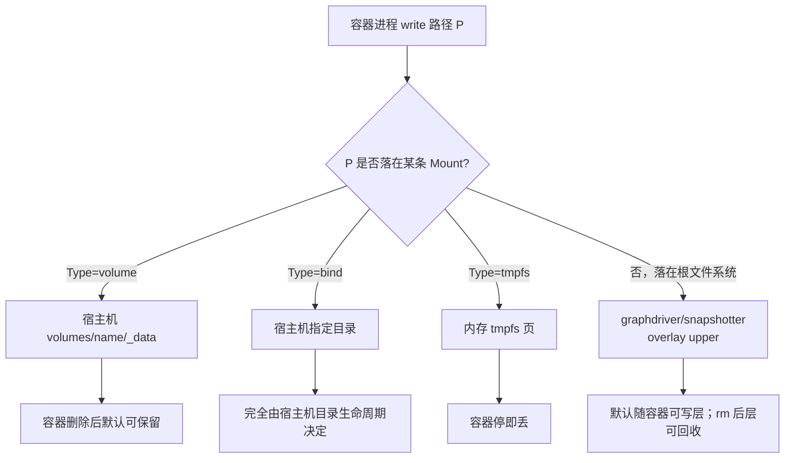
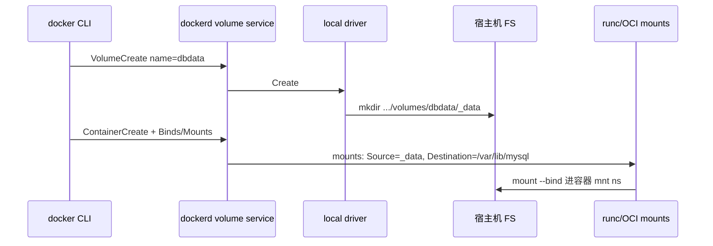
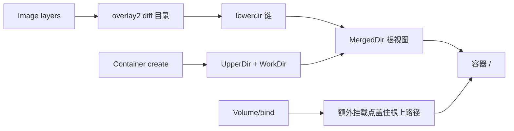

# 容器一删数据没了？Volume、bind mount 与 graphdriver 一条线讲透

`docker rm -v` 之后数据库目录空了；明明写了 `/data`，容器重建却回滚到镜像里的空目录；`df` 显示根分区还有空间，Docker 却报 `no space left on device`——根因多半不在应用，而在 **可写层（graphdriver/snapshotter）与 Volume / bind / tmpfs 三条持久化路径被搞混**。本文按 Moby volume、`overlay2` graphdriver、历史 `devicemapper`、containerd snapshotter 的真实路径与命令，把「写进容器的字节到底落在哪」拆成可逐步 `inspect`/`findmnt`/`du` 验证的主线。源章节合并自 071～076（Docker 存储：概念、机制、关键点、源码、配置、问题）。

## 阅读地图

1. **第一层：存储模型三分法**——解决「可写层、named volume、bind、tmpfs 各自生命周期差在哪、数据为何一删就没」。
2. **第二层：Volume 与 local driver**——解决「`docker volume` 创建/挂载/inspect、数据目录在哪、权限与 SELinux 标签」。
3. **第三层：graphdriver 与 overlay2**——解决「镜像层与容器 UpperDir 如何叠、和 volume 如何并存」。
4. **第四层：device-mapper 历史与 containerd snapshotter**——解决「旧驱动为何被弃、containerd 时代存储边界如何切」。
5. **第五层：迁移备份与排障**——解决「搬迁 data-root、备份 volume、ENOSPC、权限、误删如何分层定位」。

## 源码锚点

| 路径 / 符号 | 作用 |
|-------------|------|
| Moby `volume/`、`volume/local/` | named volume 框架与默认 **local** 驱动 |
| Moby `volume/service/` | volume create/list/inspect/remove 服务层 |
| Moby `daemon/graphdriver/` | 经典 graphdriver 接口（Create/Get/Put/Diff） |
| Moby `daemon/graphdriver/overlay2/` | 默认文件级联合驱动 |
| Moby `daemon/graphdriver/devmapper/` | 历史块级 thin-pool 驱动（已不推荐） |
| containerd `snapshots/`、`snapshots/overlay/` | OCI snapshotter；`overlayfs` 插件 |
| containerd `diff/`、`content/` | layer 解压、内容寻址 blob |
| runc / OCI runtime spec `mounts` | 容器启动时把 volume/bind/tmpfs 写入 mount ns |
| `/var/lib/docker/` | Docker 数据根（可用 `data-root` 改） |
| `/var/lib/docker/volumes/<name>/_data` | local volume 默认数据目录 |
| `/var/lib/docker/overlay2/` | overlay2 层与容器 upper |
| `/var/lib/containerd/io.containerd.snapshotter.v1.overlayfs/` | containerd overlayfs snapshot 根 |
| `docker info` → Storage Driver / DockerRootDir | 运行时确认驱动与根路径 |
| `docker volume ls/inspect`、`docker system df` | 用户态观测 |
| `findmnt`、`mountinfo`、`du`、`df -i` | 宿主机侧核对挂载与空间 |
| 内核 `fs/overlayfs/` | overlay2 后端语义（详见 UnionFS 合并文） |

本机先摸清「根目录 + 驱动 + volume 列表」：

```bash
docker info 2>/dev/null | grep -iE 'Storage Driver|Docker Root Dir|Backing Filesystem|Logging'
docker system df
docker volume ls
DROOT=$(docker info -f '{{.DockerRootDir}}' 2>/dev/null || echo /var/lib/docker)
echo "DockerRootDir=$DROOT"
sudo ls "$DROOT" | head
sudo ls "$DROOT/volumes" 2>/dev/null | head
sudo ls "$DROOT/overlay2" 2>/dev/null | head
```

`daemon.json` 里与存储相关的常见键（改前备份，改后需重启 dockerd；**切换 Storage Driver 不等于无损迁移已有层**）：

```json
{
  "data-root": "/var/lib/docker",
  "storage-driver": "overlay2",
  "storage-opts": []
}
```

Volume 在容器 inspect 中的形态（字段名以本机 `docker inspect` 为准）：

```bash
CID=<container>
docker inspect "$CID" --format '{{json .Mounts}}' | python3 -m json.tool
docker inspect "$CID" --format '{{json .GraphDriver}}' | python3 -m json.tool
```

`Mounts` 里看 `Type`（`volume` / `bind` / `tmpfs`）、`Source`、`Destination`、`RW`、`Propagation`；`GraphDriver.Data` 里看 `UpperDir` / `LowerDir` / `MergedDir` / `WorkDir`。二者回答的是不同问题：**Mounts = 你显式挂进来的持久化或临时盘；GraphDriver = 容器根文件系统那一层联合挂载。**

## 调用链

### 写文件：字节落在 volume 还是 UpperDir？



### `docker volume create` → 挂到容器



### 镜像层 → overlay2 可写层（与 volume 并行）



关键语义：若镜像里已有 `/var/lib/mysql`，你再挂 volume 到同一路径，**挂载点会盖住镜像里的内容**（首次用空 volume 时，Docker 可能把镜像目录内容复制进 volume——这是「volume 初始化」行为，排障时常被忽略）。

## 重点知识

### 第一层：存储模型三分法——为何「一删数据没了」

**本层主问题：** 容器里看到的文件系统由哪几部分拼成；哪些会随 `docker rm` 消失。

#### 容器根 = 联合挂载可写层，不是「磁盘分区」

每个可写容器默认有一份 **可写层（container layer）**：

- 后端在经典 Docker 上是 **graphdriver**（如今几乎都是 `overlay2`）。
- 在 containerd 路径上是 **snapshotter**（常见 `overlayfs`）。
- 进程对「未单独挂载」的路径写入，落到 **UpperDir**；镜像只读层在 LowerDir。

因此：

| 操作 | 可写层数据 | named volume | bind mount | tmpfs |
|------|------------|--------------|------------|-------|
| `docker stop` | 还在 | 还在 | 还在 | 通常随卸载丢 |
| `docker start` 同容器 | 还在 | 还在 | 还在 | 需重建挂载 |
| `docker rm`（不带 `-v`） | 默认回收可写层 | **volume 仍在** | 宿主机目录仍在 | 已无 |
| `docker rm -v` | 回收层 | **匿名 volume 常被删**；具名需看引用 | 不删宿主机目录 | — |
| 换新容器同 volume 名 | 新 upper | 数据可接上 | 数据可接上 | 空 |

「容器一删数据没了」的常见真相：

1. 数据写在 **可写层**（没 `-v` / `--mount`），`rm` 后 upper 没了。  
2. 用了 **匿名 volume**，又执行了 `docker rm -v` 或 prune。  
3. 写在 **tmpfs**（`--tmpfs` 或 tmpfs mount）。  
4. 以为 commit 了镜像，其实只 `docker commit` 了层，**没把 volume 内容打进镜像**（volume 内容本来就不会进 commit）。

```bash
# 演示：写可写层 vs 写 volume
docker volume create demo-vol
docker run --rm -v demo-vol:/data alpine sh -c 'echo vol > /data/a.txt; echo layer > /root/b.txt'
# 上面 --rm 会删容器；具名 volume 仍在
docker run --rm -v demo-vol:/data alpine cat /data/a.txt   # vol
# /root/b.txt 随容器层消失，无法取回
docker volume inspect demo-vol
```

#### 三种显式挂载

**1. named / anonymous volume（Type=volume）**

- 由 Docker volume 插件管理；默认驱动 **local**。  
- 具名：`docker volume create dbdata` 或 `-v dbdata:/var/lib/mysql`。  
- 匿名：`-v /var/lib/mysql`（只写容器路径），Docker 生成随机名；生命周期更「黏」容器，prune/`rm -v` 易误伤。

**2. bind mount（Type=bind）**

- `-v /host/path:/container/path` 或 `--mount type=bind,source=...,target=...`。  
- **不经** `volumes/` 目录抽象；直接绑定宿主机路径。  
- 适合源码热挂、证书、宿主机已有数据目录；坏处是路径可移植性差、权限/SELinux 更敏感。

**3. tmpfs（Type=tmpfs）**

- `--tmpfs /run` 或 `--mount type=tmpfs,destination=/tmp`。  
- 数据在内存（可 swap，视配置），适合密钥临时目录、高敏缓存；重启即无。

```bash
# 三种挂法对照（读 Mounts）
docker run -d --name stor-demo \
  -v demo-vol:/named \
  -v /tmp/host-bind:/bind \
  --tmpfs /tmpfs:rw,size=64m \
  alpine sleep 3600
docker inspect stor-demo --format '{{json .Mounts}}' | python3 -m json.tool
docker rm -f stor-demo
```

#### `--mount` 比 `-v` 更不易歧义

| 写法 | 说明 |
|------|------|
| `-v name:/path` | name 无 `/` 开头 → volume |
| `-v /abs:/path` | 绝对路径 → bind |
| `--mount type=volume,source=name,target=/path` | 显式 |
| `--mount type=bind,source=/abs,target=/path,ro` | 显式只读 bind |
| `--mount type=tmpfs,destination=/path,tmpfs-size=134217728` | 显式 tmpfs |

生产编排（Compose/Swarm/K8s）更推荐 **`--mount` / long syntax**，避免 `-v` 对「相对路径」等历史歧义。

#### 与 UnionFS 文的边界

- **Overlay/graphdriver**：回答「镜像如何共享、容器根如何可写」。  
- **Volume/bind**：回答「业务数据如何跨容器生命周期保留」。  
- 数据库、消息队列、用户上传 **不要** 只放在 overlay upper；应 volume 或 bind 到本地盘/LVM/云盘。

### 第二层：Volume 与 local driver——数据目录与权限

**本层主问题：** local volume 文件落在哪；`inspect` 各字段怎么读；权限与标签如何处理。

#### local driver 目录布局

默认：

```text
<DockerRootDir>/volumes/
  <volume-name>/
    _data/          # 实际文件
    # 另有元数据（如 opts）由 Docker 维护
```

```bash
DROOT=$(docker info -f '{{.DockerRootDir}}')
docker volume create app-data
docker volume inspect app-data
# Mountpoint 通常是 .../volumes/app-data/_data
MP=$(docker volume inspect -f '{{.Mountpoint}}' app-data)
sudo ls -la "$MP"
sudo touch "$MP/from-host.txt"
docker run --rm -v app-data:/data alpine ls -la /data
```

`docker volume inspect` 关键字段：

| 字段 | 含义 |
|------|------|
| `Name` | 卷名 |
| `Driver` | 通常 `local`；也可是插件名 |
| `Mountpoint` | 宿主机上的目录 |
| `Options` | local 时可含 `type`/`device`/`o`（把 volume 建成特定 FS 挂载） |
| `Labels` | 用户标签 |
| `Scope` | `local` 等 |

```bash
docker volume ls
docker volume ls -f dangling=true    # 无容器引用的卷
docker volume inspect app-data --format '{{.Mountpoint}} {{.Driver}}'
```

#### local 驱动的「高级」用法：把 volume 指到 NFS/块设备

local 驱动可通过 options 在创建时指定挂载类型（版本与权限要求以本机文档为准）：

```bash
# 概念示例：用 NFS 作 volume 后端（需内核 NFS、网络可达；生产请核对安全与锁）
docker volume create \
  --driver local \
  --opt type=nfs \
  --opt o=addr=192.0.2.10,rw,nfsvers=4 \
  --opt device=:/export/path \
  nfs-vol
docker volume inspect nfs-vol
```

也可 `type=ext4` + `device=/dev/disk/by-uuid/...` 等形式——本质是：**Docker 帮你在挂载到容器前，先在宿主机把该设备/远程 export 挂到 Mountpoint**。排障时先在宿主机 `findmnt` Mountpoint，确认不是「空目录伪装成功」。

#### 权限：uid/gid 与「Permission denied」

容器内进程常以非 root 运行（如 uid 999 的 postgres）。volume 在宿主机上默认属主多为 **root:root**，首次启动可能无法写入。

常见处理：

1. 入口脚本 `chown` Mountpoint（镜像官方 entrypoint 常见做法）。  
2. 宿主机预创建并 `chown 999:999` Mountpoint。  
3. 使用 **user namespace 映射** 时，宿主机看到的 uid 是映射后的大号——要以 `docker inspect` 的 User 与 `/etc/subuid` 一起算。  
4. **不要** 图省事 `chmod 777` 上生产。

```bash
docker run --rm -v app-data:/data --user 1000:1000 alpine \
  sh -c 'touch /data/u1000.txt' || echo failed
# 失败则：
MP=$(docker volume inspect -f '{{.Mountpoint}}' app-data)
sudo chown -R 1000:1000 "$MP"
# 再试
```

#### SELinux / AppArmor

启用 SELinux 的发行版上，bind 常需 `:Z` 或 `:z` 标签（共享/私有卷标签），否则容器内出现 Permission denied，宿主机 `ls` 却正常：

```bash
# bind + 私有容器标签（概念；以发行版 Docker SELinux 文档为准）
docker run --rm -v /path/on/host:/data:Z alpine ls /data
```

排障顺序：容器内 errno → 宿主机 `ls -lZ` Mountpoint → 是否缺 `:z/:Z` → 是否 user ns 映射。

#### 读写与传播（propagation）

bind 可设 `rshared`/`rslave`/`rprivate` 等传播标志，影响容器内再挂载是否可见到宿主机其它命名空间。默认多为 private。除非做嵌套容器/构建器，否则少改；乱改会导致「宿主机 umount 行为怪异」。

```bash
docker inspect <c> --format '{{range .Mounts}}{{.Destination}} {{.Propagation}}{{"\n"}}{{end}}'
```

#### Compose 中的 volumes

```yaml
services:
  db:
    image: postgres:16
    volumes:
      - pgdata:/var/lib/postgresql/data
volumes:
  pgdata:
    driver: local
```

`docker compose down` **默认不删** named volume；`down -v` 会删。这是生产误删第二常见来源（仅次于把数据放可写层）。

### 第三层：graphdriver 与 overlay2——根文件系统那一层

**本层主问题：** Storage Driver 管什么；overlay2 目录如何对应容器；和 volume 如何叠在同一 mount ns。

#### graphdriver 职责

经典 Docker 引擎用 graphdriver 管理：

- 镜像层的创建、差分、挂载；  
- 容器可写层的 Create/Get（挂出 MergedDir）；  
- `docker commit` / `build` 时的 Diff/ApplyDiff。

它 **不管** named volume 的业务文件内容（那是 volume 子系统）。两者在启动时汇合：先挂根（overlay），再按 OCI mounts 挂 volume/bind/tmpfs。

```bash
docker info | grep -i 'Storage Driver'
# 期望现代环境：overlay2
```

#### overlay2 目录要点

```bash
DROOT=$(docker info -f '{{.DockerRootDir}}')
sudo ls "$DROOT/overlay2" | head
CID=<container>
docker inspect "$CID" --format 'Upper={{.GraphDriver.Data.UpperDir}}
Merged={{.GraphDriver.Data.MergedDir}}
Work={{.GraphDriver.Data.WorkDir}}
Lower={{.GraphDriver.Data.LowerDir}}'
```

| 路径 | 含义 |
|------|------|
| `.../overlay2/<id>/diff` | 该层文件差 |
| `UpperDir` | 本容器可写层 diff |
| `WorkDir` | overlay work，须与 upper 同文件系统 |
| `MergedDir` | 运行时合并视图（停容器后可能空） |
| `l/` 短链接 | 缩短 lowerdir 选项长度 |

写入未挂载路径 → 进 UpperDir；写入 `/named` volume → **不会** 进 UpperDir。验证：

```bash
docker run -d --name ovl-vol -v demo-vol:/data alpine sleep 3600
docker exec ovl-vol sh -c 'echo in-vol > /data/x.txt; echo in-layer > /etc/y-layer.txt'
U=$(docker inspect ovl-vol --format '{{.GraphDriver.Data.UpperDir}}')
sudo grep -R 'in-layer' "$U" 2>/dev/null | head
sudo grep -R 'in-vol' "$U" 2>/dev/null | head   # 应找不到
MP=$(docker volume inspect -f '{{.Mountpoint}}' demo-vol)
sudo cat "$MP/x.txt"
docker rm -f ovl-vol
```

#### 镜像层占用 vs volume 占用

```bash
docker system df -v
sudo du -sh "$DROOT/overlay2" "$DROOT/volumes" 2>/dev/null
```

- `Images`/`Containers` 主要对应 overlay2（及 metadata）。  
- `Local Volumes` 对应 volumes。  
清理 `docker system prune -a` **默认不删 volume**；`prune --volumes` 才会动未使用卷——执行前必须再确认。

#### 只读根与临时写

```bash
docker run --rm --read-only --tmpfs /tmp alpine sh -c 'echo ok > /tmp/a; echo fail > /etc/x' || true
```

`--read-only` 让根（merged）只读，需写的路径用 volume/tmpfs 显式给出——这是安全加固常见套路，也逼你把持久化设计想清楚。

### 第四层：device-mapper 历史与 containerd snapshotter

**本层主问题：** 为何文档里还有 devicemapper；containerd 默认存储和 dockerd graphdriver 是何关系。

#### device-mapper（devicemapper）为何退出舞台

历史 Docker 在部分发行版默认用 **devicemapper** thin provisioning：

- 块级快照，每层/容器对应 thin device；  
- 依赖 loop 文件或直通块设备做 thin pool；  
- 运维成本高：`dmsetup`、pool 空间耗尽、`base` 设备、扩容痛苦；  
- 性能与稳定性质疑多，官方转向 **overlay2**。

```bash
# 若仍看到：
docker info 2>/dev/null | grep -i 'Storage Driver'
# Storage Driver: devicemapper  → 应规划迁移，勿在新环境新建
```

迁移要点（高危，需维护窗口）：

1. 备份 volumes 与必要镜像（`docker save` / 仓库拉取）。  
2. 停止 dockerd，**更换 storage-driver 不会自动转换已有 graph 数据**。  
3. 往往需要清空旧 `devicemapper` 元数据目录或换新 `data-root`，再重新拉取镜像、恢复 volume。  
4. 切勿假设「改 daemon.json 一项即可原地变身 overlay2」。

新环境：**直接 overlay2 + 本地 xfs/ext4**；不要为了「熟悉旧书」启用 devicemapper。

#### 其它历史/小众驱动

| 驱动 | 现状 |
|------|------|
| `aufs` | 依赖 out-of-tree，新内核/发行版基本淘汰 |
| `overlay`（无 2） | 旧实现；用 `overlay2` |
| `btrfs` / `zfs` | 需对应 FS；运维绑死专用文件系统 |
| `vfs` | 每层拷贝，测试用，生产勿用 |

#### containerd snapshotter

现代栈里，**镜像拉取与快照** 常由 containerd 完成，Docker 引擎再调用：

- snapshotter 名称常见：`overlayfs`、`native`、`btrfs` 等。  
- 数据根多在 `/var/lib/containerd/` 下按插件分子目录。  
- Kubernetes + CRI 路径几乎只谈 snapshotter，不再谈 Docker graphdriver。

```bash
# 若安装了 ctr
sudo ctr plugins ls 2>/dev/null | grep -i snapshot
sudo ls /var/lib/containerd/io.containerd.snapshotter.v1.overlayfs 2>/dev/null | head
```

概念对应：

| Docker 经典用语 | containerd / OCI 用语 |
|-----------------|----------------------|
| graphdriver | snapshotter |
| image layer | snapshot + content blob |
| container RW layer | active snapshot |
| `docker pull` | 下发 content，unpack 成 snapshot |

排障时先分清进程树：若是纯 `containerd`+`runc`/`crun`，去查 snapshotter 目录；若是 Docker Desktop/引擎，仍以 `docker info` 的 Storage Driver 与 `DockerRootDir` 为准，同时可能底层已接 containerd。

#### buildkit 与缓存

`docker build` 在 BuildKit 下缓存层也不在「随便一个容器 UpperDir」，而在 buildkit 自己的缓存树。清理构建缓存：

```bash
docker builder du
docker builder prune
```

不要把「build 缓存膨胀」误诊成「volume 泄漏」，反之亦然——用 `docker system df -v` 分栏看。

### 第五层：迁移备份与排障

**本层主问题：** 如何备份/搬迁；磁盘满、权限、误删如何按层查。

#### 备份策略按类型选

| 对象 | 推荐做法 | 注意 |
|------|----------|------|
| named volume | 停写或一致性快照后，打包 Mountpoint；或跑临时容器 `tar` | 数据库优先用官方 dump（pg_dump 等） |
| bind | 按宿主机目录备份 | 权限/ACL/xattr/SELinux |
| 可写层 | **不建议**当备份源；改为 volume | `docker commit` 不等于备份 volume |
| 镜像 | 仓库 + `docker save` | 不含 volume 数据 |

一致性打包 volume 示例：

```bash
VOL=app-data
MP=$(docker volume inspect -f '{{.Mountpoint}}' "$VOL")
# 应用层停写或 freeze 后：
sudo tar -C "$MP" -czf "/backup/${VOL}.tgz" .
# 或用容器（避免宿主机 UID 工具差异）：
docker run --rm -v "$VOL":/data -v /backup:/backup alpine \
  tar -C /data -czf /backup/${VOL}.tgz .
```

恢复：

```bash
docker volume create app-data
docker run --rm -v app-data:/data -v /backup:/backup alpine \
  tar -C /data -xzf /backup/app-data.tgz
```

#### 迁移 data-root

```bash
# 1. 停止 Docker
sudo systemctl stop docker docker.socket containerd 2>/dev/null
# 2. rsync 旧根到新盘（保持权限、xattr）
sudo rsync -aHAX --numeric-ids /var/lib/docker/ /mnt/newdisk/docker/
# 3. daemon.json 设置 "data-root": "/mnt/newdisk/docker"
# 4. 启动并验证
sudo systemctl start docker
docker info -f '{{.DockerRootDir}}'
docker volume ls
```

跨机迁移：镜像走仓库；volume 走打包或块存储快照；**不要**只拷 `overlay2` 却期望容器 ID 原样复活（元数据在 `containers/`、`image/` 等，版本敏感）。

#### 空间排障：ENOSPC 分层

```bash
DROOT=$(docker info -f '{{.DockerRootDir}}')
findmnt "$DROOT"
df -h "$DROOT"
df -i "$DROOT"          # inode 满同样 ENOSPC
sudo du -x -d1 "$DROOT" 2>/dev/null | sort -h
docker system df -v
```

| 症状 | 方向 |
|------|------|
| `df` 根还有空，Docker 报满 | data-root 在别的挂载点；或 inode 满 |
| `overlay2` 独大 | 悬空镜像/容器层；日志写可写层；build 缓存 |
| `volumes` 独大 | 业务数据增长；查最大 Mountpoint |
| 容器内 `df` 满 | 看的是 merged 视图，对照 UpperDir `du` |

```bash
# 找最大 volume
DROOT=$(docker info -f '{{.DockerRootDir}}')
sudo du -sh "$DROOT"/volumes/*/_data 2>/dev/null | sort -h | tail
# 找最大容器可写层
docker ps -aq | while read c; do
  u=$(docker inspect -f '{{.GraphDriver.Data.UpperDir}}' "$c" 2>/dev/null) || continue
  sudo du -sh "$u" 2>/dev/null | awk -v id="$c" '{print $1, id}'
done | sort -h | tail
```

清理命令要「认字」：

```bash
docker container prune
docker image prune
docker builder prune
docker volume prune          # 删未使用 volume，危险
docker system prune -a --volumes   # 极度危险，生产默认禁止随手跑
```

#### 权限与「文件消失」排障树

1. **确认挂载类型**  
   `docker inspect --format '{{json .Mounts}}'`  
2. **确认写到的路径是否被 volume 盖住**  
   镜像里旧文件「消失」可能是空 volume 盖住了路径。  
3. **确认 UpperDir 是否有你的文件**  
   有 → 数据在可写层，容器删了就没。  
4. **确认 Mountpoint 宿主机内容**  
   volume/bind 以宿主机为准。  
5. **user ns / SELinux**  
   宿主机看得到、容器 Permission denied。

```bash
CID=<container>
PID=$(docker inspect -f '{{.State.Pid}}' "$CID")
sudo nsenter -t "$PID" -m findmnt -R /
sudo nsenter -t "$PID" -m ls -la /data
docker inspect "$CID" --format '{{range .Mounts}}{{.Type}} {{.Source}} -> {{.Destination}}{{"\n"}}{{end}}'
```

#### volume 初始化拷贝的坑

首次将 **空** named volume 挂到镜像中 **已有内容** 的目录时，Docker 可能把镜像目录内容拷进 volume。之后镜像升级带来的目录变化 **不会** 再同步进已有 volume——表现为「升级镜像为何数据目录还是旧结构」。处理：文档化初始化、用 entrypoint 迁移脚本、或显式管理 schema，而不是指望再次拷贝。

#### 匿名 volume 与 dangling

```bash
docker volume ls -f dangling=true
# 结合
docker ps -a --filter volume=...
```

匿名卷在 Compose 未具名化时大量堆积，是磁盘被吃光的常见原因。规范：生产全部 **具名**，并在编排里声明。

#### 插件 volume（非 local）

`Driver` 不是 `local` 时，Mountpoint 可能只是衔接路径，真实数据在 Ceph/云盘/厂商插件侧。此时：

- `du` 本地 Mountpoint 无意义或只是缓存；  
- 备份走插件/云快照 API；  
- 排障先 `docker plugin ls` 与驱动日志。

```bash
docker plugin ls
docker volume inspect <name> --format '{{.Driver}} {{.Mountpoint}}'
```

#### 可复现实验室（建议整段跑一遍）

```bash
set -e
docker volume create lab-vol
mkdir -p /tmp/lab-bind && echo bind-src > /tmp/lab-bind/h.txt

docker run -d --name lab-stor \
  -v lab-vol:/vol \
  -v /tmp/lab-bind:/bind \
  --tmpfs /tftmp:size=16m \
  alpine sleep 3600

docker exec lab-stor sh -c '
  echo from-vol > /vol/v.txt
  echo from-bind > /bind/b.txt
  echo from-tmp > /tftmp/t.txt
  echo from-layer > /root/layer.txt
  ls -la /vol /bind /tftmp /root/layer.txt
'

echo '--- Mounts ---'
docker inspect lab-stor --format '{{json .Mounts}}' | python3 -m json.tool

echo '--- UpperDir should contain layer.txt only among these ---'
U=$(docker inspect lab-stor --format '{{.GraphDriver.Data.UpperDir}}')
sudo find "$U" -name 'layer.txt' 2>/dev/null
sudo find "$U" -name 'v.txt' 2>/dev/null || true

echo '--- Host volume ---'
sudo cat "$(docker volume inspect -f '{{.Mountpoint}}' lab-vol)/v.txt"

docker rm -f lab-stor
echo '--- After rm: volume data remains ---'
docker run --rm -v lab-vol:/vol alpine cat /vol/v.txt

docker volume rm lab-vol
rm -rf /tmp/lab-bind
echo lab_ok
```

期望：层文件随容器删除而不可再取；`lab-vol` 在 `rm` 容器后仍可读；tmpfs 文件随容器结束消失；bind 文件留在 `/tmp/lab-bind`。

#### 设计要点收束

Docker 存储可以收成四句话：

1. **可写层（overlay2/snapshotter）管根文件系统的写时复制，默认不持久跨「删容器」。**  
2. **Volume（local/_data）与 bind 管业务持久化；tmpfs 管易失内存盘。**  
3. **graphdriver/snapshotter 与 volume 子系统分立，排障先看 Mounts 再看 UpperDir。**  
4. **devicemapper 是历史包袱；新环境 overlay2 + 具名 volume + 认准 data-root 的 df/du。**

源章节 071～076（概念、机制、关键点、源码、配置、问题）在本文合并为：**三分法 → volume/local → overlay2 graphdriver → 历史驱动与 snapshotter → 迁移备份排障** 五层，避免把「Docker 存储」写成驱动名词表或只背 `docker volume` 子命令。

### 常见误区纠正

**误区 1：容器文件系统等于一块可热插拔云盘。**  
事实：默认是联合挂载可写层；云盘要你自己 bind/volume 挂进去。

**误区 2：`docker commit` 能备份数据库目录。**  
事实：commit 抓的是可写层差分；挂载进 volume 的数据 **不在** commit 里。

**误区 3：`docker system prune -a` 会清掉所有占空间的东西。**  
事实：默认不动 volume；加上 `--volumes` 才会，且可能删掉还要用的未挂载卷。

**误区 4：换 `storage-driver` 可原地升级数据。**  
事实：层数据不兼容自动转换；需备份镜像与卷、常换 data-root 或清空重建。

**误区 5：容器内 `df` 满就是宿主机根分区满。**  
事实：先 `findmnt` DockerRootDir，再 `df`/`df -i` 对准该挂载点；并区分 overlay 与 volumes。

**误区 6：删掉容器内文件就等于磁盘回收且不可恢复。**  
事实：在 overlay 上删 lower 文件只是 whiteout；镜像层仍占空间。volume 上删除才是删 Mountpoint 文件。

### 收束

一句话主线：

> **根上写 → UpperDir（易随容器层回收）；Volume/bind → 宿主机目录（可跨容器）；tmpfs → 内存（易失）。排障顺序固定为：Mounts 类型 → Mountpoint/Source → UpperDir → data-root 的 df/du/inode → 是否误用 prune/`rm -v`。**

把 `docker volume inspect`、`GraphDriver.Data`、`docker system df -v` 练熟，比背十张「存储驱动对比表」更能在磁盘告警时五分钟内找到真正吃空间的那一层。持久化设计在编排阶段用具名 volume 写死，比出事后从 overlay 残骸里救数据便宜得多。
