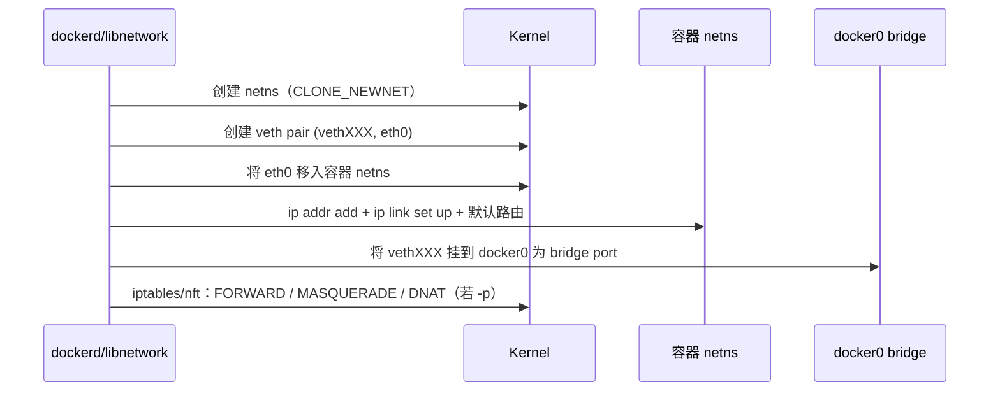
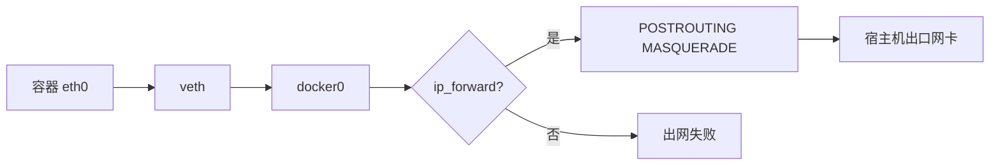

# 容器 ping 不通、`-p` 端口进不去？Docker bridge、veth、docker0 与 iptables/nft DNAT 一条线讲透

同 bridge 上两个容器互 ping 失败；宿主机 `curl localhost:8080` 无响应但容器内服务是好的；K8s 换了 CNI 后又出现「只有 ClusterIP 通、NodePort 不通」——大半不是应用挂了，而是 **netns + veth pair + linux bridge（docker0）+ iptables/nft DNAT/MASQUERADE** 这条链某环断了。本文按 Docker 默认 bridge 网络、内核 `net/core/dev.c`/`net/bridge/`、`iptables` NAT 表与 CNI 对比，把连通与端口映射拆成可逐步 `ip`/`nsenter`/`iptables-save` 验证的主线。

## 阅读地图

1. **第一层：网络命名空间与 Docker 网络模型**——解决「容器网卡为何「消失」、bridge/host/none/container 模式差在哪」。
2. **第二层：docker0、bridge 与 veth pair**——解决「一对 veth 如何跨 ns 接线、ARP/二层如何互通」。
3. **第三层：IP、路由与出网 MASQUERADE**——解决「容器能上网吗、SNAT 写在哪、dns 为啥解析失败」。
4. **第四层：`-p` 端口映射与 DNAT**——解决「宿主机端口如何落到容器、PREROUTING/DOCKER 链顺序」。
5. **第五层：与 CNI / 自定义网络对比**——解决「user-defined bridge、macvlan、host-gw/vxlan CNI 边界」。
6. **第六层：排障实战**——解决「ping 不通、端口映射失效、偶发丢包按哪层查」。

## 源码锚点

| 路径 / 符号 | 作用 |
|-------------|------|
| `net/core/net_namespace.c` | network namespace 创建/切换 |
| `net/core/dev.c` | net_device、跨 ns 移动设备 |
| `drivers/net/veth.c` | veth pair：一端进容器 ns，一端挂 bridge |
| `net/bridge/br_*.c` | Linux bridge 转发、FDB |
| `net/ipv4/netfilter/` | iptables/nft 挂钩点 |
| `net/netfilter/nf_nat*` | DNAT/SNAT/MASQUERADE |
| Docker `libnetwork` | Docker 网络控制器（桥接、端口映射编排） |
| `dockerd` 代理的 `docker0` | 默认 bridge 设备与网关 |
| `/var/run/docker.sock` + Network API | `NetworkCreate`/`Endpoint` |
| `/proc/sys/net/ipv4/ip_forward` | 容器出网前提：主机转发 |
| `iptables -t nat -L DOCKER` | Docker 注入的 NAT 链（legacy） |
| `nft list ruleset` | 新发行版可能走 nft 后端 |
| CNI spec `ADD/DEL` | K8s 插件式网络；对比 Docker 内建 |
| `man 8 ip-link` / `man 8 ip-netns` / `man 8 bridge` | 观测命令 |

本机先摸清默认网络与转发：

```bash
docker network ls
docker network inspect bridge
ip -d link show docker0 2>/dev/null
ip addr show docker0
sysctl net.ipv4.ip_forward
docker info 2>/dev/null | grep -iE 'Network|iptables|bridge|cgroup'
```

veth 驱动与 bridge 在内核中的角色（概念对应，非要求你改内核）：

```c
/* drivers/net/veth.c — 意图：成对设备，一端 xmit 即另一端 receive */
/* net/bridge/br_forward.c — 在桥接端口间按 FDB 转发帧 */
/* nf_nat — 改写 IP/端口，PREROUTING 做 DNAT，POSTROUTING 做 MASQUERADE */
```

Docker 默认 bridge 的网络对象字段（`docker network inspect bridge` 可见）：

```json
{
  "Name": "bridge",
  "Driver": "bridge",
  "IPAM": {
    "Config": [{ "Subnet": "172.17.0.0/16", "Gateway": "172.17.0.1" }]
  },
  "Options": {
    "com.docker.network.bridge.name": "docker0"
  }
}
```

端口映射在容器 inspect 中的形态：

```bash
docker inspect <c> --format '{{json .NetworkSettings.Ports}}'
# 例：{"80/tcp":[{"HostIp":"0.0.0.0","HostPort":"8080"}]}
docker inspect <c> --format '{{json .NetworkSettings.Networks}}'
```

## 调用链

### 创建一个 bridge 网络上的容器（接线）



### 宿主机访问 `-p 8080:80` 的包路径


### 容器访问外网（SNAT）



## 重点知识

### 第一层：网络命名空间与 Docker 网络模型

容器默认拥有**独立 network namespace**：自己的网卡列表、路由表、iptables（nft）规则、socket。宿主机 `ip addr` 看不到容器 `eth0`，必须 `nsenter -n` 或 `ip netns`（Docker 不总创建命名的 netns 文件，但可用 PID 进 ns）。

#### Docker 网络模式对照

| 模式 | 含义 | 典型场景 | 隔离 |
|------|------|----------|------|
| `bridge`（默认） | 进 docker0/自定义桥 | 通用服务 | 独立 netns + NAT |
| `host` | 与宿主机共享 netns | 极致性能、看主机端口 | **无网络隔离** |
| `none` | 只有 lo | 安全加固、旁路注入 | 无对外网卡 |
| `container:<id>` | 复用另一容器 netns | pause/sidecar | 共享该容器网络 |
| user-defined bridge | 独立桥与子网 | 多项目隔离、内置 DNS | 同默认桥机制，对象分离 |

```bash
docker run --rm --network host alpine ip addr | head
docker run --rm --network none alpine ip addr
# 对比默认：
docker run --rm alpine ip addr
```

#### 为何「容器里 ifconfig 和宿主机完全不同」

不是 Docker 藏了网卡，而是 **进程所在 netns 不同**。调试必须先固定「在哪个 ns 看」：

```bash
PID=$(docker inspect -f '{{.State.Pid}}' <c>)
sudo nsenter -t $PID -n ip addr
sudo nsenter -t $PID -n ip route
sudo nsenter -t $PID -n cat /etc/resolv.conf
```

`docker exec <c> ip addr` 等价于进同一 netns 执行，但有的精简镜像无 `ip` 命令，故 `nsenter` 更稳。

### 第二层：docker0、Linux bridge 与 veth pair

#### docker0 是什么

`docker0` 是一台 **Linux bridge**（二层交换机），默认网关 IP 常为 `172.17.0.1/16`。每个接在默认 bridge 网络上的容器，通过 **veth pair** 接到这座桥：

```text
容器 netns: eth0  ←———— veth pair ————→  宿主机: vethXXXX  (bridge port)
                                              ↓
                                         docker0 (172.17.0.1)
```

```bash
ip -d link show docker0
bridge link show | head
# 或
brctl show docker0 2>/dev/null
```

创建容器后对照 veth：

```bash
docker run -d --name net-demo alpine sleep 3600
PID=$(docker inspect -f '{{.State.Pid}}' net-demo)
# 容器侧
sudo nsenter -t $PID -n ip link
# 宿主机侧：找 peer
ip link show type veth
# 通过 ethtool 或 readlink 找 peer 索引
sudo nsenter -t $PID -n cat /sys/class/net/eth0/iflink
# 得到 ifindex 后在宿主机：
ip link | grep -A1 "^<ifindex>:"
docker rm -f net-demo
```

#### veth 的内核语义

veth 成对出现：在 A 端发送的帧，从 B 端接收。把 B 端当 bridge port，把 A 端移入容器 netns 并改名 `eth0`，即完成「虚拟网线插上交换机」。一端 down 或删掉，peer 会跟着没落——删容器时 libnetwork 负责拆 pair 与卸端口。

#### 同桥二层互通

同一 docker0 上的容器：IP 同网段、经桥转发，**一般不必经 NAT**。互通失败时先查：

1. 双方 `eth0` 是否 UP、是否同网段。  
2. bridge FDB 是否学到 MAC。  
3. 宿主机 `FORWARD` 链是否 DROP（Docker 通常插 ACCEPT 规则，被防火墙产品冲掉常见）。  
4. 是否其实不在同一 network（自定义 bridge 隔离是特性）。

```bash
docker network connect bridge <c>   # 确认附着
sudo bridge fdb show br docker0 2>/dev/null | head
sudo iptables -L FORWARD -n -v | head -40
```

#### MTU 与 checksum

overlay/云上环境常改 MTU；veth/bridge MTU 不一致会导致「大包不通小包通」。

```bash
ip link show docker0
sudo nsenter -t $PID -n ip link show eth0
# 云厂商 VPC 常见需 docker0 MTU=1450 等，以平台手册为准
```

### 第三层：寻址、DNS、转发与 MASQUERADE

#### IPAM

Docker 默认从 bridge 子网分配容器 IP（如 `172.17.0.2`）。自定义网络可指定 subnet、gateway，避免与机房 `172.17.0.0/16` 冲突——**冲突是「容器能上公网但到不了某内网段」的高频根因**。

```bash
docker network create --subnet 10.30.0.0/24 appnet
docker network inspect appnet
ip addr show | grep -E '172\.17|10\.30'
```

#### 默认路由

容器默认路由指向 docker0 IP（网关）。出网包：容器 → veth → docker0 → 宿主机路由决策 → 若出物理网卡则 **POSTROUTING MASQUERADE** 改成宿主机源地址。

```bash
sudo nsenter -t $PID -n ip route
# default via 172.17.0.1 dev eth0
sysctl net.ipv4.ip_forward
# 必须为 1，否则跨桥出网失败
```

#### iptables NAT 中的 MASQUERADE

```bash
sudo iptables -t nat -L POSTROUTING -n -v | head -30
# 常见：-s 172.17.0.0/16 ! -o docker0 -j MASQUERADE
sudo iptables-save -t nat | grep -i masquerade
# nft 后端：
sudo nft list ruleset 2>/dev/null | grep -i masquerade | head
```

若防火墙重启冲掉 Docker 规则，表现就是「容器忽然不能上网」；`systemctl restart docker` 常会重建（也有发行版用 `iptables-restore` 持久化冲突）。

#### DNS

默认 bridge 上容器的 `resolv.conf` 往往来自宿主机或 Docker 内嵌 DNS。**user-defined bridge** 上容器可用名字互解析（嵌入式 DNS `127.0.0.11`）。默认 `bridge` 网络**无**这个服务发现（历史行为）。

```bash
docker run --rm --network appnet alpine cat /etc/resolv.conf
docker run -d --name a --network appnet alpine sleep 3600
docker run --rm --network appnet alpine ping -c1 a
docker rm -f a
```

排障「域名不通」：先 `nsenter` 看 `resolv.conf`，再测 UDP/53，再查公司 DNS 是否屏蔽容器网段。

### 第四层：端口映射 `-p` 与 DNAT

#### 用户看到的 UX

```bash
docker run -d --name web -p 8080:80 nginx
curl -sI http://127.0.0.1:8080 | head
```

含义：宿主机 **8080/tcp** 映射到容器 IP 的 **80/tcp**。实现不是「把进程绑到主机 8080」，而是 **netfilter DNAT**（外加 userland proxy 回退，见下）。

#### 包走到哪

外部或本机访问主机 `:8080`：

1. 进 `nat` 表 `PREROUTING`（本机进程发起则可能走 `OUTPUT`）。  
2. 命中 Docker 链，**DNAT** 成 `容器IP:80`。  
3. 经路由进 docker0，从对应 veth 进容器 netns。  
4. 容器内进程在 `0.0.0.0:80` 接受。  
5. 回程做连接跟踪 reverse NAT。

```bash
sudo iptables -t nat -L DOCKER -n -v
sudo iptables-save -t nat | grep 8080
# nft:
sudo nft list ruleset | grep -A2 8080
```

#### `docker-proxy` 进程

除内核 DNAT 外，Docker 常启动 `docker-proxy` 监听宿主端口并转发——在部分 hairpin/本机访问场景作补充。看到 `docker-proxy -proto tcp -host-port 8080 -container-port 80` 属正常。

```bash
ps -ef | grep docker-proxy | grep -v grep
ss -lntp | grep 8080
```

#### 绑定地址

`-p 127.0.0.1:8080:80` 只在回环上暴露；`-p 8080:80` 默认 `0.0.0.0`。云安全组/宿主机 firewalld 仍可挡外部；**iptables DNAT 存在 ≠ 公网可达**。

```bash
docker inspect web --format '{{json .HostConfig.PortBindings}}'
```

#### hairpin：容器访问「宿主机映射端口」

容器访问 `宿主机公网IP:8080` 或错误理解的网关端口，依赖 hairpin/特殊规则，易失败。同桥容器应直接用 **容器 IP:80** 或 **服务名**，不要绕出再 DNAT 回来。

### 第五层：自定义网络、macvlan 与 CNI 对比

#### user-defined bridge

```bash
docker network create -d bridge \
  --subnet 10.20.0.0/24 --gateway 10.20.0.1 mynet
docker run -d --name svc --network mynet --network-alias api alpine sleep 3600
```

与默认 bridge 同机制（仍是 Linux bridge + veth），但：隔离域不同、支持 DNS 服务发现、可多网卡 `connect`。生产多服务推荐自定义网络，而不是全塞 `bridge`。

#### host 与 macvlan

- **host**：无 veth/docker0，性能最好，端口直接占宿主机；隔离与多租户差。  
- **macvlan**：容器获独立 MAC，像旁路插在物理网；需要交换机允许，云上常禁用。排障路径与 bridge/NAT 完全不同。

```bash
docker network create -d macvlan \
  --subnet 192.168.1.0/24 --gateway 192.168.1.1 \
  -o parent=eth0 macnet 2>/dev/null || true
# 是否可用以现场网卡与交换机策略为准
```

#### 与 CNI（Kubernetes）对比

| 维度 | Docker libnetwork bridge | CNI（K8s） |
|------|---------------------------|------------|
| 谁接线 | dockerd/libnetwork | kubelet 调 CNI 插件 ADD |
| 典型实现 | docker0 + veth + iptables | bridge/vxlan/ebpf（Calico/Flannel/Cilium…） |
| 服务发现 | 自定义桥 DNS / 无（默认桥） | CoreDNS + Service ClusterIP |
| 端口对外 | `-p` DNAT | NodePort/LB/Ingress，另有规则 |
| 多主机 | 需 overlay 驱动 | 几乎标配跨节点 Pod CIDR |

Docker Swarm overlay 与 K8s CNI 都解决「跨主机容器网」，但控制面不同；不要把 `docker0` 的排障步骤原样套到 Calico vxlan 上——**先确认数据面是 bridge、vxlan 还是 eBPF**。

```bash
# K8s 节点上常见（对照用）
ip link show | grep -E 'cni|flannel|vxlan|cali' | head
ls /etc/cni/net.d/ 2>/dev/null
```

对 Docker 单机问题，抓住 **docker0 + veth + nat 表** 即可；上 K8s 再换 CNI 工具链。

### 第六层：排障实战

#### 场景 1：两容器 ping 不通

分层：

```bash
# A. 是否同一 network
docker inspect c1 --format '{{json .NetworkSettings.Networks}}'
docker inspect c2 --format '{{json .NetworkSettings.Networks}}'

# B. IP/路由
PID1=$(docker inspect -f '{{.State.Pid}}' c1)
PID2=$(docker inspect -f '{{.State.Pid}}' c2)
sudo nsenter -t $PID1 -n ip addr
sudo nsenter -t $PID2 -n ip addr
sudo nsenter -t $PID1 -n ping -c2 <c2-ip>

# C. 桥与 FORWARD
ip link show docker0
sudo iptables -L FORWARD -n -v | head -50
# 若策略 DROP 且无 Docker 插入的 ACCEPT，转发被杀

# D. 是否禁 ICMP（少见）或网络策略（K8s）
```

同网络仍不通：查对端 `eth0` 是否 down、是否设了 `sysctl` 忽略 echo、是否用了 `--internal` 网络禁止外部但同桥应仍通。

#### 场景 2：`-p` 后宿主机访问失败

```bash
# 1. 容器内服务是否监听 0.0.0.0 而非 127.0.0.1
docker exec web ss -lntp
# 或
PID=$(docker inspect -f '{{.State.Pid}}' web)
sudo nsenter -t $PID -n ss -lntp

# 2. 端口映射是否存在
docker port web
sudo ss -lntp | grep 8080

# 3. DNAT 规则
sudo iptables -t nat -L DOCKER -n -v
sudo iptables-save -t nat | grep -E '8080|DNAT'

# 4. filter FORWARD
sudo iptables -L FORWARD -n -v | head -40

# 5. firewalld/ufw 是否挡
sudo ufw status 2>/dev/null
sudo firewall-cmd --list-all 2>/dev/null | head
```

经典坑：**应用只 listen 127.0.0.1:80**，DNAT 到容器 IP 后握手失败；改为 `0.0.0.0`。另：IPv6 只发了 AAAA、映射仅 IPv4，也会「偶发失败」。

#### 场景 3：容器不能访问外网

```bash
sysctl net.ipv4.ip_forward
sudo iptables -t nat -L POSTROUTING -n -v | head
sudo iptables -L FORWARD -n -v | head
# DNS
sudo nsenter -t $PID -n cat /etc/resolv.conf
sudo nsenter -t $PID -n ping -c2 8.8.8.8
sudo nsenter -t $PID -n ping -c2 baidu.com
# ICMP 通但域名不通 → DNS；都不通 → 转发/NAT/上行路由
ip route get 8.8.8.8
```

子网与公司内网冲突时：ping 外网可能「好一会儿坏一会儿」，`ip route get <目标>` 看是否误走容器网段。

#### 场景 4：重启 Docker / 防火墙后网络全挂

Docker 规则被清空：

```bash
sudo iptables-save | grep -i docker | head
systemctl restart docker
# 再查 DOCKER 链是否回来
sudo iptables -t nat -L -n | grep -i docker
```

与 firewalld 共存：把 docker0 划入 trusted 或按发行版文档调整——**以你使用的发行版手册为准**，避免盲抄。

#### 场景 5：性能与丢包

同机 bridge 通常够用；瓶颈在 NAT 连接跟踪、conntrack 表满、单软中断。

```bash
conntrack -C 2>/dev/null || cat /proc/sys/net/netfilter/nf_conntrack_count
cat /proc/sys/net/netfilter/nf_conntrack_max
dmesg | grep -i conntrack | tail
# 大流量可考虑 host 网络或 SR-IOV/macvlan（架构级决策）
```

MTU：路径 MTU 发现被墙时，表现「SSH 卡、小包通」。

```bash
sudo nsenter -t $PID -n ping -c2 -s 1472 -M do 8.8.8.8
# 按需调低 MTU 再测
```

### 配置与观测命令编组

**创建与查看网络：**

```bash
docker network ls
docker network inspect bridge mynet
docker network create --driver bridge --subnet 10.10.0.0/24 mynet
docker network connect mynet <c>
docker network disconnect mynet <c>
```

**进 ns 看真实栈：**

```bash
PID=$(docker inspect -f '{{.State.Pid}}' <c>)
sudo nsenter -t $PID -n ip -br addr
sudo nsenter -t $PID -n ip route
sudo nsenter -t $PID -n iptables -L -n 2>/dev/null | head
```

**宿主机桥与邻居：**

```bash
ip -d link show docker0
bridge link
ip neigh show dev docker0
```

**NAT / filter：**

```bash
sudo iptables -t nat -L -n -v
sudo iptables -t filter -L FORWARD -n -v
sudo nft list ruleset 2>/dev/null | head -100
```

**抓包定位卡在哪一侧：**

```bash
# 宿主机看 docker0
sudo tcpdump -ni docker0 host <容器IP> and icmp
# 容器内（镜像需有 tcpdump 或用 nsenter + 主机 tcpdump -i vethX）
sudo tcpdump -ni <veth主机端> port 80
```

### 设计为何是 bridge + NAT 而不是每人一块物理网卡

Docker 默认选 linux bridge + NAT 的原因：

1. **密度**：数千 veth + 一座桥，远比 macvlan/物理口易落地。  
2. **地址节约**：容器用私网，出口统一 MASQUERADE。  
3. **开发体验**：`-p` 一条 DNAT 完成「对外暴露」。  
4. **与内核机制对齐**：netns、veth、bridge、netfilter 都是成熟子系统。

代价：NAT 导致「真实源 IP」丢失（需 `X-Forwarded-For` 或 PROXY protocol）；跨主机要额外 overlay；与主机防火墙规则打架。理解代价后，选择 host/macvlan/CNI 才是有依据的架构决策，而不是玄学换驱动。

### 从零手搓「伪 Docker 网络」（理解用）

下面示意 **root 下** 手工复现 bridge+veth（不要在生产乱删 docker0）：

```bash
# 1. 桥
sudo ip link add name br-demo type bridge
sudo ip addr add 10.55.0.1/24 dev br-demo
sudo ip link set br-demo up

# 2. netns + veth
sudo ip netns add ns-a
sudo ip link add veth-a type veth peer name veth-a-br
sudo ip link set veth-a netns ns-a
sudo ip link set veth-a-br master br-demo
sudo ip link set veth-a-br up
sudo ip netns exec ns-a ip addr add 10.55.0.2/24 dev veth-a
sudo ip netns exec ns-a ip link set veth-a up
sudo ip netns exec ns-a ip link set lo up
sudo ip netns exec ns-a ip route add default via 10.55.0.1

# 3. 转发与伪装（出网演示）
sudo sysctl -w net.ipv4.ip_forward=1
sudo iptables -t nat -A POSTROUTING -s 10.55.0.0/24 ! -o br-demo -j MASQUERADE

# 4. 测
sudo ip netns exec ns-a ping -c2 10.55.0.1

# 清理
sudo ip netns del ns-a
sudo ip link del br-demo
# 记得删掉演示用的 MASQUERADE 规则
```

跑通后对照：Docker 不过是把上述步骤自动化，并多了 IPAM、端口 DNAT、生命周期与 `docker-proxy`。

### DNAT 与 filter 链顺序再钉死

很多人只看 `nat` 表，忽略 `filter/FORWARD`。转发路径上：

```text
PREROUTING(nat: DNAT) → 路由决策 → FORWARD(filter) → POSTROUTING(nat: MASQUERADE)
```

DNAT 成功但 FORWARD DROP → **端口映射「半通」**（规则在、包被丢）。Docker 通常添加：

```text
FORWARD: ACCEPT  related to DOCKER
FORWARD: DOCKER 链对进站到容器的细规则
```

被 `ufw` 默认拒绝转发时，需按 UFW+Docker 文档调整——**以发行版与 UFW 文档为准**。

```bash
sudo iptables -L FORWARD -n -v --line-numbers | head -60
```

### iptables-legacy 与 nft 后端

新发行版 `iptables` 可能是 nft 包装。Docker 与 firewalld 抢后端时会出现「规则写了看不见」。

```bash
iptables -V
update-alternatives --display iptables 2>/dev/null | head
sudo iptables-legacy -t nat -L DOCKER -n 2>/dev/null | head
sudo iptables-nft -t nat -L DOCKER -n 2>/dev/null | head
sudo nft list tables
```

排障原则：**用与 dockerd 同一后端的工具列规则**；必要时看 `journalctl -u docker` 是否报 iptables 错误。

### 多网络、多网卡容器

```bash
docker network connect mynet web
docker inspect web --format '{{json .NetworkSettings.Networks}}'
```

容器内出现两块 eth（或 eth0/eth1），各有路由。服务绑错网卡、默认路由指向无外网的 internal 网络，都会导致「时通时不通」。用 `ip route get` 在容器 ns 内验证。

```bash
sudo nsenter -t $PID -n ip route get 8.8.8.8
sudo nsenter -t $PID -n ip route get <对端容器IP>
```

### 与「容器隔离」一文的衔接

- **net ns**：隔离轴——看不见宿主机网卡。  
- **veth+bridge**：把隔离的 ns **接回**可互通的拓扑。  
- **cgroup**：不负责网络连通（另有 net_cls/net_prio，现代少用作连通排障主线）。  
- **端口映射**：在连通之上叠加 **NAT 策略**，属于安全与可达性配置，不是 ns 本身。

源章节 061～066（概念、机制、关键点、源码、配置、问题）在本文合并为：**命名空间 → 接线 → 出网 → DNAT → CNI 边界 → 排障** 六层，避免把「Docker 网络」写成驱动名词表。

### 总实验：一条龙验证 bridge 与 `-p`

```bash
docker rm -f netlab 2>/dev/null
docker run -d --name netlab -p 18080:80 nginx:alpine
PID=$(docker inspect -f '{{.State.Pid}}' netlab)
IP=$(docker inspect -f '{{range.NetworkSettings.Networks}}{{.IPAddress}}{{end}}' netlab)

echo "IP=$IP PID=$PID"
ip link show docker0
sudo nsenter -t $PID -n ip -br addr
sudo iptables-save -t nat | grep 18080 || sudo nft list ruleset | grep 18080
curl -sI http://127.0.0.1:18080 | head -3
curl -sI http://$IP/ | head -3

# 同桥第二容器
docker run --rm alpine ping -c2 "$IP"

docker rm -f netlab
```

若：docker0 存在、容器 eth0 有 IP、NAT 规则含 18080、本机 curl 与直连容器 IP 均 HTTP 200、同桥 ping 通——则默认数据面健康。之后再叠加防火墙、自定义网络、多主机，都是在这条健康基线上做差分。

### 常见误区纠正

**误区 1：容器有独立 TCP/IP 协议栈实现。**  
事实：独立的是 **netns 中的设备与路由表视图**；协议代码仍是宿主机内核。

**误区 2：`-p` 把进程搬到宿主机网络命名空间。**  
事实：进程仍在容器 netns listen；宿主机侧是 DNAT/`docker-proxy`。

**误区 3：关掉 iptables 更「干净」。**  
事实：Docker 依赖 netfilter 做隔离与映射；盲目清空导致全网不通或全暴露。

**误区 4：默认 `bridge` 上容器名可 DNS 互解析。**  
事实：需 **user-defined 网络**；默认 bridge 历史行为不提供。

**误区 5：ping 通等于服务通。**  
事实：ICMP 与 TCP/UDP 路径、安全组、listen 地址都可能不一致；要用 `curl`/`nc` 测真实端口。

### 收束

Docker 默认网络的一句话：

> **每个容器一个 netns；veth 一对线；docker0 一座桥；出网靠转发 + MASQUERADE；`-p` 靠 DNAT（及 docker-proxy）；跨主机与 K8s 再换成 overlay/CNI——排障时按 ns → link → bridge → route → nat → filter 顺序下钻。**

把 `iptables-save`/`nsenter`/`docker network inspect` 练熟，比背十张「网络模式对比表」更能在凌晨三点把服务救回来。
