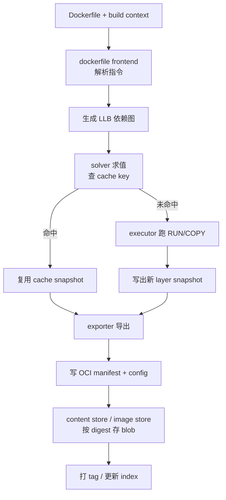
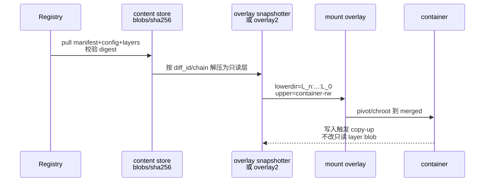
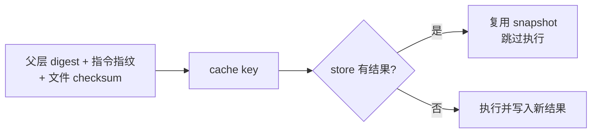

# 镜像为什么越来越大？从 Dockerfile、layer 到 content-addressable store 讲透

`docker images` 里同一服务从几百 MB 涨到几 GB；改一行业务代码却整层缓存失效；`RUN rm -rf /var/cache` 之后 `docker history` 尺寸几乎不动；生产扫出密钥却说「层里早就删了」——根因多半不在业务二进制本身，而在 **Dockerfile 指令如何落成 OCI layer、BuildKit 如何算缓存键、content-addressable store 如何按 digest 存 blob、overlay 只读层为何删不掉下层字节**。本文沿 Dockerfile → BuildKit → image config/manifest → `/var/lib/docker` 与 containerd content store → `docker history`/`dive`/安全扫描，把「镜像为什么越来越大、怎么瘦、怎么排障」拆成可在本机逐步验证的一条线。主题归属源：`容器技术/chapters/051~056-Docker镜像*`（概念/机制/关键点/源码/配置/问题），此处按工程真实路径合并展开。

## 阅读地图

1. **第一层：镜像是什么**——解决「tag 与 digest、config/manifest/layer 各自是什么、OCI image-spec 如何把它们钉在一起」。
2. **第二层：Dockerfile 指令如何变成层**——解决「哪些指令产层、COPY/RUN 差异、whiteout 为何删不瘦、history 里看到什么」。
3. **第三层：BuildKit 与 content-addressable store**——解决「构建前端/求解器/执行器怎么跑、缓存键怎么算、blob 存在哪」。
4. **第四层：缓存、多阶段与 slim**——解决「为何改一行全废、多阶段如何甩工具链、slim/distroless 边界」。
5. **第五层：观测、安全扫描与排障**——解决「dive/history/inspect、密钥泄漏、构建失败与磁盘暴涨如何分层定位」。

## 源码锚点

| 路径 / 符号 / 规范 | 作用 |
|--------------------|------|
| OCI `image-spec`：`manifest.md` / `config.md` / `layer.md` | 镜像清单、配置、层 tar 语义的规范定义 |
| OCI `mediaType`：`application/vnd.oci.image.manifest.v1+json` 等 | 区分 manifest、config、layer blob |
| Dockerfile 指令：`FROM`/`RUN`/`COPY`/`ADD`/`ENV`/`ARG`/`WORKDIR`/`USER`/`EXPOSE`/`ENTRYPOINT`/`CMD`/`VOLUME`/`LABEL`/`HEALTHCHECK`/`SHELL`/`ONBUILD` | 前端解析成 LLB 图的输入 |
| BuildKit：`moby/buildkit` — `frontend/dockerfile`、`solver`、`cache`、`executor`、`exporter` | 现代默认构建引擎 |
| `docker build` / `DOCKER_BUILDKIT=1` / `docker buildx` | 用户态入口；buildx 多 builder |
| image config JSON：`architecture`、`os`、`config.Env`、`config.Cmd`、`rootfs.diff_ids`、`history` | 运行时配置 + 根文件系统层链 |
| image manifest：`config` descriptor + `layers[]` descriptors | 指向 config 与各层 blob 的 digest |
| graphdriver `overlay2`：`/var/lib/docker/overlay2/*/diff` | 经典 Docker 把层解成目录 |
| containerd content store：`/var/lib/containerd/io.containerd.content.v1.content/blobs/sha256/` | 按 digest 存 blob（content-addressable） |
| containerd snapshotter overlayfs：`.../io.containerd.snapshotter.v1.overlayfs/` | 解压后的可挂载快照 |
| `docker history` / `docker image inspect` / `docker save` | 层历史、配置、导出 tar |
| `dive` / `crane` / `skopeo` / `buildctl` | 层分析、registry 操作、BuildKit 调试 |
| Trivy / Grype / Docker Scout / `docker scout` | 漏洞与密钥类扫描入口 |

本机先确认构建引擎与数据根：

```bash
docker version
docker info 2>/dev/null | grep -iE 'Storage Driver|Docker Root Dir|buildkit|Runtimes|containerd'
echo "BUILDKIT=${DOCKER_BUILDKIT:-default}"
docker buildx version 2>/dev/null
docker buildx ls 2>/dev/null
```

看一张已有镜像的「规范面」与「历史面」：

```bash
IMG=alpine:3.19
docker pull "$IMG"
docker image inspect "$IMG" --format '{{.Id}} {{.RepoDigests}}'
docker image inspect "$IMG" --format '{{json .RootFS}}' | python3 -m json.tool
docker history --no-trunc "$IMG" | head -20
```

把镜像拆成 OCI 布局看 blob（需 `skopeo` 或 `crane`，没有可先 `docker save`）：

```bash
mkdir -p /tmp/oci-alpine && cd /tmp
# 方式 A：docker save → tar
docker save "$IMG" -o alpine-save.tar
tar -tf alpine-save.tar | head -40
# 方式 B：skopeo 拷成 oci 目录（若已安装）
# skopeo copy docker-daemon:alpine:3.19 oci:oci-alpine:3.19
# find oci-alpine -type f | head
```

containerd 侧 content-addressable 路径（容器主机常见）：

```bash
sudo ls /var/lib/containerd/io.containerd.content.v1.content/blobs/sha256/ 2>/dev/null | head
sudo du -sh /var/lib/containerd/io.containerd.content.v1.content/ 2>/dev/null
# Docker 根（经典）
DROOT=$(docker info -f '{{.DockerRootDir}}' 2>/dev/null || echo /var/lib/docker)
sudo du -sh "$DROOT"/overlay2 "$DROOT"/image 2>/dev/null
```

## 调用链

### Dockerfile 构建到本地可用镜像（BuildKit）



### 拉取镜像到容器可写层



### 缓存命中判定（简化）



关键语义：镜像层是 **内容寻址** 的；tag 只是指向 manifest digest 的可变指针。改 Dockerfile 一行可能改「指令指纹」，父层变则子层全废——这就是「越构建越大、缓存越来越冷」的常见来源。

## 重点知识

### 第一层：镜像是什么——tag、digest、config、manifest、layer

**本层主问题：** 用户看到的 `repo:tag` 与磁盘上的 blob/层目录如何对应；OCI 各对象职责是什么。

#### 三件套：manifest、config、layers

按 OCI image-spec，一份可运行镜像至少包含：

1. **Manifest**：列出 `config` 的 descriptor，以及有序的 `layers[]`（每层一个压缩 tar 的 digest、size、mediaType）。  
2. **Config**：JSON，描述 `Env`/`Cmd`/`Entrypoint`/`WorkingDir`/`User`、`architecture`/`os`，以及 **`rootfs.diff_ids`**（未压缩层 tar 的 SHA256）与 **`history`**（与 Dockerfile 指令大致对应的人类可读记录）。  
3. **Layer blobs**：每层通常是 `tar` + gzip/zstd 等压缩；层内容是相对上一层的 **diff**（含 whiteout 文件表示删除）。

```text
tag "app:1.2" ──► index/manifest list（多架构时）
                      │
                      ▼
                 manifest (linux/amd64)
                   ├─ config@sha256:aaaa...
                   └─ layers:
                        ├─ sha256:bbbb...  (base)
                        ├─ sha256:cccc...  (deps)
                        └─ sha256:dddd...  (app)
```

本机对照：

```bash
IMG=alpine:3.19
docker image inspect "$IMG" --format 'Id={{.Id}}'
docker image inspect "$IMG" --format '{{range .RootFS.Layers}}{{.}}{{"\n"}}{{end}}'
# RootFS.Layers 对应 chain 上的 diff_id（sha256:...）
docker image inspect "$IMG" --format '{{json .Config}}' | python3 -m json.tool | head -40
```

`RepoDigests` 形如 `alpine@sha256:...`，这是 **registry 上 manifest 的 digest**，比 tag 更适合锁定部署版本：

```bash
docker image inspect alpine:3.19 --format '{{join .RepoDigests "\n"}}'
# 部署脚本优先：image@sha256:... 而不是 :latest
```

#### content-addressable：同内容只存一份

blob 文件名（或键）就是内容的哈希。两份镜像共享同一基础层时，content store / overlay 层目录可以 **去重共享**；`docker system df` 里「Images 占用」与「实际磁盘」不一致，往往因为共享层只计一次或计多次的展示差异。

```bash
docker system df
docker system df -v | head -60
```

#### 镜像 ≠ 容器可写层

- 镜像层：只读；对应 overlay 的 `lowerdir` 链或 snapshot 只读链。  
- 容器：多一个 `upperdir`；写操作 copy-up，不回写镜像 blob。  
- `docker commit`：把当前 upper 打成 **新层** 挂到新镜像——能救急，但丢失 Dockerfile 可复现性，生产应避免作为常规发布路径。

```bash
CID=$(docker create alpine:3.19 sleep 1d)
docker start "$CID"
docker exec "$CID" sh -c 'echo hi > /tmp/x'
docker diff "$CID"          # A/C/D：相对镜像的变更
docker inspect "$CID" --format '{{json .GraphDriver.Data}}'
docker rm -f "$CID"
```

#### 多架构：manifest list / index

`docker pull` 在支持的平台上会选匹配的 manifest。`buildx build --platform linux/amd64,linux/arm64` 推送的是 **index**，下面挂多个平台 manifest。排障「拉取到的不是我想要的架构」时：

```bash
docker image inspect "$IMG" --format '{{.Architecture}} {{.Os}}'
# 或 crane manifest <ref> | python3 -m json.tool | head
uname -m
```

### 第二层：Dockerfile 指令如何变成层——产层、不产层、删不瘦

**本层主问题：** 哪条指令产生新 layer；为何 `rm` 后镜像仍大；`history` 与真实 blob 的关系。

#### 产层 vs 元数据指令

典型规则（BuildKit/经典 builder 语义一致的大方向）：

| 指令 | 是否通常产生新文件系统层 | 说明 |
|------|--------------------------|------|
| `FROM` | 引入基础镜像层链 | 起点 |
| `RUN` | 是 | 执行命令，落 diff |
| `COPY`/`ADD` | 是 | 上下文文件进镜像 |
| `ENV`/`ARG`/`LABEL`/`EXPOSE`/`ENTRYPOINT`/`CMD`/`USER`/`WORKDIR`/`VOLUME`/`STOPSIGNAL`/`HEALTHCHECK`/`SHELL` | 多数主要改 config/history | 仍可能在 history 留记录；BuildKit 对空层有优化，但勿假设「零成本」 |
| `ONBUILD` | 触发延后 | 被下游 `FROM` 时展开 |

最小可复现实验：

```bash
mkdir -p /tmp/img-demo && cd /tmp/img-demo
cat > Dockerfile <<'EOF'
FROM alpine:3.19
RUN echo layer1 > /opt/a.txt
RUN echo layer2 > /opt/b.txt
COPY c.txt /opt/c.txt
ENV APP_ENV=prod
CMD ["cat", "/opt/a.txt"]
EOF
echo hello > c.txt
docker build -t demo:layers .
docker history demo:layers
docker image inspect demo:layers --format '{{range .RootFS.Layers}}{{.}}{{"\n"}}{{end}}'
```

`history` 每一行接近一条指令（及基础镜像历史）；`RootFS.Layers` 是实际 diff 链。两者数量不一定一一相等（空层合并、基础镜像压缩展示等），排障时 **以 Layers digest 与 dive 为准**。

#### 为什么 `RUN rm` 删不瘦

层是追加的 diff：

1. 层 A：`apk add` 装上 100MB 包。  
2. 层 B：`rm -rf /var/cache/apk` —— 在 B 里写 **whiteout**，合并视图里缓存「没了」。  
3. 层 A 的 blob **仍完整存在**；拉镜像、存磁盘都要带上 A。

所以「越来越大」的经典写法是：

```dockerfile
# 糟糕：两层，删除层去不掉安装层体积
RUN apk add --no-cache build-base
RUN apk del build-base

# 较好：同一 RUN 内装、编、删，最终一层 diff 不含工具链
RUN apk add --no-cache build-base \
 && compile_my_app \
 && apk del build-base \
 && rm -rf /tmp/build
```

同一 `RUN` 内用 `&&` 串联，最终只提交 **一次** 文件系统快照——这是瘦身第一原则。

#### `COPY` 与构建上下文

`docker build` 把上下文（默认 `.`）发给 daemon/BuildKit。过大的上下文会：

- 上传慢、吃带宽；  
- 误 `COPY .` 把 `.git`、本地密钥、`node_modules` 打进层。

`.dockerignore` 与 `.gitignore` 类似，但是 **构建专用**：

```bash
cat > .dockerignore <<'EOF'
.git
**/node_modules
**/.env
**/__pycache__
*.md
EOF
```

`ADD` 额外支持远程 URL、自动解 tar（行为历史包袱多）；新 Dockerfile 优先 `COPY`，解压用明确的 `RUN tar`。

#### `ARG` 与缓存毒化

```dockerfile
ARG VERSION=1.0
RUN echo "$VERSION" > /etc/app-version
```

`ARG` 在首次使用前改变可能使后续缓存失效；把 **易变 ARG 放到 Dockerfile 后部**，把 **稳定依赖安装放前部**，是缓存友好排序的核心。

`ENV` 写入 image config，容器默认继承；密钥不要用 `ENV`/`ARG` 写进最终镜像（可用 BuildKit secret 挂载，见第五层）。

#### `USER`、`WORKDIR` 与权限落层

`WORKDIR` 不存在时会创建目录（可能产层或合并进后续层，视实现）。`USER` 切换后，`COPY --chown=` 可避免再 `RUN chown -R`（后者对大树极慢且产巨大元数据 diff）。

```dockerfile
FROM alpine:3.19
RUN adduser -D app
WORKDIR /app
COPY --chown=app:app . /app
USER app
```

### 第三层：BuildKit 与 content-addressable store——构建真正怎么跑

**本层主问题：** BuildKit 组件如何把 Dockerfile 变成 snapshot；缓存与导出如何接 content store。

#### 组件角色

| 组件 | 职责 |
|------|------|
| Frontend（`dockerfile.v0` 等） | 读 Dockerfile，输出 LLB |
| Solver | 按依赖求值，查/写 cache |
| Executor | 跑 `RUN`（runc 等）、处理 mounts |
| Worker / Snapshotter | overlay 等快照实现 |
| Exporter | `image`、`oci`、`local`、`registry` 等输出 |
| Cache backend | 本地、registry cache、inline cache、gha 等 |

```bash
# 显式 BuildKit
DOCKER_BUILDKIT=1 docker build -t demo:bk .
# buildx（常默认用 buildkit）
docker buildx build -t demo:bx --load .
# 进度与调试
BUILDKIT_PROGRESS=plain DOCKER_BUILDKIT=1 docker build -t demo:plain .
```

`BUILDKIT_PROGRESS=plain` 能看到每步执行日志，定位「卡在 apk」「卡在 go build」比默认 tty 进度条管用。

#### LLB 直觉：每步是图上的节点

`FROM` 是源节点；每个 `RUN`/`COPY` 是对父 snapshot 的变换；`COPY --from=builder` 是跨节点取文件。多阶段构建就是 **多条分支最后收敛到最终 stage**。

```dockerfile
# 语法指令可启用更多前端能力
# syntax=docker/dockerfile:1
FROM golang:1.22-alpine AS builder
WORKDIR /src
COPY go.mod go.sum ./
RUN go mod download
COPY . .
RUN CGO_ENABLED=0 go build -o /out/app

FROM alpine:3.19
COPY --from=builder /out/app /usr/local/bin/app
ENTRYPOINT ["/usr/local/bin/app"]
```

最终镜像 **不含** Go 工具链层——工具链只活在 `builder` stage 的中间 snapshot，不进最终 manifest 的 `layers[]`。

#### 本地存储落点

经典 Docker Engine：

```bash
DROOT=$(docker info -f '{{.DockerRootDir}}')
sudo ls "$DROOT/image" 2>/dev/null | head
sudo ls "$DROOT/overlay2" | head
sudo ls "$DROOT/buildkit" 2>/dev/null | head
```

containerd（含不少 Kubernetes 节点、部分 Docker 配置）：

```bash
# content-addressable blobs
sudo ls /var/lib/containerd/io.containerd.content.v1.content/blobs/sha256/ | head
# 解压后的 snapshots（可挂载层）
sudo ls /var/lib/containerd/io.containerd.snapshotter.v1.overlayfs/snapshots/ 2>/dev/null | head
```

理解分工：

- **content store**：存压缩 layer tar、config、manifest —— **按 digest 去重**。  
- **snapshotter/overlay2**：把层解成目录树，供挂载与构建执行。  
- 删镜像 tag ≠ 立刻删 blob；需 GC / `docker system prune` / containerd GC 才回收未引用内容。

```bash
docker image rm demo:layers 2>/dev/null
docker builder prune -f
docker system prune -f
# 谨慎：会删未用数据
# docker system prune -a --volumes
```

#### 导出与 `docker save`

`docker save` 打出的 tar 是 **Docker Image 归档格式**（含 `manifest.json`、层目录），与纯 OCI layout 略有差别；registry 上则是 OCI/Docker schema2。迁移排障时不要混用工具假设路径相同。

```bash
docker save demo:layers -o /tmp/demo-layers.tar
tar -tf /tmp/demo-layers.tar | head -30
```

### 第四层：缓存、多阶段与 slim——怎么让镜像不膨胀

**本层主问题：** 缓存何时命中；多阶段与基础镜像选型如何同时瘦身与加速。

#### 缓存友好的 Dockerfile 排序

原则：**越稳定越靠前，越易变越靠后**。

```dockerfile
FROM node:20-alpine AS deps
WORKDIR /app
COPY package.json package-lock.json ./
RUN npm ci --omit=dev

FROM node:20-alpine AS build
WORKDIR /app
COPY --from=deps /app/node_modules ./node_modules
COPY package.json package-lock.json ./
COPY src ./src
RUN npm run build

FROM node:20-alpine
WORKDIR /app
ENV NODE_ENV=production
COPY --from=deps /app/node_modules ./node_modules
COPY --from=build /app/dist ./dist
COPY package.json ./
USER node
CMD ["node", "dist/main.js"]
```

只改 `src/` 时，`npm ci` 层可命中；若把 `COPY . .` 放在 `npm ci` 之前，任意文件改动都会重装依赖——CI 时间与临时层暴涨的常见原因。

#### BuildKit 缓存后端

| 方式 | 用途 |
|------|------|
| 本地默认 cache | 单机开发 |
| `--cache-from` / `--cache-to` type=registry | CI 多机共享 |
| `type=inline` | 把缓存元数据写入导出镜像（有体积权衡） |
| `type=gha` | GitHub Actions 缓存 |
| `type=local` | 目录缓存 |

```bash
docker buildx build \
  --cache-from type=registry,ref=registry.example.com/app:buildcache \
  --cache-to type=registry,ref=registry.example.com/app:buildcache,mode=max \
  -t registry.example.com/app:1.2 --push .
```

`mode=max` 尽量导出中间层缓存，CI 命中率更高；`mode=min` 更省 registry 空间。

#### 多阶段：甩工具链，不甩运行时依赖

多阶段解决的是 **编译器/SDK 不进生产镜像**；若运行时仍要 `libc`、CA 证书、时区数据，最终 stage 仍要装齐，否则「镜像很小但进程起不来」。

```dockerfile
FROM golang:1.22 AS builder
# ... build static binary ...
RUN CGO_ENABLED=0 go build -o /out/app

# 更瘦：scratch / distroless
FROM gcr.io/distroless/static-debian12
COPY --from=builder /out/app /app
USER nonroot:nonroot
ENTRYPOINT ["/app"]
```

选型边界：

| 最终基础 | 体积 | 调试 | 适用 |
|----------|------|------|------|
| `ubuntu`/`debian` | 大 | 易进 shell | 运维习惯、动态链接复杂 |
| `*-slim` | 中 | 仍有包管理器 | 折中 |
| `alpine` | 小 | 有 shell；musl 兼容坑 | 许多 Go/静态场景要测 |
| `distroless` | 很小 | 无 shell | 生产二进制 |
| `scratch` | 极小 | 无 shell/CA | 全静态、自带证书时 |

`alpine` + `glibc` 二进制不匹配是高频事故；Go 用 `CGO_ENABLED=0` 或明确 `CGO` 基线。

#### slim 实践清单（写进 Dockerfile，而非事后口号）

1. 同一 `RUN` 装、编、清。  
2. 包管理加 `--no-cache` 或删 list（注意发行版差异）。  
3. `COPY` 精确路径，配合 `.dockerignore`。  
4. 多阶段只拷贝产物。  
5. 固定基础镜像 digest，避免 `latest` 漂移导致「昨天 80MB 今天 200MB」。  
6. 非 root `USER`；只读根 + 明确可写卷。

```bash
# 固定 digest 示例（digest 以你 pull 到的为准）
docker image inspect alpine:3.19 --format '{{index .RepoDigests 0}}'
# Dockerfile: FROM alpine@sha256:...
```

#### 层合并与 squash

`docker build --squash`（历史选项）或导出后工具 squash，能合并层，但：

- 失去细粒度缓存与共享；  
- 与签名/SBOM/层复用策略冲突。  

优先用 **正确的多阶段与 RUN 合并**，squash 当遗留补救。

### 第五层：观测、安全扫描与排障——大、慢、脏、挂

**本层主问题：** 用哪些命令看清「哪一层吃空间、缓存为何失效、密钥在哪层、构建为何失败」。

#### `docker history`：指令视角

```bash
docker history --human --no-trunc demo:layers
docker history --format '{{.Size}}\t{{.CreatedBy}}' demo:layers
```

注意：`history` 的 Size 是该记录展示值，**共享层/空层/基础镜像** 可能导致「加起来 ≠ `docker images` 显示」。要看真实文件贡献，用 dive 或导出分析。

#### `dive`：层内文件视角

```bash
# 安装方式随发行版；有 dive 时：
dive demo:layers
# 交互看每层新增文件、效率分；找大目录、误打进的 .git
```

无 dive 时手工：

```bash
docker save demo:layers -o /tmp/demo.tar
mkdir -p /tmp/demo-layers && tar -xf /tmp/demo.tar -C /tmp/demo-layers
# 看每个层 tar 体积
find /tmp/demo-layers -name 'layer.tar' -exec ls -lh {} \;
# 抽一层看内容
L=$(find /tmp/demo-layers -name layer.tar | head -1)
tar -tvf "$L" | head -40
```

#### inspect / 配置漂移

```bash
docker image inspect demo:layers --format '{{.Config.User}} {{.Config.WorkingDir}}'
docker image inspect demo:layers --format '{{json .Config.Env}}'
docker image inspect demo:layers --format '{{json .Config.Entrypoint}} {{json .Config.Cmd}}'
```

「本地能跑、K8s 起不来」常见是：镜像 `USER` 非 root 但挂载卷权限是 root；或 `CMD` 被 workload 覆盖成错误入口。

#### 构建缓存为何总失效

| 现象 | 原因 | 动作 |
|------|------|------|
| 每次 CI 全量重建 | 无共享 cache；或 context 含时间戳文件 | registry cache；`.dockerignore`；勿 COPY 生成物 |
| 只改代码却重装依赖 | `COPY .` 在 install 前 | 先锁文件再装依赖 |
| `ARG` 一变全废 | ARG 过早引入 | 后置 ARG；或用 secret |
| `--no-cache` 成习惯 | 掩盖 Dockerfile 问题 | 只对单步 `--no-cache-filter`（BuildKit） |
| 基础镜像周更 | `FROM foo:latest` | 钉 digest；独立 job 升级基础镜像 |

```bash
# BuildKit：只让某一阶段不走缓存（版本相关）
DOCKER_BUILDKIT=1 docker build --no-cache-filter=build -t demo:nc .
```

#### 安全扫描与「删了还在」

漏洞扫描器（Trivy/Grype/Scout）扫的是 **层内仍存在的文件与包元数据**。你在后续层 `rm` 了二进制，**旧层 blob 里包还在**，扫描仍可能报 CVE；密钥亦然——曾 `COPY` 进镜像的 `.env`，即使后来删，仍留在历史层，任何人 `docker history` + 抽层都能找回。

```bash
# 示例：Trivy（若已安装）
trivy image demo:layers
# Docker Scout（若环境支持）
docker scout cves demo:layers 2>/dev/null | head
```

密钥正确做法：BuildKit secret，不进层：

```dockerfile
# syntax=docker/dockerfile:1
FROM alpine:3.19
RUN --mount=type=secret,id=npmrc,target=/root/.npmrc \
    npm ci
```

```bash
DOCKER_BUILDKIT=1 docker build --secret id=npmrc,src=$HOME/.npmrc -t demo:sec .
```

SSH 依赖：

```dockerfile
RUN --mount=type=ssh git clone git@github.com:org/private.git
```

```bash
DOCKER_BUILDKIT=1 docker build --ssh default -t demo:ssh .
```

#### 磁盘暴涨：构建与运行分开查

```bash
docker system df -v
sudo du -sh "$(docker info -f '{{.DockerRootDir}}')"/* 2>/dev/null | sort -h
docker builder du 2>/dev/null
docker buildx du 2>/dev/null
```

| 症状 | 可能原因 | 动作 |
|------|----------|------|
| `overlay2` 巨大 | 悬空镜像、旧层、容器 upper | `docker image prune`；查长时间运行容器 `docker diff` |
| `buildkit` 巨大 | 本地 cache 堆积 | `docker builder prune` |
| content store 巨大 | 未 GC 的 blob | containerd GC；控制并行构建产物 |
| 单镜像 `history` 某层极大 | 误 COPY；未合并 RUN | dive 定位路径；改 Dockerfile 重建 |
| pull 很慢 | 层多为小文件 gzip；或跨洋 registry | 镜像仓库就近；合并层；zstd（视支持） |

#### 构建失败分层定位

```bash
BUILDKIT_PROGRESS=plain DOCKER_BUILDKIT=1 docker build -t demo:fail . 2>&1 | tee /tmp/build.log
# 看失败落在哪条 RUN；进中间阶段调试：
docker build -t demo:debug --target builder .
docker run --rm -it demo:debug sh
```

经典错误：

| 错误信息倾向 | 含义 |
|--------------|------|
| `failed to compute cache key` / `not found` | `COPY` 源不在 context；被 dockerignore |
| `permission denied` 写路径 | `USER` 已切非 root |
| `executor failed running [...]` | `RUN` 非零退出；看 plain 日志 |
| `no space left` | 数据根或 `/tmp` 满；查 `df` 对准 Docker Root |
| DNS/`apk`/`apt` 失败 | 构建期网络/代理；buildkit 容器 DNS |

```bash
df -h "$(docker info -f '{{.DockerRootDir}}')"
df -i "$(docker info -f '{{.DockerRootDir}}')"
```

#### 与 overlay 篇的衔接

镜像层进到运行时，就是 overlay 的 `lowerdir` 列表；容器改文件不改 layer blob。若你看到「镜像里有文件、容器里删了、新容器又回来」——那是 **新 upper**，不是镜像层被改写。层体积问题在 **构建与 blob 存储** 解决；运行时「改不掉」在 **overlay upper/whiteout** 解决。两条线不要混成一个 `docker prune` 幻想。

#### 可复现的最小瘦身实验

```bash
cd /tmp
rm -rf slim-demo && mkdir slim-demo && cd slim-demo

# 胖写法
cat > Dockerfile.fat <<'EOF'
FROM alpine:3.19
RUN apk add --no-cache python3 py3-pip
RUN pip3 install --break-system-packages requests
RUN rm -rf /root/.cache
COPY app.py /app.py
CMD ["python3", "/app.py"]
EOF
echo 'print("ok")' > app.py
docker build -f Dockerfile.fat -t demo:fat .

# 瘦写法：合并 RUN + 多阶段可选；此处合并清理
cat > Dockerfile.slim <<'EOF'
FROM alpine:3.19
RUN apk add --no-cache python3 py3-pip \
 && pip3 install --break-system-packages --no-cache-dir requests \
 && rm -rf /root/.cache /var/cache/apk/*
COPY app.py /app.py
CMD ["python3", "/app.py"]
EOF
docker build -f Dockerfile.slim -t demo:slim .

docker images 'demo:fat' 'demo:slim'
docker history demo:fat
docker history demo:slim
```

对比 `history` 层数与 `docker images` 大小，验证「同一 RUN 清理」对最终体积的影响；再对两者跑扫描，理解「删缓存 ≠ 删包漏洞面」。

#### registry 与签名（边界）

推送后以 digest 为准：

```bash
docker push registry.example.com/app:1.2
docker image inspect registry.example.com/app:1.2 --format '{{join .RepoDigests "\n"}}'
```

内容信任/签名（Notary/cosign 等）验的是 **manifest 完整性**，不替代层内漏洞扫描；部署应同时：**钉 digest + 扫描通过 + 最小权限运行**。

#### 源码级阅读路径（对应 054 章意图）

若要对照上游实现（版本以你检出的 moby/buildkit/containerd 为准）：

1. `github.com/moby/buildkit`：`frontend/dockerfile/dockerfile2llb` —— 指令到 LLB。  
2. `solver/` —— 缓存键与任务调度。  
3. `cache/` —— 本地/远程 cache 导入导出。  
4. `exporter/containerimage` —— 写 config、manifest、layer。  
5. `github.com/containerd/containerd`：`content/`、`snapshots/overlay` —— blob 与可挂载层。  
6. OCI `opencontainers/image-spec` —— 字段级真源，避免凭记忆编 mediaType。

阅读时带着本机一次 `BUILDKIT_PROGRESS=plain` 构建日志，把「某条 RUN」对应到 solver 的一次执行与一次 snapshot 导出，比空读目录有效。

#### 配置与使用要点（对应 055）

```bash
# daemon 数据根（磁盘规划）
# /etc/docker/daemon.json 示例字段（改前备份；字段以当前文档为准）
# { "data-root": "/data/docker", "features": { "buildkit": true } }

docker info -f '{{.DockerRootDir}}'
docker buildx create --name ci --driver docker-container --use
docker buildx inspect --bootstrap
```

CI 建议：`buildx` + registry cache + 推送 digest；开发机：`docker builder prune` 定期回收；生产节点：限制悬空镜像与未用 build cache，避免与容器 upper 抢盘。

#### 常见问题速查（对应 056，按机制归类）

**镜像比预期大**  
dive 找最大层 → 是否 `COPY .` / 未合并 `RUN` / 基础镜像过胖 → 多阶段 + 钉 slim/distroless。

**构建越来越慢**  
plain 日志看最久步骤 → 缓存键是否被 ARG/上下文打穿 → 调整顺序与 cache-to。

**「已经 rm」扫描仍报**  
旧层仍在 → 必须重建并不再包含该文件的层链；轮换已泄漏密钥。

**多机 CI 缓存不命中**  
未配置 registry cache；或 frontend/平台/Dockerfile 哈希不一致；检查 `--cache-from` 引用与权限。

**rootless / 不同 data-root**  
路径不在 `/var/lib/docker`；用 `docker info` 的 Docker Root Dir，避免删错盘。

**与 containerd 混用排查**  
K8s 节点上看 content + snapshotter；Docker Desktop/Engine 看 overlay2 + buildkit；先 `docker info`/`crictl info` 判定栈，再选路径。

---

构建侧把 Dockerfile 写成「稳定依赖在前、易变代码在后、删除与安装同层、产物用多阶段拷出」；存储侧承认 **layer blob 追加且内容寻址**，用 history/dive/content store 看清体积与泄漏；运行侧把「容器可写层」和「镜像只读层」分开想——镜像才会停止「无缘无故越来越大」，排障也才有可执行的下一刀。
