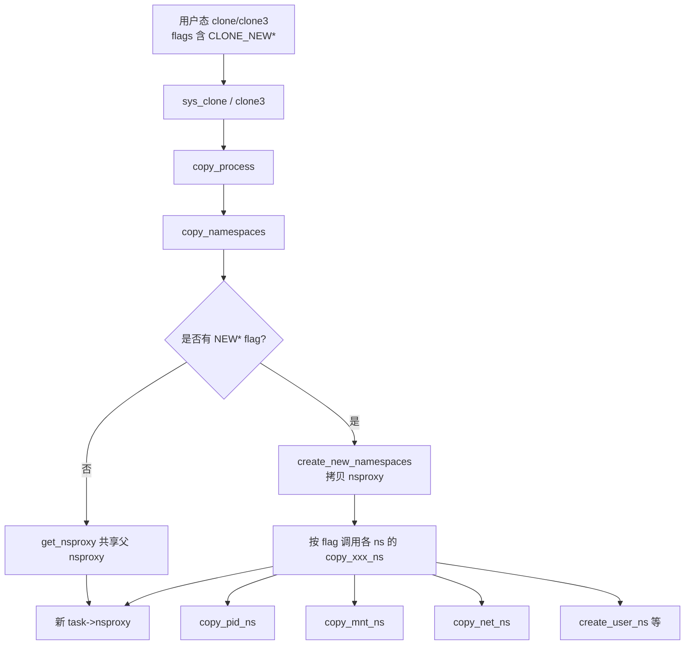
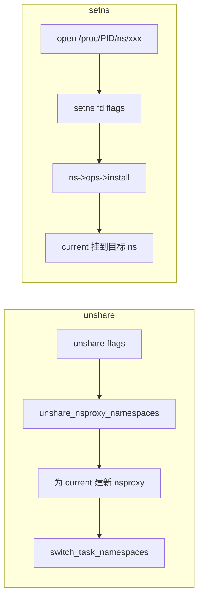
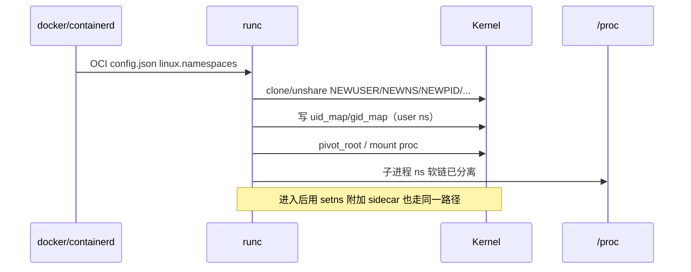

# 进程隔离看得见却进不去？Linux Namespace 从 clone/unshare 到 /proc/PID/ns 排障

`ls /proc/<pid>/ns` 能看见 `pid`、`mnt`、`net` 这些软链，`nsenter -t <pid> -n` 却报 `Operation not permitted`；容器里 `ps` 只有自己，宿主机却能看到全部进程；`ip link` 在容器内只有 `lo`，宿主机网卡一个都没有——这些不是「魔法」，是 **Namespace 把全局内核对象换成了按进程可见的视图**。本文从 `CLONE_NEW*`、`struct nsproxy`、`/proc/PID/ns`、`setns`/`unshare` 一直讲到 runc 建仓与排障，路径对齐 Linux 内核真实源码，读完能在本机用 `unshare`/`lsns`/`nsenter` 验证。

## 阅读地图

1. **第一层：隔离模型与入口**——解决「Namespace 到底隔离什么、和 cgroup 边界在哪、clone/unshare/setns 三条入口如何选用」。
2. **第二层：nsproxy 与内核对象**——解决「进程如何挂到一簇 namespace、为何改一种就要拷贝 nsproxy、inode 号为何能当身份」。
3. **第三层：八种 Namespace 分型**——解决「pid/mnt/net/uts/ipc/user/cgroup/time 各自改了哪类内核对象、观测命令是什么」。
4. **第四层：用户态与容器运行时**——解决「/proc 暴露、user ns 映射、runc/Docker 怎么组装完整隔离」。
5. **第五层：排障与边界**——解决「进不去、看不到、泄漏、权限失败如何按层定位」。

## 源码锚点

| 路径 / 符号 | 作用 |
|-------------|------|
| `include/linux/nsproxy.h` | `struct nsproxy`、`copy_namespaces`/`switch_task_namespaces` |
| `include/linux/ns_common.h` | `struct ns_common`（各 ns 公共 refcount/ops/inum） |
| `include/linux/proc_ns.h` | proc 上 ns 文件与 inode 号 |
| `include/uapi/linux/sched.h` | `CLONE_NEWNS`/`CLONE_NEWPID`/`CLONE_NEWNET` 等 flag |
| `kernel/nsproxy.c` | 创建/共享/释放 nsproxy，`unshare_nsproxy_namespaces` |
| `kernel/fork.c` | `copy_process` → `copy_namespaces`；`clone`/`clone3` |
| `kernel/pid.c` / `kernel/pid_namespace.c` | PID 命名空间、`struct pid_namespace` |
| `kernel/user_namespace.c` | user ns、uid/gid map、capability 降权 |
| `kernel/utsname.c` | UTS（hostname/domainname） |
| `kernel/cgroup/namespace.c` | cgroup namespace（视图，不是限额本身） |
| `kernel/time/namespace.c` | time ns（CLOCK_MONOTONIC/BOOTTIME 偏移） |
| `ipc/namespace.c` | System V IPC / POSIX mq 隔离 |
| `fs/namespace.c` | mount ns、`copy_mnt_ns`、传播标志 |
| `net/core/net_namespace.c` | `struct net`、网络设备/路由/socket 归属 |
| `fs/proc/namespaces.c` | `/proc/PID/ns/*` 与 `nsfs` |
| `kernel/ns.c`（随版本，或分散在各 ns） | `setns` 系统调用路径 |
| `Documentation/userspace-api/namespaces/`、`man 7 namespaces` | 用户态语义与限制 |
| `/proc/self/ns/`、`/proc/PID/ns/` | 运行时身份：软链目标形如 `mnt:[4026531840]` |
| `util-linux`：`unshare`/`nsenter`/`lsns` | 用户态工具 |
| `runc`/`libcontainer` | OCI runtime 组装 namespaces |

UAPI 标志（内核头文件，数值以本机 `sched.h` 为准）：

```c
/* include/uapi/linux/sched.h */
#define CLONE_NEWTIME     0x00000080  /* time namespace */
#define CLONE_NEWNS       0x00020000  /* mount namespace */
#define CLONE_NEWCGROUP   0x02000000
#define CLONE_NEWUTS      0x04000000
#define CLONE_NEWIPC      0x08000000
#define CLONE_NEWUSER     0x10000000
#define CLONE_NEWPID      0x20000000
#define CLONE_NEWNET      0x40000000
```

进程持有的命名空间集合：

```c
/* include/linux/nsproxy.h — 节选 */
struct nsproxy {
    atomic_t count;
    struct uts_namespace *uts_ns;
    struct ipc_namespace *ipc_ns;
    struct mnt_namespace *mnt_ns;
    struct pid_namespace *pid_ns_for_children; /* 子进程将进入的 pid ns */
    struct net           *net_ns;
    struct time_namespace *time_ns;
    struct time_namespace *time_ns_for_children;
    struct cgroup_namespace *cgroup_ns;
};
```

说明：当前任务「自己」的 pid namespace 不放在 `nsproxy` 里，而通过 `task_active_pid_ns(task)` 取；`pid_ns_for_children` 决定 **之后 fork 出来的孩子** 落在哪个 pid ns。这是排障时常踩的坑。

本机快速核对：

```bash
ls -l /proc/self/ns/
readlink /proc/self/ns/mnt /proc/self/ns/pid /proc/self/ns/net
lsns -t pid; lsns -t mnt; lsns -t net
grep CONFIG_NAMESPACES /boot/config-$(uname -r) 2>/dev/null || \
  zgrep CONFIG_NAMESPACES /proc/config.gz 2>/dev/null
```

## 调用链

### clone 创建新 Namespace



### unshare / setns 切换视图



### 容器运行时（runc）组装隔离



`copy_namespaces()` 的核心语义：只要 flags 里有任意 `CLONE_*` 命名空间位，就 **不能** 继续共享父进程的 `nsproxy`，必须分配新的 `nsproxy` 并按位拷贝/新建各指针；一个 namespace 被改，整包 `nsproxy` 就 COW 一次。这解释了为何「只改 net」也会看到新的 `nsproxy` 引用计数变化。

## 重点知识

### 第一层：隔离模型与入口——Namespace 改的是「看见什么」

**本层主问题：** Namespace 与 cgroup、chroot、虚拟机差在哪；三条系统调用入口怎么选。

#### 隔离维度：视图 vs 限额 vs 机器

| 机制 | 解决什么 | 不解决什么 |
|------|----------|------------|
| Namespace | 进程看见的对象集合（PID、挂载、网卡、hostname…） | CPU/内存限额、磁盘配额（那是 cgroup/quota） |
| cgroup | 用量与限额、OOM、freeze | 不隐藏「别人的进程/网卡」 |
| chroot/pivot_root | 改根目录视图 | 不隔离 PID/网络；常配合 mnt ns |
| VM/KVM | 独立内核与硬件虚拟化 | 重量大；容器是共享内核 |

容器 = **namespaces（隔离）+ cgroup（限额）+ rootfs（常为 overlay）+ 安全（seccomp/capability/user ns）**。只开 namespace 没有 cgroup，容器仍可打满宿主机 CPU；只开 cgroup 没有 namespace，进程仍能看到宿主机全部 `/proc` 与网卡。

#### 三条入口：clone、unshare、setns

1. **`clone`/`clone3`**：创建子进程时顺便新建一批 namespace。容器 init（pid 1）几乎总走这条或等价的 `clone`+`exec`。
2. **`unshare`**：当前进程脱离父级共享，为自己建新 namespace（可选再 `fork`）。`unshare -m` 常用于临时挂载实验。
3. **`setns`**：打开已有 `/proc/<pid>/ns/<type>`（或 nsfs 挂载下的文件），把自己「搬进」别人的 namespace。`nsenter`、调试进容器、sidecar 附加网络都靠它。

```bash
# 新建 mount+uts，并 fork 一个 shell（pid ns 必须配合 --fork）
sudo unshare -m -u -p -f --mount-proc /bin/bash
hostname isolated-demo
hostname   # 只影响本 UTS ns
readlink /proc/$$/ns/uts /proc/1/ns/uts   # inode 号不同则已隔离
```

```bash
# 进入已有容器网络命名空间（需权限）
PID=$(docker inspect -f '{{.State.Pid}}' <container> 2>/dev/null)
sudo nsenter -t "$PID" -n ip addr
sudo nsenter -t "$PID" -m -u -i -n -p -r -w /bin/bash
```

权限要点：创建多数 namespace 需要 `CAP_SYS_ADMIN`（在 **当前 user ns** 内）。无特权用户创建 user ns（若内核允许）后，可在 **该 user ns 内** 获得「映射后的 root」再创建其它 ns——这是 rootless 容器的根基。

#### 共享与继承

默认 `fork`/`clone` 不带 `CLONE_NEW*` 时，子进程 **共享** 父进程同一套 `nsproxy`（引用计数 +1）。线程（`CLONE_THREAD`）与进程在 namespace 上通常共享同一视图；不能对单个线程单独 `unshare` 大部分命名空间（内核会拒绝不安全组合）。`CLONE_FS`/`CLONE_FILES` 是另一类共享，与 namespace 正交。

```bash
# 父 shell 与子进程 ns 是否相同：比较 inode
readlink /proc/$$/ns/mnt
bash -c 'readlink /proc/$$/ns/mnt'   # 通常相同
sudo unshare -m bash -c 'readlink /proc/$$/ns/mnt'  # 不同
```

### 第二层：nsproxy 与内核对象——身份在 inode 号上

**本层主问题：** 内核如何表示「一簇命名空间」；`/proc` 上看到的数字是什么。

#### nsproxy 是「指针包」

每个非僵尸任务有一个 `task_struct->nsproxy`。`nsproxy` 本身不存「隔离数据」，只存指向各类 `*_namespace` / `struct net` 的指针。多个任务可以共享同一个 `nsproxy`（全都没做过 NEW/unshare）。一旦任一命名空间被新建，内核分配新 `nsproxy`，把未改动的指针继续指向旧对象（共享），改动的指针指向新对象。

访问规则（`nsproxy.h` 注释）：

- 只有 current 能改自己的 `nsproxy` 指针，且需 `task_lock`。
- 读 current 的命名空间可直接解引用。
- 读别人的命名空间必须 `task_lock`；`nsproxy == NULL` 表示任务正在退出。

#### ns_common 与 nsfs inode

每种 namespace 内嵌或关联 `struct ns_common`，带引用计数与 `proc_ns_operations`。暴露到用户态时，内核通过 **nsfs** 伪文件系统给每个 namespace 一个 inode；`/proc/PID/ns/net` 是指向该 inode 的软链，形式：

```text
net:[4026531992]
```

方括号内是 **inode number**（也称 ns id），`lsns` 的 `NS` 列即此值。两个进程的 `readlink` 结果相同 ⇒ 共享该类型命名空间。

```bash
ls -l /proc/self/ns/
# lrwxrwxrwx 1 ... net -> net:[4026531992]
stat -L /proc/self/ns/net | grep Inode
lsns -t net
```

打开该文件得到的 fd 可传给 `setns(2)`；也可把 ns 文件 bind-mount 到持久路径，供退出进程后仍能 `setns`（容器运行时常把 ns 挂到 `/var/run/docker/netns/` 一类路径）。

```bash
# 持久化引用（示意，需 root）
sudo touch /tmp/ns-net
sudo mount --bind /proc/<pid>/ns/net /tmp/ns-net
sudo nsenter --net=/tmp/ns-net ip link
```

#### pid_for_children / time_for_children

`/proc/self/ns/` 里除了 `pid`、`time`，还有 `pid_for_children`、`time_for_children`。含义：

- `pid`：当前任务所在的 pid namespace（决定 `getpid()` 看到的值、`/proc` 可见进程集）。
- `pid_for_children`：接下来 `fork` 出的子进程将进入的 pid ns（`unshare -p` 却不 `fork` 时，当前进程仍在旧 pid ns，只有孩子进新的——所以工具默认加 `-f`）。

```bash
# 错误示范：只 unshare pid 不 fork，当前 getpid 仍是宿主机视角
sudo unshare -p /bin/bash   # 常立刻异常或行为怪异
# 正确：unshare -p -f --mount-proc
sudo unshare -p -f --mount-proc /bin/bash
echo $$; ps aux | head
```

### 第三层：八种 Namespace 分型——每种改哪类对象

**本层主问题：** 每种 `CLONE_NEW*` 隔离的内核对象是什么；如何观测。

#### 总览表

| 类型 | flag | `/proc/.../ns/` | 隔离对象 | 典型命令 |
|------|------|-----------------|----------|----------|
| mount | `CLONE_NEWNS` | `mnt` | 挂载表、根、cwd 可见性 | `findmnt`、`mount` |
| UTS | `CLONE_NEWUTS` | `uts` | hostname、domainname | `hostname`、`uname -n` |
| IPC | `CLONE_NEWIPC` | `ipc` | SysV shm/sem/msg、POSIX mq | `ipcs`、`ls /dev/mqueue` |
| PID | `CLONE_NEWPID` | `pid` | 进程号空间、pid 1 | `ps`、`ls /proc` |
| network | `CLONE_NEWNET` | `net` | 网卡、路由、socket、iptables | `ip`、`ss` |
| user | `CLONE_NEWUSER` | `user` | uid/gid 映射、capability | `id`、`cat /proc/self/uid_map` |
| cgroup | `CLONE_NEWCGROUP` | `cgroup` | `/proc/self/cgroup` 视图根 | `cat /proc/self/cgroup` |
| time | `CLONE_NEWTIME` | `time` | monotonic/boottime 偏移 | `cat /proc/self/timens_offsets` |

#### mount namespace（CLONE_NEWNS）

最常用也最易踩坑。每个 mnt ns 有自己的挂载树；`mount`/`umount` 默认只影响当前 ns。传播类型（shared/slave/private/unbindable）决定 **跨 ns 是否看到对方的挂载事件**——Docker/libcontainer 会把新 mnt ns 设为 private，避免容器挂载漏到宿主机，也避免宿主机事件灌进容器。

```bash
sudo unshare -m /bin/bash
mount -t tmpfs tmpfs /mnt
findmnt /mnt
# 另开一个宿主机终端：通常看不到这次挂载（若传播为 private）
```

与 `pivot_root`：容器把新 rootfs 挂好后 `pivot_root`/`chroot`，旧根放到临时目录再 umount，防止逃逸回宿主机文件系统。仅 `chroot` 而无 mnt ns，攻击面更大。

观测：

```bash
lsns -t mnt
findmnt -N <pid>    # 看某进程的挂载（util-linux）
cat /proc/<pid>/mountinfo | head
```

#### UTS namespace（CLONE_NEWUTS）

隔离 `struct new_utsname`：`nodename`（hostname）、`domainname`。容器可各自 `hostname` 而不改宿主机。`uname -n` 读的就是它。

```bash
sudo unshare -u /bin/bash
hostname box-a
hostname
# 宿主机 hostname 不变
```

#### IPC namespace（CLONE_NEWIPC）

隔离 System V IPC（`msgget`/`semget`/`shmget`）与 POSIX message queue。共享内存键在不同 ipc ns 互不可见，避免容器间误连同一 SysV shm。

```bash
sudo unshare -i /bin/bash
ipcs -a
# 相对宿主机通常是空的集合
```

注意：`CLONE_NEWIPC` 与 `CLONE_NEWPID` 曾有历史组合限制；现代内核对容器常用组合已放宽，以发行版内核为准。

#### PID namespace（CLONE_NEWPID）

新 pid ns 内第一个进程成为 **pid 1**（容器 init）。该 ns 内进程号从 1 起算；宿主机看到的是「外层」真实 pid。嵌套 pid ns 形成树：父 ns 能看到子 ns 进程（以父 ns 的 pid 编号），子 ns 看不到外面。

```bash
sudo unshare -p -f --mount-proc /bin/bash
echo $$          # 多半是 1
ps -ef           # 只见本 ns
# 宿主机：ps -ef | grep 该 bash 的「外层」pid
```

必须重新挂载 `proc`，否则 `/proc` 仍显示宿主机进程列表——`--mount-proc` 就是干这个的。systemd 做 pid 1 时还有信号与僵尸回收语义；容器里常用 `tini`/`dumb-init` 当 pid 1 回收僵尸。

`/proc/PID/ns/pid_for_children`：`unshare(CLONE_NEWPID)` 后当前任务仍留在旧 pid ns，只把 `pid_ns_for_children` 换成新的，所以要再 `fork`。

#### network namespace（CLONE_NEWNET）

每个 net ns 有独立的：网络设备列表、路由表、邻居表、iptables/nftables、socket。新建时通常只有 `lo`（且需 `ip link set lo up`）。容器网络 = 把 veth 一对一端移入容器 net ns，另一端留在宿主机/CNI bridge。

```bash
sudo unshare -n /bin/bash
ip link                     # 通常仅 lo
ip link set lo up
ping -c1 127.0.0.1
```

```bash
# veth 示意（两个 ns）
sudo ip netns add nsA
sudo ip link add veth0 type veth peer name veth1
sudo ip link set veth1 netns nsA
sudo ip netns exec nsA ip addr add 10.200.1.2/24 dev veth1
sudo ip netns exec nsA ip link set veth1 up
sudo ip netns exec nsA ip link set lo up
```

`ip netns` 管理的是把 net ns 文件 bind 到 `/var/run/netns/<name>`，与容器 runtime 的 netns 文件是同一机制。

#### user namespace（CLONE_NEWUSER）

最关键也最复杂：把「容器内 uid 0」映射到「宿主机普通 uid」，并限制 capability。映射写入：

```text
/proc/<pid>/uid_map
/proc/<pid>/gid_map
/proc/<pid>/setgroups   # 常先写 deny
```

格式：`inside-uid outside-uid length`。例如 `0 1000 1` 表示容器内 uid 0 ↔ 宿主机 uid 1000。

```bash
unshare -U -r /bin/bash    # -r 映射当前用户为 ns 内 root（util-linux）
id
cat /proc/self/uid_map
cat /proc/self/gid_map
```

无映射时，进程在新 user ns 里对多数文件操作会异常；创建 user ns 后未写 map 前能力受限。内核参数 `kernel.unprivileged_userns_clone`（部分发行版）或 AppArmor/LSM 策略可能禁止非特权用户创建 user ns——rootless Podman/Docker 失败时先查这里。

Capability：在 user ns 内「root」只对 **该 ns 拥有的对象** 有特权，不能任意搞宿主机硬件；跨 ns 的文件能力还受 inode 归属 user ns 约束。

#### cgroup namespace（CLONE_NEWCGROUP）

不提供限额（限额仍在 cgroup 子系统），只改变进程 **看见的 cgroup 根**：`/proc/self/cgroup` 路径相对化，避免容器内看到宿主机完整 cgroup 路径。配合 cgroup v2 虚拟根，减少信息泄漏与路径误用。

```bash
cat /proc/self/cgroup
# 在容器内通常以 0::/ 或相对路径出现，而非宿主机长路径
lsns -t cgroup
```

#### time namespace（CLONE_NEWTIME）

可对 `CLOCK_MONOTONIC`、`CLOCK_BOOTTIME` 设置偏移，让容器内时间流逝视图不同（用于时间敏感测试、部分迁移场景）。`CLOCK_REALTIME` 行为以内核文档为准，通常不靠 time ns 做「改系统墙钟」的完整虚拟化。

```bash
ls -l /proc/self/ns/time /proc/self/ns/time_for_children
cat /proc/self/timens_offsets 2>/dev/null
sudo unshare -T --monotonic 3600 -f sleep 1 &
```

与 pid 类似，存在 `time_for_children`：当前任务与子任务的 time ns 可能不同，工具需配对理解。

### 第四层：用户态与容器运行时——从 OCI 到进程树

**本层主问题：** `/proc` 如何暴露；runc 如何按 OCI 组装；和 Docker 命令的对应关系。

#### /proc/PID/ns 与 nsfs

```bash
ls -l /proc/1/ns/
ls -l /proc/self/ns/
# 比较两进程是否同 ns
diff <(readlink /proc/1/ns/net) <(readlink /proc/$$/ns/net) && echo same_net || echo diff_net
```

`setns` 伪代码逻辑：

```c
int fd = open("/proc/1234/ns/net", O_RDONLY);
setns(fd, CLONE_NEWNET);   /* 第二个参数 0 表示按 fd 类型自动 */
close(fd);
/* 此后 current 的 net_ns 已切换 */
```

限制：进入 user ns 有严格规则；进入 pid ns 通常只影响「子进程」或需特殊组合；不能随意把线程迁出共享的临界状态。失败看 `errno`：`EPERM`、`EINVAL`、`ENOSPC`（ns 数量上限）等。

#### OCI linux.namespaces

`config.json` 片段概念：

```json
"linux": {
  "namespaces": [
    {"type": "pid"},
    {"type": "network"},
    {"type": "mount"},
    {"type": "ipc"},
    {"type": "uts"},
    {"type": "user"},
    {"type": "cgroup"}
  ],
  "uidMappings": [
    {"containerID": 0, "hostID": 100000, "size": 65536}
  ],
  "gidMappings": [
    {"containerID": 0, "hostID": 100000, "size": 65536}
  ]
}
```

runc 顺序大致：创建 user ns（若启用）→ 写 map → 创建其它 ns → 挂 rootfs/overlay → `pivot_root` → 挂 `/proc` `/dev` `/sys` → 降权/seccomp → `exec` 用户进程。网络常由 CNI 在 **创建 net ns 之后** 把 veth/IP 配好，再交给 runc 启动。

```bash
# 看容器各 ns inode
PID=$(docker inspect -f '{{.State.Pid}}' <ctr>)
sudo ls -l /proc/$PID/ns/
sudo lsns -p $PID
```

#### Docker / containerd 常用对应

| 需求 | 表现 | 底层 |
|------|------|------|
| 改容器主机名 | `--hostname` | UTS ns |
| 共享宿主机网络 | `--network host` | 不建 NEWNET，共用宿主机 net ns |
| 共享 PID | `--pid host` | 共用 pid ns |
| 进入容器 | `docker exec` | 对目标 ns `setns` 再 exec |
| pause 沙箱 | infra 容器持有 ns | 其它容器 join 同一组 ns |

```bash
docker run -d --name n1 --hostname web alpine sleep 1d
docker exec n1 hostname
docker inspect n1 --format '{{.State.Pid}}'
sudo nsenter -t $(docker inspect -f '{{.State.Pid}}' n1) -u hostname
```

#### 手工最小「容器」实验

```bash
# 需要 root；演示 mnt+uts+pid+net
ROOT=/tmp/mini-root
mkdir -p "$ROOT"/{proc,bin,lib,lib64,usr}
# 按需拷贝 busybox/alpine rootfs，此处略
sudo unshare -m -u -i -n -p -f --mount-proc="$ROOT/proc" \
  chroot "$ROOT" /bin/sh
```

rootless：先 `unshare -U -r`，再在新 user ns 里建其它 ns；uid_map 把 0 映到自己。失败时查：

```bash
sysctl kernel.unprivileged_userns_clone 2>/dev/null
sysctl user.max_user_namespaces
cat /proc/sys/user/max_*_namespaces 2>/dev/null
```

### 第五层：排障与边界——看得见却进不去

**本层主问题：** 权限、生命周期、泄漏、工具误用如何分层查。

#### 症状 → 检查路径

| 症状 | 先查 | 命令 |
|------|------|------|
| `nsenter: cannot open /proc/.../ns/net: Permission denied` | capability、user ns、LS | `id`; `getpcaps $$`; 是否 sudo |
| `nsenter` 后仍见宿主机进程 | 未进 pid ns 或未挂正确 proc | `nsenter -t PID -p -m`；看 `ps` 与 `echo $$` |
| 容器内 `ps` 列出宿主机进程 | `/proc` 挂错（宿主机 proc） | `mount \| grep proc`；`cat /proc/1/cgroup` |
| 容器无网 | net ns 内无 veth/地址/路由 | `nsenter -t PID -n ip a; ip r` |
| hostname 改了宿主机也变 | 未建 UTS ns（或 `--uts host`） | 比较 `readlink /proc/PID/ns/uts` |
| rootless 起不来 | userns 被禁、map 失败 | `sysctl`；期刊日志；`uid_map` |
| `setns` EINVAL | flag 与 fd 类型不符、线程共享限制 | 查 man setns；单线程调用 |
| 进程退出 ns 文件消失 | 未 bind-mount 持久化 | `/var/run/docker/netns` 是否还在 |

#### 对比 inode 的标准手法

```bash
P=<container_pid>
for n in mnt pid net uts ipc user cgroup; do
  echo -n "$n host="; readlink /proc/1/ns/$n
  echo -n "$n ctr ="; readlink /proc/$P/ns/$n
done
```

相同 ⇒ 该维度 **未隔离**（故意 host 模式或创建失败）。

#### 权限与 LSM

即使是 root，也可能被 SELinux/AppArmor 拒绝 `ptrace`/`nsenter`。Kubernetes 下还要看 Pod `shareProcessNamespace`、`hostNetwork`、`hostPID`、`securityContext`。进入别人的 user ns 需要合适关系，不是「有 root 就行」。

```bash
# 当前能力
grep Cap /proc/self/status
capsh --decode=$(grep CapEff /proc/self/status | cut -f2)
```

#### 数量上限与泄漏

每个 namespace 占内核内存；`/proc/sys/user/max_net_namespaces` 等可限数量。大量创建/销毁 net ns 或残留 `ip netns` 文件会导致耗尽。

```bash
ls /proc/sys/user/
ip netns list
sudo ls /var/run/netns 2>/dev/null
# 清理实验 ns
sudo ip netns del nsA 2>/dev/null
```

僵尸容器、未删的 CNI netns、crash 后残留 mount，都会表现为「inode 还在、进程已无」。用 `lsns` 看 `NPROCS=0` 的异常项，再追挂载来源。

#### 与调试工具配合

```bash
lsns
lsns -p $PID
sudo nsenter -t $PID -n ss -lntp
sudo nsenter -t $PID -m findmnt
sudo cat /proc/$PID/mountinfo | head
sudo cat /proc/$PID/cgroup
sudo ls -l /proc/$PID/root   # 看 rootfs 指向
```

bpf/trace：`tracepoint:syscalls:sys_enter_setns`、`sys_enter_unshare` 可确认运行时是否真的在切 ns（以平台内核为准）。

#### 设计边界（避免误用）

- Namespace **不是** 安全的充分条件：缺 user ns + seccomp + capability 降权时，容器内 root 接近宿主机 root。
- PID ns 不阻止从宿主机用外层 pid 发信号（有权限时）。
- mount ns + 错误传播设置可能导致挂载泄漏或「宿主机 umount 影响容器」。
- network ns 隔离不等于加密；跨 ns 仍可通过 veth/桥互通。
- cgroup ns 只藏路径，不代替 memory/cpu 限额。

#### 可复现实验清单（按层验证）

```bash
# 1) UTS
sudo unshare -u hostname demo && hostname

# 2) NET
sudo unshare -n ip link | wc -l

# 3) PID + proc
sudo unshare -p -f --mount-proc ps -ef | head

# 4) USER map
unshare -U -r id && cat /proc/self/uid_map

# 5) 与 init 对比
readlink /proc/self/ns/mnt; readlink /proc/1/ns/mnt
```

#### 源码阅读顺序建议

1. `include/uapi/linux/sched.h` — 认 flag  
2. `include/linux/nsproxy.h` + `kernel/nsproxy.c` — 拷贝与切换  
3. `fs/proc/namespaces.c` — `/proc` 导出  
4. 按问题选读：`fs/namespace.c`（mnt）、`net/core/net_namespace.c`（net）、`kernel/pid_namespace.c`（pid）、`kernel/user_namespace.c`（user）  
5. 对照 `man 7 namespaces`、`man 2 setns`、`man 1 nsenter`

这样从「旗标 → 指针包 → 对象 → 导出 → 运行时」一条线闭环；排障时永远先 **比 inode**，再 **查权限**，再 **查挂载/网络配置**，最后才怀疑业务进程本身。

#### 常见误区再强调

「看得见却进不去」：`/proc/PID/ns/*` 对所有人 **可读软链目标字符串**，但 **打开 fd 并 setns** 需要权限；所以 `ls` 成功不代表 `nsenter` 成功。  
「容器里是 pid 1」：那是 **内层** 编号；宿主机 `docker inspect` 给出的 Pid 是 **外层** 编号，`nsenter -t` 必须用外层。  
「--network host 还隔离吗」：网络维度不隔离，其它 ns 仍可隔离。  
「unshare -p 立刻变 pid 1」：不会，除非再 fork；用 `-f`。

把上述模型装进大脑后，再看 runc 源码里的 `libcontainer/nsenter`、`namespaces_linux.go`，会发现只是在自动化同一套系统调用，并无第三种隔离魔法。
