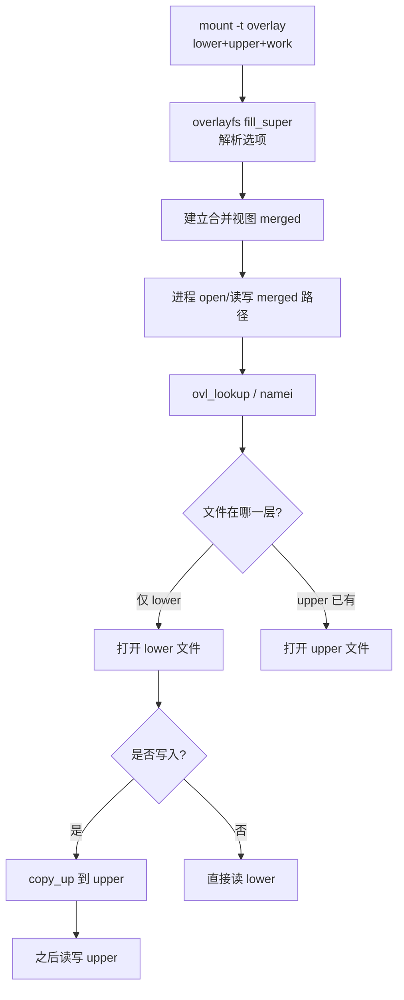
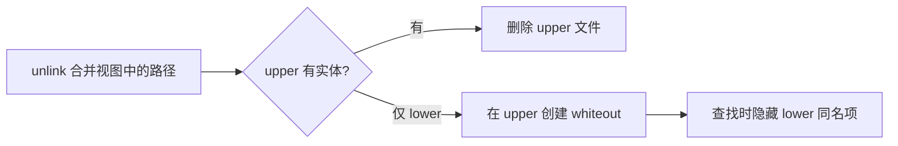
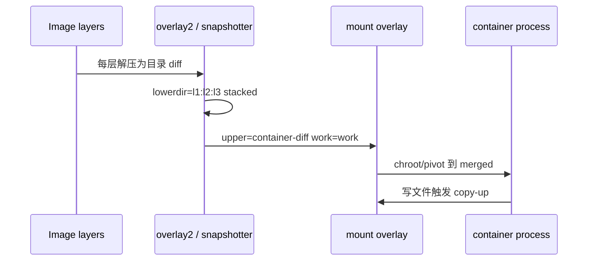

# 容器层为什么改不掉？OverlayFS 从 lower/upper/work 到 whiteout 与排障

镜像里明明有 `/etc/app.conf`，容器内改完一重启又变回去；`rm` 掉基础镜像里的文件，下层目录里其实还在；磁盘突然报 `No space left`，`df` 却显示根分区还很空——根因多半在 **OverlayFS 的 lower/upper/work、whiteout/opaque、metacopy** 与 Docker 分层存储，而不是应用自己「改不进文件」。本文按内核 `fs/overlayfs/` 真实路径，从联合挂载语义讲到容器 layer 与排障，读完能在本机用 `mount -t overlay` 复现整条链路。

## 阅读地图

1. **第一层：联合挂载模型**——解决「UnionFS/Overlay 要解决什么、和 bind/chroot 差在哪、为何容器根文件系统几乎都是 overlay」。
2. **第二层：lower/upper/work 与查找**——解决「只读层、可写层、工作目录各自职责、打开文件时内核怎么合并视图」。
3. **第三层：whiteout、opaque 与拷贝上写**——解决「删除/重建目录为何需要特殊文件、metacopy/redirect_dir 影响什么」。
4. **第四层：Docker/containerd 分层与挂载**——解决「镜像 layer 如何变成 lowerdir 列表、可写容器层在哪、snapshotter 差异」。
5. **第五层：观测、性能与排障**——解决「改不掉、删不净、ENOSPC、权限、嵌套 overlay 如何分层定位」。

## 源码锚点

| 路径 / 符号 | 作用 |
|-------------|------|
| `fs/overlayfs/` | OverlayFS 内核实现目录 |
| `fs/overlayfs/super.c` | 解析挂载选项、建 `ovl_fs`、挂载入口 |
| `fs/overlayfs/namei.c` | 路径查找、合并目录项、whiteout 处理 |
| `fs/overlayfs/inode.c` | inode 属性、拷贝上写相关 |
| `fs/overlayfs/dir.c` | 目录创建/删除、opaque |
| `fs/overlayfs/copy_up.c` | copy-up（下层文件首次写入前拷到 upper） |
| `fs/overlayfs/file.c` | 文件读写与 upper 切换 |
| `fs/overlayfs/util.c` | whiteout 判定、路径辅助 |
| `fs/overlayfs/export.c` | NFS export / 文件句柄相关（若启用） |
| `include/uapi/linux/fs.h` 等 | 通用 FS ioctl；overlay 选项多在文档 |
| `Documentation/filesystems/overlayfs.rst` | 官方语义：lower/upper/work、whiteout、metacopy |
| `CONFIG_OVERLAY_FS` | 内核是否编译 overlay |
| `/proc/filesystems` | 出现 `nodev overlay` 表示可用 |
| Docker：`overlay2` graphdriver | `/var/lib/docker/overlay2/` |
| containerd：`overlayfs` snapshotter` | `/var/lib/containerd/io.containerd.snapshotter.v1.overlayfs/` |
| `mount -t overlay`、`findmnt`、`df` | 用户态挂载与观测 |

挂载选项（用户态传入，内核 `super.c` 解析，名称以文档为准）：

```text
lowerdir=/path/lower1:/path/lower2
upperdir=/path/upper
workdir=/path/work
# 常见可选：
# redirect_dir=on|off|nofollow|follow
# metacopy=on|off
# index=on|off
# xino=on|off|auto
# userxattr / volatile 等（随内核版本）
```

本机确认：

```bash
grep overlay /proc/filesystems
modprobe overlay 2>/dev/null
ls /lib/modules/$(uname -r)/kernel/fs/overlayfs/ 2>/dev/null
man mount 2>/dev/null | head -1
Documentation 路径：内核树 Documentation/filesystems/overlayfs.rst
```

手工最小挂载骨架：

```bash
BASE=/tmp/ovl-demo
rm -rf "$BASE" && mkdir -p "$BASE"/{lower,upper,work,merged}
echo 'from-lower' > "$BASE/lower/file.txt"
sudo mount -t overlay overlay \
  -o lowerdir="$BASE/lower",upperdir="$BASE/upper",workdir="$BASE/work" \
  "$BASE/merged"
cat "$BASE/merged/file.txt"
echo 'modified' > "$BASE/merged/file.txt"
cat "$BASE/lower/file.txt"   # 仍是 from-lower
cat "$BASE/upper/file.txt"   # 已是 modified
sudo umount "$BASE/merged"
```

## 调用链

### 挂载 overlay 到首次写文件（copy-up）



### 删除 lower 中已有文件（whiteout）



### Docker 镜像层 → 容器可写层



`ovl_lookup` 从左到右（或文档规定的优先级：upper 优先，然后 lower 列表从左到右/右到左——**Docker overlay2 的 lowerdir 顺序是「左=上层更近」还是相反要以实际 `findmnt -o OPTIONS` 为准**）合并目录项；一旦某路径在 upper 存在 whiteout，则对用户隐藏 lower 的同名对象。

## 重点知识

### 第一层：联合挂载模型——为何容器根几乎都是 Overlay

**本层主问题：** UnionFS 家族要解决什么问题；OverlayFS 在 Linux 里的位置。

#### 问题：同一份只读根，多个可写实例

容器镜像希望：

- 基础文件系统 **只读共享**（千个容器共用同一 ubuntu:22.04 层，不复制）。
- 每个容器有自己的 **可写视图**，互不影响。
- 删除/修改看起来像改了根上的文件，但不能污染只读层。

传统做法：每个容器完整拷贝一份 rootfs——浪费空间与启动时间。联合挂载（union mount）把多个目录叠成一个命名空间视图：**上层覆盖下层**，写入落在可写层。

历史与实现：

| 实现 | 说明 |
|------|------|
| UnionFS（经典） | 早期联合 FS，概念源头 |
| AUFS | 曾被 Docker 广泛使用，未进主线内核 |
| OverlayFS | 主线内核方案，Docker `overlay2`、containerd 默认常用 |
| device-mapper thin | 块级写时复制，另一条存储驱动路径 |
| btrfs/zfs snapshot | 用子卷/快照模拟分层 |

本文聚焦 **内核 OverlayFS**（`fs/overlayfs/`），它就是如今大多数 Linux 容器的「层文件系统」底座。用户态常说的 UnionFS 在容器语境下多半指这一类联合挂载语义，而非某个叫 UnionFS 的模块还在跑。

#### Overlay 与 bind mount、chroot 的边界

- **bind mount**：把已有目录挂到另一挂载点，仍是同一份 inode 视图，无「分层覆盖」。
- **chroot/pivot_root**：只改进程根，不提供写时复制。
- **Overlay**：提供合并命名空间 + 写时复制到 upper；lower 保持只读（内核也会尽量只读打开 lower）。

安全注意：overlay 的 lower 若被其它路径直接改写，合并视图会「背后变脸」；生产上 lower 应只读挂载或不被容器进程直接访问。

#### 三（四）棵目录的角色

一次典型挂载需要：

1. **lowerdir**：只读层，可多个，用 `:` 拼接。  
2. **upperdir**：可写层，所有修改的落点。  
3. **workdir**：必须与 upper **同一文件系统** 的空目录，供内核做原子 rename 等内部操作；不要往里放业务文件。  
4. **merged**：挂载点，进程看到的「合并后根」。

缺 workdir、workdir 与 upper 跨设备，是新手 `mount` 失败的高频原因。

```bash
# 错误：work 在另一个 tmpfs/磁盘
# mount: ... workdir and upperdir must be on same filesystem
```

### 第二层：lower/upper/work 与查找——合并视图怎么来

**本层主问题：** 打开一个路径时内核如何决定读哪份文件；多层 lower 顺序意味着什么。

#### 查找优先级

对文件路径 `P`：

1. 若 upper 存在 **whiteout** 名为 `P` → 视为不存在（即使 lower 有）。  
2. 若 upper 有真实文件/目录 `P` → 用 upper。  
3. 否则按 lower 列表查找；命中则用该 lower 的对象（只读打开）。  
4. 若是目录，则需要 **合并目录内容**（readdir 合并各层名字，并过滤 whiteout）。

因此「容器里看到的文件」不一定在容器可写层目录里物理存在；`ls` 合并视图，`ls upperdir` 只见改动过的。

```bash
BASE=/tmp/ovl-demo2
rm -rf "$BASE" && mkdir -p "$BASE"/{l1,l2,upper,work,merged}
echo L2 > "$BASE/l2/a.txt"
echo L1 > "$BASE/l1/a.txt"    # 同名
echo only1 > "$BASE/l1/b.txt"
sudo mount -t overlay overlay \
  -o lowerdir="$BASE/l1:$BASE/l2",upperdir="$BASE/upper",workdir="$BASE/work" \
  "$BASE/merged"
cat "$BASE/merged/a.txt"      # 期望 FROM_L1（左侧优先）
ls "$BASE/merged"
findmnt "$BASE/merged" -o TARGET,SOURCE,OPTIONS
```

实测：`lowerdir=l1:l2` 读到 L1；`lowerdir=l2:l1` 读到 L2。即 **左侧最高、右侧最底**（与 `overlayfs.rst` 一致）。Docker 生成的长串 `lowerdir=` 不要手改乱序。

```bash
# 一眼确认当前挂载的 lower 顺序
findmnt -t overlay -o TARGET,OPTIONS | tr ',' '\n' | grep lowerdir
```

#### diff、link、committed 在 overlay2 目录里的含义

Docker `overlay2` 在数据根下为每层建目录，常见文件：

| 文件/目录 | 含义 |
|-----------|------|
| `diff/` | 该层相对下一层的文件差（镜像层或容器 upper） |
| `link` | 短 ID，供 `l` 目录硬链/短路径引用，缩短 `lowerdir=` 字符串 |
| `lower` | 记录本层依赖的下层短 ID 列表 |
| `work/` | 容器可写层旁的 workdir |
| `merged/` | 运行中合并挂载点（停止后可能为空） |

```bash
DROOT=$(docker info -f '{{.DockerRootDir}}' 2>/dev/null || echo /var/lib/docker)
sudo ls "$DROOT/overlay2" | head
# 任取一层观察
L=$(sudo ls -1 "$DROOT/overlay2" | head -1)
sudo ls -la "$DROOT/overlay2/$L"
sudo cat "$DROOT/overlay2/$L/link" 2>/dev/null
sudo cat "$DROOT/overlay2/$L/lower" 2>/dev/null | head -c 200; echo
```

`lowerdir` 里出现的 `/var/lib/docker/overlay2/l/XXXXX` 是短链接目录，指向真实 `diff`，用来规避挂载选项长度限制（多层镜像时路径极长）。

#### 只读打开与首次写入

读 lower 文件：直接读 lower inode，无拷贝。  
写 lower 文件：触发 **copy-up**——把文件内容（及元数据，视选项）拷到 upper，再对 upper 做修改。之后读写都走 upper。这就是「为什么容器改配置不改镜像层」。

```bash
# 接上例
echo changed > "$BASE/merged/a.txt"
cat "$BASE/l1/a.txt" "$BASE/l2/a.txt"   # lower 未变
cat "$BASE/upper/a.txt"                 # 改动在 upper
ls -la "$BASE/upper"
```

目录 copy-up：在 upper 创建对应目录结构，才能在其中创建新文件。空目录创建也可能在 upper 建目录项。

#### workdir 内部

workdir 下内核会建 `work/` 等临时目录（实现细节随版本变化）。管理员不应手动往 workdir 塞文件，也不应让多个 overlay 挂载共享同一 workdir。备份 upper 时通常 **不必** 备份 work；但要保证 umount 后 work 与 upper 一致性不被手工破坏。

#### 只读 overlay（无 upper）

可以只提供 `lowerdir` 做纯只读合并（多 lower 合成一个只读根）。容器「只读根」或某些 live CD 场景会用。无 upper 时任何写入失败（`EROFS`）。

```bash
sudo mount -t overlay overlay -o lowerdir="$BASE/l1:$BASE/l2" "$BASE/merged-ro"
```

### 第三层：whiteout、opaque 与拷贝上写——删与盖的语义

**本层主问题：** 为什么「删除下层文件」不会真删 lower；目录被替换时为何需要 opaque。

#### whiteout：对下层的「墓碑」

Overlay 不能改 lower，所以在合并视图里 `unlink` 一个仅存在于 lower 的文件时，内核在 **upper** 创建特殊标记——**whiteout**。之后 lookup 到该名字就当不存在。

实现上，默认常见形式是 upper 里一个 **字符设备 `0:0`**：

```text
c--------- 1 root root 0, 0 ... victim.txt
```

本机删除实验即可复现 `c---------` 与 `0, 0`。启用 `userxattr` 等模式时也可能用 xattr 表达，以当前内核文档为准。

用户在 upper 目录里看到「奇怪的字符设备」——那就是 whiteout，不是业务文件坏了。备份 upper 时若用普通 `cp -a` 跨文件系统，可能丢掉 whiteout 语义，恢复后下层文件「复活」。

```bash
# 演示删除 lower 文件（接第二层 BASE 或新建）
echo victim > "$BASE/l1/victim.txt"
# 需重新 mount 使 lookup 看到新文件后再：
rm -f "$BASE/merged/victim.txt"
ls "$BASE/merged/victim.txt" 2>&1     # 应不存在
ls -la "$BASE/upper"                  # c--------- 0,0 whiteout
ls "$BASE/l1/victim.txt"              # lower 仍在
```

还原「删除」：去掉 upper 的 whiteout（并处理好其它 upper 项），下层文件会再次显现——这也是容器存储「可恢复脏层」的基础，同时是安全上要注意的点（敏感文件删了可能仍在 lower）。

#### opaque 目录：挡住下层同名目录内容

若 lower 有目录 `D/`，你在合并视图删除整个 `D` 再新建空的 `D`，或需要「完全替换目录」时，仅靠文件级 whiteout 不够：下层 `D/` 里其它名字还会合并上来。内核用 **opaque** 目录标记（xattr `trusted.overlay.opaque=y` 或等价物）表示：**不要合并下层同名目录的内容**。

```bash
# 概念验证：删除并重建目录后，下层文件不应「透上来」
mkdir -p "$BASE/l1/dir" && echo x > "$BASE/l1/dir/from-lower"
rm -rf "$BASE/merged/dir"
mkdir "$BASE/merged/dir"
ls "$BASE/merged/dir"    # 应为空（opaque 生效时）
getfattr -d -m - "$BASE/upper/dir" 2>/dev/null
```

若 opaque 失效或被错误工具剥掉 xattr，会出现「删光的目录里又冒出下层文件」的诡异现象。

#### copy-up 细节与 metacopy

经典 copy-up：首次写入前把 **整个文件数据** 拷到 upper。大文件第一次写（哪怕改一字节）可能很慢、瞬间占满 upper 空间。

**metacopy**（`metacopy=on`）：允许先只拷贝元数据到 upper，数据页仍引用 lower，真正写数据时再拆开。可加速「只 chmod/chown」类操作，但语义与导出/NFS/某些远程 lower 组合有限制，**默认是否开启因内核与发行版而异**。Docker 也曾围绕 metacopy 有安全公告——生产改选项前读发行版说明与 `overlayfs.rst`。

相关选项还有：

| 选项 | 作用 |
|------|------|
| `redirect_dir` | 目录 rename 优化，避免昂贵的递归 copy-up |
| `index` | 硬链接/inode 映射一致性 |
| `xino` | 合成唯一 inode 号，改善 `stat` 跨层稳定性 |
| `volatile` | 放松崩溃一致性换性能（易失场景） |
| `userxattr` | 用 user.overlay.* 代替 trusted.*（无特权用户挂载场景） |

```bash
findmnt -t overlay -o TARGET,OPTIONS
# 看是否含 metacopy,redirect_dir,index,xino
```

#### 硬链接、特殊文件、设备节点

lower 中的设备节点、socket、fifo 一般 copy-up 为同类型节点。硬链接跨层行为受 `index` 影响；不要假设「容器里两个硬链接名一定共享 upper 同一 inode」除非测过。符号链接：通常作为链接本身 copy-up，目标路径字符串不变——若目标指向绝对路径，容器内解析仍相对其 mount/ns。

### 第四层：Docker / containerd 分层——layer 如何变成 lowerdir

**本层主问题：** 镜像层、容器可写层、实际磁盘路径怎么对应到 overlay 选项。

#### 镜像层 = 一串只读目录

镜像由多层 diff 组成（OCI layers）。graphdriver/snapshotter 把每层解压成目录，启动容器时：

```text
lowerdir=layerN-1:layerN-2:...:layer0
upperdir=container-rw
workdir=container-work
merged=container-merged
```

只读容器（`--read-only`）可能不配 upper，或 upper 仍在但根只读挂载，tmpfs 挂 `/tmp` 等。

#### Docker overlay2 路径（经典）

```bash
docker info | grep -i storage
sudo ls /var/lib/docker/overlay2/ | head
# 容器层
CID=$(docker create alpine:latest sleep 1d)
docker inspect "$CID" --format '{{.GraphDriver.Data}}'
```

`GraphDriver.Data` 常见字段：

- `LowerDir`：`:` 分隔的只读层  
- `UpperDir`：容器可写  
- `WorkDir`：work  
- `MergedDir`：合并挂载点  

```bash
docker start "$CID"
PID=$(docker inspect -f '{{.State.Pid}}' "$CID")
# 看容器进程根与挂载
sudo ls -l /proc/$PID/root
sudo cat /proc/$PID/mountinfo | grep overlay
docker rm -f "$CID"
```

注意：rootless Docker 路径在用户目录下（`~/.local/share/docker/`），不是 `/var/lib/docker`。

#### containerd overlayfs snapshotter

```bash
sudo ls /var/lib/containerd/io.containerd.snapshotter.v1.overlayfs/snapshots/ 2>/dev/null | head
# ctr / nerdctl 也可 inspect
```

Kubernetes + containerd：Pod 可写层同样是 snapshot 的 upper；镜像拉取失败、snapshot 残留会导致「层目录还在、Pod 起不来」。

#### 为何「改了又没了」

1. **改在容器可写层**，容器删了再重建 → 新 upper 是空的，回到镜像 lower。  
2. **改在临时可写但未 commit**：`docker commit` 才会把 upper 打成新层。  
3. **改错层**：进的是 bind 进容器的宿主机路径，或 volume，不在 overlay upper。  
4. **只读根 + tmpfs**：进程写成功在内存盘，重启丢失。

```bash
docker run --rm -v /tmp/hostcfg:/etc/app.conf:ro alpine cat /etc/app.conf
# 这不是改 overlay upper，而是看 bind 文件
```

#### 构建与层爆炸

Dockerfile 每个 `RUN` 通常一层。删文件的 `RUN rm` 会在 **新层** 做 whiteout，**旧层仍占磁盘**。要减小镜像需 squash/多阶段构建/BuildKit 垃圾回收，而不是以为 `rm` 释放了下层空间。

```bash
docker history <image>
docker system df -v
```

### 第五层：观测、性能与排障——层问题怎么查

**本层主问题：** 对照症状选命令；区分「overlay 语义」与「磁盘真满」。

#### 基础观测

```bash
findmnt -t overlay
mount | grep overlay
cat /proc/mounts | grep overlay
df -h /var/lib/docker
df -i /var/lib/docker    # inode 耗尽也会 ENOSPC
```

对某容器：

```bash
CID=<container>
docker inspect "$CID" --format '{{json .GraphDriver}}' | python3 -m json.tool
sudo du -sh $(docker inspect "$CID" --format '{{.GraphDriver.Data.UpperDir}}')
sudo ls -la $(docker inspect "$CID" --format '{{.GraphDriver.Data.UpperDir}}') | head
```

#### 症状表

| 症状 | 可能原因 | 动作 |
|------|----------|------|
| 修改文件重启消失 | 容器重建/新 upper；写在 volume/tmpfs | 查是否 commit/volume；看 UpperDir |
| `rm` 后下层文件还在磁盘 | whiteout 语义，lower 只读 | 属正常；要瘦身需重建镜像 |
| 目录删空又冒出文件 | opaque 丢失/xattr 被剥 | 查 upper xattr；勿用不懂 overlay 的拷贝工具 |
| `No space left` 但 `df` 根分区有空 | Docker 数据盘满；或 inode 满；或 overlay 所在挂载满 | `df`/`df -i` 对准 data-root |
| mount 失败 workdir same fs | upper/work 跨设备 | 放到同一文件系统 |
| 权限莫名变化 | copy-up 后 uid 映射（user ns） | 查 id map 与文件 uid |
| 第一次写超大文件卡住 | 全量 copy-up | 看磁盘 IO；评估 metacopy；避免无谓打开 O_RDWR |
| 嵌套 overlay 怪异 | lower 本身是 overlay | 避免；或查内核支持与文档警告 |
| `operation not permitted` 写 xattr | 无 privilege 写 trusted.overlay.* | `userxattr` 或特权挂载 |

#### ENOSPC 分层查

```bash
# 1) 找 overlay 后端设备
findmnt /var/lib/docker
df -h /var/lib/docker
df -i /var/lib/docker

# 2) upper 是否爆了
sudo du -x -d1 /var/lib/docker/overlay2 2>/dev/null | sort -h | tail

# 3) 清理
docker system prune -a   # 慎用，会删未用镜像
```

容器内 `df` 看到的是 **merged 视图的统计**，不一定等于 upper 真实占用；以宿主机对 UpperDir/`du` 为准。

#### 手工排障实验室

```bash
BASE=/tmp/ovl-trouble
rm -rf "$BASE" && mkdir -p "$BASE"/{lower,upper,work,merged}
mkdir -p "$BASE/lower/etc"
echo base > "$BASE/lower/etc/app.conf"
sudo mount -t overlay overlay \
  -o lowerdir="$BASE/lower",upperdir="$BASE/upper",workdir="$BASE/work" \
  "$BASE/merged"

# 修改
echo new > "$BASE/merged/etc/app.conf"
# 「镜像」未变
cat "$BASE/lower/etc/app.conf"
# 可写层
cat "$BASE/upper/etc/app.conf"

# 删除
rm "$BASE/merged/etc/app.conf"
ls "$BASE/lower/etc/app.conf"    # 还在
ls -la "$BASE/upper/etc"         # whiteout

sudo umount "$BASE/merged"
```

#### 性能注意点

- **随机小写大量小文件**：频繁 copy-up 与目录合并，元数据压力大。  
- **大文件任意写**：首次 copy-up 吞吐受限于磁盘。  
- **readdir 巨大目录**：合并多层 dentries 有 CPU 开销。  
- **扫描工具**（杀毒、备份）若从 merged 写入，会把整层 copy-up——应对 lower 只读扫描或扫 upper。  
- **数据库数据文件** 不建议放 overlay 可写层；用 volume/bind 到本地 FS/LVM。

#### 与 Namespace/Cgroup 的交接

Overlay 解决的是 **文件系统内容分层**；还要：

- **mnt ns**：容器有自己的挂载表，overlay 挂在容器根。  
- **user ns**：文件 uid 显示为映射后的 ID。  
- **cgroup**：磁盘 IO 限额不靠 overlay，靠 `io`/`blkio` 控制器。

排障「看不见文件」时先分清：是 **mnt ns 挂错**，还是 **overlay 层被 whiteout**，还是 **路径在 volume**。

```bash
PID=$(docker inspect -f '{{.State.Pid}}' <ctr>)
sudo nsenter -t "$PID" -m findmnt /
sudo nsenter -t "$PID" -m ls -la /etc | head
sudo ls -la $(docker inspect <ctr> --format '{{.GraphDriver.Data.UpperDir}}')/etc 2>/dev/null | head
```

#### 安全与合规

- lower 含密钥时，容器删文件 **不等于** 宿主机销毁；需重建镜像并确认层中无密钥。  
- 勿把敏感 upper 目录权限放宽到其它用户可读。  
- metacopy/redirect 等选项有过 CVE 历史，跟随发行版安全更新。  
- 不可信镜像的 layer 解压路径注意目录穿越历史问题（运行时与版本已修，需保持更新）。

#### 源码阅读顺序建议

1. `Documentation/filesystems/overlayfs.rst` — 语义权威  
2. `fs/overlayfs/super.c` — 选项与挂载  
3. `fs/overlayfs/namei.c` — lookup/whiteout  
4. `fs/overlayfs/copy_up.c` — 写时复制  
5. `fs/overlayfs/dir.c` — 目录与 opaque  
6. 对照本机 `mount -t overlay` 实验与 Docker `GraphDriver.Data`

#### 设计要点收束

OverlayFS 的核心契约只有三句话：

1. **lower 只读共享，upper 承载一切变更；**  
2. **删除用 whiteout 表达，目录替换用 opaque；**  
3. **merged 是视图不是第四份永久业务数据——持久化靠 volume 或 commit 成新层。**

抓住这三句，再看 Docker 为何「改不掉镜像」、为何 `rm` 不腾下层空间、为何 workdir 必须和 upper 同盘，就不会再被联合挂载的表象绕晕。容器存储排障时，把 `findmnt`、`UpperDir`、`du`、`df -i` 当成固定套路，先确认是不是 overlay 语义，再查应用逻辑。

#### 内核结构与调用点（读码地图）

阅读 `fs/overlayfs/` 时，可按对象跟：

| 概念 | 大致落点 |
|------|----------|
| 挂载选项字符串 | `ovl_parse_opt` / `super.c` 中 fill_super 路径 |
| 合并 dentry | `ovl_lookup`（`namei.c`） |
| whiteout 判定 | `ovl_is_whiteout` 一类辅助（`util.c`） |
| 首次写拷贝 | `ovl_copy_up*`（`copy_up.c`） |
| 目录不透明 | opaque xattr 在 `dir.c` / copy-up 路径设置 |
| 打开文件 | `file.c` 在 copy-up 后切换到 upper file |

版本间函数名可能微调，以你手头的内核树为准；不要死记行号。用户态只要抓住：**lookup 合并 → 写则 copy-up → 删则 whiteout** 三条路径，就能和 `strace`/`bpftrace` 对上。

```bash
# 看谁在 mount overlay（需权限）
findmnt -t overlay -o TARGET,SOURCE,OPTIONS,PROPAGATION
# 容器进程的 mountinfo 里 overlay 行
PID=<ctr_pid>
sudo awk '$NF ~ /overlay/ || $3 == "overlay" {print}' /proc/$PID/mountinfo
```

#### 与 AUFS / device-mapper 的选型差异

| 驱动 | 层级 | 典型路径 | 注意 |
|------|------|----------|------|
| overlay2 | 文件级联合 | `/var/lib/docker/overlay2` | 主线内核；层数过多时 lowerdir 很长（有短 link） |
| aufs | 文件级联合 | 依赖 out-of-tree | 新发行版基本淘汰 |
| devicemapper | 块级 snapshot | thin pool | 运维重，Docker 已不推荐 |
| btrfs/zfs | 子卷/快照 | 各自 root | 需专用文件系统 |

新环境优先 **overlay2 / containerd overlayfs snapshotter**；排障时先 `docker info` / `ctr plugins ls` 确认不是旧的 devicemapper，避免按错文档。

```bash
docker info 2>/dev/null | grep -E 'Storage Driver|Backing Filesystem'
```

#### 崩溃一致性与 volatile

正常 overlay 在 rename/workdir 协助下尽量保证：崩溃后 upper 不会出现「半 copy-up」的撕裂文件（实现尽力而为，仍建议关键数据用 journal 文件系统做 upper 后端）。`volatile` 选项进一步放松，适合只读 live、可丢可写层的场景；容器数据库目录不要配 volatile。

upper/work 所在后端若是 NFS 等远程 FS，历史上限制很多（不支持作 upper、或缺 d_type）——以当前 `overlayfs.rst`「Fs features needed」为准。本地 ext4/xfs 最省心。

```bash
# 后端是否支持目录类型返回（d_type）可影响性能与兼容
stat -f -c '%T' /var/lib/docker
```

#### 可复现实验（建议按序做一遍）

```bash
BASE=/tmp/ovl-lab
rm -rf "$BASE" && mkdir -p "$BASE"/{l1,l2,upper,work,merged}
echo L1 > "$BASE/l1/a.txt"; echo L2 > "$BASE/l2/a.txt"
echo only-lower > "$BASE/l1/del-me.txt"
sudo mount -t overlay overlay \
  -o lowerdir="$BASE/l1:$BASE/l2",upperdir="$BASE/upper",workdir="$BASE/work" \
  "$BASE/merged"

# 1) 覆盖顺序
cat "$BASE/merged/a.txt"

# 2) copy-up
echo rewritten > "$BASE/merged/a.txt"
cat "$BASE/l1/a.txt"; cat "$BASE/upper/a.txt"

# 3) whiteout
rm "$BASE/merged/del-me.txt"
ls -la "$BASE/upper/del-me.txt"    # c--------- 0,0
test ! -e "$BASE/merged/del-me.txt" && echo hidden_ok

# 4) 清理
sudo umount "$BASE/merged"
```

做完这四步，再去看 Docker 的 `UpperDir`/`LowerDir`，只是同一机制的批量自动化。镜像「改不掉」、容器「一重建配置就没」，都落在 upper 生命周期上，而不是应用随机丢配置。
'''
