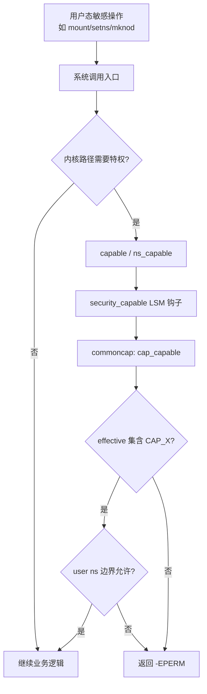
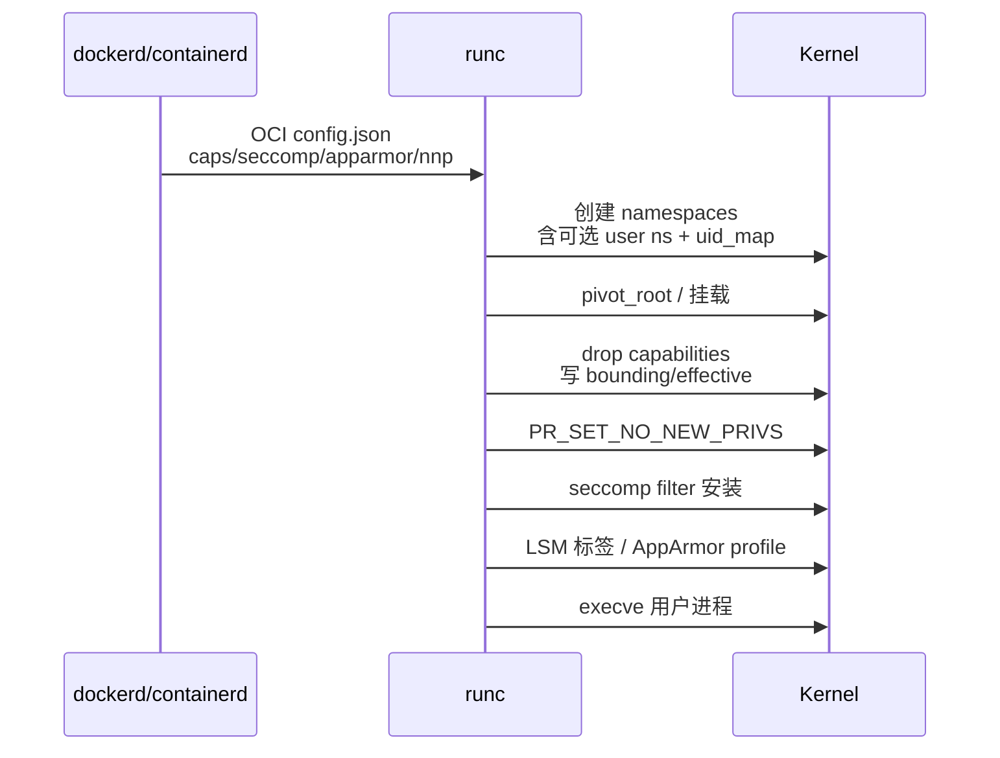
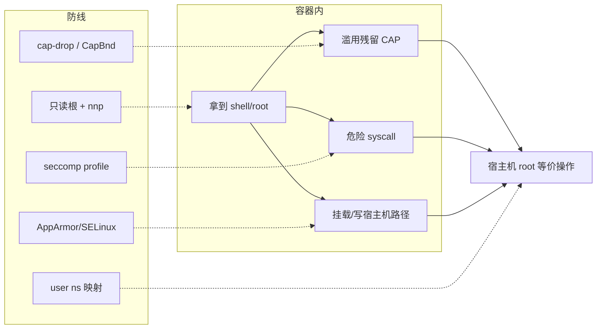

# 容器里拿到 root 就等于宿主机沦陷？Capability、seccomp、AppArmor 与 user ns 讲透

`docker exec` 进容器 `whoami` 显示 `root`，很多人第一反应是「完了，宿主机也完了」——然后又有人说「没事，有 Namespace」。两边都偏了：**容器内 uid 0 在默认 rootful 部署下，往往就是宿主机 uid 0 的同一套凭证**；Namespace 只改「看见什么」，不自动砍特权。真正把「容器 root」从「宿主机 root」撕开的，是 **Capability 降权、seccomp 系统调用白名单、LSM（AppArmor/SELinux）、user namespace 映射，以及 `no-new-privileges`**。本文按内核 `capability.c` / `seccomp` / LSM 钩子与 Docker/runc 运行时配置，把攻击面、最小权限、rootless、镜像 CVE 与排障命令串成一条可验证主线。

> 源归属：`081`～`086-容器安全*`（概念/机制/关键点/源码/配置/排障六章合并重写；上游章节为提纲壳，正文按内核与 OCI 运行时真实路径展开）。

## 阅读地图

1. **第一层：攻击面与隔离边界**——解决「共享内核意味着什么、容器 root ≠ VM root、默认配置留下哪些洞」。
2. **第二层：Capability**——解决「`CapEff`/`CapBnd` 怎么读、`--cap-drop` 砍的是什么、`CAP_SYS_ADMIN` 为何几乎等于全开」。
3. **第三层：seccomp 与 no-new-privileges**——解决「profile JSON 如何拦 syscall、与 capability 谁先谁后、为何要锁住提权路径」。
4. **第四层：LSM（AppArmor/SELinux）与 user ns**——解决「MAC 补的是哪一层、uid_map 如何把容器 root 变成宿主机普通用户」。
5. **第五层：运行时加固与镜像 CVE**——解决「只读根、非 root 用户、镜像扫描、rootless Docker/Podman 怎么配」。
6. **第六层：排障与验证命令**——解决「业务报 `Operation not permitted`、加固后起不来、如何证明策略已生效」。

## 源码锚点

| 路径 / 符号 | 作用 |
|-------------|------|
| `kernel/capability.c` | `capable`/`ns_capable`/`cap_capable`；特权检查入口 |
| `include/linux/capability.h` | 内核侧 capability 位与辅助宏 |
| `include/uapi/linux/capability.h` | `CAP_*` 编号（`CAP_CHOWN`…`CAP_BPF` 等） |
| `security/commoncap.c` | LSM「capability」模块：文件能力、ambient、边界集 |
| `kernel/seccomp.c` | seccomp 过滤器安装与执行路径 |
| `include/linux/seccomp.h` / `include/uapi/linux/seccomp.h` | `SECCOMP_MODE_FILTER`、`seccomp()` 系统调用 |
| `kernel/sys.c`（及 `prctl` 路径） | `PR_SET_NO_NEW_PRIVS`、`PR_SET_SECCOMP` |
| `security/security.c` | LSM 钩子分发（`security_capable`、路径/文件钩子） |
| `security/apparmor/` | AppArmor 策略引擎（发行版常用） |
| `security/selinux/` | SELinux 策略引擎（RHEL 系常用） |
| `kernel/user_namespace.c` | user ns、`uid_map`/`gid_map`、跨 ns 能力裁剪 |
| `/proc/self/status` 的 `CapInh`/`CapPrm`/`CapEff`/`CapBnd`/`CapAmb` | 运行时能力集观测 |
| `/proc/sys/kernel/seccomp/`、`/proc/PID/status` 的 `Seccomp:` | seccomp 模式（0/1/2） |
| Docker `daemon.json` / `docker run --cap-drop` / `--security-opt` | 运行时降权与 profile |
| Docker 默认 seccomp profile（JSON） | 默认允许/拒绝的 syscall 集合 |
| OCI Runtime Spec `linux.capabilities` / `linux.seccomp` / `process.noNewPrivileges` | runc 配置字段 |
| `runc` `libcontainer/capabilities*`、`libcontainer/seccomp*` | 用户态落地 capability/seccomp |
| `man 7 capabilities`、`man 2 seccomp`、`man 2 prctl` | 用户态语义 |

本机先摸清「当前进程到底有多特权」：

```bash
grep -E '^(Cap|Seccomp|NoNewPrivs)' /proc/self/status
capsh --decode=$(grep CapEff /proc/self/status | awk '{print $2}')
id; cat /proc/self/uid_map; cat /proc/self/gid_map
grep CONFIG_SECCOMP /boot/config-$(uname -r) 2>/dev/null || \
  zgrep CONFIG_SECCOMP /proc/config.gz 2>/dev/null
```

Docker/runc 侧快速对照：

```bash
docker info 2>/dev/null | grep -Ei 'Security|seccomp|AppArmor|SELinux|userns|rootless'
docker run --rm alpine cat /proc/1/status | grep -E '^(Cap|Seccomp|NoNewPrivs)'
# 默认 profile 路径因发行版而异，常见：
ls /usr/share/containers/seccomp.json 2>/dev/null
ls /etc/docker/seccomp.json 2>/dev/null
man capabilities | head -5
```

## 调用链

### 一次特权检查如何落到 capability



### 容器启动时安全策略装配顺序（runc 意图）



### 攻击者视角：从容器到宿主机的常见路径



---

## 第一层：攻击面与隔离边界

### 1.1 共享内核：容器不是迷你 VM

虚拟机有独立客户机内核与 hypervisor 边界；容器进程与宿主机进程跑在 **同一颗 Linux 内核** 上。Namespace 改的是「进程看到的对象集合」（PID 表、网卡、挂载树、hostname…），cgroup 改的是「能用多少资源」。两者都 **不自动等于**「不能执行特权操作」。

因此：

- 容器内一次成功的内核漏洞利用，影响面是整台宿主机（同内核）。
- 「容器里是 root」若未启用 user ns 映射，对多数需要 `CAP_*` 的路径与宿主机 root 同权。
- 防御必须叠层：**隔离视角（ns）+ 资源账本（cgroup）+ 特权裁剪（capability）+ 系统调用裁剪（seccomp）+ MAC（LSM）+ 身份映射（user ns）**。

### 1.2 默认 Docker 仍留下什么

典型 rootful Docker 默认行为（以常见发行版为准，用命令验证，勿死记）：

| 项 | 常见默认 | 风险含义 |
|----|----------|----------|
| 用户 | 镜像 `USER` 未设则 root | 进程以 uid 0 跑 |
| user ns | 多数未开 remap | 容器 uid 0 = 宿主机 uid 0 |
| capability | 保留一小组「常用」cap，非空 | 仍可做部分特权操作 |
| seccomp | 默认 profile 开启 | 拦一批危险 syscall，非全拦 |
| AppArmor | Ubuntu 等常挂 docker-default | 路径/能力再收一层 |
| `--privileged` | 需显式指定 | 几乎放开设备/cap/seccomp |

验证「默认容器到底多强」：

```bash
docker run --rm alpine sh -c 'id; grep -E "^(CapEff|CapBnd|Seccomp|NoNewPrivs)" /proc/1/status'
docker run --rm --privileged alpine sh -c 'grep -E "^(CapEff|CapBnd|Seccomp)" /proc/1/status'
```

对比两次输出：`privileged` 下 `CapEff`/`CapBnd` 通常接近「全位」，`Seccomp` 常变为未过滤或极松——这就是「容器沦陷 ≈ 宿主机沦陷」的开关。

### 1.3 攻击面分层

按「攻击者已拿到容器内代码执行」往外推：

1. **进程身份**：uid/gid、supplementary groups、是否 root。
2. **Capability**：能 mount？能加载模块？能改系统时间？能 `ptrace`？
3. **系统调用面**：能否 `reboot`、`kexec`、未过滤的 `bpf`、危险 `ioctl`？
4. **文件系统可见性**：是否挂了宿主机 `/`、docker.sock、kubelet 凭证、云 metadata？
5. **设备节点**：`/dev/mem`、磁盘块设备、GPU、`/dev/kvm` 是否透传？
6. **网络**：能否打到管理面、宿主机网桥、集群敏感 Service？
7. **内核接口**：`/sys`、`/proc/sys`、未屏蔽的 debugfs。

加固目标不是「消灭一切风险」，而是 **让单点突破不足以直接换宿主机 root**，并让横向成本高于业务价值。

### 1.4 与 Namespace / Cgroup 篇的衔接

- Namespace：决定「看见谁 / 看见哪张网卡」——见同系列 Namespace 完整篇。
- Cgroup：决定「打满 CPU/内存会不会拖死邻居」——见 Cgroups / 隔离篇。
- 本篇：在已隔离的视角之上，回答 **「就算看见了，也做不成危险事」**。

---

## 第二层：Capability——把 root 拆成比特位

### 2.1 为何还需要 Capability

传统 UNIX：uid 0 拥有全部特权。Linux Capability 把「特权」拆成独立位，例如：

- `CAP_NET_BIND_SERVICE`：绑定 ≤1024 端口
- `CAP_NET_ADMIN`：改路由、网卡、iptables
- `CAP_SYS_ADMIN`：历史上「大杂烩」，几乎覆盖 mount、多种管理操作
- `CAP_SYS_MODULE`：加载内核模块
- `CAP_SYS_PTRACE`：调试他人进程
- `CAP_DAC_OVERRIDE`：绕过文件 DAC 权限检查

容器场景的核心动作是：**给进程保留业务真正需要的位，其余从 bounding/effective 集拿掉**。

UAPI 编号在 `include/uapi/linux/capability.h`（数值以本机头文件为准）：

```c
/* include/uapi/linux/capability.h — 语义示意，非完整列表 */
#define CAP_CHOWN            0
#define CAP_DAC_OVERRIDE     1
#define CAP_DAC_READ_SEARCH  2
#define CAP_FOWNER           3
#define CAP_KILL             5
#define CAP_NET_BIND_SERVICE 10
#define CAP_NET_ADMIN        12
#define CAP_SYS_MODULE       16
#define CAP_SYS_PTRACE       19
#define CAP_SYS_ADMIN        21
#define CAP_SYS_TIME         25
#define CAP_MKNOD            27
#define CAP_AUDIT_WRITE      29
#define CAP_SETFCAP          31
/* 更新内核还有 CAP_BPF、CAP_PERFMON 等，以本机为准 */
```

### 2.2 `/proc/self/status` 五套 Cap*

| 字段 | 含义 |
|------|------|
| `CapInh` | Inheritable：可经 exec 继承的候选集 |
| `CapPrm` | Permitted：允许开启的集合上限之一 |
| `CapEff` | Effective：当前真正生效的特权位 |
| `CapBnd` | Bounding：硬边界，进程与后续 exec 都不能超过 |
| `CapAmb` | Ambient：非 root 也可跨 exec 保留的「环境能力」 |

读法：

```bash
grep ^Cap /proc/self/status
# 十六进制位图 → 人类可读名
EFF=$(grep CapEff /proc/self/status | awk '{print $2}')
capsh --decode=$EFF
BND=$(grep CapBnd /proc/self/status | awk '{print $2}')
capsh --decode=$BND
```

排障口诀：**Effective 决定「现在能不能」；Bounding 决定「以后还能不能加回来」**。只清 `CapEff` 而不收紧 `CapBnd`，恶意程序仍可能通过合法路径把能力重新抬起（再叠加文件能力、ambient 等规则时尤其要注意）。容器运行时通常会同时处理 permitted/effective/bounding。

### 2.3 内核检查路径（设计意图）

特权检查典型落点：

1. 系统调用或内核路径调用 `capable(CAP_XXX)` 或 `ns_capable(user_ns, CAP_XXX)`。
2. 进入 LSM：`security_capable(...)`（`security/security.c`）。
3. capability 模块：`cap_capable`（`security/commoncap.c`），结合 task 的 cred、user ns。
4. `kernel/capability.c` 提供与凭据、命名空间相关的辅助逻辑。

设计要点：

- **user namespace 感知**：在子 user ns 里「有 CAP_SYS_ADMIN」只对该 ns 拥有的对象有效，不能直接等同宿主机初始 ns 的全权。
- **文件能力**：setuid/文件 cap 可在 exec 时改变凭据；故需 `no-new-privileges` 与 bounding 配合。

### 2.4 Docker / OCI 如何丢能力

Docker CLI：

```bash
# 丢掉「几乎永远不该给业务容器」的能力示例
docker run --rm \
  --cap-drop ALL \
  --cap-add NET_BIND_SERVICE \
  nginx:alpine

# 查看实际生效（在容器内）
docker run --rm --cap-drop ALL --cap-add CHOWN alpine \
  sh -c 'capsh --decode=$(grep CapEff /proc/1/status | awk "{print \$2}")'
```

OCI `config.json` 逻辑字段：

```json
{
  "process": {
    "capabilities": {
      "bounding": ["CAP_CHOWN", "CAP_DAC_OVERRIDE", "CAP_NET_BIND_SERVICE"],
      "effective": ["CAP_CHOWN", "CAP_DAC_OVERRIDE", "CAP_NET_BIND_SERVICE"],
      "permitted": ["CAP_CHOWN", "CAP_DAC_OVERRIDE", "CAP_NET_BIND_SERVICE"],
      "inheritable": [],
      "ambient": []
    },
    "noNewPrivileges": true
  }
}
```

runc 在进入用户进程前根据该结构调用 `capset` 一类接口，把内核 cred 写到目标状态。

### 2.5 危险能力速查（容器视角）

| Capability | 典型滥用 | 建议 |
|------------|----------|------|
| `CAP_SYS_ADMIN` | mount、大量管理操作 | 业务容器默认 drop |
| `CAP_SYS_MODULE` | 加载恶意模块 | 必须 drop |
| `CAP_SYS_PTRACE` | 附加宿主机/邻居进程（视 ns） | 默认 drop |
| `CAP_NET_ADMIN` | 改网络、劫持流量 | 仅 CNI/网络插件需要 |
| `CAP_DAC_OVERRIDE` | 读写任意文件（DAC） | 尽量 drop；只读根可缓解 |
| `CAP_MKNOD` | 创建设备节点 | 默认 drop |
| `CAP_SYS_TIME` | 改系统时间 | 默认 drop |
| `CAP_BPF` / `CAP_PERFMON` | 强大可观测/攻击面 | 按需最小授予 |

「最小权限」落地动作通常是：`--cap-drop ALL`，再按需 `--cap-add` 回加 **经过论证** 的少量位，而不是从默认集里「感觉多了再删」。

### 2.6 实验：丢掉 NET_RAW 前后

```bash
# 默认 alpine 常仍有 CAP_NET_RAW，可造 raw socket
docker run --rm alpine sh -c 'grep CapEff /proc/1/status; cat /proc/net/packet 2>/dev/null | head'

docker run --rm --cap-drop NET_RAW alpine sh -c \
  'python3 -c "import socket; socket.socket(socket.AF_INET, socket.SOCK_RAW, 1)"' 2>&1 || true
```

若镜像无 python，用 `capsh --print` 或尝试需要 raw 的工具；关键是对比 `CapEff` 位图变化与 `EPERM`。

---

## 第三层：seccomp 与 no-new-privileges

### 3.1 seccomp 解决什么

Capability 管的是「特权检查通过与否」；大量危险行为 **并不总是** 走 `capable()`——它们是普通（或半特权）系统调用的组合拳。seccomp（secure computing）在 **系统调用入口** 用 BPF 过滤器决定：允许、拒绝（`EPERM`/`ENOSYS`）、kill 进程、或 trace。

模式（见 `/proc/PID/status` 的 `Seccomp:`）：

| 值 | 含义 |
|----|------|
| 0 | 未启用 |
| 1 | strict（极少数 syscall） |
| 2 | filter（BPF，容器主流） |

```bash
grep Seccomp /proc/self/status
docker run --rm alpine grep Seccomp /proc/1/status
docker run --rm --security-opt seccomp=unconfined alpine grep Seccomp /proc/1/status
```

### 3.2 内核路径（设计意图）

1. 用户态 / 运行时通过 `seccomp(SECCOMP_SET_MODE_FILTER, ...)` 或 `prctl(PR_SET_SECCOMP, ...)` 安装过滤器。
2. 逻辑在 `kernel/seccomp.c`：校验、挂到 task、在 syscall 入口求值。
3. 安装 filter 模式前，现代实践要求已设置 **`no_new_privs`**，防止通过 exec 获得更高权限后绕过预期。
4. 与 ptrace、audit 等交互有细节；排障时以 `man 2 seccomp` 与内核文档为准。

### 3.3 Docker 默认 seccomp profile JSON

Docker 自带一份默认 JSON（允许绝大多数业务 syscall，拒绝/限制已知危险项）。逻辑形态如下（字段名以你本机实际 profile 为准）：

```json
{
  "defaultAction": "SCMP_ACT_ERRNO",
  "defaultErrnoRet": 1,
  "archMap": [
    { "architecture": "SCMP_ARCH_X86_64", "subArchitectures": ["SCMP_ARCH_X86", "SCMP_ARCH_X32"] }
  ],
  "syscalls": [
    {
      "names": ["accept", "accept4", "access", "bind", "brk", "clone", "close", "execve", "mmap", "openat", "read", "write"],
      "action": "SCMP_ACT_ALLOW"
    },
    {
      "names": ["reboot", "kexec_load", "add_key", "request_key"],
      "action": "SCMP_ACT_ERRNO"
    }
  ]
}
```

自定义并挂载：

```bash
# 先导出/复制一份默认 profile 再改（路径因安装方式而异）
docker run --rm --security-opt seccomp=/path/to/my-seccomp.json alpine echo ok

# 完全关闭（仅调试；生产忌用）
docker run --rm --security-opt seccomp=unconfined alpine echo unconfined
```

验证「被拦」：

```bash
# 在启用默认 seccomp 的容器内尝试被拒的 syscall（示例：部分环境拒绝 reboot）
docker run --rm alpine reboot 2>&1 || true
# 对比
docker run --rm --security-opt seccomp=unconfined alpine reboot 2>&1 || true
```

注意：`reboot` 还可能受 capability 与权限影响；对比实验时固定同一镜像与用户，只改 `seccomp` 选项，才能归因。

### 3.4 no-new-privileges

`PR_SET_NO_NEW_PRIVS`（经 `prctl`）让进程及其子进程在后续 `execve` 时 **不能因 setuid/setgid/文件能力而获得更多特权**。Docker：

```bash
docker run --rm --security-opt=no-new-privileges:true alpine \
  sh -c 'grep NoNewPrivs /proc/1/status'
```

`/proc/PID/status` 中 `NoNewPrivs:` 应为 `1`。

与 seccomp、capability 的关系：

- **nnp**：锁住「exec 提权」通道。
- **bounding cap**：锁住「能力集上界」。
- **seccomp**：锁住「能发出哪些 syscall」。

三者缺一，攻击者往往还能拼出提权链（经典组合：setuid 二进制 + 残留能力 + 宽松 seccomp）。

OCI 字段：

```json
{ "process": { "noNewPrivileges": true } }
```

### 3.5 seccomp 与业务兼容

加固后常见「业务挂了」：

| 现象 | 可能原因 | 处理 |
|------|----------|------|
| `Operation not permitted` | syscall 被 SCMP_ACT_ERRNO | 用 `strace`/`seccomp` 审计找到缺的 syscall，最小放行 |
| 性能工具失效 | `perf_event_open`/`bpf` 被拒 | 仅给可观测 sidecar 放行，勿全集群 unconfined |
| 嵌套容器/ DinD | clone flags、mount 被拒 | 单独策略，勿用业务默认 profile |
| QEMU/KVM 容器 | 大量 ioctl | 专用 profile 或明确风险接受 |

审计思路（容器内）：

```bash
# 宿主机对容器 PID strace（需权限）
PID=$(docker inspect -f '{{.State.Pid}}' <container>)
sudo strace -f -p "$PID" -e trace=network,file 2>&1 | head
```

更干净的方式是在预发用「log 动作」的 profile（若运行时支持）统计命中，再改成 allow/errno——以你使用的 container runtime 文档为准。

---

## 第四层：LSM（AppArmor/SELinux）与 user namespace

### 4.1 LSM 补的是哪一层

Capability/seccomp 仍偏「能不能做某种特权/某种 syscall」。LSM（Linux Security Module）在路径访问、挂载、ptrace、信号、网络端口等钩子上再做 **强制访问控制（MAC）**。容器常见：

- **AppArmor**（Ubuntu/SUSE 等）：按 profile 名约束路径与能力。
- **SELinux**（RHEL/CentOS/Fedora 等）：按类型标签（如 `container_t`）约束。

钩子分发在 `security/security.c`；具体策略引擎在 `security/apparmor/` 或 `security/selinux/`。

```bash
# AppArmor
aa-status 2>/dev/null | head -40
docker run --rm alpine cat /proc/1/attr/current 2>/dev/null

# SELinux
getenforce 2>/dev/null
docker run --rm alpine cat /proc/1/attr/current 2>/dev/null
```

Docker：

```bash
docker run --rm --security-opt apparmor=docker-default alpine echo ok
# 调试时解除（生产忌滥用）
docker run --rm --security-opt apparmor=unconfined alpine echo ok
```

当 capability 允许但 AppArmor 拒绝写某路径时，日志常在 `dmesg`/`journalctl` 出现 `apparmor="DENIED"`——排障要 **同时看 Cap*、seccomp、LSM 日志**，不要只盯一层。

### 4.2 user namespace：把「容器 root」映射成「宿主机路人」

`CLONE_NEWUSER` 创建 user namespace 后，写入：

```text
/proc/<pid>/uid_map
/proc/<pid>/gid_map
```

例如把容器内 uid 0～65535 映射到宿主机 100000～165535。此时：

- 容器内 `id` 仍显示 `uid=0(root)`。
- 宿主机上看该进程是普通高位 uid。
- 对初始 user ns 拥有的对象，容器内「root」不再自动拥有宿主机 root 的 capability 效力。

```bash
# rootful 默认容器：uid_map 往往是 0 映射到 0
docker run --rm alpine cat /proc/1/uid_map

# 启用 userns-remap 或 rootless 后再比
docker info 2>/dev/null | grep -i userns
podman info 2>/dev/null | grep -i rootless
```

内核实现主路径在 `kernel/user_namespace.c`：创建 ns、写 map 的权限规则、以及 `ns_capable` 的裁剪语义。

权限注意：

- 写 `uid_map` 有严格条件（父 ns 能力、单次写入格式等）。
- 发行版可能用 `kernel.unprivileged_userns_clone` 或 LSM 限制 **非特权** 创建 user ns——rootless 失败先查这里。

```bash
sysctl kernel.unprivileged_userns_clone 2>/dev/null
sysctl user.max_user_namespaces 2>/dev/null
cat /etc/subuid /etc/subgid 2>/dev/null | head
```

### 4.3 rootless：运行时也非 root

Rootless Docker / Podman：

- 守护进程或容器引擎以普通用户运行。
- 依赖 user ns + `subuid`/`subgid` 分配从属 uid 段。
- 网络常用 slirp4netns/pasta 等用户态栈，而非直接操作宿主机 bridge（能力不足时的设计取舍）。

```bash
# Podman 示例
podman unshare cat /proc/self/uid_map
podman run --rm alpine cat /proc/1/uid_map
podman info | grep -E 'rootless|userns'
```

Rootless **不是**「可以不要 seccomp/cap-drop」：它把逃逸收益从「直接宿主机 root」降到「普通用户能做的事」，仍需叠加其它层。

### 4.4 四层权限模型对照

| 层 | 管什么 | 失败表现 |
|----|--------|----------|
| DAC（uid/mode/ACL） | 文件属主权限 | `EACCES` |
| Capability | 特权操作位 | `EPERM` |
| seccomp | 系统调用是否允许 | `EPERM`/`ENOSYS`/SIGSYS |
| LSM | MAC 策略 | `EACCES`/`EPERM` + 审计日志 |
| user ns | 身份映射与能力作用域 | 跨 ns 特权失效 |

同一条 `mount` 失败，可能是缺 `CAP_SYS_ADMIN`、被 seccomp 拒、被 AppArmor 拒、或 user ns 里对目标挂载无所有权——要用分层命令定位。

---

## 第五层：运行时加固与镜像 CVE

### 5.1 运行时加固动作（按效果排序）

下面每项都给出 **可执行配置或命令**，便于直接落地。

**（1）非 root 用户跑进程**

```dockerfile
FROM alpine:3.20
RUN adduser -D -u 10001 app
USER 10001
ENTRYPOINT ["/app"]
```

即便未开 user ns，攻击者少了「默认 uid 0」；再叠加 nnp/cap-drop 更稳。

**（2）只读根文件系统**

```bash
docker run --rm --read-only --tmpfs /tmp:rw,noexec,nosuid,size=64m alpine touch /tmp/x
docker run --rm --read-only alpine touch /etc/passwd 2>&1 || true
```

业务需要写的路径用显式 volume/`tmpfs`，避免整棵根可写。

**（3）cap-drop ALL + 按需加回**

```bash
docker run --rm --cap-drop ALL --cap-add NET_BIND_SERVICE \
  -p 8080:80 your-image
```

**（4）强制 no-new-privileges + 默认 seccomp + 发行版 LSM profile**

```bash
docker run --rm \
  --security-opt no-new-privileges:true \
  --security-opt seccomp=default \
  your-image
```

**（5）不要挂 docker.sock / 宿主机根**

```bash
# 高危反例（勿用于生产业务容器）
# -v /var/run/docker.sock:/var/run/docker.sock
# -v /:/host
```

挂上 `docker.sock` ≈ 给了宿主机上的 Docker 控制面，常被等同于宿主机 root。

**（6）避免 `--privileged` 与多余 `--device`**

特权模式会放大 capability、放宽设备 cgroup、常伴随 seccomp 放松。设备按需透传。

**（7）Kubernetes 对应字段**

```yaml
apiVersion: v1
kind: Pod
spec:
  securityContext:
    runAsNonRoot: true
    seccompProfile:
      type: RuntimeDefault
  containers:
  - name: app
    securityContext:
      allowPrivilegeEscalation: false   # ≈ no-new-privileges
      capabilities:
        drop: ["ALL"]
        add: ["NET_BIND_SERVICE"]
      readOnlyRootFilesystem: true
      runAsUser: 10001
```

`allowPrivilegeEscalation: false` 在 Linux 上映射到 no-new-privileges 语义；`RuntimeDefault` 使用容器运行时默认 seccomp。

### 5.2 镜像 CVE：构建链与供应链

运行时再硬，镜像里的 openssl/glibc/应用框架 0-day 仍能在 **进程地址空间内** 打出 RCE。容器安全必须覆盖：

1. **基础镜像来源**：官方/内网镜像仓库，固定 digest，不追 `latest`。
2. **扫描**：CI 中 `trivy`/`grype`/`docker scout` 等对镜像与文件系统扫 CVE。
3. **最小镜像**：distroless/scratch/精简 alpine，减少包面。
4. **重建**：发行版安全公告出来后重打镜像并滚动发布。
5. **签名与准入**：cosign 签名、admission 策略拒收高危镜像（策略以集群组件为准）。

```bash
# 示例：用 trivy 扫本地镜像（需已安装）
trivy image alpine:3.20 2>/dev/null | head -40
docker image inspect alpine:3.20 --format '{{.Id}} {{.RepoDigests}}'
```

镜像漏洞与「逃逸」不同：CVE 常先导致 **容器内任意代码执行**；是否升级为宿主机沦陷，取决于本篇第二～四层是否还在。

### 5.3 网络与密钥面

- 不把云 AK/SK、kubeconfig、`.ssh` 打进镜像层；用运行时密钥挂载且权限收紧。
- 敏感服务用 NetworkPolicy / 内部 DNS 限制东西向。
- 避免容器 `--network host`，除非明确需要并接受攻击面。

```bash
docker run --rm alpine sh -c 'ip link; mount | head'
# host 网络对比
docker run --rm --network host alpine ip link | head
```

### 5.4 rootless 与 userns-remap 选型

| 方案 | 优点 | 代价 |
|------|------|------|
| rootful + 强 seccomp/cap/LSM | 生态兼容好 | 容器 root≈宿主机 root（无 remap） |
| `--userns-remap` | 文件 uid 映射，降低逃逸收益 | 卷权限、迁移要适配 |
| rootless | 引擎本身非 root | 网络/设备/部分存储特性受限 |
| gVisor/Kata 等 | 更强内核隔离 | 性能与兼容成本 |

选型原则：先能 **证明** 当前默认 `uid_map`/`CapEff`/`Seccomp` 状态，再决定加 remap 还是上 rootless，而不是口号式「上零信任」。

---

## 第六层：排障与验证命令

### 6.1 固定观察面

对任意容器 PID（或容器内 PID 1）：

```bash
CID=<container>
PID=$(docker inspect -f '{{.State.Pid}}' "$CID")

echo "=== cred ==="
grep -E '^(Name|Uid|Gid|Cap|Seccomp|NoNewPrivs|NSpid)' /proc/$PID/status

echo "=== ns ==="
ls -l /proc/$PID/ns/

echo "=== maps ==="
cat /proc/$PID/uid_map; cat /proc/$PID/gid_map

echo "=== caps decode ==="
capsh --decode=$(grep CapEff /proc/$PID/status | awk '{print $2}')
capsh --decode=$(grep CapBnd /proc/$PID/status | awk '{print $2}')

echo "=== docker security ==="
docker inspect -f '{{json .HostConfig.CapAdd}} {{json .HostConfig.CapDrop}} {{json .HostConfig.SecurityOpt}} {{.HostConfig.Privileged}}' "$CID"
```

### 6.2 现象 → 分层归因

| 现象 | 先查 | 再查 |
|------|------|------|
| `Permission denied` 写文件 | DAC：uid/只读根/挂载选项 | LSM DENIED 日志 |
| `Operation not permitted` 调 syscall | `CapEff` 是否缺位 | `Seccomp:` 是否为 2；对比 unconfined |
| 绑定 80 端口失败 | 是否非 root 且无 `CAP_NET_BIND_SERVICE` | 改高端口或最小加 cap |
| mount 失败 | `CAP_SYS_ADMIN`、user ns | AppArmor mount 规则 |
| rootless 起不来 | `subuid`/`subgid`、userns sysctl | 期刊日志中的 remap 错误 |
| DinD / 嵌套 | 缺 cap、seccomp、cgroup 设备 | 是否误开 privileged |
| 「加固后进程秒退」 | 入口二进制是否依赖被拒 syscall | strace / 临时放宽单 syscall 验证 |

### 6.3 对比实验模板（推荐固化到预发）

同一镜像跑三组，只改安全参数：

```bash
IMG=alpine

echo "A 默认"
docker run --rm $IMG sh -c 'grep -E "^(CapEff|Seccomp|NoNewPrivs)" /proc/1/status'

echo "B 强加固"
docker run --rm --cap-drop ALL --read-only --security-opt no-new-privileges:true \
  $IMG sh -c 'grep -E "^(CapEff|Seccomp|NoNewPrivs)" /proc/1/status; touch /tmp/x 2>&1 || true'

echo "C privileged"
docker run --rm --privileged $IMG sh -c 'grep -E "^(CapEff|Seccomp|NoNewPrivs)" /proc/1/status'
```

把 A/B/C 的十六进制 `CapEff` 与 `Seccomp` 存基线；业务变更后若莫名需要 C，说明依赖了不该依赖的特权——应回到「最小加回」而不是长期 privileged。

### 6.4 内核与运行时版本差异

- 新内核增加 `CAP_*` 与新 syscall：旧 seccomp profile 可能默认拒绝新调用 → 升级 runtime 默认 profile。
- 发行版默认 AppArmor profile 名与内容不同：同名 `docker run` 行为可能不一致。
- Kubernetes `RuntimeDefault` 依赖 CRI 实现（containerd/cri-o）实际挂载的 profile。

```bash
uname -r
runc --version 2>/dev/null
containerd --version 2>/dev/null
docker version 2>/dev/null | head -20
```

### 6.5 与审计联动

需要「谁在容器里试了被拒操作」时：

```bash
# AppArmor
sudo dmesg -T | grep -i apparmor | tail
sudo journalctl -k | grep -i apparmor | tail

# audit（若启用）
sudo ausearch -m AVC -ts recent 2>/dev/null | tail
```

seccomp kill 模式会导致进程直接挂掉，日志可能只有运行时 exit code；预发慎用 kill，优先 errno。

### 6.6 源码级对照阅读顺序

若要自己跟一次「为何 EPERM」：

1. 用户态复现失败点 → `strace` 看是哪个 syscall、返回值。
2. 查该 syscall 内核路径是否调用 `capable`/`ns_capable`（缺 cap）。
3. 查 task 是否挂 seccomp filter（`Seccomp: 2`）以及 profile 是否包含该 syscall。
4. 查 `/proc/PID/attr/current` 与 LSM 审计（MAC）。
5. 查 `uid_map` 是否把「以为自己是 root」映射到了无特权宿主 uid。

对应源码浏览顺序建议：`security/commoncap.c` → `kernel/capability.c` → `kernel/seccomp.c` → `security/security.c` → `kernel/user_namespace.c` → runc 的 capabilities/seccomp 装配代码。

---

## 重点知识串线

### 重点 1：容器 root 的真实含义

- **无 user ns remap**：容器 uid 0 与宿主机 uid 0 同映射时，凭据意义上接近宿主机 root；Namespace 只限制「看见的对象」，不自动砍 `CAP_*`。
- **有 user ns**：容器内显示 root，宿主机侧是高位 uid；对初始 ns 对象的特权被裁剪——这是 rootless/remap 的核心收益。
- 口令级结论：**「whoami=root」既不是沦陷充分条件，也不是安全充分条件**；以 `uid_map` + `CapEff` + `Seccomp` + LSM 为准。

### 重点 2：Capability 与 seccomp 正交

- Capability：特权检查位图。
- seccomp：syscall 级过滤器。
- 丢光 cap 仍可能滥用未被滤掉的危险调用；只开 seccomp 而保留 `CAP_SYS_ADMIN`，仍可能 mount/摆弄关键内核接口。
- 工程默认：**两者都开**，再加 nnp。

### 重点 3：Bounding 与 no-new-privileges

- 只改 effective 不够；bounding 与 nnp 堵住「过一会儿又提权」的路。
- K8s `allowPrivilegeEscalation: false` 与 Docker `no-new-privileges` 是同一类意图在不同 API 上的表达。

### 重点 4：LSM 是第四道锁

- 发行版默认 profile 已挡掉一批路径写、ptrace、挂载。
- 排障必须读 `DENIED` 日志，避免误以为「只有 Docker 安全选项」。

### 重点 5：镜像 CVE 与逃逸分层治理

- 扫描与重建管「容器内 RCE 概率」。
- cap/seccomp/user ns/LSM 管「RCE 之后能否变宿主机 root」。
- 混为一谈会导致：只扫 CVE 却开着 privileged；或运行时极硬但基础镜像三年不重建。

### 重点 6：验证必须可重复

每次变更安全上下文，用同一组 `grep Cap/Seccomp/NoNewPrivs` + `docker inspect` 留档；争论「有没有加固」时以输出为准，不以意图为准。

---

## 综合实验：从「假安全」到「可证明加固」

```bash
IMG=alpine:3.20

# 1) 基线：看清默认
docker pull $IMG
docker run --name sec-base -d $IMG sleep 3600
docker exec sec-base sh -c 'id; cat /proc/1/uid_map; grep -E "^(CapEff|CapBnd|Seccomp|NoNewPrivs)" /proc/1/status'
docker inspect -f 'priv={{.HostConfig.Privileged}} drop={{json .HostConfig.CapDrop}} sec={{json .HostConfig.SecurityOpt}}' sec-base
docker rm -f sec-base

# 2) 加固样例
docker run --name sec-hard -d \
  --user 65534 \
  --read-only \
  --cap-drop ALL \
  --security-opt no-new-privileges:true \
  --tmpfs /tmp:rw,size=16m,mode=1777 \
  $IMG sleep 3600
docker exec sec-hard sh -c 'id; grep -E "^(CapEff|Seccomp|NoNewPrivs)" /proc/1/status; touch /etc/x 2>&1 || true; touch /tmp/y && echo tmp_ok'
docker rm -f sec-hard

# 3) 危险对照（仅实验环境）
docker run --name sec-priv -d --privileged $IMG sleep 3600
docker exec sec-priv sh -c 'grep -E "^(CapEff|Seccomp)" /proc/1/status'
docker rm -f sec-priv
```

若你的环境启用了 userns-remap 或 rootless，把步骤 1 的 `uid_map` 与步骤 2 再跑一遍，观察「同为容器内感觉像 root/非 root，宿主机映射却不同」。

---

## 边界与常见误区

**误区：有 Namespace 就安全。**  
Namespace 防的是「看错世界」，不是「做尽特权」。缺 cap/seccomp/user ns 时，容器 root 仍极强。

**误区：`--cap-drop ALL` 后业务仍要 `--privileged`。**  
privileged 是巨无霸开关。应 `strace`/审计找出真正缺的 cap 或 syscall，最小加回。

**误区：seccomp=unconfined 只在开发环境。**  
配置漂移进生产很常见；用巡检对比 `Seccomp:` 与 inspect 的 SecurityOpt。

**误区：非 root 用户就不用管 capability。**  
文件能力与 ambient 仍可能赋予非 root 特权；nnp + bounding 仍然有意义。

**误区：rootless 万能。**  
兼容性、网络、设备场景有代价；且用户 ns 被 sysctl/LSM 禁用时直接起不来。

**误区：只扫镜像 CVE。**  
忽略运行时 privileged、docker.sock 挂载、hostPath，一样「扫得再干净也会一夜回到解放前」。

---

## 与相邻主题的关系

- **Namespace 完整篇**：隔离视角与 `/proc/PID/ns`。
- **Cgroups / 容器隔离篇**：资源账本与 runc 启动链；本篇补的是启动链末尾的「降权与过滤」。
- **Linux 权限与 ACL / 安全加固篇**：宿主机 DAC、sudo、SSH、防火墙；本篇聚焦 **容器进程** 的特权模型。

---

## 收束

容器安全不是单选「开 seccomp」或「别用 root」，而是一条可验证的叠层链：**共享内核决定攻击面 → Capability 裁特权 → seccomp 裁 syscall → nnp 锁 exec 提权 → LSM 做 MAC → user ns/rootless 改身份映射 → 镜像扫描降 RCE 概率 → 用 `/proc` 与 `docker inspect` 证明生效**。下次再看到容器里 `whoami` 是 root，先跑 `uid_map`、`CapEff`、`Seccomp`、`NoNewPrivs` 四行；那四行比口号更接近真相。

> 合并自 `articles/容器技术/chapters/081-容器安全核心概念与原理.md` ～ `086-容器安全的常见问题与解决方案.md`。
