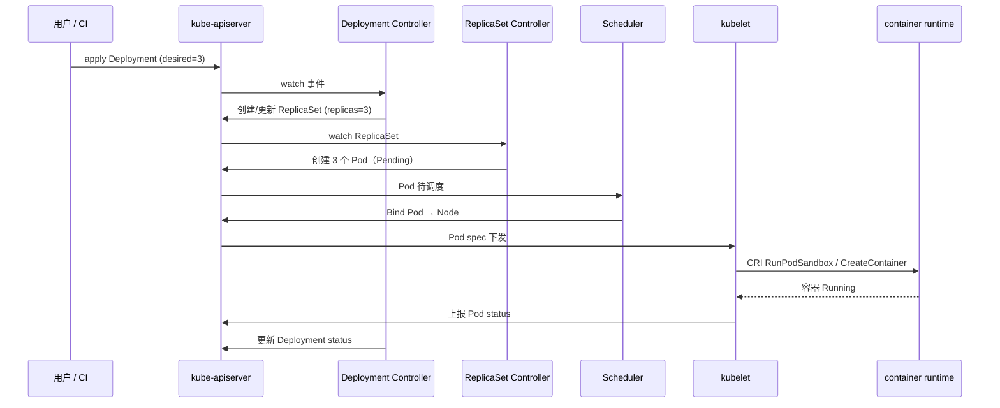
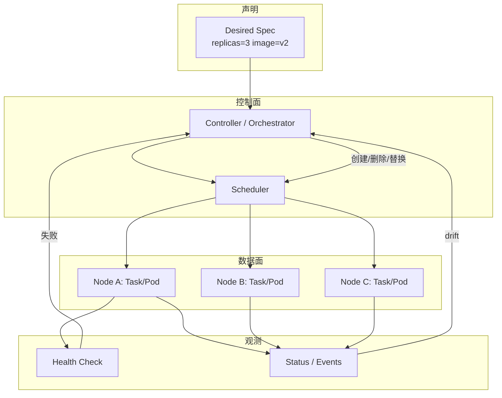

# 单机 docker run 管不住了？从编排需求、期望状态到调度/自愈闭环讲透

生产上 `docker run -d --restart=always` 堆了几十个容器，某台宿主机磁盘满、某进程 OOM 被 kill 后没人补位；滚动发版要手工 `docker stop/start`，漏一台就是灰度事故；Compose 文件在单机好用，换三台机器 IP 硬编码、负载均衡靠 nginx 手工改 upstream——这些不是「运维不够细心」，而是 **单机容器运行时只解决「把进程装进 namespace」**，不解决 **跨节点放置、期望状态持久化、故障替换、服务发现与滚动策略**。本文沿 **声明式期望状态 → 控制器 reconcile → 调度/放置 → 服务发现与负载 → 滚动更新 → 健康检查与自愈** 一条线讲透编排本质，并对照 Docker Swarm（SwarmKit）、HashiCorp Nomad、Kubernetes 的接口与排障视角；Kubernetes 只点到 controller/API 模式，不展开 Informer/Scheduler 源码细节。

## 阅读地图

1. **第一层：为何需要编排**——解决「systemd + docker run / Compose 在哪一层停住、多副本与跨机差什么」。
2. **第二层：期望状态 vs 实际状态**——解决「声明式 YAML/Spec 如何变成控制器循环、drift 如何被拉回」。
3. **第三层：调度与放置**——解决「副本数、约束、亲和/反亲和、资源请求/限额如何影响落点」。
4. **第四层：服务发现、负载与滚动更新**——解决「虚拟 IP / DNS / Ingress 如何接流量、maxUnavailable 与 maxSurge 如何控风险」。
5. **第五层：健康检查与自愈**——解决「liveness/readiness 区别、失败阈值与重启风暴边界」。
6. **第六层：Swarm / Nomad / K8s 对照与排障**——解决「同一概念在三套系统里叫什么、常见 pending/crashloop 怎么查」。

## 源码锚点

| 路径 / 符号 | 作用 |
|-------------|------|
| `moby/swarmkit` | Docker Swarm 编排内核：Raft 集群状态、调度器、分配器 |
| `moby/swarmkit/manager/orchestrator` | Service 期望副本 → Task 分配与 reconcile |
| `moby/swarmkit/manager/scheduler` | 节点过滤、打分、放置 Task |
| `moby/swarmkit/agent` | 节点 Agent：执行 Task、上报状态 |
| `kubernetes/kubernetes/pkg/controller/` | K8s 控制器模式：Deployment/ReplicaSet/Node 等 |
| `kubernetes/kubernetes/pkg/controller/deployment` | Deployment 滚动更新、ReplicaSet 管理 |
| `kubernetes/kubernetes/pkg/scheduler` | 默认调度器：Filter + Score + Bind |
| `kubernetes/kubernetes/pkg/registry/core/service` | Service / Endpoints（或 EndpointSlice）对象 |
| `hashicorp/nomad` | Nomad：Job/Task Group/Allocation 模型 |
| `hashicorp/nomad/scheduler` | Nomad 调度：Feasibility + Ranking |
| `compose-spec/compose-spec` | Compose 规范：单机多容器声明，无集群 reconcile |
| `systemd` unit `Restart=` | 单机进程级重启，无跨节点副本语义 |
| `docker service create/update` | Swarm 声明式 Service API |
| `kubectl apply` / `deployment.yaml` | K8s 声明式对象 + 控制器 |
| `nomad job run` | Nomad Job 提交 |

SwarmKit 编排器核心意图（`moby/swarmkit/manager/orchestrator` 逻辑摘要）：

```go
// 概念：每个 Service 维护 desired replicas，对比 running tasks，增删 Task
func (o *Orchestrator) reconcileService(ctx context.Context, service *api.Service) {
    // 1. 统计当前 RUNNING / SHUTDOWN 等状态 Task
    // 2. 若 running < desired → 创建新 Task 交给 scheduler
    // 3. 若 running > desired → 标记多余 Task 停止
    // 4. 滚动更新时按 update config 逐批替换
}
```

Kubernetes Deployment 控制器骨架（`pkg/controller/deployment/deployment_controller.go` 逻辑）：

```go
// 概念：watch Deployment → 对比 ReplicaSet 实际副本 → 扩缩/滚动
func (dc *DeploymentController) syncDeployment(key string) error {
    // 1. 读 Deployment spec.replicas、strategy
    // 2. 确保归属 ReplicaSet 存在且 template 匹配
    // 3. RollingUpdate：按 maxUnavailable/maxSurge 调整新旧 RS
    // 4. 更新 Deployment status（availableReplicas 等）
}
```

## 调用链

### 从 `kubectl apply` 到 Pod 运行（K8s 概念链，不展开 Informer 细节）



### 编排闭环：期望状态 → 观测 → 纠正



## 第一层：为何需要编排

### 单机 docker run 管什么、不管什么

`docker run`（经 dockerd → containerd → runc）完成：**镜像解包、namespace/cgroup、网络端点、单容器生命周期**。`--restart=always` 只在**同一 daemon** 上拉起同一容器 ID 语义的新实例；宿主机宕机、磁盘损坏、需要第二副本做 HA，它都不会自动在其他机器补位。

典型痛点场景：

| 场景 | 单机方案 | 缺口 |
|------|----------|------|
| 3 副本 Web | 三台机器各 `docker run` 一次 | 无统一声明；一台挂了要人工 ssh 补 |
| 发版 | `docker pull` + `docker stop/start` | 无 maxUnavailable；易全断 |
| 服务地址 | 写死 IP:port | 副本增减要改配置 |
| 资源隔离 | `--cpus` / `--memory` | 无集群级「哪台还有 CPU 空位」 |
| 密钥/配置 | env 文件散落 | 无版本化 rollout |

### systemd + 容器：进程级 HA 的上限

systemd unit 可以 `Restart=on-failure`，配合 `docker run` 或 `podman run`：

```ini
# /etc/systemd/system/myapp.service — 单机可用，非编排
[Service]
ExecStart=/usr/bin/docker run --rm --name myapp -p 8080:8080 myimg:v1
Restart=always
RestartSec=5
```

这解决 **单进程崩溃重启**，不解决：**副本数、跨节点、滚动策略、服务注册**。三台机器就要三份 unit，还要外部 keepalived/nginx 做流量切换——编排器把这些合成 **一个 Service 对象 + 控制器**。

### Docker Compose：单机声明式的边界

Compose（`compose-spec`）用 YAML 声明多容器拓扑：

```yaml
# compose.yaml — 适合开发/单机，默认无跨主机 reconcile
services:
  web:
    image: nginx:1.25
    ports: ["8080:80"]
    deploy:
      replicas: 3   # 仅 Swarm 模式生效；纯 compose up 忽略 replicas
```

`docker compose up` 在单机创建 network + container；**没有集群级 scheduler**，`deploy.replicas` 在 standalone compose 下不生效。要上多副本集群需 `docker stack deploy`（Swarm）或换 K8s/Nomad。

### 编排器补齐的能力清单

1. **集群抽象**：Node/Agent 注册，统一 API。
2. **期望状态存储**：etcd/Raft/Consul 等持久化 spec。
3. **Reconcile 循环**：实际 ≠ 期望 → 创建/删除/替换。
4. **调度**：按 CPU/内存/标签/亲和选节点。
5. **服务发现与负载**：虚拟 IP、DNS、Ingress/LB。
6. **滚动更新与回滚**：批次、健康门槛、版本历史。
7. **健康检查与自愈**：失败实例剔除并替换。

## 第二层：期望状态 vs 实际状态

### 声明式 vs 命令式

| 风格 | 例子 | 特点 |
|------|------|------|
| 命令式 | `docker run` × 3、`kubectl scale --replicas=5` | 描述「做什么动作」 |
| 声明式 | `replicas: 3` in YAML、`docker service create --replicas 3` | 描述「世界应长什么样」 |

编排器采用 **声明式 + 控制器**：你改 spec，控制器反复对比 status，直到一致。这是 Kubernetes controller pattern、SwarmKit orchestrator、Nomad 评估循环的共同思想。

### Desired / Actual 在对象模型里的落点

**Kubernetes**（点到接口）：

```yaml
apiVersion: apps/v1
kind: Deployment
metadata:
  name: web
spec:
  replicas: 3          # desired
  selector:
    matchLabels: { app: web }
  template:
    metadata:
      labels: { app: web }
    spec:
      containers:
      - name: nginx
        image: nginx:1.25
status:                  # actual — 由控制器/kubelet 写入
  replicas: 3
  availableReplicas: 2
  updatedReplicas: 1
```

- `spec`：用户意图（desired）。
- `status`：观测到的集群状态（actual）。
- Deployment Controller 读 spec，写 status；ReplicaSet Controller 管 Pod 数量；kubelet 写 Pod `status.phase`。

**Docker Swarm Service**：

```bash
docker service create --name web --replicas 3 nginx:1.25
docker service ls
docker service ps web
```

- Service spec：镜像、副本、更新策略、网络、约束。
- Task：Swarm 最小调度单元，一个 Task ≈ 一个容器实例。
- `docker service ps` 看每个 Task 状态（Running / Failed / Shutdown）。

**Nomad Job**：

```hcl
job "web" {
  group "nginx" {
    count = 3
    task "server" {
      driver = "docker"
      config { image = "nginx:1.25" }
    }
  }
}
```

- Job spec → Evaluation → Allocation（类似 Pod/Task）→ 客户端运行。

### Drift 与 reconcile

人工 `docker kill` 一个 Swarm Task、或 `kubectl delete pod`，控制器会发现 **actual 副本不足**，自动补新实例。这就是 **自愈** 的控制面基础。若人工在节点上改容器镜像而不改 spec，下次 reconcile 可能把容器拉回 spec 版本（取决于系统：K8s 会；纯 docker run 不会）。

### 观测期望/实际差异

```bash
# Kubernetes
kubectl get deploy web -o wide
kubectl describe deploy web | sed -n '/Events/,$p'
kubectl get rs -l app=web
kubectl get pods -l app=web -o wide

# Swarm
docker service inspect web --pretty
docker service ps web --no-trunc

# Nomad
nomad job status web
nomad alloc status <alloc-id>
```

## 第三层：调度与放置

### 调度器输入输出

调度器（通用模型）：

```
输入：待放置的工作负载（Pod / Task / Allocation）+ 集群节点清单 + 约束
输出：选定 Node（Bind / Assign）
```

两阶段常见实现：**Filter（硬约束过滤）→ Score（软偏好打分）→ Pick**。

### 硬约束与软偏好

| 类型 | 例子 | K8s 字段 | Swarm 字段 |
|------|------|----------|------------|
| 硬约束 | 必须 SSD 节点 | `nodeSelector` / `requiredDuringScheduling` | `--constraint node.labels.disk==ssd` |
| 软偏好 | 尽量同机架 | `preferredDuringScheduling` | `--placement-pref spread=node.labels.rack` |
| 资源 | 需要 2 CPU | `resources.requests.cpu` | `resources.reservations` |
| 反亲和 | 副本分散 | `podAntiAffinity` | `--placement-pref spread=node.id` |
| 污点 | 专用 GPU 节点 | `taints` + `tolerations` | node availability |

### 放置失败：Pending 的第一性原因

**K8s Pod Pending** 常见：

```bash
kubectl describe pod <name> | grep -A5 Events
# 0/3 nodes are available: 2 Insufficient cpu, 1 node(s) had taint ...
```

**Swarm Task pending**：

```bash
docker service ps web
# no suitable node (insufficient resources)
```

**Nomad**：

```bash
nomad job status -verbose web
# Placement Failures 段
```

### 最小调度实验（K8s）

```yaml
apiVersion: v1
kind: Pod
metadata:
  name: needs-gpu
spec:
  nodeSelector:
    accelerator: nvidia-tesla
  containers:
  - name: app
    image: busybox
    command: ["sleep", "3600"]
    resources:
      requests:
        cpu: "8"
        memory: "16Gi"
```

`kubectl apply -f` 后若节点无标签或资源，`Pending` 是预期行为——说明调度器在工作，不是 bug。

### Swarm 放置约束示例

```bash
docker node update --label-add disk=ssd node1
docker service create \
  --name db \
  --constraint 'node.labels.disk==ssd' \
  --replicas 1 \
  postgres:15
```

## 第四层：服务发现、负载与滚动更新

### 为什么需要服务发现

容器 IP 随重建变化。编排器提供 **稳定访问点**：

| 机制 | Swarm | K8s | Nomad |
|------|-------|-----|-------|
| 虚拟 IP + mesh | Ingress overlay routing mesh | ClusterIP + kube-proxy/ipvs | 可选 Consul Connect |
| DNS | `tasks.<service>` | `<svc>.<ns>.svc.cluster.local` | Consul DNS / native |
| L7 入口 | Traefik / 外部 LB | Ingress / Gateway API | Fabio / Traefik |

### Swarm 服务网络

```bash
docker network create -d overlay mynet
docker service create --name api --network mynet --replicas 3 myapi:v1
docker service inspect api --format '{{json .Endpoint.VirtualIPs}}'
```

集群内访问 `api` 服务名，Swarm DNS 解析到虚拟 IP，再负载到 backend Task。

### Kubernetes Service（接口级）

```yaml
apiVersion: v1
kind: Service
metadata:
  name: web
spec:
  selector:
    app: web
  ports:
  - port: 80
    targetPort: 8080
  type: ClusterIP
```

- `selector` 关联 Pod label。
- Endpoints / EndpointSlice 控制器把 Ready Pod IP 写入后端列表。
- kube-proxy（iptables/IPVS/nftables）或 eBPF 数据面做转发。

```bash
kubectl get svc web
kubectl get endpoints web
kubectl get endpointslice -l kubernetes.io/service-name=web
```

### 滚动更新策略

**K8s Deployment**：

```yaml
spec:
  strategy:
    type: RollingUpdate
    rollingUpdate:
      maxUnavailable: 1
      maxSurge: 1
```

- `maxUnavailable`：更新期间最多多少旧 Pod 不可用。
- `maxSurge`：最多多少超额新 Pod。
- `kubectl rollout status deployment/web`
- `kubectl rollout undo deployment/web`

**Swarm**：

```bash
docker service update \
  --image myapi:v2 \
  --update-parallelism 1 \
  --update-delay 10s \
  --update-failure-action rollback \
  web
```

**Nomad**：

```hcl
update {
  max_parallel = 1
  min_healthy_time = "10s"
  auto_revert = true
}
```

### 滚动更新风险点

1. **就绪前接流量**：未配置 readiness → 新副本未 listen 就进 LB。
2. **maxUnavailable=0 且 maxSurge=0**：死锁式更新（K8s 会拒绝无效组合）。
3. **镜像 pull 慢**：旧 Pod 已删、新 Pod ImagePullBackOff → 短暂不可用。
4. **有状态服务**：滚动不等于迁移数据，StatefulSet + PVC 是另一套模型。

### 发版观测命令

```bash
# K8s
kubectl rollout history deployment/web
kubectl get pods -l app=web -w

# Swarm
docker service ps web

# Nomad
nomad deployment list
nomad deployment status <deployment-id>
```

## 第五层：健康检查与自愈

### Liveness vs Readiness vs Startup

| 探针 | 失败后果 | 典型用途 |
|------|----------|----------|
| **liveness** | 重启容器 | 死锁、进程 hang |
| **readiness** | 从 Service 后端摘除 | 依赖未就绪、预热 |
| **startup** | 慢启动保护 liveness | 大 JVM / 迁移脚本 |

**K8s 示例**：

```yaml
containers:
- name: app
  livenessProbe:
    httpGet: { path: /healthz, port: 8080 }
    initialDelaySeconds: 30
    periodSeconds: 10
    failureThreshold: 3
  readinessProbe:
    httpGet: { path: /ready, port: 8080 }
    periodSeconds: 5
    failureThreshold: 2
```

**Docker Swarm**（服务级 healthcheck，写在镜像或 service spec）：

```bash
docker service create \
  --name web \
  --health-cmd "curl -f http://localhost/ || exit 1" \
  --health-interval 10s \
  --health-retries 3 \
  nginx:1.25
```

Swarm 不健康 Task 会被 orchestrator 替换；与 K8s liveness 类似，但无独立 readiness 对象——流量是否剔除取决于 routing mesh 与 health 状态配合。

### 自愈闭环

```
Health fail / 进程 exit / 节点失联
    → 状态上报（agent/kubelet）
    → 控制面标记 Task/Pod 失败
    → Orchestrator / Controller 发现副本不足
    → Scheduler 选新节点
    → 创建替换实例
```

**节点失联（K8s）**：Node Controller 检测 `NodeReady=False` 超时 → 标记 Pod 删除 → 别处重建（无本地存储时）。

**Swarm**：manager 通过 Raft 与 node heartbeat；node down 时 reschedule task。

### 重启风暴与边界

- **liveness 过 aggressive**：依赖慢 → 反复重启。
- **无 `failureThreshold`**：一次抖动即重启。
- **探针检查错端口**：永远失败 → CrashLoopBackOff。

```bash
kubectl logs <pod> --previous
kubectl describe pod <pod> | grep -A3 "Liveness\|Readiness"
docker service ps web --no-trunc | grep Failed
```

### CrashLoopBackOff 排障链（K8s）

```bash
kubectl get pods
kubectl describe pod <name>
kubectl logs <name> -c <container> --previous
kubectl get events --sort-by='.lastTimestamp' | tail -20
```

常见根因：镜像错误、启动命令 exit、探针失败、ConfigMap 未挂载、权限不足。

## 第六层：Swarm / Nomad / K8s 对照与排障

### 概念对照表

| 概念 | Docker Swarm | Kubernetes | Nomad |
|------|--------------|------------|-------|
| 集群入口 | Manager API | kube-apiserver | Nomad Server |
| 最小调度单元 | Task | Pod | Allocation |
| 副本控制器 | Service + orchestrator | Deployment → ReplicaSet | Job group count |
| 节点代理 | swarmkit agent | kubelet | Nomad client |
| 网络 | overlay + routing mesh | CNI + Service | CNI / bridge |
| 存储声明 | volume driver | PV/PVC | host volume / CSI 插件 |
| 密钥 | docker secret | Secret | Vault / template |
| 典型 CLI | `docker service` | `kubectl` | `nomad job` |

### 何时选哪套（工程视角，非绝对）

| 场景 | 倾向 |
|------|------|
| 已有 Docker 运维、中小规模 | Swarm（简单，但生态收缩） |
| 大规模、CRD/Operator 生态 | K8s |
| 混合调度（容器+二进制+批处理） | Nomad |
| 单机/开发 | Compose / docker run |

### Swarm 快速验证编排闭环

```bash
docker swarm init
docker network create -d overlay demo
docker service create --name hello --replicas 3 --network demo alpine sleep 3600
docker service ls
docker service ps hello
docker kill $(docker ps -q --filter name=hello)  # 杀一个 task
sleep 5
docker service ps hello   # 应看到新 task 被创建
```

### K8s 最小 Deployment 验证

```bash
kubectl create deployment web --image=nginx:1.25 --replicas=3
kubectl get deploy,rs,pods -l app=web
kubectl delete pod -l app=web --force --grace-period=0
kubectl get pods -l app=web -w   # 应补到新 3 个
```

### Nomad 最小 Job

```bash
nomad job run - <<'EOF'
job "sleep" {
  datacenters = ["dc1"]
  group "g" {
    count = 2
    task "t" {
      driver = "exec"
      config {
        command = "sleep"
        args    = ["3600"]
      }
    }
  }
}
EOF
nomad job status sleep
```

### 排障：Service 有副本但访问不通

**分层查**：

1. **副本真在跑吗**：`docker service ps` / `kubectl get pods`。
2. **Ready 吗**：readiness / health。
3. **Service 后端列表**：`kubectl get endpoints` / Swarm VIP backend。
4. **网络策略 / 防火墙**：K8s NetworkPolicy、安全组。
5. **端口映射**：targetPort 是否与进程 listen 一致。

```bash
# K8s：从集群内 curl
kubectl run tmp --rm -it --image=curlimages/curl -- curl -s http://web

# Swarm：进 overlay 网络容器
docker run --rm --network demo alpine wget -qO- http://hello
```

### 排障：滚动更新卡住

```bash
# K8s
kubectl rollout status deployment/web
kubectl get rs -o wide
kubectl describe deploy web

# Swarm
docker service inspect web --pretty | grep -A10 UpdateStatus
docker service ps web
```

常见：`ProgressDeadlineExceeded`（K8s）、新镜像 pull 失败、探针永不 ready、`maxUnavailable` 过小且旧 Pod 无法终止（PID 1 不响应 SIGTERM）。

### 排障：调度一直 Pending

统一思路：**Filter 阶段被谁挡了**——资源、污点、nodeSelector、PVC 未绑定、镜像仓库 credential。

```bash
kubectl describe pod <p> | tail -20
kubectl get nodes -o custom-columns=NAME:.metadata.name,CPU:.status.allocatable.cpu,MEM:.status.allocatable.memory,TAINTS:.spec.taints
docker node ls
docker node inspect self --pretty
```

### systemd + Compose 与编排器混用风险

- Compose 手工 `up` 的容器 **不受** Swarm/K8s 控制器管理 → 双轨 drift。
- 同一端口被 compose 与 daemonset 抢占 → 启动失败。
- 建议：开发 Compose，生产统一入口（stack deploy / kubectl / nomad）。

## 重点知识

### 编排 != 容器运行时

containerd/CRI 管 **单机上的 create/start**；编排管 **多少份、在哪台、如何更新、如何接流量**。kubelet 是交汇点：对上接收 Pod spec，对下调 CRI。

### 期望状态持久化是 HA 的前提

Swarm Manager Raft、K8s etcd、Nomad Server 状态存储丢了，集群就丢「该跑什么」。备份 etcd、奇数 manager 节点是运维基线。

### 健康检查是滚动更新的闸门

没有 readiness，滚动更新等于「把坏副本接进 LB」。发版脚本要盯 `availableReplicas` / `deployment status`，不是只盯 `kubectl apply` 返回 0。

### 有状态与无状态分开建模

Deployment + Service 适合无状态；数据库应用 StatefulSet / Swarm global + volume / Nomad volume 插件，滚动语义不同。

## 命令速查（对照）

| 意图 | Swarm | Kubernetes | Nomad |
|------|-------|------------|-------|
| 声明 3 副本服务 | `docker service create --replicas 3` | `kubectl create deploy --replicas=3` | `count = 3` in group |
| 扩缩 | `docker service scale web=5` | `kubectl scale deploy web --replicas=5` | `nomad job scale web 5` |
| 滚动发版 | `docker service update --image` | `kubectl set image deploy/web ...` | job spec 改 image + deploy |
| 看放置 | `docker service ps` | `kubectl get pods -o wide` | `nomad alloc status` |
| 回滚 | `docker service rollback` | `kubectl rollout undo` | `nomad job revert` |
| 日志 | `docker service logs` | `kubectl logs -l app=web` | `nomad alloc logs` |

## 验证闭环：本地最小编排实验

### 实验 A：声明式自愈（K8s minikube/k3s）

```bash
kubectl create deployment nginx --image=nginx:1.25 --replicas=2
kubectl get pods -w &
PID=$!
kubectl delete pod -l app=nginx --all --force --grace-period=0
wait $PID
kubectl get pods -l app=nginx   # 仍应为 2 Running
```

### 实验 B：滚动更新与回滚

```bash
kubectl set image deployment/nginx nginx=nginx:1.24
kubectl rollout status deployment/nginx
kubectl rollout undo deployment/nginx
```

### 实验 C：Swarm 服务发现

```bash
docker swarm init 2>/dev/null || true
docker service create --name echo --publish 8080:80 --replicas 2 nginx:1.25
curl -s localhost:8080 | head -3
docker service scale echo=4
docker service ls
```

### 实验 D：故意制造 unhealthy

K8s 错误 liveness：

```yaml
livenessProbe:
  exec:
    command: ["sh", "-c", "exit 1"]
  periodSeconds: 5
```

应用后 `kubectl get pods` 应见 Restart 计数上升——验证 **探针驱动自愈**；实验完删除 Deployment。

## 与周边章节的关系

- 单机容器链：`dockerd → containerd → runc` 见同目录《Docker 基础 daemon 与 containerd》。
- Namespace/Cgroup 隔离边界见《容器隔离从 Namespace 到 Cgroup》。
- K8s 底层 CRI 与 containerd 见 containerd `pkg/cri`；本文不展开。
- 生产 Ingress/service mesh 是独立专题；编排只保证 **后端实例集合** 正确。

## 常见误区

1. **「Compose replicas 就是集群多副本」**——standalone compose 忽略 `deploy.replicas`。
2. **「restart=always 等于 HA」**——无跨节点、无负载均衡。
3. **「滚动更新 = 零停机」**——取决于 readiness、preStop、LB 摘除延迟。
4. **「调度 Pending 是 bug」**——多数是资源或约束不满足。
5. **「Swarm 与 K8s 完全等价」**——对象模型、扩展性、生态差异大；选型看团队与规模。

## 生产参数参考（起点，非银弹）

**K8s 中小型 Web Deployment**：

```yaml
spec:
  replicas: 3
  strategy:
    rollingUpdate:
      maxUnavailable: 1
      maxSurge: 1
  template:
    spec:
      terminationGracePeriodSeconds: 30
      containers:
      - name: app
        resources:
          requests: { cpu: "100m", memory: "128Mi" }
          limits:   { cpu: "500m", memory: "512Mi" }
        readinessProbe:
          httpGet: { path: /ready, port: 8080 }
          periodSeconds: 5
        livenessProbe:
          httpGet: { path: /healthz, port: 8080 }
          initialDelaySeconds: 30
```

**Swarm 生产 update 配置**：

```bash
docker service create \
  --name api \
  --replicas 3 \
  --update-parallelism 1 \
  --update-delay 15s \
  --update-order start-first \
  --rollback-parallelism 1 \
  --rollback-on-failure \
  myapi:stable
```

## 事件与审计：排障时的「黑匣子」

```bash
# K8s 事件按时间排序
kubectl get events -A --sort-by='.lastTimestamp' | tail -30

# 特定 Deployment 关联事件
kubectl describe deploy web

# Swarm：manager 日志
journalctl -u docker -f | grep -i swarm

# Nomad
nomad monitor -log-level=INFO
```

关注动词：`FailedScheduling`、`Unhealthy`、`Killing`、`Pulling`、`BackOff`、`Rollback`。

## 安全与多租户（编排面）

- **RBAC（K8s）**：谁可以 `create deployment`、谁只能读。
- **Swarm**：manager TLS、secret 加密 at rest（取决于配置）。
- **Nomad**：ACL token、namespace。
- **镜像信任**：编排不替代签名验证；Policy/admission 另层。

## 性能与规模边界

| 因素 | 说明 |
|------|------|
| 控制面 QPS | 大量 Pod 同时重建 → apiserver/etcd 压力 |
| Endpoint 更新风暴 | 频繁 readiness 抖动 → iptables/ipvs 更新 |
| Swarm Raft | Manager 建议奇数、不过度扩容 |
| 调度延迟 | 大集群 Pending 队列深度 |

观测：`kubectl top nodes`、apiserver `apiserver_request_total`、etcd latency（若可访问 metrics）。

## 总结主线

编排的核心不是「会写 YAML」，而是理解 **期望状态 → 控制器 reconcile → 调度放置 → 服务发现 → 健康驱动的替换** 闭环。单机 `docker run`、systemd、Compose 各管一段；跨节点 HA、滚动发版、自动补副本需要 Swarm/Nomad/K8s 这类控制面。排障时先分 **是没调度、没起来、起来了不健康、还是网络/LB 没接上**——四层分开查，避免在镜像层浪费时间。
