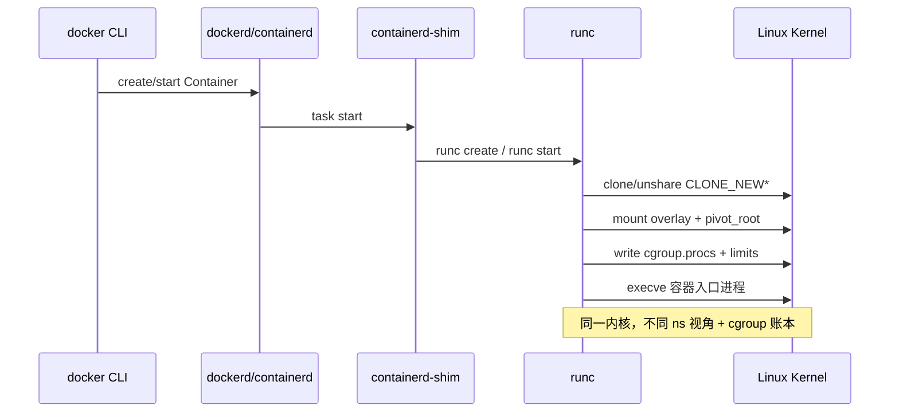

# 容器不是轻量 VM：从 Namespace 隔离视角到 Cgroup 限额、rootfs/pivot_root 与 runc 启动链

`docker run` 一秒起来，有人就说「容器是轻量级虚拟机」——直到主机 `/proc` 被容器里的 root 扫遍、`kill -9 1` 误伤宿主机、或 `--memory` 设了仍把邻居 OOM。根因不是 Docker 魔法，而是 **同一颗内核上的 Namespace 隔离视角 + Cgroup 资源账本 + 独立 rootfs（pivot_root）+ OCI/runc 装配顺序**。本文按内核 `CLONE_NEW*`、`kernel/cgroup/`、`fs/` 与 runc `libcontainer` 真实路径，把「看见什么 / 用多少 / 文件系统根在哪 / 谁按什么顺序装」串成一条可验证主线。

## 阅读地图

1. **第一层：容器 vs VM**——解决「共享内核意味着什么、隔离边界在哪、为何不是轻量 hypervisor」。
2. **第二层：Namespace 隔离视角**——解决「PID/NET/MNT/UTS/IPC/USER/CGROUP 各挡住什么、`/proc/PID/ns` 怎么读」。
3. **第三层：Cgroup 限额**——解决「隔离不等于限速、cpu/memory/pids 写到哪、OOM 杀的是谁」。
4. **第四层：rootfs 与 pivot_root**——解决「镜像层如何变成容器根、`chroot` 与 `pivot_root` 差在哪、挂载传播如何漏」。
5. **第五层：runc / OCI 启动链**——解决「`docker → containerd → runc` 谁创建 ns、谁写 cgroup、谁 exec」。
6. **第六层：观测与排障**——解决「进程看见错、限额不生效、权限逃逸嫌疑时按哪条命令链查」。

## 源码锚点

| 路径 / 符号 | 作用 |
|-------------|------|
| `include/uapi/linux/sched.h` | `CLONE_NEWNS`/`CLONE_NEWPID`/`CLONE_NEWNET` 等 flag |
| `kernel/fork.c` | `copy_process` → `copy_namespaces` |
| `kernel/nsproxy.c` | `struct nsproxy`：进程持有的 ns 集合 |
| `kernel/pid_namespace.c` | PID ns；容器内 PID 1 |
| `net/core/net_namespace.c` | network ns；独立 netdev/路由/iptables |
| `fs/namespace.c` | mount ns；`pivot_root`/`umount` |
| `kernel/user_namespace.c` | user ns；UID 映射 |
| `kernel/cgroup/cgroup.c` | cgroup 核心；`cgroup.procs` |
| `kernel/sched/fair.c` | CFS bandwidth ↔ `cpu.max` |
| `mm/memcontrol.c` | memory 控制器 / memcg OOM |
| `fs/super.c` / `fs/namespace.c` | `pivot_root` 系统调用路径 |
| `runc` `libcontainer/factory_linux.go` | 创建容器工厂 |
| `runc` `libcontainer/process_linux.go` | ns 进入、exec |
| `runc` `libcontainer/cgroups/` | 写 cgroup v1/v2 |
| `runc` `libcontainer/rootfs_linux.go` | 挂载 rootfs、`pivotRoot` |
| OCI Runtime Spec `config.json` | `linux.namespaces` / `linux.resources` / `root` |
| `/proc/PID/ns/*` | 进程所属命名空间 inode |
| `/proc/PID/cgroup` | 进程所属 cgroup 路径 |
| `/proc/PID/root` | 进程根目录视图 |
| `man 2 clone` / `man 2 unshare` / `man 2 setns` / `man 2 pivot_root` | 用户态入口 |

本机先摸清内核是否支持这些 ns（容器能否起来的前提）：

```bash
ls /proc/self/ns/
unshare --help | head -5
cat /proc/filesystems | grep -E 'cgroup|nsfs'
mount | grep -E 'cgroup|overlay'
which runc containerd dockerd 2>/dev/null
runc --version 2>/dev/null; docker version 2>/dev/null | head -20
```

OCI 配置里「隔离清单」长这样（逻辑字段，路径以你本机 `runc spec` 为准）：

```json
{
  "ociVersion": "1.0.2",
  "root": { "path": "rootfs", "readonly": false },
  "linux": {
    "namespaces": [
      { "type": "pid" },
      { "type": "network" },
      { "type": "ipc" },
      { "type": "uts" },
      { "type": "mount" },
      { "type": "cgroup" }
    ],
    "resources": {
      "memory": { "limit": 268435456 },
      "cpu": { "quota": 50000, "period": 100000 }
    }
  }
}
```

`runc` 创建 rootfs 挂载与 pivot 的核心意图（`libcontainer/rootfs_linux.go` 逻辑摘要）：

```go
// runc libcontainer — 逻辑摘要，非逐字拷贝
func pivotRoot(rootfs string) error {
    // 1. 把新 rootfs 挂成 private，切断宿主机挂载传播
    // 2. pivot_root(new_root, put_old)
    // 3. 在新根里 umount put_old，丢掉宿主机旧根可见性
    // 4. 再挂 proc/sys/dev 等「容器视角」伪文件系统
}
```

内核侧 `nsproxy`（进程「看见世界」的句柄集）：

```c
/* kernel/nsproxy.c — 结构意图 */
struct nsproxy {
    struct uts_namespace *uts_ns;
    struct ipc_namespace *ipc_ns;
    struct mnt_namespace *mnt_ns;
    struct pid_namespace *pid_ns_for_children;
    struct net           *net_ns;
    struct time_namespace *time_ns;
};
```

## 调用链

### docker run → containerd → runc → 内核



### 进程视角：Namespace + Cgroup + rootfs 三轴

```mermaid
flowchart TB
    subgraph 共享内核
        K[同一 Linux Kernel]
    end
    subgraph 隔离轴_Namespace
        PID[pid_ns: 独立 PID 树]
        NET[net_ns: 独立网卡/路由]
        MNT[mnt_ns: 独立挂载表]
        UTS[uts_ns: hostname]
        IPC[ipc_ns: SysV/POSIX IPC]
        USER[user_ns: UID 映射]
    end
    subgraph 限额轴_Cgroup
        CPU[cpu.max / cpu.weight]
        MEM[memory.max / OOM]
        PIDS[pids.max]
        IO[io.max / io.weight]
    end
    subgraph 文件系统轴
        IMG[镜像层 + upper]
        ROOT[pivot_root → /]
        PROC[/proc /sys /dev]
    end
    K --> PID & NET & MNT
    K --> CPU & MEM
    IMG --> ROOT --> PROC
```

### 手工最小容器（理解 runc 在干什么）


## 重点知识

### 第一层：容器不是轻量 VM

VM 路径是：宿主机 Hypervisor → 客户机内核 → 客户机用户态。客户机有自己的调度器、页表根、驱动模型；与宿主机内核是两套。

容器路径是：**宿主机内核直接调度容器进程**。容器进程只是换了一套「名字空间视角」和「资源账本」，没有第二颗内核。因此：

| 维度 | 虚拟机 | 容器 |
|------|--------|------|
| 内核 | 客户机独立内核 | **共享宿主机内核** |
| 启动代价 | 秒～十秒级（固件+内核） | 毫秒～百毫秒（clone+mount+exec） |
| 隔离强度 | 硬件/hypervisor 边界 | ns + cgroup + seccomp/capability（软边界） |
| `/proc`、`sysfs` | 客户机自己的 | **宿主机内核导出的视图**（经挂载裁剪） |
| 漏洞面 | 逃逸要过 hypervisor | 内核漏洞 / 错误配置可直接伤宿主机 |

「轻量」指的是 **不启动第二内核、不模拟整机设备**；不是指「隔离等同于 VM」。把容器当 VM 用，会在安全（共享内核）、排障（以为有独立 init/网络栈却其实共享协议栈实现）、容量规划（CPU 份额是相对权重不是 vCPU 插槽）上踩坑。

对照实验——同一主机上两个「世界」其实共内核：

```bash
# 宿主机
uname -r; cat /proc/version | head -1
# 容器内
docker run --rm alpine uname -r
# 内核版本字符串应一致（发行版用户态可不同）
```

进程树也能说明问题：容器里的 PID 1，在宿主机上只是某个 `runc`/`containerd-shim` 下的普通 PID：

```bash
docker run -d --name iso-demo alpine sleep 3600
PID=$(docker inspect -f '{{.State.Pid}}' iso-demo)
echo "host PID=$PID"
ps -fp $PID
sudo ls -l /proc/$PID/ns/
sudo cat /proc/$PID/cgroup
sudo readlink /proc/$PID/root
docker rm -f iso-demo
```

### 第二层：Namespace ——「看见什么」的隔离

Namespace 回答的问题是：**这个进程用哪套名字空间去解释 PID、网卡、挂载、主机名、IPC、UID**。它不直接回答「能用多少 CPU/内存」——那是 Cgroup。

#### 七种常用 Namespace

| 类型 | clone flag | 隔离对象 | 容器内典型现象 |
|------|------------|----------|----------------|
| Mount | `CLONE_NEWNS` | 挂载表 | 自己的 `/`、`/proc`；看不见宿主机盘符树 |
| UTS | `CLONE_NEWUTS` | hostname/domainname | `hostname` 可单独设 |
| IPC | `CLONE_NEWIPC` | SysV shm/sem/msg、部分 POSIX | 与宿主机 IPC 对象隔离 |
| PID | `CLONE_NEWPID` | 进程 ID 空间 | 容器内看到自己是 PID 1 |
| Network | `CLONE_NEWNET` | netdev、路由、iptables、socket | 独立 `lo`、veth、路由表 |
| User | `CLONE_NEWUSER` | UID/GID 映射 | 容器内 0 ↔ 宿主机高位 UID |
| Cgroup | `CLONE_NEWCGROUP` | cgroup 根视图 | 限制对 cgroup fs 的「看见」 |

Time namespace（`CLONE_NEWTIME`）较新，部分运行时可选；排障时先确认内核与 runc 版本是否启用。

#### `/proc/PID/ns` 怎么读

每个文件是一个 ns 的 inode；**同一 inode 号 = 同一命名空间**：

```bash
ls -l /proc/self/ns/
# 例：net -> 'net:[4026531992]'
readlink /proc/1/ns/pid /proc/self/ns/pid
# 若不同，说明当前 shell 不在 init 的 pid ns
```

进入已有容器网络命名空间（排障神器）：

```bash
PID=$(docker inspect -f '{{.State.Pid}}' <容器名>)
sudo nsenter -t $PID -n ip addr
sudo nsenter -t $PID -n ip route
sudo nsenter -t $PID -m -p -u -i -n # 按需组合
```

#### PID Namespace：容器里的「1 号进程」

在新 PID ns 里，第一个进程成为该 ns 的 init（PID 1）。它退出会导致该 ns 内其他进程被内核处理（类似孤儿回收语义收紧）。Docker 默认入口即容器 PID 1；若入口是 shell 且不转发信号，会出现「docker stop 杀不干净」类问题——根因在 PID 1 职责，不是「容器坏了」。

```bash
docker run --rm alpine ps aux
# 通常只有 PID 1 的 ps 自身（极简）
docker run --rm --pid=host alpine ps aux | head
# --pid=host：与宿主机共享 PID ns，能看到宿主机进程（危险，仅调试）
```

内核侧：`copy_process` 在 `CLONE_NEWPID` 时创建新 `pid_namespace`，子进程在新 ns 中分配 pid。

#### Network Namespace：独立协议栈视图

新 net ns 初始几乎只有 `lo`（且常需手动 `ip link set lo up`）。Docker 再把 veth 一端移入该 ns、配 IP、默认真机走 docker0/bridge。细节见姊妹篇网络文；此处只强调：**隔离的是「网卡与路由表视图」，不是另造一套 TCP 实现**——TCP/IP 代码仍是宿主机内核那一份。

```bash
sudo unshare -n /bin/bash
ip link   # 通常只剩 lo
exit
```

#### Mount Namespace：文件系统「看见」的边界

每个 mnt ns 有自己的挂载表。容器 rootfs、`/proc`、`/sys`、`tmpfs` 上的 `/dev` 都是在该 ns 里 mount 出来的。挂载传播（shared/slave/private）决定「宿主机新挂载会不会漏进容器」——runc 通常把 root 设为 private，再 pivot。

```bash
findmnt -o TARGET,SOURCE,FSTYPE,PROPAGATION | head
cat /proc/self/mountinfo | head
```

#### User Namespace：权限语义重映射

开启 user ns 后，容器内 UID 0 可映射到宿主机非特权 UID，降低「容器 root = 宿主机 root」风险。Docker 默认很多发行版仍是 **特权用户映射关闭或受限**（root in container ≈ root on host for 多数操作），需显式 `--userns-remap` 或 rootless。排障时不要假设「容器里 root 一定弱」。

```bash
cat /proc/self/uid_map
docker info 2>/dev/null | grep -i userns || true
```

#### 手工验证：unshare 拼一个最小「隔离壳」

```bash
# 需要 root；理解机制用，生产请用 runc/Docker
sudo unshare --mount --uts --ipc --pid --fork --mount-proc /bin/bash
hostname isolated-demo
hostname
ps aux | head
# 另开终端对比宿主机 hostname / ps，确认视角已分叉
exit
```

与 `clone`/`setns` 的关系：`unshare` 让**当前进程**脱离并新建 ns；`clone` 创建子进程时带新 ns；`setns` 加入**已存在**的 ns（`nsenter`、调试进容器都靠它）。

### 第三层：Cgroup ——「用多少」的限额

Namespace 让你看不见别人的网卡；**不阻止你把 CPU 打满拖死邻居**。Cgroup 才是账本。

#### 与 Namespace 的正交关系

```text
Namespace：名字与可见性（我是谁、我看见谁）
Cgroup   ：资源计量与限制（我能用多少）
```

进程通过写入 `cgroup.procs`（或 v1 各控制器下的 `tasks`）加入某 cgroup；限额文件如 v2 的 `memory.max`、`cpu.max`。Docker `--memory`/`--cpus` 最终变成 OCI `linux.resources`，由 runc 写入。

```bash
# 看本机 cgroup 模式
stat -fc %T /sys/fs/cgroup
# cgroup2fs → 统一树；tmpfs + 多子挂载 → 多为 v1 或 hybrid
cat /proc/self/cgroup
mount | grep cgroup
```

#### 容器常用控制器

| 控制器 | 典型文件（v2） | Docker 近似参数 |
|--------|----------------|-----------------|
| cpu | `cpu.max` `cpu.weight` | `--cpus` `--cpu-shares` |
| memory | `memory.max` `memory.high` | `--memory` `--memory-swap` |
| pids | `pids.max` | `--pids-limit` |
| io | `io.max` `io.weight` | `--device-*-bps` 等 |

验证限额是否落到进程上：

```bash
docker run -d --name cg-demo --memory 128m --cpus 0.5 alpine sleep 3600
PID=$(docker inspect -f '{{.State.Pid}}' cg-demo)
cat /proc/$PID/cgroup
# 按路径进入对应 cgroup 目录后：
# cat memory.max cpu.max pids.max
docker stats cg-demo --no-stream
docker rm -f cg-demo
```

#### memory 超限：杀的是 cgroup 内进程

memcg OOM 与全局 OOM 不同：优先在**触账的 cgroup**里选牺牲者。日志常见 `Memory cgroup out of memory`。若误以为「容器 memory 保护了宿主机一切」，却把关键进程放在**同一 cgroup 外或限额过大**，仍会全局抖动。

```bash
dmesg -T | grep -i 'memory cgroup' | tail
# v2 事件计数
# cat memory.events   # oom / oom_kill
```

#### cpu 限额是带宽，不是「绑了半颗核就物理独占」

v2 `cpu.max` 形如 `50000 100000` = 每 100ms 周期最多跑 50ms，约 0.5 CPU。未限时时靠 `cpu.weight` 相对抢占。容器「CPU 限了仍看满」：可能看的是容器内 `top` 相对自己 ns 的比例，或配额周期内突发，需看 `cpu.stat` 的 `nr_throttled`。

```bash
# 在容器对应 cgroup 目录
cat cpu.stat 2>/dev/null
```

Cgroup 深层字段与 v1/v2 对照，见本仓库姊妹文《Cgroups》；本文只钉死：**隔离（ns）与限额（cgroup）必须一起配，缺一不可**。

### 第四层：rootfs、Union 挂载与 pivot_root

容器要有自己的 `/`。Docker 镜像多层 + writable upper，通常由 overlayfs 合成一个合并视图，再作为容器 rootfs。

#### 从镜像到合并根

典型路径（发行版/root 目录因安装而异，以实际 `docker info` 为准）：

```bash
docker info 2>/dev/null | grep -E 'Storage Driver|Docker Root'
# overlay2 下层常见于：
# /var/lib/docker/overlay2/<id>/diff
# 合并工作目录 merged / lower / upper / work
```

逻辑：

```text
lower（只读镜像层） + upper（容器可写） + work
        → overlay merge → 容器 rootfs 目录
        → runc pivot_root 切成新的 /
```

#### chroot vs pivot_root

| | `chroot` | `pivot_root` |
|--|----------|--------------|
| 作用 | 改当前进程根目录解释 | 交换根挂载，旧根可被卸载 |
| 旧根 | 仍可能通过挂载/打开的 fd 触及 | 规范用法会 umount 旧根，**更干净** |
| 容器运行时 | 极少单独依赖 | **runc 标准路径** |

`pivot_root(new_root, put_old)`：把调用者的根换成 `new_root`，旧根挂到 `put_old`。随后在新 ns 里卸载 `put_old`，进程便不应再通过路径走到宿主机真实根。若 pivot 失败回退到 `chroot`，部分旧环境仍可见——属于运行时降级路径，排障时查 runc 日志。

手工理解（示意，路径按你准备的 rootfs 改）：

```bash
# 仅示意步骤，勿在生产盘直接实验
# 1. 准备 rootfs 目录，含 bin/lib/proc 等
# 2. mount --make-private -o remount /
# 3. mount --bind rootfs rootfs && cd rootfs
# 4. mkdir old_root && pivot_root . old_root
# 5. umount -l old_root && rmdir old_root
# 6. mount -t proc proc /proc
```

#### 伪文件系统必须在容器 mnt ns 内重挂

容器内的 `/proc`、`/sys` 不是「拷贝出来的文件」，而是 **在该 mount ns 里重新 mount 的 proc/sysfs**。若错误地绑定了宿主机 `/proc`，PID ns 再隔离也会从 `/proc` 漏看宿主机进程——这是经典配置事故。

```bash
docker run --rm alpine ls /proc | head
# 对比：错误地 --mount type=bind,source=/proc,target=/proc 会破坏隔离（勿在生产这样用）
```

#### 只读根与可写层

`docker run --read-only` 让根只读，临时目录需显式 `tmpfs`。这与 pivot 后的 rootfs 属性、OCI `root.readonly` 一致。排障「容器内无法写日志」时先看是否只读根，而不是怪应用。

```bash
docker run --rm --read-only alpine touch /oops
# 应失败；加 --tmpfs /tmp 后写 /tmp 可成功
```

### 第五层：runc / OCI 启动链 —— 谁在什么顺序装配

用户态栈常见为：

```text
docker CLI → dockerd → containerd → containerd-shim → runc (OCI runtime)
```

containerd 负责任务生命周期与镜像；**真正调用 clone/mount/cgroup/exec 的是 runc**（或 crun 等 OCI 运行时）。Podman 可走 crun；逻辑同样遵循 OCI Runtime Spec。

#### 创建阶段 vs 启动阶段

1. **create**：根据 `config.json` 建好 ns、挂载、cgroup、管道，进程停在 init 同步点（runc 的 bootstrap）。
2. **start**：向容器 init 发信号，exec 用户入口（`args`）。

因此「容器 Created 却没 Running」常是 start 没发出或入口进程秒退——查 `docker inspect` 的 State、`runc` 事件、容器日志。

```bash
docker ps -a --filter name=iso
docker inspect <id> --format 'Status={{.State.Status}} Exit={{.State.ExitCode}} OOM={{.State.OOMKilled}}'
journalctl -u docker -u containerd --no-pager | tail -50
```

#### runc 内部顺序（逻辑）

```text
解析 OCI spec
  → 创建/加入 namespaces
  → 配置 cgroup 并迁入进程
  → 准备 rootfs（含 pivot_root）
  → 设置 hostname、sysctl、rlimits
  → capability 降权、seccomp、no_new_privs
  → execve(cwd, args, env)
```

任一步失败都会在 create/start 返回错误。**先 ns 再 pivot 再 exec** 的顺序保证：入口进程一上来就在正确的根与名字空间里。

#### 与 systemd cgroup 驱动

Docker 的 `native.cgroupdriver` 可为 `systemd` 或 `cgroupfs`。systemd 驱动下限额落到 `docker-<id>.scope` 一类单元；排障时不要只在 `/sys/fs/cgroup/docker` 下找，应按 `/proc/PID/cgroup` 给的路径走。

```bash
docker info 2>/dev/null | grep -i cgroup
systemctl status docker --no-pager | head
```

#### 最小 runc 实验（无 Docker）

```bash
mkdir -p /tmp/mini-container && cd /tmp/mini-container
runc spec
# 编辑 config.json：把 terminal、args 改成 ["sleep","60"]，root.path 指向准备好的 rootfs
# 准备 alpine rootfs 可用：docker export 或根文件系统工具
# sudo runc run mini
```

能跑通就说明：**容器 = OCI 描述的一次内核机制组装**，Docker 只是更高层的 UX 与生态。

### 第六层：观测与排障

#### 问题 A：容器里能看到宿主机进程 / 网卡

分层查：

```bash
PID=$(docker inspect -f '{{.State.Pid}}' <c>)
# 1. ns 是否独立
sudo readlink /proc/$PID/ns/pid /proc/1/ns/pid
sudo readlink /proc/$PID/ns/net /proc/1/ns/net
# 2. 是否 --pid=host / --network=host
docker inspect <c> --format '{{.HostConfig.PidMode}} {{.HostConfig.NetworkMode}}'
# 3. /proc 是否被错误 bind
docker inspect <c> --format '{{json .Mounts}}'
```

`host` 模式是**故意关闭**对应 ns 隔离，不是 bug。

#### 问题 B：`--memory` / `--cpus` 「不生效」

```bash
PID=$(docker inspect -f '{{.State.Pid}}' <c>)
cat /proc/$PID/cgroup
# 进入实际 cgroup 目录核对 memory.max / cpu.max
docker inspect <c> --format '{{.HostConfig.Memory}} {{.HostConfig.NanoCpus}}'
# 确认 dockerd cgroup driver 与宿主机 v1/v2 一致
docker info | grep -i cgroup
```

常见坑：在容器内用 `free` 看宿主机 MemTotal（`/proc/meminfo` 未完全虚拟化）；应以 `docker stats` 或 cgroup `memory.current` 为准。

```bash
docker stats <c> --no-stream
# 在 cgroup 目录：
cat memory.current memory.max 2>/dev/null
```

#### 问题 C：容器一启动就 Exit

```bash
docker inspect <c> --format 'Exit={{.State.ExitCode}} Err={{.State.Error}}'
docker logs <c>
# 入口二进制不存在、动态库缺失、只读根、seccomp 拒杀 —— 分别查 rootfs、Mounts、SecurityOpt
```

Exit 127/255 多与路径或权限相关；OOMKilled=true 则回到 memory cgroup。

#### 问题 D：怀疑隔离被打穿

不要先怪「容器技术不行」，按轴排查：

1. **Namespace**：`readlink /proc/PID/ns/*` 是否与宿主机 init 相同。  
2. **Capabilities**：`docker inspect` 的 CapAdd/CapDrop；是否 `--privileged`。  
3. **Seccomp/AppArmor/SELinux**：SecurityOpt、发行版强制访问控制日志。  
4. **挂载**：是否把宿主机 `/`、`/var/run/docker.sock` 挂进容器（运维便利 vs 隔离自爆）。

```bash
docker inspect <c> --format '{{.HostConfig.Privileged}} {{.HostConfig.CapAdd}} {{.HostConfig.CapDrop}}'
docker inspect <c> --format '{{json .HostConfig.SecurityOpt}}'
```

#### 问题 E：信号与僵尸

PID 1 不处理 SIGTERM 时，`docker stop` 等到超时变 `kill -9`。修复在应用或用 `tini`/`--init` 做子重 reap。

```bash
docker run --init --rm alpine sleep 5
# HostConfig.Init == true 时由 tini 做容器内 PID 1
```

#### 对照命令速查（按轴）

**Namespace 轴：**

```bash
ls -l /proc/$PID/ns/
sudo nsenter -t $PID -n ip addr
sudo nsenter -t $PID -m findmnt /
hostname; sudo nsenter -t $PID -u hostname
```

**Cgroup 轴：**

```bash
cat /proc/$PID/cgroup
docker stats --no-stream
cat /sys/fs/cgroup/.../memory.events  # 路径以 cgroup 文件为准
```

**rootfs 轴：**

```bash
sudo readlink /proc/$PID/root
sudo ls /proc/$PID/root/
findmnt | grep $(docker inspect -f '{{.GraphDriver.Data.MergedDir}}' <c> 2>/dev/null)
```

**运行时轴：**

```bash
ps -ef | grep -E 'runc|containerd-shim' | grep -v grep
runc list 2>/dev/null
ctr -n moby tasks ls 2>/dev/null | head
```

### 设计取舍：为何是「三轴」而不是「小 VM」

Linux 容器的设计选择很明确：

1. **复用内核**：省掉客户机内核与设备模拟，密度高、启动快。  
2. **用 Namespace 做视角隔离**：够用、可组合（可只隔离 net 做网络工具箱）。  
3. **用 Cgroup 做多租户账本**：与 systemd、K8s 共用同一套控制器语义。  
4. **用独立 rootfs + pivot_root**：给应用熟悉的 Unix 根布局，而不复制整盘镜像格式。  
5. **用 OCI 把装配顺序标准化**：Docker/containerd/CRI-O/Podman 可替换上层，底层仍是同一套系统调用。

代价是：安全边界软于 VM；内核 CVE 影响面大；`/proc`、时间、部分资源接口仍可能泄漏主机信息。工程上用 user ns、seccomp、只读根、丢 capability、不挂敏感路径来补——**补丁在策略，不在「再喊一次轻量 VM」**。

### 与后续专题的衔接

- **Namespace 深挖**：每种 ns 的内核数据结构、setns 权限、跨 ns 文件描述符。  
- **Cgroups 深挖**：v1/v2、cpu/memory/io、PSI、systemd delegation（见已合并的 Cgroups 长文）。  
- **UnionFS/overlay**：镜像层、写时复制、磁盘打满。  
- **网络**：veth、bridge、DNAT（见 Docker 网络合并文）。  

本文对应源章节脉络：容器概述（概念 → 机制 → 关键点 → 源码 → 配置 → 排障），合并为「隔离主线」一条文，避免把 Namespace、Cgroup、rootfs 拆成互不相关的词条。

### 动手总实验：一条命令看清三轴

```bash
docker run -d --name triaxial \
  --memory 64m --cpus 0.3 --hostname box-a \
  alpine sleep 3600

PID=$(docker inspect -f '{{.State.Pid}}' triaxial)
echo "=== Namespace ==="
sudo readlink /proc/$PID/ns/pid /proc/1/ns/pid
sudo nsenter -t $PID -u hostname
echo "=== Cgroup ==="
cat /proc/$PID/cgroup
docker stats triaxial --no-stream
echo "=== rootfs ==="
sudo readlink /proc/$PID/root
sudo nsenter -t $PID -m cat /etc/os-release | head -3

docker rm -f triaxial
```

若三轴输出分别表现为：pid ns inode 不同、hostname 为 `box-a`、cgroup 路径含限额、root 指向容器合并目录——你就已经用事实否定了「容器 = 轻量 VM」，并建立了后续排障的条件反射。

### 关键系统调用与配置再钉一遍

用户态创建隔离环境的核心系统调用：

```text
clone(CLONE_NEW* | SIGCHLD, ...)   — 生子进程并建 ns
unshare(CLONE_NEW*)                — 当前进程进入新 ns
setns(fd, CLONE_NEW*)              — 加入已有 ns（fd 来自 /proc/PID/ns/X）
pivot_root(new, old)               — 切换根挂载
mount(MS_PRIVATE|MS_REC, ...)      — 切断传播后再 pivot
write(cgroup.procs) / 写 memory.max — 限额与归属
execve                             — 变成容器入口
```

Docker 只是把这些调用的参数写成了 UX：`--network`、`--pid`、`--memory`、`--read-only`、`--uts`。把每个 flag **映射回上表**，文档和事故报告会好读一个数量级。

```bash
# flag → 机制 对照自检（在脑中做，不必当清单贴文末）
# --network host     → 不建 CLONE_NEWNET
# --pid host         → 不建 CLONE_NEWPID
# --privileged       → 放大 capability + 放松设备/seccomp
# --memory 128m      → cgroup memory.max
# --read-only        → rootfs 只读 + 需 tmpfs
```

### 源码阅读顺序建议

若要自己跟一次 runc：

1. 读 OCI Runtime Spec 的 `linux.namespaces` / `linux.resources` / `root` 三节。  
2. 打开 runc `libcontainer/process_linux.go`，搜 `clone`/`setns`/`exec`。  
3. 打开 `rootfs_linux.go`，跟 `pivotRoot` 与 `mount` 列表。  
4. 打开 `cgroups` 包，看 v2 `Manager.Set` 写哪些文件。  
5. 回到内核：`copy_namespaces`、`create_new_namespaces`、`mem_cgroup_charge`。  

容器概述的「源码级」真相是：**没有单独的 container.ko 魔法模块**；是若干 ns + cgroup + vfs 机制的产品化组装。认清这一点，001～006 章模板里空转的「容器概述」才能落成可验证的工程知识。

### 边界与版本差异（避免写死单机路径）

- cgroup v1/v2、Docker root 目录、storage driver 因发行版而异；**以 `docker info`、`/proc/PID/cgroup`、`stat -fc %T /sys/fs/cgroup` 现场为准**。  
- rootless 容器额外依赖 user ns 与 `/etc/subuid`；路径与权限模型和 rootful 不同。  
- K8s 下还有 pause 容器持有 ns、业务容器 `setns` 加入；隔离轴相同，生命周期多一跳。  
- 安全模块（AppArmor/SELinux/seccomp）发行版默认策略不同，同名 `docker run` 行为可能不一致。

把「容器概述」收成一句话收束：

> **容器 = 共享内核上的 Namespace 视角 + Cgroup 账本 + 独立 rootfs（pivot_root）+ OCI 运行时按序装配；不是轻量虚拟机。**

下一篇网络合并文继续只沿着 **net ns + veth + bridge + DNAT** 把「ping 不通 / 端口进不去」打穿。
