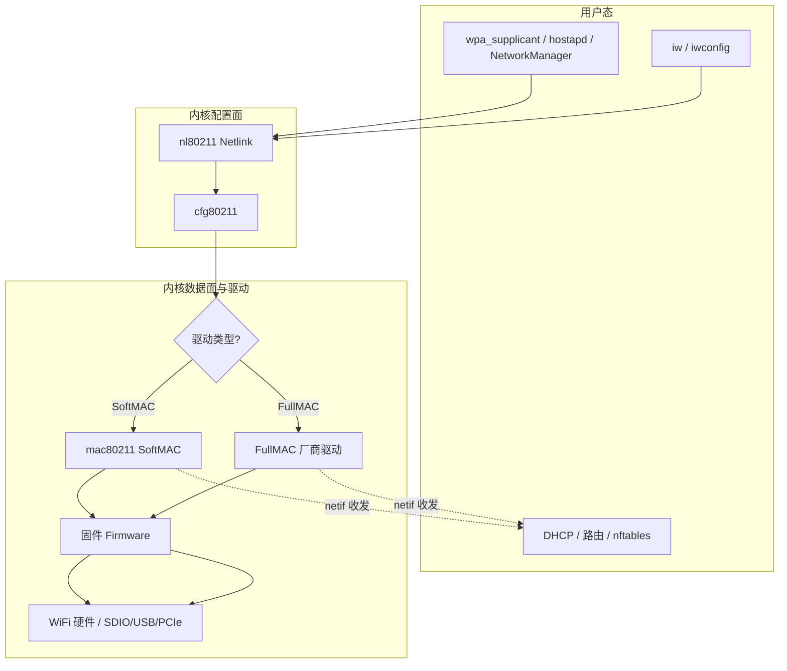
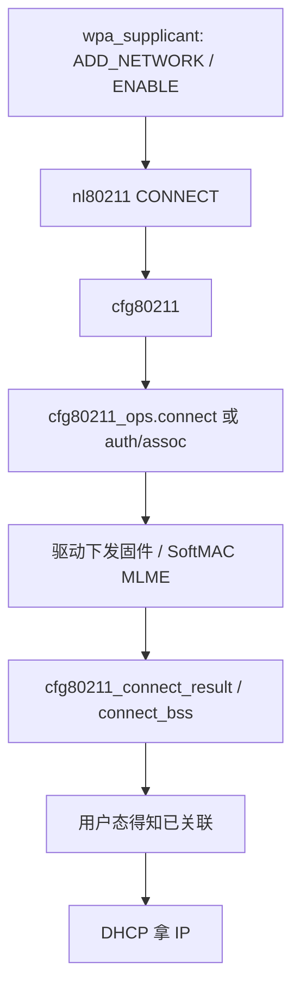

# 嵌入式 Linux WiFi 框架完整篇：从 cfg80211、mac80211 到 wpa_supplicant

板子上插一块 WiFi 模组，用户态敲 `iw` / `wpa_supplicant`，内核里却常常分不清：**nl80211、cfg80211、mac80211、厂商驱动、固件**各自干啥。排障时「扫不到 AP」「连上没 IP」「吞吐只有几 Mbps」，也说不清卡在哪一层。

本文按嵌入式常见路径，把 **Linux WiFi 软件栈**从用户态到硬件串成一条完整链路，覆盖 FullMAC / SoftMAC、扫描关联、数据收发、rfkill、设备树与调试手段，读完应对照源码与 `iw` 自己验证。

## 源码锚点

| 路径 | 作用 |
|------|------|
| `include/net/cfg80211.h` | `struct cfg80211_ops`、`wiphy_new`、`cfg80211_connect_*` |
| `net/wireless/` | cfg80211 核心、nl80211 |
| `include/net/mac80211.h` | SoftMAC：`struct ieee80211_ops`、`ieee80211_register_hw` |
| `net/mac80211/` | SoftMAC：MLME、聚合、速率控制协作 |
| `include/uapi/linux/nl80211.h` | 用户态 ↔ 内核 Netlink 属性 |
| `include/linux/ieee80211.h` | 802.11 帧头、能力位 |
| `include/linux/rfkill.h` | 射频开关统一框架 |
| `Documentation/networking/mac80211*` / wireless | 内核文档 |

注册 SoftMAC 网卡（概念）：

```c
/* include/net/mac80211.h */
struct ieee80211_hw *ieee80211_alloc_hw(size_t priv_data_len,
					const struct ieee80211_ops *ops);
int ieee80211_register_hw(struct ieee80211_hw *hw);
```

FullMAC / cfg80211 直连（概念）：

```c
/* include/net/cfg80211.h */
struct wiphy *wiphy_new(const struct cfg80211_ops *ops, int sizeof_priv);
int wiphy_register(struct wiphy *wiphy);
```

## 先建立分层：谁管配置，谁管收发包



**一句话**：

- **cfg80211 + nl80211**：统一「配置面」——扫描、关联、密钥、AP 模式、监管域。
- **mac80211**：SoftMAC 芯片由内核做大部分 802.11 MAC；驱动实现 `ieee80211_ops`（收发、队列、密钥等）。
- **FullMAC**：MAC 多在固件；驱动主要实现 `cfg80211_ops`，把配置下到固件，并把网卡挂到网络栈。

嵌入式模组（如多数 SDIO WiFi）**FullMAC 居多**；部分 USB/PCIe 芯片走 SoftMAC。看驱动是否调用 `ieee80211_register_hw` 还是只 `wiphy_register` 即可判断。

## 调用链：从「连热点」到硬件

### 配置面：关联 AP



成功/失败必须回调：`cfg80211_connect_result()` / `cfg80211_connect_bss()` / `cfg80211_connect_timeout()`（见 `cfg80211.h` 注释约定）。驱动只「发出去不回报」会导致用户态一直卡住。

### SoftMAC 数据面（示意）

```text
上层 IP 包 → netdev → mac80211 封装 802.11
  → ieee80211_ops.tx → 驱动 DMA/总线 → 射频

接收：硬件中断/NAPI → 驱动上报 → ieee80211_rx*
  → mac80211 解密/重组 → netif_receive_skb
```

### FullMAC 数据面（示意）

```text
netdev.ndo_start_xmit → 驱动封装厂商协议 → SDIO/USB 写固件队列
固件完成 802.11；RX 路径反向，驱动把以太网帧交给协议栈
```

## 重点知识

### 1. cfg80211_ops：配置面契约

`struct cfg80211_ops`（`include/net/cfg80211.h`）是驱动向 cfg80211 注册的后端。嵌入式最常碰到：

| 回调（概念） | 作用 |
|--------------|------|
| `scan` | 扫描；完成后 `cfg80211_scan_done` |
| `connect` / `disconnect` | SME 连接（FullMAC 常见） |
| `auth` / `assoc` | 拆分认证关联（部分驱动） |
| `add_key` / `del_key` / `set_default_key` | WPA/WPA2/WPA3 密钥 |
| `start_ap` / `stop_ap` | AP / SoftAP |
| `set_wiphy_params` | RTS、分片等 |
| `set_power_mgmt` | 省电 |

驱动必须先 `wiphy_new` → 填能力（频段、cipher、interface modes）→ `wiphy_register`，再创建 `wireless_dev` / netdev。

### 2. mac80211 与 ieee80211_ops

SoftMAC 驱动实现 `ieee80211_ops`：`start`/`stop`、`tx`、`add_interface`、`config`、`bss_info_changed`、`set_key`、`ampdu_action` 等。  
mac80211 负责：beacon 处理、关联状态机、聚合、速率控制协作、与 cfg80211 对接。

注册：`ieee80211_alloc_hw` → 填 `hw->wiphy` 能力 → `ieee80211_register_hw`。

### 3. nl80211 与用户态工具

| 工具 | 角色 |
|------|------|
| `iw` | 直接 nl80211：scan、link、reg、info |
| `wpa_supplicant` | STA：扫描、WPA、漫游、与 DHCP 协作 |
| `hostapd` | AP |
| NetworkManager / connman | 桌面/发行版集成 |

调试先确认内核侧：`iw dev`、`iw phy`，再查用户态配置，避免「驱动没起来却调 wpa」。

### 4. Interface 模式与并发

`NL80211_IFTYPE_STATION` / `AP` / `MONITOR` / `P2P_*` 等。嵌入式常要 **STA+AP 并发**（手机热点同理），取决于固件/驱动是否声明组合能力（`interface_combinations`）。能力不够会出现「开 SoftAP 后 STA 掉线」。

### 5. 监管域 Regulatory

频段、功率受国家码约束。`iw reg get` / `iw reg set CN`；设备树或驱动也可带默认 regdomain。错误监管会导致「扫不到 5G」或非法信道。

### 6. rfkill

`rfkill` 统一软/硬射频开关。`rfkill list`；硬开关（机身拨码）会 block WiFi。现象：驱动加载了但 `iw` 扫描失败、日志有 rfkill。

### 7. 总线与固件（嵌入式痛点）

| 总线 | 关注点 |
|------|--------|
| SDIO | 时钟、电源时序、MMC 控制器、`mmc` 报错 |
| USB | 电流、hub、固件加载超时 |
| PCIe | ASPM、BAR、MSI |

固件路径通常 `/lib/firmware/...`；缺失则 probe 失败。看 `dmesg` 中 `Direct firmware load ... failed`。

设备树示例要素（概念）：兼容字符串、`interrupt`、`vmmc`/`vqmmc` 电源、`pinctrl`、校准数据分区。

### 8. 安全与加密

WPA2-PSK / WPA3-SAE 密钥下发走 `add_key`；PMF、SAE 依赖驱动/固件能力位。嵌入式旧模组常「能连 WPA2、不能 WPA3」。

### 9. 性能与省电

- **吞吐**：聚合 AMPDU、总线带宽、CPU 软中断、`txqueue`。
- **延迟**：省电 PS / uAPSD 会换延迟；产线测吞吐时常关省电。
- **天线 / 校准**：校准数据错误 → RSSI 差、易掉线。

### 10. 排障路径

| 现象 | 先查 |
|------|------|
| 无 wlan0 | probe、固件、设备树、rfkill |
| 扫不到 AP | 监管域、天线、区域、驱动 scan 回调 |
| 关联失败 | 密钥、超时回调、固件崩溃 |
| 有 link 无 IP | 上层 DHCP/网络命名空间，非 WiFi MAC |
| 吞吐差 | 总线、省电、干扰、信道宽 |

常用命令：

```bash
dmesg | grep -iE 'wlan|firmware|cfg80211|brcm|nl80211'
ip link; iw dev; iw phy
rfkill list
iw dev wlan0 scan | head
iw dev wlan0 link
cat /sys/kernel/debug/ieee80211/*/stations/*/rc_stats 2>/dev/null  # SoftMAC 示例
```


---

> 成稿：`articles/csdn-merged/嵌入式Linux-WiFi框架完整篇.md`
