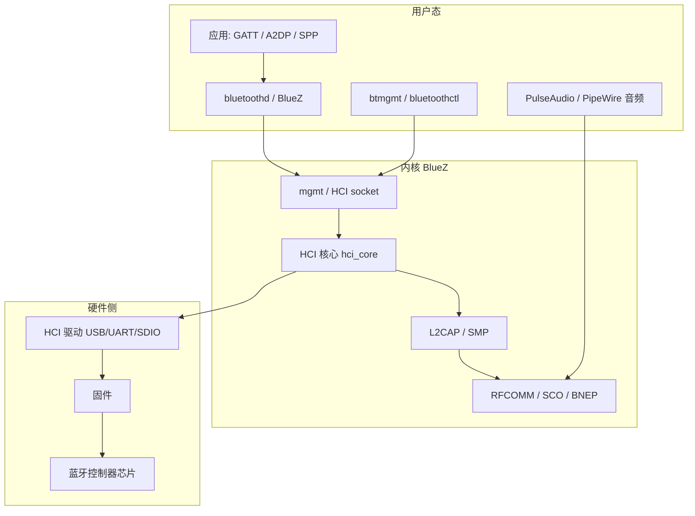
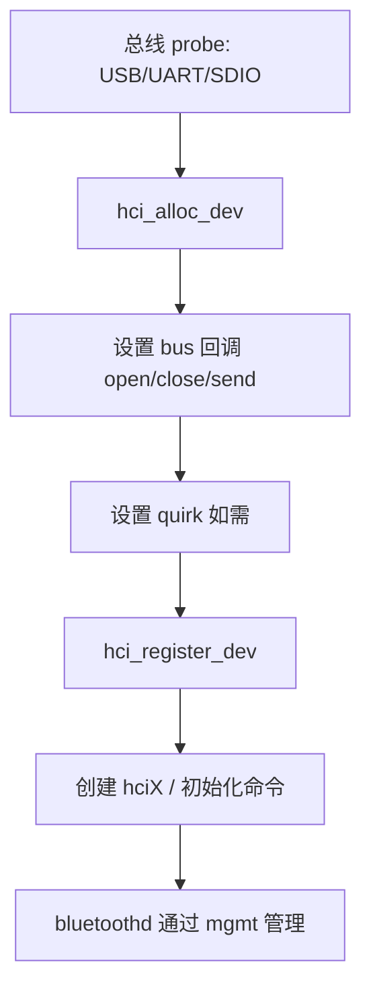
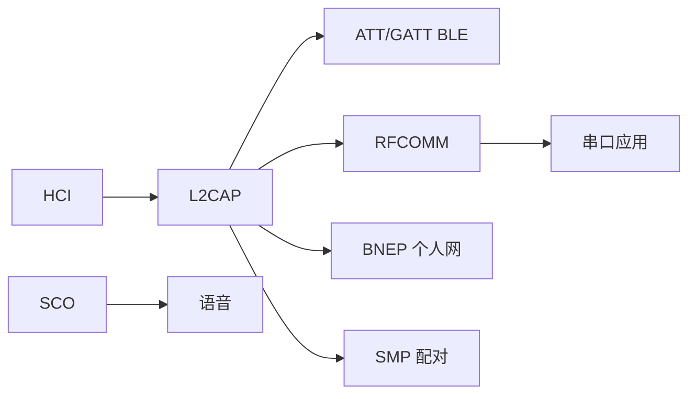

# 嵌入式 Linux 蓝牙框架完整篇：从 HCI、L2CAP 到 BlueZ 用户态

嵌入式产品里蓝牙常和 WiFi 共用一颗 combo 芯片。现象却很碎：能扫到手机、连不上；A2DP 有声无控；BLE 广播正常但 GATT 读失败。根因往往不在「蓝牙协议本身」，而在 **Linux BlueZ 分层**：硬件/固件 → HCI 驱动 → 内核协议（L2CAP/RFCOMM/SCO）→ 用户态 `bluetoothd` / D-Bus。

本文把 **嵌入式 Linux 蓝牙栈**从芯片到应用串清楚，覆盖经典蓝牙与 BLE、HCI 命令事件、套接字类型、mgmt、音频与排障，读完能对照 `btmon` 与内核路径定位问题落在哪一层。

## 源码锚点

| 路径 | 作用 |
|------|------|
| `include/net/bluetooth/hci_core.h` | `struct hci_dev`、`hci_alloc_dev`、`hci_register_dev` |
| `include/net/bluetooth/hci.h` | HCI 命令/事件、quirk |
| `include/net/bluetooth/bluetooth.h` | `bt_sock`、协议注册 |
| `include/net/bluetooth/l2cap.h` | L2CAP 信道 |
| `include/net/bluetooth/rfcomm.h` | 串口仿真 RFCOMM |
| `include/net/bluetooth/sco.h` | 同步语音链路 |
| `include/net/bluetooth/mgmt.h` | 用户态管理接口（mgmt） |
| `net/bluetooth/` | BlueZ 内核：hci_core、l2cap、smp 等 |
| `include/linux/rfkill.h` | 射频开关（与 WiFi 共用） |

控制器注册（概念）：

```c
/* include/net/bluetooth/hci_core.h */
struct hci_dev *hci_alloc_dev(void);
int hci_register_dev(struct hci_dev *hdev);
```

驱动在 probe 里分配 `hci_dev`，填 `open`/`close`/`send` 等总线回调，设必要 **quirk**（`hci.h`），再 `hci_register_dev`。之后内核出现 `hci0`。

## 分层总览：别把 HCI 和「蓝牙应用」混为一谈



**HCI（Host Controller Interface）**：主机（Linux）与控制器（芯片+固件）之间的标准命令/事件/ACL/SCO 数据通道。  
Linux 侧「蓝牙驱动」多数是 **把某总线收发适配成 HCI**，真正 802.15 风格跳频在控制器固件里。

## 调用链

### 控制器上线



### 经典连接（示意：SPP / RFCOMM）

```text
应用 connect RFCOMM
  → 内核 RFCOMM → L2CAP → HCI ACL
      → 驱动 send → 控制器
反向：控制器事件/ACL → hci_recv_frame → 协议栈 → socket
```

### BLE GATT（示意）

```text
用户态/bluetoothd
  → ATT over L2CAP (LE credit / fixed CID)
      → HCI LE ACL
          → 控制器链路层
安全：SMP 配对密钥；内核 smp 与用户态策略协作
```

## 重点知识

### 1. `hci_dev`：控制器在内核的实体

`struct hci_dev`（`hci_core.h`）保存：

- 名称、总线类型、厂商特征
- 命令队列、连接哈希、统计 `hci_dev_stats`
- 回调：向控制器发帧、打开关闭传输

用户态看到的 `hci0` 对应一个已注册的 `hci_dev`。  
`hciconfig`（旧）/ `btmgmt info` / `bluetoothctl list` 都围绕它。

### 2. HCI 三种流量

| 类型 | 作用 |
|------|------|
| **Command / Event** | 主机下命令、控制器回事件（复位、查特性、建链） |
| **ACL** | 异步数据（L2CAP 承载） |
| **SCO / eSCO** | 同步语音（通话、部分 headset） |

调试神器：**`btmon`** 抓 HCI 层，相当于蓝牙的 tcpdump。关联失败先看是命令超时、认证失败还是 ACL 断开。

### 3. 传输驱动（嵌入式最常见）

| 总线 | 典型场景 | 注意 |
|------|----------|------|
| **USB** | USB 蓝牙 dongle、部分模组 | 电流、固件、reset |
| **UART / H4 / H5 / BCSP** | 模组接 SoC UART | 波特率、流控、串口 DMA |
| **SDIO** | WiFi/BT combo | 与 WiFi 共存、共享晶振/天线、固件组合 |

UART 蓝牙经典坑：波特率与固件约定不一致 → `hci_register` 后初始化命令超时。  
Combo 芯片：WiFi 驱动与 BT 驱动**加载顺序、共享管脚、rfkill** 要一起看。

### 4. 协议栈：L2CAP 以上



- **L2CAP**：信道复用、分片重组；BLE 上承载 ATT。
- **RFCOMM**：仿串口，Android SPP、很多工控透传。
- **BNEP**：蓝牙个人区域网（较少用于现代手机互联）。
- **SCO**：语音；音频音乐更多走 **A2DP**（用户态配置 + 内核支持）。
- **SMP**：LE 安全配对。

套接字：`AF_BLUETOOTH` + `BTPROTO_L2CAP` / `RFCOMM` / `HCI` / `SCO` 等（见 `bluetooth.h` 注册路径）。

### 5. 用户态 BlueZ

现代发行版：

- **`bluetoothd`**：守护进程，经 **D-Bus** 暴露适配器/设备/GATT API。
- **`bluetoothctl`**：交互式控制。
- **`btmgmt`**：更贴近内核 mgmt 命令。

嵌入式裁剪根文件系统时缺 `bluetoothd` 或 D-Bus 策略，会出现「内核有 hci0，用户态扫不到」。

### 6. 经典蓝牙 vs BLE

| | 经典 BR/EDR | BLE |
|--|-------------|-----|
| 功耗 | 较高 | 低 |
| 典型 | 音频、SPP、HID 旧设备 | 传感器、Beacon、GATT |
| 主机关注 | RFCOMM/A2DP/SCO | ATT/GATT、广播、连接间隔 |

同一控制器可双模；能力由 HCI Read Local Supported Features / LE features 事件报告。

### 7. 配对、绑定与权限

配对产生密钥，绑定后免重复输入。失败常见：

- 双方 IO 能力不匹配（NoInputNoOutput vs DisplayYesNo）
- Secure Connections / MITM 策略过严
- 旧设备不支持 LE Secure Connections

内核 SMP + 用户态 agent（`bluetoothctl` agent）共同完成。产线常用「预绑定」或固定 PIN（安全性差，仅工控）。

### 8. 音频路径（嵌入式易踩坑）

- **HFP/HSP**：通话，偏 SCO。
- **A2DP**：音乐；编解码 SBC/AAC/aptX 取决于用户态与对端。
- 与 **PulseAudio / PipeWire / ALSA** 集成；内核只提供链路，**策略与编解码在用户态**。

只有 `hci0` 没有音频框架插件 → 「能连耳机无声音」。

### 9. rfkill 与共存

`rfkill list` 中 Bluetooth 被 soft/hard block 会导致适配器 down。  
WiFi/BT 共存：天线隔离、固件共存算法、同模组 SDIO 时序；WiFi 高吞吐时 BT 音频卡顿不一定是 BlueZ bug。

### 10. 调试与观测

```bash
dmesg | grep -iE 'bluetooth|hci|firmware|tty.*bt'
hciconfig -a 2>/dev/null; btmgmt info
rfkill list
bluetoothctl show; bluetoothctl devices
# 抓 HCI（需权限）
btmon
# 内核配置：CONFIG_BT、CONFIG_BT_HCIUART、CONFIG_BT_HCIBTUSB 等
```

| 现象 | 方向 |
|------|------|
| 无 hci0 | 总线 probe、固件、UART 波特率、设备树 |
| hci0 在但 up 失败 | rfkill、初始化命令超时、quirk |
| 扫不到设备 | 天线、区域、扫描参数、被 block |
| 能配对不能连配置文件 | SDP/GATT 用户态、权限、UUID |
| BLE 连接秒断 | 连接间隔、监督超时、供电、干扰 |
| 音频无声 | Pulse/PipeWire、编解码、profile |

## Checklist

- [ ] 能区分：HCI 驱动、内核协议栈、bluetoothd 用户态三层职责
- [ ] 知道 `hci_alloc_dev` → `hci_register_dev` 后才有 `hci0`
- [ ] 会用 `btmon` 看命令超时还是链路断开
- [ ] 清楚 RFCOMM/L2CAP/SCO 各自典型用途
- [ ] UART 蓝牙查过波特率与固件；combo 查过与 WiFi 共存/rfkill
- [ ] 根文件系统确认 D-Bus + bluetoothd（若用 BlueZ 标准栈）
- [ ] 音频问题先查用户态 profile，再查 SCO/A2DP 链路

---

> 成稿：`articles/csdn-merged/嵌入式Linux-蓝牙框架完整篇.md`
