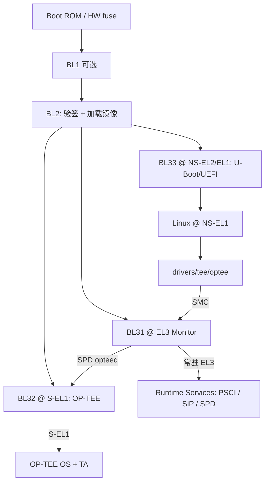
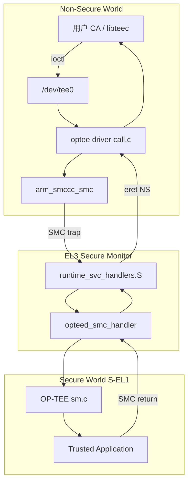
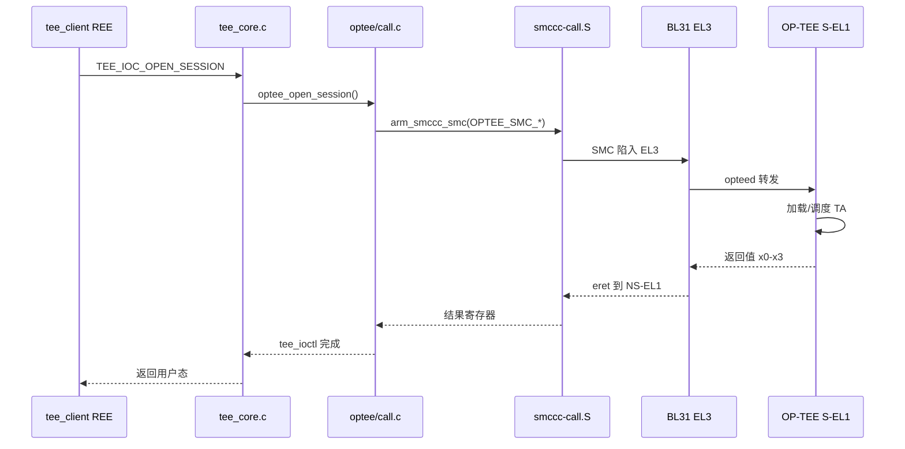

# ATF / TEE / REE 与 ARM 异常级别 EL 安全体系完整篇：TrustZone 硬件到 SMC 进 OP-TEE 的全链路

板子上开了 TrustZone，`dmesg` 却找不到 `/dev/tee0`；CA 调 `TEEC_InvokeCommand` 返回 `0xFFFF0006`；SMC 在 EL3 直接 panic——根因往往不在应用层，而在 **NS/S 世界划分、TZASC 内存隔离、TF-A BL31 调度、GIC Group 路由** 没对齐。本文从 SoC 硬件安全组件讲起，经 TF-A 启动链、EL0–EL3 特权模型，追到 Linux `drivers/tee/` → SMC → BL31 → OP-TEE → TA 的完整路径，并覆盖中断分流、设备树 binding 与现场排障。与《嵌入式安全完整篇》侧重 Secure Boot/IMA 互补：本篇专注 **TrustZone + ATF + TEE 运行时架构**。

## 源码锚点

| 路径 | 作用 |
|------|------|
| `arm-trusted-firmware/bl1/` | 首级 Bootloader（部分平台 ROM 直跳 BL2） |
| `arm-trusted-firmware/bl2/` | 加载 BL31/BL32/BL33 镜像、证书验签 |
| `arm-trusted-firmware/bl31/bl31_main.c` | EL3 Monitor 入口、runtime service 注册 |
| `arm-trusted-firmware/bl31/aarch64/runtime_svc_handlers.S` | SMC 陷入 EL3 的汇编入口 |
| `arm-trusted-firmware/services/spd/opteed/` | OP-TEE Secure Payload Dispatcher |
| `arm-trusted-firmware/services/std_svc/psci/` | PSCI（CPU ON/OFF/SUSPEND） |
| `arm-trusted-firmware/plat/<vendor>/<soc>/` | 平台 TZC/TZPC/GIC/DRAM 布局 |
| `arm-trusted-firmware/docs/design/firmware-design.rst` | BL 阶段官方设计说明 |
| `optee_os/core/arch/arm/kernel/thread_a64.S` | Secure world 线程切换 |
| `optee_os/core/arch/arm/sm/sm.c` | OP-TEE 侧 SMC 处理入口 |
| `optee_os/core/tee/entry_std.c` | 标准 SMC 命令分发 |
| `optee_client/libteec/src/tee_client_api.c` | GlobalPlatform TEE Client API |
| `linux/drivers/tee/tee_core.c` | TEE 子系统核心、`/dev/tee*` |
| `linux/drivers/tee/optee/call.c` | OP-TEE 驱动 SMC 封装 |
| `linux/drivers/tee/optee/optee_smc.h` | OP-TEE SMC function ID 定义 |
| `linux/Documentation/devicetree/bindings/tee/linaro,optee-tz.yaml` | 传统 OP-TEE 设备树 binding |
| `linux/Documentation/devicetree/bindings/firmware/arm,ffa.yaml` | FF-A 固件接口 binding |
| `linux/arch/arm64/include/asm/exception.h` | EL 切换、异常向量相关 |
| `linux/arch/arm64/kernel/smccc-call.S` | 内核发起 SMC/HVC 的封装 |
| `linux/include/linux/arm-smccc.h` | SMCCC 调用约定宏 |

常用观测命令：

```bash
# REE 侧
ls -l /dev/tee* /dev/teepriv*
dmesg | grep -iE 'optee|tee|smc|ffa'
cat /sys/firmware/optee/uefi/mode 2>/dev/null
modinfo optee

# 设备树（运行态或反编译）
fdtdump /sys/firmware/fdt 2>/dev/null | grep -A5 optee
dtc -I fs -O dts /sys/firmware/fdt 2>/dev/null | grep -E 'optee|ffa|reserved-memory'

# OP-TEE 测试（需 tee-supplicant）
tee-supplicant &
xtest -l 15
```

GlobalPlatform Client API 最小调用骨架：

```c
TEEC_Context ctx;
TEEC_Session sess;
TEEC_Operation op;
TEEC_Result res;

res = TEEC_InitializeContext(NULL, &ctx);
res = TEEC_OpenSession(&ctx, &sess, &uuid,
                       TEEC_LOGIN_PUBLIC, NULL, NULL, &origin);
memset(&op, 0, sizeof(op));
op.paramTypes = TEEC_PARAM_TYPES(TEEC_MEMREF_TEMP_INPUT,
                                 TEEC_NONE, TEEC_NONE, TEEC_NONE);
res = TEEC_InvokeCommand(&sess, CMD_TEST, &op, &origin);
TEEC_CloseSession(&sess);
TEEC_FinalizeContext(&ctx);
```

## 调用链

### TF-A 冷启动到 Linux + OP-TEE 驻留



### REE 进 TEE 与 EL / 世界切换



### Linux 发起 SMC 的内核时序



## 重点知识

### TrustZone 硬件：Secure / Non-Secure 与世界边界

嵌入式 Linux 上跑支付、DRM 密钥、设备身份、OTA 验签私钥时，**REE（Rich OS，通常是 Linux）** 攻击面太大：任意内核漏洞、恶意驱动、物理 DMA 都可能读到明文密钥。ARM TrustZone 在硬件上切分出 **Secure World** 与 **Non-Secure World**，让敏感计算与密钥材料只在 Secure 侧可见；REE 只能通过受控网关（SMC）请求服务，不能直接 mmap Secure DRAM。

TrustZone 不是加密加速器，而是 **隔离与访问控制** 机制：CPU、总线、部分外设、DRAM 区域都可带 NS 属性。理解后续 TZASC/TZPC、EL3 Monitor、OP-TEE，都建立在这个边界上。

| 概念 | 含义 |
|------|------|
| **Non-Secure (NS)** | 普通 Rich OS、应用、大部分驱动；内存访问带 NS=1 |
| **Secure (S)** | TEE OS（OP-TEE）、TA、部分 EL3 固件关联逻辑；NS=0 |
| **世界切换** | 通过 SMC 进入 EL3 Monitor，Monitor 改 SCR_EL3.NS 等状态后 eret 到目标世界 |
| **同核复用** | 同一物理 CPU 在某一时刻只属于一个世界；切换时保存/恢复上下文 |

软件上常把 **REE = NS 世界的 Rich Execution Environment**（Linux + user space），**TEE = Secure 世界的 Trusted Execution Environment**（OP-TEE + TA）。BL31 运行在 EL3，是 **Monitor**，负责在两个世界之间仲裁，不完全等同于 Secure World 里的应用。

ARMv8-A 中，处理器、MMU/TLB、缓存、总线主端口都会携带 **Non-secure bit**。当 CPU 处于 NS 状态访问被标记为 Secure 的内存或寄存器时，硬件应返回 **abort** 而非静默泄露——这是 TZASC 与 MMU 阶段配合的基础。在 EL3，`SCR_EL3.NS` 决定 **eret 返回后** 处理器进入 NS 还是 S 视图；BL31 在处理完 OP-TEE 的 SMC 后，根据调用来源与返回目标设置该位，再执行 eret 回到 Linux（NS-EL1）。

Cortex-M 的 **IDAU/SAU** 是 TrustZone-M 另一套地址划分，与 A 核 TZASC 概念类似但寄存器完全不同。STM32MP1 **A7 + M4** 异构时，M4 侧 TrustZone-M 与 A 核 OP-TEE 通过 **resource table / mailbox** 协作，不要混用寄存器说明。

现场判断 TrustZone 是否生效：

```bash
grep -i optee /proc/devices
dmesg | grep -iE 'smccc|psci|optee'
```

若 ROM 未 fuse TrustZone、或 BL2 未加载 BL32，硬件能力存在但 **TEE 运行时缺席**——这与「TZ 未开」是不同层面的问题。

### TZASC、TZPC 与内存 / 外设隔离

DRAM 控制器与 CPU 之间往往还有 **NIC-400 / NIC-301** 等互连，TZASC 挂在物理地址解码路径上：当 NS master（Linux DMA、CPU NS 访问）试图读写 Secure-only region 时，总线层直接 **SLVERR/DECERR**，不会落到 OP-TEE MMU 才拒绝——这是硬件第一道防线。OP-TEE 自身 MMU 是 Secure 侧第二道：即使 TZASC 配错允许 NS 读 Secure PA，OP-TEE 仍可用 **S-EL1 页表** 限制 TA 可见范围，但不应依赖软件补救硬件配错。

平台初始化典型调用链（以 TZC-400 为例，名称因 plat 而异）：

```
BL2 plat_arch_setup()
  └── tzc400_init()
        ├── tzc400_disable_filters()
        ├── tzc400_configure_region(0, ... )  /* 通常 region0 覆盖全空间默认拒绝 */
        ├── tzc400_configure_region(n, base, top, SECURE_ONLY)
        └── tzc400_enable_filters()
```

OP-TEE **`core/arch/arm/plat-*/main.c`** 可能在 **`init_primary_helper`** 里再次确认 TZC 与 **`CFG_TEE_RAM_START`** 一致。若 BL2 把 OP-TEE 加载地址划在 NS 可访问区，启动早期就会 data abort。

**TZPC** 作用在外设端口：例如某 UART 或 TRNG 的 APB 从端口带 **NSACCESS** 信号，TZPC 寄存器决定该端口对 NS 是否可见。与 TZASC 正交：**TZASC 管 PA 段，TZPC 管设备端口**。MPC/PPC 是 AMBA-5 体系下更细粒度的命名，思路上仍属于「内存侧 / 外设侧」两类隔离。

i.MX8 系列常见 **`plat_tzc380.c`**；Rockchip **`rk3399`** 在 **`plat/rk3399/drivers/soc/soc.c`** 附近配置 trustzone；STM32MP1 有 **`stm32mp1_syscfg.c`** 配合 ETZPC。读代码时搜 **`tzc`/`tzpc`/`etzpc`** 关键字，不要假设所有 SoC 都用 TZC-400 IP。

**TZASC（TrustZone Address Space Controller）** 在 **DRAM 物理地址空间** 上划窗口，规定某段 PA 仅 Secure 可访问、或 Secure/NS 均可访问但属性不同。典型场景：OP-TEE 核心与 TA 堆必须在 Secure-only 区域；Linux 普通 DMA 缓冲区在 NS 区域。

| 要点 | 说明 |
|------|------|
| Region 配置 | 按 **region** 配置起止地址与权限；region 数量与对齐粒度 **因 SoC 而异** |
| 初始化时机 | 通常在 **BL2/BL31 平台代码** 或 OP-TEE 早期初始化完成，Linux 不应随意改 TZASC |
| 配错表现 | Linux heap 放到 Secure-only 区 → data abort 或 hang；OP-TEE 区被 NS 踩 → TEE 随机崩溃 |

**不要编造寄存器细节**：各厂商 TZASC 寄存器名、region 索引不统一。读 **`plat/<vendor>/`** 下 `plat_tzc400.c`、`plat_tzc380.c` 等平台文件，不要凭记忆写固定 MMIO 地址。

| 组件 | 典型作用 |
|------|----------|
| **TZASC / TZC-400** | DRAM 区域 S/NS 访问控制 |
| **TZPC** | 外设或 APB 从设备 S/NS 划分；配合 decprotnset 类信号 |
| **MPC** | AMBA 系统上类似 TZASC 的内存保护单元 |
| **PPC** | 外设端口保护 |

Boot 链早期会把 **UART、SDHCI、Crypto 引擎** 等划给 NS 或 S。Linux 驱动只能访问 NS 外设；若某 crypto 引擎被划为 Secure-only，REE 里不应再出现对应 platform driver，而应通过 TEE TA 间接调用。

STM32MP、i.MX、Rockchip、Amlogic 等平台在 TF-A `plat/` 目录下都有 **trustzone 初始化** 文件，命名可能是 `stm32mp1_tz.c`、`rk3399_pm_ops.c` 等——以具体 SoC 为准。

排障 TZASC 相关 abort：

```bash
# 对比 TF-A 与 OP-TEE 内存布局文档
grep -r 'TZC\|TZASC\|DRAM' arm-trusted-firmware/plat/<soc>/
grep -r 'CFG_TEE_RAM\|CFG_TA_RAM' optee_os/core/arch/arm/plat-<soc>/
```

U-Boot `fdt` 里 **`reserved-memory`** 必须与 TZASC region 一致；NS Linux 不能占用 Secure-only PA。

### REE 与 TEE：职责、边界与 tee-supplicant

边界原则可以概括成一句话：**REE 编排业务与 I/O，TEE 保管密钥与敏感原语**。CA（Client Application）跑在 REE user space，通过 GlobalPlatform Client API 发请求；TA 跑在 S-EL1，通过 Internal API 访问 crypto、storage、OTP。REE 内核 **never** 直接读 Secure 物理页；它只能通过 **`/dev/tee0` ioctl** 触发 world switch，让 OP-TEE 在 Secure 侧代劳。

| 能力 | REE 典型做法 | TEE 典型做法 |
|------|-------------|-------------|
| AES 加解密 | 调 TA，密钥不出 Secure | TA 内 `TEE_AllocateTransientObject` |
| 设备唯一密钥 | 只拿公钥/证书 | HUK 派生，PTA 导出受限 |
| 文件加密 | 文件在 ext4，密钥在 TEE | Secure Storage object |
| OTA | 验签在 REE（dm-verity） | 可选：TA 验签 bootloader 参数 |

**tee-supplicant** 与内核 **`optee/rpc.c`** 配合：OP-TEE 返回 **`OPTEE_SMC_RETURN_RPC`** 时，驱动唤醒 supplicant 处理 **`OPTEE_RPC_CMD_LOAD_TA`**、**`FS`**、**`SHM`** 等命令。内核路径 **`optee_rpc_cmd`** → 用户态 **`tee_supplicant`** → 读 **`/lib/optee_armtz/*.ta`** 或 socket。systemd 单元通常 **`After=multi-user.target`**，若 CA 在 supplicant 前启动会 **`TEEC_ERROR_BAD_STATE (0xFFFF0006)`**。

**REE（Rich Execution Environment）** 指 NS 世界里的「完整 Rich OS」栈：

| 层次 | 典型软件 |
|------|----------|
| User | 银行 App、CA（libteec）、tee-supplicant |
| Kernel | Linux、optee 驱动、普通设备驱动 |
| Boot | U-Boot / UEFI（BL33） |
| 可选 | KVM Hypervisor @ NS-EL2 |

REE 负责 UI、网络、文件系统、通用驱动；**不应**持有长期明文 DRM key、设备唯一私钥。REE 可以发起 TEE 会话，让 TA 在 Secure 内存里完成加解密签名，只返回结果或句柄。

**TEE（Trusted Execution Environment）** 是 Secure 世界里的执行环境，常见实现为 **OP-TEE OS（BL32 @ S-EL1）**：

| 组件 | 说明 |
|------|------|
| **OP-TEE core** | 调度、MMU、IPC、crypto 框架 |
| **TA（Trusted Application）** | 签名 ELF，UUID 标识，类似 Secure 侧「进程」 |
| **PTA** | Pseudo-TA，内核态 TA，提供设备密钥等 |
| **Secure driver** | 访问 Secure 外设或 on-chip OTP |

TEE 提供 **隔离、证明（attestation）、安全存储**；GlobalPlatform TEE Internal Core API 定义 TA 编程模型。TA 与 CA 之间通过 **共享内存 + 命令 ID** 传参，参数类型由 `TEEC_ParamTypes` 编码。

**tee-supplicant** 是 REE 用户态守护进程：OP-TEE 需要 fopen、RPC 到 REE 加载 TA 文件、socket 等 **Rich OS 服务** 时，通过 supplicant 完成。没有 supplicant，`TEEC_OpenSession` 可能挂起或失败。

```bash
# 确认 supplicant 运行
pgrep -a tee-supplicant
systemctl status tee-supplicant.service

# TA 安装路径
ls /lib/optee_armtz/
```

与 TPM / SE 的关系：TPM **`/dev/tpm0`** 在 REE；TEE sealed storage 可绑定 PCR。**ATECC608** 等 SE 经 I2C + PTA 发 APDU，私钥 never export。典型产品：**DRM**（Widevine TA）、**IoT 身份**（HUK → PTA → 设备 cert）、**支付**（PIN 在 TA 校验）。

### TF-A BL 启动链、FIP 与各阶段职责

BL 命名来自 ARM **Boot Loader stage** 约定，并非所有平台都实现 BL1。许多 SoC **Boot ROM → BL2** 直链：ROM 验签 BL2 后把 CPU 留在 EL3 或 S-EL1，由 BL2 完成 DDR training、TrustZone 初始化、镜像加载。BL2 结束时通过 **`bl2_run_next_image()`** 依次跳转 BL31、注册 BL32 entry、再跳 BL33。

FIP 内部是 **UUID  tagged TOC（Table of Contents）** 条目，常见 UUID（见 `tools/fiptool/fiptool.c`）：

| UUID 名 | 内容 |
|---------|------|
| TB_FW_CONFIG | Trusted Boot 固件配置 |
| BL31 | EL3 Monitor 镜像 |
| BL32 | Secure Payload（OP-TEE） |
| BL33 | Non-secure Bootloader |
| SCP_BL2 | 部分平台 SCP 固件 |

打包示例：

```bash
make PLAT=fvp SPD=opteed BL32=tee-header_v2.bin BL32_EXTRA1=tee-pager_v2.bin \
     BL32_EXTRA2=tee-pageable_v2.bin BL33=bl33.bin all fip
```

OP-TEE 在 FIP 里常拆成 **header + pager + pageable** 三段，BL2 按 OP-TEE 头部 **`struct optee_header`** 解析 load address 与 size。U-Boot 打包 **`u-boot.itb`** 与 FIP 是两层：FIP 由 BL2 消费，FIT 由 BL33 消费。

**ARM Trusted Firmware-A（TF-A）** 是 ARMv8-A 开源参考固件，实现 **EL3 Secure Monitor**、PSCI、SiP 服务、Secure Payload 调度。商业板 BSP 里的 `bl31.bin`、`atf.bin` 通常即 TF-A 构建产物。

| 阶段 | 典型 EL | 职责 |
|------|---------|------|
| **BL1** | EL3/ROM | 部分平台存在：ROM 验签后跳 BL2；许多 SoC ROM 直载 BL2 |
| **BL2** | S-EL1 | 初始化 DDR、加载 BL31/BL32/BL33、验证证书链（Trusted Board Boot） |
| **BL31** | EL3 | 常驻 Monitor：PSCI、SMC 分发、world switch |
| **BL32** | S-EL1 | Secure Payload：**OP-TEE** 或 TEE OS |
| **BL33** | NS-EL1/EL2 | **U-Boot / UEFI / GRUB**，再链式加载 Linux |

**FIP（Firmware Image Package）** 常把 BL31/BL32/BL33 打在一个包里，BL2 解析：

```bash
fiptool info fip.bin
fiptool unpack fip.bin
# 确认 BL32（OP-TEE）条目非空
```

U-Boot 命令 `booti` 启动的 kernel 已是 NS 世界；OP-TEE 在 BL2 阶段已驻留 Secure RAM，不会随 Linux 再加载一次（除非 REE 动态 reload 场景，较少见）。

TF-A 与 OP-TEE、Linux 关系：

```
TF-A BL31  → EL3 Monitor，不替代 TEE
TF-A BL32  → 常部署 OP-TEE（也可其他 SPD）
OP-TEE     → TEE OS，处理 GP SMC
Linux      → REE，通过 optee 驱动 SMC 进 TEE
```

构建示例（以 RK3399 为例，具体平台名替换）：

```bash
make PLAT=rk3399 SPD=opteed BL32=optee BL33=u-boot.bin all fip
```

`bl31/bl31_main.c` 冷启动顺序：`bl31_setup` → `bl31_lib_init` → `runtime_svc_register` → `bl31_prepare_next_image_entry` → 进入 BL33。对照 **`docs/design/firmware-design.rst`** 「Cold boot」章节。

### Secure Boot 与 ATF 的交界

**Secure Boot** 解决「镜像是否被篡改」；**TrustZone** 解决「运行期隔离」。二者在 BL2 交汇：BL2 用 **ROTPK** 验签 BL31/BL32/BL33 证书。验签失败则不应跳转到恶意 BL31。

TF-A 中 **`auth/`**、`plat/common/tbb/` 等目录实现 Trusted Board Boot。U-Boot 侧 FIT 签名验证是 **BL33 之后** 的下一环，与 BL2 证书链不同层。排障「Linux 起不来」与「TEE 不存在」要分开：前者查 BL33/kernel；后者查 BL32 是否加载、DT 是否声明 optee。

| 环节 | 验证对象 | 失败表现 |
|------|----------|----------|
| BL2 TBB | BL31/BL32/BL33 证书 | 卡在 BL2，无串口 BL31 日志 |
| U-Boot FIT | kernel/dtb/initrd | U-Boot 拒绝 booti |
| OP-TEE TA 签名 | `.ta` 加载 | OpenSession 失败，origin=TEE OS |

Secure Boot 不自动保证 TEE 可用：即使 BL33 验签通过，若 **FIP 未含 BL32** 或 DT 无 optee 节点，Linux 仍无 `/dev/tee0`。产线流程常见：**fuse ROTPK → 写 HUK → 灌 `.ta` → xtest**。

与本文边界：Secure Boot 链式验签、IMA/EVM、dm-verity 等 REE 完整性机制另文详述；本篇只强调 **BL2 验签通过后 BL32 必须正确驻留**，且 **OP-TEE 版本与 kernel 驱动匹配**。

BL2 验签链在 TF-A 里由 **`auth_mod`** 驱动：**`auth_img_verify()`** 逐级验证书与哈希；**`TBBR_*`** 宏启用 Trusted Board Boot。ROT 公钥 hash 可 **fuse 到 OTP**，与 U-Boot **`CONFIG_FIT_SIGNATURE`** 使用的 key 不是同一层——后者保护 kernel 镜像，前者保护 BL31/BL32/BL33。现场若更换 OP-TEE 但未重签 FIP，BL2 阶段即失败，Linux 根本起不来，更谈不上 TEE 驱动 probe。

### EL0–EL3 特权级与 NS-EL1 / S-EL1 正交

ARMv8-A **Exception Level** 数值越高特权越大：

| EL | 典型软件 | 能力概要 |
|----|----------|----------|
| **EL0** | 用户态 App、CA | 无特权指令；通过 SVC 进内核 |
| **EL1** | Linux kernel、OP-TEE OS | MMU、大部分系统寄存器；NS/S 各有一套「EL1」 |
| **EL2** | Hypervisor（KVM、Xen） | 虚拟化扩展；管理 Guest EL1/EL0 |
| **EL3** | Secure Monitor（BL31） | 最高特权；SMC 目标；控制 SCR_EL3 |

**关键**：EL 与 World 是正交概念。**NS-EL1**（Linux）与 **S-EL1**（OP-TEE）特权级相同，但 NS bit 不同，可见内存与外设不同。

| 场景 | Linux 所在 | 说明 |
|------|------------|------|
| 嵌入式常见 | NS-EL1 | 无 KVM；BL33 直接 U-Boot → Linux |
| 虚拟化 | Guest NS-EL1，Host NS-EL2 | SMC 可能 trap 到 Host 再转发（复杂） |
| OP-TEE | S-EL1 | 与 Linux 同级不同世界 |

启用 KVM 时，Guest 里访问 TEE 需 **代理驱动**；多数嵌入式方案让 Linux 跑 Host EL2 或干脆不开 EL2。

读当前 EL（调试，需未锁 debug）：

```bash
# 内核态
grep -i el /proc/cpuinfo   # 仅 REE 视图
# 汇编
mrs x0, CurrentEL          # EL[3:2] = CurrentEL >> 2
```

**PSCI** 也走 SMC，由 BL31 `psci` 服务处理：`CPU_ON`、`CPU_OFF`、`SYSTEM_SUSPEND`。Secondary CPU 启动：Linux `cpu_up()` → PSCI SMC → BL31 让核从 secure 或 NS entry 启动，需与 OP-TEE **`CFG_BOOT_SECONDARY_REQUEST`** 等平台选项一致。若 CPU1 不起，查 **`dmesg psci`** 与 TF-A PSCI 日志，不要先怀疑 TA。

S-EL1 与 NS-EL1 的 **异常向量表独立**：Linux 在 **`entry.S`** 设 **`VBAR_EL1`**；OP-TEE 在 **`core/arch/arm/kernel/entry_a64.S`** 设 Secure **`VBAR_EL1`**。从 NS 发 SMC 进 EL3 再进 S-EL1 时，不会经过 Linux 的 **`el0_svc`** 路径——这是两条完全独立的 trap 路径。

**Hypervisor（EL2）** 存在时，**`HCR_EL2.TSC`** 可 trap SMC 到 EL2 由 KVM 模拟或转发；嵌入式无 EL2 时 SMC 直达 EL3。读 **`/sys/hypervisor/type`** 可知是否在 VM 内——Guest 内通常 **没有真 OP-TEE**，除非 Host 做 passthrough。

AArch32 兼容层（**`CONFIG_COMPAT`**）下，32 位 CA 仍通过 **`/dev/tee0`** ioctl，内核 **`compat_tee_ioctl`** 做结构体 padding 转换；OP-TEE 侧仍 AArch64 SMC，与 CA 位宽无关。

### 寄存器 bank、SCR_EL3 与世界切换控制

同一 EL 在不同世界访问 **同名系统寄存器** 时，硬件可能提供 **banked copy** 或 **因 NS 属性而 trap**：

| 寄存器 | 说明 |
|--------|------|
| **`VBAR_EL1`** | Linux 与 OP-TEE 各有独立向量基址 |
| **`TTBR*_EL1`** | 各自页表，Secure/Non-secure 转换表分离 |
| **`SCR_EL3`** | 仅 EL3 可写，控制 NS、IRQ/FIQ 路由到哪个世界 |
| **`SPSR_EL3` / `ELR_EL3`** | 保存 SMC 陷入前 NS-EL1 的 PSTATE 与返回 PC |

`SCR_EL3` 关键位（概念，以 ARM DDI 0406 为准）：

| 位 | 作用 |
|----|------|
| **NS** | 1=Non-secure，0=Secure；eret 后世界 |
| **IRQ/FIQ** | 控制中断在 Monitor 与 lower EL 间路由 |
| **EA** | 外部 abort 路由策略 |

SMC 陷入 EL3 时，`runtime_svc_handlers.S` 保存 NS 上下文到 **`cpu_context`** 结构；`opteed_enter_sp` 切换进 S-EL1 前再保存一份。返回时必须：

1. 恢复 NS-EL1 的 **`elr_el3`、`spsr_el3`** 等
2. 设置 **`SCR_EL3.NS = 1`**
3. **`eret`** 回到 Linux 被中断的指令流

OP-TEE 若 secure panic，BL31 可能无法干净返回，表现为 Linux **hard lockup** 或 RCU stall。调试时开 OP-TEE **`CFG_TEE_CORE_LOG_LEVEL`** 与 TF-A **`LOG_LEVEL`**。

读 **`/proc/cpuinfo`** 只能看到 REE 视图；OP-TEE 内部状态需 **OP-TEE core 日志** 或 JTAG（若 secure debug 未 fuse）。

### SVC、HVC、SMC 与 SMCCC 调用约定

| 指令 | 典型用途 | 陷入 EL |
|------|----------|---------|
| **SVC** | 用户态系统调用 → Linux kernel | EL1（NS） |
| **HVC** | 虚拟化 hypercall | EL2 |
| **SMC** | Secure Monitor 调用 | EL3 |

CA **不会**直接发 SMC；`libteec` → `ioctl(/dev/tee0)` → **optee 驱动** → `arm_smccc_smc()`。这是故意设计：内核可审计、可映射共享内存、可限制并发。

**ARM SMCCC** 规定 SMC 参数：

- **x0**：Function ID（含 bit[31:30] 实体类型：fast/standard/32-bit 等）
- **x1–x3**：参数
- **x4–x7**：额外参数或返回
- 返回：**x0** 为主返回值，OP-TEE 还用 x1–x3 传会话信息

Function ID 分区（概念）：

| 范围 | 所有者 |
|------|--------|
| Standard ARM 服务 | PSCI 等 |
| SiP Service | 硅厂自定义（DDR training、特殊时钟） |
| OEM | 板厂 |
| Trusted OS/TEE | OP-TEE fast/standard calls |

Linux `include/linux/arm-smccc.h`：

```c
#define arm_smccc_smc(...)     arm_smccc_1_2(SMCCC_SMC_INST, __VA_ARGS__)
```

展开为 **`smc #0`** + clobber list。驱动里应使用宏而非裸写 magic number。

`linux/arch/arm64/kernel/smccc-call.S` 提供 **`__arm_smccc_smc`** 入口，保存 callee-saved 寄存器，执行 SMC，把 x0–x3 写回结果结构体。

| SMC 类型 | 特点 | 示例 |
|----------|------|------|
| Fast | 不切换完整 OS 线程上下文 | UID、capabilities |
| Standard | 可调度 OP-TEE thread | OpenSession、Invoke |

Linux driver 对 session 操作一律走 **standard**；滥用 fast call 可能导致 OP-TEE 状态不一致。

### Linux 进 TEE 全链路：libteec 到 Trusted Application

`tee_client_api.c` 里 **`TEEC_InitializeContext`** 最终 **`open("/dev/tee0")`**；**`TEEC_OpenSession`** 组装 **`struct tee_ioctl_open_session_arg`**，UUID 占 16 字节。内核 **`tee_ioctl_open_session`** 在 **`tee_core.c`** 里分配 **`struct tee_shm`** 存放 **`optee_msg_arg`**，物理地址经 SMC 传给 OP-TEE——这是 **非安全共享缓冲**，OP-TEE 用 **`MOBILE_MEM`/`NONSECURE`** 属性映射只读/读写。

`call.c` 中 **`optee_do_call_with_arg`** 核心逻辑：

```c
/* 概念流程，见 linux/drivers/tee/optee/call.c */
param.a0 = OPTEE_SMC_CALL_WITH_ARG;
param.a1 = virt_to_phys(arg);
param.a2 = optee->sec_cap;
arm_smccc_smc(a0, a1, a2, a3, a4, a5, a6, a7, &res);
```

`smccc-call.S` 里 **`smc #0`** 触发 **sync exception to EL3**；硬件自动：**PSTATE → SPSR_EL3**，**LR → ELR_EL3**，**SPSR.M[4] NS=1** 的返回态被保存。BL31  handler 查 **`SMC_FUNCTION_ID`** 高位判定 standard/fast，OP-TEE 范围进 **`opteed_smc_handler`**。

OP-TEE **`entry_std.c`** 里 **`entry_open_session`** 根据 UUID 找已加载 TA 或触发 **`ldelf`** 加载；**`entry_invoke_command`** 把 **`optee_msg_param`** 转成 **`TEE_Param`** 调 TA。**`origin`** 回填路径：驱动 → libteec → CA，便于区分 COMMS / TEE OS / TA 哪层失败。

完整调用链（与 mermaid 对应）：

**步骤 1：用户 CA**  
`TEEC_InitializeContext()` 打开 `/dev/tee0`。  
路径：`optee_client/libteec/src/tee_client_api.c`

**步骤 2：ioctl 进入内核**  
`TEEC_OpenSession()` → `TEE_IOC_OPEN_SESSION`，携带 UUID。  
路径：`linux/drivers/tee/tee_core.c` 的 `tee_ioctl()`

**步骤 3：optee 驱动组 SMC 参数**  
分配 **`optee_msg_arg`**（共享内存），填 `cmd`、`uuid`、operation。  
路径：`linux/drivers/tee/optee/call.c` → `optee_do_call_with_arg()`

**步骤 4：arm_smccc_smc**  
汇编 `smccc-call.S` 执行 `smc #0`，CPU 进 EL3。  
路径：`linux/arch/arm64/kernel/smccc-call.S`

**步骤 5：BL31 分发**  
`runtime_svc_handlers.S` → `opteed_smc_handler()`。  
路径：`arm-trusted-firmware/services/spd/opteed/opteed_main.c`

**步骤 6：OP-TEE 入口**  
`thread_handle_std_smc()` / `tee_entry_std()` 解析 arg，加载 TA。  
路径：`optee_os/core/arch/arm/sm/sm.c`、`core/tee/entry_std.c`

**步骤 7：TA 执行**  
`TA_InvokeCommandEntryPoint()` 处理 CMD，读写 **memref** 参数。

`optee_smc.h` 与 OP-TEE 侧 `optee_os/core/arch/arm/include/sm/optee_smc.h` 应对齐：

```c
#define OPTEE_SMC_CALLS_COUNT       /* UID / 能力查询 */
#define OPTEE_SMC_CALL_WITH_ARG     /* open session / invoke 等 */
```

**Standard call** 用于带 **`optee_msg_arg`** 的复杂操作；**fast call** 用于轻量查询。具体数值以当前 LTS 内核与 OP-TEE 版本配对为准，升级 BL32 或 kernel 时需 **成对升级**。

`opteed_main.c` 读码顺序：`opteed_init` → `opteed_smc_handler`（switch function ID）→ `opteed_enter_sp` → `opteed_cpu_on`（secondary）。

任一步失败都会在 CA 看到 `TEEC_ERROR_*` 或 origin 指出来自 **TEE OS / COMMS / Trusted App**。

### 共享内存、RPC 与从 Secure 世界返回 NS

Linux **`tee_shm_pool`** 两种来源：**DT reserved-memory**（`no-map`，物理固定）或 **dynamic dma_alloc**。固定池优点是多核、suspend/resume 后 PA 不变；动态池部署简单但需 OP-TEE 支持 **`REGISTER_SHM`** SMC。`optee_msg_arg` 与 **`optee_msg_param`** 布局在内核 **`optee_smc.h`** 与 OP-TEE **`core/include/optee_msg.h`** 必须一致——这是版本锁的重点之一。

RPC 循环典型时序：

```
NS: InvokeCommand ioctl
  → SMC → OP-TEE: 需要读 /lib/optee_armtz/xxx.ta
  → SMC return RPC LOAD_TA
  → optee_rpc_load_ta → wake supplicant
  → supplicant 读文件写入 shm
  → SMC 再进 OP-TEE 继续加载
  → 最终 SMC return OK 回到 NS
```

一次 open session 若 TA 未缓存，可能 **多次 world switch**。性能调优：**预装 TA**、增大 **`CFG_SHMEM_SIZE`**、避免在 invoke 里频繁 **`TEEC_MEMREF_TEMP`** 拷贝大 buffer——改用 **`TEEC_RegisterSharedMemory`**。

从 Secure 返回时 EL3 恢复 **`ctx->cpu_context`** 里 NS **`x0-x30`**、**`sp_el0`**、**`elr_el3`**。若 OP-TEE 在 standard call 里开了中断且 secure IRQ 抢占，**`opteed`** 必须保证 **`SCR_EL3.NS`** 在 re-enter NS 前为 1，否则 Linux 会在 S 视图跑 NS 代码——极难调试的 silent corruption。

OP-TEE 与 Linux 之间大量交互通过 **非安全共享内存**（NS buffer 注册给 Secure 侧）：

1. 驱动分配 **`dma_alloc_coherent`** 或与 OP-TEE 预留区 carveout
2. 物理地址通过 SMC 告诉 OP-TEE
3. TA 通过 **`TEE_ParamType` memref** 访问（OP-TEE 做 NS 映射与安全检查）

**tee-supplicant RPC**：当 TA 要读 REE 文件系统上的 TA 二进制，OP-TEE 发 RPC 到 NS，supplicant 读文件后写回共享缓冲。缺 supplicant 时常见 **timeout** 或 `0xFFFF000C`（comm error）。

OP-TEE `thread_std_smc` 处理完标准 SMC 后，若需 REE 服务，走 **`thread_return_from_rpc`** 先回到 NS，supplicant 完成后再 SMC 进 Secure 继续。

返回路径是进入的逆序，但 **EL3 必须保证** NS 上下文完整恢复。一次 **InvokeCommand** 典型 **数百微秒到毫秒**（world switch + cache 维护）。高频 crypto 应在 TA 内 **batch**，避免 per-byte SMC。

NS shared buffer 应映射为 **Normal memory**；Device 映射做 shm 会 fault 或极慢。**never** 用 `/dev/mem` mmap secure PA——CPU abort 或读到 garbage。

Docker 访问 TEE 需 **`--device /dev/tee0`** 且 host **`tee-supplicant`** 运行；SELinux Enforcing 需允许 tee 设备 ioctl。

最小 TA 验证整条 SMC 链：

```c
/* optee_os/ta/hello_world/ta.c */
TEE_Result TA_InvokeCommandEntryPoint(..., uint32_t cmd) {
    IMSG("Hello from Secure world cmd=%u", cmd);
    return TEE_SUCCESS;
}
```

编译安装 **`.ta`** 到 **`/lib/optee_armtz/`**，**`tee-supplicant &`** 后 **`xtest`** 或自定义 CA 发 CMD。

### BL31 runtime services 与 opteed Secure Payload Dispatcher

`bl31/bl31_main.c` 完成：

1. 平台早期初始化（GIC、控制台、TZC）
2. 注册 **runtime service**：PSCI、Standard SIP、OP-TEE SPD 等
3. 将 EL 降到 BL33 入口（NS）或等待 secondary CPU 通过 PSCI 上线

SMC 从 NS 进入时，`runtime_svc_handlers.S` 根据 **function ID** 查表跳转到 `psci_smc_handler` 或 `opteed_smc_handler`。未注册 ID 返回 **SMCCC UNKNOWN**。

**Secure Payload Dispatcher（SPD）** 是 BL31 里专管某一 Secure OS 的模块。OP-TEE 对应 **`services/spd/opteed/`**：

- 处理 OP-TEE 标准 SMC（fast/standard call）
- 维护 OP-TEE 与 NS 世界切换时的 **CPU 上下文**
- 与 OP-TEE 约定 **entry point、共享内存、CPU offline 通知**

若 TF-A 编译时未启用 `SPD=opteed` 或 OP-TEE 头信息不匹配，Linux 侧 SMC 可能直接失败。

`opteed_enter_sp` 逻辑概要：保存 NS **`elr/spsr/sp`** 到 **`optee_context`**，设 **S-EL1 entry**，**`eret`** 进 OP-TEE **`std_smc_entry`**。

PSCI 与 OP-TEE SMC 使用 **不同 function ID 空间**，由 BL31 统一分发，互不覆盖。

反汇编 BL31 SMC 表：

```bash
aarch64-none-elf-objdump -d bl31.elf | less
# 搜 runtime_svc 或 smc_handler
grep -r 'opteed_smc' build/<plat>/release/bl31/bl31.map
```

建议源码走读顺序：**`bl31/bl31_main.c` → `opteed_main.c` → `optee_os/core/arch/arm/sm/sm.c` → `linux/drivers/tee/optee/call.c` → `optee_client/libteec/src/tee_client_api.c`**。

### OP-TEE 内核架构与 SMC 处理路径

OP-TEE OS 目录 **`optee_os/core/arch/arm/`** 是 ARM 移植核心：

| 路径 | 作用 |
|------|------|
| `kernel/thread_a64.S` | 线程上下文切换、异常返回 |
| `sm/sm.c` | SMC 入口分发 |
| `mm/core_mmu.c` | Secure 侧页表 |
| `plat-*/main.c` | 平台早期 init、UART |

`sm.c` 收到 standard SMC 后调用 **`thread_handle_std_smc`**，最终进入 **`tee_entry_std()`**（`core/tee/entry_std.c`），根据 **`optee_msg_arg->cmd`** 执行 OPEN_SESSION、INVOKE_COMMAND、CLOSE_SESSION 等。

TA 生命周期：

1. **加载**：从 REE 文件系统经 RPC 读 `.ta`，验签后映射到 Secure RAM
2. **会话**：UUID 匹配，创建 session context
3. **调用**：`TA_InvokeCommandEntryPoint` 处理业务
4. **卸载**：session 关闭后回收

**PTA**（Pseudo-TA）在内核态提供 **`device.key`**、RPMB 等，CA 通过相同 GP API 访问但 UUID 固定。

配置项（`optee_os/conf.mk` 或平台 defconfig）：

| 配置 | 含义 |
|------|------|
| `CFG_TEE_CORE_LOG_LEVEL` | 日志级别 |
| `CFG_TEE_RAM_VA_SIZE` | TEE 核心 RAM |
| `CFG_TA_RAM_SIZE` | TA 堆 |
| `CFG_SHMEM_SIZE` | 与 NS 共享内存 |
| `CFG_BOOT_SECONDARY_REQUEST` | 从核启动配合 PSCI |

OP-TEE 若 secure panic，串口 secure 日志（若启用）会打印 **`core/data-abort`** 或 **`panic`**，与 Linux dmesg 分离——联合调试常用 **两路 UART**（NS Linux + secure log）。

**ldelf**（Load ELF）在 **`optee_os/ldelf/`**，负责 TA 重定位与 **`PT_LOAD`** 段映射；TA 签名由 **`scripts/sign_encrypt.py`** 与平台 key 决定。开发 TA 时 **`export TA_DEV_KIT_DIR=$(optee_os/out/arm/export-ta_arm64)`**，Makefile 包含 **`mk/ta_dev_kit.mk`**。

GlobalPlatform Internal API 与 Client API 分层：**CA 只应链接 libteec**；TA 链接 **`libutee`** + **`libutils`**。混用头文件会导致参数类型在 REE/Secure 边界语义错误。

### GIC Group0 / Group1 中断分流与安全路由

GICv2/v3 把中断分为 **Group 0 / Group 1**（v3 还有 Group 2 扩展概念）：

| Group | 典型路由 |
|-------|----------|
| **Group 0** | Secure 或需 Monitor 处理；可配置为 FIQ 进 EL3 |
| **Group 1** | Non-secure，Linux **`handle_arch_irq`** 正常路径 |

**安全外设中断**（Secure watchdog、部分 crypto）应在 Group 0，由 OP-TEE 或 BL31 处理；**普通设备**在 Group 1 给 Linux。

TF-A **`plat_gic.c`** 初始化 GIC 分组；OP-TEE **`drivers/gic`** 处理 secure interrupt。若 TZ 配错，可能出现 **Linux 收不到中断** 或 **secure 中断 storm 导致 NS 饿死**。

Historically **FIQ** 可路由到 Monitor / Secure OS，**IRQ** 给 NS Linux。具体路由由 **`SCR_EL3.AWK/FIQ`** 与 GIC 配置决定。不同 TF-A 版本与平台默认策略不同，以 **`plat/<soc>/platform.mk`** 与 GIC init 为准。

Linux 侧只管理 NS Group；读 GICD_IGROUPR 等 secure 寄存器需 EL3 或 debug 接口，**不要在 NS 驱动里随意写 GIC secure 寄存器**。

排障中断异常：

```bash
# Linux 侧可见的中断统计
cat /proc/interrupts
# 若某设备 probe 成功但无中断，查 DT interrupt-parent 与 GIC group
```

多媒体 **protected buffer** 场景需 **secure heap** 与 **TZASC** 专用 region；VPU firmware 有时跑 S-EL2 或 TA 内——与 GIC 路由、TZPC 外设划分一并规划。

### Linux drivers/tee/ 子系统架构

除 OP-TEE 外，同一框架还支持 **`drivers/tee/amdtee/`** 等其它 provider；接口统一为 **`struct tee_driver_ops`**：**`open`/`close`/`invoke`/`get_version`**。字符设备 **`tee_core`** 注册 major 249（常见）， **`/dev/tee0`** world-shared，**`/dev/teepriv0`** 仅 supplicant 用于 RPC。

ioctl 命令（`linux/include/uapi/linux/tee.h`）：

| ioctl | 用途 |
|-------|------|
| `TEE_IOC_VERSION` | 查询 TEE 实现版本 |
| `TEE_IOC_OPEN_SESSION` | 按 UUID 开 session |
| `TEE_IOC_INVOKE` | 调 TA command |
| `TEE_IOC_CLOSE_SESSION` | 关 session |
| `TEE_IOC_SHM_ALLOC` | 分配共享内存 |
| `TEE_IOC_SUPPL_RECV` | supplicant 收 RPC |

`optee/core.c` **`optee_probe`**：SMC 模式下先 **`optee_smc_get_uid`**，UID 应为 OP-TEE 固定 UUID 字节序列；再 **`optee_smc_exchange_capabilities`** 协商 **`sec_cap`**（是否 dynamic shm、RPMB 等）。probe 失败常见 log：**`optee: probe of firmware:optee failed with error -ENODEV`** → 多半 BL32 未起或 SMC UID 不对。

模块参数与 debugfs（视版本）：

```bash
ls /sys/module/optee/parameters/ 2>/dev/null
cat /sys/kernel/debug/optee/* 2>/dev/null   # 需 CONFIG_DEBUG_FS
```

`linux/drivers/tee/` 是 TEE 通用框架，OP-TEE 是其中一种 **provider**：

| 文件 | 作用 |
|------|------|
| `tee_core.c` | 注册 tee device、ioctl 分发、`/dev/tee0` |
| `tee_shm.c` | 共享内存池管理 |
| `optee/core.c` | OP-TEE probe、版本探测 |
| `optee/call.c` | SMC 调用封装 |
| `optee/rpc.c` | supplicant RPC 处理 |
| `optee/ffa.c` | FF-A 模式 probe（新平台） |

内核配置：

```
CONFIG_TEE=y
CONFIG_OPTEE=y
```

`tee_ioctl()` 处理 **`TEE_IOC_OPEN_SESSION`**、**`TEE_IOC_INVOKE`** 等；拷贝 **`struct tee_ioctl_invoke_arg`** 与用户 **`tee_param`**，校验 **`param_types`**，调用 **`teedev->ops->invoke`** → **`optee_invoke_func`**。

probe 流程（SMC 传统模式）：

1. DT 匹配 **`linaro,optee-tz`**
2. `optee_smc_get_uid()` 确认 OP-TEE 存在
3. 注册 **`/dev/tee0`**、**`/dev/teepriv0`**
4. 初始化 shm pool（DT **`memory-region`** 或 dynamic alloc）

Linux 5.x → 6.x 变更：关注 **FF-A**、**`optee_ffa`** probe 顺序、**`tee_shm_pool`** dma ops。升级 LTS 读 **`drivers/tee/optee/Kconfig`** changelog。

用户态链接：

```makefile
LDLIBS += -lteec
CFLAGS += -I$(OPTEE_CLIENT_EXPORT)/include
```

Yocto **`meta-optee`**、Buildroot **`BR2_PACKAGE_OPTEE_CLIENT`** 提供打包路径。

### 设备树：linaro,optee-tz 与 arm,ffa

传统 OP-TEE 使用 **`linaro,optee-tz`** binding（`linux/Documentation/devicetree/bindings/tee/linaro,optee-tz.yaml`）：

```dts
firmware {
    optee {
        compatible = "linaro,optee-tz";
        method = "smc";
    };
};

reserved-memory {
    #address-cells = <2>;
    #size-cells = <2>;
    optee_shm: optee-shm@82000000 {
        compatible = "shared-dma-pool";
        reg = <0x0 0x82000000 0x0 0x02000000>;
        no-map;
    };
};

/ {
    optee {
        compatible = "linaro,optee-tz";
        method = "smc";
        memory-region = <&optee_shm>;
    };
};
```

**`method = "smc"`** 表示走 SMC 而非 FF-A。**`memory-region`** 绑定 NS 侧与 OP-TEE 共享的 carveout，必须 **不在 Linux `memory` 节点内**，且与 TZASC region 一致。

新平台逐步迁移 **FF-A（Firmware Framework for Arm）**，binding 为 **`arm,ffa`**（`linux/Documentation/devicetree/bindings/firmware/arm,ffa.yaml`）：

```dts
firmware {
    optee {
        compatible = "linaro,optee-tz";
        method = "ffa";
    };
};
```

内核 **`optee/ffa.c`** 注册 **`arm_ffa_device`**，与 **`arm,ffa`** DT 节点匹配；失败时 fallback 到 SMC 视平台而定。FF-A 迁移动机：多 **Secure Partition**、标准化 **SPMC ↔ SP** 通信、降低单一 OP-TEE SPD 耦合。迁移读 **`optee_os/documentation/ffa/`** 与 **`linux/Documentation/arch/arm64/ffa.rst`**。

KASLR 不影响 **固定 reserved-memory**；但 **CMA** 与之争用会导致 probe 后 alloc 失败——确保 DT **`optee_shm`** 独立保留。

initramfs 阶段无 **`/dev/tee0`** 正常；早期 unlock 需 **`builtin`** optee 或延后到 rootfs。

### 三大源码树导览：TF-A、OP-TEE、Linux

**arm-trusted-firmware** 关键目录：

```
trusted-firmware-a/
├── bl1/ bl2/ bl31/          # Boot Loader 阶段
├── services/
│   ├── spd/opteed/          # OP-TEE SPD
│   └── std_svc/psci/        # PSCI
├── plat/<vendor>/<soc>/     # 平台 TZC/GIC/DDR
├── auth/                    # Trusted Board Boot
└── tools/fiptool/           # FIP 打包解包
```

**optee_os** 关键目录：

```
optee_os/
├── core/arch/arm/           # ARM 核心、SMC、MMU
├── core/tee/                # GP 内部 API 实现
├── ta/                      # 示例 TA
├── ldelf/                   # TA 动态加载
└── lib/libutee/             # TA 用户库
```

**linux** 关键路径见本文源码锚点表。三角版本应锁定，建议在 BSP manifest 记录：

```text
tf-a:         v2.10
optee_os:     3.21.0
linux:        6.1.55
optee_client: 3.21.0
```

上游仓库：

```text
https://git.trustedfirmware.org/TF-A/trusted-firmware-a.git
https://github.com/OP-TEE/optee_os
https://github.com/OP-TEE/optee_client
```

交叉编译：

```bash
export CROSS_COMPILE=aarch64-none-linux-gnu-
export ARCH=arm64
# TF-A / OP-TEE core 用 aarch64-none-elf-
# TA 用 ta_dev_kit 指定 cross compiler
```

QEMU 学习路径：**`virt,secure=on`** 启用 EL3 与 TZ 仿真；TF-A **`plat/fvp`** 与 OP-TEE **`PLATFORM=fvp`** 文档齐全。

### 现场排障：无 tee0、SMC hang、错误码与版本锁

**快速分层表**：

| 层次 | 症状 | 首查 |
|------|------|------|
| 硬件 TZ | 无 secure RAM | TZASC map、BL2 mem layout |
| FW BL32 | 无 UID SMC | 串口 BL32 entry、fiptool |
| DT | probe defer | compatible、method、memory-region |
| 内核 | 无 device | CONFIG_OPTEE、模块加载 |
| 用户态 | open EIO | supplicant、权限 |

用 **`strace -e ioctl`** 跟踪 CA：

```bash
strace -e ioctl ./my_ca 2>&1 | grep -E 'tee0|TEE_IOC'
```

若 ioctl 返回 **EIO** 且 dmesg 有 **`arm_smccc: SMC failed`**，往 EL3/OP-TEE 查。若 **ENODEV**，设备节点不存在。

SMC hang 时用另一终端看 **watchdog** 与 **RCU stall**；若有 JTAG，在 EL3 **`brk #0`** 或 TF-A **`LOG_LEVEL=40`** 打印 **`Unhandled SMC`**。 **`Unhandled SMC`** 说明 function ID 未注册——常见原因：**内核 optee 版本新、TF-A 太旧**，或 **SiP/OEM ID 冲突**。

RPMB / secure storage 失败常表现为 **`TEEC_ERROR_STORAGE_NOT_AVAILABLE`**，与 eMMC **`mmcblk0rpmb`** 驱动、OP-TEE **`CFG_RPMB_FS`** 相关，不是 SMC 本身 hang。

版本矩阵示例（仅说明需成对，非推荐组合）：

| linux | optee_os | 备注 |
|-------|----------|------|
| 5.15 LTS | 3.16.x | SMC 传统为主 |
| 6.1 LTS | 3.21.x | FF-A 可选 |
| 6.6+ | 4.0.x | msg layout 变更需对齐 |

**无 `/dev/tee0`** 排查顺序：

1. `zcat /proc/config.gz | grep OPTEE` 或检查 `CONFIG_OPTEE`
2. DT 是否有 **`linaro,optee-tz`** / **`method`**
3. `dmesg | grep optee` — probe 失败原因
4. TF-A 日志 BL32 是否 entry（串口 early log）
5. `fiptool info` 确认 FIP 含 BL32

**SMC hang / hard lockup**：

- OP-TEE secure panic 未返回 NS
- function ID 与 BL31 注册表不匹配（无限 loop 或 watchdog）
- secondary CPU PSCI 与 OP-TEE 不一致
- 查 **`COUNTER_FREQUENCY`**、**`arch_timer`** 与 OP-TEE 定时器 RPC

**TEEC 错误码**：

| 值 | 宏 | 含义 |
|----|-----|------|
| 0x00000000 | OK | 成功 |
| 0xFFFF0000 | GENERIC | 通用错误 |
| 0xFFFF0006 | BAD_STATE | 状态/supplicant |
| 0xFFFF000C | COMMUNICATION | SMC/驱动 |
| 0xFFFF000F | OUT_OF_MEMORY | TEE RAM |

Origin **`0x3`** = TEE OS，**`0x4`** = TA。

**版本 skew**：仅升级 linux 6.6 未升级 optee_os 3.16→4.0，`OPTEE_SMC_CALL_WITH_ARG` 参数布局变化 → **`xtest 4001 FAIL`**。成对升级 **`tf-a + optee_os + linux + optee_client`**。

**有设备 open fail** → supplicant → shm reserved → SMC UID。  
**open OK invoke fail** → TA 路径/签名 → shared mem 大小 → TA 日志。  
**偶发 hang** → 多核 PSCI → secure interrupt storm → WDT。

OP-TEE **`CFG_TEE_RAM_VA_SIZE=0x02000000`** + **`CFG_TA_RAM_SIZE`** + shm **`0x02000000`** → DT **`reserved-memory`** 至少 **64MiB** 连续。对比 U-Boot **`fdt_fixup`** 与运行态 **`dtc -I fs -O dts /sys/firmware/fdt`**。

Android 用 Trusty 或 OP-TEE + HIDL gatekeeper；**`/dev/tee0`** 权限 **`system`** group——SMC 原理仍与本文 Linux 路径一致。

### fiptool、xtest 与端到端验证

**fiptool** 是 TF-A 自带工具，用于检查与解包 FIP：

```bash
fiptool info fip.bin
fiptool unpack fip.bin
ls -la image.bin  # 解包后的 BL31/BL32/BL33
```

确认 **TOB-1 UUID** 对应 BL32 非空。若 BL32 缺失，Linux 永远 probe 不到 OP-TEE。

**xtest** 是 OP-TEE 官方回归套件：

```bash
tee-supplicant &
xtest -l 15          # 完整测试
xtest 1001           # 单个用例
xtest -t regression  # 回归子集
```

典型失败映射：

| xtest 现象 | 可能原因 |
|------------|----------|
| 0001 FAIL | SMC UID 不通，BL31 SPD 未启 |
| 4001 FAIL | shm/参数布局版本不匹配 |
| 5xxx FAIL | crypto/RPMB 平台未配 |

产线回归建议：`ls /dev/tee0` → **`xtest -l 15`** → **`systemctl suspend`** 后重测 session → 多核 **`stress-ng`** 并行 invoke。

文档与规范索引：

| 文档 | 内容 |
|------|------|
| ARM DEN 0028A | SMCCC |
| ARM DDI 0406 | ARMv8-A 架构 |
| GlobalPlatform TEE Client API | `TEEC_*` |
| TF-A `docs/` | BL 设计 |
| OP-TEE `documentation/` | 构建与 porting |

把 **EL3 Monitor** 当成交通警察、**OP-TEE** 当成 Secure 侧操作系统、**Linux** 当成 NS Rich OS、**SMC** 当成唯一合法跨界 syscall——读源码与 DT 对照，调用链就不会散。

典型 SoC 移植差异速览：

| 平台 | 要点 |
|------|------|
| **RK3399** | `PLAT=rk3399 SPD=opteed`；DDR sip 在 BL31 |
| **i.MX8** | CAAM NS/S 划分；TZASC 在 `plat_tzc380.c` |
| **STM32MP1** | `stm32mp1` 平台；M4 COPRO 与 A7 资源隔离 |
| **Amlogic G12** | U-Boot `BL32=tee_xxx.bin`；DT `firmware/optee` |
| **Allwinner** | 社区 sunxi 碎片化，tf-a/optee/linux 版本锁死 |

长期维护：跟 LTS **linux + optee_os + tf-a** 三角；订阅 OP-TEE mail list CVE；每季度 **`xtest regression`** 与 **`suspend/resume`** 后重测 session。OTA 更新 **`tee.bin`/`fip.bin`** 必须走 **signed FIP**，与 BL2 TBB 证书链一致，否则 BL2 拒绝加载新 BL32。

QEMU **`virt,secure=on`** 启动示例（学习 SMC，非生产）：

```bash
qemu-system-aarch64 -machine virt,secure=on -cpu cortex-a57 \
  -bios bl1.bin -serial stdio -nographic
```

TrustZone 选型与 **Trusty（Android）**、**QSEE（高通）**、**Kinibi** 等厂商 TEE 互斥占 BL32——选型在 BSP 阶段决定，Linux 驱动与 SMC 协议不同，不可混用。
