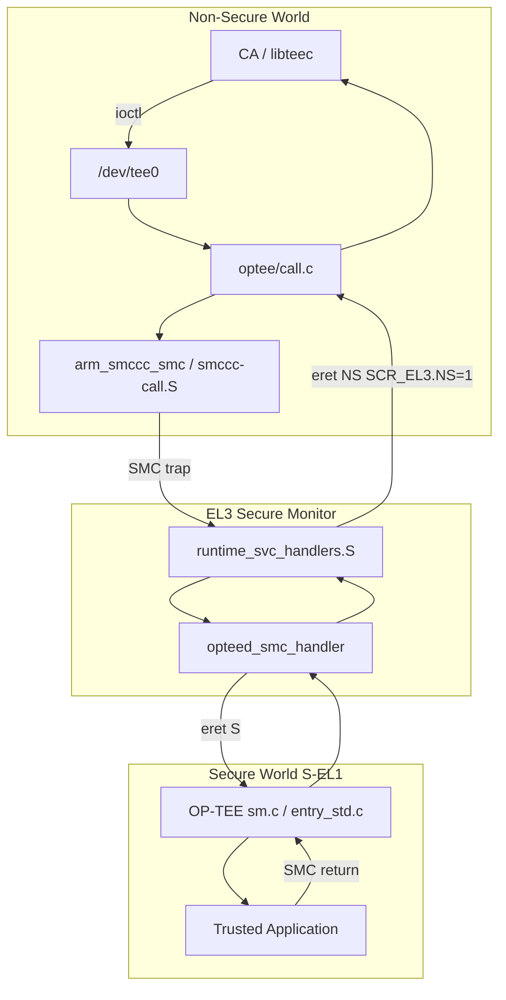
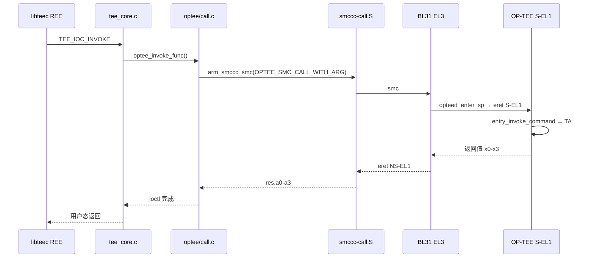

# ATF / TEE / REE 与 EL 完整篇：TrustZone 边界 → 软件栈 → 异常级 → 切换路径（一条主线讲透）

板子上开了 TrustZone，`dmesg` 却找不到 `/dev/tee0`；CA 调 `TEEC_InvokeCommand` 返回 `0xFFFF0006`；SMC 在 EL3 直接 panic——根因往往不在应用层，而在 **硬件 S/NS 边界、TF-A BL31 调度、GIC 分组、内核 optee 驱动与 OP-TEE 版本** 没对齐。本文沿一条主线讲透：**TrustZone 把什么隔开 → ATF/TEE/REE 各干什么 → EL 与世界如何正交 → CA 到 TA 的 SMC 切换路径 → 中断与设备树 → 现场排障**。与《嵌入式安全完整篇》侧重 Secure Boot/IMA 互补：本篇专注 **TrustZone + ATF + TEE 运行时架构**。

## 阅读地图

1. **第一层（硬件边界）**：TrustZone 的 S/NS 世界是什么；TZASC/TZPC 在 DRAM 与外设上各管什么；总线 NS 属性为何决定 abort 而非静默泄露。
2. **第二层（软件角色）**：REE（Linux+CA）、TEE（OP-TEE+TA）、ATF（BL31 Monitor + BL32 加载）的职责分界；FIP 里各 BL 镜像关系。
3. **第三层（异常级）**：EL0–EL3 特权表；NS-EL1 与 S-EL1 正交于世界；SCR_EL3 与 bank 寄存器在切换里起什么作用。
4. **第四层（切换路径，本文重点）**：SVC/HVC/SMC 区别；SMCCC 约定；从 libteec 经 `/dev/tee0`、optee 驱动、`arm_smccc_smc`、BL31 opteed、OP-TEE 到 TA 的逐步路径；共享内存与 RPC；返回 NS。
5. **第五层（中断与 DT）**：GIC Group0/Group1 概念；`linaro,optee-tz` / `arm,ffa` binding；TF-A、OP-TEE、Linux 三大树怎么读。
6. **第六层（排障）**：无 tee0、SMC hang、常见 TEEC 错误码；fiptool、xtest；版本成对升级。

## 源码锚点

| 路径 | 作用 |
|------|------|
| `arm-trusted-firmware/bl1/` | 首级 Bootloader（部分平台 ROM 直跳 BL2） |
| `arm-trusted-firmware/bl2/` | 加载 BL31/BL32/BL33、证书验签 |
| `arm-trusted-firmware/bl31/bl31_main.c` | EL3 Monitor 入口、runtime service 注册 |
| `arm-trusted-firmware/bl31/aarch64/runtime_svc_handlers.S` | SMC 陷入 EL3 的汇编入口 |
| `arm-trusted-firmware/services/spd/opteed/opteed_main.c` | OP-TEE Secure Payload Dispatcher |
| `arm-trusted-firmware/services/std_svc/psci/` | PSCI（CPU ON/OFF/SUSPEND） |
| `arm-trusted-firmware/plat/<vendor>/<soc>/` | 平台 TZC/TZPC/GIC/DRAM 布局 |
| `arm-trusted-firmware/docs/design/firmware-design.rst` | BL 阶段官方设计说明 |
| `arm-trusted-firmware/tools/fiptool/fiptool.c` | FIP 打包/解包 |
| `optee_os/core/arch/arm/kernel/thread_a64.S` | Secure 侧线程切换 |
| `optee_os/core/arch/arm/sm/sm.c` | OP-TEE SMC 处理入口 |
| `optee_os/core/tee/entry_std.c` | 标准 SMC 命令分发（OPEN/INVOKE 等） |
| `optee_os/core/include/optee_msg.h` | 与内核共享的 msg 布局 |
| `optee_client/libteec/src/tee_client_api.c` | GlobalPlatform TEE Client API |
| `linux/drivers/tee/tee_core.c` | TEE 子系统核心、`/dev/tee*` |
| `linux/drivers/tee/optee/call.c` | OP-TEE 驱动 SMC 封装 |
| `linux/drivers/tee/optee/rpc.c` | supplicant RPC 处理 |
| `linux/drivers/tee/optee/optee_smc.h` | OP-TEE SMC function ID |
| `linux/arch/arm64/kernel/smccc-call.S` | 内核 `__arm_smccc_smc` 汇编 |
| `linux/include/linux/arm-smccc.h` | SMCCC 宏与调用约定 |
| `linux/include/uapi/linux/tee.h` | `TEE_IOC_*` ioctl 定义 |
| `linux/Documentation/devicetree/bindings/tee/linaro,optee-tz.yaml` | 传统 OP-TEE DT binding |
| `linux/Documentation/devicetree/bindings/firmware/arm,ffa.yaml` | FF-A 固件接口 binding |

`linux/drivers/tee/optee/call.c` 中 SMC 发起核心（概念与源码一致）：

```c
/* optee_do_call_with_arg() 概念流程 */
param.a0 = OPTEE_SMC_CALL_WITH_ARG;
param.a1 = virt_to_phys(arg);
param.a2 = optee->sec_cap;
arm_smccc_smc(a0, a1, a2, a3, a4, a5, a6, a7, &res);
```

`linux/include/linux/arm-smccc.h`：

```c
#define arm_smccc_smc(...)     arm_smccc_1_2(SMCCC_SMC_INST, __VA_ARGS__)
```

GlobalPlatform Client API 最小骨架：

```c
TEEC_Context ctx;
TEEC_Session sess;
TEEC_Operation op;

TEEC_InitializeContext(NULL, &ctx);
TEEC_OpenSession(&ctx, &sess, &uuid, TEEC_LOGIN_PUBLIC, NULL, NULL, &origin);
op.paramTypes = TEEC_PARAM_TYPES(TEEC_MEMREF_TEMP_INPUT, TEEC_NONE, TEEC_NONE, TEEC_NONE);
TEEC_InvokeCommand(&sess, CMD_TEST, &op, &origin);
TEEC_CloseSession(&sess);
TEEC_FinalizeContext(&ctx);
```

## 调用链

### 冷启动：BL1 → … → Linux + OP-TEE 驻留


### REE → SMC → EL3 → S-EL1 → 返回（世界/EL 切换）





## 第一层：硬件安全边界——TrustZone 把什么隔开了

**本层主问题**：TrustZone 在硬件上究竟隔开了什么？为什么 REE 不能直接读 Secure DRAM？

ARM TrustZone 不是加密加速器，而是 **隔离与访问控制**：CPU、MMU/TLB、缓存、总线主端口携带 **Non-secure (NS) bit**。系统被切分为 **Secure World (S)** 与 **Non-Secure World (NS)**。REE（Rich Execution Environment）通常指 NS 世界的 Rich OS（Linux + 用户态）；TEE 指 S 世界的 Trusted Execution Environment（OP-TEE + TA）。同一物理 CPU 在某一时刻只属于一个世界；切换经 EL3 Monitor，不是软件 memcpy。

| 概念 | 含义 |
|------|------|
| **NS** | Linux、普通驱动、CA；内存访问 NS=1 |
| **S** | OP-TEE、TA、部分固件逻辑；NS=0 |
| **世界切换** | SMC 进 EL3，改 `SCR_EL3.NS` 等，eret 到目标世界 |
| **同核复用** | 切换时保存/恢复两套 EL1 上下文 |

当 CPU 处于 NS 状态访问被标为 Secure 的 PA 或寄存器时，硬件应 **abort**（data abort / bus error），而非静默返回明文——这是 TZASC 与 MMU 配合的基础。Cortex-M 的 TrustZone-M（IDAU/SAU）与 A 核 TZASC 概念类似但寄存器完全不同；STM32MP1 等 A7+M4 异构需按平台手册分别配置，不可混用说明。

现场初判 TrustZone 能力是否被 Boot 链利用：

```bash
grep -i optee /proc/devices
dmesg | grep -iE 'smccc|psci|optee'
```

硬件支持 TrustZone 但 BL2 未加载 BL32，与「SoC 未 fuse TZ」是不同层面的问题。

### S/NS 世界与总线 NS 属性

处理器、NIC 互连、DRAM 控制器都会解码 **NS 属性**。Master（CPU NS 访问、DMA）发起 transaction 时带 NS bit；Target（内存控制器、外设端口）根据配置决定接受或拒绝。

| 访问组合 | 典型结果 |
|----------|----------|
| NS master → NS-only region | 正常 |
| NS master → Secure-only region | SLVERR/DECERR 或 CPU abort |
| S master → NS region | 通常允许（策略因平台而异） |
| S master → Secure region | 正常 |

**NS 属性在总线上的意义**：它是 **第一道硬件判决**，发生在 OP-TEE MMU 之前。TZASC 配错时，NS Linux 可能直接踩 Secure PA，或 Secure heap 落在 NS 可见区导致启动 abort——软件无法可靠补救硬件配错。

Boot 早期还会把 UART、SDHCI、Crypto 等外设划给 NS 或 S。Linux 驱动只能访问 NS 外设；若 crypto 引擎被划为 Secure-only，REE 不应再出现对应 platform driver，而应经 TEE TA 间接调用。

### TZASC 与 TZPC 的隔离边界

**TZASC（TrustZone Address Space Controller）** 在 **DRAM 物理地址空间** 划 region，规定某段 PA 仅 Secure 可访问，或 S/NS 权限不同。典型布局：OP-TEE core、TA heap、Secure shared memory 在 Secure-only region；Linux 普通 DMA 在 NS region。Region 数量、对齐粒度 **因 SoC IP 而异**（TZC-400、TZC-380 等），初始化通常在 **BL2/BL31 平台代码** 或 OP-TEE `plat-*/main.c` 早期完成；Linux 运行期不应随意改 TZASC。

平台初始化典型调用链（以 TZC-400 为例，名称因 plat 而异）：

```
BL2 plat_arch_setup()
  └── tzc400_init()
        ├── tzc400_disable_filters()
        ├── tzc400_configure_region(0, ...)   /* 默认策略 */
        ├── tzc400_configure_region(n, base, top, SECURE_ONLY)
        └── tzc400_enable_filters()
```

**TZPC（TrustZone Protection Controller）** 作用在 **外设端口**：某 UART/TRNG 的 APB 从端口是否对 NS 可见，由 TZPC 控制。与 TZASC 正交：**TZASC 管 PA 段，TZPC 管设备端口**。AMBA-5 下 MPC/PPC 是更细粒度命名，思路仍属内存侧/外设侧两类隔离。

| 组件 | 典型作用 |
|------|----------|
| **TZASC / TZC** | DRAM region S/NS 访问控制 |
| **TZPC / ETZPC** | 外设端口 S/NS 划分 |
| **MPC** | 互连上的内存保护单元 |
| **PPC** | 外设端口保护 |

**勿编造具体寄存器位与固定 MMIO 地址**：读 `arm-trusted-firmware/plat/<vendor>/<soc>/` 下 `plat_tzc*.c`、`tzpc*.c` 等平台文件。配错表现：Linux heap 进 Secure-only 区 → data abort；OP-TEE 区被 NS 踩 → TEE 随机崩溃。

排障 TZASC 与内存布局一致性：

```bash
grep -r 'TZC\|TZASC\|DRAM' arm-trusted-firmware/plat/<soc>/
grep -r 'CFG_TEE_RAM\|CFG_TA_RAM' optee_os/core/arch/arm/plat-<soc>/
```

U-Boot/内核 DT 里 **`reserved-memory`** 必须与 TZASC region 一致；NS Linux 不能占用 Secure-only PA。

## 第二层：软件栈角色——ATF、TEE、REE 各自干什么

**本层主问题**：ATF、TEE、REE 在启动后各驻留哪、管什么？边界一句话：**REE 编排业务与 I/O，TEE 保管密钥与敏感原语，ATF 在 EL3 仲裁世界切换与 PSCI**。

```
TF-A BL31  → EL3 Monitor，不替代 TEE OS
TF-A BL32  → 常部署 OP-TEE（也可其他 Secure Payload）
OP-TEE     → TEE OS，处理 GP SMC
Linux      → REE，经 optee 驱动 SMC 进 TEE
```

### REE 侧：Linux 与用户态 CA

| 层次 | 典型软件 |
|------|----------|
| User | 银行 App、CA（libteec）、tee-supplicant |
| Kernel | Linux、optee 驱动、普通设备驱动 |
| Boot | U-Boot / UEFI（BL33） |
| 可选 | KVM @ NS-EL2 |

REE 负责 UI、网络、文件系统、通用驱动；**不应**长期持有明文 DRM key、设备唯一私钥。CA 通过 GlobalPlatform Client API 发请求；内核 **never** 直接读 Secure 物理页，只经 **`/dev/tee0` ioctl** 触发 world switch。

| 能力 | REE | TEE |
|------|-----|-----|
| AES 加解密 | 调 TA，密钥不出 Secure | TA 内 `TEE_AllocateTransientObject` |
| 设备唯一密钥 | 只拿公钥/证书 | HUK 派生，PTA 导出受限 |
| 文件加密 | ext4 存密文 | Secure Storage object |
| 加载 TA 文件 | tee-supplicant 读 `/lib/optee_armtz/` | OP-TEE 经 RPC 请求 REE 读文件 |

**tee-supplicant** 与 `linux/drivers/tee/optee/rpc.c` 配合：OP-TEE 返回 `OPTEE_SMC_RETURN_RPC` 时，驱动唤醒 supplicant 处理 `OPTEE_RPC_CMD_LOAD_TA`、FS、SHM 等。CA 在 supplicant 前启动可能得 `TEEC_ERROR_BAD_STATE (0xFFFF0006)`。

```bash
pgrep -a tee-supplicant
ls /lib/optee_armtz/
```

### TEE 侧：OP-TEE 与 TA

| 组件 | 说明 |
|------|------|
| **OP-TEE core** | 调度、MMU、IPC、crypto 框架 @ S-EL1 |
| **TA** | 签名 ELF，UUID 标识 |
| **PTA** | Pseudo-TA，内核态，提供 device key 等 |
| **ldelf** | 动态加载 TA（`optee_os/ldelf/`） |

TEE 提供隔离、attestation、安全存储；TA 与 CA 经 **共享内存 + command ID** 传参，`TEEC_ParamTypes` 编码参数类型。TA 生命周期：RPC 加载 → 验签 → OPEN_SESSION → INVOKE → CLOSE。

开发 TA：`export TA_DEV_KIT_DIR=$(optee_os/out/arm/export-ta_arm64)`，Makefile 含 `mk/ta_dev_kit.mk`。CA 只链 **libteec**；TA 链 **libutee**，勿混用 Internal/Client API 头文件。

### ATF 启动链：BL 阶段与 FIP

**ARM Trusted Firmware-A（TF-A）** 实现 EL3 Monitor、PSCI、SiP、Secure Payload 调度。商业板 `bl31.bin` 通常即 TF-A 产物。

| 阶段 | 典型 EL | 职责 |
|------|---------|------|
| **BL1** | EL3/ROM | 部分平台存在；许多 SoC ROM 直载 BL2 |
| **BL2** | S-EL1 | DDR、TrustZone 初始化、加载 BL31/BL32/BL33、TBB 验签 |
| **BL31** | EL3 | 常驻 Monitor：PSCI、SMC 分发、world switch |
| **BL32** | S-EL1 | Secure Payload：**OP-TEE** |
| **BL33** | NS-EL1/EL2 | U-Boot / UEFI → Linux |

**FIP（Firmware Image Package）** 把 BL31/BL32/BL33 打成一包，BL2 解析。FIP 内 UUID  tagged TOC，常见条目见 `tools/fiptool/fiptool.c`（TB_FW_CONFIG、BL31、BL32、BL33 等）。OP-TEE 在 FIP 常拆 **header + pager + pageable**，BL2 按 `struct optee_header` 解析 load address。

```bash
fiptool info fip.bin
fiptool unpack fip.bin
make PLAT=rk3399 SPD=opteed BL32=optee BL33=u-boot.bin all fip
```

`bl31/bl31_main.c` 冷启动：`bl31_setup` → `bl31_lib_init` → `runtime_svc_register` → `bl31_prepare_next_image_entry` → 进 BL33。U-Boot `booti` 起的 kernel 已是 NS；OP-TEE 在 BL2 已驻留 Secure RAM，不随 Linux 再加载。

**Secure Boot 与 ATF 交界（仅交界）**：Secure Boot 解决「镜像是否被篡改」；TrustZone 解决「运行期隔离」。二者在 **BL2** 交汇：`auth_mod` 的 `auth_img_verify()` 用 ROTPK 验签 BL31/BL32/BL33。验签失败不应跳恶意 BL31。U-Boot FIT 签名是 **BL33 之后** 一环，与 BL2 证书链不同层。Secure Boot 通过也不保证 TEE 可用：FIP 无 BL32 或 DT 无 optee → 仍无 `/dev/tee0`。OP-TEE TA 签名失败表现为 OpenSession 失败、`origin=TEE OS`，与 BL2 验签失败（卡 BL2）要分开查。

## 第三层：异常级别——EL0/EL1/EL2/EL3 与世界正交

**本层主问题**：EL 与 S/NS 世界是什么关系？Linux 和 OP-TEE 为何「同级不同界」？

ARMv8-A **Exception Level** 数值越高特权越大。**EL 与世界正交**：NS-EL1（Linux）与 S-EL1（OP-TEE）特权相同，NS bit 不同，可见内存与外设不同。

### EL0–EL3 特权表与 NS-EL1 / S-EL1

| EL | 典型软件 | 能力概要 |
|----|----------|----------|
| **EL0** | App、CA | 无特权；SVC 进 NS-EL1 |
| **EL1** | Linux、OP-TEE | MMU、大部分系统寄存器；S/NS 各一套 |
| **EL2** | KVM、Xen | 虚拟化；可选 |
| **EL3** | BL31 Monitor | 最高特权；SMC 目标 |

| 场景 | Linux 位置 | 说明 |
|------|------------|------|
| 嵌入式常见 | NS-EL1 | 无 KVM；BL33 → Linux |
| 虚拟化 | Guest NS-EL1，Host NS-EL2 | Guest 内 TEE 需代理，复杂 |
| OP-TEE | S-EL1 | 与 Linux 同级不同世界 |

S-EL1 与 NS-EL1 **异常向量独立**：Linux `entry.S` 设 `VBAR_EL1`；OP-TEE `core/arch/arm/kernel/entry_a64.S` 设 Secure `VBAR_EL1`。CA 发 SMC 进 EL3 再进 S-EL1，**不经过** Linux `el0_svc`。

**PSCI** 也走 SMC，BL31 `services/std_svc/psci/` 处理 `CPU_ON/OFF/SUSPEND`。Secondary CPU 启动需与 OP-TEE `CFG_BOOT_SECONDARY_REQUEST` 等平台选项一致；CPU1 不起先查 `dmesg psci`，勿先怀疑 TA。

有 Hypervisor 时 `HCR_EL2.TSC` 可 trap SMC 到 EL2；嵌入式无 EL2 时 SMC 直达 EL3。读 `/sys/hypervisor/type` 可知是否在 VM 内——Guest 内通常无真 OP-TEE，除非 Host passthrough。

### SCR_EL3 与 bank 寄存器

SMC 陷入 EL3 时，`runtime_svc_handlers.S` 保存 NS 上下文到 `cpu_context`；`opteed_enter_sp` 进 S-EL1 前再保存 Secure 侧状态。返回 NS 必须：恢复 NS `elr/spsr/sp`；设 **`SCR_EL3.NS = 1`**；**eret** 回 Linux。

| 寄存器 | 说明 |
|--------|------|
| **`VBAR_EL1`** | Linux 与 OP-TEE 各独立向量基址 |
| **`TTBR*_EL1`** | 各自页表 |
| **`SCR_EL3`** | 仅 EL3 可写；NS、IRQ/FIQ 路由 |
| **`SPSR_EL3` / `ELR_EL3`** | 保存 SMC 前 NS-EL1 的 PSTATE 与 PC |

`SCR_EL3` 关键位（概念，以 ARM DDI 0406 为准）：

| 位 | 作用 |
|----|------|
| **NS** | eret 后 1=NS，0=S |
| **IRQ/FIQ** | 中断在 Monitor 与 lower EL 间路由 |
| **EA** | 外部 abort 路由策略 |

OP-TEE secure panic 时 BL31 可能无法干净返回 → Linux hard lockup。调试开 OP-TEE `CFG_TEE_CORE_LOG_LEVEL` 与 TF-A `LOG_LEVEL`。`/proc/cpuinfo` 仅 REE 视图；Secure 状态需 OP-TEE 串口日志或 JTAG（若未 fuse secure debug）。

## 第四层：如何切换——从 CA 到 TA 的完整路径（本文重点）

**本层主问题**：一次 `TEEC_InvokeCommand` 在硬件和软件上逐步经过哪些节点？为何 CA 不能直接 `smc #0`？

设计原则：**CA 不直接发 SMC**。路径为 libteec → ioctl → optee 驱动 → `arm_smccc_smc` → BL31 opteed → OP-TEE → TA。内核可审计、可映射共享内存、可串行化并发 session。

### SVC、HVC、SMC 与 SMCCC

| 指令 | 用途 | 陷入 |
|------|------|------|
| **SVC** | 用户态 syscall → Linux | NS-EL1 |
| **HVC** | Hypercall | EL2 |
| **SMC** | Secure Monitor call | EL3 |

**ARM SMCCC** 规定 SMC 参数：**x0** = Function ID（bit[31:30] 区分 fast/standard 等）；**x1–x7** 参数/返回；**x0** 主返回值。Function ID 分区（概念）：Standard ARM（PSCI 等）、SiP（硅厂）、OEM、Trusted OS（OP-TEE）。

| SMC 类型 | 特点 | 示例 |
|----------|------|------|
| Fast | 轻量，不完整线程切换 | UID、capabilities |
| Standard | 可调度 OP-TEE thread | OpenSession、Invoke |

Linux 应用 SMC 宏，勿裸写 magic number。`smccc-call.S` 的 `__arm_smccc_smc` 保存 callee-saved，`smc #0` 后写回 `res.a0–a3`。

### libteec → /dev/tee0 → optee 驱动

**步骤 1 — 用户 CA**  
`TEEC_InitializeContext()` → `open("/dev/tee0")`。  
路径：`optee_client/libteec/src/tee_client_api.c`

**步骤 2 — ioctl**  
`TEEC_OpenSession` / `TEEC_InvokeCommand` → `TEE_IOC_OPEN_SESSION` / `TEE_IOC_INVOKE`。  
路径：`linux/drivers/tee/tee_core.c` 的 `tee_ioctl()`

ioctl 命令（`linux/include/uapi/linux/tee.h`）：

| ioctl | 用途 |
|-------|------|
| `TEE_IOC_VERSION` | 查 TEE 实现版本 |
| `TEE_IOC_OPEN_SESSION` | 按 UUID 开 session |
| `TEE_IOC_INVOKE` | 调 TA command |
| `TEE_IOC_SHM_ALLOC` | 分配共享内存 |
| `TEE_IOC_SUPPL_RECV` | supplicant 收 RPC |

**步骤 3 — optee 驱动组参**  
分配 `optee_msg_arg`（`tee_shm`），填 `cmd`、`uuid`、`param_types`。  
路径：`linux/drivers/tee/optee/call.c` → `optee_do_call_with_arg()`

**步骤 4 — arm_smccc_smc**  
`param.a0 = OPTEE_SMC_CALL_WITH_ARG`；`a1 = 共享缓冲 PA`；`a2 = sec_cap`。  
路径：`linux/arch/arm64/kernel/smccc-call.S`

`optee_smc.h` 与 `optee_os/core/arch/arm/include/sm/optee_smc.h` 应对齐：

```c
#define OPTEE_SMC_CALLS_COUNT       /* UID / 能力 */
#define OPTEE_SMC_CALL_WITH_ARG     /* open / invoke 等 */
```

具体数值以当前 LTS 内核与 OP-TEE **成对版本**为准。

### BL31 opteed 与 OP-TEE SMC 入口

**步骤 5 — BL31 分发**  
`runtime_svc_handlers.S` 查 function ID → `opteed_smc_handler()`。  
路径：`arm-trusted-firmware/services/spd/opteed/opteed_main.c`

`bl31_main.c` 注册 runtime service：PSCI、Standard SIP、opteed。未注册 ID 返回 SMCCC UNKNOWN。PSCI 与 OP-TEE 用 **不同 function ID 空间**，BL31 统一分发。

`opteed_enter_sp` 概要：保存 NS `elr/spsr/sp` 到 `optee_context`；设 S-EL1 entry；eret 进 OP-TEE `std_smc_entry`。

**步骤 6 — OP-TEE**  
`sm.c` → `thread_handle_std_smc` → `tee_entry_std()`（`entry_std.c`）。  
按 `optee_msg_arg->cmd`：OPEN_SESSION、INVOKE_COMMAND、CLOSE_SESSION 等。

**步骤 7 — TA**  
`TA_InvokeCommandEntryPoint()` 处理 CMD，读写 memref 参数。  
`origin` 回填：驱动 → libteec → CA（区分 COMMS / TEE OS / TA）。

读码建议顺序：`bl31_main.c` → `opteed_main.c` → `sm.c` → `entry_std.c` → `call.c` → `tee_client_api.c`。

### 共享内存与 RPC 返回 NS

Linux `tee_shm_pool` 来源：**DT reserved-memory**（`no-map`，PA 固定）或 dynamic `dma_alloc`。固定池利于多核/suspend 后 PA 不变；动态池需 OP-TEE 支持 `REGISTER_SHM` SMC。`optee_msg_arg` / `optee_msg_param` 布局在内核 `optee_smc.h` 与 OP-TEE `core/include/optee_msg.h` **必须一致**——版本锁重点。

RPC 循环（LOAD_TA 为例）：

```
NS: InvokeCommand ioctl
  → SMC → OP-TEE: 需读 /lib/optee_armtz/xxx.ta
  → return RPC LOAD_TA
  → optee_rpc_load_ta → wake supplicant
  → supplicant 读文件写 shm
  → SMC 再进 OP-TEE 继续加载
  → return OK 回 NS
```

一次 open session 若 TA 未缓存，可能 **多次 world switch**。优化：预装 TA、增大 `CFG_SHMEM_SIZE`、大 buffer 用 `TEEC_RegisterSharedMemory` 而非 `TEEC_MEMREF_TEMP`。

返回 NS 时 EL3 恢复 `cpu_context` 里 NS `x0-x30`、`sp_el0`、`elr_el3`。**opteed 必须在 re-enter NS 前保证 `SCR_EL3.NS=1`**，否则 Linux 在 S 视图跑 NS 代码，极难调试。

NS shared buffer 映射为 Normal memory；勿用 `/dev/mem` mmap Secure PA。Docker 需 `--device /dev/tee0` 且 host supplicant 运行。

最小 TA 验链（`optee_os/ta/hello_world/ta.c`）：

```c
TEE_Result TA_InvokeCommandEntryPoint(..., uint32_t cmd) {
    IMSG("Hello from Secure world cmd=%u", cmd);
    return TEE_SUCCESS;
}
```

编译 `.ta` 到 `/lib/optee_armtz/`，`tee-supplicant &` 后 xtest 或自定义 CA。

### 逐步对照：一次 InvokeCommand 全路径

把第四层串成可对照表：

| 序 | 位置 | EL/世界 | 关键动作 |
|----|------|---------|----------|
| 1 | CA 用户态 | NS-EL0 | `TEEC_InvokeCommand` |
| 2 | libteec | NS-EL0 | ioctl `/dev/tee0` |
| 3 | tee_core.c | NS-EL1 | 校验 param，调 `teedev->ops->invoke` |
| 4 | optee/call.c | NS-EL1 | 填 `optee_msg_arg`，`arm_smccc_smc` |
| 5 | smccc-call.S | NS-EL1→EL3 | `smc #0`，硬件存 SPSR/ELR 到 EL3 |
| 6 | runtime_svc_handlers.S | EL3 | 查表 → opteed |
| 7 | opteed_main.c | EL3→S-EL1 | 保存 NS ctx，`opteed_enter_sp`，eret |
| 8 | sm.c / entry_std.c | S-EL1 | 解析 cmd，调度 TA |
| 9 | TA | S-EL1 | 业务逻辑 |
| 10 | OP-TEE → opteed | S-EL1→EL3 | SMC return，可能夹 RPC 回 NS |
| 11 | opteed → NS | EL3→NS-EL1 | 恢复 ctx，`SCR_EL3.NS=1`，eret |
| 12 | call.c → libteec | NS-EL1→EL0 | 拷贝返回值 |

**硬件侧**：`smc #0` 是 sync exception to EL3；与 Linux `svc #0` 进 NS-EL1 是两条独立 trap 路径。  
**性能**：一次 Invoke 常数百 μs～ms（world switch + cache 维护）；高频 crypto 应在 TA 内 batch，避免 per-byte SMC。

`optee/core.c` probe（SMC 模式）：DT 匹配 `linaro,optee-tz` → `optee_smc_get_uid()` → `optee_smc_exchange_capabilities()` → 注册 `/dev/tee0`、`/dev/teepriv0`。失败 log 如 `optee: probe of firmware:optee failed with error -ENODEV` → 多半 BL32 未起或 UID 不对。

内核配置：

```
CONFIG_TEE=y
CONFIG_OPTEE=y
```

## 第五层：中断分流、设备树与源码树导航

**本层主问题**：Secure 中断如何与 Linux 分流？DT 如何声明 OP-TEE？三大树从哪读起？

### GIC Group0/Group1 与中断路由

GICv2/v3 把中断分为 **Group 0 / Group 1**（v3 还有扩展）：

| Group | 典型路由 |
|-------|----------|
| **Group 0** | Secure 或需 Monitor；可配 FIQ 进 EL3/OP-TEE |
| **Group 1** | Non-secure，Linux `handle_arch_irq` |

安全外设中断（Secure watchdog、部分 crypto）应在 Group 0；普通设备在 Group 1 给 Linux。TF-A `plat_gic.c` 初始化分组；OP-TEE `drivers/gic` 处理 secure interrupt。路由由 **`SCR_EL3` IRQ/FIQ 位** 与 GIC 配置共同决定；不同 TF-A 版本/平台默认策略不同，以 `plat/<soc>/platform.mk` 为准。

Linux 只管理 NS Group；**勿在 NS 驱动写 GIC secure 寄存器**。排障：设备 probe 成功无中断 → 查 DT `interrupt-parent` 与 GIC group；`cat /proc/interrupts` 仅 NS 视图。

Historically FIQ 可路由 Monitor/Secure OS，IRQ 给 NS Linux——具体以平台手册与 TF-A GIC init 为准。

### 设备树：linaro,optee-tz 与 arm,ffa

传统 OP-TEE binding：`linux/Documentation/devicetree/bindings/tee/linaro,optee-tz.yaml`

```dts
firmware {
    optee {
        compatible = "linaro,optee-tz";
        method = "smc";
    };
};

reserved-memory {
    optee_shm: optee-shm@82000000 {
        compatible = "shared-dma-pool";
        reg = <0x0 0x82000000 0x0 0x02000000>;
        no-map;
    };
};

/ {
    optee {
        compatible = "linaro,optee-tz";
        method = "smc";
        memory-region = <&optee_shm>;
    };
};
```

**`method = "smc"`** 走 SMC；**`memory-region`** 绑定 NS 与 OP-TEE 共享 carveout，须 **不在 Linux `memory` 节点内**，且与 TZASC region 一致。

新平台迁移 **FF-A**：binding `linux/Documentation/devicetree/bindings/firmware/arm,ffa.yaml`

```dts
firmware {
    optee {
        compatible = "linaro,optee-tz";
        method = "ffa";
    };
};
```

内核 `optee/ffa.c` 注册 `arm_ffa_device`；与 `arm,ffa` DT 节点配合。FF-A 动机：多 Secure Partition、标准化 SPMC↔SP 通信。迁移读 `optee_os/documentation/ffa/` 与 `linux/Documentation/arch/arm64/ffa.rst`。KASLR 不影响固定 reserved-memory；CMA 与 optee_shm 争用会导致 probe 后 alloc 失败。

运行态核对 DT：

```bash
dtc -I fs -O dts /sys/firmware/fdt 2>/dev/null | grep -E 'optee|ffa|reserved-memory'
dmesg | grep -i optee
```

### TF-A / OP-TEE / Linux 源码树导读

**arm-trusted-firmware**：

```
trusted-firmware-a/
├── bl1/ bl2/ bl31/
├── services/spd/opteed/     # OP-TEE SPD
├── services/std_svc/psci/
├── plat/<vendor>/<soc>/     # TZC/GIC/DDR
├── auth/                    # Trusted Board Boot
└── tools/fiptool/
```

**optee_os**：

```
optee_os/
├── core/arch/arm/           # SMC、MMU、thread
├── core/tee/                # GP Internal API
├── ta/ ldelf/
└── lib/libutee/
```

**linux**：见本文源码锚点表。三角版本应锁定，BSP manifest 建议记录 tf-a / optee_os / linux / optee_client 四元组。上游：

```text
https://git.trustedfirmware.org/TF-A/trusted-firmware-a.git
https://github.com/OP-TEE/optee_os
https://github.com/OP-TEE/optee_client
```

QEMU 学习：`virt,secure=on`；TF-A `plat/fvp` + OP-TEE `PLATFORM=fvp`。典型 SoC 移植差异（要点级，细节以平台为准）：

| 平台 | 要点 |
|------|------|
| RK3399 | `PLAT=rk3399 SPD=opteed` |
| i.MX8 | TZASC 在 `plat_tzc380.c`；CAAM NS/S 划分 |
| STM32MP1 | A7 OP-TEE + M4 TrustZone-M 资源隔离 |
| Amlogic G12 | U-Boot 打包 BL32；DT `firmware/optee` |

## 第六层：排障与验证

**本层主问题**：无 tee0、SMC hang、TEEC 错误码各指向哪一层？如何用 fiptool/xtest 端到端验证？

按层定位症状：

| 层次 | 症状 | 首查 |
|------|------|------|
| 硬件 TZ | 无 secure RAM | TZASC map、BL2 mem layout |
| FW BL32 | UID SMC 失败 | 串口 BL32、fiptool |
| DT | probe defer | compatible、method、memory-region |
| 内核 | 无 device | CONFIG_OPTEE |
| 用户态 | open EIO | supplicant、权限 |

### 无 tee0 与 probe 失败

排查顺序：

1. `grep CONFIG_OPTEE /boot/config-$(uname -r)` 或内核 defconfig
2. DT 是否有 `linaro,optee-tz` 及 `method`
3. `dmesg | grep optee` — probe 失败原因
4. TF-A 串口 BL32 是否 entry
5. `fiptool info fip.bin` 确认 BL32 非空

```bash
ls -l /dev/tee* /dev/teepriv*
modinfo optee
strace -e ioctl ./my_ca 2>&1 | grep -E 'tee0|TEE_IOC'
```

ioctl **ENODEV** → 设备节点不存在；**EIO** 且 dmesg 有 `arm_smccc: SMC failed` → 往 EL3/OP-TEE 查。initramfs 阶段无 tee0 可属正常；early unlock 需 builtin optee 或延后到 rootfs。

### SMC hang 与 lockup

- OP-TEE secure panic 未返回 NS
- function ID 与 BL31 注册表不匹配
- secondary CPU PSCI 与 OP-TEE 不一致
- secure interrupt storm 饿死 NS

hang 时看 watchdog、RCU stall；TF-A `LOG_LEVEL=40` 可能打印 **`Unhandled SMC`**（function ID 未注册——常见内核 optee 新、TF-A 旧，或 SiP/OEM ID 冲突）。RPMB 失败常 `TEEC_ERROR_STORAGE_NOT_AVAILABLE`，查 `mmcblk0rpmb` 与 `CFG_RPMB_FS`，不一定是 SMC hang。

反汇编 BL31：

```bash
aarch64-none-elf-objdump -d bl31.elf | less
grep -r 'opteed_smc' build/<plat>/release/bl31/bl31.map
```

### TEEC 常见错误码、fiptool 与 xtest

**TEEC 错误码**（GlobalPlatform 定义，确实常见）：

| 值 | 宏 | 含义 |
|----|-----|------|
| 0x00000000 | TEEC_SUCCESS | 成功 |
| 0xFFFF0000 | TEEC_ERROR_GENERIC | 通用错误 |
| 0xFFFF0006 | TEEC_ERROR_BAD_STATE | 状态错/supplicant 未就绪 |
| 0xFFFF000C | TEEC_ERROR_COMMUNICATION | SMC/驱动通信失败 |
| 0xFFFF000F | TEEC_ERROR_OUT_OF_MEMORY | TEE RAM 不足 |

`origin`：**0x3** = TEE OS，**0x4** = TA，**0x2** = COMMS（驱动/libteec）。

**版本成对升级**：仅升 linux 未升 optee_os，`OPTEE_SMC_CALL_WITH_ARG` 或 msg 布局变化 → `xtest 4001 FAIL`。应 **tf-a + optee_os + linux + optee_client** 同批验证。

| 组件升级 | 风险点 |
|----------|--------|
| optee_os | msg layout、SMC UID、RPMB |
| linux optee 驱动 | probe、FF-A fallback |
| tf-a opteed | SMC 注册表、PSCI |
| optee_client | libteec ioctl 结构体 |

**fiptool**：

```bash
fiptool info fip.bin
fiptool unpack fip.bin
ls -la image.bin   # 解包 BL31/BL32/BL33
```

BL32 缺失 → Linux 永远 probe 不到 OP-TEE。

**xtest**（需 tee-supplicant）：

```bash
tee-supplicant &
xtest -l 15
xtest 1001
xtest -t regression
```

| xtest 现象 | 可能原因 |
|------------|----------|
| 0001 FAIL | SMC UID 不通，SPD 未启 |
| 4001 FAIL | shm/参数布局版本不匹配 |
| 5xxx FAIL | crypto/RPMB 平台未配 |

产线回归：`ls /dev/tee0` → `xtest -l 15` → suspend/resume 后重测 session → 多核 stress 并行 invoke。OTA 更新 `fip.bin` 须走 signed FIP，与 BL2 TBB 链一致，否则 BL2 拒载新 BL32。

内存规模粗算：`CFG_TEE_RAM_VA_SIZE` + `CFG_TA_RAM_SIZE` + shm → DT `reserved-memory` 须留足连续空间；对比 U-Boot `fdt_fixup` 与运行态 `dtc -I fs -O dts /sys/firmware/fdt`。

规范索引：ARM DEN 0028A（SMCCC）、ARM DDI 0406（ARMv8-A）、GlobalPlatform TEE Client API、TF-A `docs/`、OP-TEE `documentation/`。

---

**主线回顾**：EL3 Monitor 是交通警察，OP-TEE 是 Secure OS，Linux 是 NS Rich OS，**SMC 是唯一合法跨界 syscall**。从 TZASC 划界 → BL2 加载 BL32 → DT 声明 optee → 驱动 probe → libteec ioctl → 逐步对照第四层表格读源码，调用链就不会散。TrustZone 选型与 Trusty、QSEE、Kinibi 等厂商 TEE 互斥占 BL32——BSP 阶段决定，Linux 驱动与 SMC 协议不可混用。
