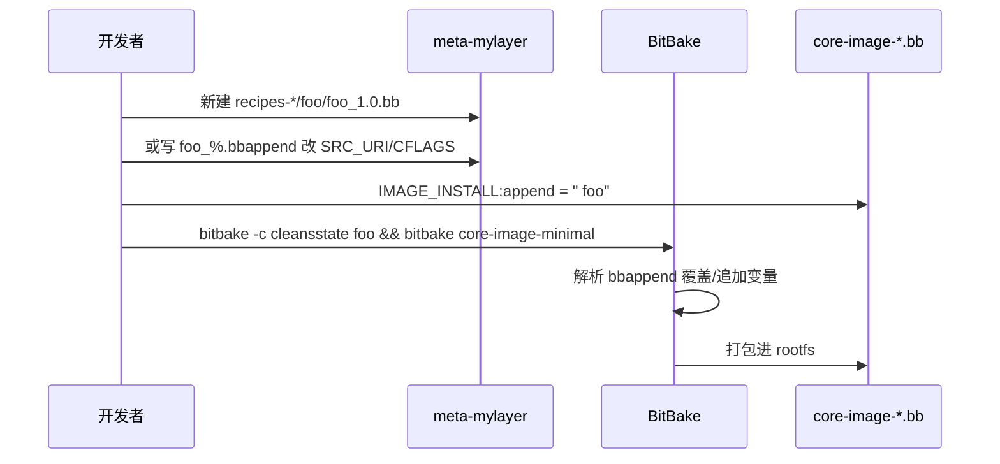

# Yocto 完整解析：原理、从零搭建环境与配方/配置文件怎么改

第一次接触 Yocto，常见卡点不是「不会敲 bitbake」，而是分不清 **Yocto / OpenEmbedded / BitBake / Poky** 各自管什么；`local.conf`、`bblayers.conf`、`.bb`、`.bbappend`、`machine.conf` 改哪一层才生效；以及构建失败时该看 `tmp/work` 还是 `bitbake -e`。本文以 **Yocto Project 5.0（Scarthgap）/ Poky** 为主线，从原理到从零环境、再到编辑配置与配方，按层讲透一条可动手验证的闭环。版本差异处会标明「以当前 release 文档为准」。

## 阅读地图

1. **第一层：原理与角色**——Yocto、OE、BitBake、Poky、Layer 各自是什么；一次镜像构建在概念上经历哪些阶段。
2. **第二层：从零搭建环境**——主机依赖、克隆 Poky、检出发行版分支、`oe-init-build-env`、首次 `bitbake`、QEMU 跑起来。
3. **第三层：目录与关键文件地图**——Source Directory 与 Build Directory 分离；`bitbake.conf` 如何把 `local.conf` / machine / distro 串起来。
4. **第四层：如何编辑 Yocto 文件（本文实操重点）**——改 `local.conf` / `bblayers.conf`；写 layer；写 recipe 与 `bbappend`；改 machine / image；变量赋值运算符语义。
5. **第五层：构建机制与可观测手段**——task 流水线、sstate、`bitbake -e/-g/-c`、`devshell`、`oe-pkgdata-util`。
6. **第六层：常见坑与分层排障**——依赖/网络/空间、层优先级、覆盖失效、SDK 与产物路径。

## 源码锚点

| 路径 / 文档 | 作用 |
|-------------|------|
| `https://git.yoctoproject.org/poky` | 官方推荐克隆的 Poky 仓库（含 BitBake 子树、oe-core、meta-yocto） |
| `poky/oe-init-build-env` | 初始化 Build Directory、导出 `PATH`/`BBPATH` |
| `poky/bitbake/` | BitBake 解析器与执行引擎 |
| `poky/meta/` | OpenEmbedded-Core（oe-core）核心 layer |
| `poky/meta/conf/bitbake.conf` | 全局默认变量与 include 链入口 |
| `poky/meta/conf/layer.conf` | oe-core 的 layer 定义（`BBPATH`/`BBFILES`） |
| `poky/meta/conf/machine/*.conf` | 机器配置（如 `qemux86-64.conf`） |
| `poky/meta/conf/distro/poky.conf` | Distro「poky」策略 |
| `poky/meta/recipes-core/images/core-image-minimal.bb` | 最小镜像配方示例 |
| `poky/meta-poky/`、`poky/meta-yocto-bsp/` | Yocto 发行策略与参考 BSP |
| `build/conf/local.conf` | **本机构建**覆盖点（由 sample 生成） |
| `build/conf/bblayers.conf` | 启用哪些 layer |
| `docs.yoctoproject.org/scarthgap/` | Scarthgap 官方手册（结构、构建、开发） |

`bitbake.conf` 末尾会 include 用户与机器配置（概念上）：

```text
# meta/conf/bitbake.conf（逻辑示意，以仓库实文件为准）
# ... 大量默认变量 ...
# include 链最终会拉入：
#   conf/local.conf
#   conf/machine/${MACHINE}.conf
#   conf/distro/${DISTRO}.conf
```

最小镜像配方入口形态：

```bitbake
# meta/recipes-core/images/core-image-minimal.bb（结构示意）
SUMMARY = "A small image just capable of allowing a device to boot."
IMAGE_INSTALL = "packagegroup-core-boot ${CORE_IMAGE_EXTRA_INSTALL}"
IMAGE_LINGUAS = " "
LICENSE = "MIT"
inherit core-image
```

变量覆盖常用运算符（写配置前必须分清）：

```bitbake
A = "x"      # 强赋值，后写覆盖前写（同优先级内）
A ?= "x"     # 弱赋值：仅当 A 未定义时生效
A ??= "x"    # 更弱的默认
A += " y"    # 追加（带空格习惯）
A:append = " y"   # 解析结束后追加（推荐改第三方配方时用）
A:prepend = "y "  # 前插
A:remove = "y"    # 移除（需注意匹配片段）
```

## 调用链

### 从克隆到镜像产物

```mermaid
flowchart TD
    A[git clone poky + checkout scarthgap] --> B[source oe-init-build-env]
    B --> C[生成/进入 build/]
    C --> D[编辑 conf/local.conf 与 bblayers.conf]
    D --> E[bitbake core-image-minimal]
    E --> F[BitBake 解析 recipe 与配置]
    F --> G[展开依赖图 / 调度 task]
    G --> H[do_fetch → unpack → patch → configure → compile → install → package]
    H --> I[rootfs 组装 / do_image_*]
    I --> J[tmp/deploy/images/${MACHINE}/]
```

### 配置与配方如何被 BitBake 解析进一次构建

```mermaid
flowchart LR
    subgraph Conf
      BC[meta/conf/bitbake.conf]
      LC[build/conf/local.conf]
      MC[machine/${MACHINE}.conf]
      DC[distro/${DISTRO}.conf]
      BL[bblayers.conf → 各 layer.conf]
    end
    subgraph Recipes
      BB[*.bb]
      INC[*.inc]
      BBA[*.bbappend]
    end
    BL --> BC
    BC --> LC
    BC --> MC
    BC --> DC
    BL --> BB
    BB --> INC
    BB --> BBA
    LC --> EXP[变量最终值 bitbake -e]
    MC --> EXP
    DC --> EXP
    BBA --> EXP
    EXP --> TASK[task 执行]
```

### 改一个应用如何进镜像（编辑文件的主路径）



## 第一层：原理与角色——Yocto 到底在构建什么

**本层主问题**：一堆名词里，谁是规范、谁是引擎、谁是参考发行版？一次构建的「产品」是什么？

### Yocto Project、OpenEmbedded、BitBake、Poky

| 名称 | 它是什么 | 你日常怎么碰到它 |
|------|----------|------------------|
| **Yocto Project** | 协作项目与规范集合：定义如何组织 layer、测试、发布工具与文档 | 选发行版代号（如 Scarthgap）、读官方文档、用 Poky 入门 |
| **OpenEmbedded (OE)** | 构建系统与元数据生态；**oe-core**（`meta/`）提供基础配方与类 | 绝大多数 `.bb` / `.bbclass` 来自这里或兼容它的 layer |
| **BitBake** | **任务执行引擎**：解析配方、算依赖、跑 `do_*` task | 命令行就是 `bitbake <target>` |
| **Poky** | Yocto 的**参考发行版组合**：BitBake + oe-core + meta-yocto + 文档脚本 | `git clone poky` 后就能从零构建 |

一句话：**BitBake 是引擎；OE 元数据是油料；Yocto 是项目与质量规范；Poky 是官方拼好的入门整车。**

厂商 BSP（如 NXP `meta-freescale`、TI、Rockchip 等）通常是：**Poky/oe-core + 芯片厂 layer + 板级 machine**。你改产品时，优先在**自己的 layer**里写 `bbappend`/新 recipe，而不是直接改 `meta/` 上游文件——否则升级发行版时冲突成本极高。

### 构建产物是什么

一次成功的镜像构建，典型会在 Build Directory 下生成：

| 位置（相对 `build/`） | 内容 |
|----------------------|------|
| `tmp/deploy/images/<MACHINE>/` | 内核、设备树、rootfs 镜像、WIC/SD 卡镜像等（视 IMAGE_FSTYPES） |
| `tmp/deploy/rpm` 或 `deb`/`ipk` | 软件包仓库（由 `PACKAGE_CLASSES` 决定） |
| `tmp/work/<tuple>/<pkg>/<PV>/` | 每个配方的工作目录（源码、构建、日志） |
| `tmp/log/`、`tmp/work/.../temp/log.do_*` | task 日志 |
| `sstate-cache/`（可配置路径） | Shared State：可复用的 task 产出，加速重建 |

「目标」可以是镜像（`core-image-minimal`）、单个配方（`bitbake busybox`）、SDK（`bitbake -c populate_sdk ...`）或世界集（`bitbake world`，极耗时，一般只做测试）。

### Layer 模型为什么是核心设计

Yocto/OE 用 **layer（层）** 隔离关注点：

- **BSP layer**：machine、内核、bootloader、机器特定固件
- **Distro layer**：发行策略（特性开关、首选 provider、安全策略）
- **Software layer**：中间件、应用、packagegroup
- **自定义公司 layer**：量产差异、客户补丁、私有配方

层通过 `build/conf/bblayers.conf` 启用；每个层有 `conf/layer.conf` 声明：

- `BBPATH`：让 BitBake 找到该类层的 conf/class
- `BBFILES`：本层哪些 `.bb`/`.bbappend` 参与解析
- `BBFILE_PRIORITY` / `LAYERVERSION` / `LAYERSERIES_COMPAT_*`：优先级与发行版兼容声明

**同名配方**时，优先级与 `BBFILE_PRIORITY`、层集合规则决定谁胜出；`bbappend` 则是**追加/修改**已有配方，是日常定制的首选手段。

### 与「传统手工根文件系统」的差别

手工 `debootstrap`/`buildroot` 菜单配置适合固定小型系统；Yocto 适合：

- 多机型共享大部分软件、差异用 machine/distro 表达
- 需要可重复、可审计的配方与许可证收集（`LICENSE`、`licences` 部署）
- 需要 sstate、镜像变体、SDK、CI 复用

代价是：学习曲线陡、首次构建磁盘与时间成本高（百 GB 级磁盘、数小时常见）。把「原理层」理解成 **配置驱动的可重复构建图**，后面改文件才不会瞎试。

## 第二层：从零搭建环境——把第一台 QEMU 镜像跑起来

**本层主问题**：在干净 Linux 主机上，最少步骤如何得到可启动镜像？

下列命令以 **Ubuntu/Debian 类主机 + Poky scarthgap** 为例；Fedora/openSUSE 包名略有不同，以 [Yocto 5.0 Quick Build / start](https://docs.yoctoproject.org/scarthgap/brief-yoctoprojectqs/) 主机准备章节为准。

### 主机要求（务实下限）

- 64 位 Linux；内存建议 ≥16GB（并行编译时 32GB 更稳）
- 磁盘：单次完整构建常见 **100GB+** 可用空间；另留 sstate/下载缓存
- 文件系统：避免在同步盘/低性能 NFS 上放 `TMPDIR`（极慢）
- 网络：需访问源码镜像；可后续配 `PREMIRRORS`/`SSTATE_MIRRORS`

### 安装主机依赖（Debian/Ubuntu 示意）

```bash
sudo apt update
sudo apt install -y gawk wget git diffstat unzip texinfo gcc build-essential \
  chrpath socat cpio python3 python3-pip python3-pexpect xz-utils debianutils \
  iputils python3-git python3-jinja2 libegl1-mesa libsdl1.2-dev pylint xterm \
  python3-subunit mesa-common-dev zstd liblz4-tool file locales
sudo locale-gen en_US.UTF-8
```

包列表随发行版微调；若缺包，`bitbake` 启动时也会提示缺失主机工具。

### 克隆 Poky 并检出 Scarthgap

```bash
mkdir -p ~/yocto && cd ~/yocto
# 官方 git 协议；若公司网络限制，可改用 https://git.yoctoproject.org/git/poky
git clone git://git.yoctoproject.org/poky
cd poky
git checkout -b scarthgap origin/scarthgap
# 可选：查看当前描述
git describe --tags
```

说明：

- 用**发行版分支**（`scarthgap`）而不是盲目追 `master`，便于与 BSP layer 的 `LAYERSERIES_COMPAT` 对齐。
- Poky 仓库已包含运行所需的 BitBake 与 `meta/`；厂商 BSP 再额外 `git clone` 其它 layer。

### 初始化构建环境

```bash
cd ~/yocto/poky
source oe-init-build-env
# 默认进入 ~/yocto/poky/build ，并生成 conf/local.conf、conf/bblayers.conf
pwd   # 应在 build 目录
ls conf
```

要点：

- **每次新开 shell** 都要重新 `source oe-init-build-env [builddir]`，否则找不到 `bitbake`。
- 可指定独立 Build Directory：`source oe-init-build-env ~/yocto/build-qemu`，便于多配置并存。

### 第一次改 local.conf（最小集合）

编辑 `conf/local.conf`（在 build 目录下），建议至少明确：

```bitbake
MACHINE ??= "qemux86-64"

# 下载与 sstate 放到大磁盘（示例路径按本机修改）
DL_DIR ?= "${TOPDIR}/../downloads"
SSTATE_DIR ?= "${TOPDIR}/../sstate-cache"

# 并行度：按 CPU 核数调整
BB_NUMBER_THREADS ?= "8"
PARALLEL_MAKE ?= "-j 8"

# 包格式：rpm / deb / ipk 选一主类（示例）
PACKAGE_CLASSES ?= "package_rpm"

# 额外空间与特性可按需打开；初学保持默认即可
# EXTRA_IMAGE_FEATURES ?= "debug-tweaks"
```

`MACHINE` 必须在已启用 layer 的 `conf/machine/` 下存在对应 `.conf`。Poky 自带多种 `qemu*` 与部分参考板。

`bblayers.conf` 首次已包含 `meta`、`meta-poky`、`meta-yocto-bsp` 等；暂不改也能构建 QEMU 镜像。

### 启动构建与运行

```bash
# 仍在已 source 的 build 环境中
bitbake core-image-minimal
```

成功后：

```bash
runqemu qemux86-64
# 或：
runqemu core-image-minimal
```

产物路径示例：

```bash
ls tmp/deploy/images/qemux86-64/
```

首次构建耗时长，属正常；中断后再次执行会尽量走 sstate/增量。

### 可选：加入厂商或软件 layer（模板）

```bash
cd ~/yocto
git clone <your-meta-layer.git>
cd ~/yocto/poky
source oe-init-build-env ~/yocto/build-board
bitbake-layers add-layer ~/yocto/meta-xxx
# 然后在 local.conf 设 MACHINE = "your-machine"
```

`bitbake-layers show-layers` / `show-recipes` / `show-overlayed` 用于确认层是否生效、配方是否被覆盖。

## 第三层：目录与关键文件地图——改之前先知道文件落在哪

**本层主问题**：Source Directory 与 Build Directory 如何分工？改上游还是改 build/conf？

### 两大目录

| 目录 | 典型路径 | 能否随便改 |
|------|----------|------------|
| **Source Directory** | `~/yocto/poky`（及旁边的 `meta-*`） | 上游 layer 尽量只读；定制放自己的 layer |
| **Build Directory** | `~/yocto/poky/build` 或自定义 | `conf/local.conf`、`bblayers.conf` 是本机入口；`tmp/` 可删可重建 |

删 `tmp/` 等于强制重做工作文件（sstate 仍可加速）；删错 Source Directory 的 `.git` 历史则难以恢复。

### Poky 源码树（你需要认得的部分）

```text
poky/
  bitbake/           # 引擎
  meta/              # oe-core：recipes-core/graphics/kernel/...、classes/、conf/
  meta-poky/         # Distro「poky」等
  meta-yocto-bsp/    # 参考 BSP
  meta-skeleton/     # 示例骨架
  oe-init-build-env
  documentation/     # 视分支而定
```

`meta/classes-recipe/`、`meta/classes/`（随版本目录名可能调整）里的 `.bbclass` 是配方 `inherit` 的逻辑库：`autotools`、`cmake`、`systemd`、`kernel`、`core-image` 等。**读懂一个配方，先看它 inherit 了哪些 class。**

### Build 目录里什么重要

```text
build/
  conf/
    local.conf          # 本机覆盖：MACHINE、并行、路径、EXTRA_IMAGE_FEATURES...
    bblayers.conf       # 层列表
    templateconf.cfg    # 模板来源记录（由 init 脚本生成）
  tmp/                  # 构建树（最大）
  cache/                # 解析缓存
  downloads -> 或 DL_DIR
```

### 配置加载顺序（理解覆盖的关键）

概念顺序（简化）：

1. BitBake 读取 `bblayers.conf` → 加载各层 `layer.conf`
2. 加载 `meta/conf/bitbake.conf` 及一长串 include
3. 加载 `local.conf`、`machine/${MACHINE}.conf`、`distro/${DISTRO}.conf`
4. 解析匹配的 `.bb` 与所有匹配的 `.bbappend`
5. 按运算符与优先级计算**最终变量值**

因此：

- 只想改本机行为 → **`local.conf`**
- 想让团队/产品可复现 → **自己的 distro/machine/layer**，不要把秘密全塞 `local.conf`
- 想改某个上游配方 → **`bbappend`**，不要直接改 `meta/recipes-...`

用下面命令查看最终值（第四、五层会再用）：

```bash
bitbake -e core-image-minimal | less
bitbake -e busybox | grep ^SRC_URI=
```

## 第四层：如何编辑 Yocto 文件——配置、Layer、Recipe、Append、镜像

**本层主问题**：要加一个包、打一个补丁、换机器、改镜像内容，应该动哪一类文件？怎么写才不被升级打脸？

### 4.1 编辑 `local.conf`：本机旋钮

适合放：

- `MACHINE`、`DISTRO`（若不用默认 poky）
- `DL_DIR` / `SSTATE_DIR` / `TMPDIR`
- `BB_NUMBER_THREADS` / `PARALLEL_MAKE`
- `EXTRA_IMAGE_FEATURES`（如 `debug-tweaks`、`ssh-server-openssh`）
- 临时的 `IMAGE_INSTALL:append`（演示可以；产品建议放 image 配方）

示例：给当前镜像临时加包：

```bitbake
IMAGE_INSTALL:append = " strace dropbear"
EXTRA_IMAGE_FEATURES += "debug-tweaks"
```

注意 `:append` 前面的空格：` = " strace"` 这种写法避免和前一个 token 粘连。

### 4.2 编辑 `bblayers.conf`：启用层

可手改 `BBLAYERS`，更推荐：

```bash
bitbake-layers add-layer /abs/path/to/meta-mylayer
bitbake-layers show-layers
```

层路径必须包含合法 `conf/layer.conf`。`LAYERSERIES_COMPAT_meta-mylayer = "scarthgap"` 应声明，否则新 BitBake 可能告警/报错（视版本策略）。

### 4.3 创建自己的 layer（推荐工作流）

```bash
bitbake-layers create-layer ~/yocto/meta-mylayer
bitbake-layers add-layer ~/yocto/meta-mylayer
```

生成结构示意：

```text
meta-mylayer/
  conf/layer.conf
  COPYING.MIT
  README
  recipes-example/example/example_0.1.bb
```

`layer.conf` 核心字段：

```bitbake
BBPATH .= ":${LAYERDIR}"
BBFILES += "${LAYERDIR}/recipes-*/*/*.bb \
            ${LAYERDIR}/recipes-*/*/*.bbappend"
BBFILE_COLLECTIONS += "mylayer"
BBFILE_PATTERN_mylayer = "^${LAYERDIR}/"
BBFILE_PRIORITY_mylayer = "6"
LAYERSERIES_COMPAT_mylayer = "scarthgap"
```

优先级数字**更大**通常更优先（覆盖冲突配方时）；与 `bbappend` 叠加规则以当前 BitBake 手册为准，可用 `bitbake-layers show-overlayed` 验证。

### 4.4 编写 recipe（`.bb`）：描述「如何得到一个包」

最小自制应用示例（假设源码是本地 tarball 或 git）：

```bitbake
# meta-mylayer/recipes-apps/hello/hello_1.0.bb
SUMMARY = "Simple hello world"
LICENSE = "MIT"
LIC_FILES_CHKSUM = "file://${COMMON_LICENSE_DIR}/MIT;md5=0835ade698e0bcf8506ecda2f7b4f302"

SRC_URI = "file://hello.c"
S = "${WORKDIR}"

do_compile() {
    ${CC} ${CFLAGS} ${LDFLAGS} hello.c -o hello
}

do_install() {
    install -d ${D}${bindir}
    install -m 0755 hello ${D}${bindir}/hello
}
```

同目录放 `files/hello.c`（`file://` 默认搜索 `FILESEXTRAPATHS`/`${PN}` 相关路径；经典布局是 `hello/hello_1.0.bb` + `hello/files/hello.c`）。

常用字段：

| 变量 / 机制 | 含义 |
|-------------|------|
| `SRC_URI` | 源码、补丁、本地文件 |
| `SRCREV` | git 提交（与 `SRC_URI` 的 git 协议配合） |
| `PV` / `PR` | 版本 / 修订 |
| `DEPENDS` | **构建依赖**（原生/目标分期由 class 处理） |
| `RDEPENDS:${PN}` | **运行时依赖** |
| `inherit cmake` 等 | 复用标准构建流程 |
| `S` / `B` | 源码目录 / 构建目录 |
| `WORKDIR` | 该配方工作根 |

补丁：

```bitbake
SRC_URI += "file://0001-fix-bug.patch"
```

把补丁放在 `files/`，BitBake 在 `do_patch` 应用。

### 4.5 编写 `bbappend`：改上游而不 fork

文件名必须匹配配方名与版本模式，例如上游 `dropbear_%.bb`，你可写：

```bitbake
# meta-mylayer/recipes-core/dropbear/dropbear_%.bbappend
FILESEXTRAPATHS:prepend := "${THISDIR}/${PN}:"

SRC_URI += "file://mysshbanner"
# 或改配置片段、加 systemd unit 等
```

要点：

- `%.bbappend` 匹配同名任意版本，升级 PV 时更稳
- `FILESEXTRAPATHS:prepend` 让 `file://` 能找到你层里的 `files/`
- 用 `:append` / `:prepend` / `:remove` 改变量，避免整段复制上游配方

查看谁 append 了谁：

```bash
bitbake-layers show-appends
```

### 4.6 编辑 Machine：板子差异放这里

新建 `meta-mylayer/conf/machine/myboard.conf`：

```bitbake
# 以实际 SoC 为准；下列为结构示意
DEFAULTTUNE ?= "aarch64"
require conf/machine/include/arm/arch-armv8a.inc

PREFERRED_PROVIDER_virtual/kernel ?= "linux-yocto"
SERIAL_CONSOLES ?= "115200;ttyS0"

# 内核设备树、额外镜像类型等按 BSP 文档
KERNEL_DEVICETREE ?= "myboard.dtb"
IMAGE_FSTYPES += "wic.bmap wic.gz"
```

然后在 `local.conf`：

```bitbake
MACHINE = "myboard"
```

Machine 文件负责：**CPU tune、内核 provider、机箱串口、闪存镜像类型、机器特定固件包**。不要把应用列表塞进 machine（应用应进 image/packagegroup）。

### 4.7 编辑 Distro：产品策略

若公司有统一策略，创建 `conf/distro/mydistro.conf`：

```bitbake
require conf/distro/poky.conf
DISTRO = "mydistro"
DISTRO_NAME = "MyDistro"
# INIT_MANAGER = "systemd"   # 视 poky/oe 版本与特性开关
# DISTRO_FEATURES:append = " pam"
```

`local.conf` 设 `DISTRO = "mydistro"`。Distro 适合放：**特性集、首选版本、安全/许可证策略**，而不是某块板的 DT。

### 4.8 编辑 Image：决定 rootfs 里有什么

复制或新建：

```bitbake
# meta-mylayer/recipes-core/images/my-image.bb
SUMMARY = "Product image"
LICENSE = "MIT"
inherit core-image

IMAGE_INSTALL = "packagegroup-core-boot my-packagegroup"
IMAGE_FEATURES += "ssh-server-dropbear"
```

或：

```bitbake
require recipes-core/images/core-image-minimal.bb
IMAGE_INSTALL:append = " hello strace"
```

`packagegroup` 配方用于把一串包归组，避免 image 文件膨胀。

### 4.9 变量赋值：改错运算符是「以为改了其实没生效」的头号原因

| 写法 | 典型用途 |
|------|----------|
| `=` | 明确设置 |
| `?=` | 默认，可被 `local.conf` 等覆盖 |
| `??=` | 更弱默认 |
| `+=` / `=+` | 立即追加/前加（解析期时机与 `:append` 不同） |
| `:append` / `:prepend` | **推荐**在 bbappend/local.conf 修改列表型变量 |
| `:remove` | 从值中去掉子串 |

排查「为什么没生效」：

```bash
bitbake -e my-image | grep '^IMAGE_INSTALL='
bitbake -e dropbear | grep '^SRC_URI='
```

### 4.10 内核与设备树（编辑入口）

常见三类：

1. `linux-yocto` + `KERNEL_FEATURES` / cfg fragments（Yocto 文档「kernel development」）
2. 厂商 `linux-xxx.bb` + `SRC_URI` 补丁 / defconfig
3. `kernel-devsrc`、out-of-tree 模块配方 `inherit module`

改内核配置可用：

```bash
bitbake -c menuconfig virtual/kernel
bitbake -c diffconfig virtual/kernel   # 视版本提供的 task
```

把得到的 fragment 放进自己的 layer，用 bbappend 加入 `SRC_URI`，避免只改 `tmp/work` 里临时文件。

## 第五层：构建机制与观测——知道 BitBake 在干什么

**本层主问题**：task 顺序是什么？如何只重做某步？如何加速与查依赖？

### 标准 task 链（用户态配方）

多数 `inherit autotools/cmake` 的配方近似：

```text
do_fetch → do_unpack → do_patch → do_prepare_recipe_sysroot
→ do_configure → do_compile → do_install
→ do_package → do_packagedata → do_package_write_*
→ do_populate_sysroot ...
```

镜像还涉及 `do_rootfs`、`do_image`、`do_image_complete` 等。失败时直接打开：

```bash
less tmp/work/*/*/hello/*/temp/log.do_compile
# 路径随 tune/os 变化；也可用：
bitbake -e hello | grep ^WORKDIR=
```

### 常用 bitbake 命令

```bash
bitbake hello                    # 构建配方
bitbake -c cleansstate hello     # 清工作目录与该配方 sstate
bitbake -c cleanall hello        # 更彻底（含下载，慎用）
bitbake -c compile hello -f      # 强制重跑某 task
bitbake -c devshell hello        # 进入配方环境 shell
bitbake -s | grep hello          # 列表版本
bitbake -g core-image-minimal && ls task-depends.dot
bitbake-getvar -r hello SRC_URI  # 新版本常用；或 bitbake -e
```

### Shared State（sstate）

`SSTATE_DIR` 缓存可复用 task 产出。CI/多台机器可配 `SSTATE_MIRRORS`。清理重建：

```bash
bitbake -c cleansstate <pkg>
# 或移动/删除 sstate-cache 中对应签名（高级；一般用 cleansstate）
```

签名变化（编译选项、依赖、SRC_URI）会导致无法命中 sstate，属正常。

### 包数据查询

```bash
oe-pkgdata-util list-pkgs | grep hello
oe-pkgdata-util find-path /usr/bin/hello
oe-pkgdata-util package-info hello
```

用于回答：「这个文件属于哪个包、镜像为何没带上」。

### SDK

```bash
bitbake core-image-minimal -c populate_sdk
# 或 image 配方提供的 populate_sdk task；产物在 tmp/deploy/sdk/
```

应用开发者可在不跑完整镜像的情况下用交叉工具链；eSDK 另见官方 Application Development 手册。

## 第六层：常见坑与分层排障

**本层主问题**：失败时先怀疑哪一层？如何避免「改了文件却没进镜像」？

### 按层定位

| 症状 | 先查 |
|------|------|
| `bitbake: command not found` | 是否 `source oe-init-build-env` |
| Nothing PROVIDES / MACHINE 无效 | `bblayers.conf` 是否加入含该 machine 的层；拼写 |
| fetch 失败 | 网络、代理、`SRC_URI`、`SRCREV`；公司防火墙需镜像 |
| 编译失败 | `log.do_compile`；缺 `DEPENDS`；补丁上下文 |
| 构建成功但板子无某文件 | `IMAGE_INSTALL` / packagegroup；`RDEPENDS`；`FILES:${PN}` 是否打包到空包 |
| bbappend「没起作用」 | 文件名是否匹配；层是否在 `BBLAYERS`；`bitbake -e` 看最终变量；`show-appends` |
| 极慢 / 磁盘满 | `TMPDIR` 所在盘；并行度；是否误关 sstate |
| 升级发行版后层报错 | `LAYERSERIES_COMPAT`；layer 与 scarthgap 分支对齐 |

### 「改了没生效」的固定排查顺序

1. 确认改的是 **layer 里的文件** 且该层在 `BBLAYERS` 中  
2. `bitbake-layers show-appends | grep <pn>`  
3. `bitbake -e <pn> | grep ^<VAR>=`  
4. `bitbake -c cleansstate <pn> && bitbake <pn>`  
5. 若改的是镜像内容：`bitbake -c rootfs -f my-image` 或整镜像重建  

### 磁盘与性能实务

```bitbake
INHERIT += "rm_work"   # 构建后删 work 省空间（牺牲部分调试便利）
```

把 `DL_DIR`/`SSTATE_DIR` 放到大容量盘并在多 build 间共享，是团队环境的常规做法。

### 许可证与合规

配方必须有 `LICENSE` 与 `LIC_FILES_CHKSUM`。镜像可启用许可证清单部署（如 `COPY_LIC_MANIFEST`/`COPY_LIC_DIRS` 等变量，以当前手册为准）。缺失 checksum 会直接构建失败——这是特性而非烦琐。

### 与 Buildroot 等选型边界（避免误用）

- 单产品、根文件系统固定、追求极简上手 → Buildroot 可能更快  
- 多硬件 SKU、要 BSP 生态、要 sstate/CI、要 SDK/合法清单 → Yocto/OE 更合适  

不要在未理解 layer 的情况下把所有补丁丢进 `local.conf` 长篇 `:append`，短期能出图，长期不可维护。

### 端到端最小定制复习

```bash
# 1) 环境
cd ~/yocto/poky && source oe-init-build-env ~/yocto/build-lab

# 2) 建层并添加
bitbake-layers create-layer ~/yocto/meta-mylayer
bitbake-layers add-layer ~/yocto/meta-mylayer

# 3) 写 hello 配方 + 进镜像
# （编辑 meta-mylayer 中 .bb，并在 my-image.bb 或 local.conf IMAGE_INSTALL:append）

# 4) 构建与验证
bitbake my-image
oe-pkgdata-util find-path /usr/bin/hello
runqemu qemux86-64   # 若 MACHINE 仍是 qemu
```

这条路径覆盖了：**原理（层与配方）→ 环境 → 改哪些文件 → 如何确认生效**。板级量产时，把 `MACHINE`/`kernel`/烧录镜像类型换成 BSP 文档给出的值即可，编辑方法不变。

官方深入阅读（按需）：

- Quick Build / Start：环境与首次构建  
- Ref Manual — Structure：目录职责  
- Dev Manual — Building / Layers / Recipe：日常开发  
- BitBake User Manual：变量与解析细节  

以你检出的分支文档为准（本文示例对齐 **Scarthgap / 5.0** 路线）。
