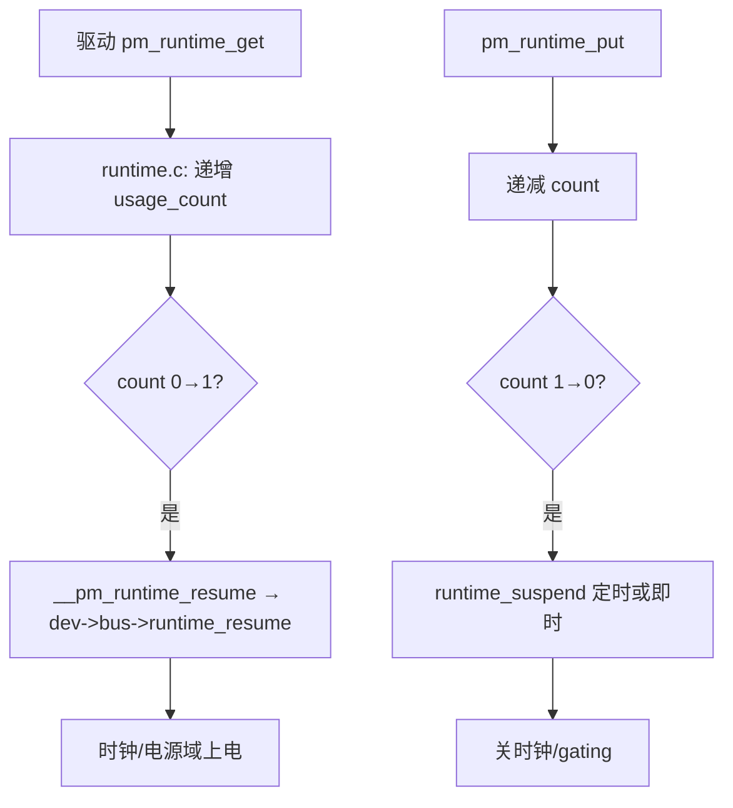
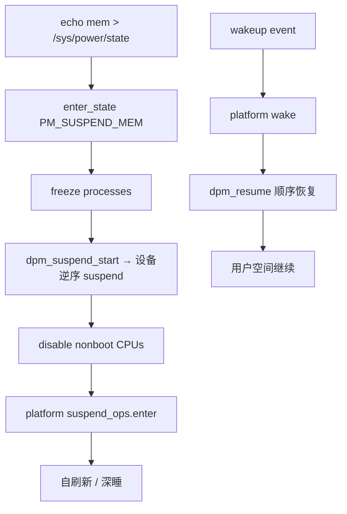

# 嵌入式低功耗设计完整篇：cpuidle、Runtime PM、Suspend 与 wakeup_sources 实测

产品待机电流标称 5 mA，实测 80 mA；内核日志显示 `suspend entry` 后秒醒；电池 overnight 耗尽——这类问题很少是「算法不省电」，而是 **Idle 状态未驻留、Runtime PM  refcount 泄漏、唤醒源误触发、漏电流硬件坑** 叠加。BSP 工程师调完 `echo mem > /sys/power/state` 就收工，现场却仍有 **USB VBUS 检测、GPIO 浮空、regulator always-on** 把 SoC 拽在 shallow idle。

本文沿 Linux **电源管理栈** 自顶向下：`cpuidle`（CPU 空闲）、`runtime PM`（设备动态）、**系统 suspend**（freeze + 深度睡眠）、**wakeup_sources**（谁阻止睡眠/谁唤醒），并专章 **漏电流陷阱** 与 **测量方法**（万用表、PMIC 计数、内核 trace）。源码锚点对齐 `drivers/cpuidle/`、`drivers/base/power/`、`kernel/power/`、`kernel/time/` 与 `Documentation/power/`，便于 `cat /sys/kernel/debug/wakeup_sources` 与 `powertop` 交叉验证。

---

## 源码锚点

| 路径 | 作用 |
|---|---|
| `drivers/cpuidle/cpuidle.c` | cpuidle 框架注册、governor |
| `drivers/cpuidle/governors/` | menu、ladder、haltpoll 等策略 |
| `drivers/idle/` / SoC `cpuidle-driver` | 平台 idle state 入口（WFI/PD） |
| `kernel/sched/idle.c` | idle 线程调用 `cpuidle_idle_call` |
| `drivers/base/power/runtime.c` | runtime PM：`pm_runtime_get/put` |
| `include/linux/pm_runtime.h` | 设备驱动 runtime API |
| `kernel/power/main.c` | `/sys/power/state`、suspend 入口 |
| `kernel/power/suspend.c` | 系统睡眠状态机 |
| `kernel/power/wakelock.c` (Android 遗留) | 部分厂商仍用；主线看 wakeup_source |
| `kernel/time/tick-sched.c` | NO_HZ idle 与 timer 唤醒 |
| `drivers/base/power/wakeup.c` | wakeup_sources 计数 |
| `Documentation/admin-guide/pm/` | 官方 PM 指南 |
| `Documentation/dev-tools/pm-graph` | suspend 可视化 |

## 调用链

### CPU 空闲：idle 线程到 cpuidle state

```mermaid
flowchart TD
    I[CPU 无 runnable 任务] --> IDLE[kernel/sched/idle.c: do_idle]
    IDLE --> CI[cpuidle_idle_call]
    CI --> GOV[governor: menu/ladder 选 state]
    GOV --> ENT[drv->enter(state)]
    ENT --> HW[WFI / cluster off / retention]
    HW --> IRQ[IRQ 或 timer 唤醒]
    IRQ --> EXIT[drv->exit → 返回 idle 循环]
```

### Runtime PM：设备 refcount 到电源域



### 系统 Suspend：mem 到 resume



---

## 重点知识

## 1. cpuidle：C-state 不是「一个开关」

每个 logical CPU 有 **idle driver** 注册的 state 表：`exit_latency`、`target_residency`、`power_usage`（mW 估计）。

Governor **menu**（默认）：权衡 **退出延迟** vs **节能**；短 idle 选 C1，长 idle 才 C6。

Governor **ladder**：按驻留时间逐级爬升 C-state；适合延迟敏感但又要深的场景。

**haltpoll**：虚拟化/Guest 场景忙等 hypervisor；裸机嵌入式通常不用。

观测：`/sys/devices/system/cpu/cpu0/cpuidle/state*/{name,latency,usage,time}`。

`usage`/`time` 可算各 state **驻留比例**——若 C1 占 99%，深 C-state 未生效。

Device Tree / ACPI _CST 提供 **硬件 idle 描述**；BSP 填错 latency 会导致 governor 永不选深 state。

 **`intel_idle` / `acpi_idle` / `psci_idle`**：ARM 常用 PSCI CPU_SUSPEND；理解 **cluster idle** vs **core idle**。

RT 场景：深 C-state 退出延迟 **数百 µs**；`intel_idle.max_cstate=0` 或 `idle=poll` 换确定性（费电）。

 **`cpuidle.use_halt`**：部分平台 WFI vs WFE 差异；Cortex-A 读 ARM DEN 手册。

```bash
# 查看 idle state
for s in /sys/devices/system/cpu/cpu0/cpuidle/state*; do
  echo "$(basename $s): $(cat $s/name) latency=$(cat $s/latency)us"
  echo "  time=$(cat $s/time) usage=$(cat $s/usage)"
done
# 强制浅 idle（调试）
# kernel cmdline: intel_idle.max_cstate=1 processor.max_cstate=1
```

## 2. Runtime PM：设备的「自动关灯」

`pm_runtime_enable(dev)` 后，驱动在 **访问硬件前** `pm_runtime_get_sync`，完成后 `pm_runtime_put`。

refcount 从 0→1 触发 **runtime_resume**；1→0 触发 **runtime_suspend**（可异步延迟 `autosuspend_delay_ms`）。

 **`pm_runtime_irq_safe`**：中断上下文可 get/put 的设备标记；否则 spinlock 路径违规。

总线级 **`pm_runtime_set_active`**：probe 时声明设备已上电，避免首次 get 冗余。

泄漏 **`pm_runtime_get` 无 put** → 设备永不停电；`grep pm_runtime` 驱动代码审查。

 **`runtime_suspended` sysfs** 与 **`/sys/devices/.../power/control`**：`on`/`auto`/`auto` 切换。

子设备 **genpd（generic power domain）**：父 domain off 则子设备不可访问；顺序由 **power domain 树** 决定。

DMA 活跃时 runtime suspend 必须 **quiesce DMA**；否则挂死或丢数据。

USB 网卡/调制解调器默认 **autosuspend**；`echo on > .../power/control` 可测对比电流。

I2C 传感器：`runtime_get` 在读前；批量采样时保持 get 直到 burst 结束，避免反复上电延迟。

```c
/* 驱动典型模式 */
static int foo_runtime_suspend(struct device *dev) {
    foo_clk_disable(dev);
    return 0;
}
static int foo_runtime_resume(struct device *dev) {
    return foo_clk_enable(dev);
}
/* probe: pm_runtime_enable(dev); dev_pm_set_driver_flags(dev, DPM_FLAG_SMART_PREPARE); */
```

## 3. 系统 Suspend：freeze、standby、mem

`/sys/power/state` 常见：`freeze`（挂起用户任务）、`mem`（suspend to RAM）、`disk`（hibernate）。

`echo mem` → `enter_state(PM_SUSPEND_MEM)` → `suspend_devices_and_enter`。

**Platform hook**：`suspend_ops->enter` 最后进 SoC 深睡；返回值决定 resume PC。

**Failed suspend**：dmesg `PM: Some devices failed to suspend` → 找 **第一个 `-EBUSY` 驱动**。

 **`/sys/power/pm_async`**：并行 suspend 设备；失败时改 0 便于定位。

 **`mem_sleep`**（`/sys/power/mem_sleep`）：`s2idle` vs `deep`；Intel **S0ix** vs S3。

ARM **suspend finisher** 汇编：CPU context 存 RAM，唤醒从 **reset vector 或 cpu_resume** 继续。

 **`noirq` / `early` resume 阶段**：中断仍关；驱动分阶段恢复。

Initramfs **resume** 与 encrypted swap hibernate 不在嵌入式常见路径。

测试脚本：循环 `rtcwake -m mem -s 10` 100 次，统计失败率与 **resume 耗时**。

## 4. wakeup_sources：谁不让睡、谁唤醒

```bash
cat /sys/kernel/debug/wakeup_sources
# name active_count event_count expire_count active_since total_time max_time last_change prevent_suspend_time
```

每个可唤醒设备注册 **wakeup_source**；`pm_wakeup_event` 在 IRQ 路径 **vote 保持 awake**。

`active_count` 递增表示 **持有 wakeup lock**；suspend 被 **abort** 若 `active` 非零（策略相关）。

 **`prevent_suspend_time`** 累计：找 **最大元凶**（常为 WLAN、USB、touch）。

Android 历史 **wakelock** 已迁移；厂商树可能仍有 `kernel/power/wakelock.c` 接口。

 **`/sys/power/wakeup_count`**：userspace 协调 **abort vs continue sleep** 的握手协议。

Timer：**tickless NO_HZ** 下 next timer 决定 **最早唤醒点**；`powertop` 显示 Timer wakeups。

 **`cat /proc/interrupts`** 对比 suspend 前后：哪个 IRQ 在涨。

GPIO 键误触：debounce 不足 → 频繁 **short wakeup**。

Ethernet **Magic Packet** / **`ethtool` wol** 配置影响 suspend 能否真睡。

## 5. 漏电流坑：硬件与软件交界

| 坑 | 机理 | 对策 |
|---|---|---|
| GPIO 浮空输入 | 施密特触发器振荡 → mA 级 | sleep 前设输出/上下拉 |
| 外设 VDD 常供 | MCU sleep 但 sensor 仍 10mA | load switch 断电源 |
| USB VBUS 检测 | PHY 部分上电 | suspend 前 usb phy shutdown |
| LED 背光 PWM 漏 | GPIO 高阻仍微亮 | 显式 disable regulator |
| I2C 上拉 + 漏电路径 | SDA/SCL 被拉偏 | 总线 idle 态规范 |
| regulator bypass 错 | LDO 反灌 | 硬件 review + `regulator-summary` |
| Tristate 未关 DMA | DRAM 刷新外 leak | 驱动 suspend 停 DMA |
| 看门狗未配 sleep | 周期唤醒 | WDT suspend 回调 |

软件 **假睡眠**：CPU cpuidle 深但 **外设 LED/USB** 仍全功率——测 **整机电流** 而非仅 CPU 域。

 **`/sys/kernel/debug/regulator/regulator_summary`**：谁 enabled、电压多少。

PMIC **fuel gauge** 与万用表串联对比；gauge 滤波慢，短 pulse 只看示波器电流探头。

Bootloader **未关 unused clock** → kernel 接手后仍漏；对比 **bare metal sleep** 电流。

多核 **CPU offline**：`echo 0 > /sys/devices/system/cpu/cpu3/online` 减 leakage（若业务允许）。

## 6. 测量方法：从粗测到归因

```bash
# 内核 suspend 统计
cat /sys/power/suspend_stats
# powertop 采样 wakeups
powertop --html=powertop.html --time=60
# pm-graph（需 boot trace_event）
# python src/pm-graph.py
# cpuidle 驻留
grep -r . /sys/devices/system/cpu/cpu*/cpuidle/state*/time
```

**万用表串联电池**：μA 档测 standby；注意表内阻影响 LDO 稳定性。

**电流探头 + 示波器**：看 suspend 瞬态、唤醒 spike（WLAN assoc 峰值）。

**PMIC 寄存器**：累计 sleep time；与 kernel `suspend_stats.success` 对照。

**分域测量**：SoC core vs 整板；定位 **外设板** 还是 **芯片内** 漏。

**对照实验**：最小 linux（init=/bin/sh）vs 全功能 rootfs，差值即 **软件贡献**。

**rtcwake 循环**：自动化 overnight 测试，log **`dmesg | grep PM:`**。

**Energy Model**（`Documentation/power/energy-model.rst`）：调度器选 CPU 频率的功耗模型，与 cpuidle 互补。

**thermal**：深睡后温降曲线间接验证 **真 sleep**（实验室环境）。

## 7. 配置与 Device Tree 要点

 **`cpu-idle-states`** 节点：latency、power-cost、local-timer-stop。

 **`power-domains`** + **`#power-domain-cells`**：驱动 `pm_runtime_get` 挂 domain。

 **`wakeup-source`** 属性：标记 GPIO/IRQ 可唤醒系统。

 **`keep-power-in-suspend`**：USB 等需在 sleep 维持供电的配置。

 **`status = "disabled"`** 未用外设：probe 不跑 = 少 runtime 错误。

Kernel cmdline：`mem_sleep=deep`、`console=ttynull`（减 UART 漏）、`loglevel=0`。

## 8. 故障现象对照

| 现象 | 根因方向 | 命令 |
|---|---|---|
| 无法 echo mem | active wakeup_source | debug/wakeup_sources |
| suspend 立刻 resume | IRQ storm / charger | /proc/interrupts |
| resume 后网卡失效 | 驱动 resume 顺序 | dmesg PM: |
| idle 电流仍高 | cpuidle C1 only | cpuidle state time |
| 某驱动 EBUSY | DMA 未停 | 驱动 suspend 日志 |
| overnight 耗电 | timer 周期唤醒 | powertop Timer |

## 9. 读码路线（kernel/power 与 runtime.c）

**suspend_enter**：`kernel/power/main.c` → `suspend_devices_and_enter` → 设备 `dpm_run_callback`。

**freeze**：`freeze_processes` → `try_to_freeze_tasks`；失败进程打印 comm。

**runtime_get**：`drivers/base/power/runtime.c`：`__pm_runtime_resume` 递归 parent domain。

**genpd**：`drivers/pmdomain/core.c`：domain 级 on/off 与 idle state。

**cpuidle trace**：`trace/events/power`：`cpu_idle` event；`perf record -e power:*`。

**clock framework**：`drivers/clk/clk.c`：`clk_disable_unused` 减 leak。

**regulator**：`drivers/regulator/core.c`：`regulator_disable` 与 bypass。

**devfreq**：动态调频与 idle 协同；GPU/DRAM 带宽影响 wakeup。

## 12. cpuidle governor：menu 如何选 state

menu governor（`drivers/cpuidle/governors/menu.c`）对每个 idle state 算 **expected duration** 与 **break-even residency**：若预测 idle 时间 < 进入深 C-state 的 **exit_latency + target_residency**，则选浅 state。

预测来自 **per-CPU idle 历史**（指数移动平均）；突发短 idle（如 100 µs timer）会 **钉在 C1**，深 C6 几乎无 usage。

调 `latency` 骗 governor：BIOS 填过大 exit_latency 会导致 **永不深睡**；填过小则频繁深睡 wake 抖动大。

RT 绑核核可 **`cpuidle.off=1`** 或限制 max_cstate；非 RT 核仍深睡省电。

## 13. `kernel/sched/idle.c` 调用链细节

**do_idle**

1. `tick_nohz_idle_enter` — NO_HZ 停 tick，算下一 timer 事件

2. `cpuidle_idle_call` — 选 state 并 enter

3. `arch CPU idle` — WFI/WFE 或 platform finisher

4. `local_irq_enable` — 唤醒后第一条路径

5. `need_resched` — 可能直接 schedule RT 任务

## 14. Runtime PM 状态机

```text
[runtime suspended] --get(usage 0->1)--> resume --> [active]
[active] --put(usage 1->0)--> idle --> (autosuspend delay) --> suspend callback --> [runtime suspended]
错误 get 无 put：永久 active，电流下不来
```

`pm_runtime_get_noresume` + 批量 `pm_runtime_resume` 用于 **同步路径** 减少中间状态。

`pm_request_idle` 提示可睡；驱动可选实现 `runtime_idle` 回调拒绝（`-EBUSY`）若 DMA 未完成。

`pm_runtime_barrier` 等待所有 pending resume 完成——suspend 前驱动应 call。

sysfs `power/runtime_active_time` / `runtime_suspended_time` 统计 ms 级占比。

## 15. 系统 Suspend 分阶段 dmesg 标签

```text
PM: suspend entry (deep)
PM: Syncing filesystems ...
Freezing user space processes ...
PM: suspend devices
Disabling non-boot CPUs ...
PM: suspend of devices complete
platform xyz_suspend_enter
PM: suspend exit
```

卡在 **Freezing** 某进程：`-f` 查 `cat /sys/power/pm_freeze_timeout`；`kill -9` 不够，需进程响应 freeze。

卡在 **suspend devices** 某驱动：`pm_debug_messages` 或 `initcall_debug` 风格逐设备 log。

**Successful suspend** 后电流应阶跃；若无阶跃，CPU 未真睡或 **外设仍大电流**。

## 16. wakeup_sources 字段详解

| 字段 | 含义 | 排障 |
|---|---|---|
| active_count | 当前 active 次数 | >0 阻止 sleep |
| event_count | 累计 wake 事件 | 找频繁唤醒源 |
| expire_count | timer 到期 | 对比 timer 风暴 |
| prevent_suspend_time | 累计阻止 sleep 时间 | 排序找元凶 |
| last_change | 上次状态变化 jiffies | 与 log 对齐 |

## 17. `/sys/power/wakeup_count` 握手协议

userspace 读 `wakeup_count` 得版本号 N，准备 sleep 前再读若仍为 N 则写 N 回；若 sleep 期间有 wakeup event，内核 bump count，写回失败 **abort sleep**。

systemd-logind、Android suspend 服务用此避免 **race**：刚准备睡就被 event 打断未察觉。

自写 sleep 脚本必须实现同样逻辑，否则 `echo mem` 后 **假成功** 实际 instant wake。

## 18. 漏电流：GPIO 与 schematic 级

CMOS 输入浮空：振荡电流可达 mA；sleep 前 **输出确定态** 或 **模拟输入关断**。

I2C 上拉通过 ESD 二极管灌电流到关断域；某些 sensor **真正 power off** 需 load switch。

LED 背光：PWM 停在高阻 **LED 仍微亮**；关 regulator + GPIO 低。

USB ID/VBUS 检测电路：suspend 后仍耗电；`usb_phy_shutdown` 与 **role switch** 配置。

SD 卡 CMD 线上拉：卡 sleep 命令未发则 **standby 电流 mA 级**；`mmc suspend` 路径。

## 19. 测量方法扩展

```bash
# 长时间平均 vs 峰值
# 万用表 uA 档 + 串 0.1Ω 测 drop 算电流（注意 DMM 带宽）
powertop --time=300 --html=p.html
cat /sys/power/suspend_stats
# Energy Model
cat /sys/devices/system/cpu/cpu*/cpu_capacity
```

**示波器电流探头**：看 suspend 瞬态是否 **spike 后 plateau**；plateau 高则 sleep 浅或 leak。

**PMIC fuel gauge**：积分电量与库仑计；适合 overnight；短 pulse 用 HW 探头。

**对照 bare metal**：只跑 WFI 的 ROM 测 **floor current**；Linux 目标 = floor + 软件 delta。

**温度**：25°C vs 85°C 漏电流差数倍；规格书标称常是 room temp。

## 20. Device Tree 示例片段

```dts
cpus {
    cpu@0 {
        cpu-idle-states = <&CPU_SLEEP_0 &CPU_SLEEP_1>;
    };
};
CPU_SLEEP_1: idle-state {
    compatible = "arm,idle-state";
    entry-latency-us = <300>;
    exit-latency-us = <500>;
    min-residency-us = <2000>;
};
uart0: serial@... {
    wakeup-source;
};
```

## 21. genpd 与 clock 门控

`drivers/pmdomain/core.c`：domain **on** 递归 parent；**off** 当所有 device usage=0。

`clk_disable_unused` 启动后关未引用 clock；驱动 probe 漏 `clk_prepare_enable` 则 **clock 常开** 耗电。

`devfreq` GPU/DRAM：idle 降频；resume 需 **settling time** 测延迟。

## 22. USB / WLAN 阻止 suspend 案例

USB autosuspend 默认 2s；`echo on > /sys/bus/usb/devices/.../power/control` 对比 **auto** 电流。

WLAN `wowlan` 配置不当：**频繁 magic packet** 试连导致 wake；关 scan 或 **fully disable** rfkill。

Bluetooth UART HCI 层 **未 sleep**；`btusb` suspend 回调失败看 dmesg `-EBUSY`。

## 23. ARM PSCI 与 CPU off

 **`CPU_OFF`** 比 WFI 更深；hotplug offline 非 boot CPU 减 **leak + dynamic**。

 **`CPU_SUSPEND`** 用于 idle state 深级；firmware 保存上下文。

PSCI 返回 **EINVAL** 常见：state id 与 DT 不一致。

## 24. x86 S0ix 与 embedded 平板

 **`mem_sleep=s2idle`**：现代 Intel 平板默认；**deep** 为传统 S3。

CSME/PMC firmware 参与；Linux 只 orchestrate；**instant wake** 查 EC firmware。

`cat /sys/kernel/debug/suspend_stats` 看 **last_failed_dev**。

## 25. 平台要点（各一段，非循环）

**i.MX8**：GPC + LPCG 门控；SNVS 做 RTC wake；DDR retention 需 `imx8m_pm` 正确 init。

**Rockchip RK3588**：multiple idle state；GPU power domain 独立；suspend 前 stop display pipeline。

**STM32MP157**：M4 跑 OpenAMP 时 A7 deep sleep 需 **remoteproc stop** 协议。

**TI AM62x**：DeepSleep0 要求 **DMA 通道全 release**；MCU GPIO wake 配置 wakecap。

**Raspberry Pi 4**：USB controller firmware；`dtparam=usb_power1` 与 suspend 互斥测试。

**NXP i.MX6ULL**：SNVS 按键 wake；`fec` 以太网 PHY 低功耗模式 `ethtool`。

**Qualcomm SD**：RPMh / RSC 电源；`msm_pm` 平台钩子；subsys restart 污染 wake count。

**Allwinner H616**：AR100 SCPI 协处理器 idle；错误 DT idle state 导致 **只 C0**。

## 26. Energy Model 与 scheduler

`Documentation/power/energy-model.rst`：EAS scheduler 用 **cost 表** 选 energy-efficient CPU。

与 cpuidle 独立：EAS 选 **哪个 CPU 跑任务**，cpuidle 选 **无任务时睡多深**。

embedded 若无 EM 表，可手动 ** cpufreq ondemand vs schedutil** 测功耗时延 tradeoff。

## 27. 低功耗回归测试脚本要点

```bash
for i in $(seq 1 50); do
  rtcwake -m mem -s 5
  grep -q 'PM: suspend exit' /var/log/kmsg || echo FAIL iter $i
done
awk '/state0/ {print}' /sys/devices/system/cpu/cpu0/cpidle/state*/usage
```

## 28. 现场问答

**Q: cpuidle usage 全 0？**

A: idle driver 未注册或 `intel_pstate` passive 模式；查 `cpuidle` debug。

**Q: runtime_suspended 永不 true？**

A: usage_count 泄漏；audit get/put 配对。

**Q: suspend 后 UART 无输出？**

A: resume 早期 console 未 restore；keep earlycon。

**Q: 电流锯齿波？**

A: 周期 timer/wifi beacon；powertop 找 wake/sec。

**Q: freeze 失败？**

A: 进程忽略 SIGFREEZE；D 状态不可 freeze。

**Q: RTC wake 提前？**

A: timezone/RTC 漂移；用 UTC 测。

**Q: regulator always-on？**

A: summary 里 enable count；驱动 probe 后 disable 测试。

**Q: GPU 休眠黑屏唤醒花屏？**

A: resume 顺序 framebuffer 先于 power；驱动 bug。

## 29. `tick-sched` 与 timer 唤醒

NO_HZ idle：`get_next_timer_interrupt` 决定 **最早 wake**；短 timer 钉浅 idle。

`timer_slack` 合并 timer 利于深睡但 **增加 RT jitter**——实时核设 slack 0。

 **`hrtimer`** 高精度 timer 阻止 long idle；查 `/proc/timer_list` next event。

## 30. 与驱动 PM 回调对照

| 回调 | 阶段 | 典型工作 |
|---|---|---|
| suspend | 系统 sleep | 停 DMA、保存寄存器 |
| resume | 系统 wake | restore、re-enable IRQ |
| runtime_suspend | 设备 idle | gate clock |
| runtime_resume | 首次访问 | ungate、复位序列 |
| prepare | suspend 前 | quiesce 用户可见 IO |

## 31. `intel_idle` 与 `acpi_idle`

 **`intel_idle`** 直接读 CPU MSR 进 C-state； **`acpi_idle`** 走 ACPI _CST；同机只注册其一为主。

 **`intel_pstate`** passive 模式下 idle 驱动仍工作； **`active`** 与 HWP 交互看内核文档。

## 32. `cpufreq` 与 idle 协同

 **`schedutil`** governor 用 utilization 选频；低负载降频 + 深 idle **叠加省电**。

 **`performance`** governor 锁最高频：idle 仍有效但 **dynamic power** 高——测 baseline 时注明 governor。

## 33. `freeze_super` 与文件系统

suspend 前 **sync + freeze fs**；NFS/overlay 可能 **EBUSY**；嵌入式 **squashfs root ro** 简化。

 **`no_suspend`** 挂载选项阻止 freeze；debug 临时 remount。

## 34. `wake_lock` 遗留（Android）

老 Android **`wakelock`** sysfs；新主线用 **wakeup_source** API 统一；移植 BSP 时查 **`/sys/power/wake_lock`** 是否仍存在。

## 35. RTC / alarmtimer 唤醒

```bash
rtcwake -m mem -s 3600
cat /sys/class/rtc/rtc0/wakealarm
```

 **`alarmtimer`** 子系统与 **hrtimer**；`rtcwake` 设 **RTC_WKALM**；时区错导致 **提前/延后 wake**。

## 36. GPIO keys 与 debounce

 **`gpio-keys`** 驱动 **`wakeup-source`**；debounce 在 DT **`debounce-interval-ms`**；太短 **抖动 wake**，太长 **UX 差**。

## 37. Display / DRM suspend

 **`drm_mode_config_helper_suspend`** 关 panel；resume **modeset** 失败黑屏——测 suspend 必测 **亮屏**。

MIPI DSI **ulps** 模式降 panel 功耗；与 **backlight regulator** 同步。

## 38. Ethernet PHY 低功耗

 **`ethtool -s eth0 wol g`** 与 **`power_down`**；PHY **energy detect** 仍耗电 mA 级。

车载 **partial networking** 标准；Linux **`phylib`** suspend 钩子。

## 39. MMC/SD suspend

 **`mmc_suspend`** 发 **CMD5 sleep**；未 suspend 卡 **standby 电流**；dmesg `mmc0: card never left busy`。

## 40. I2C/SPI 传感器 runtime PM 模板

```c
int read_sensor(struct device *dev) {
    pm_runtime_get_sync(dev);
    ret = i2c_smbus_read_word_data(...);
    pm_runtime_put_autosuspend(dev);
    return ret;
}
```

## 41. `clocksource` 与 deep idle

深 idle 可能 **停 local timer**；`local_timer_stop` 在 DT idle state；wake 后 **timekeeping jump** 由内核修正。

## 42. Thermal throttling vs power

 **thermal zone** 降频 ≠ suspend；高温 **shutdown** 与 **low power sleep** 不同机制——log 勿混淆。

## 43. Bootloader handoff 功耗

U-Boot **`fdt fixup`** 错误 **enable unused clock**；Linux 接手后 **`clk_disable_unused`** 仍可能漏 **bootloader 已开** 的外设。

## 44. 电流测量接线注意

串 ammeter 在 **电池正极**；表内阻导致 **LDO dropout** 变；uA 档 **burden voltage** 使 brownout。

用 **专用 fuel gauge IC** 分流电阻测 **大动态范围** 更准。

## 45. suspend 失败 log 片段解读

```text
PM: device 0000:01:00.0 failed to suspend: error -16
PM: Some devices failed to suspend, aborting
usb 1-1: rejected suspend, status -16
```

 **-EBUSY (-16)**：驱动拒绝；查该设备 **runtime resume 未完成** 或 **wake irq pending**。

## 46. cpuidle stats 导出脚本

```bash
paste <(for s in /sys/devices/system/cpu/cpu0/cpuidle/state*/name; do cat $s; done) \
      <(for s in /sys/devices/system/cpu/cpu0/cpuidle/state*/time; do cat $s; done) \
| awk '{printf "%s time=%s us\n", $1, $2}'
```

## 47. 低功耗 KPI 示例

| 指标 | 典型目标（IoT 举例） | 测法 |
|---|---|---|
| suspend 电流 | < 500 uA | 万用表 5min 平均 |
| idle 运行 | < 50 mA @ 3.7V | cpuidle 深 + runtime PM |
| wake 延迟 | < 500 ms | RTC 到 SSH up |
| suspend 成功率 | > 99.9% | rtcwake 循环 |

## 48. 与《实时系统》篇交叉

RT 任务 **禁止深 C-state** 的核应 **单独 cpumask**；其余核深睡—— **heterogeneous power**。

## 49. 术语

| 术语 | 含义 |
|---|---|
| STR | Suspend to RAM |
| STB | Standby 浅睡 |
| genpd | Generic power domain |
| autosuspend | runtime 延迟自动 suspend |

## 50. `device_link` 与 supplier 顺序

 **`device_link`** 保证 supplier **resume 先于** consumer；suspend **逆序**.

错误 link 导致 **consumer suspend 时 supplier 已 off** → -EIO 或 leak。

## 51. `simple-pm-bus`

简单总线 **runtime PM 透传**；I2C 子设备 idle 时 bus 可 autosuspend。

## 52. `power/domains` DT 绑定

 **`#power-domain-cells`**；驱动 **`pm_runtime_get` 挂 domain** 自动递归。

## 53. `cpuhp` 与 hotplug

 **`cpuhp`** 回调在 CPU online/offline；offline 减 leak，注意 **IRQ affinity** 迁移。

## 54. `suspend-to-idle` (s2idle)

 **freeze + cpuidle deep** 而非 platform suspend；某些 ARM64 默认；电流介于 idle 与 STR。

## 55. `hibernation` 简述

 **`disk` state** 写 swap；嵌入式 eMMC wear 大；IoT 少用，工业平板偶用。

## 56. WiFi `wowlan` 调试

 **`iw phy0 wowlan show`**；pattern 匹配 magic packet；错误 config **秒 wake**。

## 57. Bluetooth UART idle

 **`hci_uart`** suspend 前 **HCI_UART_SLEEP_IND**；协处理器固件需配合。

## 58. 充电 IC interrupt

 **charger plug IRQ** 为 wakeup_source；suspend 后插拔 USB **预期 wake**；误触发表皮电容。

## 59. 屏幕 always-on display

 **AOD** 模式 panel 自刷新；Linux 仍跑 **minimal wake**；与 **mem sleep** 不同产品态。

## 60. 电池曲线与 software fuel gauge

 **电压查表 SOC** 不如 **coulomb counter**；sleep 时 **自放电** 模型影响 UI 预测非 sleep 本身。

## 61. 实验室记录表字段

日期、内核 commit、DT 版本、温度、电池 SOC、平均/uA、peak/mA、suspend 次数、fail 原因。

## 62. `debugfs` cpuidle

部分平台 **`/sys/kernel/debug/cpuidle`** 额外统计；BSP 私有节点 **`lpm_stats`** 对照。

## 63. `kernel/reboot` 与 hard reset 电流

 **reboot** 路径未 power off 外设；测 **true ship mode** 需 PMIC **`POWER_OFF`** 命令。

## 64. 协处理器 firmware sleep

 **CM4/Tensilica** 侧固件未 sleep 时共享 regulator **无法 off**；双系统 PM 协议必备。

## 65. 低功耗 code review 三问

每个 `pm_runtime_get` 是否有配对 put；每个 wake IRQ 是否产品必需；GPIO 默认态是否与 schematic 一致。

## 66. `dev_pm_ops` 与 `->suspend` 返回值

返回 **-EBUSY** 中止全局 suspend；驱动应 **quiesce** 而非简单拒绝无 log。

## 67. `clock framework` debug

`/sys/kernel/debug/clk/clk_summary` 列 enabled count；找 **orphan enable** 耗电。

## 68. `regulator` modes

LPM、standby、bypass 模式 PMIC 差异大；`regulator_set_mode` 驱动可选实现。

## 69. `dmaengine` runtime

DMA 通道 active 时 **runtime_suspend -EBUSY**；先 **terminate_all** 再 suspend。

## 70. `irq wake` debug

`/sys/kernel/debug/irq/irq/N/wakeup`；误设 **IRQF_NO_SUSPEND** 阻止系统 sleep。

## 71. 电池 ship mode

PMIC **ship mode** 微安级；软件 **poweroff** 不等于 ship；长期仓储需硬件命令。

## 72. solar / energy harvest

间歇供电设备 **supercap** 电压窗；suspend 失败导致 **brownout reboot 循环** 测 log。

## 73. industrial 24V rail

非电池设备用 **inline meter**；PLC 场景 **resume** 时间比 uA 更关键 KPI。

## 74. `powertop` tunables

Powertop **Tunables** 列 **Bad** 建议；`echo auto > /sys/.../power/control` 批量脚本化。

## 75. kernel `suspend_stats` 字段

`fail`/`failed_freeze`/`failed_suspend`/`failed_resume` 分项计数；定位 **阶段回归**。

## 76. `cpufreq` debugfs

`/sys/devices/system/cpu/cpu0/cpufreq/stats/time_in_state` 驻留；与 cpuidle **独立维度**。

## 77. `idle_inject` 测试

 **`idle_inject`** 模块人为占 CPU；验证 **menu governor** 在负载变化下 behavior。

## 78. `PSCI` 版本差异

PSCI 0.2 vs 1.0 **STATEID** 编码；DT idle state index 与 firmware 契约。

## 79. `SCPI` / `SCMI` 电源

ARM server **`scmi`** 电源域；embedded MPSoC 亦见；msg 超时导致 **resume hang**。

## 80. 温湿度传感器 wake

定时采样 wake CPU；**batch 采样** 合并 I2C 事务减 wake 次数。

## 81. GPS / modem

modem **USB QMI** 保活阻止 autosuspend；飞行模式 **rfkill** 后测 baseline 电流。

## 82. CAN bus transceiver

 **`standby` pin** GPIO；sleep 前 **STB=1**；否则 transceiver mA 级。

## 83. 音频 codec

 **`snd_soc` runtime PM**；playback 停止后 **dapm** 事件关 path；pop 音与 power 序。

## 84. FPGA partial reconfig

FPGA 区 **未 power gate** 时 static power 高；与 Linux idle 正交，hardware 方案。

## 85. 最终验收命令串

`powertop --auto-tune; rtcwake -m mem -s 30; cat /sys/power/suspend_stats; cat debug/wakeup_sources` 一条 night run。

## 87. 命令速查（PM）

```bash
cat /sys/power/state /sys/power/mem_sleep 2>/dev/null
cat /sys/power/wakeup_count
cat /sys/kernel/debug/wakeup_sources 2>/dev/null | head -30
grep . /sys/devices/system/cpu/cpu*/cpuidle/state*/name
powertop --time=30 --html=pt.html
find /sys/devices -name control -path '*/power/*' | head
grep . /sys/class/regulator/regulator*/name 2>/dev/null | head
cat /sys/power/suspend_stats
rtcwake -m show
ethtool eth0 | grep Wake-on
cat /proc/timer_list | head -40
echo 0 > /sys/devices/system/cpu/cpu3/online  # 若允许
cat /sys/kernel/debug/regulator/regulator_summary 2>/dev/null | head -40
grep . /sys/devices/system/cpu/cpu0/cpufreq/scaling_governor
for d in /sys/bus/i2c/devices/*; do echo $d $(cat $d/power/runtime_status 2>/dev/null); done
```

overnight 测试：`while sleep 300; do rtcwake -m mem -s 10; cat suspend_stats | tail -1; done` 写 log。

电流与 log 时间戳对齐：串口 `date` 与万用表记录同一时刻，便于把 **wake 事件** 对上 dmesg。

## 88. 典型 dmesg 成功 suspend 片段

```text
PM: suspend entry (deep)
PM: Syncing filesystems ... done.
Freezing user space processes ... (elapsed 0.012 seconds) done.
PM: suspend of devices complete after 0.891 msecs
Disabling non-boot CPUs ...
PM: suspend exit
```

若 **suspend entry** 后立即 **suspend exit** 无中间 deep 平台 log，查 **instant wake** 与 wakeup_sources。

resume 后第一次 `cat cpuidle/state*/time` 应延续累计；归零说明 **stats 未保留** 或 CPU hotplug。

## 89. 功耗归因决策树（文字版）

```text
idle 电流高 → cpuidle 是否深 state 有 time?
  否 → governor/RT max_cstate/错误 latency
  是 → runtime PM 是否 active? → wakeup_sources 谁 active?
suspend 失败 → dmesg 哪一阶段? → 对应驱动 EBUSY
睡但秒醒 → /proc/interrupts diff + timer_list
```

## 90. 与 cpuidle 相关的 kernel 参数

 **`processor.max_cstate=1`**、**`intel_idle.max_cstate=0`**：限制 C-state 深度；RT 与 sleep 调试常用。

 **`idle=poll`**：idle 线程 busy-loop，几乎不进 cpuidle；功耗最大但 wake latency 最低。

 **`nohz_full=`** 与 **`rcu_nocbs=`**：减少 timer tick 打断 idle；与《实时调度》isolcpus 组合。

 **`mem_sleep_default=deep`**（若内核支持）：默认 mem 走 deep 而非 s2idle；平板产品常用。

## 86. 低功耗设计流程（工程序）

1. 基线测量：boot 后 idle 5 min 测 **静态电流**。

2. cpuidle 分布：确认深 state 有 **time 增长**。

3. runtime PM：逐设备 `power/control` 实验。

4. suspend：通过 wakeup_sources 清零后 **mem sleep**。

5. 漏电流：硬件 review GPIO/regulator。

6. 回归：OTA 后重复；防止新驱动 **get 无 put**。

7. 文档：记录 **acceptable 电流** 与 **测试夹具** 接线。

深睡验收除 uA 数字外，应记录 **resume 耗时** 与 **功能恢复**（网卡/WiFi/屏）；否则「能睡但不可用」仍不合格。

BSP 升级对比：保存旧版 **`cpuidle/state*/time`** 与 **`suspend_stats`** 快照，回归 diff 定位 PM 回退。

与《嵌入式调试完整篇》联动：suspend 失败时 **`pm_debug_messages`**、**`ftrace power:*`** 与 **`dmesg PM:`** 同抓。

硬件与软件分界：若 **bare metal WFI** 电流已高，先修 schematic/regulator；Linux PM 只能省 SoC 之上软件可控部分。

文档化 **wake source 列表**（RTC/GPIO/USB/WLAN）与产品 **允许睡/不允许睡** 状态机，避免测试与需求不一致。

测电流时关闭 **充电回路** 或记录 **charge/discharge** 方向；否则万用表读数为充电机灌电流而非负载。

 **`echo freeze > /sys/power/state`** 仅冻结用户态，适合区分 **用户进程 timer** 与 **内核/device wake** 而不进深睡。

车载 **ACC off** 场景记录 **STR 次数** 与 **eMMC 写入**；频繁 STR 磨损存储，产品可能选 **浅睡 + 关屏** 而非 mem sleep。

---

## 小结

低功耗是 **cpuidle 驻留 + runtime PM refcount 归零 + suspend 无 stray wakeup + 硬件无漏** 的乘积；单点优化往往不够。

归因顺序：先看 **`wakeup_sources` 与 cpuidle time**，再 **`regulator_summary` 与电流波形**，最后读 **`kernel/power/suspend.c`** 与驱动 suspend 回调。测量务必 **整机** 且 **长时间**，短采样会被 average 欺骗。

读码主线：`kernel/sched/idle.c` → `cpuidle_idle_call`；`drivers/base/power/runtime.c` → get/put；`kernel/power/suspend.c` → `enter_state`。

验收交付物建议包含：idle/suspend 电流曲线截图、cpuidle 驻留比例、`suspend_stats` 与 wakeup_sources 清零证明。

Powertop **Wakeups/sec** 从 500 降到 50 通常比再抠 1 mA idle 更易见效——先减 wake 再抠 deep sleep。

