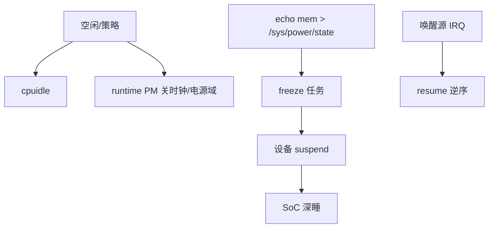

# 嵌入式低功耗：休眠、时钟门控与唤醒源

续航差、休眠进不去、唤醒后外设异常，要同时看 **CPU 空闲、运行时 PM、系统 suspend、唤醒源与固件**。

## 源码锚点

| 路径 / 手册 | 作用 |
|-------------|------|
| `Documentation/power/` | 电源管理文档 |
| `kernel/power/` | suspend 流程 |
| `drivers/base/power/` | runtime PM |
| `/sys/power/state` | 用户态触发休眠 |

## 调用链



## 重点知识

```bash
cat /sys/power/state
cat /sys/devices/system/cpu/cpu0/cpuidle/state*/name
cat /proc/interrupts
# wakeup
cat /sys/kernel/debug/wakeup_sources 2>/dev/null
```

### 常见坑

- USB/网卡阻止 suspend。
- RTC 唤醒时间错。
- 休眠前未关外设导致漏电流。

先测各 cpuidle 状态驻留时间，再谈整机 sleep 电流。
