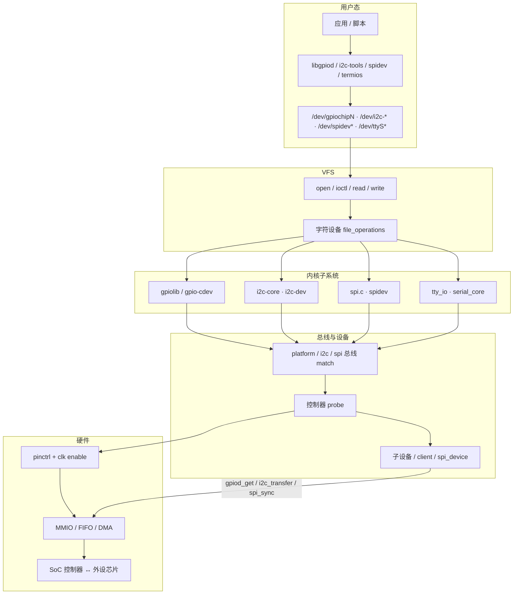
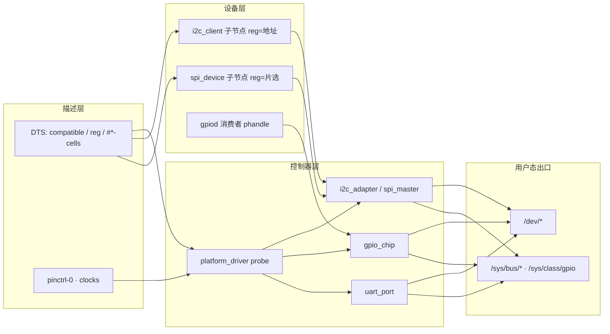
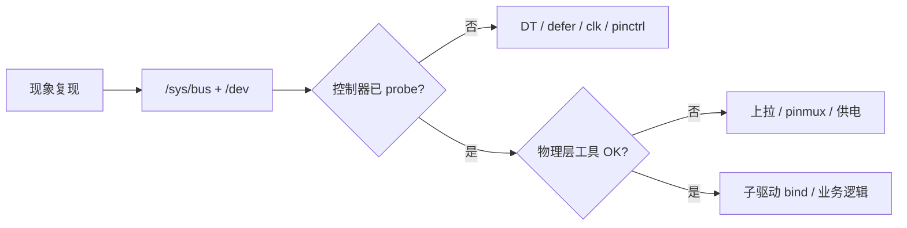

# 嵌入式外设接口完整篇：GPIO、I2C、SPI、UART 驱动路径与排障

板级 bring-up 里最高频的四类外设是 **GPIO、I2C、SPI、UART**：设备树写了节点却不出 `/dev`、示波器波形正常但 `i2cdetect` 扫不到、SPI 读全 `0xFF`、串口乱码——根因往往不在「业务驱动第一行」，而在 **DT binding → 控制器 probe → 子系统核心 → 用户态节点** 链路上某一环断裂。GPIO 还涉及 pinctrl 复用与时钟门控；I2C/SPI 还涉及上拉、速率与 DMA 一致性；UART 还涉及 baud/clock 源与 termios。

本文合并嵌入式系统 chapter 041–046（源文为提纲），按 Linux 主线内核路径，把四类接口的 **源码锚点、调用链、DT 绑定、用户态接口、时钟/引脚复用、常见坑** 合成一篇可对照验证的闭环。

---

## 源码锚点

| 路径 | 作用 |
|------|------|
| `drivers/gpio/gpiolib.c` / `gpiolib-of.c` | GPIO 控制器注册、`gpiochip_add_data`、OF 解析 |
| `include/linux/gpio/consumer.h` | **`gpiod_get`** / `gpiod_direction_*` / `gpiod_set_value` 消费者 API |
| `drivers/gpio/gpio-cdev.c` | 用户态 **`/dev/gpiochipN`** 字符设备（替代 sysfs GPIO） |
| `drivers/i2c/i2c-core-base.c` | I2C 核心：`i2c_add_adapter`、`i2c_register_driver` |
| `drivers/i2c/i2c-core.h` | **`i2c_transfer`**、`i2c_msg` 封装 |
| `drivers/spi/spi.c` | SPI 核心：**`spi_sync`** / `spi_async`、`spi_message` 队列 |
| `drivers/spi/spi-gpio.c` 等 | bit-bang 与 SoC 控制器示例 |
| `drivers/tty/serial/serial_core.c` | UART 注册、`uart_register_driver`、`uart_add_one_port` |
| `drivers/tty/serial/*.c` | 各 SoC **`8250`/vendor UART** platform 驱动 |
| `drivers/tty/tty_io.c` | TTY 层 → **`/dev/ttyS*`** |
| `drivers/pinctrl/` | 引脚复用：`pinctrl-*` DT 属性解析 |
| `drivers/clk/` | 时钟：`clocks` / `clock-names` 消费者 |
| `Documentation/devicetree/bindings/gpio/gpio-controller.yaml` | GPIO binding |
| `Documentation/devicetree/bindings/i2c/i2c-controller.yaml` | I2C 控制器 binding |
| `Documentation/devicetree/bindings/spi/spi-controller.yaml` | SPI 控制器 binding |
| `Documentation/devicetree/bindings/serial/serial.yaml` | 串口通用 binding |

核心 API 形态（驱动侧）：

```c
/* GPIO 消费者 — include/linux/gpio/consumer.h */
struct gpio_desc *gpiod = gpiod_get(dev, "reset", GPIOD_OUT_LOW);
gpiod_set_value(gpiod, 1);

/* I2C — drivers/i2c/i2c-core-base.c */
struct i2c_msg msg = { .addr = client->addr, .flags = 0,
                       .len = 2, .buf = buf };
ret = i2c_transfer(adap, &msg, 1);

/* SPI — drivers/spi/spi.c */
struct spi_transfer xfr = { .tx_buf = tx, .rx_buf = rx, .len = len };
struct spi_message msg;
spi_message_init(&msg);
spi_message_add_tail(&xfr, &msg);
ret = spi_sync(spi, &msg);
```

---

## 调用链

### 用户态 → 子系统 → 控制器（主路径）



### 总线分层与 DT 数据流



---

## 重点知识

### 1. 四类接口在驱动模型中的位置

| 接口 | 总线类型 | 控制器对象 | 挂载设备 | 驱动入口 |
|------|----------|------------|----------|----------|
| GPIO | platform（常见） | `struct gpio_chip` | 无独立 client；其他驱动 `gpiod_get` | `gpio_chip` 注册 |
| I2C | `i2c` | `struct i2c_adapter` | `struct i2c_client`（DT 子节点） | `i2c_driver.probe` |
| SPI | `spi` | `struct spi_master` | `struct spi_device` | `spi_driver.probe` |
| UART | platform | `struct uart_port` | 无；TTY 统一导出 | `platform_driver` + `serial_core` |

共性：控制器 **probe 前** 通常要 `clk_get` + `pinctrl_select_state`；依赖未就绪返回 `-EPROBE_DEFER`（见 `drivers/base/dd.c`）。子设备（I2C 传感器、SPI Flash）的 `compatible` 与 **`reg`（地址/片选）** 必须与 binding 一致，否则控制器起来了，子驱动永不 bind。

### 2. 设备树 binding 要点

**GPIO 控制器**（`gpio-controller.yaml`）：

```dts
gpio0: gpio@40020000 {
	compatible = "vendor,soc-gpio";
	reg = <0x40020000 0x1000>;
	gpio-controller;
	#gpio-cells = <2>;   /* pin, flags — 常用 GPIO_ACTIVE_LOW 等 */
	interrupt-controller;
	#interrupt-cells = <2>;
	clocks = <&clk_gpio>;
	pinctrl-names = "default";
	pinctrl-0 = <&gpio0_pins>;
};
/* 消费者 */
sensor {
	reset-gpios = <&gpio0 12 GPIO_ACTIVE_LOW>;
};
```

**I2C 控制器 + 子设备**（`i2c-controller.yaml`）：

```dts
i2c0: i2c@40030000 {
	compatible = "vendor,soc-i2c";
	reg = <0x40030000 0x1000>;
	#address-cells = <1>;
	#size-cells = <0>;
	clock-frequency = <400000>;   /* 100k / 400k / 1M */
	eeprom@50 {
		compatible = "vendor,eeprom";
		reg = <0x50>;             /* 7-bit 地址 */
	};
};
```

**SPI 控制器 + 子设备**（`spi-controller.yaml`）：

```dts
spi0: spi@40040000 {
	compatible = "vendor,soc-spi";
	reg = <0x40040000 0x1000>;
	#address-cells = <1>;
	#size-cells = <0>;
	cs-gpios = <&gpio0 5 GPIO_ACTIVE_LOW>;
	flash@0 {
		compatible = "jedec,spi-nor";
		reg = <0>;                /* 片选号 */
		spi-max-frequency = <50000000>;
	};
};
```

**UART**（`serial.yaml` + 厂商 binding）：

```dts
uart0: serial@40050000 {
	compatible = "vendor,soc-uart", "ns16550a";
	reg = <0x40050000 0x1000>;
	interrupts = <GIC_SPI 45 IRQ_TYPE_LEVEL_HIGH>;
	clocks = <&clk_uart>;
	current-speed = <115200>;     /* 部分 binding 支持默认波特率 */
	pinctrl-names = "default";
	pinctrl-0 = <&uart0_pins>;
	status = "okay";
};
```

排障先核对：`status = "okay"`、`#address-cells`/`#size-cells`、子节点 `reg` 是否与硬件跳线/原理图一致。

### 3. 用户态 `/dev`、libgpiod 与 i2c-tools

| 接口 | 节点 | 典型工具 | 说明 |
|------|------|----------|------|
| GPIO | `/dev/gpiochipN` | **libgpiod** `gpiodchip_open` | 新接口； sysfs export 已废弃 |
| I2C | `/dev/i2c-N` | **i2c-tools** / `i2cdetect` | 需 `CONFIG_I2C_CHARDEV` |
| SPI | `/dev/spidevB.C` | `spidev_test` | 需 `CONFIG_SPI_SPIDEV`；生产多用内核驱动 |
| UART | `/dev/ttyS0` 等 | `stty` / `minicom` | 由 `serial_core` + TTY 层创建 |

**libgpiod** 用户态 API（对应 `drivers/gpio/gpio-cdev.c` 的 `GPIO_V2_*` / 传统 `GPIO_*` ioctl）：

```c
struct gpiod_chip *chip = gpiod_chip_open("/dev/gpiochip0");
struct gpiod_line *line = gpiod_chip_get_line(chip, 12);
gpiod_line_request_output(line, "myapp", 0);
gpiod_line_set_value(line, 1);
gpiod_line_release(line);
gpiod_chip_close(chip);
```

**libgpiod 命令行**（包名通常 `gpiod` 或 `libgpiod-tools`）：

```bash
gpioinfo                     # 列出所有 gpiochip 与各线状态
gpioget gpiochip0 12         # 读单线
gpioset gpiochip0 12=1       # 写单线
gpiofind LED_RED             # 按 hog/consumer 名查找（若内核导出）
gpio-event gpiochip0 12 rising   # 边沿监视，验证中断 GPIO
```

**i2c-tools** 常用命令（对应 `drivers/i2c/i2c-dev.c` 用户态入口）：

```bash
i2cdetect -y 0               # 扫描 bus 0 上 7-bit 地址（-- 表示无设备）
i2cdump -y 0 0x50            # 读 EEPROM 等（谨慎：部分设备 side-effect）
i2cget -y 0 0x50 0x00        # 读单字节寄存器
i2cset -y 0 0x50 0x00 0x55   # 写单字节
i2ctransfer -y 0 w2@0x50 0x00 0x00 r16  # 复合传输，贴近 i2c_msg
```

权限：Debian/Ubuntu 常需用户加入 **`i2c`** 组；GPIO 字符设备默认 root，生产用 udev 规则或 systemd 授权。`i2cdetect` 扫到 `--` 只说明 **该地址无 ACK**，不能代替子驱动已 bind——还需 `ls /sys/bus/i2c/devices/` 看 `0-0050` 等目录是否存在。

验证节点与内核状态：

```bash
ls -l /dev/gpiochip* /dev/i2c-* /dev/ttyS* /dev/spidev*
ls /sys/bus/i2c/devices/
ls /sys/bus/spi/devices/
cat /sys/kernel/debug/gpio  2>/dev/null
stty -F /dev/ttyS0 115200 cs8 -cstopb -parenb
```

### 4. 时钟、引脚复用（pinctrl）与 pinmux 排障

四类控制器 probe 内常见顺序：

1. `devm_clk_get(dev, "bus")` → `clk_prepare_enable`
2. `devm_pinctrl_get` → `pinctrl_select_default_state`（或 `pinctrl_select_state(..., "default")`）
3. `devm_ioremap_resource` / `platform_get_irq`
4. 注册子系统（`i2c_add_adapter` / `spi_register_master` / `gpiochip_add` / `uart_add_one_port`）

**pinctrl / pinmux 排障**：设备树里 `pinctrl-0 = <&uart0_pins>` 只表示「引用哪个配置组」；真正生效取决于 probe 是否调用 `pinctrl_select_default_state`，以及 **pinmux 是否把 PAD 从 GPIO 默认态切到 AF（Alternate Function）**。若漏切，示波器上 TX/RX 引脚无翻转，或 I2C 始终高电平。

| 现象 | 根因 | 核对命令 |
|------|------|----------|
| 控制器 probe 成功但总线无波形 | pinctrl 仍 GPIO 输入，未 AF | `pinmux-pins` 看 function |
| UART TX 常高、无起始位 | TX 未 mux 到 UART 外设 | 对照 TRM pinmux 表与 DTS |
| I2C SCL/SDA 浮空 | 未开漏 + 无外部上拉 | 万用表测 idle 电平 |
| SPI MISO 恒 1 | CS 引脚仍为 GPIO | `cs-gpios` + pinctrl 中 CS 组 |
| `-EPROBE_DEFER` 循环 | pinctrl/clk 提供者未加载 | `dmesg \| grep defer` |

```bash
# pinmux 当前状态（路径因 SoC 而异）
cat /sys/kernel/debug/pinctrl/*/pinmux-pins 2>/dev/null
cat /sys/kernel/debug/pinctrl/*/pins 2>/dev/null

# 时钟树
cat /sys/kernel/debug/clk/clk_summary 2>/dev/null
cat /sys/kernel/debug/clk/clk_orphan_summary 2>/dev/null

dmesg | grep -iE 'pinctrl|pinmux|clk|defer'
```

**与设备树交叉验证**：在 `*.dtsi` 中 `uart0_pins` 组通常含 `mux`（function + pin）与可选 `conf`（drive-strength、slew-rate）。若 `compatible` 指向的 pinctrl 驱动未 built-in / 模块未加载，consumer 会 defer。排障时 **先证明 pinctrl 驱动已 probe**，再查 consumer 的 `pinctrl-0` phandle 是否指向正确 bank。

UART 波特率由 **`uartclk`（或 `clk_get_rate`）** 与分频寄存器共同决定；DT 只写 `current-speed` 不够，还要确认时钟源频率与驱动计算公式一致。

### 4.1 常见 SoC 时钟门控（clock gating）

现代 SoC 外设时钟多级门控以降功耗；驱动 **未 `clk_enable` 时寄存器访问可能挂死或读 0**。

| 层级 | 典型 DT 属性 | 驱动 API | 现象 |
|------|--------------|----------|------|
| 根 OSC / PLL | `clocks = <&osc>` | `clk_get_rate` | 整片外设频率错 |
| 总线门控 | `clock-names = "apb"` | `devm_clk_get(..., "apb")` | MMIO 读写超时 |
| 外设门控 | `clock-names = "periph"` | `clk_prepare_enable` | probe 成功无中断 |
| 波特率分频 | `uartclk` | `serial_core` 计算 divisor | 串口乱码 |

**STM32/i.MX/RK 等共性**：`clk_summary` 中若某时钟 **enable_count=0** 但驱动声称已 enable，检查是否用了错 `clock-names` 字符串（与 DTS 逐字一致）。动态频率缩放（CPUFreq）可能改变 APB 分频，UART 驱动须实现 `uart_clk_change` 或固定 `assigned-clocks` 在 bring-up 阶段。

```dts
/* 示例：显式打开并固定 I2C 时钟 */
i2c0: i2c@40030000 {
	clocks = <&cru CLK_I2C0>, <&cru PCLK_I2C0>;
	clock-names = "i2c", "pclk";
	assigned-clocks = <&cru CLK_I2C0>;
	assigned-clock-rates = <100000000>;
};
```

### 5. GPIO：gpiolib 与消费者模型

- 控制器驱动向 gpiolib 注册 `gpio_chip`（`drivers/gpio/gpiolib.c`）。
- 其他驱动通过 **`gpiod_get(dev, "foo", flags)`** 按名字取线，内核负责 translate DT `*-gpios`。
- 用户态走 **gpio-cdev**（`/dev/gpiochipN`），不再推荐 sysfs `/sys/class/gpio/export`。
- **gpio-hog**：启动时占线（如保持 Flash 片选高），在 GPIO 控制器节点内描述。

驱动内优先 `gpiod_*` 而非 legacy `gpio_request` + 全局 GPIO 号；全局号在不同板间不稳定。

### 6. I2C：`i2c_transfer` 与适配器模型

调用链：`i2c_driver.probe` → 业务读写 → **`i2c_transfer(adapter, msgs, n)`** → 适配器 `algo->master_xfer` → SoC 寄存器/DMA。

要点：

- `i2c_msg.addr` 为 **7-bit 地址**（内核内部表示，与 `i2cdetect` 列一致）。
- `I2C_M_RD` 置位表示读；复合传输用多条 `i2c_msg`（先写寄存器地址再读数据）。
- SMBus 助手 `i2c_smbus_read_byte_data` 等封装在 `i2c-smbus.c`，仍底层走 transfer。
- 多主机、时钟拉伸：硬件需支持；软件 bit-bang 速率受限。

### 7. SPI：`spi_sync` 与片选

调用链：`spi_driver.probe` → 构造 `spi_transfer` → **`spi_sync(spi, &msg)`** → `master->transfer_one_message` → 硬件 FIFO/DMA。

要点：

- 片选由 **`spi_device` 的 `chip_select`**（DT `reg`）+ 可选 **`cs-gpios`** 共同决定。
- `spi-max-frequency` 是上限；实际速率取控制器能力与设备要求的最小值。
- 模式 `SPI_MODE_0..3` 由 `spi->mode` 与 DT `spi-cpha`/`spi-cpol` 设置。
- **`spidev`** 仅供调试；量产 Flash/传感器应有内核驱动，避免用户态裸写时序。

### 8. UART：serial_core 到 TTY 与 RS485

调用链：platform UART `probe` → 填 `uart_port`（`iotype`、`uartclk`、`ops`）→ **`uart_add_one_port`** → `serial_core` 注册 → **`tty_register_driver`** → `/dev/ttyS*`。

要点：

- `drivers/tty/serial/8250/` 与 vendor 驱动共用 `serial_core` 框架。
- 用户态 **`termios`**（`cfsetispeed`、`CS8`、无奇偶）须与硬件一致。
- 控制台 UART 与业务 UART 混淆时，检查 `console=ttyS0` 与 `status`。

**RS485 半双工**：物理层一对线收发电平互斥，须控制 **DE/RE（Driver Enable / Receiver Enable）** 引脚。Linux 常见三种接入：

1. **设备树 + 驱动内建**：`linux,rs485-enabled-at-boot-time`、`<rs485>` 子节点（见 `Documentation/devicetree/bindings/serial/rs485.txt`），驱动在 `start_tx`/`stop_tx` 回调里切 GPIO。
2. **`TIOCSRS485` ioctl**（`include/uapi/linux/serial.h`）：用户态或 `stty` 扩展配置 RTS 作 DE。
3. **`serdev`**：Modbus 等协议栈挂 UART 从设备，由 `serdev_controller` 统一管理收发时序。

```dts
uart1: serial@40051000 {
	compatible = "vendor,soc-uart";
	pinctrl-names = "default", "rs485";
	pinctrl-0 = <&uart1_pins>;
	pinctrl-1 = <&uart1_rs485_de_pins>;
	linux,rs485-enabled-at-boot-time;
	rs485-rts-delay = <0 0>;
	rs485-rx-during-tx;
	de-gpios = <&gpio0 8 GPIO_ACTIVE_HIGH>;
};
```

排障 RS485：**乱码 + 只收不发** 多为 DE 时序过早关闭；**总线冲突** 多为 DE 常开或未接终端电阻（120Ω）。用示波器同时看 A/B 差分与 DE 脚，对比驱动 `rs485-rts-delay` 是否与从机 turnaround 时间匹配。

### 9. DMA 与 PIO：机制对比与选型

| 维度 | PIO（Programmed I/O） | DMA |
|------|----------------------|-----|
| CPU 参与 | 每字节/字读写在 CPU | DMA 引擎搬数据，CPU 仅启停 |
| 延迟 | 小包低延迟 |  setup 开销，大包占优 |
| 实现 | `readb`/`writeb` 或 FIFO 轮询 | `dma_request_chan` + `dmaengine` |
| 缓存 | 无一致性坑 | 须 `dma_map_single` / coherent |
| 失败回退 | 默认路径 | 驱动常 `if (!dma) fallback pio` |

**内核路径**：I2C/SPI/UART 控制器驱动在 probe 解析 `dma-names = "tx", "rx"`（`Documentation/devicetree/bindings/dma/dma.txt`），调用 `dma_request_chan(dev, "tx")`；传输时在 `master_xfer` / `transfer_one` 内提交 `dmaengine_prep_slave_single`，完成回调里唤醒等待线程。

**典型现象对照**：

| 现象 | PIO 路径 | DMA 路径 |
|------|----------|----------|
| 小长度读写 | 正常 | 可能因 cache 未 flush 花数据 |
| 大长度传输 | CPU 占用高 | 正常，IRQ 完成 |
| probe 失败 | 少见 | `dma_request_chan` 失败且无 fallback |
| 调试手段 | 驱动模块参数 `use_dma=0` | `dmesg` 查 `dmaengine` |

```bash
ls /sys/kernel/debug/dmaengine/
cat /sys/kernel/debug/dmaengine/summary 2>/dev/null
```

**一致性原则**：TX 前 `dma_sync_single_for_device`；RX 后 `dma_sync_single_for_cpu`。ARM 非 coherent DMA 区若漏 sync，表现为 **PIO 正常、DMA 随机错字节**——排障时临时关 DMA 是最快二分法。

### 10. 常见坑：上拉、速率（补充）

**上拉（I2C / 开漏 GPIO）**

- I2C SDA/SCL 必须 **上拉**（通常 2.2k–4.7kΩ 到 IO 电压）；仅依赖 SoC 内部弱上拉往往不够，表现为 `i2cdetect` 间歇性全屏或 ACK 失败。
- GPIO 开漏输出需外部上拉 + `GPIOD_OPEN_DRAIN`；推挽误配可能与外设冲突。

**速率**

- I2C：超过 **`clock-frequency`** 或走线电容过大 → 波形圆角、无 ACK；先用 100kHz 验证。
- SPI：超过 **`spi-max-frequency`** 或走线过长 → MISO 采样错位，读 `0x00`/`0xFF`；降频、改 `SPI_MODE`、缩短走线。
- UART：波特率误差 > ~2% 乱码；核对 `uartclk` 能否整除目标 baud

### 11. 最小 probe 失败对照表

Bring-up 时按 **「有无 dmesg 错误 → sysfs 是否注册 → /dev 是否出现」** 三级缩小范围：

| 阶段 | 失败征象 | 优先查 | 典型 dmesg / 状态 |
|------|----------|--------|-------------------|
| ① OF 解析 | 无 platform 设备 | `status`、`compatible` 拼写 | devicetree 下无对应节点 |
| ② 依赖 defer | 反复 probe | `clocks`/`pinctrl` 提供者 | `deferred probe pending` |
| ③ clk/pinctrl | `-EINVAL` probe 失败 | `clock-names` 与驱动一致 | `Failed to get clk` |
| ④ MMIO/IRQ | `-ENOMEM`/无中断 | `reg`、`interrupts` GIC 号 | `unable to map` |
| ⑤ 控制器注册 | 无 `/dev/i2c-0` | `i2c_add_adapter` 返回值 | adapter 不在 sysfs |
| ⑥ 子设备 bind | 有 adapter 无 driver | 子节点 `compatible` | `i2c 0-0050` 无 driver 链接 |
| ⑦ 用户态节点 | 无 spidev | `CONFIG_SPI_SPIDEV` | 内核驱动占满 cs |
| ⑧ GPIO 消费者 | `gpiod_get -ENOENT` | `reset-gpios` 名字 | `-gpios` 与驱动第二参不一致 |

**最小验证脚本**（不依赖业务驱动）：

```bash
ls /sys/bus/platform/devices/ | grep -E 'i2c|spi|serial|gpio'
i2cdetect -y 0
gpioinfo | head
dmesg | tail -50 | grep -iE 'probe|defer|error|fail'
```

若 ① 失败，确认编译进内核的 DTB 与编辑的 DTS 一致（改 DTS 未 rebuild、bootloader 仍传旧 blob 极常见）。

### 12. 排障对照表（现象 → 动作）

| 现象 | 优先核对 |
|------|----------|
| 无 `/dev/gpiochip*` | GPIO 控制器 `compatible` / probe / `status` |
| `gpiod_get` 失败 | 消费者节点 `*-gpios` 名字与驱动 `gpiod_get` 第二参数一致 |
| `i2cdetect` 无设备 | 上拉、`reg` 地址、时钟、pinctrl、`clock-frequency` |
| I2C `-121` EREMOTEIO | 无 ACK：地址错、设备未上电、SDA 被拉死 |
| SPI 读全 FF | CS 未选中、`cs-gpios` 极性、`spi-max-frequency` 过高 |
| 串口乱码 | baud/数据位/停止位、`uartclk`、RS485 方向 |
| 有控制器无子驱动 | 子节点 `compatible` 与 `i2c_driver`/`spi_driver` 表不一致 |
| 冷启动失败热重启正常 | `-EPROBE_DEFER` 被吞、模块加载顺序 |

固定五步：**复现 → 查 `/sys/bus/*` 与 `/dev` → 对比 DT binding → `dmesg`/debugfs → 示波器或最小 userspace 工具隔离**。

**交叉验证示例**：I2C 传感器无数据时，先用 `i2cdetect` 证明 **0x48 有 ACK**，再用 `i2ctransfer -y 0 w1@0x48 0x00 r2` 读寄存器；若 userspace 能读而驱动不能，问题在 **`i2c_driver` 的 `probe` 或 `i2c_transfer` 调用**；若 userspace 也 `-121`，回到 pinctrl/上拉/地址。SPI 读全 `0xFF` 时，用 `spidev_test -D /dev/spidev0.0 -s 1000000` 降频验证，区分 **时序问题** 与 **Flash 未供电**。UART 乱码时，`stty -F /dev/ttyS0 -a` 查看实际 termios 是否与预期一致，排除 getty 或 systemd serial-getty 覆盖波特率的情况。



---


---

## 小结

嵌入式四类外设的统一主线：**DT binding 描述控制器与子设备 → platform/i2c/spi 总线 match & probe → 子系统核心（gpiolib / i2c-core / spi.c / serial_core）注册 → 用户态 `/dev` 或内核消费者 API**。排障时先证明控制器已 probe，再查 pinctrl/clk，最后用 `i2cdetect`/`gpioinfo`/`stty`/示波器定位物理层。对照 `drivers/gpio/`、`drivers/i2c/i2c-core-base.c`、`drivers/spi/spi.c`、`drivers/tty/serial/`，比孤立记寄存器更能一次定位「设备树写了却不出节点」的真因。量产板还应把 **模块依赖顺序**（`modules.order` / built-in 链接）与 **设备树 overlay** 生效路径纳入发布检查，避免开发机手动 `modprobe` 能过、产线镜像却缺控制器驱动的回归问题。
