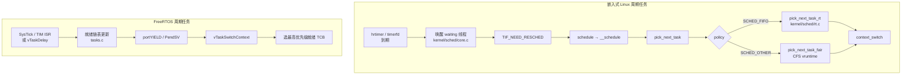
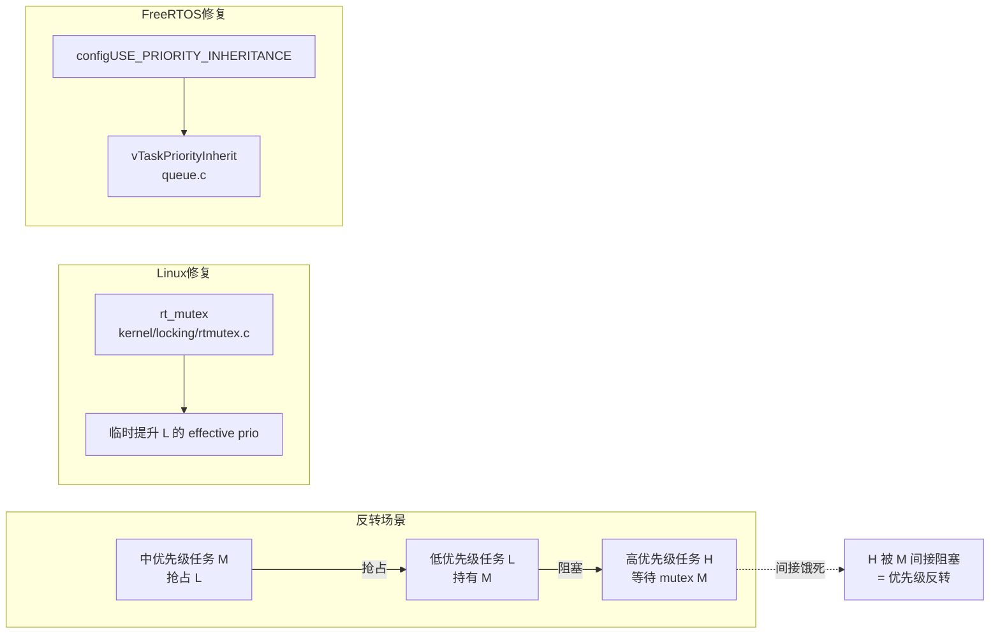

# 嵌入式实时系统完整篇：从硬/软实时指标到调度、优先级与排障

FOC 电流环偶发超 50 μs、网关采集线程 P99 抖动 8 ms、换 PREEMPT 内核后 cyclictest 尖刺反而变大——三类现象表面都是「不够实时」，根因却分别落在 **截止期定义错误、优先级反转未处理、内核抢占配置与测量方法不匹配**。很多人只调 `chrt -f` 或 FreeRTOS 任务优先级，却跳过「硬实时能否被证明」「周期任务该绑 tick 还是硬件定时器」「Linux 关中断窗口与 RTOS 临界区是否同一量级」这几层。

本文聚焦 **嵌入式落地**：把硬/软实时指标、周期任务建模、优先级反转与继承、RTOS 与嵌入式 Linux 选型、延迟来源与 cyclictest/`CONFIG_PREEMPT` 配置合成一条可对照源码验证的闭环。锚点覆盖 `kernel/sched/rt.c`、`include/linux/sched.h`、`Documentation/scheduler`，并以 FreeRTOS `taskENTER_CRITICAL`/`vTaskPriorityInherit` 作对照。与《嵌入式操作系统完整篇》（启动/DTB/rootfs 选型）和《Linux 进程调度完整篇》（通用 CFS/RT 机制）交叉引用时，**以本文的嵌入式指标、测量与排障** 为主轴。

---

## 源码锚点

### 嵌入式 Linux（调度与实时类）

| 路径 | 作用 |
|------|------|
| `include/linux/sched.h` | `task_struct`、`sched_rt_entity`、`SCHED_*` 策略宏 |
| `kernel/sched/core.c` | `schedule`、`__schedule`、`pick_next_task`、抢占点 |
| `kernel/sched/rt.c` | `SCHED_FIFO`/`SCHED_RR`：`pick_next_task_rt`、`dequeue_rt_entity` |
| `kernel/sched/fair.c` | CFS，默认普通任务类 |
| `kernel/locking/rtmutex.c` | RT mutex 与 **优先级继承**（`rt_mutex_setprioceiling` 等） |
| `kernel/time/hrtimer.c` | 高精度定时，周期唤醒与 `nanosleep` 底层 |
| `kernel/Kconfig.preempt` | `CONFIG_PREEMPT*` 抢占模型选项 |
| `Documentation/scheduler/` | 调度设计文档（含 CFS、RT 类说明） |
| `tools/testing/selftests/rcutorture` 旁 | 发行版常用 **rt-tests** 包提供 `cyclictest` |

`task_struct` 中与实时相关的骨架（以树内 `include/linux/sched.h` 为准）：

```c
struct task_struct {
	int				prio, static_prio, normal_prio;
	unsigned int			policy;          /* SCHED_NORMAL/FIFO/RR/... */
	const struct sched_class	*sched_class;
	struct sched_entity		se;              /* CFS */
	struct sched_rt_entity		rt;              /* RT 类 runqueue 实体 */
	/* ... */
};
```

RT 类选任务入口（`kernel/sched/rt.c` 逻辑概要）：

```c
/* pick_next_task_rt：在 per-CPU rt runqueue 按 static_prio 取最高就绪任务 */
struct task_struct *pick_next_task_rt(struct rq *rq, struct task_struct *prev, struct rq_flags *rf)
{
	/* rt_rq 优先级数组 / 链表 → 返回 next task */
}
```

### FreeRTOS（MCU 典型路径）

| 路径 | 作用 |
|------|------|
| `tasks.c` | `xTaskCreate`、`vTaskSwitchContext`、`vTaskPriorityInherit` |
| `queue.c` | 队列/互斥量，含优先级继承触发点 |
| `portable/.../portmacro.h` | `portENTER_CRITICAL` / `portEXIT_CRITICAL` |
| `include/task.h` | `taskENTER_CRITICAL()` 宏封装 |
| `FreeRTOSConfig.h` | `configMAX_PRIORITIES`、`configUSE_MUTEXES`、`configUSE_PRIORITY_INHERITANCE` |

临界区与继承（对照 Linux 关中断 / rt_mutex）：

```c
/* include/task.h → port 层：通常 mask 中断到 BASEPRI 或全局关中断 */
#define taskENTER_CRITICAL()    portENTER_CRITICAL()
#define taskEXIT_CRITICAL()     portEXIT_CRITICAL()

/* queue.c：mutex 被低优先级持有时，持有者优先级临时提升 */
#if ( configUSE_MUTEXES == 1 )
void vTaskPriorityInherit( TaskHandle_t const pxMutexHolder );
#endif
```

---

## 调用链

### ① 周期任务：从定时源到调度切换（Linux vs FreeRTOS）



文字版 Linux 周期链：

```text
clockevent 到期 → hrtimer_interrupt → 唤醒任务
  → 返回用户态/内核态抢占点 → schedule()
  → pick_next_task → rt.c 或 fair.c → switch_to
```

文字版 FreeRTOS 周期链：

```text
硬件 TIM ISR（快环）或 Tick → xTaskIncrementTick
  → 阻塞任务超时就绪 → vTaskSwitchContext → 最高优先级运行
```

### ② 优先级反转与继承路径



---

## 重点知识

### 1. 硬实时 vs 软实时：先定指标，再选 OS

| 类型 | 判据 | 嵌入式典型 OS | 错过截止期 |
|------|------|---------------|------------|
| **硬实时** | WCET 可界定，截止期 **必须** 满足 | FreeRTOS、Zephyr、ThreadX | 控制失效、安全事故 |
| **软实时** | 多数周期满足，偶发超时可接受 | 嵌入式 Linux（CFS） | 丢帧、偶发采集缺口 |
| **准硬实时** | 用 RT 策略 + 实测逼近 | Linux `SCHED_FIFO` + `PREEMPT`/`PREEMPT_RT` | 需 cyclictest 基线，非形式化证明 |

**工程指标**（立项时写进规格，而非事后解释）：

- **截止期（Deadline）** \(D\)：任务必须在 \(D\) 内完成。
- **周期（Period）** \(T\)：周期任务每 \(T\) 触发一次；常要求 \(C \le D \le T\)，\(C\) 为最坏执行时间。
- **抖动（Jitter）**：实际完成时刻相对理想时刻的偏差；硬实时看 **max**，软实时看 P99/P999。
- **响应时间** = 排队延迟 + 执行时间 + 上下文切换/中断延迟。
- **可调度性（Rate-Monotonic 粗判）**：\(n\) 个独立周期任务，若 \(\sum (C_i/T_i) \le n(2^{1/n}-1)\)，RM 优先级分配（周期越短优先级越高）在理想模型下可调度——**工程上仍须加中断/切换开销余量**，不能只看公式。

**硬实时与软实时的嵌入式差异**不在「用不用中断」，而在 **能否接受偶发违背截止期**：

- BMS 均衡策略漏一个 100 ms 周期 → 软实时可讨论；
- ESC 电流采样漏 50 μs → 硬实时，必须 MCU/FPGA 保证；
- 车载 AVM 渲染掉一帧 → 软实时；制动辅助传感器融合 → 硬实时。

**嵌入式选型快判**：控制环路 < 1 ms 且需可证明 → MCU + RTOS；要 TCP/容器/大 rootfs → SoC + 嵌入式 Linux；两者都要 → AMP（M 核 RTOS 控环，A 核 Linux 跑网络/UI）。与纯内核向《实时系统》概念系列的区别：本篇默认读者在 **选型评审、板级 bring-up、产线 cyclictest 验收** 场景，而非只读 `sched.h` 数据结构。

### 2. 周期任务建模：tick 不够用时用硬件定时器

**FreeRTOS**：`vTaskDelay(pdMS_TO_TICKS(10))` 分辨率受 `configTICK_RATE_HZ` 限制（常见 1 kHz → 1 ms 粒度）。**快环（如 20 kHz 电流环）必须放在 TIM/PWM ISR 或最高优先级任务 + 硬件触发**，不能依赖 1 ms tick。

```c
void vSlowLoop(void *arg)
{
    for (;;) {
        read_plant_state();
        vTaskDelay(pdMS_TO_TICKS(10));   /* 100 Hz 慢环 */
    }
}

void TIM2_IRQHandler(void)  /* 20 kHz 快环：ISR 内只做最小工作 */
{
    foc_current_step();
    BaseType_t w = pdFALSE;
    xSemaphoreGiveFromISR(xControlSem, &w);
    portYIELD_FROM_ISR(w);
}
```

**嵌入式 Linux**：周期线程用 `clock_nanosleep(CLOCK_MONOTONIC, TIMER_ABSTIME, …)` 或 `timerfd` 绝对时间唤醒，避免 `sleep(1)` 的 jiffies 粒度。软实时可配合：

```bash
chrt -f 80 taskset -c 2 ./control_loop
# cmdline 示例：isolcpus=2 nohz_full=2 rcu_nocbs=2
```

仍 **不保证** 硬实时；硬截止期应下沉 RTOS 核或 FPGA/协处理器。

Linux 用户态周期线程骨架（绝对时间唤醒，避免漂移累积）：

```c
struct timespec next;
clock_gettime(CLOCK_MONOTONIC, &next);
for (;;) {
    control_step();
    next.tv_nsec += period_ns;
    if (next.tv_nsec >= 1000000000L) {
        next.tv_sec++; next.tv_nsec -= 1000000000L;
    }
    clock_nanosleep(CLOCK_MONOTONIC, TIMER_ABSTIME, &next, NULL);
}
```

配合 `pthread_setschedparam(..., SCHED_FIFO, ...)` 前，进程需 `CAP_SYS_NICE` 或以 root 运行；Yocto/Buildroot 产品可在 systemd unit 里写 `CPUSchedulingPolicy=fifo`。

### 3. 优先级反转与优先级继承

经典 **优先级反转**（Mars Pathfinder 同款）：高优先级任务 H 等低优先级 L 持有的 mutex；中优先级 M 抢占 L，导致 H 被 M 间接阻塞——H 的优先级名义上最高，实际就绪时间却取决于 M 的执行长度。

**FreeRTOS**（需 `configUSE_MUTEXES` + `configUSE_PRIORITY_INHERITANCE`）：

```c
SemaphoreHandle_t xParamMutex;

void vInit(void)
{
    xParamMutex = xSemaphoreCreateMutex();  /* 普通 semaphore 无 PI */
}

void vHighTask(void *arg)
{
    xSemaphoreTake(xParamMutex, portMAX_DELAY);  /* H 阻塞在 L 持有的 mutex */
    update_setpoint();
    xSemaphoreGive(xParamMutex);
}
```

互斥量持有期间，`vTaskPriorityInherit`（`queue.c`）把 L 提升到 H 的优先级；`xSemaphoreGive` 后 `vTaskPriorityDisinherit` 恢复。`taskENTER_CRITICAL()` **不**触发继承——它只关调度/中断，不表达「等谁持有的锁」。

**Linux**：

- 用户态：`pthread_mutexattr_setprotocol(&attr, PTHREAD_PRIO_INHERIT)` 创建 PI mutex；适合 **SCHED_FIFO 用户线程** 共享传感器参数结构。
- 内核：`rt_mutex`（`kernel/locking/rtmutex.c`）为 PI-aware 锁；`SCHED_FIFO` 任务在内核 mutex 上睡眠时可触发继承。
- **普通 spinlock + 长临界区** 不会自动 PI；持锁期间若关抢占，高优先级任务只能在锁外忙等——`PREEMPT_RT` 将大量 spinlock 转为 sleeping lock，使 PI 语义更一致。

**Documentation/scheduler** 与 `man sched_setscheduler` 均强调：`SCHED_FIFO` 静态优先级 1～99，**数字越大优先级越高**；与 CFS 的 `nice`（-20～19，越小越 favorable）不是同一刻度，混用会导致「以为调了优先级其实仍在 CFS」。

**反模式**：ISR 里调 `xSemaphoreTake`（非 FromISR）；Linux 上 busy-wait 自旋锁模拟互斥；多个无关任务共用一个无继承的普通 semaphore；把 `mutex` 换成 `spinlock` 却持有毫秒级临界区。

### 4. RTOS vs 嵌入式 Linux：实时维度对照

| 维度 | FreeRTOS / Zephyr | 嵌入式 Linux |
|------|-------------------|--------------|
| 调度确定性 | 固定优先级抢占，抖动常 μs 级 | CFS 公平，默认 ms 级抖动 |
| 临界区 | `taskENTER_CRITICAL()` → 关中断/升 BASEPRI | `local_irq_disable()`、spin_lock；关中断窗口影响同核延迟 |
| 周期精度 | tick 或专用 HW timer | hrtimer + `CONFIG_HIGH_RES_TIMERS` |
| 证明 WCET | 小内核，可静态分析 | 全功能内核，WCET 难证明 |
| 典型 RAM | KB～数百 KB | 通常 ≥ 32 MB |
| 测量工具 | GPIO 翻转 + 逻辑分析仪、FreeRTOS trace | `cyclictest`、`perf`、`ftrace irqsoff` |
| 开发迭代 | 秒级烧录、JTAG 单步 | 内核/rootfs 迭代分钟～小时级 |
| 网络/文件系统 | lwIP、littlefs，功能受限 | 完整 TCP、NFS、容器 |

**混合架构（AMP）** 在 i.MX8、STM32MP157、TI AM62x 上常见：Cortex-M 跑 FreeRTOS 硬实时，Cortex-A 跑 Linux 做 HMI/云端。RPMsg/OpenAMP 传采样数据；**实时指标在 M 核验收**，Linux 侧 cyclictest 只证明「通信/UI 不拖死 M 核」。设备树 `remoteproc` 节点描述固件加载；M 核 HardFault 不会出现在 Linux `dmesg`，排障需双串口。

与《嵌入式操作系统完整篇》分工：该文讲 **启动链与 rootfs**；本文讲 **截止期、抖动与调度策略是否匹配**。与《Linux 进程调度完整篇》分工：该文通用 **`task_struct`/CFS**；本文强调 **板级 cyclictest、PREEMPT 配置、FreeRTOS 临界区长度**。

### 5. 延迟来源：关中断 vs 调度延迟

把端到端延迟拆成可测片段，排障才不会「一律加优先级」：

```text
事件到达 → [中断延迟] → ISR 执行 → [调度延迟] → 任务运行 → 输出动作
              ↑                    ↑
         关中断/屏蔽影响        runqueue 排队 + 上下文切换
```

**中断关闭窗口**（同 CPU 上所有需响应的事件都被推迟）：

- RTOS：`taskENTER_CRITICAL()` → `portENTER_CRITICAL()`，在 Cortex-M 上常为 **全局关中断或抬 BASEPRI**；持续到 `taskEXIT_CRITICAL()`。原则：**临界区越短越好**，只做链表/标志位操作；禁止 `printf`、浮点、阻塞 API。
- Linux：硬中断 handler、`spin_lock_irqsave` 临界区、`local_irq_disable()`；过长会导致 **timer tick 丢失、hrtimer 延迟、cyclictest 尖刺**。驱动里 `mdelay(10)` 关中断是嵌入式 Linux 延迟噩梦的常见来源。

**调度延迟**（任务已就绪到实际上 CPU 的时间）：

- 来源：更高优先级任务/IRQ 占用、CFS 公平重排、`sched_rt_runtime_us` RT 带宽耗尽回退、缓存颠簸、锁竞争。
- Linux 查看：`cat /proc/<pid>/sched` 的 `se.sum_exec_runtime`、`wait_*`；`perf sched latency`。
- FreeRTOS：`uxTaskGetRunTimeStats`（需 `configGENERATE_RUN_TIME_STATS`）看谁占满 CPU；`configUSE_TRACE_FACILITY` + Percepio/ SystemView 看就绪到运行间隔。

**`kernel/sched/core.c` 中 `__schedule` 典型触发点**：系统调用返回、`try_to_wake_up` 后、`cond_resched`、tick 中断发现时间片耗尽。嵌入式 Linux 周期线程若 policy 为 `SCHED_OTHER`，每次唤醒仍可能与浏览器、日志进程在 CFS 树里竞争——这是 **选型问题**，不是再调大 `nice` 能根治的。

**数量级经验**（须实测，仅作选型参考）：

| 场景 | 典型 wakeup 延迟量级 |
|------|---------------------|
| Cortex-M + FreeRTOS，关中断 < 10 μs | 10～100 μs |
| Linux 默认 PREEMPT_NONE/VOLUNTARY | 数百 μs～数 ms |
| Linux PREEMPT + isolcpus + SCHED_FIFO | 数十～数百 μs |
| PREEMPT_RT 全内核抢占 | 进一步压低内核态尖刺，仍要 cyclictest 验收 |

**Documentation/scheduler/sched-rt-group-sched.rst** 等文档说明 RT 组调度与带宽控制；Buildroot 集成时若启用 `CONFIG_RT_GROUP_SCHED`，还需在 cgroup 里给控制组分配 `cpu.rt_runtime_us`，否则容器内 `SCHED_FIFO` 可能 silently 受限。

### 6. CONFIG_PREEMPT 与内核抢占模型

在 `kernel/Kconfig.preempt` 中（具体命名随版本略有差异）：

| 选项 | 含义 | 嵌入式影响 |
|------|------|------------|
| `CONFIG_PREEMPT_NONE` | 内核不可抢占（除返回用户态） | 延迟大，不适合软实时 |
| `CONFIG_PREEMPT_VOLUNTARY` | 自愿抢占点 | 改善有限 |
| `CONFIG_PREEMPT` | 内核可抢占（`CONFIG_PREEMPT=y`） | Buildroot/Yocto 软实时常用基线 |
| `CONFIG_PREEMPT_RT` | RT 补丁合入/mainline RT 分支 | 工业控制、运动控制常见 |

验证当前内核：

```bash
grep CONFIG_PREEMPT /boot/config-$(uname -r)
# 或
zcat /proc/config.gz 2>/dev/null | grep PREEMPT
```

**注意**：只换 `PREEMPT=y` 而不绑核、不设 `SCHED_FIFO`、不控 IRQ affinity，cyclictest 改善可能不明显；有时 **网卡中断风暴** 会掩盖调度优化效果。

Yocto/Buildroot 集成建议：在 defconfig 或 fragment 中固定 `CONFIG_PREEMPT=y`、`CONFIG_HIGH_RES_TIMERS=y`、`CONFIG_NO_HZ_FULL`（若用隔离核）；内核升级后 **cyclictest 基线写入 release note**，避免「换内核实时性回退」无据可查。

### 7. cyclictest 与嵌入式测量方法

**cyclictest**（rt-tests 包）测量 **唤醒延迟**：线程以固定间隔 `nanosleep`，测实际唤醒与期望时刻差。它是嵌入式 Linux **出厂验收** 最常用的单一数字指标，但必须在 **目标硬件 + 最终内核配置 + 典型负载** 下跑，实验室 x86 结果不能外推。

```bash
# 安装（Buildroot/Yocto 可打包 rt-tests；Buildroot: BR2_PACKAGE_RT_TESTS=y）
cyclictest -p 80 -m -n -i 1000 -l 100000 -q -h 100 -t 1
# -p 80：SCHED_FIFO 优先级 80
# -i 1000：间隔 1000 μs
# -l 100000：采样 10 万次
# -m：锁定内存 mlockall，避免 page fault 尖刺
# -n：clock_nanosleep（非旧版 clock_nanosleep 兼容模式时）
# -t 1：单线程；多核评估用 -a 或 taskset

# 压测同时跑满 CPU，看 worst-case（模拟现场满负载）
cyclictest -p 90 -i 200 -l 50000 -m & stress-ng --cpu 4 &

# 对比 PREEMPT 配置：换内核后必须重跑同一命令，保存 Max/P99 到版本记录
```

读结果：关注 **Max** 与 **99.999%** 分位，而非仅 Avg。验收示例（软实时网关）：P99 < 500 μs、Max < 2 ms（数值须按产品规格替换）。若 Max 偶发到 10 ms 以上，先查 **SMI/BIOS、网卡 IRQ、USB 存储插入** 等板级因素，再查内核。

**测量检查清单**：

1. 测试前 `echo performance > /sys/devices/system/cpu/cpu*/cpufreq/scaling_governor`（或文档规定的节能策略）。
2. 实时线程 `mlockall`（`-m`）并 `taskset` 到隔离核。
3. 空载、满负载各跑一轮，记录 **Min/Avg/Max/Stddev**。
4. 与 **业务 GPIO 翻转** 或 ADC 触发对照，确认 cyclictest 改善能传导到业务链。

**MCU 侧**无 cyclictest 时：GPIO 置位 + 示波器/逻辑分析仪测 ISR 到任务延迟；Cortex-M 用 DWT `CYCCNT` 打点：

```c
uint32_t t0 = DWT->CYCCNT;
foc_step();
uint32_t cycles = DWT->CYCCNT - t0;
/* cycles / SystemCoreClock → 秒 */
```

**配套 trace**：

```bash
perf sched record -a -- sleep 10 && perf sched latency
# 内核关中断过长（需 debug 配置）
trace-cmd record -p function_graph -l irqsoff_tracer
cat /proc/interrupts; cat /proc/softirqs   #  IRQ 是否单核打满
```

### 8. 配置落地与常见故障

**FreeRTOS `FreeRTOSConfig.h` 实时相关项**：

```c
#define configUSE_PREEMPTION              1
#define configUSE_MUTEXES                 1
#define configUSE_PRIORITY_INHERITANCE    1
#define configMAX_PRIORITIES              7
#define configCHECK_FOR_STACK_OVERFLOW    2
```

**嵌入式 Linux sysctl / 启动参数**：

```bash
sysctl kernel.sched_rt_runtime_us=-1   # 部分产品允许 RT 不限带宽（慎用，防饿死 init）
# 或保留默认 950000/1000000 ms 窗口
sysctl kernel.sched_rt_period_us

# cmdline 软实时常用组合（按核数调整）
isolcpus=2,3 nohz_full=2,3 rcu_nocbs=2,3
```

| 现象 | 优先怀疑 | 动作 |
|------|----------|------|
| 周期偶发 miss 数 ms | CFS 默认策略 | `chrt -f` / 换 RTOS 核；查 cyclictest Max |
| cyclictest Max 尖刺到 ms | 关中断过长、SMI、驱动 bug | `ftrace irqsoff`；更新驱动；BIOS 关 C-states 试验 |
| RT 线程仍饿死 | `sched_rt_runtime_us` 用尽 | 提高配额或减 RT 负载 |
| mutex 下高优先级卡住 | 优先级反转 | 开 PI mutex；FreeRTOS 开 `configUSE_PRIORITY_INHERITANCE` |
| 换 PREEMPT 内核无改善 | IRQ 全在 busy 核 | `smp_affinity` / `isolcpus` |
| FOC 环抖动 | tick 驱动快环 | 改 HW timer ISR；Linux 侧下沉 M 核 |

### 9. 实战复盘：软实时网关 vs 硬实时电机

**网关（i.MX6，Linux）**：1 kHz 采集，截止期 2 ms。选型嵌入式 Linux + `SCHED_FIFO` 采集线程 + `CONFIG_PREEMPT=y`；cyclictest Max 1.2 ms，P99 400 μs，满足软实时。1 kHz **以上** 采样改 STM32 协处理器经 RPMsg 上报。

**电机（STM32F4，FreeRTOS）**：20 kHz 电流环，截止期 50 μs。电流环在 TIM ISR；位置环 1 kHz 任务；互斥量保护共享参数并开优先级继承。Linux 无法经济证明 WCET，不强行上 ARM Linux。

---

## Checklist

- [ ] 规格书已写清 \(T\)、\(D\)、\(C\)、可接受 **Max 抖动**（硬实时）或 P99（软实时），而非笼统「要实时」
- [ ] 能对照 `include/linux/sched.h`、`kernel/sched/rt.c` 说明 `SCHED_FIFO` 与 CFS 在 `pick_next_task` 中的优先级关系
- [ ] 周期任务：FreeRTOS 快环不依赖 tick；Linux 用 `clock_nanosleep`/`timerfd`，不用 `sleep()`
- [ ] 共享资源使用带 **优先级继承** 的 mutex（FreeRTOS `configUSE_PRIORITY_INHERITANCE` / Linux PI mutex / rt_mutex 路径）
- [ ] 已知延迟双来源：**关中断窗口** 与 **调度延迟**；会用 cyclictest + `perf sched latency` 分离测量
- [ ] 核对 `CONFIG_PREEMPT`/`CONFIG_PREEMPT_RT`、`CONFIG_HIGH_RES_TIMERS`；换内核后重跑 cyclictest 基线
- [ ] 软实时 Linux 评估 `isolcpus`/`nohz_full`/`chrt` 组合；硬实时截止期有 RTOS/协处理器兜底
- [ ] 排障顺序：复现 → cyclictest/GPIO 延迟基线 → 查 IRQ affinity 与 `sched_rt_runtime_us` → 再改业务逻辑

---

## 小结

嵌入式实时工程的闭环是：**用截止期与抖动指标驱动 OS 选型**，用 **周期任务绑对定时源**（HW timer vs tick vs hrtimer），用 **优先级继承消反转**，用 **cyclictest 与 trace 验收** 而非凭主观「感觉流畅」。MCU 硬实时走 FreeRTOS `vTaskSwitchContext` + 短临界区；SoC 复杂业务走 Linux `pick_next_task_rt` + `CONFIG_PREEMPT`，并把不可证明的环路下沉 RTOS 核。与通用《实时系统》概念文不同，本篇强调 **板级可测、可配置、可回归**；动手时建议先在同一硬件上跑一轮 cyclictest 基线，再改优先级或内核配置，避免无对照的调参。
