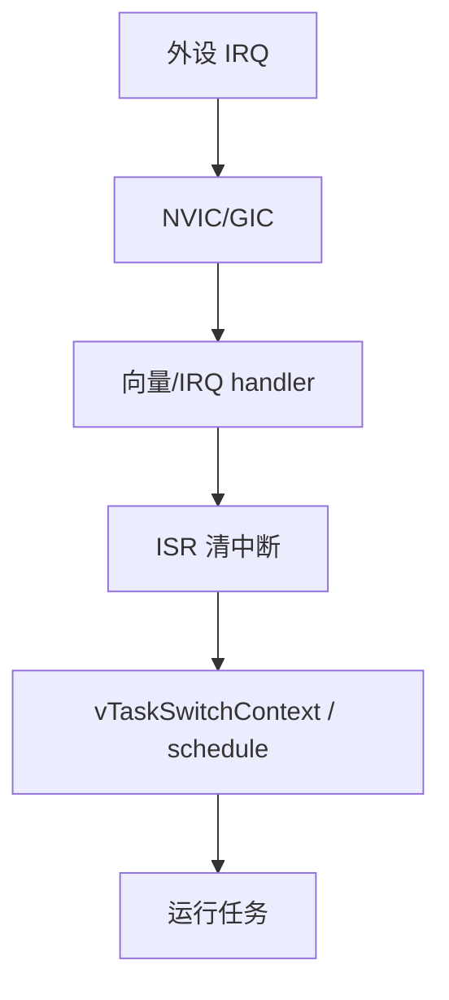
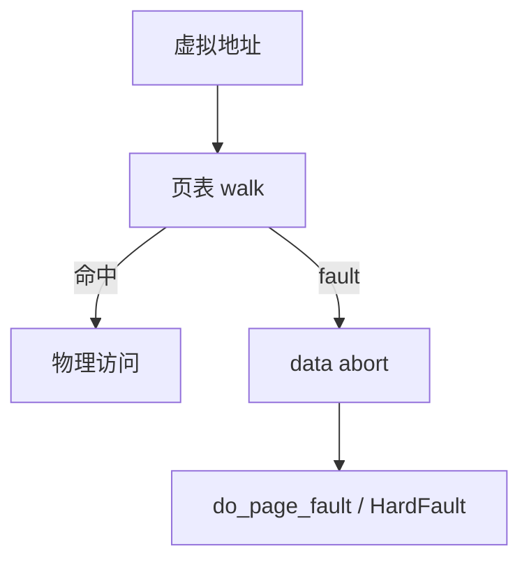

# 嵌入式处理器完整篇：ARM Cortex-M/A、异常模型、MMU/MPU 与启动排障

HardFault 无 CFSR、开 D-Cache 后 DMA 错、GIC 号不对中断不来、secondary CPU 不起——根因在 **Cortex-M/A 异常模型、MPU/MMU、Cache 一致性、向量表与 TF-A**。本文锚定 CMSIS、`arch/arm64/kernel/entry.S`、`irq-gic`、`arm-trusted-firmware` BL31/PSCI，给出寄存器、链接脚本、性能与排障命令。合并自模块 011–016 章。

## 源码锚点


| 路径 | 作用 |
|------|------|
| `CMSIS/Core/Include/core_cm*.h` | NVIC、SCB、MPU |
| `arch/arm64/kernel/entry.S` | 异常向量 EL1/EL0 |
| `arch/arm64/mm/mmu.c` | 页表、`paging_init` |
| `arch/arm/kernel/traps.c` | ARMv7 异常 |
| `arch/arm64/kernel/traps.c` | sync/irq abort |
| `drivers/irqchip/irq-gic-v3.c` | GICv3 |
| `kernel/irq/irqdesc.c` | Linux irq 核心 |
| `arch/arm64/kernel/smp.c` | `__cpu_up`、PSCI |
| `arm-trusted-firmware/bl31/bl31_main.c` | EL3 runtime |
| `arm-trusted-firmware/services/std_svc/psci/` | CPU on/off |
| `startup_*.s` / `*.ld` | 向量与链接 |


```c
/* HardFault 后读 */
SCB->CFSR; SCB->HFSR; SCB->BFAR; SCB->MMFAR;
```

```bash
cat /proc/cpuinfo
cat /proc/interrupts
perf stat -e cycles,instructions,cache-misses ./bench
```

## 调用链

### Cortex-M 中断到任务切换





### MMU 页 fault 路径





## 重点知识

### 1. Cortex-M vs Cortex-A

| | M | A |
|--|---|---|
| 特权 | Handler/Thread | EL0/EL1/EL2/EL3 |
| MMU | 无（可选 MPU） | MMU |
| 中断 | NVIC | GIC |
M **Thumb-only**（除 M7）；A aarch32/64。

### 2. Cortex-M 寄存器

R0-R12、SP(MSP/PSP)、LR、PC、xPSR；**CONTROL** 特权与栈选择。
**PRIMASK/BASEPRI** 关中断；**FAULTMASK** 屏蔽 fault（慎用）。

### 3. AArch64 寄存器

X0-X30、SP_ELx、ELR_ELx、SPSR；**DAIF** 掩码。
异常返回 **eret**；切换 EL 由 SCR/HCR 控制。

### 4. Cortex-M 异常类型

Reset/NMI/HardFault/MemManage/BusFault/UsageFault/SVC/PendSV/SysTick。
异常入栈 **R0-R3,R12,LR,PC,xPSR**；LR 含 EXC_RETURN。

### 5. HardFault 定位

```c
uint32_t cfsr = SCB->CFSR;
uint32_t bfar = SCB->BFAR;
```
MemManage：MPU 违规或非法地址；BusFault：总线错误。

### 6. NVIC 优先级

**数值越小优先级越高**（与 FreeRTOS configMAX_SYSCALL 一致）。
**NVIC_SetPriorityGrouping** 抢占 vs 子优先级。
同优先级不嵌套；高优先级可抢占低。

### 7. PendSV 与上下文切换

FreeRTOS **PendSV** 最低异常优先级；SVC 启动调度。
`portYIELD()` 写 ICSR PendSVSET。

### 8. GIC 基础

GICv2/v3：`drivers/irqchip/irq-gic*.c`；SPI/PPI/SGI。
DT：`interrupt-parent = <&gic>`；`interrupts = <GIC_SPI id type>`。
```bash
cat /proc/interrupts
```

### 9. Linux arm64 异常入口

`arch/arm64/kernel/entry.S`：sync/irq/fiq/error × EL。
用户 fault→`do_el0_svc`/`do_mem_abort`；内核→`die()`/oops。

### 10. MPU 机制

Cortex-M MPU：8～16 区域，RBAR/RASR；**XN** 不可执行。
FreeRTOS **`vPortStoreTaskMPUSettings`** 每任务切换区域。
无 TLB；与 MMU 不同，仅分区保护。

### 11. MMU 与页表

arm64 4KB 页；TTBR0/TTBR1；用户/内核分离。
`do_page_fault`：合法 vma→分配 pte；非法→SIGSEGV。
```bash
cat /proc/PID/maps
```

### 12. MPU vs MMU 对照

| | MPU | MMU |
|--|-----|-----|
| 粒度 | 2^n 区域 | 页 |
| 典型 | RTOS 任务 | Linux 进程 |
| 开销 | 低 | TLB miss |

### 13. I-Cache / D-Cache

Harvard 总线；**自修改代码**需 I/D 同步。
M7：**SCB_EnableDCache**；DMA 前 **clean/invalidate**。
A：**cache maintenance** DMA API。

### 14. DMA 与 cache 一致性

buffer **cache line 对齐**（通常 32/64B）。
Linux：`dma_alloc_coherent`、`dma_map_single` + sync。
MCU：`SCB_CleanDCache_by_Addr` 或 non-cacheable MPU 区。

### 15. 向量表与 VTOR

表首 SP、Reset；**SCB->VTOR** 重定位。
bootloader 跳 app 前设 VTOR 到 app 向量。

### 16. 链接脚本 ENTRY

```ld
ENTRY(Reset_Handler)
MEMORY { FLASH (rx) : ORIGIN = 0x08000000, LENGTH = 512K
         RAM (rwx)  : ORIGIN = 0x20000000, LENGTH = 128K }
```

### 17. CMSIS-Core

`core_cm4.h`：`__NVIC_EnableIRQ`、`SysTick_Config`。
`system_*.c`：`SystemInit` 时钟；`SystemCoreClockUpdate`。

### 18. ARM Trusted Firmware

BL31 EL3：PSCI **`CPU_ON`**、**`SYSTEM_RESET`**。
`bl31/bl31_main.c`；Linux **`psci` in dmesg**。
```bash
dmesg | grep -i psci
```

### 19. 多核启动

Primary 释 secondary：`__cpu_up` → PSCI CPU_ON。
```bash
cat /sys/devices/system/cpu/online
taskset -c 1 ./bench
```
仅 cpu0：DT **`cpu-enable-method`** 或 BL31。

### 20. FPU 上下文

M4F/M7F：lazy stacking；`configUSE_FPU`。
AArch64：`FPEN`；kernel `kernel_neon_begin`。

### 21. 性能计数 PMU

M：**DWT_CYCCNT**（`CoreDebug->DEMCR`）。
A：`perf stat -e cycles,cache-misses,branch-misses`。

### 22. 排障命令表

| 场景 | 手段 |
|------|------|
| HardFault | CFSR/BFAR + GDB |
| 页 fault | dmesg `do_page_fault` |
| 中断 | `/proc/interrupts` |
| Cache | 关 D-cache 对比 |

### 23. 常见坑

栈溢出踩向量；MPU 未 guard stack。
链接 RAM 超长→silent corruption。
GIC 号与 DTS 不一致。
secondary 页表/stack 未 init。

### 24. UsageFault

未定义指令、未对齐访问、除零；`CCR` UNALIGN/TRDIV。

### 25. SVC 调用

RTOS 启动第一个任务经 SVC；编号与 `SV_Handler` 一致。

### 26. NMI 不可屏蔽

clock fail 等；ISR 尽量短。

### 27. SysTick

RTOS tick；`configTICK_RATE_HZ` 与 reload 值。

### 28. PRIMASK vs BASEPRI

BASEPRI 可屏蔽低于某优先级中断。

### 29. EXC_RETURN

LR 位域指示返回 Thread/Handler、MSP/PSP、FPU frame。

### 30. GICv3 redistributor

per-CPU；`irq-gic-v3.c` affinity route。

### 31. ITS MSI

GICv3 ITS 与 PCIe MSI；网关 SoC。

### 32. `handle_domain_irq`

Linux irq 入口 arch 到 generic。

### 33. `request_irq`

驱动注册 handler 与 flags IRQF_SHARED。

### 34. `/proc/softirqs`

NET_RX/TIMER 风暴定位。

### 35. EL2 Hypervisor

KVM/Type1；嵌入式少见除非虚拟化网关。

### 36. EL3 Monitor

SMC 进 secure；NS 不可直接调 S world。

### 37. `psci_cpu_on`

传 entry 与 context_id；secondary 跳 idle。

### 38. `spin_table`

旧 ARM32 释核；已被 PSCI 取代。

### 39. 设备树 cpu节点

`reg` MPIDR；`enable-method = "psci"`。

### 40. `smp_ops

平台 `smp_init`/`smp_boot_secondary`。

### 41. TTBR0 ASID

进程切换 flush TLB 或 ASID 标记。

### 42. `flush_tlb_all`

MMU 改页表后必要。

### 43. Huge page

arm64 2M/1G；嵌入式一般 4K。

### 44. `ioremap`

内核映射 MMIO；勿对用户暴露。

### 45. `/dev/mem`

用户 mmap 物理；lockdown 禁。

### 46. MemType

Device nGnRnE vs Normal cacheable。

### 47. Shareability

多核 coherent 域；DMA 缓冲区属性。

### 48. `arch_sync_dma`

dma sync for CPU/device。

### 49. Non-cache MPU

MCU DMA 缓冲区设 strongly-ordered。

### 50. I-cache invalidate

OTA 写 Flash 后跳转新代码须 invalidate。

### 51. Branch predictor

A53 等；context switch 可能 flush。

### 52. Speculation barrier

Spectre 缓解 CSDB；性能影响。

### 53. `WFE`/`SEV`

低功耗等多核 wake。

### 54. `LDREX`/`STREX`

原子；Linux spinlock 底层。

### 55. LDAXR/STLR

AArch64 原子与屏障。

### 56. Data abort EC

ESR_ELx 解码 fault 原因。

### 57. Translation fault

页表不存在 vs permission fault。

### 58. SEGV 用户态

mmap 未分配；null deref。

### 59. Kernel oops

`traps.c` 打印 PC/LR/栈。

### 60. `show_regs`

panic 打印寄存器。

### 61. Backtrace

`-fno-omit-frame-pointer` 助栈回溯。

### 62. ORC/stack unwinder

内核 CONFIG_UNWINDER。

### 63. `objdump -d`

反汇编对照 PC。

### 64. OpenOCD halt

读 core 寄存器与 NVIC。

### 65. ETM trace

Cortex-M 指令 trace；需 trace pin。

### 66. SWO ITM

`ITM_SendChar` printf。

### 67. Semihosting

`-semihosting`；量产禁用。

### 68. `configCHECK_FOR_STACK_OVERFLOW`

FreeRTOS canary。

### 69. MPU alignment

区域 size/align 2 的幂。

### 70. Subregion disable

MPU RASR SR 位。

### 71. TrustZone SAU

M33 安全 attribution。

### 72. CMSE

Armv8-M 安全调用。

### 73. `__get_PSP`

查 thread 栈指针。

### 74. Handler 栈 MSP

ISR 用 MSP；RTOS thread PSP。

### 75. `configMAX_SYSCALL_INTERRUPT_PRIORITY`

FreeRTOS API 可调用最高 IRQ 优先级。

### 76. FromISR

中断里仅 FromISR API。

### 77. Critical section

`taskENTER_CRITICAL` 升 BASEPRI。

### 78. PRI 反转

mutex 继承见 RT 篇。

### 79. FPU lazy

延迟保存 FP；触发 UsageFault 若未使能。

### 80. VFP neon

AArch32 32 寄存器；context 大。

### 81. SIMD kernel

crypto 用 neon；`kernel_neon_begin`。

### 82. `read_cpuid`

查 part revision errata。

### 83. Cortex-A53 errata

kernel `arm64_errata` workaround。

### 84. Cortex-M7 errata

ART prefetch；DMA 一致性。

### 85. `ctr_el0`

cache type 行大小。

### 86. `clidr_el1`

cache level 拓扑。

### 87. CCSIDR

cache size by set/way。

### 88. `dc cvac`

clean data cache by VA。

### 89. `ic iallu`

invalidate all I-cache。

### 90. Barriers DSB/ISB

维护后顺序。

### 91. `prefetcht0`

软件 prefetch；少见 embedded。

### 92. Lock-free

需 barrier + 原子；别裸 volatile。

### 93. Compiler barrier

`asm volatile("" ::: "memory")`。

### 94. `likely`/`unlikely`

分支 hint；profile 验证。

### 95. Hotplug cpu

`echo 0 > online` 测 secondary。

### 96. Isolation

`isolcpus` + RT 线程绑核。

### 97. NO_HZ

tickless；测 interrupt latency。

### 98. Highmem

32 位 Linux >896MB；arm64 无。

### 99. ZONE_DMA

低于 4G 给 legacy DMA。

### 100. CMA pool

camera 连续内存。

### 101. IOMMU/SMMU

SoC DMA 地址翻译；stream ID。

### 102. Stream ID

DT `iommus`；缺则 DMA 失败。

### 103. PCIe ECAM

网关扩展；MSI 经 GIC ITS。

### 104. virtio

QEMU/KVM paravirt。

### 105. PSCI VERSION

1.0 vs 0.2 功能差。

### 106. SYSTEM_SUSPEND

PSCI 进 deep sleep。

### 107. OP-TEE SMC

与 PSCI 不同 SIP 号。

### 108. SiP 服务

vendor DDR training firmware。

### 109. SCMI

ARM 标准 clock/power 协议。

### 110. TF-A build

`make PLAT=... bl31`。

### 111. ROM lib

BL1 固化验证链。

### 112. Certificate

X.509 链 ROTPK hash。

### 113. Measured boot

每级 hash 扩展 TPM。

### 114. DICE

IoT 身份派生。

### 115. 交叉引用概述

启动链见《嵌入式概述完整篇》。

### 116. 交叉引用安全

TrustZone/Secure Boot 见《嵌入式安全完整篇》。

### 117. Q: HardFault 无 BFAR？

A: 非 BusFault；查 CFSR MMFSR/UFSR。

### 118. Q: 开 cache 数据错？

A: DMA 未 sync 或 MPU 属性错。

### 119. Q: 中断只进一次？

A: 未清 pending；GIC ACK/EOI。

### 120. Q: Linux 用户 SIGSEGV？

A: maps 看合法 vma；null 或 stack overflow。

### 121. Q: cpu1 不起？

A: psci dmesg、DT enable-method、BL31。

### 122. Q: perf 无 event？

A: PMU 未使能或 cgroup 限制。

### 123. Q: FPU 任务切换错？

A: configUSE_FPU、lazy stacking。

### 124. Q: 向量表跑飞？

A: VTOR/链接 ORIGIN/ bootloader 偏移。

### 200. U-Boot `gd_t`

`board_init_f` 阶段用 `gd` 存 `baudrate`、`ram_size`；DRAM 就绪后 `board_init_r` 才 malloc。

### 201. `CONFIG_SYS_SDRAM_BASE`

须与 SoC memory map、DT `/memory` 一致；偏差 1MB 可能踩 MMIO。

### 202. `mkimage -l`

查看 uImage header 的 load/entry/os；与 `bootm` 状态机对照。

### 203. `readelf -S`

段 VMA/LMA；`.data` 的 LMA 在 Flash、VMA 在 RAM。

### 204. `objdump -d`

反汇编 HardFault 时 PC 对照符号。

### 205. OpenOCD program

`program app.elf verify reset exit` 产线烧录脚本化。

### 206. `fdtget`

读 DTB 节点；现场临时验证 `bootargs`。

### 207. NFS root

`root=/dev/nfs nfsroot=IP:/path` 开发免刷 rootfs。

### 208. TFTP boot

`tftpboot ${loadaddr} Image` 快速迭代内核。

### 209. Squashfs

只读压缩根；`/etc` 用 overlay 可写。

### 210. initramfs

`CONFIG_INITRAMFS_SOURCE` 内嵌 cpio；单镜像部署。

### 211. -gc-sections

`KEEP(*(.isr_vector))` 防链接器删掉向量表。

### 212. FreeRTOS 栈

`uxTaskGetStackHighWaterMark`；低于 128 word 应加大。

### 213. earlycon

arm64 `earlycon=pl011` 或 `earlycon=uart8250,mmio32,addr`。

### 214. reserved-memory

CMA/DSP 固件；`no-map` 不进内核线性映射。

### 215. 示波器 UART

idle 高 start 低；波特率 = 1/bit time。

### 216. eMMC 量产

industrial eMMC 替代开发 SD；防接触不良。

### 217. UBIFS

NAND 文件系统；attach 时间随 erase count 增。

### 218. root=PARTUUID

比 `/dev/mmcblk0p2` 稳，不怕 mmc 枚举顺序变。

### 219. PMIC 序

regulator 上电顺序；U-Boot 先于 kernel 配电压轨。

### 220. `pinctrl` sleep

suspend 时 pin 高阻降漏电。

### 221. Dual-bank OTA

A/B 切换；写 B 时 A 仍可启动。

### 222. MCUboot

`imgtool sign`；公钥 hash 烧 OTP。

### 223. `__DSB`/`__ISB`

切换时钟/MPU 后须 barrier。

### 224. GIC SPI 号

DTS `interrupts` 与 Reference Manual IRQ 号一致。

### 225. NVIC 优先级

数值越小越高；与 `configMAX_SYSCALL_INTERRUPT_PRIORITY` 协调。

### 226. PendSV

FreeRTOS 上下文切换最低优先级异常。

### 227. CFSR 解码

MMFSR/BFSR/UFSR 分项读；BFAR/MMAR 给 fault 地址。

### 228. `do_page_fault`

Linux 内核 log 含 fault 地址与 vma；用户态对应 SIGSEGV。

### 229. dma sync

`dma_map_single` + `dma_sync_single_for_device`。

### 230. PSCI CPU_ON

secondary 入口在 TF-A；Linux `__cpu_up` 调用。

### 231. BL31

EL3 monitor；`dmesg | grep psci` 应有输出。

### 232. FIT signature

`mkimage -F -k keys/ -r image.its` 签名。

### 233. ROTPK fuse

Root public key hash；与签名私钥配对。

### 234. RDP

STM32 读保护；level 2 几乎不可逆。

### 235. OP-TEE TA

``/lib/optee_armtz/*.ta``；UUID 与 CA 一致。

### 236. dm-verity

``veritysetup format``；root hash 进 trusted store。

### 237. IMA enforce

``ima_appraise=enforce`` 前先 audit 模式签文件。

### 238. lockdown

``/sys/kernel/security/lockdown`` integrity 禁 `/dev/mem`。

### 239. module sig

``module.sig_enforce=1``；``sign-file`` 签 ko。

### 240. RPMB

eMMC 防回滚计数；与 anti-rollback fuse 配合。

### 241. Side channel

TEE 内 crypto 用 constant-time 实现。

### 242. Secure WDT

TEE 或 EL3 kick；防 REE 停 watchdog。

### 243. Key ceremony

HSM 双人控制；开发密钥禁止上产线。

### 244. SBOM

跟踪 kernel/U-Boot/OP-TEE CVE。

### 245. QEMU virt

无板练 ``booti`` 与 cmdline。

### 246. `bdinfo`

U-Boot 查看 DRAM 基址/大小。

### 247. `booti` arm64

x0=FDT phys；initrd 可选。

### 248. VTOR

Cortex-M 向量重定位；bootloader 跳 app 必设。

### 249. XIP QSPI

wait-states 与频率；读 Flash 慢于 SRAM。

### 250. AHB/APB

APB 慢；勿高频轮询 APB 寄存器。

### 251. Logic analyzer

SPI/I2C 无驱动时抓波形最快。

### 252. `-fstack-usage`

编译期栈用量；对照 `_estack`。

### 253. HardFault LR

EXC_RETURN 判断 MSP/PSP 与 FPU frame。

### 254. MemManage

MPU 违规或访问禁止区。

### 255. BusFault

precise/imprecise；BFAR 仅 precise 有效。

### 256. UsageFault

未对齐、未定义指令、除零。

### 257. SysTick

RTOS tick；reload = SysClk/tick_hz - 1。

### 258. `handle_domain_irq`

GIC 中断进 Linux generic irq 层。

### 259. `request_threaded_irq`

thread_fn 下半部；top-half 短。

### 260. TLB shootdown

多核改页表后 IPI flush。

### 261. ASID

进程 switch 减 TLB flush；arm64 可选。

### 262. Device memory

nGnRnE vs Normal cacheable；驱动 ioremap 属性。

### 263. `ioread32`

内核读 MMIO；用户态勿 devmem 量产后。

### 264. TrustZone TZASC

DRAM 安全区 NS 不可见。

### 265. SMC SMCCC

``smc #0`` 进 EL3；function id 标准/SiP。

### 266. TEE shared mem

注册 NS buffer；防 TOCTOU。

### 267. AVB rollback

vbmeta rollback_index vs fuse。

### 268. HAB CST

NXP 签名工具；closed 后仅 signed boot。

### 269. Encrypted eMMC

inline encryption；密钥 OTP。

### 270. fscrypt

目录级加密；v2 policy。

### 271. TPM PCR

measured boot extend；远程 attestation。

### 272. IMA template ima-ng

sha256/sha512 算法选型。

### 273. EVM key

``evmctl`` 写 security.evm HMAC。

### 274. kptr_restrict

限制 `/proc/kallsyms` 泄露。

