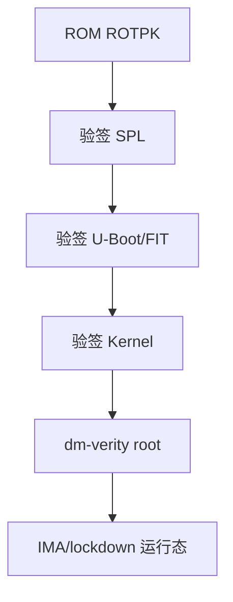
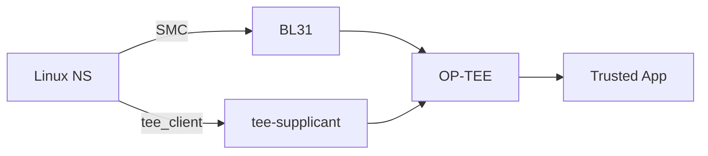

# 嵌入式安全完整篇：Secure Boot、TrustZone、密钥存储与漏洞加固

镜像被替换仍能启动、JTAG 读出密钥、rootfs 篡改无感知——要同时做 **Secure Boot 链、TrustZone 隔离、OTP 密钥、dm-verity/IMA 完整性**。本文锚定 U-Boot FIT 签名、TF-A ROTPK、OP-TEE、Linux `security/integrity` 与 `fs/verity`，给威胁模型、配置与排障命令。合并自模块 091–096 章。

## 源码锚点


| 路径 | 作用 |
|------|------|
| `common/image-sig.c` U-Boot | FIT 签名校验 |
| `lib/crypto/` U-Boot | RSA/SHA verify |
| `arm-trusted-firmware/plat/*/security/` | ROTPK、信任根 |
| `optee_os/core/` | Secure world OS |
| `optee_client/libteec/` | TEEC_* API |
| `linux/drivers/tee/` | `/dev/tee0` |
| `security/integrity/ima/` | IMA 度量 |
| `security/integrity/evm/` | EVM xattr HMAC |
| `fs/verity/` | dm-verity |
| `Documentation/security/IMA/` | IMA 策略 |
| `Documentation/admin-guide/device-mapper/verity.rst` | verity 配置 |


```bash
dumpimage -l fit.itb
dmesg | grep -i tee
ls /dev/tee*
veritysetup format /dev/mmcblk0p3
cat /sys/kernel/security/ima/policy
```

```c
TEEC_InitializeContext(NULL, &ctx);
TEEC_OpenSession(&ctx, &sess, &uuid, TEEC_LOGIN_PUBLIC, NULL, NULL, &err);
TEEC_InvokeCommand(&sess, CMD, &op, &err);
```

## 调用链

### Secure Boot 链





### TrustZone 世界切换





## 重点知识

### 1. 威胁模型

定义攻击者：**物理/远程/供应链**；资产：密钥、固件、数据。
| 威胁 | 防护 |
|------|------|
| 镜像篡改 | Secure Boot、verity |
| 密钥提取 | fuse、TEE、禁 JTAG |
| 调试接口 | lockdown、RDP |

### 2. Secure Boot 链

ROM 存 **ROTPK hash** → 逐级 RSA/ECDSA 验签。
U-Boot **FIT** 含 `signature` 节点；`CONFIG_RSA`/`CONFIG_FIT_SIGNATURE`。
```bash
mkimage -f image.its image.itb
mkimage -F -k keys/ -r image.its
```

### 3. OTP 与 eFuse

一次性：**禁 JTAG、锁 SRK、使能 HAB**。
STM32 **RDP level 1/2**；i.MX **HAB closed**。
误烧不可逆；产线脚本二次确认。

### 4. TrustZone 世界

NS/S 分离；**SMC** 经 EL3 进 secure。
**TZASC** 划 DRAM；NS 不可见 S 内存。

### 5. OP-TEE 架构

`optee_os` + TA；REE **`tee-supplicant`** + **`/dev/tee0`**。
```bash
tee-supplicant &
xtest
```

### 6. dm-verity

只读块设备 **hash 树**；篡改→I/O error。
```bash
veritysetup format --uuid=... /dev/loop0
# cmdline dm-mod.create=... verity ...
```

### 7. IMA/EVM

**IMA** 文件 hash；`ima_appraise=enforce`。
**EVM** 保护 security.ima 等 xattr。
```bash
evmctl ima_sign -v myapp
```

### 8. 加密存储

**LUKS** 整分区；**fscrypt** 目录；密钥在 TEE/SE。
**eMMC RPMB** 防回滚计数。

### 9. 内核 lockdown

`CONFIG_SECURITY_LOCKDOWN_LSM`：integrity 禁 `/dev/mem`、unsigned module。
```bash
cat /sys/kernel/security/lockdown
```

### 10. 攻击面加固

U-Boot **`bootdelay=0`**、`CONFIG_AUTOBOOT_KEYED`。
**`module.sig_enforce=1`**；关闭 USB download（产线除外）。
strip 符号；分离 debug；订阅 CVE。

### 11. AVB 与 rollback

Android **`libavb`**：vbmeta、rollback index。
嵌入式 A/B OTA 可借鉴 **anti-rollback** fuse。

### 12. 密钥生命周期

HSM 生成→产线注入→TEE 使用→OTA 轮换→销毁。
开发密钥禁止上量产线。

### 13. 排障对照

| 现象 | 查 |
|------|-----|
| Authentication failed | 签名/key/SRK hash |
| 无 /dev/tee0 | optee driver、reserved-mem |
| verity I/O error | 分区/hash 树 |
| IMA appraise fail | 未签名路径 |

### 14. ROTPK

Hash of root public key in OTP；换 key 需 matching fuse。

### 15. HAB

i.MX High Assurance Boot；CST 签名。

### 16. CST

NXP Code Signing Tool 生成 signed image。

### 17. X.509 chain

BL2/BL31/U-Boot 证书链到 ROTPK。

### 18. Signature fit

U-Boot `fit_check_sign`。

### 19. Hash algo

SHA256 默认；SHA384 arm64 安全启动。

### 20. RSA vs ECDSA

P-256 短 signature；硬件 accel。

### 21. MCUboot

MCU 镜像 swap + trailer magic。

### 22. imgtool

sign with pem；key 与 bootloader 公钥。

### 23. TF-M

TrustZone-M firmware；PSA API。

### 24. PSA Crypto

统一 crypto API；SE 后端。

### 25. Secure Element

ATECC608 等；I2C 存私钥。

### 26. PKCS#11

HSM 接口；OpenSSL engine。

### 27. TEE Trusted Storage

OP-TEE 加密对象；RPMB 绑定。

### 28. TA 开发

UUID、CMD、shared mem；CA 在 REE。

### 29. GlobalPlatform

TEE Client API 规范。

### 30. SMC calling

ARM SMCCC；function id 标准/ SiP。

### 31. SCR_EL3

NS bit；决定返回 NS world。

### 32. monitor

BL31 处理 SMC；调度 OP-TEE。

### 33. SPD

Secure Payload Dispatcher；opteed。

### 34. shared memory

NS buffer 注册给 TA；防止 TOCTOU。

### 35. Side channel

constant-time crypto in TA。

### 36. Fault injection

电压/glitch 绕过；dual check。

### 37. Secure boot fuse

一旦 enable 不能 unsigned boot。

### 38. Development bypass

仅 development ROTPK；量产 fuse。

### 39. JTAG password

some SoC；丢失无法 debug。

### 40. RDP level 2

STM32 读保护满；mass erase 才能降。

### 41. Readout protection

防 SWD 读 Flash。

### 42. Encrypted flash

on-the-fly decrypt；密钥 OTP。

### 43. Verified boot

ChromeOS vboot；类似 AVB。

### 44. FIT multiple conf

kernel+fdt+ramdisk 一组 sign。

### 45. Required key

U-Boot `signature/key-name-hint`。

### 46. dm-crypt

块层加密；LUKS header。

### 47. fscrypt policy

v2 目录密钥；inode 级。

### 48. TPM 2.0

PCR extend measured boot。

### 49. tpm2-tools

pcrread/seal；网关可选。

### 50. SELinux

MAC；与 IMA 互补。

### 51. AppArmor

path-based MAC。

### 52. Yama ptrace

restrict ptrace scope。

### 53. dmesg restrict

hide kernel pointer。

### 54. kptr_restrict

/proc/kallsyms 权限。

### 55. perf restrict

防 side channel。

### 56. bpf lockdown

lockdown 禁 unpriv bpf。

### 57. module signing

sign-file kernel module。

### 58. MOK

UEFI 追加 key；嵌入式少用。

### 59. UEFI SecureBoot

db/dbx/dbt；shim。

### 60. Capsule

固件升级 signed capsule。

### 61. IMA template

ima-ng hash 算法。

### 62. IMA policy

measure/appraise/audit rules。

### 63. EVM key

内核 keyring；evmctl。

### 64. fsverity

文件级 verity；Android APK。

### 65. verity root hash

放 trusted store 或 cmdline。

### 66. initramfs sign

IMA 签 early user。

### 67. lockdown confidentiality

更严；禁 bpf/kprobes。

### 68. integrity platform key

IPK firmware 存储。

### 69. SPL sign

第一级可验签 SPL。

### 70. Dual signature

algo agility migration。

### 71. Revocation

CRL/OCSP 或 fuse revoke key index。

### 72. Anti-rollback version

monotonic counter fuse/RPMB。

### 73. SWUpdate

A/B + sign check handler。

### 74. RAUC

bundle signature OpenSSL。

### 75. Code signing CI

HSM 签名 pipeline；audit log。

### 76. SBOM

组件 CVE 跟踪。

### 77. Pen test

JTAG/UART/USB 攻击面扫描。

### 78. Fuzzing

TEE CA/TA 接口 fuzz。

### 79. CVE subscribe

kernel/U-Boot/OP-TEE list。

### 80. PSA Certified

Level 1/2/3 认证路径。

### 81. ISO 21434

车规网络安全。

### 82. IEC 62443

工控安全。

### 83. Common Criteria

EAL4+ 评估。

### 84. FIPS 140

crypto module 认证。

### 85. Export control

crypto 出口法规。

### 86. Key ceremony

双人控制 HSM  ceremony 文档。

### 87. Secure wipe

flash 加密 key 销毁。

### 88. Debug cert

time-limited unlock some OEM。

### 89. Boundary scan

JTAG 边界仍可能；fuse 优先。

### 90. Glitch filter

硬件 detect rapid reset。

### 91. Watchdog secure

TEE 侧 kick；防 REE 停 WDT。

### 92. Secure RTC

防时间回滚证书。

### 93. License blob

WiFi/BT firmware 加密 load。

### 94. HDCP

多媒体链路；HDMI secure。

### 95. Widevine

DRM；TEE 解密。

### 96. Whitebox crypto

避免；prefer SE。

### 97. PUF

物理不可克隆；device identity。

### 98. DICE layer

每层 firmware 派生 child key。

### 99. SPDM

DMTF secure protocol component。

### 100. Measured Linux

IMA measure boot aggregate。

### 101. Remote attestation

TPM quote to cloud。

### 102. Confidential computing

CCA/SNP 服务器向；边缘少见。

### 103. Cross 概述

启动链见《嵌入式概述完整篇》。

### 104. Cross 处理器

TZASC/MPU 见《嵌入式处理器完整篇》。

### 105. Q: Authentication failed？

A: SRK hash、签名 key、镜像顺序是否与 fuse 一致。

### 106. Q: tee-supplicant 挂？

A: `/dev/tee0` 权限；reserved-memory。

### 107. Q: verity mount fail？

A: root hash/salt/data blocks 与格式化一致。

### 108. Q: IMA enforce 启不来？

A: 先 audit 模式；签 boot 文件。

### 109. Q: 产线 brick？

A: RDP/HAB closed 前留 recovery UART/USB。

### 110. Q: 降级攻击？

A: rollback index + RPMB/fuse。

### 111. Q: OP-TEE TA 找不到？

A: UUID、/lib/optee_armtz、签名 TA。

### 112. Q: modprobe 被拒？

A: module.sig_enforce；sign-file。

### 200. U-Boot `gd_t`

`board_init_f` 阶段用 `gd` 存 `baudrate`、`ram_size`；DRAM 就绪后 `board_init_r` 才 malloc。

### 201. `CONFIG_SYS_SDRAM_BASE`

须与 SoC memory map、DT `/memory` 一致；偏差 1MB 可能踩 MMIO。

### 202. `mkimage -l`

查看 uImage header 的 load/entry/os；与 `bootm` 状态机对照。

### 203. `readelf -S`

段 VMA/LMA；`.data` 的 LMA 在 Flash、VMA 在 RAM。

### 204. `objdump -d`

反汇编 HardFault 时 PC 对照符号。

### 205. OpenOCD program

`program app.elf verify reset exit` 产线烧录脚本化。

### 206. `fdtget`

读 DTB 节点；现场临时验证 `bootargs`。

### 207. NFS root

`root=/dev/nfs nfsroot=IP:/path` 开发免刷 rootfs。

### 208. TFTP boot

`tftpboot ${loadaddr} Image` 快速迭代内核。

### 209. Squashfs

只读压缩根；`/etc` 用 overlay 可写。

### 210. initramfs

`CONFIG_INITRAMFS_SOURCE` 内嵌 cpio；单镜像部署。

### 211. -gc-sections

`KEEP(*(.isr_vector))` 防链接器删掉向量表。

### 212. FreeRTOS 栈

`uxTaskGetStackHighWaterMark`；低于 128 word 应加大。

### 213. earlycon

arm64 `earlycon=pl011` 或 `earlycon=uart8250,mmio32,addr`。

### 214. reserved-memory

CMA/DSP 固件；`no-map` 不进内核线性映射。

### 215. 示波器 UART

idle 高 start 低；波特率 = 1/bit time。

### 216. eMMC 量产

industrial eMMC 替代开发 SD；防接触不良。

### 217. UBIFS

NAND 文件系统；attach 时间随 erase count 增。

### 218. root=PARTUUID

比 `/dev/mmcblk0p2` 稳，不怕 mmc 枚举顺序变。

### 219. PMIC 序

regulator 上电顺序；U-Boot 先于 kernel 配电压轨。

### 220. `pinctrl` sleep

suspend 时 pin 高阻降漏电。

### 221. Dual-bank OTA

A/B 切换；写 B 时 A 仍可启动。

### 222. MCUboot

`imgtool sign`；公钥 hash 烧 OTP。

### 223. `__DSB`/`__ISB`

切换时钟/MPU 后须 barrier。

### 224. GIC SPI 号

DTS `interrupts` 与 Reference Manual IRQ 号一致。

### 225. NVIC 优先级

数值越小越高；与 `configMAX_SYSCALL_INTERRUPT_PRIORITY` 协调。

### 226. PendSV

FreeRTOS 上下文切换最低优先级异常。

### 227. CFSR 解码

MMFSR/BFSR/UFSR 分项读；BFAR/MMAR 给 fault 地址。

### 228. `do_page_fault`

Linux 内核 log 含 fault 地址与 vma；用户态对应 SIGSEGV。

### 229. dma sync

`dma_map_single` + `dma_sync_single_for_device`。

### 230. PSCI CPU_ON

secondary 入口在 TF-A；Linux `__cpu_up` 调用。

### 231. BL31

EL3 monitor；`dmesg | grep psci` 应有输出。

### 232. FIT signature

`mkimage -F -k keys/ -r image.its` 签名。

### 233. ROTPK fuse

Root public key hash；与签名私钥配对。

### 234. RDP

STM32 读保护；level 2 几乎不可逆。

### 235. OP-TEE TA

``/lib/optee_armtz/*.ta``；UUID 与 CA 一致。

### 236. dm-verity

``veritysetup format``；root hash 进 trusted store。

### 237. IMA enforce

``ima_appraise=enforce`` 前先 audit 模式签文件。

### 238. lockdown

``/sys/kernel/security/lockdown`` integrity 禁 `/dev/mem`。

### 239. module sig

``module.sig_enforce=1``；``sign-file`` 签 ko。

### 240. RPMB

eMMC 防回滚计数；与 anti-rollback fuse 配合。

### 241. Side channel

TEE 内 crypto 用 constant-time 实现。

### 242. Secure WDT

TEE 或 EL3 kick；防 REE 停 watchdog。

### 243. Key ceremony

HSM 双人控制；开发密钥禁止上产线。

### 244. SBOM

跟踪 kernel/U-Boot/OP-TEE CVE。

### 245. QEMU virt

无板练 ``booti`` 与 cmdline。

### 246. `bdinfo`

U-Boot 查看 DRAM 基址/大小。

### 247. `booti` arm64

x0=FDT phys；initrd 可选。

### 248. VTOR

Cortex-M 向量重定位；bootloader 跳 app 必设。

### 249. XIP QSPI

wait-states 与频率；读 Flash 慢于 SRAM。

### 250. AHB/APB

APB 慢；勿高频轮询 APB 寄存器。

### 251. Logic analyzer

SPI/I2C 无驱动时抓波形最快。

### 252. `-fstack-usage`

编译期栈用量；对照 `_estack`。

### 253. HardFault LR

EXC_RETURN 判断 MSP/PSP 与 FPU frame。

### 254. MemManage

MPU 违规或访问禁止区。

### 255. BusFault

precise/imprecise；BFAR 仅 precise 有效。

### 256. UsageFault

未对齐、未定义指令、除零。

### 257. SysTick

RTOS tick；reload = SysClk/tick_hz - 1。

### 258. `handle_domain_irq`

GIC 中断进 Linux generic irq 层。

### 259. `request_threaded_irq`

thread_fn 下半部；top-half 短。

### 260. TLB shootdown

多核改页表后 IPI flush。

### 261. ASID

进程 switch 减 TLB flush；arm64 可选。

### 262. Device memory

nGnRnE vs Normal cacheable；驱动 ioremap 属性。

### 263. `ioread32`

内核读 MMIO；用户态勿 devmem 量产后。

### 264. TrustZone TZASC

DRAM 安全区 NS 不可见。

### 265. SMC SMCCC

``smc #0`` 进 EL3；function id 标准/SiP。

### 266. TEE shared mem

注册 NS buffer；防 TOCTOU。

### 267. AVB rollback

vbmeta rollback_index vs fuse。

### 268. HAB CST

NXP 签名工具；closed 后仅 signed boot。

### 269. Encrypted eMMC

inline encryption；密钥 OTP。

### 270. fscrypt

目录级加密；v2 policy。

### 271. TPM PCR

measured boot extend；远程 attestation。

### 272. IMA template ima-ng

sha256/sha512 算法选型。

### 273. EVM key

``evmctl`` 写 security.evm HMAC。

### 274. kptr_restrict

限制 `/proc/kallsyms` 泄露。

### 275. Yama ptrace

``kernel.yama.ptrace_scope`` 限制 attach。

### 276. SWUpdate

signed bundle handler 验签再刷。

### 277. RAUC

cms signature；A/B slot switch。

### 278. Pen test UART

产线关闭 interrupt boot；``bootdelay=0``。

### 279. Glitch attack

电压毛刺绕过验签；硬件滤波。

### 280. Debug cert

OEM 限时 unlock；需审计。

### 281. PSA Level

IoT 认证路径 Level1/2/3。

### 282. ISO 21434

车规网络安全工程。

### 283. DICE

每层 firmware 派生 child identity。

### 284. PUF

物理不可克隆；device unique key。

### 285. Secure Element

ATECC608 I2C；私钥不出芯片。

### 286. TF-M

Cortex-M TrustZone-M firmware。

### 287. GlobalPlatform TEE

Client API 与 TA 规范。

### 288. Certificate chain

BL2/BL31/U-Boot X.509 到 ROTPK。

### 289. Dual signature

算法迁移期双签。

### 290. Anti-rollback monotonic

RPMB 或 fuse 计数只增不减。

### 291. U-Boot `gd_t`

`board_init_f` 阶段用 `gd` 存 `baudrate`、`ram_size`；DRAM 就绪后 `board_init_r` 才 malloc。

