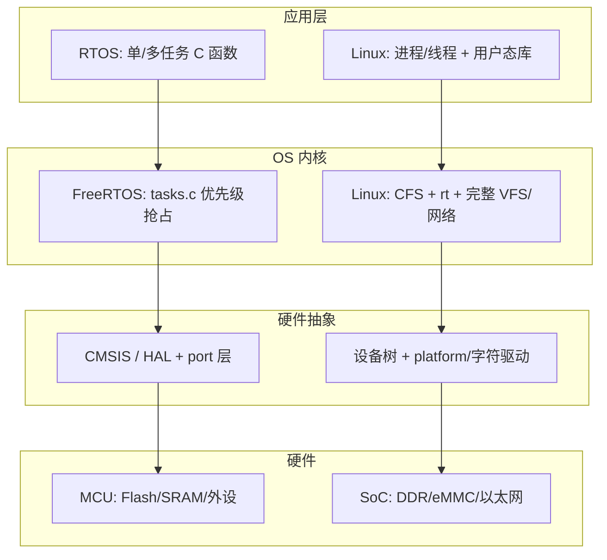

# 嵌入式操作系统完整篇：RTOS 与嵌入式 Linux 选型、启动与调度实战

电机控制周期抖动、网关启动慢 30 秒、换板子后根文件系统挂不上——三类故障看似无关，根因往往落在 **OS 选型与启动/调度主链** 上：MCU 上误用 Linux 做硬实时、SoC 上 RTOS 硬扛 TCP/容器、或 DTB/rootfs 与内核版本不一致。很多人一上来改业务线程优先级，却跳过了「该用 RTOS 还是 Linux」「卡在 `start_kernel` 哪一步」「CFS 与 `SCHED_FIFO` 能否满足截止期」这几层。

本文把 **RTOS（以 FreeRTOS 为代表）与嵌入式 Linux** 的选型、启动链、调度机制合成一条可对照源码验证的闭环：锚点覆盖 `start_kernel`/`kernel_init`/`sched_init`、CFS/rt 调度类，以及 FreeRTOS `tasks.c` 真实符号；并给出设备树、rootfs、内存/启动时间权衡与排障 Checklist。合并自嵌入式系统模块 021–026 章要点，与《Linux 内核启动完整篇》《进程调度完整篇》交叉引用时以本文 **OS 选型与双栈对照** 为主轴。

---

## 源码锚点

### 嵌入式 Linux（arm64 SoC 典型路径）

| 路径 | 作用 |
|------|------|
| `arch/arm64/kernel/head.S` | `primary_entry` → 早期页表/MMU → `start_kernel` |
| `arch/arm64/kernel/setup.c` | `setup_arch`：cmdline、memblock、DT 扫描 |
| `init/main.c` | `start_kernel`、`rest_init`、`kernel_init`、`do_basic_setup`、`do_initcalls` |
| `kernel/sched/core.c` | `sched_init`、`schedule`、`__schedule`、`pick_next_task` |
| `kernel/sched/fair.c` | CFS：`pick_next_entity`、vruntime |
| `kernel/sched/rt.c` | `SCHED_FIFO`/`SCHED_RR` 实时类 |
| `drivers/of/fdt.c`、`drivers/of/base.c` | `unflatten_device_tree`、OF 运行时树 |
| `init/do_mounts.c` | `prepare_namespace`、`mount_root` |
| `init/initramfs.c` | `populate_rootfs` |
| `include/linux/init.h` | initcall 等级、`__setup` |

C 入口骨架（以树内 `init/main.c` 为准）：

```c
asmlinkage __visible void __init start_kernel(void)
{
	/* setup_arch → mm_* → sched_init → init_IRQ → time → console_init
	   → … → rest_init() */
}

static noinline void __ref rest_init(void)
{
	/* kernel_thread(kernel_init, …);
	   kernel_thread(kthreadd, …);
	   cpu_startup_entry(…); */
}

static int __ref kernel_init(void *unused)
{
	/* kernel_init_freeable() → do_basic_setup()/do_initcalls
	   → prepare_namespace → run_init_process(/sbin/init) */
}
```

调度类分层（`kernel/sched/core.c` 的 `pick_next_task` 逻辑）：

```text
stop → deadline → rt (kernel/sched/rt.c) → fair/CFS (kernel/sched/fair.c) → idle
```

### FreeRTOS（MCU 典型路径）

| 路径 | 作用 |
|------|------|
| `tasks.c` | `xTaskCreate`、`vTaskStartScheduler`、`vTaskSwitchContext`、`prvCreateIdleTasks` |
| `list.c` | 就绪/阻塞链表：`vListInsertEnd`、`listGET_OWNER_OF_HEAD_ENTRY` |
| `queue.c` | 队列、信号量底层 |
| `portable/.../port.c` | `xPortStartScheduler`、上下文切换、Tick 中断 |
| `FreeRTOSConfig.h` | `configMAX_PRIORITIES`、`configTICK_RATE_HZ`、`configTOTAL_HEAP_SIZE` |

调度启动骨架（`tasks.c`，版本细节以你树内为准）：

```c
void vTaskStartScheduler(void)
{
	/* prvCreateIdleTasks();
	   xTimerCreateTimerTask()（若启用软件定时器）;
	   xPortStartScheduler();  // 不再返回 */
}

void vTaskSwitchContext(void)
{
	/* 选最高优先级就绪任务 → 更新 pxCurrentTCB → 触发 port 层切换 */
}
```

---

## 调用链

### ① 启动与调度主链（Linux vs FreeRTOS 对照）


文字版 Linux 主链：

```text
Bootloader(DTB+cmdline) → head.S → start_kernel()
  → setup_arch → sched_init → init_IRQ → console_init
  → rest_init() → kernel_init → do_initcalls → 挂根 → /sbin/init
用户态线程经 glibc/pthread → 内核 schedule() → pick_next_task → CFS/rt
```

文字版 FreeRTOS 主链：

```text
main() → xTaskCreate(…) → vTaskStartScheduler()
  → prvCreateIdleTasks → xPortStartScheduler()
  → SysTick/PendSV → vTaskSwitchContext → 最高优先级就绪任务运行
```

### ② RTOS vs 嵌入式 Linux 分层对比（TB）



---

## 重点知识

### 1. 硬实时、软实时与「该选谁」

| 类型 | 定义 | 典型 OS | 错过截止期的后果 |
|------|------|---------|------------------|
| **硬实时** | 必须在截止期内完成，可证明 WCET | FreeRTOS、Zephyr、RTEMS | 系统失效（安全/控制事故） |
| **软实时** | 多数周期内满足，偶发超时可容忍 | Linux CFS、Android | 体验下降、偶发丢帧 |
| **准硬实时** | 用 RT 策略逼近硬实时 | Linux `SCHED_FIFO` + `PREEMPT_RT` | 需实测抖动，非形式化保证 |

**工程判据**：控制环路 < 1 ms 且需可证明 → MCU + RTOS；需 TCP/IP、容器、大文件系统、多进程隔离 → SoC + 嵌入式 Linux；两者都要 → **AMP/多核**（一核 RTOS 控实时，一核 Linux 跑网络/UI）或 Linux + 协处理器 MCU。

补充：**Zephyr** 与 FreeRTOS 同属 RTOS 阵营，但自带更完整的设备树/Kconfig 与网络栈，适合需要 BLE/802.15.4 又不愿上 Linux 的节点；**RT-Thread** 在国内生态与组件包上更友好。选型时除内核本身，还要看 **BSP 成熟度、IDE 调试链、长期维护与许可证**（FreeRTOS MIT、Linux GPL 对用户态分发策略的影响）。

### 2. 选型对照表（内存 / 启动 / 生态）

| 维度 | FreeRTOS / Zephyr | 嵌入式 Linux（Buildroot/Yocto） |
|------|-------------------|----------------------------------|
| **RAM 量级** | 数 KB～数百 KB 内核 + 任务栈 | 通常 ≥ 32 MB（极简可更低，但不现实跑网络栈） |
| **Flash/存储** | 数十 KB～1 MB 固件 | 内核 5～15 MB + rootfs 10 MB～GB 级 |
| **冷启动** | 毫秒～百毫秒 | 秒级（initcall + 用户态 systemd/脚本） |
| **调度确定性** | 固定优先级抢占，抖动 μs 级 | CFS 公平但非硬实时；`chrt`/`PREEMPT_RT` 可改善 |
| **设备描述** | `*.dts`（Zephyr）或 C 板级初始化 | **设备树 DTB** + `compatible` 驱动匹配 |
| **文件系统** | 可选 littlefs/FAT，常无 OS 级 VFS | **rootfs**：squashfs/ext4 + initramfs |
| **调试** | OpenOCD、SWO、逻辑分析仪 | 串口 `earlycon`、`dmesg`、`initcall_debug` |
| **典型场景** | 传感器、电机、BMS、按键 | 网关、HMI、NVR、边缘 AI |

### 3. 嵌入式 Linux 启动：DTB 与 rootfs 是两条输入线

**设备树（DTB）** 在 `setup_arch` 阶段由 Bootloader 传入（arm64：`x0 = DTB 物理地址`），内核经 `unflatten_device_tree` 展开为 OF 树。关键节点：

- `/memory`：可用 DRAM 范围；错则 memblock 异常、随机 panic。
- `/chosen/bootargs`：默认 cmdline，可被 Bootloader 追加覆盖。
- 外设节点 `compatible`：决定 `device_initcall` 阶段哪个 `platform_driver.probe` 被触发。
- `stdout-path` / `aliases`：早期串口，配合 `earlycon=uart8250,...`。
- `reserved-memory`：CMA、共享内存、固件保留区；漏配会导致驱动 mmap 失败或 DMA 踩内存。

DT 片段示例（仅示意结构，以板级 `.dts` 为准）：

```dts
/ {
    memory@80000000 {
        device_type = "memory";
        reg = <0x0 0x80000000 0x0 0x20000000>; /* 512 MiB */
    };
    chosen {
        bootargs = "console=ttyS0,115200 root=/dev/mmcblk0p2 rootwait";
        stdout-path = &uart0;
    };
    mmc0: mmc@... {
        compatible = "vendor,sdhci";
        status = "okay";
    };
};
```

验证命令：

```bash
# 启动后核对 DT 是否生效
ls /proc/device-tree/
cat /proc/device-tree/chosen/bootargs
hexdump -C /sys/firmware/fdt 2>/dev/null | head   # 部分平台

# 离线反编译 DTB（与 Bootloader 加载的同一份）
dtc -I dtb -O dts -o /tmp/board.dts board.dtb
fdtdump board.dtb | less
```

**rootfs** 两条路径不要混：

1. **initramfs**（`populate_rootfs`，`rootfs_initcall` 级）：cpio 解压到内存 rootfs，适合先 `modprobe` 再 `switch_root`。
2. **内核直接挂根**（`prepare_namespace` / `mount_root`）：解析 `root=`、`rootwait`、`rootfstype=`。

Buildroot/Yocto 打包时常见组合：

| 产物 | 作用 | 典型路径 |
|------|------|----------|
| `Image` / `zImage` | 内核 | `/boot` 或 tftp |
| `*.dtb` | 板级硬件描述 | 与内核同版本编译 |
| `rootfs.ext4` / `rootfs.squashfs` | 用户态根 | eMMC/ NAND 分区 |
| `initramfs.cpio.gz` | 早期用户态 | 内嵌进内核或 Bootloader 加载 |

排障时先确认块设备在挂根前已 probe：`dmesg | grep -E 'mmc|mtd|virtio|Mounted root'`。DT 与驱动 `compatible` 不一致时，表现为「有节点无设备」——不是 rootfs 坏了，是驱动没绑上。换内核只更新 `Image` 却沿用旧 DTB，是板级 bring-up 的头号回归点。

### 4. 调度机制：CFS 与 RTOS 优先级不是同一套语义

**Linux CFS**（`kernel/sched/fair.c`）：按 `vruntime` 红黑树选任务，追求长期 CPU 公平；`nice` 影响权重。适合吞吐与交互，**不保证**周期截止期。

**Linux RT 类**（`kernel/sched/rt.c`）：`SCHED_FIFO`/`SCHED_RR` 静态优先级 1～99；高优先级可饿死 CFS。配置示例：

```bash
chrt -f 50 ./control_loop          # FIFO 优先级 50
sysctl kernel.sched_rt_runtime_us  # RT 带宽上限，防饿死普通任务
```

**PREEMPT_RT** 补丁将 spinlock 等路径改为可抢占，降低内核态抖动——工业场景常用，但仍需实测 worst-case latency。

**FreeRTOS**：就绪链表按优先级排列；`vTaskSwitchContext` 总是选最高优先级就绪任务；同优先级时间片轮转（若启用）。`configMAX_PRIORITIES` 与栈大小在 `FreeRTOSConfig.h` 中一次性定调：

```c
#define configMAX_PRIORITIES     5
#define configTICK_RATE_HZ         1000
#define configTOTAL_HEAP_SIZE    (8 * 1024)
```

**`sched_init` 在启动链中的位置**：`start_kernel` 里调用 `sched_init`（`kernel/sched/core.c`）后，内核才能 `kernel_thread` 创建 `kernel_init`/`kthreadd`。在此之前任何「调度」都不存在——排障时若卡在 `sched_init` 之前，与用户态线程优先级无关。

**常见坑**：

- Linux 上用 busy-loop「模拟实时」——仍会被 CFS 重排、被中断/NMI 打断。
- RTOS ISR 里调 `vTaskDelay` 等阻塞 API——可能死锁，应改用 `xQueueSendFromISR` 等 FromISR 变体。
- 把 `nice -20` 当成硬实时——nice 只影响 CFS 权重，不提升调度类。
- FreeRTOS 任务优先级数字越大越高，Linux RT 优先级 1～99 也是数字越大越高，但 **与 CFS 的 nice 完全不是一套刻度**。

FreeRTOS 最小任务创建（对照 `tasks.c` 的 `xTaskCreate`）：

```c
void vSensorTask(void *pvParameters)
{
    for (;;) {
        read_sensor();
        vTaskDelay(pdMS_TO_TICKS(10));  /* 10 ms 周期 */
    }
}

int main(void)
{
    hw_init();
    xTaskCreate(vSensorTask, "sensor", 256, NULL, 3, NULL);
    vTaskStartScheduler();  /* 不应返回 */
    for (;;);
}
```

Linux 侧等价软实时尝试（需 root，且仍非硬实时保证）：

```bash
chrt -f 80 taskset -c 2 ./sensor_loop
# cmdline 可加：isolcpus=2 nohz_full=2 rcu_nocbs=2
```

### 5. 内存占用：从链接脚本到运行时

**RTOS**：

- 静态：`configTOTAL_HEAP_SIZE` 或各任务 `xTaskCreate` 的 stack depth。
- 每个任务 TCB + 栈；队列/信号量从 heap 分配。
- 排障：`uxTaskGetStackHighWaterMark()` 查栈水位；heap 不足时 `xTaskCreate` 返回 `pdFAIL`。

**嵌入式 Linux**：

- 内核：裁剪 `make menuconfig`，去掉无用子系统；`initramfs` 尽量精简。
- 用户态：systemd 单元并行度、无用 daemon；`CMA`、`zswap` 视场景启用。
- 观测：`free -h`、`/proc/meminfo`、`slabtop`；启动阶段 `initcall_debug` 看哪段 initcall 拖慢。

### 6. 启动时间优化

| 阶段 | RTOS 手段 | Linux 手段 |
|------|-----------|------------|
| 硬件 init | 减少 `main()` 中外设探测 | DT 精简、异步 probe |
| OS init | 少建任务、推迟非关键 `xTaskCreate` | 裁剪 initcall、驱动模块化 |
| 文件系统 | 无或 mmap XIP | squashfs 只读根、减小 initramfs |
| 用户态 | N/A | `systemd-analyze blame`、并行单元 |

Linux 启动度量：

```bash
# 内核侧
initcall_debug loglevel=8   # cmdline 临时加
dmesg | grep 'initcall.*returned'

# 用户态
systemd-analyze time
systemd-analyze critical-chain
```

目标不是「盲目压到 1 秒」，而是 **可重复、可回归**：每次裁剪记录镜像大小与到业务就绪的时间。

板级典型时间预算（经验量级，以实测为准）：

| 阶段 | i.MX6 类 Linux | STM32 + FreeRTOS |
|------|----------------|------------------|
| Bootloader | 0.3～1 s | 5～50 ms |
| 内核/OS init | 1～3 s | 1～10 ms |
| 用户态到业务 | 2～10 s | 0（进 main 即跑） |
| **合计** | **3～15 s** | **< 100 ms** |

若产品规格书写「上电 500 ms 内必须输出 PWM」，应直接否决纯 Linux 单核方案，而不是事后调 `nice`。

### 7. 配置落地（Yocto / Buildroot / FreeRTOS）

**嵌入式 Linux**：

```bash
# 核对三件套
uname -r
ls /lib/modules/$(uname -r)/
cat /proc/cmdline

# DTB 与内核同版本打包
# Yocto: MACHINE、KERNEL_DEVICETREE、IMAGE_BOOT_FILES
# Buildroot: BR2_LINUX_KERNEL_CUSTOM_DTS_PATH
```

**FreeRTOS**：

- `FreeRTOSConfig.h`：tick、优先级数、heap、钩子函数。
- `heap_4.c` vs `heap_5.c`：是否跨非连续 RAM 区域。
- 链接脚本：向量表、栈、heap 区间与 MCU 手册一致。

### 8. AMP 与混合架构：当单一 OS 不够

i.MX8、STM32MP1、TI AM62x 等 **异构多核** 常见分工：

```text
Cortex-M（FreeRTOS）  ← RPMsg/OpenAMP →  Cortex-A（Linux）
     硬实时控制                              网络/UI/存储
```

Bring-up 顺序通常是：先让 Linux 侧加载 remoteproc 固件或 M 核自行从 Flash 启动，再建立 virtio/rpmsg 通道。排障时分清 **哪颗核的串口日志**：M 核 HardFault 不会出现在 Linux `dmesg` 里。设备树里 `remoteproc` 节点描述固件加载地址与资源表。

### 9. initcall 与驱动就绪：挂根前的隐藏依赖

`kernel_init` → `do_basic_setup` → `do_initcalls` 按等级调用（`include/linux/init.h`）：

```text
early → pure/core/postcore → arch → subsys → fs → rootfs → device → late
```

- `rootfs_initcall`：`populate_rootfs` 等。
- `device_initcall`：大量内建驱动；`__initcall(fn)` 等价于此级。
- 模块 `module_init` **不在**冷启动链上，需 initramfs 里 `modprobe` 或后续加载。

cmdline 加 `initcall_debug` 可打印每个符号与耗时；卡在某 `calling xxx+0x0` 不再返回，用 `rg xxx` 反查驱动。eMMC 控制器依赖 regulator/clock 未就绪时，常见 `-EPROBE_DEFER` 链式延迟——表象是 `rootwait` 超时，根因是电源域或 pinctrl 节点缺失。

### 10. 常见故障与排障路径

| 现象 | 优先怀疑 | 动作 |
|------|----------|------|
| Linux 串口无输出 | `earlycon`/`console=` 未配 | cmdline 加 `earlycon=uart8250,mmio,...` |
| `Unable to mount root fs` | DT 块设备未 probe、`root=` 错 | `initcall_debug`；核对 DTB 与内核版本；加 `rootwait` |
| 启动 >30 s | initramfs 过大、慢 initcall | 精简 cpio；`dmesg` 查耗时 initcall |
| RTOS 任务不调度 | 未调 `vTaskStartScheduler` | 确认 `main` 末尾调用；`xTaskCreate` 返回值 |
| 栈溢出 HardFault | 栈 depth 不足 | `uxTaskGetStackHighWaterMark`；增大 stack |
| 周期抖动 ms 级 | Linux 默认 CFS | 换 RTOS 核或 `SCHED_FIFO`/`isolcpus`/`PREEMPT_RT` |
| 换板子起不来 | DTB 与硬件不符 | `fdtdump`/`dtc -I dtb -O dts` 对比 `compatible` |
| `No working init found` | 根上无 `/sbin/init` 或缺动态库 | `init=/bin/sh` 进急救壳查依赖 |
| M 核无响应、A 核正常 | remoteproc 固件未加载 | 查 DT `firmware-name`、Linux remoteproc 日志 |

**RTOS 调试**：`configCHECK_FOR_STACK_OVERFLOW=2`；OpenOCD `monitor rtos FreeRTOS`；逻辑分析仪量 ISR 到任务延迟。

**Linux 调试**：

```bash
perf sched record -a -- sleep 5 && perf sched latency
cat /proc/<pid>/sched
grep -E 'initcall|probe' /var/log/kern.log
```

### 11. 实战复盘：网关 vs 电机控制器

**场景 A — 工业网关（NXP i.MX6，512 MiB RAM）**  
需求：Ethernet、Modbus TCP、Web 配置、OTA。选型 **Buildroot + Linux**：squashfs 只读根 + overlay；启动约 8 s 可接受。软实时采集用 `SCHED_FIFO` 线程 + 内核 PREEMPT 配置，抖动实测 < 2 ms。若仍不满足，把 1 kHz 采样下沉到 Cortex-M 协处理器。

**场景 B — FOC 电机（STM32F4，192 KiB RAM）**  
需求：20 kHz 电流环、< 50 μs 控制延迟。选型 **FreeRTOS**：电流环放最高优先级任务或 TIM ISR + 队列通知；Linux 无法经济实现。`configTICK_RATE_HZ=1000` 只服务慢速外环，快环靠硬件定时器中断，不依赖 tick。

两案共同原则：**用实测延迟与内存曲线驱动选型**，而非「熟悉 Linux 就万物皆 Linux」。

---


---

## 小结

嵌入式 OS 选型的核心是 **用截止期与资源边界倒推**：MCU 硬实时走 FreeRTOS/Zephyr 的 `vTaskStartScheduler` 抢占链；SoC 复杂应用走 Linux 的 `start_kernel` → initcall → rootfs → 用户态，再用 CFS/rt/`PREEMPT_RT` 调软实时。设备树与 rootfs 是 Linux 板级 bring-up 的「硬件说明书 + 用户态根」；RTOS 则用 `FreeRTOSConfig.h` 与链接脚本定调内存。排障按「有无 early 日志 → initcall/任务是否就绪 → 调度策略是否匹配截止期」分层推进，避免在错误 OS 层上修业务逻辑。动手时建议先画一张 **双栈启动时序图**，再对照串口日志分段打点。
