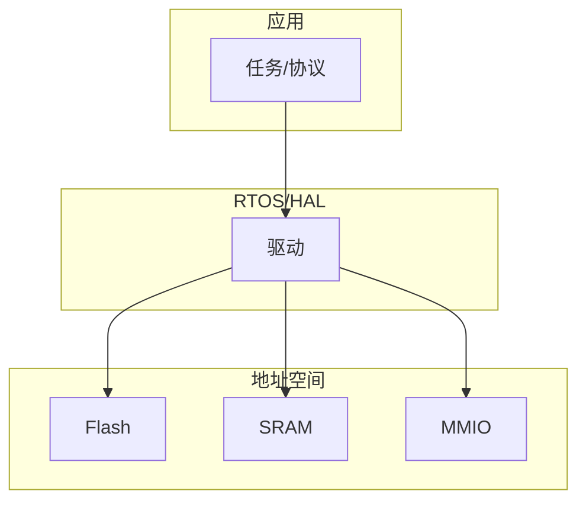

# 嵌入式系统概述完整篇：从 MCU/SoC、启动链到 BSP 与排障

板子「上电无输出、换 Flash 后 HardFault、Linux 能进 U-Boot 却 VFS panic」——根因多在 **内存映射、启动链阶段、BSP 与工具链** 不一致。本文从 MCU/SoC 分界、ROM→Bootloader→内核/RTOS、MMIO 与链接脚本、交叉编译/BSP、串口/JTAG 观测到启动失败对照，锚点对齐 U-Boot、CMSIS startup、Device Tree 与 Buildroot/Yocto 真实路径。合并自嵌入式系统模块 001–006 章。

## 源码锚点


| 路径 / 符号 | 作用 |
|-------------|------|
| `common/board_f.c` | `board_init_f`：DRAM 前初始化 |
| `common/board_r.c` | `board_init_r`、`main_loop` |
| `common/spl/spl.c` | SPL 加载 U-Boot 或 kernel |
| `cmd/bootm.c`、`arch/arm/lib/bootm.c` | `bootm`/`booti` |
| `include/configs/*.h` | load 地址、`CONFIG_SYS_SDRAM_BASE` |
| `CMSIS/Device/*/Source/startup_*.s` | 向量表、`Reset_Handler` |
| `arch/arm64/kernel/head.S` | Linux arm64 入口，x0=DTB |
| `drivers/of/fdt.c` | 内核 FDT 解析 |
| `scripts/dtc/dtc` | DTB 编译 |
| `share/openocd/scripts/` | OpenOCD 目标/接口 |
| Buildroot `board/*/` | defconfig、post-image |
| Yocto `meta-*/recipes-bsp/` | machine、kernel、u-boot |


```c
void board_init_f(ulong bootflag);   /* SRAM 阶段 */
void board_init_r(gd_t *new_gd, ulong dest_addr);  /* DRAM 后 */
```

```bash
printenv bootcmd bootargs
bdinfo
fatload mmc 0:1 ${kernel_addr_r} Image
booti ${kernel_addr_r} - ${fdt_addr_r}
fdtdump board.dtb | head -40
```

## 调用链

### SoC 上电到 Linux 用户态


```mermaid
flowchart TD
    ROM[Boot ROM] --> SPL[U-Boot SPL]
    SPL --> UB[U-Boot board_init_r]
    UB --> LD[加载 Image + DTB]
    LD --> BI[booti → head.S]
    BI --> SK[start_kernel]
    SK --> IC[do_initcalls]
    IC --> ROOT[mount rootfs]
    ROOT --> INIT[/sbin/init]
```


### MCU 分层与 MMIO 数据流





## 重点知识

### 1. 嵌入式定义与约束

嵌入式系统：面向特定功能、软硬件可裁剪、常长期运行。约束：**成本、功耗、体积、可靠性、实时性**。
交付物是 **固件镜像**；版本三元组 Bootloader / Kernel或App / Rootfs 必须可追溯。
| 约束 | 典型决策 |
|------|----------|
| 成本 | MCU vs SoC；Buildroot vs 完整发行版 |
| 功耗 | sleep、DVFS、关外设时钟 |
| 体积 | 无 HDD；squashfs 只读根 |

### 2. MCU、MPU 与 SoC

**MCU**：单芯片 CPU+Flash+SRAM+外设；Cortex-M；RTOS/裸机。
**MPU/SoC**：外接 DDR+eMMC；Cortex-A；Linux。
| 维度 | MCU | SoC+Linux |
|------|-----|-----------|
| RAM | 片上 KB～MB | 外置 DDR |
| 启动 | 向量→main | ROM→SPL→UB→kernel |
| 调试 | SWD | UART+JTAG |

### 3. Boot ROM 与 SPL

ROM 从固定地址取 SP/PC；可能 **验签** SPL（见安全篇）。
`common/spl/spl.c`：`spl_load_image()` 读 MMC/NAND/SPI。
**SPL_TEXT_BASE** 须在 on-chip SRAM；DDR 初始化失败则停 SPL 串口。
Serial Downloader：BOOT_MODE 引脚进 USB/UART 下载。

### 4. U-Boot 两阶段 init

`board_init_f`：CAR/SRAM 栈、`dram_init` 前时钟/定时器。
`board_init_r`：malloc、DM、存储、`env_relocate`、`main_loop`。
```bash
version
bdinfo
mmc list
```

### 5. 加载与启动 Linux

arm64：**`booti`** 传 kernel、initrd、fdt 地址。
arm32：**`bootz`** zImage；**`bootm`** uImage。
内核期望：**x0=FDT phys**（arm64）；cmdline 在 DT `/chosen/bootargs` 或 env。

### 6. Cortex-M 复位流程

`Reset_Handler`：设 SP→`SystemInit`→拷贝 `.data`→清 `.bss`→`main`。
向量表首字 `_estack`；第二字 `Reset_Handler` 地址。
**VTOR** 可重定位向量到 RAM（bootloader 跳 app）。
```bash
arm-none-eabi-objdump -d -j .isr_vector app.elf
```

### 7. 内存映射与 MMIO

外设 **load/store** 访问；地址来自 Reference Manual。
```text
Cortex-M: 0x40000000 外设; 0xE0000000 NVIC/SCB
SoC: DRAM 0x80000000 起; 外设分散 1MB 窗口
```
Flash **alias**（0x00000000 vs 0x08000000）与链接 ORIGIN 必须一致。

### 8. 链接脚本段布局

| 段 | 内容 |
|----|------|
| `.isr_vector` | 向量表 |
| `.text/.rodata` | 代码常量 |
| `.data` | 初值变量（LMA≠VMA） |
| `.bss` | 零初始化 |
`-Wl,-Map=app.map`**；HardFault PC 对照 map。

### 9. XIP 与 RAM 执行

代码从 Flash **XIP**；热函数可 `.ramfunc` 拷贝到 SRAM。
等效读 Flash 慢于 SRAM；高频 ISR 宜放 RAM。
QSPI Quad 模式需配置 wait-states 与 prefetch。

### 10. 交叉编译工具链

`arm-none-eabi` 裸机；`aarch64-linux-gnu` 64 位 Linux。
```bash
arm-none-eabi-gcc -mcpu=cortex-m4 -mthumb -Og -g -c main.c
arm-none-eabi-objcopy -O binary app.elf app.bin
```
`-mcpu`/`-mfpu`/`-mfloat-abi` 全工程一致。

### 11. BSP 内容与版本

BSP = U-Boot defconfig + DTS + kernel config + rootfs/板级 init + 硬件文档。
PCB Rev 变更须 bump BSP tag；DDR/PMIC 改而 timing 未改→随机故障。
U-Boot `board/<vendor>/<board>/board.c`；Linux `arch/*/boot/dts/`。

### 12. Device Tree 核心节点

`/memory`、`/chosen/bootargs`、`compatible`、`stdout-path`、`reserved-memory`。
```dts
chosen { bootargs = "console=ttyS0,115200 rootwait"; };
```
Overlays：`fdt apply`；Zephyr/部分 RTOS 也用 dts。

### 13. 串口 bring-up

```bash
picocom -b 115200 /dev/ttyUSB0
stty -F /dev/ttyUSB0 115200 cs8 -cstopb -parenb raw
```
U-Boot `CONFIG_DEBUG_UART`；Linux `earlycon=` + `console=`。
乱码→波特率/晶振；无输出→TX pinmux/电平。

### 14. JTAG 与 OpenOCD

```bash
openocd -f interface/stlink.cfg -f target/stm32f4x.cfg
arm-none-eabi-gdb -ex 'target remote :3333' app.elf
```
SWD 两线+CLK；多 tap 用 `scan_chain`。Semihosting 仅开发。

### 15. Buildroot 流程

```bash
make <board>_defconfig
make menuconfig   # BR2_TOOLCHAIN, BR2_LINUX_KERNEL
make
ls output/images/
```
`BR2_TARGET_GENERIC_GETTY_PORT` 与 `console=` 一致。

### 16. Yocto 流程

```bash
source oe-init-build-env build
bitbake core-image-minimal
```
`MACHINE=` 决定 tune、kernel provider、`KERNEL_DEVICETREE`。

### 17. 时钟树与 pinmux

MCU：HSE/HSI→PLL→AHB/APB；外设前 `__HAL_RCC_*_CLK_ENABLE()`。
SoC：U-Boot 或 Linux `clk` driver；DT `assigned-clocks`。
错 mux→UART 无波形；漏时钟→读寄存器全 0。

### 18. 存储与分区

SPI NOR XIP；eMMC `fatload`；NAND 需 ECC/UBIFS。
GPT + `root=PARTUUID=` 比 `/dev/mmcblk0p2` 稳。
A/B 分区配合 RAUC/swupdate OTA。

### 19. 工厂烧录

i.MX **`uuu`**；STM32 **DFU**；Rockchip **`rkdeveloptool`**。
IVT/DCD 头符合 Boot ROM；imx-image 打包。

### 20. QEMU 无板验证

```bash
qemu-system-aarch64 -M virt -cpu cortex-a57 -m 512M \
  -kernel Image -dtb virt.dtb -append 'console=ttyAMA0' -nographic
```

### 21. 启动失败对照

| 现象 | 阶段 | 处理 |
|------|------|------|
| 无输出 | ROM/SPL | 电源/时钟/串口脚 |
| 停 U-Boot | env | `printenv`、存储 |
| kernel 黑屏 | early | DTB、`earlycon` |
| VFS panic | mount | root=、驱动、fs |
| HardFault | app | 栈/map/非法地址 |

### 22. U-Boot env 脚本

```bash
setenv bootcmd 'mmc dev 0; fatload mmc 0:1 ${kernel_addr_r} Image; fatload mmc 0:1 ${fdt_addr_r} board.dtb; booti ${kernel_addr_r} - ${fdt_addr_r}'
saveenv
```
`kernel_addr_r`/`fdt_addr_r` 在 `include/configs/*.h` 定义，不可重叠。

### 23. 异构多核 AMP

STM32MP/i.MX8：A 核 Linux + M 核 FreeRTOS。
Linux `remoteproc` 加载 M 固件；RPMsg 通信。
M 核 fault 不在 Linux `dmesg`；需双串口。

### 24. watchdog 与复位

硬件 WDT 须周期 kick；Linux `/dev/watchdog`。
Brown-out：电压低于阈值复位；Flash 写时序注意。

### 25. 术语

| 术语 | 含义 |
|------|------|
| SPL | Secondary Program Loader |
| DTB | Device Tree Blob |
| MMIO | Memory-Mapped I/O |
| BSP | Board Support Package |
| XIP | Execute In Place |


## 启动链深化

### 26. SPL 与 IVT 布局

i.MX6/8 ROM 从 `0x00000000` 读 IVT；SPL 链接地址须在 OCRAM/SDRAM 窗口内。

| 字段 | 偏移 | 说明 |
|------|------|------|
| header | 0x00 | `0xD1` 魔数 |
| entry | 0x04 | SPL `_start` 物理地址 |
| dcd | 0x08 | DDR 初始化脚本指针 |
| boot_data | 0x0C | 镜像长度/加载地址 |
| self | 0x14 | IVT 自身地址 |
| csf | 0x18 | HAB 签名块（安全启动） |

U-Boot SPL 入口：`common/spl/spl.c` → `spl_load_image()`。

```bash
# 反汇编 SPL，确认入口与 load 段
arm-linux-gnueabihf-objdump -d u-boot-spl | head -80
arm-linux-gnueabihf-readelf -l u-boot-spl | grep LOAD
# i.MX 提取 IVT
dd if=u-boot-spl.bin bs=1 skip=1024 count=64 | hexdump -C
```

STM32MP157：`arch/arm/mach-stm32mp/cmd_stm32prog.c`；SPL 在 `drivers/mmc/` 初始化 SD/eMMC。

```bash
grep CONFIG_SPL_TEXT_BASE .config
grep CONFIG_SPL_STACK .config
strings u-boot-spl | grep -i spl
```

常见 SPL 失败：DDR 未 init（DCD 错）、`CONFIG_SPL_TEXT_BASE` 与链接脚本不一致、签名 CSF 不匹配。

```bash
# 串口 SPL 阶段无输出：查 early UART base
grep -r EARLY_UART .config include/configs/
```

### 27. mkimage 与 FIT 封装

U-Boot 识别镜像靠 `image.h` magic；`tools/mkimage.c` 写 header。

```bash
# 裸 Image → uImage（arm64 用 -A arm64 -O linux -T kernel -C none）
mkimage -A arm64 -O linux -T kernel -C none -a 0x80080000 -e 0x80080000 \
  -n 'Linux-6.6' -d arch/arm64/boot/Image uImage
# DTB 独立封装
mkimage -A arm64 -O linux -T flat_dt -C none -d board.dtb dtb.img
# 查看 header
mkimage -l uImage
file uImage
```

FIT 多镜像：`arch/arm/dts/*.its`，含 kernel/fdt/ramdisk 与 `configurations` 节点。

```bash
cat > fit.its <<'EOF'
/dts-v1/;
/ {
  description = "FIT";
  images {
    kernel { data = /incbin/("Image"); type = "kernel"; arch = "arm64"; compression = "none"; };
    fdt { data = /incbin/("board.dtb"); type = "flat_dt"; arch = "arm64"; compression = "none"; };
  };
  configurations {
    default = "conf-1";
    conf-1 { kernel = "kernel"; fdt = "fdt"; };
  };
};
EOF
mkimage -f fit.its fit.itb
dumpimage -l fit.itb
```

U-Boot 加载 FIT：`bootm ${loadaddr}#conf-1` 或 `bootm ${loadaddr}`。

```bash
setenv fdtfile imx8mm-evk.dtb
bootm ${loadaddr}
iminfo ${loadaddr}
```

### 28. NFS/TFTP 开发流

典型 lab：`tftpboot` 拉 kernel+dtb，NFS 挂 rootfs，改用户态无需重烧 Flash。

主机侧：

```bash
# /etc/default/tftpd-hpa
TFTP_DIRECTORY="/srv/tftp"
TFTP_ADDRESS=":69"
sudo systemctl restart tftpd-hpa
cp Image board.dtb /srv/tftp/
# /etc/exports
/srv/nfsroot 192.168.1.0/24(rw,sync,no_subtree_check,no_root_squash)
sudo exportfs -ra
showmount -e localhost
```

U-Boot env：

```bash
setenv serverip 192.168.1.10
setenv ipaddr 192.168.1.20
setenv nfsroot /srv/nfsroot,v3,tcp
setenv bootargs 'console=ttyS0,115200 root=/dev/nfs nfsroot=${serverip}:${nfsroot} ip=dhcp rw'
setenv bootcmd 'tftpb ${kernel_addr_r} Image; tftpb ${fdt_addr_r} board.dtb; booti ${kernel_addr_r} - ${fdt_addr_r}'
saveenv
```

内核需 `CONFIG_IP_PNP`、`CONFIG_ROOT_NFS`、`CONFIG_NFS_V3`。

```bash
grep CONFIG_ROOT_NFS /boot/config-$(uname -r)
grep CONFIG_IP_PNP /boot/config-$(uname -r)
```

排障：

| 现象 | 查 | 命令 |
|------|-----|------|
| TFTP timeout | 网线/ serverip | `ping ${serverip}` |
| NFS mount fail | export/防火墙 | 主机 `rpcinfo -p` |
| VFS unable mount | bootargs root= | `printenv bootargs` |

```bash
nfsstat -c
tcpdump -ni eth0 port 2049 -c 20
```

### 29. 分区布局与 Squashfs/overlay

eMMC 常见：`/dev/mmcblk0p1` boot（FAT，U-Boot+dtb），p2 rootfs（ext4/squashfs），p3 data。

```bash
# 查看分区
lsblk -f /dev/mmcblk0
cat /proc/partitions
fdisk -l /dev/mmcblk0
```

Buildroot `genimage.cfg` 示例：

```bash
image boot.vfat {
  vfat { files = { "u-boot.imx", "Image", "board.dtb" } }
  size = 64M
}
image rootfs.ext4 {
  ext4 { image = "rootfs.ext4" }
  size = 512M
}
```

Squashfs 只读根 + overlay：

```bash
# 构建
mksquashfs rootfs/ rootfs.sqfs -comp xz -noappend
# 内核 cmdline
root=/dev/mmcblk0p2 squashfs overlayroot=tmpfs
# 或 initramfs 脚本 mount overlay
lowerdir=/ro upperdir=/rw/upper workdir=/rw/work mergedir=/overlay
mount -t overlay overlay -o lowerdir=${lowerdir},upperdir=${upperdir},workdir=${workdir} ${mergedir}
```

```bash
unsquashfs -l rootfs.sqfs | head
cat /proc/mounts | grep overlay
df -h /
```

### 30. initramfs 集成

路径：`usr/gen_initramfs.sh`、`init/main.c` → `prepare_namespace()`。

```bash
# 最小 initramfs 列表
cat > initramfs.list <<'EOF'
dir /dev 755 0 0
nod /dev/console 644 0 0 c 5 1
dir /bin 755 0 0
file /bin/busybox busybox 755 0 0
slink /init /bin/busybox 777 0 0
EOF
usr/gen_initramfs.sh -o initramfs.cpio.gz initramfs.list
ls -lh initramfs.cpio.gz
```

内核配置：

```bash
grep CONFIG_INITRAMFS /boot/config-$(uname -r)
grep CONFIG_BLK_DEV_INITRD .config
```

U-Boot 传 initrd：

```bash
tftpb ${ramdisk_addr_r} initramfs.cpio.gz
booti ${kernel_addr_r} ${ramdisk_addr_r}:${filesize} ${fdt_addr_r}
```

排障 initramfs panic：

```bash
dmesg | grep -i initramfs
zcat initramfs.cpio.gz | cpio -t | head -30
file initramfs.cpio.gz
```

### 31. 串口波特率与 earlycon

U-Boot：`CONFIG_BAUDRATE=115200`；Linux `console=ttyS0,115200n8`。

Device Tree serial：`arch/arm/boot/dts/*.dts` 中 `serial0 = &uart0`。

```bash
fdtdump board.dtb | grep -A5 uart
grep stdout-path /proc/device-tree/chosen/stdout-path 2>/dev/null | tr '\0' ' '
```

earlycon（内核极早日志）：

```bash
# PL011
earlycon=pl011,0x09000000
# 8250
earlycon=uart8250,mmio,0x10009000
# 与 console 并存
bootargs='earlycon=pl011,0x09000000 console=ttyAMA0,115200n8'
```

波特率不匹配表现为乱码；用 `stty` 验证 host 侧：

```bash
stty -F /dev/ttyUSB0 115200 cs8 -cstopb -parenb raw -echo
picocom -b 115200 /dev/ttyUSB0
minicom -D /dev/ttyUSB0 -b 115200
```

```bash
# 查当前 tty 参数
stty -F /dev/ttyS0 -a
cat /sys/class/tty/ttyS0/uartclk
```

### 32. 电源域与复位原因

SoC 复位源：POR、watchdog、software reset、brown-out。读 `SRC_SRSR`（i.MX）或 `RCC_RSR`（STM32）。

```bash
# Linux 重启原因（若驱动导出）
cat /sys/kernel/debug/reset_reason 2>/dev/null
dmesg | grep -i reset
dmesg | grep -i watchdog
```

U-Boot：`reset` 命令；PMIC 下电序列在 `drivers/power/pmic/`。

```bash
pmic dump
regulator list
```

Brown-out：Flash 编程时 VCC 跌落导致 bit 翻转；量产测 BOD 阈值。

```bash
# 示波器触发点：VCC 与 RESET#
# 软件读 BOD 标志
devmem2 0x02000000  # 示例，依 SoC 手册
```

上电时序：PMIC enable → 时钟 → DDR train → SPL；任一步失败无后续 log。

### 33. 量产烧录流程

| 介质 | 工具 | 典型命令 |
|------|------|----------|
| eMMC/SD | dd / bmaptool | `bmaptool copy image.wic /dev/sdX` |
| SPI NOR | flashrom | `flashrom -p linux_spi:dev=/dev/spidev0.0 -w fw.bin` |
| eFuse | uuu/mfgtools | `uuu uuu.auto` |
| STM32 | STM32CubeProgrammer CLI | `STM32_Programmer_CLI -c port=SWD -w fw.bin` |

```bash
# WIC 镜像写入（禁止写错盘）
lsblk
sudo bmaptool copy build/image.wic /dev/mmcblk0 --nobmap
sync
```

i.MX `uuu` 脚本片段：

```bash
uuu_version 1.2.39
SDP: boot -file u-boot-dtb.imx -vid 0x1fc9 -pid 0x0152
FB: flash -raw2sparse all build/rootfs.sdcard
```

校验：

```bash
sha256sum image.wic
cmp -n 1048576 /dev/mmcblk0 image.wic  # 抽样
```

### 34. OTA 与 A/B 分区

Android-style A/B：`slot_a`/`slot_b` boot+system；U-Boot `bootcount`/`upgrade_available`。

```bash
# RAUC（Buildroot BR2_PACKAGE_RAUC）
rauc status
rauc install update.raucb
cat /etc/rauc/system.conf
```

SWUpdate：`swupdate -i update.swu`；描述文件 `sw-description` 定义分区写入。

```bash
swupdate -v -i update.swu -e stable,now_A_next_B
fw_printenv bootslot
fw_setenv bootslot b
```

Mender：`mender-artifact write rootfs-image -f rootfs.ext4 -o artifact.mender`。

```bash
mender show-artifact artifact.mender
journalctl -u mender -n 50
```

失败回滚：保留上一 slot 可 boot 镜像；OTA 前读 `fw_printenv` 备份 env。

### 35. 启动失败对照矩阵

| 阶段 | 现象 | 可能根因 | 验证 |
|------|------|----------|------|
| ROM | 无任何输出 | boot mode 脚错 | 查 HW 手册 boot cfg |
| SPL | 单字符后停 | DDR train 失败 | JTAG 读 OCRAM |
| U-Boot | `### Error` | env 损坏 | `env default -a; saveenv` |
| Linux | `VFS: Cannot open root device` | root= 错/驱动缺 | `printenv bootargs`; `ls /dev/mmcblk*` |
| Linux | `Kernel panic - not syncing: VFS` | 根文件系统损坏 | `fsck` / 重烧 rootfs |
| DT | `Unable to handle kernel paging request` | reserved-memory 重叠 | `fdtdump`; `/proc/iomem` |

```bash
# U-Boot 阶段
bdinfo
mmc list
mmc dev 0
mmc part
fatls mmc 0:1
```

```bash
# Linux 起不来留 init=/bin/sh
setenv bootargs 'console=ttyS0,115200 init=/bin/sh rw'
booti ${kernel_addr_r} - ${fdt_addr_r}
```

```bash
# 内核解压失败
iminfo ${kernel_addr_r}
crc32 ${kernel_addr_r} ${filesize}
```

### 36. 板级验证命令集

```bash
# 1. 工具链与镜像
arm-linux-gnueabihf-gcc --version
file u-boot-spl u-boot.img zImage Image
strings u-boot | grep U-Boot
```

```bash
# 2. DTB 与内核配置
fdtdump board.dtb | less
fdtget board.dtb /chosen bootargs 2>/dev/null
scripts/config -e CONFIG_SERIAL_8250
grep CONFIG_CMD_BOOTM .config
```

```bash
# 3. 存储与文件系统
lsblk
blkid
fsck -n /dev/mmcblk0p2
mount | grep mmc
```

```bash
# 4. 运行时健康
cat /proc/cpuinfo | head
cat /proc/meminfo | head -5
cat /proc/interrupts | head
dmesg | tail -30
```

```bash
# 5. 网络（若板载）
ip link
ping -c 3 192.168.1.1
ethtool eth0 2>/dev/null
```

```bash
# 6. OpenOCD 快速 attach
openocd -f board/stm32f4discovery.cfg -c 'init; reset halt; reg'
```

### 37. imximage 与 boot0 偏移

i.MX 需要在镜像前加 IVT+DCD：`u-boot.imx` 由 `mkimage -n imx8mm -T imximage` 生成。
```bash
mkimage -n ./imximage.cfg -T imximage -e 0x40200000 -d u-boot-dtb.bin u-boot.imx
dd if=u-boot.imx bs=1 skip=0 count=512 | hexdump -C | head
grep IMAGE_LOAD_OFFSET include/configs/imx8mm_evk.h
```

### 38. fastboot 与 USB 下载

Android fastboot 协议：`fastboot flash boot boot.img`。
```bash
fastboot devices
fastboot getvar version
fastboot flash boot build/boot.img
fastboot reboot
lsusb | grep -i fastboot
```

### 39. dm-verity 与只读根

块设备完整性：`veritysetup format` 生成 hash 树。
```bash
veritysetup format /dev/mmcblk0p2 /dev/mmcblk0p3
grep verity /etc/crypttab 2>/dev/null
dmesg | grep -i verity
```

### 40. RPMsg 与 remoteproc 快查

```bash
ls /sys/class/remoteproc/
cat /sys/class/remoteproc/remoteproc0/state
ls /dev/rpmsg*
dmesg | grep remoteproc
```

### 41. Buildroot post-image 钩子

锚点：`BR2_ROOTFS_POST_IMAGE_SCRIPT`。

```bash
board/raspberrypi/post-image.sh
grep -r BR2_ROOTFS_POST_IMAGE_SCRIPT . 2>/dev/null | head -3
```

### 42. Yocto wic 镜像

锚点：`wic ls build/tmp/deploy/images/*/`。

```bash
bitbake core-image-minimal
grep -r wic . 2>/dev/null | head -3
```

### 43. crosstool-ng 采样

锚点：`.config 中 CT_KERNEL_LINUX_V`。

```bash
ct-ng arm-unknown-linux-gnueabihf
grep -r .config . 2>/dev/null | head -3
```

### 44. kas 多仓库 YAML

锚点：`repos: meta-*/`。

```bash
kas build kas.yml
grep -r repos: . 2>/dev/null | head -3
```

### 45. binwalk 固件解包

锚点：`cd _firmware.bin.extracted`。

```bash
binwalk -e firmware.bin
grep -r cd . 2>/dev/null | head -3
```

### 46. i.MX8MM eMMC boot0

Boot ROM 从 eMMC boot 分区读 SPL；`mmc partconf` 切换分区。
```bash
mmc extcsd read 8 | grep BOOT
mmc bootbus 0 2 0 0
fatls mmc 1:1
```

### 47. STM32MP SD 卡启动

拨码 SW1 选 SD；SPL 在 `arch/arm/mach-stm32mp/`。
```bash
mmc dev 0
mmc info
fatload mmc 0:4 ${loadaddr} uImage
```

### 48. SPI NOR XIP 内核

小系统：`root=/dev/mtdblock2`；`dmesg | grep mtd`。
```bash
cat /proc/mtd
mtdinfo /dev/mtd0
flash_erase /dev/mtd1 0 0
flashcp -v rootfs.sqfs /dev/mtd1
```

### 49. HAB 安全启动链

i.MX HAB：`hab_status` 在 U-Boot；CSF 在 IVT。
```bash
hab_status
fuse read 1 6
CST 工具签名：scripts/cst --o signed.bin u-boot.imx
```

### 50. ramdisk 地址对齐

arm64 `booti` 要求 ramdisk 与 kernel 不重叠。
```bash
printenv kernel_addr_r ramdisk_addr_r fdt_addr_r
grep -E 'kernel_addr|ramdisk_addr|fdt_addr' include/configs/*.h
iminfo ${kernel_addr_r}
```

### 51. kgdb 与 early debug

```bash
bootargs='kgdboc=ttyS0,115200 kgdbwait'
echo g > /proc/sysrq-trigger  # 已启动后
grep CONFIG_KGDB /boot/config-$(uname -r)
```

### 52. ftrace 早期函数 trace

```bash
mount -t debugfs none /sys/kernel/debug
echo function_graph > /sys/kernel/debug/tracing/current_tracer
echo schedule > /sys/kernel/debug/tracing/set_graph_function
cat /sys/kernel/debug/tracing/trace | head -50
```

### 53. eMMC 健康与寿命

```bash
mmc extcsd read /dev/mmcblk0 | grep -i life
cat /sys/block/mmcblk0/device/life_time
smartctl -a /dev/mmcblk0 2>/dev/null | head -20
```

### 54. USB gadget 量产模式

```bash
ls /sys/class/udc/
configfs 挂载后在 /sys/kernel/config/usb_gadget/
fastboot 与 g_mass_storage 脚本见 board/*/ums.txt
```

### 55. 双备份 env 与 redundant

```bash
grep CONFIG_ENV_IS_IN_MMC .config
fw_printenv -c /etc/fw_env.config
fw_setenv bootcount 0
printenv bootlimit upgrade_available
```

### 56. 镜像完整性

```bash
md5sum Image uImage fit.itb
crc32 Image
cmp -n 4096 Image Image.bak
```

### 57. DTB 一致性

```bash
fdtdump board.dtb | md5sum
diff <(fdtdump a.dtb) <(fdtdump b.dtb) | head
dtc -I dtb -O dts board.dtb | grep model
```

### 58. 根文件系统

```bash
debugfs -R 'stat /sbin/init' rootfs.ext4
e2fsck -n rootfs.ext4
file rootfs.sqfs
```

### 59. 内核模块

```bash
modinfo snd_soc_imx 2>/dev/null | head
depmod -a -b staging/
lsmod | grep imx
```

### 60. 实时性采样

```bash
cyclictest -p 80 -m -n -i 1000 -l 10000 2>/dev/null | tail
cat /proc/interrupts | grep timer
```

### 61. 启动日志抓取脚本

```bash
SCRIPT=/tmp/capture-boot.sh
cat > $SCRIPT <<'EOS'
#!/bin/sh
dmesg -w > /var/log/dmesg-live.log &
EOS
chmod +x $SCRIPT
```

### 62. 分区 UUID 与 fstab

```bash
blkid /dev/mmcblk0p2
grep UUID /etc/fstab
findmnt -no SOURCE /
```

