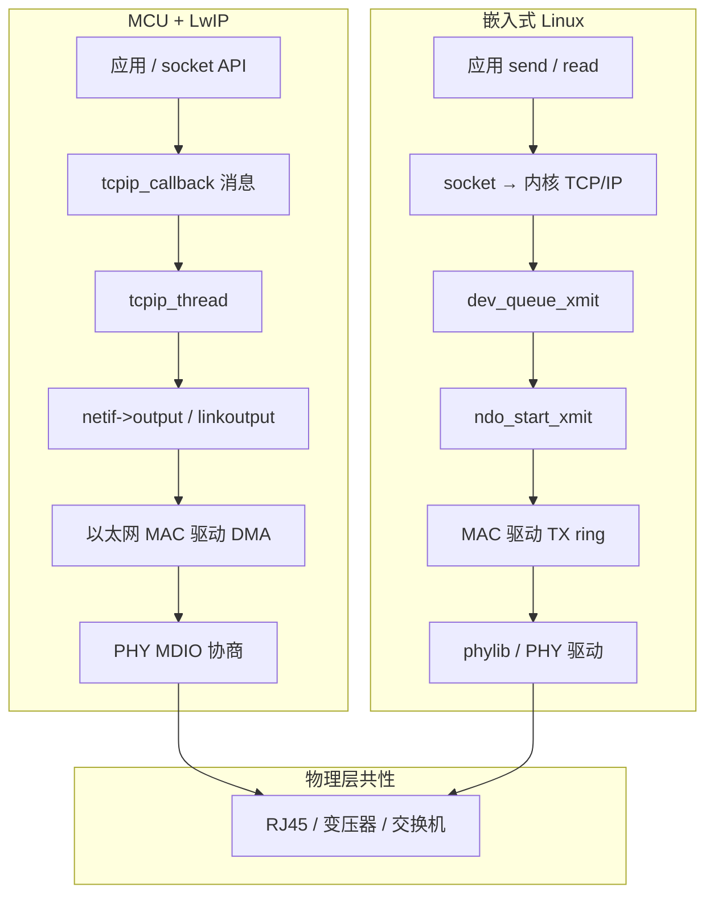
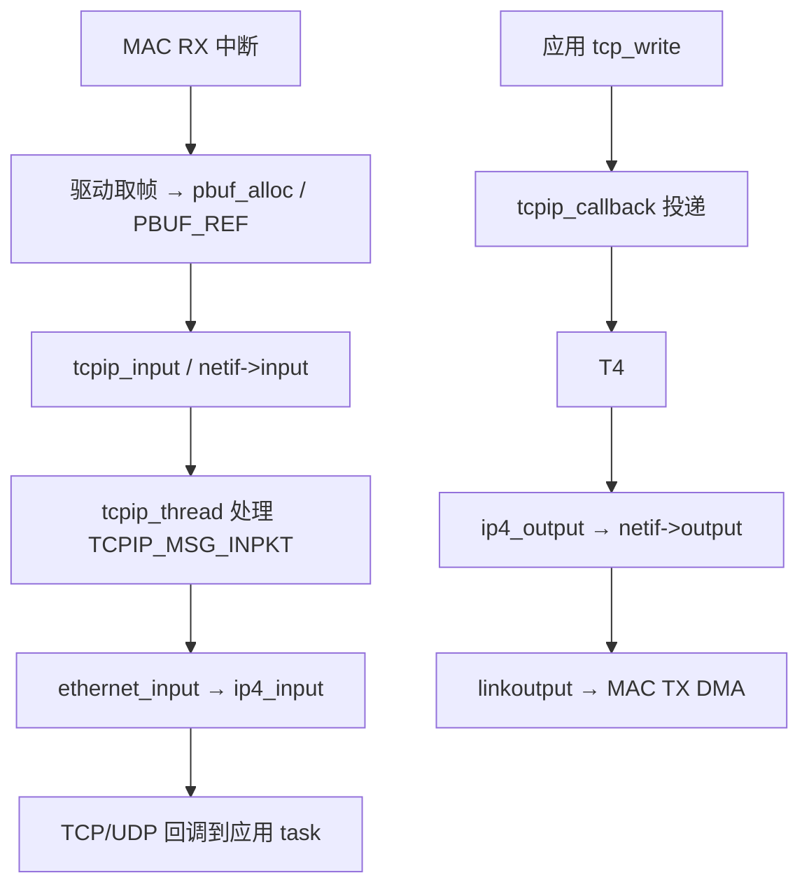
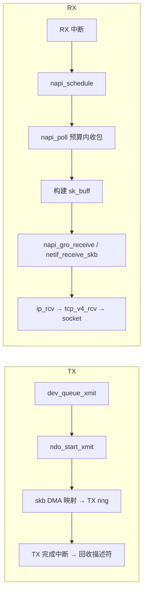

# 嵌入式网络完整篇：从 LwIP/以太网驱动到 Linux netdev 与排障

MCU 跑 FreeRTOS + LwIP，Linux 板子用 `eth0` + systemd-networkd——两条路径最终都要过 **MAC/PHY**，但软件栈完全不同：前者靠 `netif` 与 `tcpip_thread` 串协议，后者靠 `net_device` 与内核 NAPI 进协议栈。排障时「网口灯亮 ping 不通」「DHCP 拿不到地址」「吞吐只有几 Mbps」，若分不清 L2/L3 与 offload 边界，很容易在应用层空转。

工业网关、车载 T-Box、摄像头 IPC 等场景，有线以太网仍是默认上联：MCU 侧常选 LwIP 2.x 减 RAM 占用；Linux 侧则直接复用主线 `drivers/net/ethernet` 与成熟 DHCP/防火墙生态。同一硬件团队往往两条线并行——本文帮助你在 **同一套 PHY/MAC 知识** 下切换视角，而不是把 Linux 内核文档和 LwIP 手册割裂阅读。

本文按 **MCU（LwIP）** 与 **嵌入式 Linux（netdev）** 两条主线对照，覆盖 PHY/MAC、地址配置、吞吐与零拷贝思路，以及链路灯亮不通、checksum offload、MTU 等常见坑；路径均可在上游源码中核对，读完应能对照 `tcpip.c` 与 `dev.c` 自己跟一次收发包。文中 **MCU** 指无 Linux 的 RTOS/Bare-metal + LwIP；**Linux** 指主线内核 + 用户态网络配置，不含 WiFi 无线栈细节。

## 源码锚点

| 路径 | 平台 | 作用 |
|------|------|------|
| `src/core/tcpip.c` | **MCU · LwIP** | `tcpip_init`、`tcpip_thread`、邮箱消息调度 |
| `src/core/netif.c` | **MCU · LwIP** | `netif_add`、`netif_set_up`、`netif_input` |
| `src/netif/ethernet.c` | **MCU · LwIP** | 以太网帧入栈、`ethernet_input`、类型分发 |
| `src/include/lwip/netif.h` | **MCU · LwIP** | `struct netif`、`input`/`output`/`linkoutput` |
| `src/netif/ethernetif.c` | **MCU · LwIP** | 模板：low_level_init/output/input |
| `src/core/pbuf.c` | **MCU · LwIP** | `pbuf` 链分配，零拷贝与池大小 |
| `src/core/ipv4/dhcp.c` | **MCU · LwIP** | `dhcp_start`、DISCOVER/OFFER 状态机 |
| `include/linux/netdevice.h` | **Linux** | `struct net_device`、`net_device_ops` |
| `net/core/dev.c` | **Linux** | `register_netdev`、`dev_queue_xmit`、`netif_receive_skb` |
| `include/linux/napi.h` | **Linux** | `napi_struct`、`napi_schedule`、`napi_poll` |
| `net/core/skbuff.c` | **Linux** | `sk_buff` 分配，DMA 映射载体 |
| `drivers/net/ethernet/` | **Linux** | SoC MAC 驱动（`stmmac`、`fec`、`dwmac` 等） |
| `drivers/net/phy/` | **Linux** | `phylib`、`phy_connect`、MDIO 总线 |
| `Documentation/devicetree/bindings/net/` | **Linux** | DT：`phy-handle`、`phy-mode` |

LwIP 注册网口（概念）：

```c
/* src/core/netif.c — MCU 侧 */
err_t netif_add(struct netif *netif, const ip4_addr_t *ipaddr,
                const ip4_addr_t *netmask, const ip4_addr_t *gw,
                void *state, netif_init_fn init, netif_input_fn input);
```

Linux 注册网卡（概念）：

```c
/* include/linux/netdevice.h — Linux 侧 */
int register_netdev(struct net_device *dev);
netdev_tx_t (*ndo_start_xmit)(struct sk_buff *skb, struct net_device *dev);
```

## 先建立双路径：MCU LwIP vs Linux netdev



**对照要点**：

- **LwIP**：`NO_SYS=0` 时，`tcpip_thread` 独占协议栈；驱动 ISR 里组好 `pbuf` 后调 `tcpip_input()`，不在中断里跑 TCP 状态机。
- **Linux**：协议栈在内核；驱动只实现 `netdev_ops` 与 NAPI；DHCP、路由、防火墙在用户态或 netlink 配置。
- **共性**：PHY 协商成功（灯亮）≠ IP 层可达；还要 ARP、网关、路由正确。

## 调用链

### MCU：RX 从 DMA 到 TCP（LwIP）



跟读顺序：`src/core/tcpip.c`（线程主循环）→ `src/netif/ethernet.c`（`ethernet_input`）→ 板级 `ethernetif.c`（`low_level_output`）。

注意 **RX 路径线程边界**：ISR 里只做「取描述符 → 挂 pbuf → 通知 tcpip」，解析以太类型、走 ARP/IP 一律在 `tcpip_thread`；若在 ISR 里调 `ethernet_input`，与 LwIP 锁模型冲突，是 MCU 项目里常见移植错误。

### Linux：TX/RX 与 NAPI



跟读顺序：`net/core/dev.c`（`dev_queue_xmit`、`netif_receive_skb`）→ `drivers/net/ethernet/<soc>/` 具体驱动的 `probe`、`ndo_start_xmit`、`poll`。

Linux 收包在 **`NET_RX_SOFTIRQ`** 上下文执行 NAPI poll，与进程无关；因此 high load 时会出现 **应用 CPU 不高但 softirq 占满**。用 `cat /proc/softirqs` 看 NET_RX 计数是否单核飙高，再考虑 RPS 或多队列。

## 重点知识

### 1. LwIP `netif` 与 `tcpip_thread`

`struct netif` 是 LwIP 网卡抽象。板级驱动在 `ethernetif.c` 里实现：

| 回调 | 作用 |
|------|------|
| `low_level_init` | 初始化 MAC、描述符、PHY |
| `netif->output` | 通常 `etharp_output`，再调 `linkoutput` |
| `linkoutput` | 把 `pbuf` 链写入 TX DMA |
| 注册 `input` | 设为 `tcpip_input`，包进协议线程 |

`tcpip_init()`（`src/core/tcpip.c`）创建 `tcpip_thread`，`tcpip_input()`、`tcpip_callback()` 经邮箱串行——**ISR 里禁止直接 `tcp_write`**。`NO_SYS=1` 裸机模式无独立线程，主循环里调 `sys_check_timeouts()`，需自行保证与 ISR 的临界区。

`lwipopts.h` 常改项：`MEM_SIZE`、`PBUF_POOL_SIZE`、`PBUF_POOL_BUFSIZE`（≥ MTU+以太头）、`LWIP_DHCP`、`TCPIP_MBOX_SIZE`（RX 突发时防丢消息）。

### 2. Linux `net_device`、NAPI 与以太网驱动目录

probe 典型流程：`alloc_etherdev` → 填 `netdev_ops`、`ethtool_ops` → `register_netdev`（`net/core/dev.c`）。`ndo_open`：申请 IRQ、启 DMA、`napi_enable`、`netif_start_queue`；`ndo_stop` 对称停干净，防卸模块 Oops。

| 回调 | 作用 |
|------|------|
| `ndo_open` / `ndo_stop` | 启停硬件与 NAPI |
| `ndo_start_xmit` | 发包；环满返回 `NETDEV_TX_BUSY` |
| `ndo_set_rx_mode` | 组播/混杂 |
| `ndo_tx_timeout` | TX 卡死复位入口 |

收包走 **NAPI**：硬中断只 `napi_schedule`，`napi_poll` 在 budget 内批量收，降低中断风暴。TX 完成中断里 `netif_wake_queue` 解除背压。

嵌入式 SoC 驱动集中在 `drivers/net/ethernet/`：STM32 `stmmac`、NXP `fec`、Allwinner `sunxi-gmac` 等。读任一驱动，抓住 **probe → ndo_open → start_xmit → napi_poll** 即可迁移到其他芯片。

### 3. PHY 与 MAC：两层都要通

| 层级 | MCU | Linux |
|------|-----|-------|
| MAC | 片上 EMAC + 厂商 HAL | `drivers/net/ethernet/` |
| PHY | LAN8720、RTL8201 等，MDIO | `drivers/net/phy/` + `phylib` |
| 总线 | RMII / RGMII / MII | DT `phy-mode = "rmii"` 等 |
| 链路 | 读 PHY BMSR / 驱动 link 回调 | `netif_carrier_on/off`、`ethtool` |

**链路 up**（灯亮、carrier on）只表示 L2 协商成功；**ping 通** 还需：本机 IP/掩码、网关、对端 ARP、路由、iptables/nftables。Linux 先看 `ip link` carrier，再看 `ip route get <dst>`；MCU 打印 `netif_ip4_addr`、`netif_ip4_gw`。

设备树示例要素（Linux）：MAC 节点 `compatible`、`reg`、中断；`phy-handle = <&phy0>`；`phy-mode` 与硬件走线一致；缺 PHY 驱动时 probe 成功但 carrier 永远 down。

### 4. DHCP 与静态 IP

| | MCU（LwIP） | Linux |
|--|-------------|-------|
| 静态 | `netif_set_addr` 后 `netif_set_up` | `ip addr add` / `.network` |
| DHCP | `dhcp_start(netif)`，见 `dhcp.c` | `udhcpc`、`dhcpcd`、NetworkManager |
| 租约续期 | `dhcp_coarse_tmr` / fine timer | 用户态守护进程 |
| DNS | `dns_setserver`（若启用 DNS 模块） | `/etc/resolv.conf` |

顺序坑：必须先 **netif/link up** 再 DHCP；静态与 DHCP 勿重复设址。多网卡 Linux 注意 default route metric，避免 DHCP 和静态网关冲突。

MCU 最小验证：抓包看 DISCOVER 是否发出；Linux：`tcpdump -i eth0 port 67 or 68 -n`。

静态 IP 现场核对三项：**地址/掩码/网关** 是否与 PC 或上位机同网段；网关一般是 `.1` 但不绝对，以交换机/路由器配置为准。LwIP 改 IP 后若 ARP 缓存旧条目，可重启 netif 或等 `etharp` 超时。Linux 侧对等命令为 `ip neigh flush dev eth0`。

### 5. 吞吐与零拷贝思路

**LwIP 侧**：

- `PBUF_RAM`：栈内拷贝，简单稳妥。
- `PBUF_REF` / `PBUF_ROM`：引用外部 DMA 缓冲，TX 完成后才 `pbuf_free`，需与驱动描述符生命周期对齐。
- 调 `PBUF_POOL_SIZE`、MAC RX 环深度；提高 `tcpip` 任务优先级；避免在 `linkoutput` 里阻塞等待。

**Linux 侧**：

- skb 数据区 DMA 映射；GRO 合并小包减 CPU；多队列 + RPS/XPS 打散 softirq。
- `ethtool -k eth0` 查看 checksum/TSO/GRO offload；嵌入式弱 CPU 可开硬件校验和，但见下一节 offload 坑。

零拷贝核心：**谁分配、谁释放、何时交还**。提前 `pbuf_free` / `dev_kfree_skb` 会导致 DMA 还在读写的内存被复用，现象是随机崩溃或校验和错。

### 6. 常见坑：链路灯亮不通、checksum offload、MTU

**链路灯亮但 ping 不通**

分层排查：

1. L1/L2：`ethtool eth0` 或 PHY 寄存器确认 link、speed、duplex；RMII REF_CLK 是否供对。
2. L3：本机 IP 是否与对端同网段；网关是否可达；`arp -n` 是否有条目。
3. 过滤：交换机 VLAN、MAC 白名单、iptables/nftables、LwIP `LWIP_ACD` 地址冲突。
4. 双网卡：流量是否走错 `netif` / `eth0` vs `eth1`。

**checksum offload**

硬件 offload 开启时，协议栈假定 NIC 已算好校验和；若驱动 TX 路径又改 IP/TCP 头而不通知栈，或 RX 标记 `CHECKSUM_UNNECESSARY` 但数据已坏，表现为「能连但 TCP 重传极多」。排查：`ethtool -k eth0 tx off rx off` 对比；LwIP 侧核对 `LWIP_CHECKSUM_CTRL_PER_NETIF` 与 MAC 是否真支持硬件 checksum。

**MTU**

默认 1500；路径 MTU 不一致时 TCP 可能 silent black hole。验证：`ping -M do -s 1472 <gw>`（Linux）；LwIP 设 `netif->mtu`，超 MTU 包需 IP 分片或 PMTUD。工业网改 MTU 时必须端到端一致，包括交换机与对端。

**其他高频问题**

| 现象 | 方向 |
|------|------|
| DHCP 无 OFFER | 未 up、VLAN、防火墙、单臂路由 |
| 吞吐极低 | 未用 NAPI、单核 softirq、pbuf 池太小、轮询代替中断配置不当 |
| TX timeout | DMA 停、完成中断丢失、PHY reset 时序 |
| 运行一段时间后断 | 描述符/pbuf 泄漏、PHY 节能、看门狗 |

### 7. 板级集成：从原理图到第一包

**MCU Bring-up 顺序**（建议固定，少踩坑）：

1. 确认 PHY 电源、25MHz/50MHz 参考时钟、RMII/RGMII 走线长度与端接。
2. MDIO 读写 PHY ID（如 `0x0007` 对 LAN8720），证明管理总线通。
3. 初始化 MAC DMA 描述符环，先跑通 **裸 ping 静态 IP**（关 DHCP），再开 `dhcp_start`。
4. `netif_add` → `netif_set_default` → `netif_set_up` → `netif_set_link_up`（链路真 up 后再设）。
5. 应用层 socket 测试前，先用 `ping`  raw API 或 lwIP `ping` 例程验证 L3。

**Linux Bring-up 顺序**：

1. `dmesg` 确认 MAC 驱动 probe、PHY 绑定（`phydev` 名称）、`Link is Up`。
2. `ip link set eth0 up`；静态 IP 或 `udhcpc`；`ping` 网关再 ping 外网。
3. 若 probe 失败：查 DT `compatible`、`reg`、时钟、`reset-gpios`；PHY 节点 `reg = <0>` MDIO 地址是否与硬件 strap 一致。
4. 产线可写 MAC 地址：OF `local-mac-address`、EEPROM、或 `ip link set eth0 address`。

**FreeRTOS + LwIP 任务划分**：常见 `tcpip` 任务优先级高于应用、低于 MAC ISR Delegator；邮箱深度 `TCPIP_MBOX_SIZE` 与 RX 环匹配。RX 突发时邮箱满会丢包，表现为 TCP 重传而非硬 fault。

### 8. 两条路径的设计差异（为何这样拆）

| 维度 | LwIP（MCU） | Linux netdev |
|------|-------------|--------------|
| 内存 | 静态池、KB 级 RAM | 页分配、skb 缓存 |
| 并发 | 单 tcpip 线程 + 临界区 | 多 CPU、per-CPU softirq |
| 协议 | 裁剪编译，可关 IPv6/HTTP | 完整栈、iptables、路由表 |
| 驱动边界 | `linkoutput` / ISR | `netdev_ops` + NAPI |
| 配置 | `lwipopts.h`、代码写死 | DT、sysfs、netlink、用户态 |

LwIP 的设计目标是在 **无 MMU、无内核** 条件下提供 BSD socket 子集；Linux  netdev 则是 **统一抽象所有 L2 设备**（以太、WiFi、CAN-gw 等），上层只认 `sk_buff`。理解这一层，就不会在 MCU 上找 `register_netdev`，也不会在 Linux 上改 `tcpip_thread`。

### 9. 排障决策树（有线通用）

```text
网口无链路（灯不亮 / carrier off）
  → PHY 电源/时钟/模式(RMII) → MDIO 读 ID → 驱动 probe/DT

链路 up 但无 IP
  → 接口是否 up → DHCP 抓包 → 静态配置是否冲突

有 IP ping 不通网关
  → ARP 表 → 掩码/网关 → VLAN/ACL → 双网卡路由

ping 网关通、外网不通
  → default route → NAT/防火墙 → DNS（与应用层区分）

ping 通但 TCP 业务慢/断
  → offload/MTU → 丢包统计(ethtool -S) → pbuf/skb 泄漏
```

嵌入式现场优先 **缩小问题面**：同交换机、同网线、笔记本对 ping，排除上层业务；再 split  MCU/Linux 路径各自查锚点文件。

### 10. 调试命令速查

**Linux**：

```bash
ip link; ip addr; ip route
ethtool eth0; ethtool -k eth0; ethtool -S eth0
cat /proc/net/softnet_stat
dmesg | grep -iE 'eth|phy|link'
tcpdump -i eth0 -n arp or icmp
```

**MCU（LwIP）**：开 `LWIP_DEBUG` 子模块；统计 `pbuf` 分配失败计数；GPIO 翻转量 ISR 与 `tcpip` 处理频率；用 Wireshark 看镜像口或 TAP 抓包。

### 11. Socket 层与协议裁剪

LwIP 在 `NO_SYS=0` 时提供 `lwip_socket` / `lwip_select`，底层仍经 `tcpip_thread` 串行。`lwipopts.h` 可关 `LWIP_TCP`、`LWIP_UDP`、`LWIP_ICMP` 等以减代码体积；但关 ICMP 会导致 ping 不通，产线连通性测试需知悉。

Linux 侧标准 BSD socket，与 netdev 解耦：网卡驱动不实现 socket，只实现 L2 收发。因此 **socket 报错 `Network unreachable` 先查路由**，而 **LwIP `ERR_CONN` 要先查 netif 是否 up、是否有 IP**——同一现象，排查入口不同。

协议裁剪之外，注意 **并发连接数**：LwIP `MEMP_NUM_TCP_PCB` 过小会在多连接场景默默拒绝；Linux 侧看 `somaxconn`、文件描述符上限，与驱动层无关但现场常误判为「网卡坏了」。

### 12. 性能基线与实测建议

建立可重复基线，避免凭感觉调参：

| 指标 | MCU 观测 | Linux 观测 |
|------|----------|------------|
| 单向吞吐 | iperf 移植版 / 自建 UDP 灌包 | `iperf3 -c <server>` |
| 延迟 | ping 周期统计 | `ping -i 0.01` |
| CPU 占用 | RTOS 运行时统计 / GPIO | `top`、`/proc/softirqs` |
| 丢包 | TCP 重传计数、驱动 RX drop | `ethtool -S`、`netstat -s` |

调优顺序：**先 correctness（无丢包、校验和对）→ 再 latency → 最后 throughput**。未解决 checksum/MTU 就开 GRO/TSO，基线数据不可信。

嵌入式 Linux 常用 `iperf3` 测 eth0；MCU 若 RAM 紧张，可先用 **固定长度 UDP 环回** 测驱动 RAW 吞吐，再叠 TCP。记录每次改动：`PBUF_POOL_SIZE`、`ring size`、`ethtool -G` 环大小，便于回归。

**案例（链路灯亮、静态 IP ping 不通）**：某 STM32 + LAN8720 板，RMII 灯常亮，LwIP 已 `netif_set_up` 仍 ping 不通 PC。查 PHY 协商为 100M full，排除 L1；抓包见 MCU 发 ARP Request 但 **源 MAC 全 0**——根因 `low_level_init` 未从 OTP/Flash 加载 MAC，`etharp` 无法回复。补 MAC 后 L3 立刻通。同类问题在 Linux 表现为 `ip link` 见 `permaddr` 异常或全零，对端交换机可能学不到正确 MAC 表项。

### 13. 与 WiFi 的边界（本文不讲无线栈）

有线 eth 与 WiFi 在 Linux 最终都呈现为 `net_device`，但 WiFi 另有 cfg80211/mac80211 配置面；MCU 上 WiFi 模组也往往是独立固件 + SPI/SDIO，不是 LwIP `netif` 直连 RMII。排障时 **先确认走的是 `eth0` 还是 `wlan0`**，再进入本文 MCU/Linux 有线路径；避免在 WiFi 驱动里改 MTU，却用 ping 网关测的是以太网口。


---

## 小结

嵌入式有线网络的共性在 **PHY 协商与 DMA**；分歧在 **LwIP 用单线程 + pbuf 池，Linux 用 net_device + skb + NAPI**。读源码时 MCU 跟 `tcpip.c`/`netif.c`，Linux 跟 `dev.c` 与 `drivers/net/ethernet/` 下具体 SoC 驱动；排障时先 carrier 再 ARP 再路由，checksum 与 MTU 用命令可快速证伪。掌握双路径对照，WiFi/USB 网卡等其它 L2 介质也可复用同一套 L3 排查思路——无线侧另见 cfg80211 专题，不在此展开。

> 成稿：`articles/csdn-merged/嵌入式系统-嵌入式网络完整篇.md`
