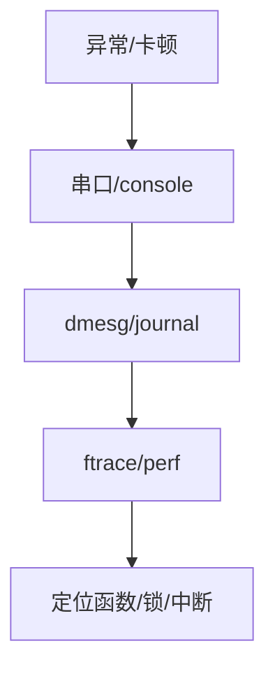

# 嵌入式调试：串口、printk、ftrace 与现场抓取

板子「没日志、偶发死机、用户态卡死」，调试手段要分层：**串口早期打印 → 内核日志 → 追踪 → 核心转储**。

## 源码锚点

| 路径 / 手册 | 作用 |
|-------------|------|
| `kernel/printk.c` | printk |
| `Documentation/admin-guide/dynamic-debug.rst` | 动态调试 |
| `kernel/trace/` | ftrace |
| `Documentation/dev-tools/` | 调试工具集 |

## 调用链



## 重点知识

```bash
dmesg -T | tail -50
echo 'module foo +p' > /sys/kernel/debug/dynamic_debug/control
# ftrace 函数图（示例）
echo function_graph > /sys/kernel/debug/tracing/current_tracer
```

### 串口

确认波特率、流控、早期 console（`earlycon`）。没有串口等于盲飞。

### 死机

看是否进 panic、是否 lockup detector、是否硬件看门狗复位。保留 `pstore`/`ramoops` 可在重启后取最后日志。

### 用户态

`strace -tt -p PID`、`gdb` 附加；注意剥离符号的发行版要保留 debug 包。
