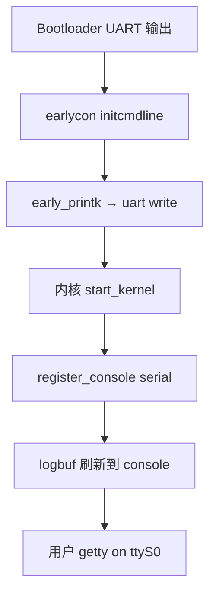
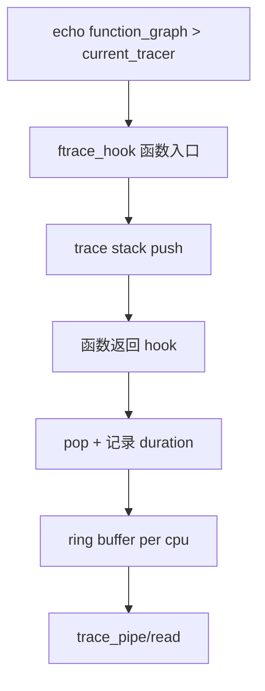
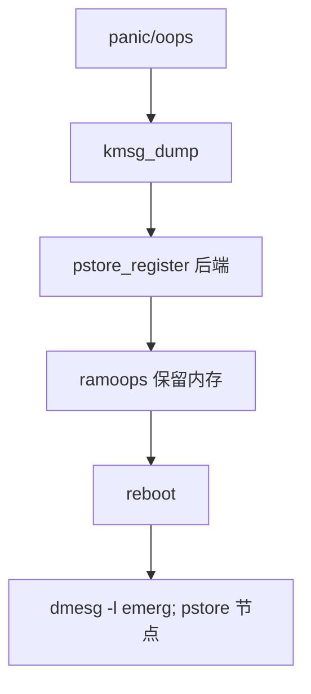

# 嵌入式调试完整篇：earlycon、printk、dynamic debug、ftrace、pstore 与 kgdb

板子「黑屏无 log、偶发 panic 重启、用户态卡死只有 watchdog 复位」——嵌入式调试的核心是 **分层观测**：上电毫秒级 **earlycon** → 运行时 **printk/dynamic_debug** → 性能/路径 **ftrace** → 崩溃 **pstore/ramoops** → 交互 **kgdb**；用户态补 **strace/gdb**。缺一层就会在对应阶段「盲飞」。

本文按 **时间线 + 内核子系统** 组织，源码锚点对齐 `kernel/printk/`、`lib/Kconfig.debug`、`kernel/trace/`、`fs/pstore/`、`kernel/debug/`、`Documentation/admin-guide/` 与 `Documentation/dev-tools/kgdb.rst`，命令可直接在 Yocto/Buildroot 目标板执行（需对应 `CONFIG_*` 打开）。

---

## 源码锚点

| 路径 | 作用 |
|---|---|
| `kernel/printk/printk.c` | printk 环形缓冲、console 注册 |
| `kernel/printk/internal.h` | logbuf、console 链表 |
| `drivers/tty/serial/` + earlycon | `earlycon=uart8250,...` 解析 |
| `include/linux/serial_core.h` | uart console ops |
| `lib/dynamic_debug.c` | dynamic debug 控制文件 |
| `kernel/trace/` | ftrace、function_graph、events |
| `kernel/trace/trace.c` | trace_array、tracer 切换 |
| `fs/pstore/` | pstore 后端 ramoops/eMMC |
| `drivers/soc/qcom/pmic_pon` 等 | 平台 reset reason（辅助） |
| `kernel/debug/kdb/`、`kgdb.c` | kgdb 断点与 gdbstub |
| `Documentation/admin-guide/serial-console.rst` | 串口 console 参数 |
| `Documentation/trace/ftrace.rst` | ftrace 用户指南 |

## 调用链

### 启动早期：earlycon 到 printk console



### printk 一条消息的路径


### ftrace function_graph 一次函数调用



### panic 到 pstore 持久化



---

## 重点知识

## 1. 串口与 earlycon

 **`console=ttyS0,115200n8`**：完整内核后 serial console；与 **earlycon** 互补。

 **`earlycon=uart8250,0x40001000,115200`**：MMU 前后均可输出；地址来自 **datasheet**（勿抄错 SOC 版本）。

 **`earlyprintk`** 旧参数；新内核用 **earlycon=efifb** 等平台专用。

Device Tree **`stdout-path`** / **`chosen/stdout-path`**：bootloader 传递 console 节点。

波特率误差 >2% 会 **乱码**；用示波器量 bit time。

 **流控 RTS/CTS**：长 log 时硬件流控防丢；三线的仅 GND/TX/RX 易 overflow。

 **`quiet`** cmdline 减 log；调试时去掉。

 **`loglevel=8`** 或 **`ignore_loglevel`** 强制全级别输出。

多 console：`console=ttyS0,115200 console=tty0` 同时 serial + VGA。

 **`serial-getty@ttyS0`** systemd 单元；BusyBox **`getty -L ttyS0 115200 vt100**。

```bash
# cmdline 示例（ARM64）
earlycon=uart8250,mmio32,0x09000000,115200n8 console=ttyAMA0,115200n8
# 查看当前 console
cat /sys/devices/virtual/tty/console/active
dmesg | head -5
```

## 2. printk 与 log 级别

```c
#define KERN_EMERG   "<0>"
#define KERN_ALERT   "<1>"
#define KERN_CRIT    "<2>"
#define KERN_ERR     "<3>"
#define KERN_WARNING "<4>"
#define KERN_NOTICE  "<5>"
#define KERN_INFO    "<6>"
#define KERN_DEBUG   "<7>"
```

 **`logbuf`**：环形缓冲，大小 `CONFIG_LOG_BUF_SHIFT`；panic 时 **kmsg_dump** 刷到 pstore。

 **`/dev/kmsg`**：userspace 可读；`dmesg -w` 跟踪。

 **`console_loglevel`**：低于此级别的 printk 才上 console；`/proc/sys/kernel/printk` 四元组。

 **`dev_printk`/`dev_dbg`**：带设备名；`dev_dbg` 需 `DEBUG` 或 dynamic debug。

 **`pr_fmt`**：模块统一前缀；`#define pr_fmt KBUILD_MODNAME ": "`。

 **`ratelimit`**：`printk_ratelimited` 防 IRQ 风暴刷屏。

 **`CONSOLE_EXT`**：多 console 注册顺序； **`netconsole`** 网络调试（需 IP 已配）。

 **`brd` RAM disk** 与 log 无关但常同在 initramfs 调试出现。

性能：高频 `printk` 拖慢 RT；热路径用 **`tracepoint`** 或 ring buffer。

 **`dmesg -T`** 人类时间； **`journalctl -k`** 若 systemd 接管 kmsg。

## 3. dynamic debug

```bash
# 挂载 debugfs
mount -t debugfs none /sys/kernel/debug
# 打开某模块所有 DBG
echo 'module spidev +p' > /sys/kernel/debug/dynamic_debug/control
# 按函数
echo 'func i2c_smbus_xfer +p' > /sys/kernel/debug/dynamic_debug/control
# 查状态
cat /sys/kernel/debug/dynamic_debug/control | grep spidev
```

 **`CONFIG_DYNAMIC_DEBUG`**：`lib/dynamic_debug.c` 维护 **`_ddebug` 表**（编译期收集）。

 **`+p` 启用 / `-p` 关闭**；`**+f` 含函数名**；`**+m` 含模块** 过滤。

 **`file drivers/spi/spidev.c +p`** 精确到源文件行。

与 **`dev_dbg`** 配合：未启用时 **零开销**（branch 不执行 fmt）。

 **`dynamic_debug.verbose=1`** 启动参数：启时打印每条 dd 命令结果。

生产镜像可留 CONFIG 开，默认 `-p`；现场再 `+p` 无需重编译。

 **`jump_label`** 相关：部分 static key 与 trace 联动。

限制：不能替代 **function trace**；适合 **已知模块** 深挖。

Yocto：确保 **debugfs** 挂载脚本在 init。

安全：debugfs 暴露内核细节；产品可 **`chmod`** 或 late mount。

## 4. ftrace 与 trace events

```bash
cd /sys/kernel/debug/tracing
echo 0 > tracing_on
echo function_graph > current_tracer
echo _sched > set_graph_function   # 可选过滤
echo 1 > tracing_on
cat trace | head -50
echo nop > current_tracer
```

 **`current_tracer`**：`function`、`function_graph`、`blk`、`mmio` 等。

 **`set_ftrace_filter`**：只 trace 指定函数；减 overhead。

 **`trace_event`**：`enable_event power:cpu_idle 1` 等；比 printk 轻。

 **`trace_clock`**：`local` vs `global`；多核排序用 **global** 费性能。

 **`tracing_thresh`**：只记录超过 N µs 的 function_graph 段——找 **长延迟**。

 **`perf ftrace`**：`perf record -e 'sched:sched_switch'` 与 ftrace 互补。

 **`trace_marker`**：userspace 写 marker 与 kernel trace 对齐。

Overhead：function_graph 全开可能 **>10%**； Narrow filter + 短窗口。

 **`snapshot`**：触发器保留 panic 前 buffer。

ARM：**`CONFIG_UNWINDER_FRAME_POINTER`** 影响 graph 准确性。

## 5. pstore 与 ramoops

```bash
# cmdline 保留内存示例
# ramoops.mem_address=0x110000 ramoops.record_size=0x10000 ramoops.console_size=0x10000
ls /sys/fs/pstore/
cat /sys/fs/pstore/console-ramoops-0
dmesg | grep -i pstore
```

 **`fs/pstore/platform.c`**：platform data 或 DT **`ramoops`** 节点。

 **`record_size`/`ftrace_size`/`console_size`** 分区；panic 写 **oops + log**。

 **`pstore_blk`**：块设备后端；eMMC 持久化（Wear 注意）。

 **`EFI var`** / **`mmc`** 平台特定 backend。

重启后 **userspace** 读 `/sys/fs/pstore/*` 上传服务器——field debug 标配。

与 **watchdog reboot** 配合：区分 **hard lockup** vs **userspace hang**。

 **`kmsg_dump_reason`**：OOM/panic/emergency 分级保存。

大小不足会 **截断**；优先保留 **栈回溯 + 最后 4KB log**。

Secure boot 环境 pstore 仍可用（RAM 未加密时注意敏感 log）。

QEMU：`-global ramoops.*` 可仿真。

## 6. kgdb 与 kdb

```bash
# kernel cmdline
kgdboc=ttyS0,115200 kgdbwait
# host
gdb vmlinux
(gdb) target remote /dev/ttyUSB0
(gdb) continue
```

 **`CONFIG_KGDB`** + **`CONFIG_KGDB_SERIAL_CONSOLE`**：串口 gdbstub。

 **`kgdbwait`**：启动停在最早期等 gdb connect。

 **`echo g > /proc/sysrq-trigger`** 或 **`break`**：`kgdboc` 触发。

 **`CONFIG_KDB`**：内置 shell 查栈/寄存器；**`kgdb ` 切换**。

模块符号：host **`gdb` 加载 `module.symvers`** 或 copy **`/proc/kallsyms`**。

与 **lockdep** 同开时某些断点 **死锁**；最小 config 调试。

ARM：**硬件断点** 数量有限；软件 breakpoint 改指令。

 **`nmi` watchdog** 与 kgdb 单步：可能冲突，临时 disable WDT。

生产禁止常开；**secure product** 防调试接口暴露。

替代：**JTAG/OpenOCD** 在 CPU 停转时更底层。

## 7. 用户态：strace 与 gdb

```bash
strace -ff -tt -T -p $(pidof myapp) -o /tmp/strace.log
strace -e trace=network,file myapp 2>&1 | head
gdb -p $(pidof myapp)
(gdb) bt full
(gdb) info threads
```

 **`strace -tt`** 微秒时间戳；**`-T` 系统调用耗时**；找 **慢 syscall**。

 **`-f`** 跟踪 clone；**`-e futex`** 与 RT IPC 篇联动。

 **`gdbserver :1234 ./app`** 目标板；host **`gdb-multiarch` cross debug**。

发行版 strip 二进制需 **`debug-packages`**（`-dbg`/`-dbgsym`）。

 **`core dump`**：`ulimit -c unlimited` + **`/proc/sys/kernel/core_pattern`**。

 **`perf record -g ./app`**：用户态 + 内核栈（需 `-g` 与符号）。

 **`lttng`/`systemtap`** 重量级；资源受限板少用。

容器内 **`ptrace`** 默认禁；`--cap-add=SYS_PTRACE`。

静态链接 musl：`gdb` 需对应 debug 符号。

 **`strace -c`** 汇总 syscall 比例——快速定位 IO 瓶颈。

## 8. 分层调试工作流

| 阶段 | 手段 | 典型问题 |
|---|---|---|
| 上电无输出 | earlycon、示波器 TX 脚 | 地址/波特率错 |
| boot 中途停 | printk、initcall_debug | 驱动 probe 失败 |
| 运行偶发卡 | ftrace function_graph、lockdep | 长临界区 |
| panic reboot | pstore、ramoops | OOPS 栈 |
| 逻辑错误 | dynamic debug、dev_dbg | 状态机 |
| 用户态 hang | strace/gdb | 阻塞 futex |
| 性能 | perf、ftrace events | 调度/IO |

## 9. 故障对照

| 现象 | 查什么 | 命令/配置 |
|---|---|---|
| dmesg 空 | console 未注册 | cmdline console= / active |
| 乱码 | 波特率 | stty -F /dev/ttyS0 |
| log 丢行 | logbuf 小 | LOG_BUF_SHIFT |
| ftrace 空 | tracer 未开 | tracing_on |
| pstore 空 | mem 未保留 | ramoops DT |
| kgdb 连不上 | kgdboc | boot param |
| gdb 无符号 | debug pkg | debuginfo-install |

## 12. earlycon 参数与架构对照

| 架构 | earlycon 示例 | 备注 |
|---|---|---|
| ARM64 | earlycon=uart8250,mmio32,0x09000000 | PL011/QEMU virt |
| ARM32 | earlycon=imx-uart,0x02020000 | i.MX6 UART1 |
| x86 | earlycon=uart8250,io,0x3f8 | 传统 COM1 |
| RISC-V | earlycon=sbi | SBI console 无 MMIO |
| DeviceTree | chosen/stdout-path | 与 bootloader 一致 |

## 13. `kernel/printk/printk.c` 核心路径

**printk**

1. `vprintk_emit` — 格式化、选 loglevel

2. `log_output` — 写入 logbuf 环形缓冲

3. `console_trylock` — console 串行化

4. `call_console_drivers` — 遍历 registered consoles

5. `uart write` — port->ops->write

 **`logbuf`** 大小 `1 << CONFIG_LOG_BUF_SHIFT`；panic 时 **更大 dump** 可能仍截断——调大 SHIFT 或 pstore。

 **`console_sem`**：printk 与 console 注册互斥；死锁场景：**在 console 驱动里 printk**。

 **`ignore_loglevel`** boot 参数：现场抓全级别一次。

## 14. console 注册与 `register_console`

```c
/* drivers/tty/serial/serial_core.c 简化 */
register_console(&uart_console);
/* console 链表按 flags CON_BOOT/CON_CONSDEV 排序 */
/* preferred console 由 cmdline console= 指定 */
```

## 15. dynamic debug 语法大全

```bash
echo 'module ext4 +p' > /sys/kernel/debug/dynamic_debug/control
echo 'file fs/read_write.c +p' > .../control
echo 'func vmalloc +p' > .../control
echo 'format "bio %p" +p' > .../control
echo '* -p' > .../control   # 全关
```

 **`_ddebug` 段** 在链接时收集；`CONFIG_DYNAMIC_DEBUG_CORE` 关则 noop。

 **`dyndbg="func foo +p"`** 内核参数启动即开。

与 **`dev_dbg`**：需 `#define DEBUG` 或 dynamic；`dev_info` 总是开。

## 16. ftrace 进阶：filter 与 trigger

```bash
cd /sys/kernel/debug/tracing
echo 'schedule:sched_switch' >> set_event
echo 1 > events/sched/sched_switch/enable
echo 'latency > 10000' > events/sched/sched_switch/filter
echo 'snapshot' > events/sched/sched_switch/trigger
```

 **`function_graph`** + **`max_depth`** 限制栈深；防 ring buffer 秒满。

 **`trace_pipe`** 阻塞读 live；脚本化分析用 **`trace-cmd record`**。

 **`instances`**：多 buffer 并行；一实例 function_graph，另一 events only。

## 17. pstore / ramoops Device Tree

```dts
reserved-memory {
    ramoops@110000 {
        compatible = "ramoops";
        reg = <0x0 0x110000 0x0 0x100000>;
        record-size = <0x20000>;
        console-size = <0x20000>;
        pmsg-size = <0x20000>;
    };
};
```

 **`record-size`**：oops 记录；**`console-size`**：printk 镜像；需 **memreserve** 不与 kernel load 重叠。

重启后 **`/sys/fs/pstore/console-ramoops-0`**；userspace **`pstore.conf`** 可自动 copy。

 **EFI var backend** 在 UEFI 机器；embedded 多用 ramoops。

## 18. kgdb 完整会话

```bash
# target cmdline: kgdboc=ttyS0,115200 kgdbwait
arm-linux-gnueabihf-gdb vmlinux
(gdb) set serial baud 115200
(gdb) target remote /dev/ttyUSB0
(gdb) hbreak start_kernel
(gdb) continue
(gdb) bt
(gdb) p *current
```

 **`kgdboc`** 与 **`console=`** 可同 UART；注意 **仅一条线** 时勿同时 getty 占端口。

 **`echo g > /proc/sysrq-trigger`** 运行时进 kgdb；配合 **`echo 1 > /proc/sys/kernel/sysrq`**。

模块符号：**`modprobe`** 后 `(gdb) add-symbol-file`** 或 **`lx-symbols`** 插件。

## 19. kdb 常用命令

```text
md 0xc0100000   # 内存 display
bt              # 栈
ps              # 进程
id              # 寄存器
cpu 1           # 切换 CPU
go              # 继续
```

## 20. 用户态 strace 场景

 **`strace -ff -o /tmp/all.%p`** 多线程分离 log；合并用 **`cat all.*`**。

 **`strace -e trace=%network`** 只看 socket；定位 **connect hang** 是 DNS 还是 TCP。

 **`strace -T`** 显示 syscall 耗时；**`poll` 99% time** 说明等事件正常，查谁该 wake。

 **`strace -c`** 汇总；**futex 占比高** 回链 RT IPC 篇。

## 21. gdb 交叉调试 gdbserver

```bash
# target
gdbserver :2345 --args ./myapp --config /etc/app.conf
# host
arm-none-linux-gnueabihf-gdb ./myapp
(gdb) target remote 192.168.1.10:2345
(gdb) set sysroot ./sysroot
(gdb) break main
```

## 22. lockdep / KASAN 与调试配置

 **`CONFIG_LOCKDEP`**：死锁检测；**性能差** 仅 debug 内核。

 **`CONFIG_KASAN`**：内存越界；需 **compiler flag** 与 **双倍内存**。

 **`CONFIG_DEBUG_ATOMIC_SLEEP`**：在 spinlock 内 sleep 报 BUG。

## 23. initcall_debug 启动追踪

```bash
initcall_debug loglevel=8
dmesg | grep 'calling.*init' | tail -20
# 找最后一条 calling 无 ret 的 initcall
```

## 24. netconsole 远程

```bash
# cmdline: netconsole=@/,@192.168.1.100/
# 或 modprobe netconsole netconsole=@eth0/,@10.0.0.1:6666/
```

## 25. perf 与 ftrace 选型

| 工具 | 强项 | 嵌入式代价 |
|---|---|---|
| ftrace function_graph | 内核调用树 | buffer CPU 开销 |
| perf record | 采样 + 栈 | 需 PMU 或 software |
| dynamic debug | 模块 printk 级 | 低，按需开 |
| tracepoints | 固定内核事件 | 中，可 filter |
| kprobes | 任意地址 | 高，调试用 |

## 26. 串口硬件排障

 **示波器** 量 TX idle 高、start bit 低；波特率 = bit time 倒数。

 **USB 转串口** PL2303/CH340 驱动；VM 透传延迟大，**原生 UART** 更可靠。

 **RS485** 方向控制 DE/RE GPIO；半双工 printk 与 Modbus 冲突。

## 27. panic / oops 区分

 **oops**：可继续（有时不稳定）；**panic**：kernel halt 或 reboot。

 **`panic_on_oops=1`** 强制 panic 便于 pstore 完整栈。

 **`nmi panic`** 硬 lockup detector 触发；查 **watchdog** 与 **RT 死循环**。

## 28. 现场问答

**Q: dmesg 有 earlycon 后无？**

A: console 切换失败；查 register_console 错误。

**Q: dynamic_debug 无 control？**

A: debugfs 未挂载或 CONFIG 关。

**Q: ftrace 提示 tracer busy？**

A: 另一 tracer 未 nop；或 instance 占用。

**Q: pstore 文件 0 字节？**

A: panic 未写 backend；ramoops 地址错。

**Q: kgdb 乱码？**

A: baud 不一致；8N1 匹配。

**Q: gdb 断点不停？**

A: PIE 与 ASLR；`set disable-randomization on`。

**Q: strace 拖慢复现？**

A: 用 `-p` attach 短窗口或 `-c` 汇总。

**Q: journal 覆盖 dmesg？**

A: `journalctl -k -b` 看本次 boot kernel log。

## 29. `printk` ratelimit 与 dynamic 配合

热路径 **`printk_ratelimited`** 默认 5s 10 条；调 **`printk_ratelimit_state`** 或改 **`dev_dbg`**。

 **`dynamic_dev_dbg`** 编译期更细；`echo 'module foo +p' > control` 现场开 flood。

## 30. 分层工具选择决策

```text
无串口输出 → 示波器 + earlycon 参数扫描
有输出但停在某行 → initcall_debug / printk 加栈
运行慢/卡 → ftrace graph + perf top
崩溃重启 → pstore + panic=panic_on_oops
需改变量 → kgdb / kdb
用户态逻辑 → strace -T + gdbserver
```

## 31. `dmesg` 与 ring buffer 读取

 **`dmesg -w`** follow 模式； **`dmesg -c`** 读清（需 CAP）。

 **`/dev/kmsg`** ratelimit 防 flood；userspace daemon 读转 syslog。

## 32. `loglevel` boot 参数

```bash
loglevel=7 debug ignore_loglevel
# 7=KERN_DEBUG; 生产改 4 或 3
```

## 33. `printk` time stamp

 **`printk.time=1`** 每行前 **[sec.usec]**；与 **ftrace trace_clock** 对齐分析延迟。

## 34. `trace_printk` 与 `BPF printk`

 **`trace_printk`** 写 ftrace buffer；**`bpf_trace_printk`** eBPF 程序调试；勿与 **`printk`** 混谈 overhead。

## 35. `function` tracer 快速用法

```bash
echo function > /sys/kernel/debug/tracing/current_tracer
echo do_sys_open > set_ftrace_filter
echo 1 > tracing_on
cat trace
```

## 36. `blktrace` / `io_uring` 调试

存储 hang 用 **`blktrace`**；嵌入式 eMMC **`mmc`** driver dynamic debug + **ftrace writeback** events。

## 37. `crash` 工具与 vmcore

 **`kexec` + `crash`** 分析 vmcore；嵌入式常只有 **pstore** 无 full dump——缩小 scope。

## 38. OpenOCD / JTAG 边界

内核 **kgdb** 停 OS；**JTAG** 可单步 **bootloader** 与 **power domain 未开** 时的 dead code。

两者互补：bring-up 用 JTAG，OS 运行用 kgdb/serial。

## 39. `core_pattern` 与 systemd-coredump

```bash
cat /proc/sys/kernel/core_pattern
ulimit -c unlimited
coredumpctl list
```

## 40. `ltrace` / `LD_DEBUG`

 **`LD_DEBUG=libs`** 查动态库加载失败； **`ltrace`** 库调用（比 strace 高层）。

## 41. `addr2line` 与 `eu-stack`

panic 栈 **%pS` 符号化：`addr2line -e vmlinux -f <addr>`；需 **CONFIG_KALLSYMS** 与未 strip vmlinux。

## 42. `ftrace` histogram

```bash
echo 'hist:keys=pid:vals=lat:sort=lat' > events/sched/sched_wakeup/trigger
```

## 43. `debug_objects`

 **`CONFIG_DEBUG_OBJECTS`** 检测 timer/workqueue 生命周期 bug；性能开销大，复现 suspend/resume  leak 时用。

## 44. 串口 bootargs 速查表

| 问题 | bootarg 追加 |
|---|---|
| 无 early log | earlycon=...,115200n8 |
| printk 太少 | loglevel=8 ignore_loglevel |
| init 卡死 | initcall_debug |
| 挂起等 gdb | kgdbwait kgdboc=ttyS0,115200 |
| 保留 crash log | ramoops.mem_address=... record_size=... |

## 45. 用户态 gdb 技巧

 **`thread apply all bt`** 全线程栈；**`set scheduler-locking off`** 避免 gdb 停全进程影响 repro。

 **`catch syscall futex`** 断 syscall 进入。

## 46. `sysrq` 键汇总

```text
echo t > /proc/sysrq-trigger  # 所有 CPU 栈
echo w > ...                  # blocked tasks
echo m > ...                  # memory
echo g > ...                  # kgdb
```

## 47. 与 CI 集成的 smoke

CI 跑 **`dmesg -l err,crit,alert emerg`** gate；**`ftrace`** snapshot on test fail artifact 上传。

## 48. 术语

| 术语 | 含义 |
|---|---|
| earlycon | MMU 前后早期 UART |
| pstore | persistent storage for oops |
| dynamic debug | 编译期埋点运行时开关 |
| function_graph | ftrace 带 duration 的调用图 |

## 49. `brd` / `mem` 虚拟块设备

`CONFIG_BLK_DEV_RAM` 内存盘调试 rootfs；与 pstore 无关但常同现 initramfs。

## 50. `nmi` 调试

`nmi_backtrace_all_cpus` sysrq；hard lockup 时 last resort 栈。

## 51. `softlockup` / `hardlockup`

`watchdog_thresh`；RT 误报时调阈值或 kernel.config 区分。

## 52. `WARN_ON` / `BUG_ON` 行为

`panic_on_warn` 使 WARN 变 panic；现场抓 pstore 完整。

## 53. `relay` / `debugfs` 大流量

relay 高速内核→user；perf 替代多，驱动私有 debug 仍见。

## 54. `uaccess` fault 调试

KASAN usercopy；copy_from_user fault 栈。

## 55. `epoll` strace 解读

epoll_wait 长时间返回 0 为正常 blocking；EINTR 查 signal。

## 56. GDB watchpoint

watch *0xaddr 硬件 watchpoint 有限；大数据结构用 conditional break。

## 57. `livepatch` 与调试

kpatch 不打断 long debug session 热修；与 kgdb 同开需谨慎。

## 58. tracing_on 与 buffer_size_kb

echo 0 > tracing_on 暂停；buffer_size_kb 防 overwrite 丢最早事件。

## 59. hist trigger 示例

hist:keys=common_pid 按进程聚合 latency；sched 延迟分布清晰。

## 60. bootchart 启动分析

initcall_debug + bootchart 看 parallel probe；优化 module 加载顺序。

## 61. Yocto debug 包

PACKAGECONFIG 开 debug；IMAGE_GEN_DEBUGFS=1 分离 debugfs 镜像。

## 62. Buildroot BR2_ENABLE_DEBUG

全包 -g；目标板 strip 前保留 _unstripped 或 debug tarball。

## 63. 串口日志时间同步

ptp4l/chrony 与 dmesg -T 对齐跨设备 log。

## 64. 远程 adb vs serial

Android adb logcat 等价分层；纯 Linux 嵌入式 serial + dmesg 仍是根。

## 65. 最小 debug 内核 fragment

```text
CONFIG_PRINTK=y
CONFIG_DYNAMIC_DEBUG=y
CONFIG_FTRACE=y
CONFIG_DEBUG_FS=y
CONFIG_PSTORE=y
CONFIG_PSTORE_RAM=y
CONFIG_SERIAL_EARLYCON=y
```

## 66. `printk` console 级别四元组

`/proc/sys/kernel/printk` 四数：current default minimum boot-default；`dmesg -n 8` 临时改 current。

## 67. `trace_event` 命名规则

子系统 `sched:`、`irq:`、`power:`；`perf list` 与 debugfs events 目录一致。

## 68. `kprobe` 示例

echo 'p:myprobe do_sys_open' > kprobe_events；dynamic 卸载 echo -:myprobe。

## 69. `uprobe` 用户态

perf probe -x ./app 'symbol%return'；无需 recompile 插桩。

## 70. `sanitizer` 组合

KASAN+LOCKDEP 同开极慢；分阶段：先 KASAN 内存，再 LOCKDEP 锁序。

## 71. 串口线序

TX/RX 交叉；GND 共地；RS232 电平 vs TTL 3.3V 需转换器。

## 72. `minicom` / `picocom`

picocom -b 115200 /dev/ttyUSB0；`Ctrl-a Ctrl-x` 退出；勿占 kgdb 口。

## 73. `screen` 会话

screen /dev/ttyUSB0 115200；detach 保 log 连续；CI 用 script 录 session。

## 74. 日志落盘

`dmesg > /mnt/sdcard/dmesg-$(date +%F).txt` field 采集；pstore 与之互补。

## 75. 与 perf 火焰图

perf script | stackcollapse | flamegraph.pl；用户态+内核一张图。

## 76. `echo` 到 tracing 常见错误

Permission denied → debugfs mount；Invalid argument → tracer 名拼写；Device busy → 先 echo nop。

## 77. `modprobe` 与 unknown symbol

insmod 后 dmesg **disagrees about version of symbol** → 用内核树内 build 的 ko。

## 78. `devcoredump`

设备驱动 coredump 框架；net/dev 驱动私有 debug 导出 sysfs blob。

## 79. `fault-inject`

CONFIG_FAULT_INJECTION；人为 ENOMEM/EIO 测驱动 error path。

## 80. `printk` 格式 `%pK`

内核指针默认 hidden；debug 时 `%px` 或 sysctl kptr_restrict=0（安全风险）。

## 81. 双串口策略

ttyS0 console + ttyS1 kgdb 分离；避免 single port contention。

## 82. `tmux` 多窗

一窗 dmesg -w，一窗 ftrace pipe，一窗 ssh 目标；现场效率。

## 83. BCC/eBPF 一行

bpftrace -e 'tracepoint:syscalls:sys_enter_openat { printf("%s\n", comm); }' 快速验证。

## 84. 文档链接

Kernel `Documentation/admin-guide/serial-console.rst`、`Documentation/trace/ftrace.rst`、`Documentation/dev-tools/kgdb.rst` 为权威延伸。

## 85. 回归后对比

保存 `/sys/kernel/debug/tracing/saved_cmdlines` 与 saved_tgids；两次 boot 事件 diff。

## 86. 命令速查（调试）

```bash
dmesg -T -w
dmesg -l err,warn
cat /proc/sys/kernel/printk
mount -t debugfs none /sys/kernel/debug
echo 1 > /sys/module/printk/parameters/ignore_loglevel
echo 'module ext4 +p' > /sys/kernel/debug/dynamic_debug/control
echo function_graph > /sys/kernel/debug/tracing/current_tracer
echo 0 > /sys/kernel/debug/tracing/tracing_on
trace-cmd record -p function_graph -e sched:sched_switch sleep 1
ls /sys/fs/pstore/
echo t > /proc/sysrq-trigger
strace -ff -tt -o /tmp/st.log -p PID
gdb -batch -ex bt -p PID
cat /sys/devices/virtual/tty/console/active
grep earlycon /proc/cmdline
perf record -ag -- sleep 5 && perf report
```

Bring-up 最小集：earlycon + pstore + debugfs 挂载脚本；三者齐才能覆盖 **生-死-停** 全周期。

发布镜像可关 kgdb/KASAN，但保留 **dynamic_debug** 与 **pstore** 字段可显著缩短 MTTR。

## 87. panic oops 栈阅读要点

找 **第一行 RIP/ePC** 与 **Call trace**；`?` 符号表示无 kallsyms，需 vmlinux 或 CONFIG_KALLSYMS_ALL。

**BUG: unable to handle** 多为 NULL deref；**watchdog: BUG: soft lockup** 为 CPU 长时间关抢占。

pstore 文件常截断；优先保存 **RIP 附近 + 完整 Call trace + 最后 100 行 dmesg**。

```text
Unable to handle kernel NULL pointer dereference at virtual address 0000000000000048
Call trace:
 do_something+0x24/0x100
 core_fn+0x10/0x80
```

用户态 **segfault** 与内核 oops 分开存：core 文件走 core_pattern；内核走 pstore/dmesg。

## 86. 与驱动调试、PM 的交叉

驱动 **`probe` 失败**：`initcall_debug` 看顺序；**dynamic debug** 开 `bus_type` 匹配。

 **suspend resume  bug**：`echo 1 > /sys/power/pm_debug_messages`（若配置）+ **`ftrace event power`**。

 **IRQ storm**：`/proc/interrupts` + **`sash`** 或 **`cat /proc/softirqs`**。

 **网络 remote debug**：`netconsole=@ip/,@target/` 参数；防火墙注意 UDP。

 **crashkernel** reserved：kdump 与分析；资源足够服务器产品用。

用户态问题优先 **strace -T** 定位慢 syscall，再 **gdbserver** 看栈；内核问题 **dynamic_debug** 收窄模块后 **function_graph** 抓长延迟。

发布版保留 pstore 分区与 debugfs 挂载脚本，比保留 kgdb 更常用来缩短现场 MTTR。

与《低功耗设计完整篇》交叉：suspend/resume bug 用 **`ftrace event power`** 与 **`dmesg -w`** 同步抓。

串口被占用时 **`lsof /dev/ttyUSB0`** 查 getty/gdb/modem 争用；earlycon 阶段不受 getty 影响。

 **`dmesg --clear`** 后复现一次 bug，缩小 **first error** 搜索范围（需 CAP_SYSLOG）。

---

## 小结

嵌入式调试按 **可见性时间线** 备货：earlycon 解决「活没活」、printk/dynamic_debug 解决「走到哪」、ftrace 解决「慢在哪」、pstore 解决「死后说什么」、kgdb/strace/gdb 解决「停下来改」。

读码从 `kernel/printk/printk.c` 的 console 注册、`lib/dynamic_debug.c` 的控制解析、`kernel/trace/trace.c` 的 tracer 切换入手；目标板务必留 **串口 + debugfs + pstore 分区** 三件套。

用户态链路：`strace -T` 定位阻塞 syscall → `gdbserver` 看栈与变量；内核链路：`dynamic_debug +p` → `function_graph` → 必要时 kgdb。

Bring-up 第一天就应验证：`earlycon` 有输出、`debugfs` 可挂载、`pstore` 重启可读；缺一项后续排障成本倍增。

