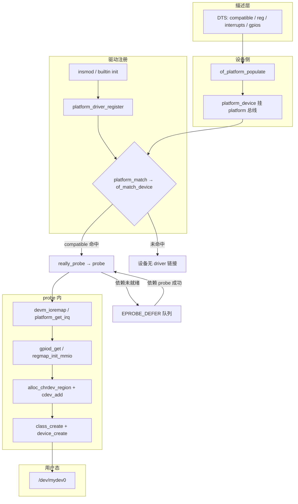
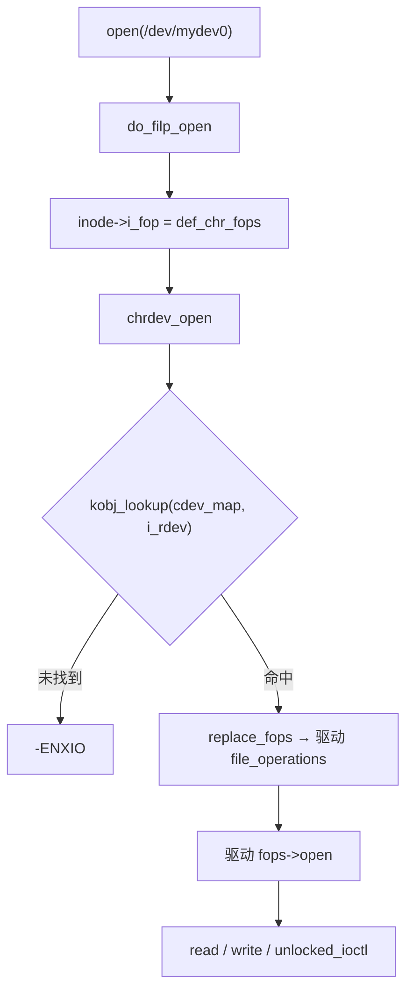

# 嵌入式设备驱动开发完整篇：从 platform/字符设备到 probe、DT 与排障

板级 bring-up 里最常见的驱动形态是：**设备树描述片上外设 → `platform_driver` 在 `probe` 里拿资源 → 用 `cdev`/`file_operations` 导出 `/dev` 节点**。这类驱动同时踩 platform 总线与字符设备两条内核路径，任何一环未对齐都会在用户态放大成「设备不可用」。现场症状高度重复：DTS 里节点有了、`/sys/bus/platform/devices/` 也能看见，却没有 `/dev/mydev`；或节点在、`open` 报 `ENXIO`；或 `insmod` 成功却从不打印 probe 日志——根因多半不在「寄存器读写写错」，而在 **compatible 匹配、deferred probe、号段/cdev 注册** 链路上某一环断裂。

本文合并嵌入式系统 chapter 031–036（源文为模板提纲），按 Linux 主线内核真实路径，把 **platform 绑定、字符设备导出、GPIO/regmap 常见模式、模块加载与 dmesg 排障** 合成一篇面向 SoC/板级工程师的可执行闭环。与单独的「平台驱动篇」「字符设备篇」相比，本文强调 **从 DT 到用户态 `/dev` 的端到端主线**，避免概念堆砌。

读完本文，你应能独立完成：编写最小 `platform_driver` + 字符设备合一模块；用 sysfs 判断设备是否绑定；区分 compatible 不匹配与 `-EPROBE_DEFER`；用 `insmod`/`dmesg`/`strace` 跑通 bring-up 冒烟测试。下文所有路径与符号均可在主线内核树中对照验证。

---

## 源码锚点

| 路径 | 作用 |
|------|------|
| `drivers/base/platform.c` | `platform_bus_type`、`platform_match`、`__platform_driver_register`、资源辅助 |
| `include/linux/platform_device.h` | `struct platform_device` / `struct platform_driver`、`platform_get_irq`、`module_platform_driver` |
| `drivers/of/device.c` | **`of_match_device`**、`of_driver_match_device` — DT `compatible` 匹配入口 |
| `drivers/base/dd.c` | `really_probe`、`-EPROBE_DEFER` 延迟队列 |
| `fs/char_dev.c` | `alloc_chrdev_region`、`cdev_add`、**`chrdev_open`**、`cdev_map` |
| `include/linux/cdev.h` | `struct cdev`、`cdev_init` / `cdev_add` / `cdev_del` |
| `include/linux/fs.h` | **`struct file_operations`**、`def_chr_fops` |
| `include/linux/gpio/consumer.h` | `gpiod_get` / `gpiod_set_value` — probe 内 GPIO 消费者 API |
| `include/linux/regmap.h` | **`devm_regmap_init_mmio`** — MMIO 寄存器访问抽象 |
| `include/linux/mod_devicetable.h` | `struct of_device_id`、**`MODULE_DEVICE_TABLE(of, …)`** |
| `drivers/base/core.c` | `device_add`、sysfs/uevent；`device_create` 落点 |
| `include/linux/device/class.h` | `class_create`、`/sys/class` 类设备 |

嵌入式板级驱动最小骨架（platform + 字符设备合一）：

```c
static const struct of_device_id my_of_match[] = {
	{ .compatible = "vendor,my-board-dev" },
	{ /* sentinel */ }
};
MODULE_DEVICE_TABLE(of, my_of_match);

static int my_probe(struct platform_device *pdev)
{
	struct device *dev = &pdev->dev;
	void __iomem *base;
	struct regmap *map;
	struct gpio_desc *rst;
	dev_t devt;
	int ret;

	base = devm_platform_ioremap_resource(pdev, 0);
	if (IS_ERR(base))
		return PTR_ERR(base);

	map = devm_regmap_init_mmio(dev, base, &my_regmap_config);
	rst = gpiod_get_optional(dev, "reset", GPIOD_OUT_LOW);
	if (IS_ERR(rst))
		return PTR_ERR(rst);   /* 含 -EPROBE_DEFER */

	ret = alloc_chrdev_region(&devt, 0, 1, "mydev");
	if (ret)
		return ret;
	cdev_init(&priv->cdev, &my_fops);
	priv->cdev.owner = THIS_MODULE;
	ret = cdev_add(&priv->cdev, devt, 1);
	/* … class_create / device_create … */
	platform_set_drvdata(pdev, priv);
	return 0;
}

static struct platform_driver my_drv = {
	.probe  = my_probe,
	.remove = my_remove,
	.driver = {
		.name = "mydev",
		.of_match_table = my_of_match,
	},
};
module_platform_driver(my_drv);
```

---

## 调用链

### 板级主线：DT → platform 匹配 → probe → `/dev`



### 用户态 open：VFS → chrdev_open → 驱动 fops



两条链合在一起：**第一条解决「驱动有没有绑上硬件、有没有导出节点」**；**第二条解决「节点有了能不能进驱动逻辑」**。排障时先判定卡在哪条链，再下钻具体 API。若第一条未通，在 `file_operations` 里加日志毫无意义；若第一条已通而 open 失败，则重点查 `fs/char_dev.c` 的 `cdev_map` 与主次设备号，而非 DT 节点本身。

---

## 重点知识

### 1. 嵌入式驱动的两层接口

板级外设驱动通常同时扮演两个角色：

- **总线侧（platform）**：通过 `compatible` 与 DT 节点绑定，在 `probe` 里完成 MMIO、IRQ、时钟、GPIO、regmap 初始化；
- **用户侧（字符设备）**：通过 `cdev` + `file_operations` 把能力暴露成 `/dev` 文件，用户态用 `open/read/write/ioctl` 访问。

`platform_driver` 解决「内核认不认这块硬件」；`cdev` 解决「用户态怎么打开它」。只 probe 成功却不 `cdev_add`，sysfs 上可能有 platform 设备，却没有可 open 的节点；只 `mknod` 却不 `cdev_add`，open 会 `-ENXIO`。两层都通才是完整驱动。

和 PCI/USB 不同，platform 总线**不做硬件枚举**——SoC 上的 UART、自定义 IP、板载传感器，地址与中断完全由 DT（或遗留板文件）描述。内核在启动早期通过 `of_platform_populate` 把节点实例化成 `struct platform_device`，挂上 `platform` 总线；驱动模块后加载时，`platform_driver_register` 会遍历未绑定设备尝试 match。因此「设备先存在、驱动后到达」是常态，机制上能收敛；真正卡死的是 compatible 不一致或 defer 被吞掉。

分层记忆（与设备模型一致）：**bus 绑定**只说明驱动认领了硬件；**cdev_add** 让该 `dev_t` 可被 `chrdev_open` 解析；**device_create** 经 uevent 让 devtmpfs/udev 建 `/dev` 节点。缺任何一层，用户态表现都不同——bring-up 时要能区分「没绑上」与「绑上了但没导出节点」。

### 2. DT `compatible` 与 `of_match_device`

ARM/嵌入式几乎全走设备树。匹配发生在 `platform_match`（`drivers/base/platform.c`），OF 路径调用 `of_driver_match_device` → **`of_match_device(of_match_table, dev)`**（`drivers/of/device.c`）。要求 **字符串逐字符一致**（含厂商前缀、连字符）。

| 现象 | 常见根因 |
|------|----------|
| `/sys/bus/platform/devices/` 有设备，无 `driver` 链接 | DTS `compatible` 与 `of_match_table` 拼写不一致 |
| 模块已加载仍不绑 | `of_match_table` 挂在错误字段（应在 `driver.of_match_table`） |
| 自动 modprobe 不触发 | 漏 `MODULE_DEVICE_TABLE(of, …)` |

板级核对命令：

```bash
# 设备侧 compatible（路径按板子改）
cat /sys/firmware/devicetree/base/soc/mydev@40010000/compatible | tr '\0' '\n'
readlink /sys/bus/platform/devices/40010000.mydev/driver

# 驱动侧 alias
modinfo mydev.ko | grep -i alias    # 期望 of:N*T*Cvendor,my-board-dev

# 手动绑定（调试）
echo 40010000.mydev > /sys/bus/platform/drivers/mydev/bind
```

**不会进入 `probe` 的匹配失败，往往没有你的 `dev_err` 日志**——这是「驱动明明编进去了却像没跑」的首要原因。

`platform_match` 判定顺序大致为：`driver_override` → OF/ACPI（`of_match_device`）→ `id_table` → `name` 字符串。新板级代码应只依赖 `of_match_table`，避免靠 `name` 碰巧一致。多字符串 `compatible` 时，OF 按列表从前到后匹配驱动表——板级用了更具体的串，驱动表却只写了兜底兼容串，也会 match 失败。典型写错：`vendor,my_uart` 与 `vendor,my-uart`（下划线/连字符）、漏厂商前缀、DTS 升级成 `-v2` 而驱动表未同步。

### 3. probe / remove 与 devm 资源纪律

`probe` 标准顺序：映射寄存器 → 取 IRQ/时钟/GPIO → 初始化硬件/regmap → 注册 cdev → `platform_set_drvdata`。失败返回负 errno；依赖（时钟控制器、GPIO 芯片、pinctrl）未就绪时 **原样返回 `-EPROBE_DEFER`**，由 `drivers/base/dd.c` 排队重试，不要用 `msleep` 死等。

`remove` 做 quiesce（停 IRQ、关 DMA）；内存/IRQ/GPIO 若用了 `devm_*`，remove 里不必手动 iounmap/free_irq。字符设备部分：`device_destroy` → `cdev_del` → `unregister_chrdev_region`，顺序与 probe 对称。

probe 内 GPIO 与 regmap 是板级最高频模式：

```c
/* GPIO：reset/enable 脚 — 失败可能是 -EPROBE_DEFER */
rst = gpiod_get_optional(dev, "reset", GPIOD_OUT_LOW);
gpiod_set_value(rst, 1);
udelay(10);

/* regmap：统一读写、支持 cache/调试 */
map = devm_regmap_init_mmio(dev, base, &my_regmap_config);
regmap_write(map, MY_REG_CTRL, MY_CTRL_ENABLE);
regmap_read(map, MY_REG_STATUS, &val);
```

regmap 适合多寄存器、需 bulk 读写的传感器/ PMIC 类外设；纯单寄存器 bitbang 可直接 `readl`/`writel`，但 probe 里仍应优先 `devm_platform_ioremap_resource` 拿基址。

**资源获取标准入口**（与 `include/linux/platform_device.h` 一致）：

```c
res = platform_get_resource(pdev, IORESOURCE_MEM, 0);
irq = platform_get_irq(pdev, 0);          /* 失败含 -EPROBE_DEFER */
/* 多段 reg / 具名中断 */
base1 = devm_platform_ioremap_resource(pdev, 1);
irq_tx = platform_get_irq_byname(pdev, "tx");
ret = devm_request_irq(dev, irq, my_isr, 0, dev_name(dev), priv);
```

多段 `reg` 时索引从 0 递增，必须与 binding 文档一致；搞反控制寄存器与 FIFO 寄存器，会出现「probe 返回 0 但读写全乱码」。`devm_request_irq` 与 `devm_free_irq` 配对由 devres 管理，remove 里只需 quiesce 硬件。

**probe 失败回滚**：若 `cdev_add` 已成功但后续 `device_create` 失败，必须从该点反向 `cdev_del` + `unregister_chrdev_region`，避免号段占用却无完整节点。推荐把字符设备注册放在 probe 靠后步骤，或拆成 `devm_add_action` 辅助函数统一清理。

**remove 对称顺序**：停 IRQ/工作队列 → `device_destroy` → `class_destroy`（若全局 class 仅一次则放 module exit）→ `cdev_del` → `unregister_chrdev_region`。不要在 remove 里假设用户态已全部 close——可配合引用计数或 `try_module_get` 拒绝新 open。

### 4. `file_operations`：probe 里注册，open 里区分实例

字符设备 ABI 核心在 `struct file_operations`（`include/linux/fs.h`）。VFS 打开字符节点时先走 `def_chr_fops.open` = **`chrdev_open`**（`fs/char_dev.c`），查 `cdev_map` 后 `replace_fops` 换成驱动表。

实现要点：

- `open`：用 `iminor(inode)` 或 `container_of(inode->i_cdev, …)` 取私有数据，写入 `filp->private_data`；
- `read`/`write`：用户指针必须 `copy_to_user`/`copy_from_user`；
- `unlocked_ioctl`：用 `_IO`/`_IOR`/`_IOW` 编码命令；32/64 位混用需 `compat_ioctl`；
- `release`：与 `open` 对称，注意多进程并发时的引用计数。

probe 推荐注册顺序：`alloc_chrdev_region` → `cdev_init`/`cdev_add`（设 `owner = THIS_MODULE`）→ `class_create` → `device_create(parent, devt, …)`。`device_create` 的 parent 常设为 `&pdev->dev`，便于在 sysfs 看到 platform 设备与字符设备的父子关系。

多实例板级设备（同 IP 多份 DT 节点）有两种常见做法：**一段 major + 一个 cdev + open 里用 minor 索引数组**；或 **每个 probe 各自 alloc/cdev_add**（生命周期跟 `platform_device` 走）。不要多个 `/dev` 节点共享无锁全局状态——并发 open 会互相踩 `private_data`。

阻塞读与中断配合是板级驱动第二高频模式：环形缓冲 + `wait_queue_head_t`，硬中断里只做读 FIFO/置位，`wake_up_interruptible` 唤醒阻塞读；`poll` 里必须 `poll_wait` 并在有数据时返回 `EPOLLIN`。漏 `wake_up` 时用户态永久阻塞，常被误判为「硬件没中断」。

```c
static ssize_t my_read(struct file *filp, char __user *buf,
		       size_t len, loff_t *ppos)
{
	struct my_dev *d = filp->private_data;
	if (filp->f_flags & O_NONBLOCK) {
		if (!data_ready(d))
			return -EAGAIN;
	} else if (wait_event_interruptible(d->wq, data_ready(d)))
		return -ERESTARTSYS;
	return copy_to_user_ret(d, buf, len);
}
```

`cdev.owner` 与 `fops.owner` 都应设为 `THIS_MODULE`，否则文件仍打开时可被 `rmmod`，随后调用已释放的 fops 导致内核崩溃。

### 5. 模块加载：`insmod`、alias 与 deferred probe

```bash
# 加载与状态
insmod mydev.ko          # 或 modprobe mydev
lsmod | grep mydev
dmesg | tail -20

# 卸载前确认无打开者
lsof /dev/mydev0 2>/dev/null
rmmod mydev
```

模块自动加载依赖 `MODULE_DEVICE_TABLE(of, …)` 生成的 udev/modprobe alias。内置驱动（`=y`）走 initcall，不保证消费者晚于提供者——**因此依赖未就绪必须返回 `-EPROBE_DEFER`**，不能靠「先 insmod A 再 insmod B」碰运气。

延迟 probe 观察：

```bash
dmesg | grep -i defer
cat /sys/kernel/debug/devices_deferred 2>/dev/null
```

列表长期不空：查依赖环，或提供者自身 `compatible` 也错了。

**内置 vs 模块选型**：时钟/GPIO/pinctrl 等提供者尽量 `=y` 或保证早期 initcall；消费者可 `=m` 便于迭代。若两者都是模块，可在 `modules.softdep` 表达弱顺序，但仍必须以 DEFER 为准，不能替代正确依赖返回。调试绑定可用 sysfs：

```bash
echo 40010000.mydev > /sys/bus/platform/drivers/mydev/unbind
echo 40010000.mydev > /sys/bus/platform/drivers/mydev/bind
```

生产环境优先修 DT 与依赖，而不是脚本轮询 bind。

### 6. dmesg / sysfs / `/dev` 四层排障

嵌入式现场建议固定四层，从上到下缩小范围：

| 层级 | 核对 | 通过标准 |
|------|------|----------|
| DT/设备 | `ls /sys/bus/platform/devices/` | 节点存在且 `status = okay` |
| 绑定 | `readlink …/driver` | 指向你的驱动目录 |
| 字符设备 | `cat /proc/devices`、`ls -l /dev/mydev*` | 号段登记且主次一致 |
| 功能 | `strace open/read`、`dmesg` | open 进驱动 fops，读写返回符合预期 |

典型故障对照：

| 现象 | 优先查 |
|------|--------|
| 无 platform 设备 | DTB/overlay、`status`、地址冲突 |
| 有设备无 driver | `compatible` vs `of_match_table`、`modinfo` alias |
| 有 driver 无 `/dev` | probe 里是否 `device_create`、class 是否失败 |
| open = `-ENXIO` | 是否 `cdev_add`、主次号是否一致、模块是否已卸 |
| probe 反复 defer | 时钟/GPIO 控制器是否 probe 成功 |
| regmap/GPIO 读全 0 | 时钟未 enable、pinctrl 默认态、reset 脚时序 |

`dmesg` 过滤技巧：

```bash
dmesg -w | grep -iE 'mydev|probe|defer|regmap|gpio'
# 动态调试（需 CONFIG_DYNAMIC_DEBUG）
echo 'file drivers/base/platform.c +p' > /sys/kernel/debug/dynamic_debug/control
echo 'file fs/char_dev.c +p' > /sys/kernel/debug/dynamic_debug/control
```

改驱动逻辑前，先用 sysfs 证明是 **match 问题** 还是 **probe 问题** 还是 **cdev 问题**——在错误层打补丁是板级排障最大时间黑洞。

**板级案例：probe 成功但 open 失败**。现象：`dmesg` 有 probe 日志，`/sys/bus/platform/devices/.../driver` 有链接，但 `cat /dev/mydev0` 报 `No such device`。排查：① `ls -l /dev/mydev0` 是否存在——无则查 `device_create` 是否执行、udev 是否丢弃 uevent；② 有节点则 `cat /proc/devices | grep mydev` 对比主次号；③ `lsmod` 确认模块仍在；④ `strace open` 看是 `-ENXIO`（cdev_map 未命中）还是驱动 `open` 返回 `-ENODEV`。多数情况是 probe 里漏 `cdev_add` 或 `device_create` 失败未处理。

**板级案例：insmod 成功从不 probe**。现象：`lsmod` 可见模块，`/sys/bus/platform/drivers/mydev` 目录存在，设备无 driver 链接。排查：① 两侧 `compatible` 字符串；② `modinfo` 的 `alias`；③ DT 节点 `status`；④ 手动 `bind` 试一次。几乎总是 compatible 拼写问题，而非 probe 函数逻辑错误。

用户态辅助命令：

```bash
cat /proc/devices | grep mydev
ls -l /dev/mydev0
stat /dev/mydev0
udevadm info -a -n /dev/mydev0
ls -l /sys/class/myclass/
readlink -f /sys/class/myclass/mydev0/device
```

### 7. 设备树最小示例与验证闭环

```dts
mydev: my-device@40010000 {
	compatible = "vendor,my-board-dev";
	reg = <0x40010000 0x1000>;
	interrupts = <GIC_SPI 45 IRQ_TYPE_LEVEL_HIGH>;
	clocks = <&clk_periph>;
	clock-names = "apb";
	reset-gpios = <&gpio0 12 GPIO_ACTIVE_LOW>;
	status = "okay";
};
```

Bring-up 固定跑一遍：

```bash
# 1) 绑定
readlink /sys/bus/platform/devices/40010000.mydev/driver

# 2) 节点
ls -l /dev/mydev0
cat /proc/devices | grep mydev

# 3) open 冒烟
strace -e openat,read,ioctl,close cat /dev/mydev0

# 4) 卸载
lsof /dev/mydev0; rmmod mydev
```

Kconfig 中对应项设为 `y` 或 `m`，并确认 **DTB 与内核同刷**；`status = "disabled"` 时改驱动代码无效，因为 platform 设备根本不会创建。

### 8. regmap 与 GPIO 的选型边界

不是所有板级驱动都需要 regmap，但下列场景值得引入：

| 场景 | 推荐 | 原因 |
|------|------|------|
| 十数个以上寄存器、需 field 读写 | `devm_regmap_init_mmio` | 统一掩码、volatile/cache、debugfs |
| 同一 IP 有 I2C/SPI/MMIO 多种总线 | regmap 总线抽象 | 上层逻辑与物理总线解耦 |
| 仅 2～3 个控制寄存器 | 直接 `readl`/`writel` | 少一层抽象，probe 更直观 |
| reset/enable 脚 | `gpiod_get` 消费者 API | 自动处理 polarity、defer、pinctrl |

GPIO 命名必须与 DT 属性一致：`reset-gpios` 对应 `"reset"`，`enable-gpios` 对应 `"enable"`。`GPIOD_OUT_LOW`/`GPIOD_OUT_HIGH` 表示**逻辑有效电平**，不是「上电瞬间的电平」——搞反会导致芯片一直处于复位态，表现为 regmap 读全 0。release 前若需 power-down 序列，在 `remove` 里显式拉 reset，再交给 devres 释放 GPIO。

交叉编译注意：用户态 ioctl 结构体必须与内核模块 ABI 一致（固定宽度 `u32`/`u64`），否则板端表现为「本机仿真正常、上板 ioctl 全 EFAULT」——这是配置漂移，不是硬件问题。

---


---

## 小结

嵌入式设备驱动开发的主线是：**DT 创建设备 → `compatible` 匹配 → `probe` 拿资源（GPIO/regmap/IRQ）→ 注册 cdev 导出 `/dev` → 用户态经 `chrdev_open` 进入 `file_operations`**。板级排障不要从寄存器值猜起，而应按 sysfs 四层（设备、绑定、号段、功能）收束；`compatible` 写错与 `-EPROBE_DEFER` 被误当成硬失败，是 bring-up 阶段最高频的两类「假驱动没加载」。

对照 `drivers/base/platform.c`、`drivers/of/device.c` 与 `fs/char_dev.c`，比堆概念更能一次定位真因。把本文 Checklist 贴进板级驱动 Code Review，可显著减少「以为驱动没跑、其实根本没 match」与「probe 成功却无 `/dev`」两类低级事故。下一层可继续深入子系统封装（IIO、input、misc），但底层仍绕不开本文这条 platform + cdev 主线。
