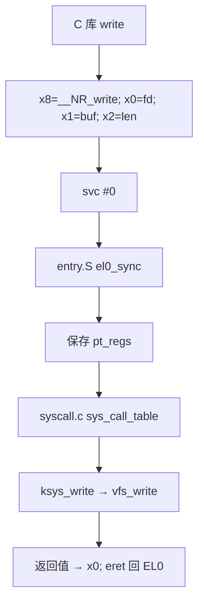
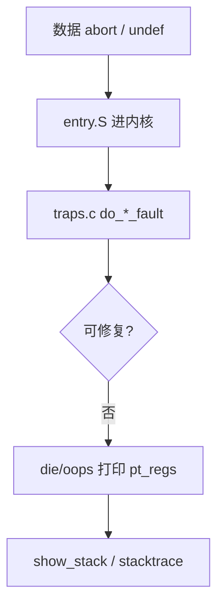

# 看不懂 Oops 里的 pc/lr？AArch64 寄存器、异常级与 Linux 调用约定讲透

内核 Oops 里一行 `pc : ffffffc008123456 lr : ffffffc008123400`，GDB 单步却对不上 C 源码；用户态 `strace` 看到 `svc #0` 不知参数在哪；写驱动内联汇编被 `'x0' constraint` 搞晕——根因常是 **AArch64 寄存器布局、异常级 EL、AAPCS64 调用约定与 syscall 路径** 没建立地图。本文从 **X0–X30/SP/PC、LR、NZCV → EL0–EL3 → AAPCS64 → SVC 系统调用 → 内联 asm 约束 → arch/arm64/kernel/entry.S 异常入口 → Oops/stacktrace/ptrace/GDB 排障** 一条线讲透；路径对齐 Linux `arch/arm64/` 上游布局（以本机内核版本为准）。

## 阅读地图

1. **第一层：通用寄存器与 PSTATE**——解决「Oops 里 pc/lr/x0 各是什么、NZCV 干嘛用」。
2. **第二层：异常级 EL0–EL3**——解决「用户态/内核/Secure/EL3 固件各跑在哪」。
3. **第三层：AAPCS64 调用约定**——解决「参数、返回值、被调者保存寄存器、栈对齐」。
4. **第四层：系统调用 SVC**——解决「从 libc 到 `entry.S` 的 syscall 路径」。
5. **第五层：内联汇编与内核 entry**——解决「`asm volatile` 约束、内核同步/异常向量入口」。
6. **第六层：Oops 与 GDB/ptrace 排障**——解决「把崩溃现场还原成可读调用栈」。

## 源码锚点

| 路径 | 作用 |
|------|------|
| `arch/arm64/kernel/entry.S` | 异常向量、kernel_entry、el0_sync |
| `arch/arm64/kernel/entry-common.c` | 异常 C 处理、die/Oops |
| `arch/arm64/kernel/process.c` | 进程上下文、CPU 切换 |
| `arch/arm64/kernel/signal.c` | 信号帧、用户上下文 |
| `arch/arm64/kernel/traps.c` | 陷阱、undef、fault |
| `arch/arm64/kernel/syscall.c` | 系统调用分派 |
| `arch/arm64/include/asm/ptrace.h` | `struct pt_regs` |
| `arch/arm64/include/asm/unistd.h` | syscall 号 |
| `arch/arm64/include/uapi/asm/ptrace.h` | 用户态 ptrace 寄存器布局 |
| `arch/arm64/include/asm/esr.h` | ESR 异常综合征解码 |
| `arch/arm64/lib/` | 汇编优化例程 |
| `Documentation/arch/arm64/` | ABI、booting、exception |
| ARM ABI AAPCS64 | 官方调用约定文档 |
| `man 2 syscall` `man 2 ptrace` | 用户态接口 |

`struct pt_regs` 是 Oops/GDB 的公共骨架（字段随内核演进，以本机头文件为准）：

```c
/* arch/arm64/include/asm/ptrace.h — 概念摘要 */
struct pt_regs {
    u64 regs[31];   /* x0-x30 */
    u64 sp;
    u64 pc;
    u64 pstate;
    /* 可能含 orig_x0、syscallno 等 */
};
```

---

## 调用链

### 用户态 syscall 到内核



### 异常到 Oops



---

## 一、AArch64 通用寄存器

### 1.1 X0–X30 与 W0–W30

- **64 位名** `Xn`；**低 32 位** `Wn`（写 W 会 **零扩展** 到 X 高 32 位）。
- **X0–X7**：参数与返回值（AAPCS64 第一档）。
- **X8**：间接结果位置（大结构体返回）或 syscall 号（Linux syscall 约定 **x8**）。
- **X9–X15**：临时寄存器（caller-saved）。
- **X16–X17**：IP0/IP1，plt 跳转、内核临时用。
- **X18**：平台保留（Android 曾作 shadow register；Linux 内核常保留）。
- **X19–X28**：callee-saved，函数内若用要保存。
- **X29**：帧指针 **FP**（可选，`-fno-omit-frame-pointer` 便于栈回溯）。
- **X30**：**链接寄存器 LR**，保存 **返回地址**（BL 指令目标的下一条）。
- **SP**：栈指针，**必须 16 字节对齐**（AAPCS64）。
- **PC**：程序计数，**不可直接作为通用寄存器写入**（通过 BR/RET 间接改流程）。

### 1.2 Oops 行怎么读

```
pc : ffffffc008412abc  lr : ffffffc008412a80
x0 : 0000000000000000  x1 : ffffff8001234000
```

| 寄存器 | 含义 |
|--------|------|
| **pc** | _fault 或 trap 指令附近 PC（精确性因异常类型而异） |
| **lr** (x30) | **调用当前函数的下一条**；内核 Oops 常是 **谁调用了崩溃点** |
| **x0–x7** | 按 AAPCS64 可能是参数；syscall 时 x0 常为 fd/返回值 |

用 **addr2line** 或 **gdb** 解析 pc/lr：

```bash
addr2line -e vmlinux -f 0xffffffc008412abc
echo 'bt' | gdb -batch -ex 'set architecture aarch64' -ex 'bt' -ex quit vmlinux
```

### 1.3 零寄存器 XZR / WZR

**XZR** 读为 0、写丢弃，常用于 **比较后丢弃结果** 的指令编码。

### 1.4 SP 与栈

```bash
# 用户态看栈（需对应权限）
cat /proc/self/maps
# GDB
(gdb) info registers sp x29 x30 pc
(gdb) x/16gx $sp
```

内核每个进程有 **用户栈** 与 **内核栈**；Oops 打印的 `sp` 通常是 **当时异常上下文** 的 SP（内核态 fault 时为 kernel sp）。

---

## 二、PSTATE 与 NZCV

### 2.1 PSTATE / SPSR

运行时在 **PSTATE**（EL0 为 **PSTATE.nZCV** 等组件）；进异常时硬件保存 **SPSR_ELx**（含先前 PSTATE）、**ELR_ELx**（返回 PC）。

常用标志 **NZCV**：

| 位 | 名 | 含义 |
|----|-----|------|
| N | Negative | 结果为负 |
| Z | Zero | 结果为 0 |
| C | Carry | 进位 |
| V | Overflow | 有符号溢出 |

条件分支 `B.eq`、`B.lt` 等读 NZCV。Oops 里 **pstate** 字段可看 **异常返回后** 的预期处理器状态。

### 2.2 DAIF 掩码

**D**ebug、**A**SError、**I**RQ、**F**IQ 掩码位。内核 `local_irq_disable()` 等操作 **DAIF** 中的 I 位；硬 IRQ 进内核时会进一步保存上下文。

---

## 三、异常级 EL0–EL3

### 3.1 四级模型（鸟瞰）

| EL | 典型运行 |
|----|----------|
| **EL0** | 用户应用、Guest 用户态 |
| **EL1** | Linux 内核、Guest 内核 |
| **EL2** | Hypervisor（KVM、 Xen） |
| **EL3** | Secure monitor（TF-A BL31） |

Linux 常用 **EL1 内核 + EL0 用户**；**KVM** 在 EL2 跑 host hypervisor（硬件支持时）。读 Oops **不必先分清 EL2**，除非做虚拟化/TrustZone 开发。

### 3.2 异常向量 VBAR

发生 sync/irq/fiq/error 时，硬件跳 **VBAR_EL1 + offset**（内核）或 **VBAR_EL0**（用户态有限场景）。Linux 在 `arch/arm64/kernel/entry.S` 设 **`vectors`** 表。

向量表结构（概念）：

```
EL1t / EL1h / EL0_64 / EL0_32  各 4 种异常 × 4 类 = 16 槽
  sync, irq, fiq, error
```

用户态 **svc #0** → **EL0 sync** 槽 → 内核 syscall 入口。

### 3.3 eret 返回

内核处理完 syscall/异常，`eret` 从 **ELR_ELx** 恢复 PC，从 **SPSR_ELx** 恢复 PSTATE，降回 EL0。

---

## 四、AAPCS64 调用约定

### 4.1 参数传递

| 顺序 | 整数/指针 | 浮点/SIMD |
|------|-----------|-----------|
| 1–8 | x0–x7 | v0–v7 |
| 9+ | 栈 | 栈 |

- **32 位 int** 仍占 **64 位槽**（W 在 X 低半）。
- **结构体**：小结构体可能寄存器传递；大结构体 **指针间接**（x8 作 return buffer 场景见 ABI 文档）。

### 4.2 返回值

- 整数/指针：**x0**（+ x1 若 128 位）。
- 浮点：**v0** 等。

### 4.3 caller-saved vs callee-saved

| caller-saved | callee-saved |
|--------------|--------------|
| x0–x18（含 x9–x15 temp） | x19–x28 |
| v0–v7 | v8–v15 低 64 位等（见 ABI 浮点规则） |

**LR (x30)** 被 **BL** 改写；被调函数若还需调用别人，必须 **先 stash lr** 到栈或 x19。

### 4.4 栈对齐与 red zone

- SP **16 字节对齐**。
- 函数 prologue 常见：`stp x29, x30, [sp, #-16]!`；`mov x29, sp`。
- **Leaf 函数** 可省略 FP；崩溃回溯需要 `-fno-omit-frame-pointer` 或 ORC/ftrace。

### 4.5 反汇编对照 C

```c
// test.c
long add2(long a, long b) {
    return a + b;
}
```

```bash
aarch64-linux-gnu-gcc -O2 -S -o test.s test.c
# 期望：a=x0, b=x1, return x0
```

```asm
add2:
    add x0, x0, x1
    ret
```

---

## 五、系统调用：svc #0

### 5.1 Linux AArch64 syscall 约定

| 项目 | 约定 |
|------|------|
|  syscall 号 | **x8** |
| 参数 | x0–x5 |
| 返回值 | x0（负 errno 为 -4096..-1 范围错误码） |
| 指令 | **svc #0** |

```c
/* 示意，实际用 libc */
register long x8 __asm__("x8") = __NR_write;
register long x0 __asm__("x0") = fd;
register long x1 __asm__("x1") = (long)buf;
register long x2 __asm__("x2") = len;
asm volatile("svc #0" : "+r"(x0) : "r"(x1), "r"(x2), "r"(x8) : "memory");
```

glibc **内部**用汇编包装；`strace` 看到的是 **进入内核前** 的用户态 wrapper。

### 5.2 从 entry.S 到 sys_call_table

`arch/arm64/kernel/entry.S` 中 **el0_sync** 识别 **ESR_EC_SVC64** → 跳 **el0_svc** → 保存 **pt_regs** → `invoke_syscall` → `syscall.c` 查表。

```c
/* arch/arm64/kernel/syscall.c — 概念 */
const syscall_fn_t sys_call_table[__NR_syscalls] = {
    [0 ... __NR_syscalls-1] = sys_ni_syscall,
#include <asm/syscall_table_32.h> /* 或 64 表 */
};
```

### 5.3 查看 syscall 号

```bash
grep __NR_write /usr/include/asm-generic/unistd.h
# 或 aarch64 专用 unistd
ausyscall aarch64 write
strace -e write ./app
```

### 5.4 seccomp 与 ptrace

`strace` 用 **ptrace** SEIZE/单步；seccomp 可在 **svc** 路径前过滤。排障 **syscall 返回 -1** 时看 **errno** 与 **内核 log**（`dmesg`）。

---

## 六、内联汇编约束

### 6.1 基本形式

```c
asm volatile(
    "instruction"
    : /* outputs */
    : /* inputs */
    : /* clobbers */
);
```

### 6.2 常用约束（GCC/clang）

| 约束 | 含义 |
|------|------|
| `"r"` | 任意通用寄存器 |
| `"=r"` | 输出寄存器 |
| `"0"(val)` | 匹配操作数 0 |
| `"memory"` | 内存别名，防重排 |
| `"cc"` | 标志寄存器 |

指定寄存器名：

```c
register unsigned long x0 asm("x0");
```

### 6.3 内核典型用法

`arch/arm64/include/asm/` 下大量 **barrier**、**read_sysreg**、**this_cpu** 宏用内联 asm 访问 **MRS/MSR**。驱动写 asm 前 **优先用已有宏**。

### 6.4 常见错误

1. 漏 **clobber "memory"** → 编译器重排导致 bizarre bug。
2. **输入输出重叠** 未用 **+r**。
3. 破坏 **callee-saved** 未告知编译器。

---

## 七、arch/arm64/kernel/entry.S 入口

### 7.1 kernel_entry / kernel_exit

宏 **kernel_entry** 在异常进内核时 **保存通用寄存器到栈上 pt_regs**；**kernel_exit** 恢复并 **eret**。

逻辑顺序（概念）：

1. 分配栈帧、保存 x0–x29、sp、pc、pstate。
2. C 代码处理（如 `do_el0_svc`）。
3. 检查是否需要 **schedule**、**signal**。
4. kernel_exit → eret。

### 7.2 el0_sync 分支

- **SVC** → syscall
- **数据 abort** → 缺页/权限 → `do_mem_abort`
- **undef instruction** → 仿真或 SIGILL
- **debug** → kprobe/uprobe

读 **ESR_EL1**（Exception Syndrome Register）区分原因，`arch/arm64/include/asm/esr.h` 有 **ESR_ELx_EC_*** 宏。

### 7.3 IRQ 路径

硬件 IRQ → **EL1 irq 向量** → `handle_arch_irq` → GIC 驱动 → 具体设备 handler。与 **用户态 syscall** 不同向量槽，但 **保存 pt_regs** 框架类似。

---

## 八、读 Oops 与 stacktrace

### 8.1 Oops 典型段落

```
Unable to handle kernel NULL pointer dereference at virtual address 0000000000000010
Call trace:
 dump_backtrace+0x...
 oops_end+0x...
 ...
```

**Call trace** 是 **内核栈** 上保存的 **return address 链**；需 **CONFIG_FRAME_POINTER** 或 **ORC**（x86 概念；arm64 用 **frame pointer** / **ftrace**）。

### 8.2 用户态 core 与 kernel Oops 区别

| | 用户 segfault | 内核 Oops |
|--|---------------|-----------|
| 结果 | core dump | 可能 panic 或 kill 进程 |
| 工具 | gdb core | crash vmcore / addr2line vmlinux |
| 寄存器 | `struct user_pt_regs` | `struct pt_regs` |

### 8.3 addr2line / llvm-symbolizer

```bash
# 需未 strip 的 vmlinux 或带 debuginfo
addr2line -e vmlinux -i -f ffffffc008412abc
```

### 8.4 ftrace function_graph

```bash
echo function_graph > /sys/kernel/debug/tracing/current_tracer
echo do_mem_abort > set_graph_function
# 复现 fault，读 trace
```

---

## 九、ptrace 与 GDB

### 9.1 ptrace 寄存器

```bash
man 2 ptrace
# PTRACE_GETREGSET with NT_PRSTATUS
```

GDB 远程：

```bash
gdb ./app
(gdb) break main
(gdb) run
(gdb) info registers
(gdb) disassemble /m main
```

内核调试（需 KGDB 或 crash）：

```bash
# 示例：本地 gdb 连 qemu
aarch64-linux-gnu-gdb vmlinux
(gdb) target remote :1234
(gdb) bt
```

### 9.2 看 syscall 现场

```bash
(gdb) catch syscall write
(gdb) run
(gdb) info registers x0 x1 x2 x8
```

x8 应为 `__NR_write`（AArch64 上具体数值查 unistd.h）。

### 9.3 用户栈回溯

有 FP 链时：

```
#0  func_a at ...
#1  func_b at ...  (x29 链)
```

无 FP：回溯可能断；编译调试版 **-fno-omit-frame-pointer -g**。

---

## 十、排障案例

### 10.1 案例：Oops lr 指向调用者

**现象**：`pc` 在 `memcpy+0x10`，`lr` 在 `driver_probe+0x88`。

**解读**：probe 调 memcpy 时 **src/dst 非法**；先查 **lr 对应 probe 谁传的指针**。

**动作**：

```bash
addr2line -e vmlinux -f ffffffc008xxxxxx   # lr
addr2line -e vmlinux -f ffffffc008yyyyyy   # pc
```

### 10.2 案例：用户态 SIGSEGV，x0 奇怪

**现象**：gdb 显示 fault 在 `ldrb` 访问 x1。

**解读**：x1 可能是 **空指针+offset**；看 **谁赋 x1**（上一帧参数）。

```bash
ulimit -c unlimited
./app
gdb ./app core
(gdb) bt full
```

### 10.3 案例：syscall 返回 EPERM

**现象**：x0 = -1，errno=1。

**查**：

```bash
strace ./app
grep CAP /proc/self/status
```

与 **权限/CAP/seccomp** 相关，不是寄存器设错。

### 10.4 案例：内联 asm 后随机崩溃

**查**：clobber list、是否破坏 x19–x28、是否在内核抢占区睡眠。

---

## 十一、与 x86_64 的快速对照

| 概念 | x86_64 Linux | AArch64 Linux |
|------|--------------|---------------|
| syscall 指令 | `syscall` | `svc #0` |
|  syscall 号 | rax | x8 |
| 参数 | rdi, rsi, rdx, r10, r8, r9 | x0–x5 |
| 返回值 | rax | x0 |
| 返回地址 | 栈 / rcx | lr (x30) |
| 帧指针 | rbp | x29 |

移植调试脚本时 **勿混寄存器名**。

---

## 十二、学习路径：读代码顺序

1. **AAPCS64** 文档 § 寄存器、栈、参数（ARM 官网 PDF）。
2. `arch/arm64/include/asm/ptrace.h`：**pt_regs**。
3. `arch/arm64/kernel/entry.S`：**vectors**、**el0_svc**、**kernel_entry**。
4. `arch/arm64/kernel/syscall.c`：**sys_call_table**。
5. `arch/arm64/kernel/traps.c`：**do_mem_abort**、**die**。
6. 用 **QEMU user/aarch64** 或树莓派 **gdb 单步 svc** 验证。

---

## 十三、常用命令与工具

```bash
# 架构确认
uname -m
file ./binary

# 反汇编
aarch64-linux-gnu-objdump -d ./binary | less
llvm-objdump -d --no-show-raw-insn ./binary

# 内核符号
cat /proc/kallsyms | grep sys_write
sudo cat /proc/kallsyms | head   # 需 root 且 sysctl

# 模块加载后符号
sudo cat /sys/module/xxx/sections/.text

# 用户寄存器（gdb）
gdb -batch -ex 'info registers all' -ex quit ./app
```

---

## 十四、安全与 EL（扩展鸟瞰）

TrustZone / TA 在 **Secure EL1**；Normal World Linux 在 **Non-secure EL1**。Oops 默认 **Normal kernel**；Secure 侧崩溃走 **不同日志通道**（平台相关）。一般运维 **可不读 Secure**，除非集成 OP-TEE。

---

## 十五、设计直觉

1. **LR 是 Oops 里最有用的「谁调我」线索**，仅次于 pc。
2. **AAPCS64 固定 x0–x7**，所以 strace/gdb 跨版本稳定。
3. **syscall 走独立向量槽**，与 page fault 分开，便于内核分支优化。
4. **16 字节栈对齐** 违反时可在 **随机函数** 崩溃，难查。
5. **内联 asm 是契约**，clobber 漏写等于未定义行为。

---

## 十六、与相关专篇边界

| 主题 | 本文 | 延伸 |
|------|------|------|
| GIC/IRQ 细节 | entry 向量提及 | 中断处理从硬件到 GIC |
| KVM ARM64 | EL2 提及 | 虚拟化 ARM 专篇 |
| 内核同步 | 未展开 | 内核同步机制 |
| x86 汇编 | 对照表 | x86_64 汇编专篇 |

---

## 十七、动手实验：最小 syscall 程序

```c
/* syscall_write.c — 示意，生产用 libc */
#define __NR_write 64
static long my_write(int fd, const void *buf, unsigned long len) {
    register long x8 __asm__("x8") = __NR_write;
    register long x0 __asm__("x0") = fd;
    register long x1 __asm__("x1") = (long)buf;
    register long x2 __asm__("x2") = len;
    asm volatile("svc #0" : "+r"(x0) : "r"(x1), "r"(x2), "r"(x8) : "memory");
    return x0;
}
int main(void) {
    my_write(1, "hi\n", 3);
    return 0;
}
```

```bash
aarch64-linux-gnu-gcc -static -O2 -o syscall_write syscall_write.c
qemu-aarch64 ./syscall_write
strace ./syscall_write 2>&1 | head
```

对照 **x8=64**、**x0=1**、buf 指针在 **x1**。

---

## 十八、Oops 字段扩展说明

部分内核还打印：

- **far**（Fault Address Register）： fault 虚拟地址。
- **esr**（Exception Syndrome Register）： 异常类与 ISS。
- **spsr / pstate**： 发生异常前的处理器状态。

```bash
# ESR EC 值对照（需 ARM ARM 或 esr.h）
grep ESR_EL /arch/arm64/include/asm/esr.h
```

**Data abort** 时 **far** 与 **pc** 结合判断 **空指针 vs 野指针 vs 用户地址误访问**。

---

## 十九、内核栈与用户栈

- **EL0 SP_EL0**：用户栈。
- **EL1 SP_EL1**：内核栈（每进程或 per-CPU，配置相关）。

`copy_from_user` 失败常是 **用户 x 指针无效**；Oops 若 **far** 在用户空间范围而 **pc** 在内核，查 **是否缺 access_ok**。

---

## 二十、小结

读 AArch64 Oops 要同时看 **pc（在哪崩）**、**lr（谁调用）**、**x0–x7（参数/返回值）** 与 **far/esr（为何 trap）**。用户态与内核通过 **AAPCS64** 对齐；进内核通过 **svc #0** + **x8  syscall 号**，入口在 **`arch/arm64/kernel/entry.S`**。排障工具链：**addr2line/vmlinux**、**gdb/ptrace**、**strace**、**ftrace**。把寄存器地图刻进肌肉记忆，Oops 从乱码变 **可行动的调用链**。

合并自 `articles/汇编语言/chapters/065～069`（ARM 汇编系列）；syscall 号与 `struct pt_regs` 字段以本机 `arch/arm64/include` 为准。
