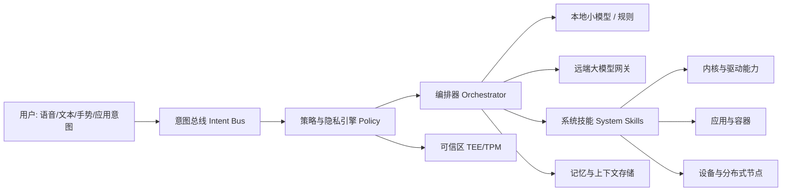
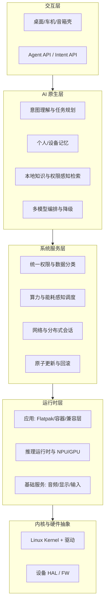
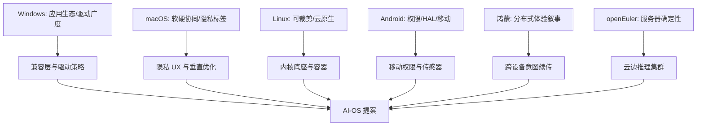
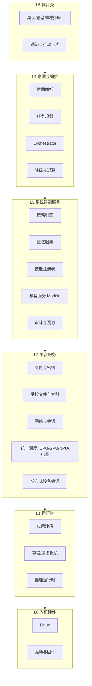

# AI 操作系统设计文档：国内外主流 OS 对比、优缺点综合与 AI 原生架构方案

「再做一个 Linux 发行版」已经不够：桌面要懂用户意图，云边要调度模型与算力，端侧要在隐私约束下完成推理。要设计真正的 **AI 操作系统（AI-OS）**，不能凭空画饼，必须先看清 Windows、macOS、Linux、Android/iOS、ChromeOS，以及鸿蒙、openEuler、统信 UOS、openKylin 等国内外主流系统各自赢在哪里、输在哪里，再 **吸收优点、显式规避缺点**，把 AI 从「应用插件」提升为 **一等公民：调度、权限、存储、交互与安全策略的中枢**。

本文是一份可对照的 **设计文档型长文**：先做有名 OS 的对比分析，再给出 AI-OS 的目标、功能清单、分层框图、亮点与演进路线。设计方案标注为 **提案（Proposal）**；对现有系统的技术描述尽量对齐公开资料与可验证事实，厂商未公开的内部实现不臆造。

## 阅读地图

1. **第一层：国外主流 OS**——Windows / macOS / 主流 Linux / Android / iOS / ChromeOS 各自定位与结构性优缺点。
2. **第二层：国内主流 OS**——鸿蒙 HarmonyOS、openEuler、统信 UOS、openKylin、阿里 Anolis 等：生态路径与差异化。
3. **第三层：对比综合**——用同一套维度打分式对照，提炼「必须继承」与「必须避免」。
4. **第四层：AI-OS 设计目标与原则**——AI 原生不等于套个 Chatbot；定义边界、威胁模型与非目标。
5. **第五层：架构、功能与框图（设计正文）**——分层结构、核心子系统、功能列表、亮点、与现有内核/运行时的落点。
6. **第六层：演进路线、验证指标与风险**——MVP → 产品态；开源治理；合规与算力成本。

## 参考锚点（现有系统与可复用开源）

| 锚点 | 用途（分析或可复用） |
|------|----------------------|
| Linux Kernel（kernel.org） | 进程/调度/命名空间/cgroup/io_uring；AI-OS 建议以 Linux 为默认内核底座 |
| Android (AOSP) | Binder、HAL、权限模型、OTA；移动端 AI 能力管线可对照 |
| Chromium OS / ChromeOS | 无状态更新、沙箱、容器化应用；「系统不可变 + 用户可变」可借鉴 |
| systemd / PipeWire / Wayland | 现代 Linux 用户态服务、音视频与显示栈 |
| OCI / containerd / Kubernetes | 云边侧工作负载与模型服务编排参照 |
| ONNX Runtime / TensorRT / OpenVINO / llama.cpp | 推理运行时选型参考（按硬件选型，非绑定） |
| OP-TEE / KeyMint / TPM | 密钥与模型版权/隐私的可信执行参照 |
| HarmonyOS 公开文档（分布式软总线等概念） | 端边协同交互模型的对照，不复制未公开协议细节 |
| openEuler / openKylin 公开仓库与白皮书 | 国内服务器/桌面发行版能力边界对照 |

说明：下文「AI-OS」若无特别声明，均指 **本设计提案中的目标系统**，不是已有商用产品名。

## 调用链与总览框图

### 从「用户意图」到「系统动作」的主路径（AI-OS 提案）



### AI-OS 逻辑分层总框图



### 国内外 OS「能力基因」如何映射到 AI-OS



## 第一层：国外主流操作系统——定位与结构性优缺点

**本层主问题**：这些「有名系统」各自优化的目标函数是什么？哪些优点可迁移，哪些缺点会遗传？

### Windows

**定位**：个人电脑与企业桌面的默认选择；游戏与生产力二进制生态最大；服务器仍有份额。

**优点**

- **应用与驱动覆盖面**：商业软件、行业软件、外设驱动积累最深，对「能装上」极其友好。
- **企业治理工具链成熟**：域、策略、签名驱动、更新通道对 IT 可控。
- **近年 AI 入口**：Copilot 类能力说明「系统级助手」已被市场教育，但多数仍偏应用层集成。

**缺点**

- **技术债与攻击面**：历史兼容带来复杂权限与恶意软件压力。
- **闭源内核主导**：深度定制、安全审计、信创替代场景受限。
- **资源画像偏重**：低端/嵌入式不是主场。
- **AI 与 OS 内核耦合有限**：助手强，但调度/文件/权限尚未形成统一「意图内核」。

**可继承**：生态兼容策略、企业更新与策略框架的产品思维。  
**须规避**：无边界的兼容包袱压垮安全模型；AI 仅停留在侧边栏。

### macOS

**定位**：苹果硬件上的垂直整合桌面；开发者与创意生产工具体验标杆。

**优点**

- **软硬协同**：芯片、加速器与框架（如 Metal 生态）一体化，能效与体验上限高。
- **隐私与权限 UX**：权限提示、剪贴板/摄像头指示等产品细节成熟。
- **Unix 用户态 + 精致桌面**：对开发者相对友好。

**缺点**

- **硬件锁定**：无法作为开放 AI-OS 的默认硬件策略。
- **闭源比例高**：内核 XNU 与关键框架不可完整审计/再分发。
- **生态封闭**：侧载与替代商店策略随政策变化，不适合「开放 Agent 生态」假设。

**可继承**：隐私可见性、垂直场景把体验做透。  
**须规避**：把 AI-OS 做成单一硬件绑定的黑盒。

### 主流 Linux 桌面与服务器发行版（Ubuntu、Fedora、RHEL/SLES 等）

**定位**：云与超算事实标准；桌面可用但碎片化；嵌入式/车载大量裁剪派生。

**优点**

- **开放、可裁剪、可审计**；容器与云原生同源。
- **包罗万象的驱动与架构支持**（x86/ARM/RISC-V 等随主线演进）。
- **控制平面思想成熟**：cgroup、namespace、ebpf 为「AI 工作负载隔离」打底。

**缺点**

- **桌面一致性与商业应用**仍弱于 Windows/macOS。
- **碎片化**：发行版、桌面环境、打包格式分叉，Agent 生态若无标准会重复踩坑。
- **默认不「懂用户」**：强工具属性，弱意图属性。

**可继承**：以 Linux 为 AI-OS **默认内核与驱动底座**；用容器/cgroup 管模型与应用。  
**须规避**：再做一个无标准的发行版碎片；只堆软件包不堆系统能力。

### Android

**定位**：全球最大移动客户端 OS；以 Linux 内核 + 富用户态（ART、Binder、HAL）构成。

**优点**

- **权限与组件模型**清晰（Activity/Service/权限组）；传感器与多媒体栈完整。
- **HAL 把厂商差异下沉**，上层相对稳定。
- **端侧 AI 已有产品验证**（芯片 NPU + 厂商模型），说明移动形态需要 **on-device 优先**。

**缺点**

- **厂商定制分裂**与更新滞后（虽在改善）。
- **后台与省电策略**对长任务 Agent 不友好，需专门的「AI 任务配额」。
- **桌面形态并非原生最优**。

**可继承**：权限分组、HAL、OTA 思维；端侧推理优先。  
**须规避**：放任厂商 ROM 撕裂 Agent API；无配额的后台模型把电池打干。

### iOS / iPadOS

**定位**：苹果移动与平板；安全与应用质量门槛高。

**优点**

- **沙箱与权限极端严格**；恶意软件面相对可控。
- **能效与 SoC 协同**强；端侧模型产品质量高。

**缺点**

- **封闭**；不适合作为开放 AI-OS 的主线实现。
- 系统扩展点受控，第三方「系统级 Agent」空间有限。

**可继承**：默认最小权限、敏感操作可见。  
**须规避**：用封闭换安全导致 Agent 生态无法生长——AI-OS 要用 **可审计开放 + 强制策略** 代替「只许官方」。

### ChromeOS

**定位**：云优先笔记本；系统分区近似不可变，应用走容器/Android/Web。

**优点**

- **更新原子、回滚清晰**；崩溃可回到已知良好系统态。
- **沙箱强**；适合教育与轻度办公。
- 「系统瘦、应用肥」与 AI 时代「系统稳、模型勤更新」同构。

**缺点**

- **离线重度生产力**与专业外设仍弱；强依赖谷歌账号与云假设。
- 本地专业 GPU/NPU 工作流不是历史强项（在随硬件改善）。

**可继承**：**不可变根文件系统 + 原子更新**；应用与模型装在可更新层。  
**须规避**：把一切能力锁死在单一云厂商。

## 第二层：国内主流操作系统——路径与差异化

**本层主问题**：国产 OS 在服务器、桌面、万物互联上各自押注什么？AI-OS 如何借力而非重复造轮？

### HarmonyOS（鸿蒙）

**公开定位**：面向全场景的分布式操作系统叙事；手机、穿戴、车机、屏等协同。

**优点（基于公开能力与产品观察）**

- **跨设备协同体验**是明确产品主张（接续、流转、统一账号体系等）。
- 对「多端意图连续」有市场教育：用户接受「任务不绑单设备」。
- 移动端性能与自研芯片绑定的产品迭代快。

**缺点 / 风险**

- **生态与工具链**仍需与 Android 兼容策略并存（阶段随版本变化，以官方说明为准）。
- 核心实现细节不完全开放，第三方做「系统级 AI 中枢」受平台策略约束。
- 分布式协议与安全边界若理解不清，容易出现过授权风险。

**可继承**：跨设备 **意图续传** 与设备发现的产品形态。  
**须规避**：在无开放规范下复制私有总线；AI-OS 应用 **开放 Intent/Session 协议**。

### openEuler

**定位**：面向服务器、云、边缘与嵌入式的开源操作系统（欧拉社区）；强调企业级与多样性计算。

**优点**

- **服务器与云场景**脚踏实地：内核、虚拟化、云原生组件齐全。
- 对 **ARM/x86/多算力** 友好，贴近推理集群与边缘网关。
- 开源治理相对清晰，适合作为 **云边 AI 基础设施 OS** 底座之一。

**缺点**

- 桌面与消费级 Agent 体验不是主战场。
- 若缺少统一「模型与意图」层，仍只是优秀 Linux 发行版。

**可继承**：作为 AI-OS **数据中心/边缘节点** 参考发行版或兼容目标。  
**须规避**：只用服务器思维做桌面交互。

### 统信 UOS / Deepin 系

**定位**：桌面与行业国产化替代；深耕桌面环境与兼容层。

**优点**

- **桌面完备度**在国产系统中靠前；面向办公与政务市场有交付经验。
- 兼容层思路（运行部分 Windows/Android 应用的产品策略随版本演进）降低迁移痛。

**缺点**

- 上游跟进与商业发行版节奏需平衡；专业创意/游戏生态仍不足。
- AI 能力多为预装应用级，系统级编排少见公开架构。

**可继承**：桌面可用性与迁移路径。  
**须规避**：兼容层变成唯一价值——AI-OS 核心价值应是意图与策略层。

### openKylin（开放麒麟）

**定位**：桌面操作系统开源根社区方向；汇聚桌面交互与国产软硬件适配。

**优点**

- 桌面场景与社区协作；对国产 CPU/GPU 适配有明确动机。
- 开源根的叙事利于高校与研究所参与 AI 桌面实验。

**缺点**

- 生态与商业软件丰富度仍在追赶；需长期投入。
- 若无 AI 原生架构，易停在「又一个 Ubuntu 变体」。

**可继承**：桌面根社区协作与国产硬件适配经验。  
**须规避**：发行版换皮；要把 **AI 层标准** 沉到根社区。

### Anolis / 其它云厂商 OS、嵌入式 RTOS（简述）

- **Anolis OS 等**：云上兼容与迁移，适合 AI 训练/推理集群宿主。  
- **Zephyr / FreeRTOS / RT-Thread**：实时与极低资源；AI-OS **终端微控制器侧**可用「AI-OS Device Profile」托管，而非硬跑完整桌面栈。  
- **车载（QNX、AGL 等）**：安全认证与实时；AI-OS 车规版需独立安全目标，本文主提案先覆盖 **通用计算设备 + 边缘**，车规列为演进配置档。

## 第三层：对比综合——必须继承 vs 必须去除

**本层主问题**：用同一维度对比后，AI-OS 的「基因筛选」结论是什么？

### 对比维度表（定性）

| 维度 | Windows | macOS | Linux 通用 | Android | ChromeOS | 鸿蒙 | openEuler | UOS/Kylin 桌面 |
|------|---------|-------|------------|---------|----------|------|-----------|----------------|
| 开放可审计 | 低 | 低 | 高 | 中（AOSP 高/整机中） | 中 | 中低 | 高 | 中高 |
| 应用生态 | 极高 | 高 | 中 | 极高 | 中 | 高(移动) | 中(服务器) | 中 |
| 桌面体验一致性 | 高 | 极高 | 中低 | 低 | 高 | 中高 | 低 | 中高 |
| 云边/服务器 | 中 | 低 | 极高 | 低 | 低 | 中 | 极高 | 低 |
| 跨设备协同 | 中 | 高 | 低 | 中 | 中 | 高 | 低 | 低 |
| 安全更新模型 | 中高 | 高 | 中(视发行版) | 中 | 极高 | 高 | 高 | 中高 |
| 端侧 AI 潜力 | 中高 | 高 | 中高 | 高 | 中 | 高 | 高(边缘) | 中 |
| 可定制为 AI 原生 | 低 | 低 | 极高 | 中 | 中 | 中 | 高 | 中 |

### 综合：优点清单（AI-OS 必须吸收）

1. **Linux 内核 + 云原生隔离**（cgroup/namespace/容器）——管应用也管模型进程。  
2. **ChromeOS 式不可变底座 + 原子更新**——系统稳态与模型高频更新分离。  
3. **Android 式权限分组 + 明确 HAL**——传感器、摄像头、麦克风对 Agent 默认拒绝、明示授权。  
4. **macOS/iOS 式隐私可见性**——AI 访问剪贴板/文件/屏幕必须可感知、可撤销。  
5. **Windows 的兼容现实**——提供 **受控兼容层**（容器化 Win/Android 应用），但不让兼容性破坏安全默认。  
6. **鸿蒙式跨设备任务连续**——用开放 **Intent Session** 在多设备间迁移，不绑单厂商账号也可工作（可插拔身份）。  
7. **openEuler 式多样性算力**——CPU/GPU/NPU/DPU 统一纳入 **算力调度器**。  
8. **桌面国产 OS 的迁移经验**——政务/行业交付需要「能办公」的底线应用集。

### 综合：缺点清单（AI-OS 必须去除或抑制）

1. **碎片化发行无标准 Agent API** → 定义 AI-OS Profile 与认证。  
2. **AI 只是预装聊天应用** → AI 进入调度、检索、权限、存储主路径。  
3. **闭源不可审计的安全神话** → 开源 TCB（可信计算基）最小化 + 可验证构建。  
4. **无边界后台常驻大模型** → 配额、能耗、温控、隐私分级强制执行。  
5. **单一云锁定** → 本地优先，云是可替换 Provider。  
6. **为兼容牺牲权限** → 兼容应用默认强沙箱，敏感 Skill 需用户提升授权。  
7. **分布式协同却模糊安全边界** → 设备互信基于密钥与策略，不基于「同一 Wi-Fi」。

## 第四层：AI-OS 设计目标与原则

**本层主问题**：AI-OS 解决什么、不解决什么？成功长什么样？

### 一句话定义

**AI-OS** 是以 **意图（Intent）** 为统一输入、以 **策略（Policy）** 为统一裁决、以 **编排（Orchestration）** 为统一执行的操作系统：应用、模型、设备技能都是可调度的一等对象；默认 **本地推理优先、最小权限、可撤销记忆**，云端能力可插拔。

### 设计原则

| 原则 | 含义 |
|------|------|
| AI 一等公民 | 模型运行时、向量/记忆存储、工具调用与进程/文件同等纳入内核之上的系统服务 |
| 本地优先 | 能在端侧完成的不上传；上传必须分类分级与明示 |
| 策略先于模型 | 模型建议不等于系统允许；Policy Engine 可一票否决 |
| 可降级 | 无网、低电量、NPU 忙碌时自动降级到小模型/规则/经典 UI |
| 不可变底座 | OS 基线原子更新；用户态、模型、Agent 技能可独立更新通道 |
| 开放可替换 | 模型 Provider、应用商店、账号 IdP 均可换；避免单厂商锁死 |
| 可观测 | 每次 Agent 行动有审计事件：用了什么数据、调了什么 Skill、是否出域 |

### 非目标（刻意不做）

- 不宣称「一年取代 Windows 全部二进制生态」。  
- 不在 MVP 实现车规功能安全认证全套（另设产品档）。  
- 不训练「一个统治一切的大一统模型」——OS 负责 **编排与治理**，模型可多供应商。  
- 不把用户数据默认用于厂商再训练。

### 威胁模型（摘要）

- 恶意 Agent 技能诱导过度授权。  
- 提示词注入导致误调用 `shell`/`支付`/`发信` 类 Skill。  
- 模型或插件供应链投毒。  
- 跨设备会话被附近攻击者劫持。  
- 侧信道从共享 GPU/NPU 泄露。

对应：技能签名与权限能力集、危险操作双确认、SBOM、设备互信配对、算力资源隔离。

## 第五层：架构、功能清单、框图与亮点（设计正文）

**本层主问题**：系统长什么样？有哪些功能？亮点是什么？如何落到现有开源栈？

### 5.1 推荐落地策略（务实）

| 层级 | 提案选择 | 理由 |
|------|----------|------|
| 内核 | Linux LTS | 驱动与云边生态最大，ebpf/cgroup 可用 |
| 系统服务 | systemd + 自研 AI 服务集 | 服务管理成熟 |
| 显示/音频 | Wayland + PipeWire | 现代 Linux 主线 |
| 应用封装 | Flatpak/容器 + 可选兼容区 | 沙箱与桌面分发 |
| 更新 | A/B 分区或 ostree 类原子更新 | 吸收 ChromeOS 优点 |
| 推理 | 可插拔 Runtime（ONNX RT / vendor NPU stack / llama.cpp 等） | 硬件差异大，必须抽象 |
| 可信 | TPM/TEE 存密钥与敏感策略 | 吸收移动安全优点 |

### 5.2 逻辑架构（再展开）



### 5.3 核心子系统说明

**（1）Intent Bus（意图总线）**  
统一接收：自然语言、GUI 动作宏、应用声明式 Intent、其它设备传来的 Session。输出标准化 `Intent` 对象：目标、槽位、置信度、所需能力、数据分级。

**（2）Policy Engine（策略引擎）**  
输入：Intent、用户身份、设备状态（电量/网络/位置粗粒度）、数据分类标签。  
输出：允许 / 拒绝 / 降级 / 需交互确认。  
策略例：`文件删除` 需确认；`通讯录上传云` 默认拒绝；`本地摘要下载目录` 允许。

**（3）Orchestrator（编排器）**  
把 Intent 拆成 Skill 图：可并行（检索+打开应用）、可补偿（失败回滚通知）。绑定本地小模型做工具选择，复杂推理才走云端 Provider。

**（4）Modeld（模型守护进程）**  
管理模型生命周期：下载验签、版本、显存/NPU 占用、抢占与优先级队列、温控降频。应用不直接碰驱动，只经 Modeld API。

**（5）Skill Registry（技能注册表）**  
技能=系统能力或应用暴露的工具：`wifi.toggle`、`doc.summarize`、`mail.draft`、`k8s.apply`（管理档）。技能声明 **所需权限能力** 与 **副作用等级**。

**（6）Memory Service（记忆服务）**  
短期上下文、用户偏好、设备事实库；默认加密；支持「一键遗忘」与企业策略自动过期。与检索（RAG）结合时 **权限感知**：无权限文档不可入检索集。

**（7）Distributed Session（分布式会话）**  
设备发现、互信、会话迁移（手机规划、PC 执行渲染）。安全上类似「配对 + 能力票据」，避免「同 Wi-Fi 即信任」。

**（8）Unified Scheduler（统一调度）**  
在 CFS/cpufreq 之上增加 **推理任务类**：latency-critical UI、batch embed、cloud upload。电量低于阈值禁止云大模型，仅本地 int8 小模型。

### 5.4 功能列表（产品功能规格摘要）

**A. 基础 OS 功能（继承并加强）**

- 进程、用户、权限、网络、存储、打印、多用户、无障碍  
- 原子系统更新与回滚、远程审计日志（可关）  
- 应用沙箱安装（签名 + 能力声明）  
- 可选兼容区：容器化运行指定 Android/Windows 应用（非默认高权限）

**B. AI 原生功能**

- 系统级助手（可禁用）与 **无助手时的 Intent API**（应用仍可调用编排）  
- 多模型路由：本地 / 边缘 / 云；按任务类型与机密级别选择  
- 桌面「行动卡片」：Agent 提议操作，用户一键批准/拒绝  
- 自然语言系统设置与排障（绑定只读诊断 Skill + 有限修复 Skill）  
- 个人知识库：本地文件/邮件/笔记的权限感知检索  
- 开发者 Agent：仓库级代码问答默认不出域，需 Git push 等危险 Skill 二次确认  
- 语音唤醒与热词本地化；云端 ASR 可关

**C. 安全与治理功能**

- 数据分类标签（公开/内部/机密/受限）与强制 ACL  
- Agent 操作审计时间线（可导出）  
- 技能商店：签名、SBOM、权限审查等级  
- 企业策略包：禁用云 Provider、强制本地、会话录制策略  
- TEE/TPM：磁盘密钥、模型许可证密钥、远程证明（可选）

**D. 云边与管理功能**

- 边缘节点注册为「家庭/车间推理池」  
- 模型增量更新通道与系统更新通道分离  
- 可选对接 Kubernetes 作为「云侧 Skill 后端」（服务器档）

**E. 设备档（同一架构，不同裁剪）**

| 档位 | 目标硬件 | 裁剪要点 |
|------|----------|----------|
| Nano | MCU/弱 CPU | 仅 Device Profile：安全连接 + 远程 Skill 代理 |
| Edge | 网关/NPU 盒 | 本地中小模型 + 设备枢纽 |
| Desk | PC/笔记本 | 完整桌面 + 兼容区 |
| Cloud | 服务器 | 多租户 Modeld + 无 GUI |

### 5.5 关键路径（AI 融合如何「长进」OS）

1. **输入融合**：输入法、语音、无障碍 API 全部可产生 Intent。  
2. **存储融合**：文件系统增加「语义索引管道」（用户可关）；索引器跑在低优先级 cgroup。  
3. **权限融合**：传统 POSIX 权限之上增加 **Capability for AI**（如 `cap_agent_network_egress`）。  
4. **调度融合**：把 GPU/NPU 上下文切换与抢占暴露给 Modeld，避免模型饿死 UI。  
5. **更新融合**：`system://`、`models://`、`skills://` 三条 OSTree/A-B 链。  
6. **交互融合**：通知中心升级为「待批准行动队列」。

### 5.6 亮点（相对现有系统的差异化）

1. **意图一等公民**：不是聊天窗口挂件，而是与 syscall 同级的系统入口（用户态 Intent API）。  
2. **策略盖帽模型**：模型再聪明也不能绕过 Policy；对抗提示词注入的系统解。  
3. **本地优先的可插拔云**：隐私默认正确；企业可零云运行。  
4. **模型与系统更新解耦**：周更模型、月更系统，失败互不影响。  
5. **权限感知 RAG**：检索不可能「看见」用户未授权文件——从架构消灭一类泄露。  
6. **跨设备 Session 开放协议**：吸收分布式体验，但可互操作、可审计。  
7. **算力与能耗感知编排**：AI 手机/笔记本体验的关键——否则 Agent 不可用。  
8. **兼容而不纵容**：兼容区默认无 Agent 高危 Skill，需显式桥接。  
9. **同一架构多档位**：MCU→云，避免「桌面一个、物联网一个、互不相认」。  
10. **可验证构建与 SBOM**：开源 TCB + 供应链可见，对标闭源「信任我」。

### 5.7 关键数据对象（设计草图）

```text
Intent {
  id, source, slots[],
  confidence,
  required_capabilities[],
  data_sensitivity,   # public|internal|secret|...
  preferred_locus     # local|edge|cloud|any
}

Skill {
  id, version, signature,
  capabilities_used[],
  side_effect_level,  # none|fs|net|device|irreversible
  entrypoint
}

ActionPlan {
  intent_id,
  steps[] { skill, args, rollback },
  policy_decision,
  audit_id
}
```

具体 IDL 可用 Protobuf/Cap’n Proto；ABI 稳定策略单列版本号 `AIOS_INTENT_API=1`。

### 5.8 与现有开源的映射（避免空中楼阁）

| AI-OS 组件 | 可起步的开源基础 |
|------------|------------------|
| 内核/驱动 | Linux LTS |
| 原子更新 | ostree / RAUC / A-B |
| 沙箱应用 | Flatpak、bubblewrap、Firecracker（强隔离档） |
| 策略 | 自研 + 可参考 Android 权限 UX；企业侧 OPA 类引擎 |
| 推理 | ONNX Runtime、llama.cpp、vLLM（云侧）等按档位 |
| 分布式 | 自研 Session；发现层可用标准化局域网协议，不绑私有总线 |
| 桌面 | KDE/GNOME 扩展「行动卡片」或独立 Shell |

## 第六层：演进路线、验证指标与风险

**本层主问题**：怎么落地？如何证明比「Linux + ChatGPT 客户端」更值？

### 路线图

**Phase 0（概念验证，1–2 季度）**

- 基于现有 Linux 发行版 + 用户态 `intentd/policy/modeld`  
- 10 个只读 Skill + 5 个需确认 Skill  
- 本地小模型摘要/检索；云 Provider 可选

**Phase 1（MVP 桌面档）**

- 原子更新；Flatpak 应用；审计时间线  
- 权限感知本地检索  
- 电量/负载降级策略

**Phase 2（多设备）**

- 手机/PC Session 迁移  
- Edge 档推理池

**Phase 3（产品硬化）**

- 技能商店与签名体系  
- 企业策略包  
- 兼容区  
- 形式化部分策略测试（拒绝集回归）

### 验证指标（建议）

| 指标 | 目标方向 |
|------|----------|
| 本地任务完成率（无网） | 核心办公意图可完成比例 |
| 危险操作误执行率 | 逼近 0（注入攻防测试） |
| 端到端隐私：未授权文件入模次数 | 0 |
| UI 卡顿：推理抢占下输入延迟 | 明确上限 |
| 系统更新失败回滚成功率 | ≈100% |
| 模型更新独立失败不影响引导 | 必须 |

### 风险与缓解

| 风险 | 缓解 |
|------|------|
| 模型幻觉导致系统误操作 | 高副作用 Skill 强制确认；计划可显示可编辑 |
| 算力成本与功耗 | 分级模型；配额；NPU 优先 |
| 生态冷启动 | 先兼容运行现有应用；Agent 能力逐步声明 |
| 厂商锁癖好复发 | 章程：Provider 可替换；开放 Intent API |
| 合规（生成式内容、日志跨境） | 默认本地；区域化部署；可关审计上传 |

### 设计结论（回收全文）

- **国外系统**贡献了生态、隐私 UX、原子更新、移动权限与云原生底座等「零件」。  
- **国内系统**贡献了分布式体验叙事、服务器多样性算力与桌面国产化迁移经验。  
- **缺点集中在**：碎片化、AI 应用化、闭源不可审计、云锁定、分布式安全边界不清。  
- **AI-OS 提案**用「意图总线 + 策略盖帽 + 模型守护 + 原子底座 + 开放 Session」把优点焊接为完整架构，并把 AI 从应用塞进 **调度、权限、存储、更新、跨设备** 主路径。

这不是又一个换壁纸的发行版，而是一次 **操作系统职责的扩充：从管理资源，到管理意图与信任**。后续若进入实现，优先落地 `intentd/policy/modeld` 用户态三件套，在真实 Linux 桌面验证「策略能否盖住模型」——这是 AI-OS 能否成立的试金石。
