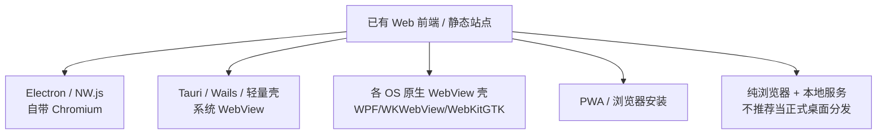
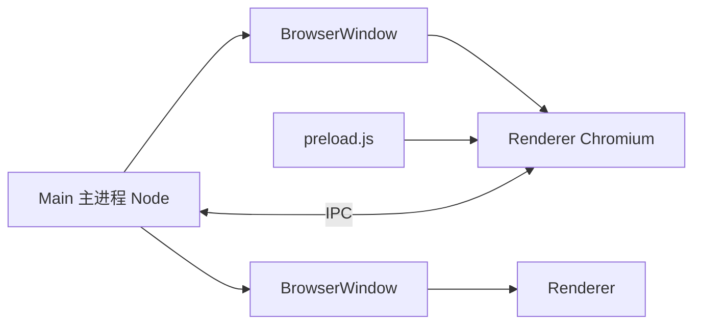
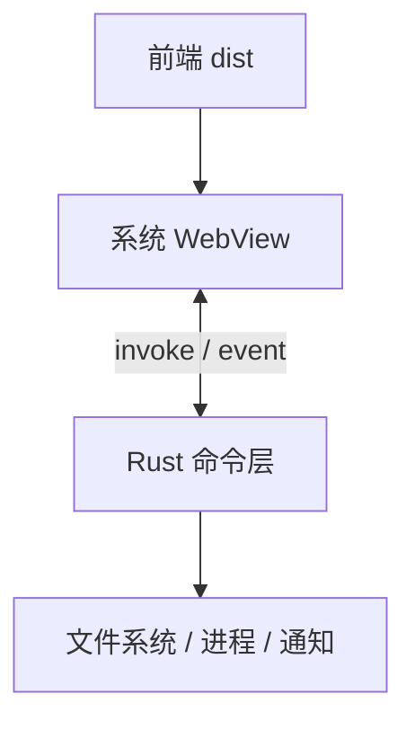
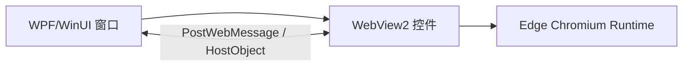
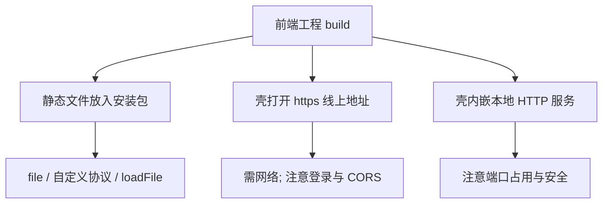
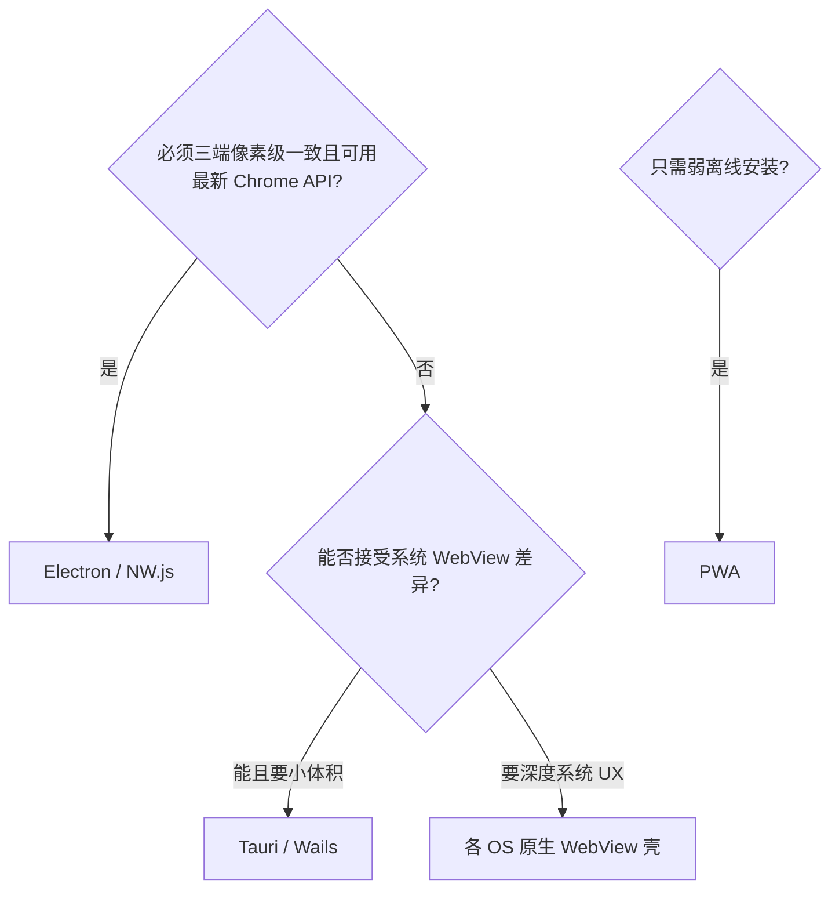

# 把网页打包成桌面程序完整篇：Windows / macOS / Linux 实战对照

上一篇讲清了 WebView。下一步常见需求是：**已有 Web 前端（或本地 HTML），要变成可双击运行的桌面软件**，还要覆盖 **Windows、macOS、Linux** 三大桌面系统。

可选路线很多：Electron、Tauri、NW.js、Wails、纯系统 WebView 壳、PWA。本文按「选型 → 各方案原理 → 三大系统打包细节 → 权限/更新/体积 → 排障 Checklist」展开，尽量让你能直接落地。

## 源码与工程锚点

| 方案 | 关键锚点 | 引擎 / 窗口 |
|------|----------|-------------|
| Electron | `electron`：`BrowserWindow`、`main`/`preload`、`contextBridge` | 自带 Chromium + Node |
| Tauri | `src-tauri/tauri.conf.json`、`invoke` 命令 | 系统 WebView + Rust 后端 |
| NW.js | `package.json` → `main` HTML | Chromium + Node（模型与 Electron 不同） |
| Wails | Go + 前端资源 | 系统 WebView |
| 轻量壳 | `webview`（C/Go/Python 绑定）、pywebview | 系统 WebView |
| Windows 原生 | WinUI3 / WPF + **WebView2** | Edge Chromium |
| macOS 原生 | AppKit/SwiftUI + **WKWebView** | WebKit |
| Linux 原生 | GTK + **WebKitGTK** 或 Qt WebEngine | WebKit / Chromium |

Electron 主进程开窗（概念）：

```js
// main.js
const { app, BrowserWindow } = require('electron');
function createWindow() {
  const win = new BrowserWindow({
    width: 1200,
    height: 800,
    webPreferences: {
      preload: `${__dirname}/preload.js`,
      contextIsolation: true,
      nodeIntegration: false,
    },
  });
  win.loadFile('dist/index.html'); // 或 loadURL('https://...')
}
app.whenReady().then(createWindow);
```

Tauri 配置片段（概念）：

```json
{
  "build": { "distDir": "../dist", "devPath": "http://localhost:5173" },
  "tauri": {
    "windows": [{ "title": "MyApp", "width": 1200, "height": 800 }],
    "allowlist": { "fs": { "scope": ["$APPDATA/*"] } }
  }
}
```

## 总览：五条产品路线



| 路线 | 体积 | 性能 / 内存 | 三端一致性 | 适合 |
|------|------|-------------|------------|------|
| Electron | 大（约 80MB+ 起） | 偏高 | 极强 | 要 Node、生态、快速交付 |
| Tauri 2 | 小（数 MB～十余 MB 级量级视依赖） | 较好 | 强（靠系统 WebView） | 新项目、注重体积与安全允许列表 |
| 原生 WebView 壳 | 小 | 好 | API 各写一套 | 强绑定系统 UX、控依赖 |
| PWA | 几乎为 0 | 好 | 能力受限 | 弱离线、弱系统集成 |
| NW.js | 大 | 类似 Electron | 强 | 历史项目或特定习惯 |

---

## 路线 A：Electron（三端同一套 Chromium）

### 架构



- **Main**：窗口、菜单、托盘、自动更新、原生模块。
- **Renderer**：你的网页；**不要**直接开 `nodeIntegration`。
- **preload + contextBridge**：安全暴露有限 API。

### 开发到可分发

```bash
# 示例：electron-vite / forge / builder 皆可
npm create electron-vite@latest
# 构建前端到 dist，再打包
npm run build
# 常用：electron-builder 产出三端安装包
```

`electron-builder` 典型 `package.json` 字段（概念）：

```json
{
  "build": {
    "appId": "com.example.myapp",
    "productName": "MyApp",
    "directories": { "output": "release" },
    "files": ["dist/**/*", "main/**/*", "package.json"],
    "win": { "target": ["nsis", "portable"] },
    "mac": { "target": ["dmg", "zip"], "category": "public.app-category.developer-tools" },
    "linux": { "target": ["AppImage", "deb"], "category": "Utility" }
  }
}
```

### Windows

| 产物 | 说明 |
|------|------|
| NSIS / Squirrel | 安装程序；可选桌面快捷方式 |
| portable | 绿色目录运行 |
| appx/MSIX | 商店或企业旁加载 |

注意：代码签名（Authenticode），否则 SmartScreen 警告；CI 需证书。

### macOS

| 产物 | 说明 |
|------|------|
| `.app` + `dmg` / `zip` | 常规分发 |
| Developer ID + **公证 notarization** | Gatekeeper 必需 |
| Apple Silicon / Intel | `universal` 或分架构构建 |

`entitlements`、Hardened Runtime、相机/麦克风权限文案都要配。

### Linux

| 产物 | 说明 |
|------|------|
| **AppImage** | 单文件，兼容性友好 |
| deb / rpm | 进发行版仓库或内网源 |
| Flatpak / Snap | 沙箱；注意权限 portal |

依赖：部分环境需注意 `libgtk`、沙箱 `chrome-sandbox` 权限（`chmod 4755` 或 `--no-sandbox` 仅限受控环境）。

### Electron 安全清单（必做）

- `contextIsolation: true`，`nodeIntegration: false`
- 校验 `shell.openExternal` URL
- 禁用随意 `remote`（已废弃）
- 自动更新走 HTTPS 与签名校验（`electron-updater`）

---

## 路线 B：Tauri（系统 WebView + Rust）

### 为何体积小

不捆绑整份 Chromium，调用：

- Windows → WebView2  
- macOS → WKWebView  
- Linux → WebKitGTK  

后端用 Rust，前端仍是任意 SPA（Vite/React/Vue…）。



### 环境前提（三端不同）

| 系统 | 必备 |
|------|------|
| Windows | WebView2 Runtime；MSVC / Visual Studio Build Tools；Rust |
| macOS | Xcode CLT；Rust；Apple 签名证书（分发时） |
| Linux | `webkit2gtk`、`libgtk-3-dev` 等开发包；Rust |

Debian/Ubuntu 示例：

```bash
sudo apt install libwebkit2gtk-4.1-dev build-essential curl wget file \
  libxdo-dev libssl-dev libayatana-appindicator3-dev librsvg2-dev
```

### 打包命令（概念）

```bash
npm create tauri-app@latest
# 开发
npm run tauri dev
# 生产
npm run tauri build
# 产出：Windows msi/nsis；macOS app/dmg；Linux deb/AppImage 等（随配置）
```

权限用 **allowlist / capabilities**（Tauri 2）白名单化：默认不能任意读盘，比早期 Electron 默认姿态更紧。

### 三端差异坑

- **Linux**：WebKitGTK 版本随发行版变化，CSS/JS 新特性可能落后于 Chrome。
- **Windows**：客户机缺 WebView2 Runtime 时需引导安装或打 Fixed Version。
- **macOS**：仍要公证；WebView 是 WebKit 不是 Chrome，DevTools/兼容性按 Safari 思维测。

---

## 路线 C：各系统「原生 WebView 壳」（最贴系统）

适合：团队有桌面原生能力，前端只负责 UI。

### Windows：WPF / WinUI + WebView2



打包：

1. 发布单文件/框架依赖的 .NET 应用。  
2. 用 **WiX / Inno Setup / MSIX** 做安装包。  
3. 安装程序检测并安装 **WebView2 Evergreen Bootstrapper**，或附带 Fixed Version 目录。  
4. Authenticode 签名。

### macOS：SwiftUI / AppKit + WKWebView

1. Xcode 建 App，窗口内嵌 `WKWebView`。  
2. 本地站点：`Bundle.main` 资源复制进 `.app/Contents/Resources`。  
3. `Archive` → Developer ID 签名 → `notarytool` 公证 → 钉门禁。  
4. 分发 `dmg` 或直接 `.app.zip`。

沙箱 App Store 版权限更严；企业内网分发可用 Developer ID。

### Linux：GTK + WebKitGTK（或 Qt WebEngine）

```bash
# 运行依赖示例（发行版名略有差异）
# webkit2gtk-4.0 / 4.1
```

打包选项：

| 格式 | 适用 |
|------|------|
| AppImage | 通用桌面用户 |
| deb / rpm | 固定发行版 |
| Flatpak | 沙箱 + Flathub |
| 原生源码包 | 嵌入式定制根文件系统 |

嵌入式 Linux 若用 **Yocto/Buildroot**，把 WebKitGTK 与应用写进镜像，比桌面 AppImage 更常见。

---

## 路线 D：PWA（轻量，但不是完整「桌面程序」）

Chrome/Edge：`清单 + Service Worker` → 「安装应用」。  

**优点**：几乎无安装包。  
**缺点**：文件系统、托盘、深度硬件、后台策略受浏览器限制；Linux 支持参差。  

适合内部工具、弱离线；不适合工控壳、强外设。

---

## 把「网页」放进壳里的三种加载方式



推荐产品化：**静态资源进包 + 自定义协议或 Asset 映射**；纯线上 URL 适合「永远在线」的运营型客户端。

---

## 三大系统分发对照表

| 项 | Windows | macOS | Linux |
|----|---------|-------|-------|
| 常见安装包 | exe(NSIS)、msi、msix、portable | dmg、pkg、App Store | AppImage、deb、rpm、Flatpak |
| 信任 | Authenticode + SmartScreen | Developer ID + **公证** | GPG 源 / Flatpak 远程 |
| WebView 依赖 | WebView2 Runtime（Tauri/原生） | 系统自带 WebKit | webkit2gtk 包 |
| 自动更新 | Squirrel、电子更新、自研 | Sparkle、电子更新 | AppImage 更新、仓库升级 |
| 架构 | x64 / arm64 | universal / arm64 / x64 | x86_64 / aarch64 |

---

## 嵌入式 / 工控场景额外建议

1. **固定引擎版本**：现场无法上网更新 Evergreen 时，Electron 自带引擎或 WebView2 Fixed Version 更可控。  
2. **关掉不必要沙箱仅限受控设备**；默认仍应保持安全配置。  
3. **硬件桥**：串口/USB 放 Rust/Go/C# 原生层，经 IPC/invoke 暴露，不在页面里直接扫端口。  
4. **只读根文件系统**：把用户数据放到 `/var` 或可写分区；注意 WebView 缓存目录。  
5. **GPU / 内存**：无头或弱 GPU 设备测 Chromium 能否启动，备 `--disable-gpu` 等开关（需验证）。

---

## 如何选型（决策树）



- 团队只会前端、要快：Electron。  
- 团队能搞 Rust、要体积与安全默认值：Tauri。  
- 已有 WPF/Qt 大单体：嵌 WebView2 / Qt WebEngine。  
- 嵌入式定制发行版：WebKitGTK 或 Qt WebEngine + 系统包管理。

---

## 端到端最小实践（建议你按此做一次）

### 1）Electron 三端

```bash
npm create electron-vite@latest my-electron-app
cd my-electron-app && npm install && npm run dev
# 配置 electron-builder 后
npm run build && npx electron-builder --win --mac --linux
```

（macOS 包需在 macOS 上签；Linux/Windows 可在对应 CI runner 出包。）

### 2）Tauri 三端

```bash
npm create tauri-app@latest
# 安装各 OS 依赖后
npm run tauri build
```

### 3）仅 Windows 快速壳（WebView2）

- Visual Studio 建 WPF → NuGet `Microsoft.Web.WebView2` → `Source` 指本地 `index.html` 或站点。  
- Publish + Inno Setup + WebView2 bootstrapper。

### 4）仅 Linux 快速壳

- Python `pywebview` 或 Go `webview` 绑定加载本地 HTML；再打 AppImage（工具链如 `appimagetool`）。

---

## Checklist

- [ ] 已选定路线：Electron / Tauri / 原生壳 / PWA，并写明理由（体积、一致性、团队技能）
- [ ] 前端以「静态进包」或「可控 URL」方式加载，CORS 与 cookie 已测
- [ ] Windows：安装包 +（若需要）WebView2 依赖 + 代码签名策略
- [ ] macOS：签名 + **公证** + 权限文案；Apple Silicon 已测
- [ ] Linux：选定 AppImage/deb/Flatpak；目标发行版装过 WebKitGTK/依赖
- [ ] IPC/Bridge 默认拒绝，白名单 API；无 `nodeIntegration` 裸开
- [ ] 自动更新与崩溃上报方案明确；嵌入式场景有「离线固定版本」预案
- [ ] 在三台真实系统（或 CI 矩阵）各装一次，验证开窗、本地页、原生桥、卸载残留

---

> 成稿：`articles/csdn-merged/网页打包桌面程序三大系统完整篇.md`  
> 上篇：`WebView原理与三大端完整篇.md`
