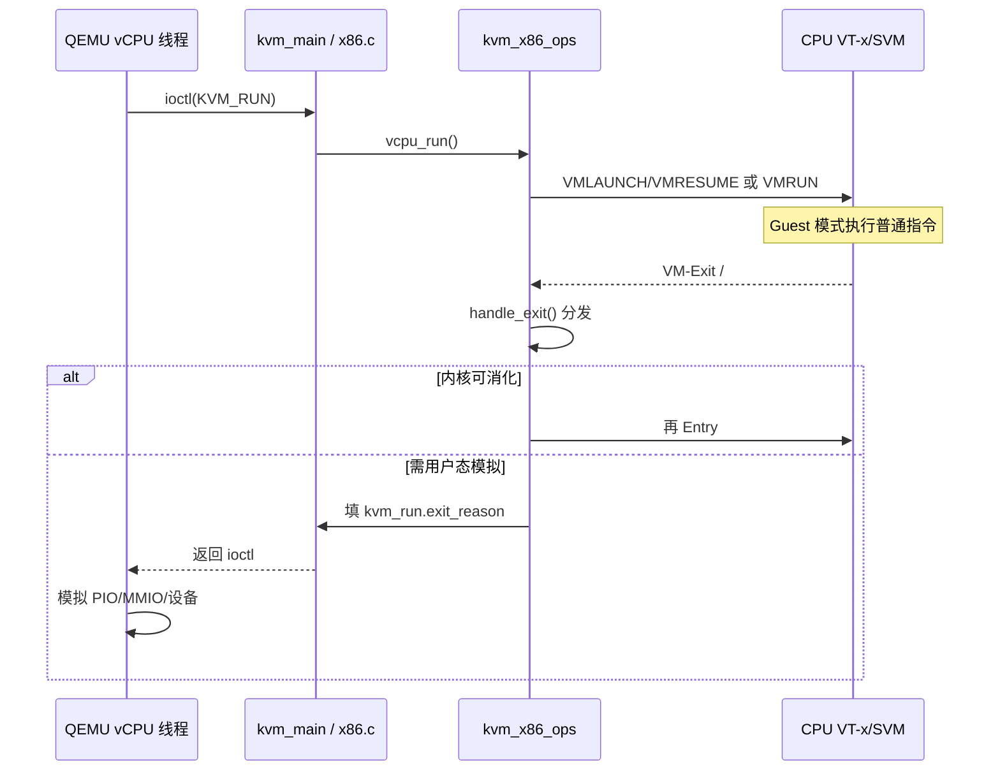
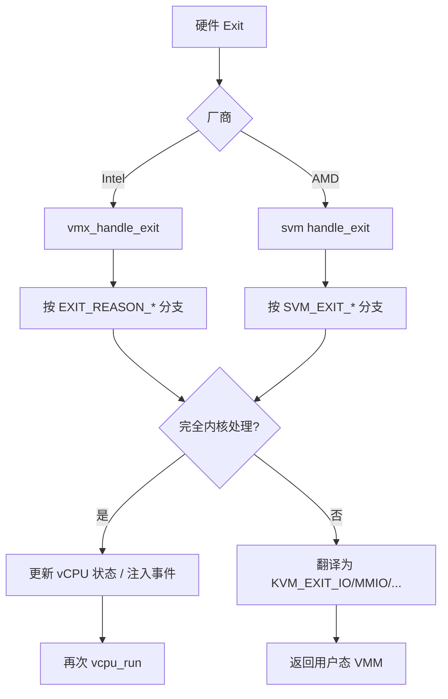

# Guest 一跑就卡死？VT-x/AMD-V 从特权级到 VM-Exit 原因码一条线讲透

虚拟机启动后打字都卡、`perf` 里 `kvm_exit` 刷屏；嵌套场景 L2 进不了；同镜像在裸机 KVM 飞快、在某台机器上却像纯仿真——根因经常不在磁盘镜像，而在 **CPU 虚拟化模式选错、特权指令拦截过宽/过窄、VM-Entry 失败、或 Exit 原因没对上设备模型**。本文沿一条主线讲透：特权级与敏感指令问题 → Intel VT-x / AMD-V 如何改写执行模式 → VM-Entry/VM-Exit 与原因码 → 拦截控制 → Linux `kvm_x86_ops` 如何抹平厂商差异 → 硬件辅助对比二进制翻译 → 观测与排障。路径对齐 `arch/x86/kvm/` 与 Intel SDM / AMD APM 概念（寄存器级细节以厂商手册为准）。

## 阅读地图

1. **第一层：问题从哪来**——解决「为何不能直接在 Ring0 跑 Guest、陷阱与模拟的经典矛盾」。
2. **第二层：硬件辅助虚拟化**——解决「VT-x/AMD-V 引入了什么模式、VMX root/non-root 与 Guest/Host 状态如何切换」。
3. **第三层：VM-Entry / VM-Exit**——解决「何时进入 Guest、为何退出、原因码怎么读、和 `KVM_EXIT_*` 如何映射」。
4. **第四层：拦截与 kvm_x86_ops**——解决「控制哪些事件退出、Linux 如何用回调表统一 Intel/AMD」。
5. **第五层：硬件辅助 vs 二进制翻译**——解决「KVM 与 TCG 差在哪、何时只能用翻译」。
6. **第六层：观测与排障**——解决「Exit 风暴、Entry 失败、无 vmx 标志、嵌套与特性位」。

## 源码锚点

| 路径 | 作用 |
|------|------|
| `arch/x86/include/asm/kvm_host.h` | `struct kvm_x86_ops`、x86 KVM 主机侧核心声明 |
| `arch/x86/kvm/x86.c` | 公共 run 循环、MSR/CR/CPUID、模式切换胶水 |
| `arch/x86/kvm/vmx/vmx.c` | Intel VMX：VMCS 配置、`vmx_handle_exit`、Entry |
| `arch/x86/kvm/vmx/vmcs.h` / `vmx/capabilities.h` | VMCS 字段与能力 |
| `arch/x86/include/asm/vmx.h` | Exit reason 等宏（内核侧） |
| `arch/x86/kvm/svm/svm.c` | AMD SVM：VMCB、`handle_exit`、`svm_vcpu_run` |
| `arch/x86/include/asm/svm.h` | SVM Exit code 等 |
| `arch/x86/kvm/mmu/` | EPT/NPT 与页错误相关 Exit 处理 |
| `include/uapi/linux/kvm.h` | 用户态可见的 `KVM_EXIT_*` |
| `virt/kvm/kvm_main.c` | `KVM_RUN` 进入架构路径的总入口 |
| QEMU `accel/tcg/` | 二进制翻译加速器对照 |
| QEMU `accel/kvm/` | 硬件辅助加速器 |
| Intel SDM Vol.3 的 VMX 章节 | VMCS、Exit reason 权威定义（以手册为准） |
| AMD APM Vol.2 的 SVM 章节 | VMCB、Exit code 权威定义（以手册为准） |

`kvm_x86_ops` 概念形状（字段名随内核演进，以本机头文件为准）：

```c
/* arch/x86/include/asm/kvm_host.h — 逻辑摘要 */
struct kvm_x86_ops {
    int (*hardware_enable)(void);
    void (*hardware_disable)(void);
    int (*vcpu_create)(struct kvm_vcpu *vcpu);
    void (*vcpu_free)(struct kvm_vcpu *vcpu);
    int (*vcpu_reset)(struct kvm_vcpu *vcpu, bool init_event);
    int (*vcpu_run)(struct kvm_vcpu *vcpu);          /* 进 Guest */
    int (*handle_exit)(struct kvm_vcpu *vcpu, ...);  /* 处理退出 */
    void (*set_rflags)(struct kvm_vcpu *vcpu, unsigned long rflags);
    u64 (*get_rflags)(struct kvm_vcpu *vcpu);
    void (*tlb_flush_guest)(struct kvm_vcpu *vcpu);
    /* 大量 MSR/CR/段/嵌套/PML 等回调 … */
};

/* 启动时二选一挂接 */
extern struct kvm_x86_ops vmx_x86_ops;  /* vmx.c */
extern struct kvm_x86_ops svm_x86_ops;  /* svm.c */
```

Intel 退出原因在内核中的常用宏示例（数值以 `asm/vmx.h` / SDM 为准）：

```c
/* arch/x86/include/asm/vmx.h — 示意 */
#define EXIT_REASON_EXCEPTION_NMI        0
#define EXIT_REASON_EXTERNAL_INTERRUPT   1
#define EXIT_REASON_TRIPLE_FAULT         2
#define EXIT_REASON_CPUID                10
#define EXIT_REASON_HLT                  12
#define EXIT_REASON_VMCALL               18
#define EXIT_REASON_CR_ACCESS            28
#define EXIT_REASON_IO_INSTRUCTION       30
#define EXIT_REASON_MSR_READ             31
#define EXIT_REASON_MSR_WRITE            32
#define EXIT_REASON_EPT_VIOLATION        48
#define EXIT_REASON_EPT_MISCONFIG        49
```

## 调用链

### 一次 KVM_RUN：从用户态到硬件再回来



### Exit 分发与厂商抹平



---

## 第一层：问题从哪来——特权级与「敏感指令」

### 1.1 x86 特权级回顾

传统保护模式四级 Ring：

| Ring | 典型角色 | 能做的事 |
|------|----------|----------|
| 0 | 操作系统内核 | 改 CR3、关中断、执行特权指令 |
| 1–2 | 历史极少用 | — |
| 3 | 用户态应用 | 受门控的系统调用 |

虚拟化的核心矛盾：**Guest 内核也认为自己跑在 Ring0**，但宿主机内核已经占用 Ring0。若把 Guest 内核降到 Ring1/3（经典 trap-and-emulate），会遇到：

1. **不能完全陷入的敏感指令**：有些指令在非 Ring0 不触发异常，却能读到特权状态（历史上的「漏洞指令」问题）；
2. **性能**：每个特权行为都异常+模拟，开销巨大；
3. **正确性**：段、分页、中断模型与真实 Ring0 不完全一致。

这就是硬件辅助虚拟化出现之前，全虚拟化痛苦的根源；半虚拟化（改 Guest 内核）和二进制翻译（改指令流）是两条软件出路。

### 1.2 敏感 vs 特权

- **特权指令**：仅最高特权可执行，否则 #GP。
- **敏感指令**：影响虚拟机正确性或隔离，却未必都触发陷阱。

CPU 虚拟化要保证：**所有敏感行为要么由硬件拦截，要么由翻译器改写**，不能静默以错误语义执行。

### 1.3 经典三条技术路线

| 路线 | 做法 | 代表 |
|------|------|------|
| 修改 Guest | hypercall 替代敏感操作 | Xen PV |
| 翻译指令 | 扫描代码块，改写敏感指令 | QEMU TCG、早期 VMware |
| 硬件辅助 | 新 CPU 模式 + 控制块 | VT-x / AMD-V + KVM |

当代服务器默认第三条；前两条仍用于无硬件、跨架构仿真、或调试。

### 1.4 和内存/IO 虚拟化的交界

CPU 虚拟化解决「谁在跑指令」；内存靠二级页表（Intel EPT / AMD NPT）；IO 靠拦截或直通（VFIO）。三者在 Exit 原因上交汇：例如 EPT violation 是 MMU 问题，却表现为一次 CPU Exit。本文聚焦 CPU 控制流，页表细节点到即止。

---

## 第二层：硬件辅助——VT-x 与 AMD-V 改写了什么

### 2.1 Intel VT-x：VMX root / non-root

Intel 引入 **VMX 操作**：

- **VMX root**：宿主机内核（VMM）运行的环境，可执行 `VMXON`、配置 VMCS、发起 Entry；
- **VMX non-root**：Guest 运行环境；敏感事件按 VMCS 控制触发 **VM-Exit** 回到 root。

关键指令（名称以 SDM 为准）：

| 指令 | 作用 |
|------|------|
| `VMXON` | 打开 VMX 操作 |
| `VMXOFF` | 关闭 |
| `VMPTRLD` | 加载当前 VMCS 指针 |
| `VMREAD`/`VMWRITE` | 读写 VMCS 字段 |
| `VMLAUNCH` | 首次进入 Guest |
| `VMRESUME` | 再次进入 Guest |
| `VMCALL` | Guest 主动呼叫 VMM（可配置） |

Linux 在加载 `kvm_intel` 且 `hardware_enable` 时对每个 CPU 做 VMXON；每个 vCPU 绑定 VMCS。

### 2.2 AMD-V：SVM

AMD 用 **SVM**，核心指令 `VMRUN` 加载 **VMCB** 进入 Guest；退出称 **#VMEXIT**。拦截位在 VMCB 控制区配置，语义与 Intel 相近但编码不同。Linux 对应模块 `kvm_amd`。

### 2.3 Guest 状态与 Host 状态

无论 VMCS 还是 VMCB，都要保存两套上下文：

- **Guest state**：Guest 的 RIP、RSP、RFLAGS、CR0/CR3/CR4、段寄存器、部分 MSR…  
- **Host state**：Exit 后立刻恢复的 Host 内核上下文，保证 VMM 从确定点继续跑。

另外还有 **控制字段**：异常 bitmap、CR 掩码、IO bitmap、MSR bitmap、二级页表指针、中断虚拟化开关等。KVM 的大量代码是在「按策略写这些控制字段」与「Exit 后读原因字段」。

### 2.4 模式切换的直观模型

```text
[ Host Ring0, VMX root ]
        | VMLAUNCH/VMRESUME
        v
[ Guest 以为自己 Ring0, 实际 non-root ]
        | 敏感事件
        v
[ VM-Exit → 回到 Host root，读 exit reason ]
        | 处理完
        v
[ 再 VMRESUME … ]
```

Guest 看不到「自己在 non-root」——除非暴露了 hypervisor 叶子 CPUID 或通过时序侧信道，那是安全话题。

### 2.5 模块与 CPUID 标志

```bash
grep -E 'vmx|svm' /proc/cpuinfo
lsmod | egrep 'kvm_intel|kvm_amd'
dmesg | grep -iE 'VMX|SVM|kvm'
```

无标志时，软件再努力也无法走硬件辅助路径（除非是嵌套里父级没把标志传下来）。

---

## 第三层：VM-Entry / VM-Exit——进入、退出与原因码

### 3.1 VM-Entry 做什么

Entry 大致包括（概念序，细节以手册为准）：

1. 检查 VMCS/VMCB 一致性（失败则 Entry 失败，留在 Host）；
2. 加载 Guest 状态；
3. 按控制位武装拦截；
4. 跳到 Guest RIP 继续执行。

KVM 在 Entry 前还会处理：待注入事件、MMU 同步、请求的时钟更新等。`x86.c` 的 run 路径上有一串 `vcpu->requests` 位。

### 3.2 Entry 失败 vs Exit

| 类型 | 含义 | 典型表现 |
|------|------|----------|
| VM-Entry failure | 没能进入 Guest | 错误码在 VMCS；KVM 打日志 / 返回错误 |
| VM-Exit | 进入后又出来 | 正常路径；按 reason 处理 |

排障时二者不可混淆：前者是配置/状态机错误；后者是预期的拦截或外部事件。

### 3.3 常见 Exit 原因（工程高频）

| 原因类 | 例子 | KVM/QEMU 常见后续 |
|--------|------|-------------------|
| 指令拦截 | CPUID、HLT、IN/OUT、RDMSR/WRMSR | 模拟或短路 |
| 控制寄存器 | CR3 切换、CR0 更新 | MMU / 模式处理 |
| 异常/NMI | 可配置哪些异常 Exit | 注入或模拟 |
| 外部中断 | Host 中断抢占 | Host 处理完再 Entry |
| 内存 | EPT violation / misconfig | 补页、MMIO、或错误 |
| 三倍故障 | Guest 崩坏 | `KVM_EXIT_SHUTDOWN` 等 |

### 3.4 硬件 reason → `KVM_EXIT_*`

用户态 **不要** 假设硬件 Exit reason 数值等于 `kvm_run.exit_reason`。KVM 做了稳定 ABI 翻译，例如：

- IO 指令 Exit → `KVM_EXIT_IO`（带 port/size/direction）；
- 某类 MMIO → `KVM_EXIT_MMIO`；
- HLT → `KVM_EXIT_HLT`；
- 很多 EPT violation 若对应普通 RAM 缺页，**可能在内核消化**，用户态根本看不见。

因此：

- 看 **硬件/KVM 内部** 用 `tracepoint:kvm:kvm_exit`、`perf kvm`；
- 看 **用户态往返** 用 QEMU 日志或对 `KVM_RUN` 返回后的 `exit_reason` 计数。

### 3.5 退出资格字段（qualification）

仅有 reason 不够。例如 IO Exit 要知道端口与方向；CR Access 要知道哪个 CR、是 mov 还是 clts。Intel 把细节放在 **Exit qualification** 等字段；AMD 有对应的 EXITINFO。`vmx_handle_exit` / SVM 处理函数会解码这些字段再分支。

### 3.6 中断窗口与注入

虚拟中断不能随时塞进 Guest，需在「可接收中断」的窗口注入。于是有：

- interrupt-window exiting；
- `KVM_EXIT_IRQ_WINDOW_OPEN`（用户态 irqchip 场景更常见）；
- 内核 irqchip 则多在内核完成注入，减少往返。

这是「Guest 收不到中断」类问题的 CPU 侧机制点。

---

## 第四层：拦截控制与 kvm_x86_ops

### 4.1 拦截 = 可编程的「敏感列表」

VMM 通过 VMCS/VMCB 控制位决定：

- 哪些异常导致 Exit；
- 是否拦截所有 IO 或按 IO bitmap；
- MSR bitmap 中哪些 MSR 读写 Exit；
- 是否拦截 HLT、PAUSE、CPUID；
- 二级页表指针与 EPT/NPT 开关。

策略过宽 → Exit 风暴 → 慢；策略过窄 → Guest 行为不正确或破坏隔离。KVM 的默认策略是「正确优先，再对热点做优化（如 halt polling、欢乐耳光 dirty log 等）」。

### 4.2 为何需要 kvm_x86_ops

Intel 与 AMD 的：

- 指令不同（VMRESUME vs VMRUN）；
- 控制块布局不同；
- Exit 编码不同；
- 部分特性（APICv vs AVIC、PML 等）不对称。

若 `x86.c` 到处 `#ifdef`，将不可维护。于是用 **函数表** `kvm_x86_ops`：公共逻辑只调 `kvm_x86_ops.vcpu_run()` 等，厂商文件实现具体函数。

加载时：

```text
探测 CPUID.1.ECX.VMX 或 CPUID.8000_0001.ECX.SVM
  → 注册 vmx_x86_ops 或 svm_x86_ops
  → hardware_enable 在每个 CPU 上打开 VMX/SVM
```

互斥：同一系统通常只加载 `kvm_intel` 或 `kvm_amd` 之一。

### 4.3 handle_exit 分发骨架（概念）

```c
/* 概念伪代码，非直接粘贴某一版行号 */
int vmx_handle_exit(struct kvm_vcpu *vcpu)
{
    u32 reason = vmx_get_exit_reason(vcpu);
    if (reason == EXIT_REASON_FAILED_VMENTRY)
        return handle_entry_failure(...);

    switch (reason) {
    case EXIT_REASON_CPUID:
        return kvm_emulate_cpuid(vcpu);
    case EXIT_REASON_IO_INSTRUCTION:
        return handle_io(vcpu);
    case EXIT_REASON_MSR_READ:
    case EXIT_REASON_MSR_WRITE:
        return handle_rd/wrmsr(...);
    case EXIT_REASON_EPT_VIOLATION:
        return handle_ept_violation(vcpu);
    case EXIT_REASON_HLT:
        return kvm_emulate_halt(vcpu);
    /* ... */
    default:
        return -EFAULT; /* 或注入异常 / 用户态退出 */
    }
}
```

能模拟完且 Guest 可继续 → 返回「再跑」；需要 QEMU → 设置 `vcpu->run->exit_reason` 并退出到 `kvm_main`。

### 4.4 仿真器与「再执行」

部分 Exit 用内核指令仿真器（`arch/x86/kvm/emulate.c` 相关路径）解码 Guest 指令并模拟，然后推进 RIP。这与整块二进制翻译不同：只对 **触发 Exit 的那一小段** 仿真。

### 4.5 嵌套虚拟化时的「拦截的拦截」

L1 自己又是个 Hypervisor 时，L0 的 KVM 要实现 **嵌套 VMX/SVM**：把 L1 对 L2 的 VMCS 操作变成对 L0 控制块的合成。代码路径明显更长（`vmx/nested.c`、`svm/nested.c` 一类）。Exit 会多一跳，性能敏感负载慎用嵌套。

---

## 第五层：硬件辅助 vs 二进制翻译

### 5.1 QEMU TCG 在做什么

TCG（Tiny Code Generator）把 Guest 基本块翻译成 Host 可执行代码并缓存：

```text
Guest TB 扫描
  → 敏感指令变成 helper 调用
  → 生成 Host 机器码
  → 查 TB 缓存命中则直接跑
```

无 VT-x 也能跑任意架构 Guest（如在 x86 上跑 ARM），这是 KVM 做不到的（KVM 要求 Guest 与 Host 同架构族，且有硬件虚拟化）。

### 5.2 对比表

| 维度 | KVM（硬件辅助） | TCG（二进制翻译） |
|------|-----------------|-------------------|
| 依赖 | CPU VT-x/AMD-V + kvm | 无特殊硬件 |
| 普通指令 | 原生执行 | 翻译执行 |
| 敏感控制 | VMCS/VMCB 拦截 | 翻译时插入检查 |
| 跨架构 | 否（同架构） | 是 |
| 典型性能 | 高（Exit 少时近裸机） | 低到中 |
| 调试 | 需理解 Exit | 可更细插桩 |
| 代表命令 | `-accel kvm` | `-accel tcg` |

### 5.3 混合与误区

- 「开了 KVM 就不会有翻译」：设备模型仍是软件；只有 CPU 主路径硬件化。
- 「TCG 一定不用 Exit」：TCG 无 VM-Exit，但有 TB 链断裂、helper 调用，开销形态不同。
- 「无 kvm 模块还能 -accel kvm」：不能；应显式回落或报错，不要假设静默成功。

### 5.4 选型建议（工程）

- 生产同架构云主机 / 本地桌面虚拟化：KVM。
- CI 里嵌套受限或架构仿真：TCG 或云嵌套开关。
- 性能测试：永远先确认 accel，再谈参数调优。

```bash
qemu-system-x86_64 -accel help
# 对比：
qemu-system-x86_64 -accel kvm -cpu host ...
qemu-system-x86_64 -accel tcg,thread=multi -cpu qemu64 ...
```

---

## 第六层：观测与排障

### 6.1 确认走在硬件路径上

```bash
grep -E 'vmx|svm' /proc/cpuinfo
ls -l /dev/kvm
tr '\0' '\n' < /proc/$(pidof qemu-system-x86_64)/cmdline | grep -E 'accel|enable-kvm'
sudo dmesg | grep -i kvm | tail
```

### 6.2 看 Exit 分布

```bash
# perf
sudo perf kvm stat -p $(pidof qemu-system-x86_64) sleep 5

# tracepoint 聚合（示例）
sudo bpftrace -e 'tracepoint:kvm:kvm_exit { @[args->exit_reason] = count(); }'
# 跑一段时间 Ctrl-C，看哪些 reason 占主导
```

解读方向：

| 主导 Exit | 可能含义 | 动作 |
|-----------|----------|------|
| IO / MMIO 极高 | 设备太吵或未用 virtio | 换 virtio、查驱动 |
| HLT 极高 | Guest idle 正常或 halt 过频 | 看 steal/idle；halt_poll 调参 |
| EPT violation 极高 | 缺页、气球、脏页追踪 | 查内存超卖、migration log |
| EXTERNAL_INTERRUPT 高 | Host 中断多 | 查宿主机 IRQ / 绑核 |

### 6.3 VM-Entry 失败

症状：vCPU 起不来、QEMU 立即退出、dmesg 有 entry failure。方向：

- CPU 模型暴露了 Host 没有的特性；
- 嵌套控件配置非法；
- 微码/内核 bug（查发行版公告）；
- 手工改 MSR 导致控制块不一致。

缩小法：换 `-cpu qemu64` 或保守命名模型试是否恢复；对比两台机器 `diff <(cat /proc/cpuinfo) ...`。

### 6.4 「像卡住」但实为 Exit 风暴

Guest 表面 idle 或业务吞吐极低，Host 上 qemu 线程 CPU 100%。先看 Exit，再看是否错误地用了 TCG，再看磁盘是否 virtio-blk/scsi。

### 6.5 嵌套虚拟化 CPU 侧

```bash
# L0
cat /sys/module/kvm_intel/parameters/nested
# QEMU 给 L1 暴露 vmx：
# -cpu host 或 +vmx

# L1 内
grep vmx /proc/cpuinfo
modprobe kvm_intel
```

L1 无标志 → 先修 L0 传递；有标志仍失败 → 查 L1 内核模块与权限。

### 6.6 观测 MSR / 特性是否被拦

```bash
# Guest 内
cpuid | head
dmesg | grep -i hypervisor
cat /sys/devices/system/clocksource/clocksource0/current_clocksource
# 期望常见：kvm-clock
```

时钟源落在 `pit`/`acpi_pm` 且负载高，可能与虚拟化时钟配置有关，间接推高 Exit。

### 6.7 与安全模块、调试选项

- `kvm_intel` 的 `ept=0`、`unrestricted_guest=0` 等参数（老机器/调试）会改变 Exit 形态与能否启动实模式 Guest。
- 生产改这些参数前先读 `Documentation/virt/kvm/` 与模块 `parameters` 说明。

```bash
modinfo kvm_intel | grep -A2 parm
modinfo kvm_amd | grep -A2 parm
```

### 6.8 分层排障口诀

```text
1. 有没有 vmx/svm？
2. 有没有 /dev/kvm 且 QEMU 用了 kvm accel？
3. Exit 是正常设备行为还是异常风暴？
4. 是 Entry 失败还是 Exit 后模拟失败？
5. 是嵌套传递问题还是单层问题？
6. 手册级字段存疑时，以 SDM/APM 为准，不靠记忆中的魔数。
```

---

## 重点知识串线

```text
Guest 想要 Ring0
  → 硬件提供 non-root / VMRUN 世界
  → 用 VMCS/VMCB 描述状态与拦截
  → Entry 进入，敏感事件 Exit
  → kvm_x86_ops 把厂商差异收口
  → 能内核解决的不回用户态
  → 否则变成稳定的 KVM_EXIT_*
  → QEMU 模拟设备后再 RUN
```

对比：

```text
无硬件时：TCG 翻译整条指令流
有硬件时：原生跑 + 少量 Exit
```

性能与正确性都挂在 **拦截集合是否合适** 与 **Exit 处理是否走最快路径** 上。

### 与同系列 KVM ioctl 文的分工

- 《从 /dev/kvm ioctl 到 qemu-system》讲 **用户态 API、fd、QEMU 协作、加速器未开**；
- 本文讲 **CPU 模式、Entry/Exit、原因码、ops 表、翻译对比**。

二者合读可覆盖「虚拟机 CPU 为什么这样跑」的闭环。

### 源章节对应

合并重写自 `虚拟化技术/chapters/009～014`（CPU 虚拟化概念、机制、关键点、源码、配置、问题），替换模板叙述为可对照内核与手册的路径。

### 延伸阅读

- Linux `Documentation/virt/kvm/`
- Intel SDM Volume 3：VMX
- AMD Architecture Programmer’s Manual：SVM
- `arch/x86/kvm/vmx/vmx.c`、`svm/svm.c` 中 `handle_exit` 分发

---

## 附录 A：Intel Exit reason 工程常用子集

（数值可能随 SDM 修订，**核对本机 `asm/vmx.h` 或手册**。）

| 概念名 | 典型场景 |
|--------|----------|
| EXCEPTION_NMI | 异常/NMI 按 bitmap 退出 |
| EXTERNAL_INTERRUPT | Host 中断 |
| TRIPLE_FAULT | Guest 崩溃路径 |
| CPUID | 特性伪装/隐藏 |
| HLT | 停机等待 |
| VMCALL | hypercall |
| CR_ACCESS | 控制寄存器访问 |
| IO_INSTRUCTION | PIO |
| MSR_READ/WRITE | MSR 拦截 |
| EPT_VIOLATION | 二级页表缺失或权限 |
| EPT_MISCONFIG | EPT 项非法 |

## 附录 B：AMD Exit code 工程常用子集

（以 `asm/svm.h` / APM 为准。）

| 概念名 | 典型场景 |
|--------|----------|
| EXCP_* | 异常类 |
| INTR | 物理中断 |
| HLT | 停机 |
| NPF | Nested Page Fault（类似 EPT violation） |
| MSR | MSR 访问 |
| IOIO | IO 指令 |
| VMMCALL | hypercall |
| SHUTDOWN | 关机类 |

## 附录 C：用户态 KVM_EXIT 与硬件原因的关系

```text
硬件 EXIT_REASON_IO_INSTRUCTION
    → KVM 解码 qualification
    → 若需用户态：KVM_EXIT_IO
    → 若走内核 irqchip/特殊优化：可能不回用户态

硬件 EPT_VIOLATION on RAM
    → MMU 补映射
    → 常直接再 Entry（用户态无感）

硬件 EPT_VIOLATION on MMIO hole
    → KVM_EXIT_MMIO
```

不要用「只统计 KVM_EXIT」评估全部 CPU Exit 成本。

## 附录 D：最小实验脚本思路

```bash
# 终端 1：跑虚拟机
qemu-system-x86_64 -accel kvm -cpu host -m 1024 -smp 2 ...

# 终端 2：统计 10 秒 Exit
sudo timeout 10 bpftrace -e \
  'tracepoint:kvm:kvm_exit { @[args->exit_reason] = count(); }'

# 终端 3：对比关掉加速
# 将 -accel kvm 改为 -accel tcg，体感与 CPU 占用对比
```

记录两份直方图，对理解「硬件辅助省在哪里」比读十页概念更有效。

## 附录 E：kvm_x86_ops 阅读顺序建议

1. 在 `x86.c` 找 `vcpu_enter_guest` / `kvm_arch_vcpu_ioctl_run` 如何调 `kvm_x86_ops.vcpu_run`；
2. 打开 `vmx_vcpu_run` 或 `svm_vcpu_run`，只跟「进/出」两条汇编/内联路径；
3. 再进 `handle_exit`，挑 `CPUID`、`IO`、`EPT/NPF` 三个 case 精读；
4. 最后才读嵌套与 APICv/AVIC 优化。

按此顺序不会在第一次阅读时被数千行优化支路淹没。

## 附录 F：特权级与「Guest Ring0」再澄清

Guest 内执行 `current privilege level == 0` 的代码段时，**在 Guest 自己的视角**就是内核。Host 视角则是 non-root 模式。两套「谁更特权」叠在一起：

| 视角 | Guest 用户态 | Guest 内核 | Host 内核 |
|------|--------------|------------|-----------|
| Guest 可见 CPL | 3 | 0 | 不可见 |
| Host 模式 | non-root | non-root | root + 真 Ring0 |

Exit 后一定先回到 Host 内核，而不是回到 Guest 用户态——这是隔离的根基。

## 附录 G：与二进制翻译的正确性边界

TCG 必须在翻译期识别敏感指令；若漏译，会出现「Guest 内核以为改写了 CR3，实际 Host 未拦截」类致命错误。硬件辅助把识别交给 CPU 配置，正确性审核面从「翻译器覆盖率」转为「控制字段策略」。两者 bug 形态不同：

- TCG bug：错误代码生成、TB 失效条件不对；
- KVM bug：bitmap 漏拦、Exit 处理错、Entry 检查不完整。

定位时先确认加速器，再选对应工具链。

## 附录 H：生产环境快速对照表

| 症状 | 先查 |
|------|------|
| 无法启动 / KVM unavailable | CPU 标志、模块、`/dev/kvm`、accel |
| 极慢但能跑 | 是否其实 TCG；Exit 直方图；virtio |
| 随机非法指令 | CPU 模型/迁移特性集 |
| 嵌套失败 | nested 参数、+vmx/+svm 传递 |
| 收不到中断 | irqchip 模式、窗口注入、设备路由 |
| 开机三倍故障 | Guest 内核/固件；Entry 配置；最近 CPU 变更 |

## 附录 I：源码文件与职责速查

```text
arch/x86/kvm/x86.c          — 公共 run、CPUID、MSR 框架
arch/x86/kvm/vmx/vmx.c      — VMCS、VMX Entry/Exit
arch/x86/kvm/vmx/nested.c   — 嵌套 VMX（若启用）
arch/x86/kvm/svm/svm.c      — VMCB、SVM Entry/Exit
arch/x86/kvm/svm/nested.c   — 嵌套 SVM
arch/x86/kvm/mmu/           — EPT/NPT 与 violation 处理
arch/x86/kvm/emulate.c      — 指令仿真辅助
virt/kvm/kvm_main.c         — ioctl / KVM_RUN 总入口
include/uapi/linux/kvm.h    — 用户 ABI
```

## 附录 J：手册阅读法（避免背错字段）

1. 先在内核头文件确认 **本机使用的 reason 宏名**；
2. 再用手册查该宏对应的 **资格字段比特定义**；
3. 最后回 `handle_*` 看 KVM 用了哪些比特。

不要从二手文章抄「Exit reason = 30 一定是某某」——编码表会变，且 Intel/AMD 编号空间不同。

---

*合并源：articles/虚拟化技术/chapters/009～014；体裁：CSDN 合并长文；主线：特权级 → VT-x/AMD-V → Entry/Exit → kvm_x86_ops → 翻译对比 → 排障。*
