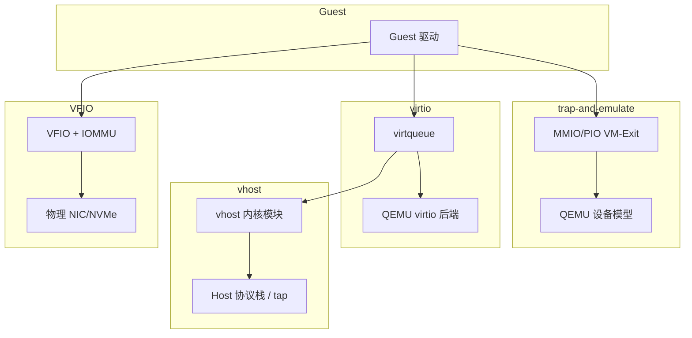
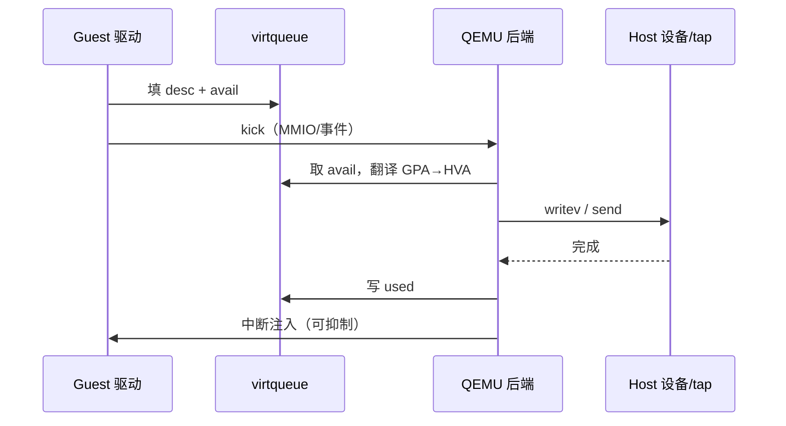
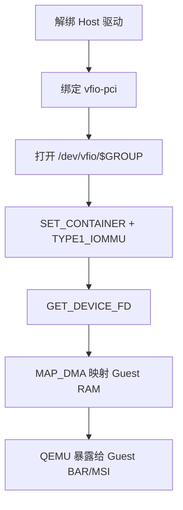

# IO 卡在模拟层？从 trap-and-emulate 到 virtio/vhost 再到 VFIO 透传讲透

网卡 `iperf` 只有几百 Mbps、磁盘延迟被 `kvm_exit` 吃掉、开了多队列仍打不满、上了 SR-IOV 却 DMA 一把挂住——这类问题很少出在「Guest 驱动会不会写」，而出在 **IO 虚拟化落在哪一层：纯模拟、virtio 前后端、vhost 内核加速、还是 VFIO/SR-IOV 透传**，以及 **DMA 地址经不经 IOMMU** 没对齐。本文从 trap-and-emulate、virtio 环与通知、vhost、VFIO 与 SR-IOV、DMA/IOMMU，到「能 ping 不能跑满 / 透传起不来 / IOMMU 组打不开」的排障，合成一条可对照内核 uapi 与 sysfs 验证的主线。

合并自 `articles/虚拟化技术/chapters/025～030`（IO 虚拟化系列）；路径对齐 Linux `drivers/vhost`、`drivers/vfio`、`drivers/virtio` 与 QEMU `hw/virtio`、`hw/vfio`（以本机/上游版本为准）。

## 阅读地图

1. **第一层：trap-and-emulate**——解决「为何访问设备寄存器会 VM-Exit、纯模拟的天花板在哪」。
2. **第二层：virtio 前后端**——解决「半虚拟化如何用 ring + 通知把 Exit 次数打下来」。
3. **第三层：vhost**——解决「为何还要把后端搬进内核、和普通 virtio 差在数据面路径」。
4. **第四层：VFIO / SR-IOV / 透传**——解决「设备如何绕过模拟直接进 Guest、和 virtio 怎么选型」。
5. **第五层：DMA 与 IOMMU**——解决「设备眼里的地址为何不是 GPA、VFIO Type1 映射在干什么」。
6. **第六层：排障闭环**——解决「慢、不稳、透传失败、IOMMU group 不可用如何分层查」。

## 源码锚点

| 路径 | 作用 |
|------|------|
| `include/uapi/linux/virtio_ring.h` | `vring_desc` / avail / used、特征位 `INDIRECT`/`EVENT_IDX` |
| `include/uapi/linux/virtio_config.h` | 设备状态机、feature 协商 |
| `include/uapi/linux/virtio_net.h` 等 | 各设备配置空间与头格式 |
| `drivers/virtio/virtio_ring.c` | Guest 侧 virtqueue 实现 |
| `drivers/virtio/virtio.c` | virtio 总线、feature 协商 |
| QEMU `hw/virtio/virtio.c` | Host 用户态后端、通知与 DMA 翻译 |
| `drivers/vhost/vhost.c` | vhost 核心：iotlb、vq 处理 |
| `drivers/vhost/vhost_net.c` | 网络 vhost 数据面 |
| `include/uapi/linux/vhost.h` | `VHOST_SET_VRING_*`、`VHOST_NET_SET_BACKEND` |
| `include/uapi/linux/vfio.h` | Group/Container/Device、`VFIO_IOMMU_MAP_DMA` |
| `drivers/vfio/vfio.c` | 容器与组生命周期 |
| `drivers/vfio/vfio_iommu_type1.c` | Type1 IOMMU DMA 映射 |
| `drivers/vfio/pci/vfio_pci_core.c` | PCI 设备透传（新内核；旧树为 `vfio_pci.c`） |
| `virt/kvm/vfio.c` | KVM 与 VFIO 协同（中断等，版本相关） |
| `drivers/iommu/` | IOMMU 驱动、DMA API 后端 |
| `Documentation/driver-api/vfio.rst` | VFIO 用户 API 与安全模型 |
| QEMU `hw/vfio/pci.c` | 透传设备挂接到虚机 |

virtio 环标志（本机 headers 可对）：

```c
/* include/uapi/linux/virtio_ring.h */
#define VRING_DESC_F_NEXT	1
#define VRING_DESC_F_WRITE	2
#define VRING_DESC_F_INDIRECT	4
#define VRING_USED_F_NO_NOTIFY	1
#define VRING_AVAIL_F_NO_INTERRUPT	1
#define VIRTIO_RING_F_INDIRECT_DESC	28
#define VIRTIO_RING_F_EVENT_IDX		29
```

VFIO DMA 映射：

```c
/* include/uapi/linux/vfio.h */
struct vfio_iommu_type1_dma_map {
	__u32	argsz;
	__u32	flags;
#define VFIO_DMA_MAP_FLAG_READ  (1 << 0)
#define VFIO_DMA_MAP_FLAG_WRITE (1 << 1)
	__u64	vaddr;	/* 进程虚拟地址 */
	__u64	iova;	/* 设备 IOVA */
	__u64	size;
};
#define VFIO_IOMMU_MAP_DMA _IO(VFIO_TYPE, VFIO_BASE + 13)
```

Group 可用性：

```c
/* include/uapi/linux/vfio.h */
#define VFIO_GROUP_FLAGS_VIABLE		(1 << 0)
#define VFIO_GROUP_GET_STATUS		_IO(VFIO_TYPE, VFIO_BASE + 3)
#define VFIO_GROUP_SET_CONTAINER	_IO(VFIO_TYPE, VFIO_BASE + 4)
#define VFIO_GROUP_GET_DEVICE_FD	_IO(VFIO_TYPE, VFIO_BASE + 6)
#define VFIO_DEVICE_GET_INFO		_IO(VFIO_TYPE, VFIO_BASE + 7)
```

## 调用链

### 四层 IO 路径总览



### virtio 一次 TX（用户态后端）



### vhost-net 数据面


### VFIO 打开设备



---

## 第一层：trap-and-emulate——纯模拟为什么慢

### 基本动作

未做半虚拟化时，Guest 驱动像在真机上访问设备：

1. `writel` / `outb` 打到 MMIO 或 PIO；
2. 该 GPA 未映射为普通 RAM，或被标成需要 Exit；
3. **VM-Exit** 进入 KVM，再把控制交给用户态 QEMU（或内核模块）；
4. QEMU 设备模型模拟寄存器副作用（响铃、排队 DMA、改状态）；
5. 必要时注入中断，再 **VM-Entry** 回去。

这就是经典的 **trap-and-emulate**：捕获敏感操作，在 Hypervisor 里仿真。

### 成本从哪里来

| 成本项 | 说明 |
|--------|------|
| Exit/Entry | 每次寄存器访问可能进出一次；老式网卡状态机极碎 |
| 用户态往返 | 许多设备模型在 QEMU，还要信号/ioctl 唤醒 |
| 数据拷贝 | 模拟 DMA 时常在 GPA 与 Host buffer 间搬 |
| 中断注入 | 每包/每完成一次中断会再打断 Guest |

所以：IDE 盘、rtl8139、e1000 在演示环境「能用」，在 10GbE / NVMe 量级负载下会先被 **Exit 密度** 打死，而不是被 Host 网卡能力打死。

### 仍然需要模拟的场景

- 启动固件、legacy 设备、调试；
- 没有对应 virtio/VFIO 驱动的特殊卡；
- 安全策略要求完全中介（监控每笔 MMIO）。

生产数据面应尽快离开这一层。

### 观测：证明慢在 Exit

```bash
sudo kvm_stat -1
# 关注 exits、mmio、io 相关计数（名称随版本）
sudo perf top -p $(pgrep -n qemu-system)
# Guest 内 iperf/fio 同时盯 Host
vmstat 1
```

若业务线程在 Guest 里跑满，但 Host 上 QEMU 单核 100% 且 `mmio` Exit 暴涨——就是模拟层天花板。

---

## 第二层：virtio——前后端如何约定「少 Exit、批量干活」

### 设计动机

半虚拟化承认「我在虚机里」，Guest 驱动按 **virtio 规范** 与 Host 对话：

- 用 **virtqueue** 批量描述 I/O 请求（散列表）；
- 用 **kick** 通知 Host「有活」；
- 用 **used 环 + 中断（可抑制）** 回收完成项。

目标：把「每个寄存器一次 Exit」变成「一批描述符一次通知」。

### 环上三个结构

1. **Descriptor table**：每项地址/长度/flags（`NEXT` 链式、`WRITE` 设备写、`INDIRECT` 间接表）。
2. **Available ring**：Guest 生产，告诉 Host 新 desc 索引。
3. **Used ring**：Host 生产，告诉 Guest 完成了哪些、写了多少字节。

特征协商决定能不能用间接描述符、event idx（更细的通知抑制）等：

```text
Guest 读 Host 提供的 feature bits
  → Guest 写 ack 子集
  → FEATURES_OK → DRIVER_OK
  → 双方按交集行为工作
```

状态机在 `virtio_config.h`；任一端未置 `FEATURES_OK` 就进业务，属于典型配置事故。

### 前后端分工

| 角色 | 典型代码 | 职责 |
|------|----------|------|
| 前端（Guest） | `drivers/virtio/*`、`virtio_net.c` 等 | 填环、kick、收中断、完成网络/块协议 |
| 传输 | PCI/MMIO/通道 | 暴露 common cfg、notify、ISR |
| 后端（Host） | QEMU `hw/virtio/*` 或 vhost | 消费 avail、真正收发、写 used、注入中断 |

「前后端」不是两个进程名，而是 **协议角色**：前端永远在 Guest，后端在 Host 侧（用户态或内核）。

### 通知与中断抑制

- Guest 设 `VRING_AVAIL_F_NO_INTERRUPT`：暂时不要打断我。
- Host 设 `VRING_USED_F_NO_NOTIFY`：暂时不要 kick。
- `EVENT_IDX`：用序号窗口决定「何时必须通知」，进一步降 Exit。

高 pps 场景下，**通知抑制是否谈成** 往往比「再加一个队列」更影响毛刺。

### 多队列

virtio-net 的 MQ：每个队列对可绑不同 vCPU，降低锁与缓存行争用。配置侧要同时满足：

1. Host 后端开启 mq；
2. Guest 驱动协商到 MQ feature；
3. 中断亲和 / XPS / RPS 与队列数匹配。

只改一端会出现「`ethtool -l` 显示 1 队列」。

### 快速验证 virtio 是否在干活

```bash
# Guest
lspci | grep -i virtio
ls /sys/bus/virtio/devices/
ethtool -i eth0          # driver: virtio_net
ethtool -l eth0          # 队列
cat /sys/devices/virtual/block/vda/queue/scheduler 2>/dev/null
# Host：QEMU 命令行是否为 virtio-net-pci / virtio-blk-pci
tr '\0' ' ' < /proc/$(pgrep -n qemu-system)/cmdline ; echo
```

---

## 第三层：vhost——把数据面推进内核

### 用户态后端的瓶颈

纯 QEMU virtio 后端路径：

```text
Guest kick → KVM → 唤醒 QEMU → 读环 → 系统调用发到 tap/socket → 写 used → irqfd
```

每个包（或每小批）可能伴随 **用户态调度与系统调用**。pps 上去后，QEMU 线程成为中心瓶颈。

### vhost 做了什么

**vhost** 在 Host 内核维护 virtqueue 的消费者：

1. QEMU 仍负责 **控制面**（设备 PCI 配置、feature、生命周期）；
2. 数据面由 `vhost_net` / `vhost_scsi` / `vhost_vsock` 等内核模块处理；
3. 通过 `eventfd`/`irqfd` 与 KVM 衔接 kick 与中断；
4. 用 vhost IOTLB 把 Guest GPA 翻译成可 DMA/可访问的 Host 地址。

结果：热路径少进用户态，延迟与 pps 通常明显好于纯 QEMU 后端。

### 与「vhost-user」的区别（易混）

| 名称 | 后端位置 | 典型场景 |
|------|----------|----------|
| **vhost**（内核） | Host kernel | 传统 libvirt + tap |
| **vhost-user** | 另一用户态进程（OVS-DPDK、SPD K 等） | 用户态交换机、DPDK 数据面 |

二者都是「QEMU 不碰每个包」，但加速落点不同。本文内核路径以 `drivers/vhost/` 为准；vhost-user 以 QEMU 字符设备协议为准。

### 配置直觉（libvirt / QEMU）

```xml
<!-- libvirt 示意：接口驱动用 vhost -->
<interface type='bridge'>
  <model type='virtio'/>
  <driver name='vhost' queues='4'/>
</interface>
```

```bash
# Host 内核模块
lsmod | grep vhost
# 队列与 fd（调试用，路径随实现）
ls /dev/vhost-net
```

若误关 vhost，同样的 `virtio-net` 前端会默默退回用户态后端——从 Guest `lspci` 看不出来，只能看 Host 线程与 pps。

### 观测对比

```bash
# 对比同负载下 QEMU 线程 CPU
pidstat -t -p $(pgrep -n qemu-system) 1
# vhost 工作线程会表现为 vhost-$pid 或类似命名（随版本）
ps -eLo pid,tid,comm | grep -E 'vhost|qemu'
# 网络
sar -n DEV 1
```

---

## 第四层：VFIO、SR-IOV 与设备透传

### 透传要解决什么

virtio/vhost 再快，仍是 **软件设备模型 + Host 协议栈**（对网卡而言）。当需要：

- 线速 25/40/100GbE；
- 网卡硬件卸载（checksum、TSO、RSS、flow）；
- GPU / FPGA / NVMe 原厂驱动；

就把 **物理 PCI 功能** 直接交给 Guest：**设备透传（passthrough）**。

### VFIO 的安全模型：Container / Group / Device

VFIO 不让用户态随便 `mmap` 任意设备，而以 **IOMMU group** 为隔离边界：

1. 同一 group 内设备共享隔离域，必须一起交给同一用户；
2. 打开 `/dev/vfio/$GROUP`，查询 `VFIO_GROUP_FLAGS_VIABLE`；
3. 绑定到 container，选定 IOMMU 类型（常见 `VFIO_TYPE1_IOMMU`）；
4. `GET_DEVICE_FD` 拿到具体设备；
5. 为 Guest RAM 做 `VFIO_IOMMU_MAP_DMA`，设备 DMA 只能打到映射过的 IOVA。

没有 IOMMU（或误用 `VFIO_NOIOMMU_IOMMU`）会失去隔离，内核会 **taint**——只应在理解风险的实验环境使用。

### 绑定步骤（思路）

```bash
# 1. 确认 IOMMU 已开（内核参数 intel_iommu=on / amd_iommu=on 等，以平台为准）
dmesg | grep -i iommu
find /sys/kernel/iommu_groups -type l | head
# 2. 查设备所在 group
readlink -f /sys/bus/pci/devices/0000:01:00.0/iommu_group
# 3. 解绑原驱动，绑定 vfio-pci（示例；生产常用厂商 ID 自动规则）
echo 0000:01:00.0 | sudo tee /sys/bus/pci/devices/0000:01:00.0/driver/unbind
echo vfio-pci | sudo tee /sys/bus/pci/devices/0000:01:00.0/driver_override
echo 0000:01:00.0 | sudo tee /sys/bus/pci/drivers/vfio-pci/bind
# 4. QEMU / libvirt 挂 hostdev
```

libvirt `<hostdev mode='subsystem' type='pci' managed='yes'>` 可托管绑定/解绑。

### SR-IOV：一卡多 VF

**SR-IOV** 让 PF（Physical Function）枚举出多个 VF（Virtual Function）：

- 每个 VF 是独立 PCI 功能，可分别透传给不同虚机；
- PF 仍留在 Host 做管理/切换；
- Guest 跑厂商 VF 驱动，数据面走硬件队列。

```bash
# 开启 VF 数量（设备与驱动需支持）
cat /sys/bus/pci/devices/0000:01:00.0/sriov_numvfs
echo 4 | sudo tee /sys/bus/pci/devices/0000:01:00.0/sriov_numvfs
lspci | grep -i virtual
```

注意：VF 与 PF 的 IOMMU group 布局因平台/ACS 桥而异；**group 不可拆** 时，可能无法单独把某个 VF 安全交给 Guest——这是透传失败的高频根因。

### virtio vs VFIO 选型

| 维度 | virtio / vhost | VFIO / SR-IOV |
|------|----------------|---------------|
| 性能上限 | 高（软件） | 通常更高（硬件） |
| 热迁移 | 成熟 | 难（设备状态/页映射） |
| 驱动 | 通用 virtio | 厂商驱动进 Guest |
| 密度 | 易超配 | VF 数量/group 受限 |
| 运维 | 统一模型 | 绑定、固件、ACS、IOMMU |
| 安全隔离 | Hypervisor 中介 | 依赖 IOMMU |

多数云主机网卡/磁盘默认 virtio；HPC、NFV、GPU 实例走透传。

---

## 第五层：DMA 与 IOMMU——设备看见的地址

### 设备不会说「Guest 虚拟地址」

DMA 引擎吃的是 **总线地址 / IOVA**：

- 无 IOMMU：常接近 Host 物理地址（仍受平台约束）；
- 有 IOMMU：驱动通过 DMA API 得到 IOVA，IOMMU 页表翻到 HPA。

虚拟化下还有一层：Guest 驱动以为自己在做「物理地址 DMA」，对透传设备而言，这些地址是 **Guest GPA（或 Guest 看到的物理）**，必须经 IOMMU（VFIO Type1）映射到真实 HPA。

### virtio 后端如何搬数据

用户态/vhost 后端不会让网卡直接扫 Guest 页表，而是：

1. 从 desc 读出 Guest 缓冲区 GPA；
2. 经 KVM/vhost IOTLB 译成 HVA/HPA；
3. 用 `copy` 或 `get_user_pages` 式访问，再交给 tap/socket/块层。

映射失效（热迁移、气球、换页）会导致 IOTLB miss，路径上回退更新——表现为偶发延迟尖刺。

### VFIO Type1 映射在做什么

`VFIO_IOMMU_MAP_DMA` 把 **QEMU 进程 vaddr** 区间映射到设备 **iova** 区间。QEMU 通常按 Guest RAM 布局建立这些映射，使 Guest 驱动填的「物理地址」在 IOMMU 下落到正确页。

未映射就让设备 DMA → IOMMU fault → 主机日志里的 DMAR/IO page fault；轻则丢包，重则设备复位。

```bash
# Intel VT-d 故障痕迹（示例）
dmesg -T | grep -iE 'DMAR|FAULT|iommu'
# 组与设备
ls -l /sys/kernel/iommu_groups/*/devices/
```

### ACS 与 group 过大

PCIe ACS（Access Control Services）影响「哪些设备必须同一 IOMMU group」。桥上 ACS 弱时，整棵下游树进一个 group，导致：

- 无法只透传其中一张卡；
- 或必须把同组所有设备从 Host 解绑。

这是平台固件/拓扑问题，不是 Guest 驱动写错。处理方向：换槽位、固件选项、内核 ACS 相关参数（有安全含义，需评估）、只透传整组。

### 中断：MSI-X 与 irqfd

透传设备的 MSI/MSI-X 经 VFIO 配置，再由 KVM **irqfd** 注入 vCPU，避免每次中断都绕用户态慢路径。virtio 同样广泛使用 irqfd。排障时「有吞吐无中断」要查：

- Guest 是否启用 MSI-X；
- Host `vfio` / `kvm` 中断路由；
- 亲和性是否集中到单 vCPU。

---

## 第六层：排障——慢、透传失败、DMA 故障

### 现象 A：virtio 网卡只有百兆级，CPU 却很高

分层：

1. Guest 是否真是 `virtio_net`？（不是 e1000 残留）
2. Host 是否 vhost？（QEMU 线程是否包办收发）
3. 队列数是否为 1？
4. offload 是否被关（`ethtool -k`）？
5. 有无频繁中断（`/proc/interrupts`）？

```bash
# Guest
ethtool -i eth0
ethtool -k eth0 | head
ethtool -l eth0
grep virtio /proc/interrupts | head
# Host
lsmod | grep vhost_net
pidstat -t -p $(pgrep -n qemu-system) 1 5
sudo kvm_stat -1
```

动作方向：换 virtio 型号、开 vhost、加队列、开 checksum/TSO、合并中断（`ethtool -C`）、检查 bridge/ovs 是否成瓶颈。

### 现象 B：块设备延迟长尾，`kvm_stat` 显示大量 mmio

- 仍在用 ide/sata 模拟？改为 virtio-blk 或 virtio-scsi；
- 是否每次完成都中断风暴？查队列深度与通知抑制；
- 后端是文件 + 缓存模式不当？对照 `cache=none/writeback` 与 `aio`/`io_uring`（以 QEMU 版本文档为准）；
- Host 盘本身慢：先在 Host 用 `fio` 定界。

### 现象 C：VFIO 设备加不进虚机

```bash
# viable?
# 用户态可用 vfio-rs / 自写 ioctl；或看 libvirt 日志
sudo virsh start <domain>
sudo journalctl -u libvirtd -e | tail -50
# group 内是否还有 Host 驱动占用的兄弟设备
ls /sys/kernel/iommu_groups/$GID/devices/
for d in /sys/kernel/iommu_groups/$GID/devices/*; do
  basename "$d"; basename "$(readlink -f $d/driver)" 2>/dev/null
done
```

常见根因：

| 根因 | 处理 |
|------|------|
| IOMMU 未开 | 内核参数 + BIOS VT-d/AMD-Vi |
| group 不 viable | 解绑同组所有设备 |
| 未绑定 vfio-pci | driver_override / udev |
| ACS 导致 group 过大 | 换拓扑或接受整组透传 |
| 设备重置失败 | 固件/FLR 问题，看 dmesg |

### 现象 D：透传后第一次 DMA 就 DMAR fault

```bash
dmesg -T | grep -iE 'DMAR|fault|vfio'
```

方向：

1. QEMU 是否完整映射 Guest RAM；
2. Guest 是否开了不兼容的大页/内存热插，导致映射空洞；
3. 设备是否要求一致缓存属性；
4. 热迁移/气球与透传同机时的已知限制（多数环境 **透传与热迁移互斥**）。

### 现象 E：SR-IOV VF 在 Guest 里 link down

```bash
# Host
ip link show
cat /sys/bus/pci/devices/<PF>/sriov_numvfs
# 物理口、VF 信任、VLAN、macvtap 与交换机配置
# Guest
ip link ; dmesg | tail
```

根因常在 **PF 侧 switchdev/macvlan/VLAN 策略** 或交换机端口模式，而不是 VFIO 本身。按厂商文档查 `ip link set <pf> vf <n> ...`。

### 现象 F：能 ssh 不能跑满——软中断与亲和

```bash
# Guest
mpstat -P ALL 1
cat /proc/interrupts
# 把队列 IRQ 分散到多 vCPU；多队列 XPS
```

单队列 + 单 vCPU 软中断吃满时，表现为「延迟尚可、带宽上不去」。

### 一条对比实验（实验机）

```bash
# 同 Host、同 Guest 内核，三轮 iperf3：
# 1) e1000 模拟
# 2) virtio + 用户态后端（关 vhost）
# 3) virtio + vhost（或再加 SR-IOV VF）
# 每轮记录：带宽、QEMU CPU、kvm exits、Guest softirq
```

数字落差会直接告诉你：瓶颈在模拟、在用户态后端，还是已经该上透传。

---

## 重点知识串线

1. **trap-and-emulate**：敏感 IO 一律 Exit；适合遗留设备，不适合高速数据面。
2. **virtio**：前后端用 ring 批量提交；feature 协商与通知抑制决定 Exit 密度。
3. **vhost**：控制面留 QEMU，数据面进内核；与 vhost-user 落点不同。
4. **VFIO**：以 IOMMU group 为边界把 PCI 功能交给用户态/Guest；Type1 映射管 DMA。
5. **SR-IOV**：PF 拆 VF 做高密度透传；受 group/ACS/交换机策略约束。
6. **DMA/IOMMU**：设备只认 IOVA；映射空洞 → DMAR fault；透传与热迁移难兼得。
7. **排障顺序**：先确认设备模型层（e1000/virtio/vfio）→ 再看 vhost/队列/offload → 最后才 IOMMU/ACS。

源码阅读顺序建议：`virtio_ring.h` → Guest `virtio_ring.c` → QEMU virtio 后端 → `vhost.c`/`vhost_net.c` → `vfio.h` + `Documentation/driver-api/vfio.rst` → `vfio_iommu_type1.c` → 平台 IOMMU 故障日志。

---

> 合并源：`articles/虚拟化技术/chapters/025～030`（IO 虚拟化：概念 / 机制 / 关键技术 / 源码 / 配置 / 排障）  
> 成稿：`articles/csdn-merged/虚拟化技术-IO虚拟化virtio与VFIO完整篇.md`
