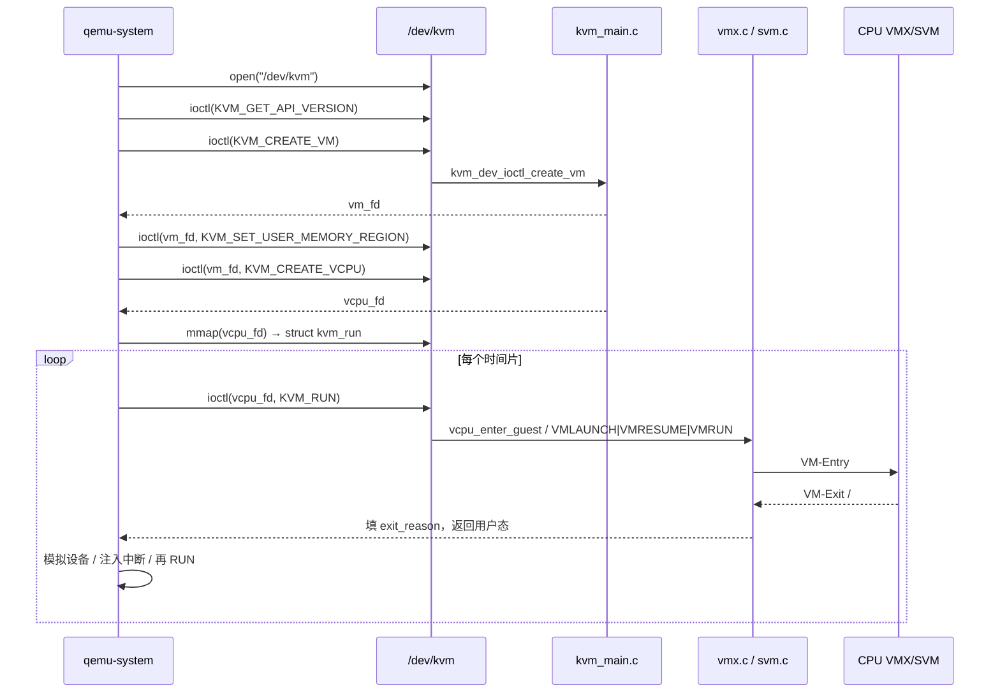
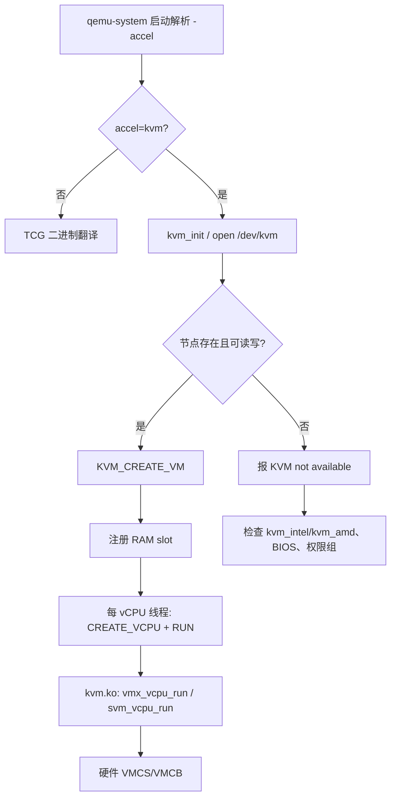

# qemu 报 KVM not available？从 /dev/kvm ioctl 到 qemu-system 一条线讲透

本机装了 `qemu-system-x86_64`，一跑就提示 `KVM not available` 或 `Could not access KVM kernel module`；云主机里再开嵌套 VM，`/dev/kvm` 存在但 `qemu -accel kvm` 直接退出；`lsmod | grep kvm` 有模块，`dmesg` 却刷 `disabled by BIOS`——这类问题几乎都不在 Guest 镜像本身，而在 **用户态打开 `/dev/kvm` → ioctl 建 VM/vCPU → kvm.ko 走到 VMX/SVM → qemu-system 加速器绑定** 这条链断在某一环。本文沿一条主线：设备节点与能力探测 → `KVM_CREATE_VM`/`KVM_CREATE_VCPU` → Intel VMCS / AMD VMCB → QEMU 与 kvm.ko 协作 → `qemu-system` 实操与嵌套/加速器排障。源路径对齐 Linux `virt/kvm/`、`arch/x86/kvm/` 与 QEMU `accel/kvm/`，读完能对照本机 `ioctl`、`dmesg`、`perf kvm` 动手验证。

## 阅读地图

1. **第一层：角色与设备面**——解决「KVM 到底是谁、为何是字符设备、`/dev/kvm` 与 qemu 进程的关系」。
2. **第二层：ioctl 建 VM/vCPU**——解决「从 `open("/dev/kvm")` 到 `KVM_RUN` 的固定顺序、每个 fd 代表什么」。
3. **第三层：硬件控制块 VMCS/VMCB**——解决「Intel/AMD 各自用什么结构保存 Guest 状态、为何要进内核」。
4. **第四层：QEMU + kvm.ko 协作**——解决「用户态模拟设备、内核跑 Guest、退出原因如何回用户态」。
5. **第五层：qemu-system 配置与观测**——解决「加速器选择、权限、模块加载、统计接口」。
6. **第六层：排障**——解决「加速器未开、嵌套虚拟化、CPU 特性位、权限与 cgroup」。

## 源码锚点

| 路径 | 作用 |
|------|------|
| `include/uapi/linux/kvm.h` | `KVM_*` ioctl 号、`struct kvm_run`、能力位 |
| `virt/kvm/kvm_main.c` | `/dev/kvm` 注册、`kvm_dev_ioctl`/`kvm_vm_ioctl`/`kvm_vcpu_ioctl` |
| `virt/kvm/kvm.h` | `struct kvm`、`struct kvm_vcpu` 核心对象 |
| `arch/x86/kvm/x86.c` | x86 公共路径、`kvm_arch_vcpu_ioctl_run`、MSR/CR 仿真入口 |
| `arch/x86/kvm/vmx/vmx.c` | Intel VT-x：VMCS、VM-Entry/Exit 处理 |
| `arch/x86/kvm/svm/svm.c` | AMD-V：VMCB、#VMEXIT 处理 |
| `arch/x86/include/asm/kvm_host.h` | `kvm_x86_ops` 架构回调表声明 |
| `arch/x86/kvm/kvm_onhyperv.c` 等 | 特殊宿主环境扩展（按需） |
| `Documentation/virt/kvm/api.rst` | 用户态 API 权威说明 |
| QEMU `accel/kvm/kvm-all.c` | 打开 `/dev/kvm`、创建 VM、注册内存、vCPU 线程 |
| QEMU `target/i386/kvm/kvm.c` | x86 特有 KVM 初始化、CPUID、MSR |
| QEMU `include/sysemu/kvm.h` / `system/kvm.h` | `kvm_enabled()` 等加速器探测 |
| QEMU `softmmu/vl.c` 或 `system/vl.c` | `-accel`/`-machine` 解析与机器初始化 |

`include/uapi/linux/kvm.h` 中与建机直接相关的 ioctl（版本间数值可能调整，以本机头文件为准）：

```c
/* include/uapi/linux/kvm.h — 逻辑摘录 */
#define KVMIO 0xAE

#define KVM_GET_API_VERSION       _IO(KVMIO,   0x00)
#define KVM_CREATE_VM             _IO(KVMIO,   0x01)  /* 返回 VM fd */
#define KVM_CHECK_EXTENSION       _IO(KVMIO,   0x03)
#define KVM_GET_VCPU_MMAP_SIZE    _IO(KVMIO,   0x04)
#define KVM_CREATE_VCPU           _IO(KVMIO,   0x41)  /* 在 VM fd 上 */
#define KVM_RUN                   _IO(KVMIO,   0x80)  /* 在 vCPU fd 上 */
#define KVM_GET_REGS              _IOR(KVMIO,  0x81, struct kvm_regs)
#define KVM_SET_REGS              _IOW(KVMIO,  0x82, struct kvm_regs)
#define KVM_SET_USER_MEMORY_REGION _IOW(KVMIO, 0x46, struct kvm_userspace_memory_region)
```

`virt/kvm/kvm_main.c` 里设备侧分发骨架（逻辑与主线内核一致）：

```c
/* virt/kvm/kvm_main.c — 概念摘要 */
static long kvm_dev_ioctl(struct file *filp, unsigned int ioctl, unsigned long arg)
{
    switch (ioctl) {
    case KVM_GET_API_VERSION:
        return KVM_API_VERSION;
    case KVM_CREATE_VM:
        return kvm_dev_ioctl_create_vm(arg);
    case KVM_CHECK_EXTENSION:
        return kvm_vm_ioctl_check_extension_generic(NULL, arg);
    case KVM_GET_VCPU_MMAP_SIZE:
        return PAGE_SIZE; /* 实际含 pio/mmio 页，以源码为准 */
    default:
        return kvm_arch_dev_ioctl(filp, ioctl, arg);
    }
}
```

`struct kvm_run` 是用户态与内核共享的「退出原因信封」，QEMU 每个 vCPU 线程 `mmap` 一份：

```c
/* include/uapi/linux/kvm.h — 字段语义摘要 */
struct kvm_run {
    __u8  request_interrupt_window;
    __u8  immediate_exit;
    __u32 exit_reason;          /* KVM_EXIT_IO / MMIO / HLT / ... */
    __u64 cr8;
    __u64 apic_base;
    union {
        struct { __u8 direction; __u8 size; __u16 port; ... } io;
        struct { __u64 phys_addr; __u8  data[8]; ... } mmio;
        /* ... */
    };
};
```

## 调用链

### 用户态建机到第一次进入 Guest



### QEMU 加速器绑定与模块侧



---

## 第一层：角色与设备面——KVM 是什么、谁打开 `/dev/kvm`

### 1.1 职责切分：内核加速器 + 用户态 VMM

KVM（Kernel-based Virtual Machine）在 Linux 里的定位是：**内核提供 CPU/内存虚拟化加速与少量共享设施，用户态 VMM（通常是 QEMU）负责设备模型、启动固件、磁盘/网卡仿真、管理接口**。没有 QEMU（或其它 VMM）时，单独加载 `kvm.ko` 不会「出现一台虚拟机」；没有 `kvm.ko` 时，QEMU 仍可用 TCG 跑，但性能差一个数量级以上。

常见误解对照：

| 误解 | 实际 |
|------|------|
| KVM 是完整 Hypervisor 产品 | 是内核模块 + API；产品形态是 QEMU/KVM、libvirt 等 |
| `/dev/kvm` 代表一台 VM | 它是「工厂」；每台 VM 是一次 `KVM_CREATE_VM` 得到的 fd |
| 关 QEMU 进程 VM 仍在内核常驻 | 进程退出关闭 fd 后，对应 `struct kvm` 被释放 |

### 1.2 字符设备如何出现

模块加载后，`kvm_main.c` 注册 misc/char 设备，节点一般为 `/dev/kvm`。可验证：

```bash
ls -l /dev/kvm
# crw-rw---- 1 root kvm 10, 232 ... /dev/kvm

lsmod | egrep 'kvm($|_intel|_amd)'
# kvm_intel / kvm_amd 与 kvm 的依赖关系

grep -E 'vmx|svm' /proc/cpuinfo | head
# Intel 看 vmx，AMD 看 svm
```

内核侧能力还受 BIOS/UEFI 虚拟化开关、`nokvm` 启动参数、云厂商禁用等影响。`dmesg` 常见：

```text
kvm: disabled by BIOS
kvm_intel: VMX not supported
kvm: already loaded the other module
```

### 1.3 权限模型

多数发行版把 `/dev/kvm` 交给 `kvm` 组。当前用户不在组内时，QEMU 非 root 会失败：

```bash
id
# 应含 kvm 或用 sudo / polkit

getfacl /dev/kvm 2>/dev/null
# 或看 udev 规则 /lib/udev/rules.d/*kvm*
```

容器内使用宿主机 KVM 还需设备透传（`--device /dev/kvm`）与 seccomp 放行相应 ioctl，这是另一类「节点在、ioctl 失败」场景。

### 1.4 API 版本与扩展探测

任何正经 VMM 都会先做：

```c
fd = open("/dev/kvm", O_RDWR | O_CLOEXEC);
api = ioctl(fd, KVM_GET_API_VERSION, 0);
if (api != KVM_API_VERSION) /* 拒绝不匹配的内核 */
    ...
ioctl(fd, KVM_CHECK_EXTENSION, KVM_CAP_USER_MEMORY);
ioctl(fd, KVM_CHECK_EXTENSION, KVM_CAP_NR_VCPUS);
```

QEMU 在 `accel/kvm/kvm-all.c` 的初始化路径里封装了同一逻辑；失败时日志里会出现 `Could not initialize KVM` 一类信息。

---

## 第二层：ioctl 建 VM/vCPU——从 open 到 KVM_RUN

### 2.1 三层 fd 模型

KVM 用户 API 故意做成三层文件描述符，生命周期清晰：

| fd | 创建方式 | 代表对象 | 典型 ioctl |
|----|---------|----------|------------|
| system fd | `open("/dev/kvm")` | 本机 KVM 能力 | `GET_API_VERSION`、`CREATE_VM`、`CHECK_EXTENSION` |
| vm fd | `KVM_CREATE_VM` | 一台虚拟机 | 内存槽、IRQ、`CREATE_VCPU`、时钟 |
| vcpu fd | `KVM_CREATE_VCPU` | 一个虚拟 CPU | `KVM_RUN`、寄存器、MPSTATE |

对应内核对象大致是：`struct kvm`（VM）、`struct kvm_vcpu`（vCPU）。一个 VM 多个 vCPU；每个 vCPU 通常由 QEMU 里一条线程独占，循环调用 `KVM_RUN`。

### 2.2 创建 VM

`kvm_dev_ioctl_create_vm()` 会：

1. 分配 `struct kvm`；
2. 调用架构相关 `kvm_arch_init_vm()`（x86 上初始化 MMU、IRQ chip 相关状态等）；
3. 创建一个 anon inode，把文件操作换成 `kvm_vm_fops`；
4. 把 fd 返回用户态。

`arg` 历史上可区分机器类型（如部分架构的 `KVM_VM_TYPE_*`）；x86 上常见传 `0`。以平台与头文件为准。

### 2.3 注册 Guest 物理内存

用户态不会把整段匿名内存「交给内核拷贝」，而是用 **slot**：告诉内核「GPA 区间映射到当前进程的 HVA」。

```c
struct kvm_userspace_memory_region region = {
    .slot = 0,
    .flags = 0,
    .guest_phys_addr = 0,
    .memory_size = ram_size,
    .userspace_addr = (unsigned long)host_ram_ptr,
};
ioctl(vm_fd, KVM_SET_USER_MEMORY_REGION, &region);
```

之后 Guest 访存缺页、EPT/NPT violation，由 KVM MMU 在内核处理；真正模拟 MMIO 的「洞」往往不进 slot，或走 `KVM_EXIT_MMIO` 回 QEMU。

### 2.4 创建 vCPU 与 mmap kvm_run

```c
vcpu_fd = ioctl(vm_fd, KVM_CREATE_VCPU, vcpu_id);
mmap_size = ioctl(sys_fd, KVM_GET_VCPU_MMAP_SIZE, 0);
run = mmap(NULL, mmap_size, PROT_READ|PROT_WRITE, MAP_SHARED, vcpu_fd, 0);
```

`vcpu_id` 在同一 VM 内唯一。`kvm_run` 页是 **共享映射**：内核写 `exit_reason` 与 union 细节，用户态读后仿真，再清请求位后再次 `KVM_RUN`。

### 2.5 KVM_RUN 循环（用户态视角）

```c
for (;;) {
    ret = ioctl(vcpu_fd, KVM_RUN, 0);
    if (ret < 0) { /* EINTR / EAGAIN 等 */ continue; }
    switch (run->exit_reason) {
    case KVM_EXIT_IO:
        /* 按 port/direction/size 模拟 PIO，如串口 */
        break;
    case KVM_EXIT_MMIO:
        /* 模拟 MMIO 设备读写 */
        break;
    case KVM_EXIT_HLT:
        /* 可阻塞到中断或超时 */
        break;
    case KVM_EXIT_IRQ_WINDOW_OPEN:
        /* 可注入中断的窗口 */
        break;
    case KVM_EXIT_SHUTDOWN:
    case KVM_EXIT_SYSTEM_EVENT:
        /* 关机/复位事件 */
        goto out;
    default:
        /* 未处理则可能是 bug 或需升级 QEMU */
        break;
    }
}
```

这就是 QEMU 主循环在加速模式下的本质：多数指令在 Guest 模式硬件直接执行；只有被拦截的事件回到用户态。

### 2.6 源码级：vcpu ioctl 入口

`kvm_main.c` 中 `kvm_vcpu_ioctl()` 对 `KVM_RUN` 最终进入 `kvm_arch_vcpu_ioctl_run()`（x86 在 `arch/x86/kvm/x86.c`），再调 `kvm_x86_ops.vcpu_run` 指向的 `vmx_vcpu_run` 或 `svm_vcpu_run`。用户态不必自己操作 VMCS；所有硬件控制块进出都封装在内核。

---

## 第三层：VMCS / VMCB——硬件为何需要控制块

### 3.1 Intel VT-x：VMCS

Intel 用 **VMCS（Virtual Machine Control Structure）** 保存：

- Guest 状态（通用寄存器、段、控制寄存器、RIP/RFLAGS 等）；
- Host 状态（退出后恢复到的内核上下文）；
- 控制字段（哪些事件导致 VM-Exit、中断虚拟化、EPT 指针等）；
- VM-Exit 信息（原因码、资格字段 qualification）。

每个 vCPU 对应至少一份活动 VMCS；`VMPTRLD`/`VMLAUNCH`/`VMRESUME`/`VMREAD`/`VMWRITE` 是硬件指令。Linux 在 `arch/x86/kvm/vmx/vmx.c` 里维护软件缓存与脏位，避免每次全量写。

### 3.2 AMD-V：VMCB

AMD 用 **VMCB（Virtual Machine Control Block）**，由 `VMRUN` 加载。字段布局与 Intel 不同，但职责同类：拦截位图、Guest 状态、Exit code、嵌套页表（NPT）指针等。实现主文件是 `arch/x86/kvm/svm/svm.c`。

### 3.3 为何用户态碰不到这些结构

安全与正确性：VMCS/VMCB 含 Host 内核状态与控制敏感位。若放用户态，恶意 VMM 可破坏 Host。因此设计是：

- 用户态只见 `kvm_run` 与寄存器 ioctl；
- 内核根据策略配置拦截；
- 硬件 Exit 后内核翻译成稳定的 `KVM_EXIT_*`。

跨厂商差异被 `kvm_x86_ops` 抹平，QEMU 同一套 ioctl 即可。

### 3.4 与「纯软件模拟」的边界

| 项目 | 硬件辅助（KVM） | 纯软件（TCG 等） |
|------|-----------------|------------------|
| 普通指令 | Guest 模式原生执行 | 翻译成 Host 代码 |
| 敏感指令/事件 | 配置拦截 → Exit | 翻译器插入检查 |
| 控制块 | VMCS/VMCB | 无 |
| 典型吞吐 | 接近裸机（视退出率） | 显著更慢 |

退出率（exits/sec）是性能第一指标：设备模型越「吵」（频繁 PIO/MMIO），越依赖 virtio 等半虚拟化降低 Exit。

---

## 第四层：QEMU + kvm.ko——谁模拟设备、谁跑 CPU

### 4.1 QEMU 侧初始化主路径

概念顺序（文件名随 QEMU 大版本可能调整，以树内符号为准）：

1. 解析 `-accel kvm` / `-enable-kvm`；
2. `kvm_init()`（`accel/kvm/kvm-all.c`）：`open`、`CREATE_VM`、检查扩展；
3. 机器内存后端准备好 HVA 后，`kvm_set_user_memory_region` 注册 slot；
4. 为每个 vCPU 创建线程，线程内 `kvm_cpu_exec` → `kvm_vcpu_ioctl(KVM_RUN)`；
5. 按 `exit_reason` 调设备仿真（`address_space_rw`、PortIO 等），再回去。

x86 特有逻辑在 `target/i386/kvm/kvm.c`：同步 CPUID、MSR、XSAVE、APIC 等，使 Guest 看到的处理器像「真 CPU + 受控特性集」。

### 4.2 内核侧一次 RUN 的内部步骤（概念）

```text
KVM_RUN
  → 检查请求（复位、时钟、MMU reload…）
  → 注入待处理中断/NMI（若窗口允许）
  → 关抢占、切到 Guest 模式准备
  → vmx_vcpu_run / svm_vcpu_run
       → VM-Entry
       → Guest 执行……
       → VM-Exit
  → 根据 exit reason 走 handle_* 
       → 能在内核解决（如部分 EPT miss、LAPIC）则可能再 Entry
       → 否则填 kvm_run，返回用户态
```

「能在内核解决就不回用户态」是性能关键：APIC 时钟、部分页错误、halt polling 等优化都围绕减少用户态往返。

### 4.3 IRQ chip：内核 irqchip 与用户态 irqchip

- **内核 irqchip**（常见）：`KVM_CREATE_IRQCHIP` 后 PIC/IOAPIC/LAPIC 多在内核；中断注入路径短。
- **用户态 irqchip** / split：部分中断控制器逻辑在 QEMU，利于迁移与新特性，但路径更长。

libvirt XML 里 `irqchip` 相关选项最终会落到 QEMU 机器属性与 KVM ioctl 组合。排障时要分清「中断没到 Guest」是路由配置问题还是 Exit 处理问题。

### 4.4 设备退出的两类代表

**PIO 串口**：Guest 写 `out %al, $0x3f8` → 拦截 → `KVM_EXIT_IO` → QEMU 字符设备后端写到 pty/stdio。

**MMIO virtio**：现代场景尽量走 **eventfd + ioeventfd / irqfd**，把门铃从「Exit 回用户态」缩短为内核直接踢 eventfd，进一步降延迟。相关能力：`KVM_CAP_IOEVENTFD`、`KVM_CAP_IRQFD`。

### 4.5 与 libvirt 的关系

libvirt 不替代 KVM API，它生成 QEMU 命令行/QMP，并管生命周期、cgroup、SELinux/AppArmor 标签。排障「virsh start 失败」时仍应落到：宿主机 `/dev/kvm`、QEMU 日志、`qemu-system` 实际 accel 参数。

---

## 第五层：qemu-system 配置与观测

### 5.1 最小可跑命令

```bash
# 确认加速器
qemu-system-x86_64 -accel help
# 应列出 kvm

# 最小冒烟（按本机镜像路径改）
qemu-system-x86_64 \
  -accel kvm \
  -cpu host \
  -m 2048 \
  -smp 2 \
  -drive file=disk.qcow2,if=virtio \
  -netdev user,id=n0 -device virtio-net-pci,netdev=n0 \
  -nographic
```

对比无加速：

```bash
qemu-system-x86_64 -accel tcg -cpu qemu64 -m 1024 ...
```

同负载下 `top`/`perf` 差异非常明显。

### 5.2 模块与固件开关

```bash
# Intel
sudo modprobe kvm
sudo modprobe kvm_intel

# AMD
sudo modprobe kvm
sudo modprobe kvm_amd

# 持久化示例（发行版路径可能不同）
echo 'options kvm_intel nested=1' | sudo tee /etc/modprobe.d/kvm_intel.conf
```

BIOS/UEFI：启用 **Intel VT-x / AMD-V**，服务器还需注意「VT-d」与「SVM Mode」分开；嵌套场景还要开 nested 参数（下一层）。

### 5.3 观测接口

```bash
# 能力
cat /sys/module/kvm_intel/parameters/nested
cat /sys/module/kvm/parameters/*

# debugfs（需挂载 debugfs，路径随内核略有差异）
sudo mount -t debugfs none /sys/kernel/debug
ls /sys/kernel/debug/kvm/

# 进程侧
ps -ef | grep qemu-system
sudo perf kvm stat -p $(pidof qemu-system-x86_64)

# tracepoints（示例）
sudo bpftrace -e 'tracepoint:kvm:kvm_exit { @[args->exit_reason] = count(); }'
```

`/proc/<pid>/fd` 里能看到打开的 anon_inode:kvm-vcpu、kvm-vm，便于确认进程确实连上了 KVM。

### 5.4 CPU 模型

| 选项 | 含义 | 注意 |
|------|------|------|
| `-cpu host` | 尽量暴露宿主机特性 | 迁移兼容性差 |
| `-cpu Haswell` 等命名模型 | 固定特性集 | 利于迁移 |
| `-cpu host,migratable=on` | 折中（QEMU 版本相关） | 以本机 QEMU 文档为准 |

嵌套虚拟化时，Guest 要再跑 KVM，通常需要把 `vmx`/`svm` 暴露进一级 Guest（见排障层）。

### 5.5 与 cgroup / 大页

生产常配：

- cpuset / cpu 配额避免 vCPU 过度超卖；
- `hugetlbfs` 或 THP 策略影响 EPT 覆盖与 TLB 行为；
- `mlock` / `vhost` 线程优先级。

这些不改变 ioctl 主链，但会改变「看起来像 KVM 慢」的体感；应用 `perf kvm` 区分「Exit 多」还是「调度饿死」。

---

## 第六层：排障——加速器未开、嵌套、权限

### 6.1 现象：`KVM not available` / 无法打开 `/dev/kvm`

分层排查：

```bash
# 1) 硬件与 CPU 标志
grep -E 'vmx|svm' /proc/cpuinfo || echo 'CPU/BIOS 未提供虚拟化标志'

# 2) 模块
lsmod | grep kvm
dmesg | grep -iE 'kvm|vmx|svm' | tail -50

# 3) 节点与权限
ls -l /dev/kvm
groups

# 4) QEMU 探测
qemu-system-x86_64 -accel kvm -machine none -cpu max -m 64 -nographic -serial none -monitor none -kernel /dev/null 2>&1 | head
# 更稳妥：用 -version 与 -accel help，再用真实小镜像试跑
```

常见根因：

| 现象 | 根因 | 处理方向 |
|------|------|----------|
| 无 vmx/svm | BIOS 关虚拟化 / 云主机未开 | 进固件打开；控制台开「嵌套虚拟化」类开关 |
| `disabled by BIOS` | MSR 锁死 | 改 BIOS；部分机器无解 |
| 无 `/dev/kvm` | 模块未加载或编译未开 | `modprobe`；确认 `CONFIG_KVM` |
| 有节点 Permission denied | 不在 kvm 组 | `usermod -aG kvm $USER` 后重登 |
| 容器内失败 | 未透传设备 | `--device /dev/kvm` + 权限 |

### 6.2 现象：能跑但极慢，其实落在 TCG

有人写了 `-enable-kvm` 但被机器类型/架构否掉，或误用了不带 kvm 的 wrapper。确认：

```bash
# QMP 或启动日志中搜 accel=
# 运行时：
tr '\0' '\n' < /proc/$(pidof qemu-system-x86_64)/cmdline | xargs -n1 echo
```

若 cmdline 只有 `tcg`，所有「KVM 优化」讨论都无效。

### 6.3 嵌套虚拟化（L0 宿主机 → L1 → L2）

需求：在一级虚拟机里再跑 KVM。

```bash
# L0（真机）
sudo modprobe kvm_intel nested=1
# 或 kvm_amd nested=1
cat /sys/module/kvm_intel/parameters/nested   # 应为 Y/1

# 一级 Guest 的 QEMU 需要露出虚拟化能力，例如：
# -cpu host  或  -cpu Haswell,+vmx
```

L1 内再查：

```bash
grep -E 'vmx|svm' /proc/cpuinfo
ls -l /dev/kvm
```

嵌套常见坑：

- L0 未开 nested，L1 无 vmx 标志；
- 用了旧 CPU 模型未带 `+vmx`；
- L1 内核未加载 kvm；
- 性能暴跌：嵌套 Exit 放大，需接受或把重负载放到 L0。

云厂商若关闭嵌套，控制台「嵌套虚拟化」开关比改 modprobe 更关键。

### 6.4 Exit 风暴导致「卡住/很卡」

```bash
sudo perf kvm stat live -p $(pidof qemu-system-x86_64)
# 或
sudo cat /sys/kernel/debug/kvm/*/exits
```

高 Exit 关联设备：未装 virtio 驱动仍用 IDE/e1000；或 Guest 狂打 PIT。治理方向：换 virtio、开 ioeventfd、检查时钟源（`kvm-clock`）。

### 6.5 迁移与 CPU 特性不一致

冷迁移失败、蓝屏、illegal instruction，多因源宿主机暴露的 CPUID 在目的机不存在。固定 CPU 模型或使用 migration 兼容特性集；这与 ioctl 主链正交，但是生产最常见「KVM 相关」工单之一。

### 6.6 SELinux / AppArmor

```bash
# 示例
ausearch -m AVC -ts recent | grep qemu
aa-status | grep qemu
```

权限模块拒绝 `open /dev/kvm` 时，用户态错误常被包装成笼统的「KVM not available」，需看审计日志。

### 6.7 最小自测：不启完整 Guest 的能力检查

```bash
python3 - <<'PY'
import fcntl, os, array, struct
KVMIO=0xAE
KVM_GET_API_VERSION = 0x00  # _IO 无参时用 fcntl 需构造；建议直接用现成工具
print("prefer: use kvm-ok or qemu -accel help")
PY

# Debian/Ubuntu
kvm-ok 2>/dev/null || true

# 通用
test -r /dev/kvm && test -w /dev/kvm && echo 'rw ok' || echo 'rw fail'
```

发行版 `kvm-ok` 会综合 CPU 标志与设备节点给结论，适合一线快速分流。

---

## 重点知识串线

把全文压成一条可记忆的链：

```text
BIOS 打开 VT-x/AMD-V
  → 加载 kvm + kvm_intel/kvm_amd
  → /dev/kvm 对用户可读写
  → qemu -accel kvm
  → open → CREATE_VM → 内存 slot → CREATE_VCPU → mmap kvm_run
  → 循环 KVM_RUN
  → 硬件用 VMCS/VMCB 跑 Guest
  → Exit 回内核 → 必要时回 QEMU 模拟设备
```

任一环失败，表现都可能是「虚拟机起不来」或「慢得像仿真」。排障时 **从上到下核对**，不要先改 Guest 内核参数。

### 与源章节的对应关系

本文合并并重写自知识库 `虚拟化技术/chapters/049～054`（KVM 概念、机制、关键点、源码、配置、问题），去掉模板空话，全部落到可验证的 ioctl、内核路径与 qemu-system 行为。

### 延伸阅读（上游）

- Linux `Documentation/virt/kvm/api.rst`
- Intel SDM 卷 3：VMX 指令与 VMCS 字段（以手册为准）
- AMD APM：SVM / VMCB（以手册为准）
- QEMU 文档：KVM 加速器与 CPU 模型

### 实操备忘：一次完整人工对照

在实验机上建议固定做一遍：

1. `grep vmx /proc/cpuinfo` 与 `ls -l /dev/kvm`；
2. `strace -e ioctl,openat qemu-system-x86_64 -accel kvm ...` 截取 `CREATE_VM`/`CREATE_VCPU`/`RUN`；
3. 对照 `include/uapi/linux/kvm.h` 确认 ioctl 号；
4. `perf kvm stat` 看 Exit 分布；
5. 关掉 `-accel kvm` 换 TCG，感受数量级差异；
6. 打开 nested，进 L1 重复步骤 1。

这六步能覆盖本文 80% 的工程问题。

### 设计取舍再强调

KVM 把「跑指令」放进内核/硬件，「模拟设备」留在用户态，是有意的边界：内核不变成完整 Xen 式 dom0 设备模型，用户态又能用普通进程调试器与丰富设备生态。代价是 Exit 路径上的上下文切换；优化史就是不断把热点 Exit 留在内核或用 eventfd 短路。

理解这条边界后，读 `kvm_main.c` 与 `kvm-all.c` 不会再觉得「两个项目各写一套虚拟机」，而是 **同一 ioctl 契约的两端**。

### 版本与平台说明

- ARM/arm64 上设备仍是 `/dev/kvm`，但没有 VMCS/VMCB，而是基于异常级别与 Stage-2 页表；ioctl 集合有架构差异。本文主线是 **x86_64 + QEMU**。
- ioctl 号与 `kvm_run` 布局以运行内核的 UAPI 为准；跨内核升级 VMM 时先对 `KVM_GET_API_VERSION` 与能力位。
- 不确定的 CPU 微架构细节以 Intel SDM / AMD APM 为准，勿背第三方博客里的绝对数值。

---

## 附录 A：关键 ioctl 速查（工程向）

| ioctl | fd | 作用 |
|-------|----|------|
| `KVM_GET_API_VERSION` | sys | API 版本 |
| `KVM_CHECK_EXTENSION` | sys/vm | 能力探测 |
| `KVM_CREATE_VM` | sys | 建 VM |
| `KVM_SET_USER_MEMORY_REGION` | vm | GPA→HVA slot |
| `KVM_CREATE_VCPU` | vm | 建 vCPU |
| `KVM_SET_REGS` / `GET_REGS` | vcpu | 通用寄存器 |
| `KVM_SET_SREGS` / `GET_SREGS` | vcpu | 段与控制寄存器 |
| `KVM_RUN` | vcpu | 进入 Guest |
| `KVM_INTERRUPT` | vcpu | 注入中断（视 irqchip 模式） |
| `KVM_CREATE_IRQCHIP` | vm | 内核 irqchip |
| `KVM_SET_GSI_ROUTING` | vm | GSI 路由表 |
| `KVM_IOEVENTFD` | vm | MMIO/PIO 门铃短路 |
| `KVM_IRQFD` | vm | 事件注入短路 |

完整列表以 `Documentation/virt/kvm/api.rst` 为准。

## 附录 B：kvm_run.exit_reason 常见值

| 宏 | 典型原因 | 通常谁处理 |
|----|----------|------------|
| `KVM_EXIT_IO` | in/out 指令 | QEMU 设备 |
| `KVM_EXIT_MMIO` | MMIO 访问 | QEMU 设备 |
| `KVM_EXIT_HLT` | hlt | QEMU 阻塞/调度 |
| `KVM_EXIT_INTR` | 被信号打断等 | 重跑 |
| `KVM_EXIT_SHUTDOWN` | 三倍故障等 | 结束 VM |
| `KVM_EXIT_HYPERCALL` | hypercall | 视配置 |
| `KVM_EXIT_SYSTEM_EVENT` | 关机/复位/崩溃通知 | QEMU 生命周期 |
| `KVM_EXIT_INTERNAL_ERROR` | 内核内部错误 | 查 dmesg |

硬件 Exit reason（VMCS/VMCB）与 `KVM_EXIT_*` 不是一一同名；中间有内核翻译层。深入 CPU 退出原因见同系列「VT-x 与 VM-Exit」文。

## 附录 C：目录与符号速查

```text
linux/
  include/uapi/linux/kvm.h
  virt/kvm/kvm_main.c
  virt/kvm/kvm.h
  arch/x86/kvm/x86.c
  arch/x86/kvm/vmx/vmx.c
  arch/x86/kvm/svm/svm.c
  Documentation/virt/kvm/

qemu/
  accel/kvm/kvm-all.c
  target/i386/kvm/kvm.c
  include/sysemu/kvm.h   # 或 system/kvm.h，随版本
```

阅读建议：先跟一次 `KVM_CREATE_VM` 成功路径，再跟一次 `KVM_EXIT_IO` 往返，最后才进 VMCS 字段海洋。

## 附录 D：libvirt 对照（可选）

```bash
virsh capabilities | grep -A2 kvm
virsh dumpxml <domain> | grep -E 'kvm|vcpu|disk'
# qemu 日志常在 /var/log/libvirt/qemu/<name>.log
```

`/domain/devices` 再漂亮，底层仍是 qemu-system + `/dev/kvm`。能力 XML 里 `os/@type` 与 `domain type='kvm'` 仅表示意图；宿主机无 KVM 时 libvirt 可能拒绝或回落，视配置而定。

## 附录 E：安全边界一句话

能打开 `/dev/kvm` 的进程可以在机器上创建虚拟机并消耗大量 CPU/内存；生产应用用组权限、cgroup、以及（如需要）额外 LSM 约束。不要把 `/dev/kvm` 随意 chmod 666 到构建集群的每一个容器默认配置。

---

*合并源：articles/虚拟化技术/chapters/049～054；体裁：CSDN 合并长文；主线：ioctl → kvm.ko → VMCS/VMCB → qemu-system → 排障。*
