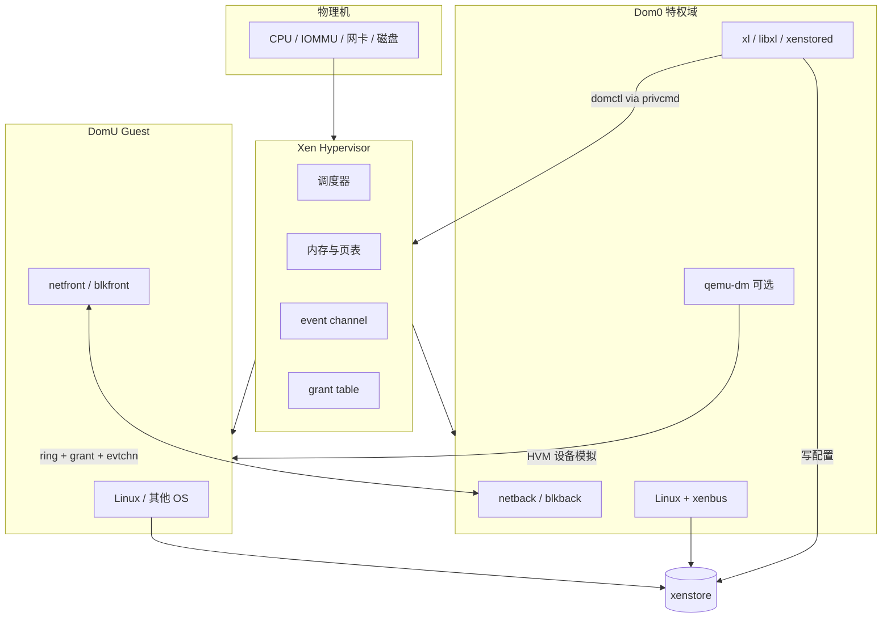
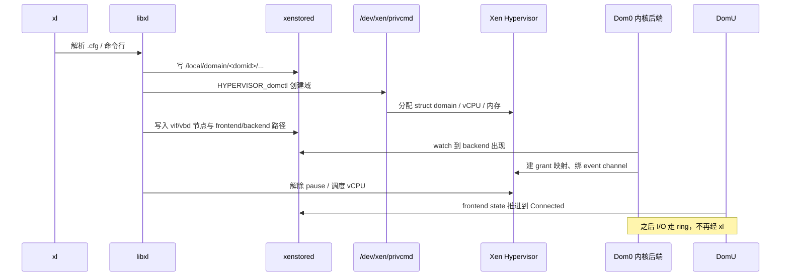

# Dom0 挂了整机就挂？Xen Hypervisor、Dom0/DomU 与 xl/xenstore 讲透

`xl list` 里 Dom0 状态变成 `-----c`、整机所有 DomU 一起失联；`xenstore-ls` 卡住、`qemu-dm` 起不来导致 HVM 黑屏；网卡后端 `vif` 在 xenstore 里 `state=4` 却永远连不上——这类故障几乎都不在 Guest 镜像本身，而出在 **Xen Hypervisor 调度域、Dom0 特权面、xenstore 配置树、xl/libxl 工具栈、event channel / grant table 半虚拟 I/O、以及 HVM 侧 qemu-dm** 这条链断在某一环。本文沿一条主线：角色与特权域 → PV/HVM/PVH → 启动链 → 工具栈 → 网络/块设备后端 → 排障观测，路径对齐 Xen 上游与 Linux `drivers/xen`、`include/xen`，读完能对照本机 `xl`、`xenstore-*`、`/proc/xen`、`dmesg` 动手验证。

合并自 `articles/虚拟化技术/chapters/057～062`（Xen 架构系列）；源码与接口以 Xen Project / Linux 内核常见布局为准（版本间目录可能微调）。

## 阅读地图

1. **第一层：Hypervisor 与域模型**——解决「Xen 是谁、Dom0 为何特殊、DomU 与 KVM 里「一个 qemu 进程」有何不同」。
2. **第二层：PV / HVM / PVH**——解决「三种 Guest 模式各自改谁、I/O 走哪条路、为何现代默认倾向 PVH」。
3. **第三层：启动链**——解决「从引导加载器到 Xen → Dom0 → toolstack → DomU 的固定顺序」。
4. **第四层：工具栈 xl / libxl / xenstore**——解决「谁写 xenstore、谁调 hypercall、`xl create` 背后发生什么」。
5. **第五层：event channel、grant table 与网块后端 / qemu-dm**——解决「半虚拟 I/O 如何跨域搬数据、HVM 设备模型落在哪」。
6. **第六层：排障**——解决「Dom0 挂死、xenstore 卡死、vif/vbd 不起、HVM 无显示怎么分层定位」。

## 源码锚点

| 路径 | 作用 |
|------|------|
| Xen `xen/common/domain.c` | 域创建/销毁、`struct domain` 生命周期 |
| Xen `xen/common/schedule.c` | Credit/Credit2 等调度器入口 |
| Xen `xen/arch/x86/domain.c` | x86 域上下文、PV/HVM 分叉 |
| Xen `xen/include/public/xen.h` | hypercall 号、`DOMID_*`、VIRQ |
| Xen `xen/include/public/grant_table.h` | grant 表操作语义 |
| Xen `xen/include/public/event_channel.h` | event channel 操作码 |
| Xen `xen/include/public/io/netif.h` | 半虚拟网卡环协议 |
| Xen `xen/include/public/io/blkif.h` | 半虚拟块设备环协议 |
| Xen `xen/include/public/hvm/hvm_op.h` | HVM 相关 hypercall |
| Xen `tools/xl/xl*.c` | `xl` 命令行前端 |
| Xen `tools/libs/light/`（libxl） | 域创建、设备热插、配置解析 |
| Xen `tools/xenstore/` | xenstored 守护进程与客户端 |
| Linux `include/xen/interface/xen.h` | Guest 可见 hypercall / VIRQ 定义 |
| Linux `include/xen/xenbus.h` | xenbus 设备与 watch |
| Linux `include/xen/grant_table.h` | 内核侧 grant API |
| Linux `include/xen/events.h` | evtchn ↔ IRQ 绑定 |
| Linux `drivers/xen/xenbus/` | xenbus 总线与状态机 |
| Linux `drivers/net/xen-netback/` | Dom0/驱动域网卡后端 |
| Linux `drivers/net/xen-netfront/` | DomU 网卡前端 |
| Linux `drivers/block/xen-blkback/` | 块后端 |
| Linux `drivers/block/xen-blkfront.c` | 块前端 |
| Linux `drivers/xen/gntdev.c` | `/dev/xen/gntdev` |
| Linux `drivers/xen/evtchn.c` | `/dev/xen/evtchn` |
| Linux `drivers/xen/privcmd.c` | `/dev/xen/privcmd`（特权 hypercall） |
| QEMU（Xen 设备模型）`hw/xen*` / `xen-mapcache` 等 | HVM 的 qemu-dm / 设备模拟 |

本机头文件里能直接看到的 hypercall 向量（与上游 `xen/include/public/xen.h` 对齐）：

```c
/* include/xen/interface/xen.h — 摘录 */
#define __HYPERVISOR_mmu_update            1
#define __HYPERVISOR_memory_op            12
#define __HYPERVISOR_grant_table_op       20
#define __HYPERVISOR_sched_op             29
#define __HYPERVISOR_event_channel_op     32
#define __HYPERVISOR_hvm_op               34
#define __HYPERVISOR_sysctl               35
#define __HYPERVISOR_domctl               36
#define __HYPERVISOR_dm_op                41
```

用户态与内核暴露的三个关键字符设备（Dom0 工具栈常依赖）：

```text
/dev/xen/privcmd   — 发特权 hypercall（domctl/sysctl 等）
/dev/xen/evtchn    — 用户态绑定/通知 event channel
/dev/xen/gntdev    — 用户态映射 grant 页
```

`privcmd` 侧核心结构（与 `/usr/include/xen/privcmd.h` 一致）：

```c
struct privcmd_hypercall {
	__u64 op;
	__u64 arg[5];
};
```

## 调用链总览

### 角色关系：Hypervisor / Dom0 / DomU



### `xl create` 到 Guest 跑起来（简化）



---

## 第一层：Hypervisor 与域模型——谁真正握硬件

### Xen 与 KVM 的分水岭

KVM 是「Linux 内核模块 + 每个 VM 一个 qemu 进程」：宿主机就是完整 Linux，Guest 是进程侧的虚拟机。Xen 是 **Type-1 Hypervisor**：开机后最先长期驻留的是 Xen 本身，上面跑多个 **domain（域）**。物理 CPU 时间片由 Xen 调度器切给各域的 vCPU；物理中断、IOMMU、部分 MSR/APIC 路径也先经 Xen。

Dom0 是第一个被 Xen 拉起的域，`domid == 0`。它通常跑 Linux，并带有：

- 访问几乎全部物理设备的驱动（网卡、磁盘控制器等）；
- 通过 `privcmd` 发 `domctl`/`sysctl` 的特权；
- 运行 **toolstack**（`xenstored`、`xl`/`libxl`，或历史的 `xend`/`xm`）；
- 作为默认的 **driver domain**，承载 `netback`/`blkback` 等后端。

DomU 是普通 Guest，`domid >= 1`。默认不能直接摸 PCI 配置空间（除非 PCI passthrough / 驱动域拆分），I/O 多数走半虚拟前端，或在 HVM 模式下走 qemu-dm 模拟的设备。

关键推论：**Dom0 内核 panic、xenstored 死锁、根文件系统只读卡死，往往等于整机所有 DomU 一起挂。** 这不是夸张——后端与工具栈都住在 Dom0（或你显式指定的 driver domain）里。

### `struct domain` 在 Hypervisor 里代表什么

上游 Xen 用 `struct domain` 描述一个域：引用计数、vCPU 数组、页表根、grant 表、event channel 状态、XSM/Flask 标签、调度实体等。创建路径大致是 toolstack → `HYPERVISOR_domctl`（`XEN_DOMCTL_createdomain` 一类）→ `domain_create()`。销毁则要等 I/O 卸载、页归还、`domain_kill` 完成。

你可以在 Dom0 侧用：

```bash
xl list -l          # 或 xl list -v
xenstore-ls /local/domain
cat /sys/hypervisor/type          # 期望 xen
cat /sys/hypervisor/version/major
```

确认自己跑在 Xen 上，而不是「以为装了 xen 工具却其实在 KVM」。

### 特权面：privcmd 与 domctl

普通 Guest 只能发自己的 hypercall（如 `sched_op`、`event_channel_op`、`grant_table_op`）。**创建/销毁其他域、映射任意 MFN、绑物理 IRQ** 等操作需要特权，Linux Dom0 通过 `drivers/xen/privcmd.c` 把用户态 ioctl 转成 hypercall。`xl`/`libxl` 几乎所有「管虚拟机」的动作最终都落在这条路上。

因此权限模型是：

1. 能打开 `/dev/xen/privcmd` 的进程 ≈ 能当 toolstack；
2. Dom0 root 默认就能管全机；
3. 生产上若把 toolstack 塞进容器，必须显式处理设备节点与 capability，否则要么起不来，要么权限过大。

---

## 第二层：PV / HVM / PVH——三种 Guest 改谁

### 对照表

| 模式 | Guest 内核是否改 | 特权指令 / 页表 | 设备模型 | 典型用途 |
|------|------------------|-----------------|----------|----------|
| **PV**（Paravirtual） | 必须感知 Xen（hypercall 替代特权指令） | 无硬件 VT 也可跑；Guest 知道自己在 Xen 上 | 半虚拟前端为主 | 老 x86、定制内核 |
| **HVM**（Hardware Virtual Machine） | 可跑未修改 OS | 依赖 VT-x/AMD-V、EPT/NPT | **qemu-dm** 模拟 BIOS/磁盘/网卡等 + 可选 PV 驱动 | Windows、任意发行版 ISO |
| **PVH** | Linux 等带 PVH 入口 | 用硬件虚拟化跑「轻量容器式」Guest；减少仿真 | 倾向纯 PV 设备，少依赖完整 qemu | 现代 Linux DomU 推荐方向 |

### PV：hypercall 就是「系统调用」

PV Guest 把 CLI/STI、页表更新、IPI 等换成 hypercall。Linux 在 `CONFIG_XEN` / `CONFIG_XEN_PV` 下编译进 `arch/x86/xen/` 路径：启动时检测 Xen，切换到 xen 特定的 cpuops、irq、time。中断用 event channel 冒充；时钟用 `VIRQ_TIMER`。

PV 的优势是路径短、可在无 VT 硬件上跑；代价是 **Guest 必须是 Xen 感知内核**，Windows 等不方便。

### HVM：硬件虚拟化 + qemu-dm

HVM 域由 Xen 用 VMX/SVM 跑「真实模式/保护模式 Guest」。启动需要固件（传统 seabios / OVMF），磁盘控制器、VGA、ICH 等由 **设备模型** 提供。在 Xen 工具栈语境里，这个用户态设备模型常叫 **qemu-dm**（基于 QEMU 的 device model），由 libxl 在创建 HVM 时拉起，并与 Xen 通过 `dm_op`、ioreq 页、event channel 协作。

HVM Guest 里若再装 `xen-netfront`/`xen-blkfront`（Linux）或类似 PV 驱动，可以走快速半虚拟路径，绕开纯模拟 IDE/e1000 的开销——这就是常见的「HVM + PV drivers」。

### PVH：折中的主流方向

PVH（以及相关的 PVHVM 演进）目标是：用硬件虚拟化承载 Guest，但启动与设备尽量走 Xen PV 接口，减少完整 PC 机仿真。对 Linux DomU，配置里常见 `type="pvh"`（具体键名随 xl 配置语法版本略有差异，以 `man xl.cfg` 为准）。排障时若看到既没有完整 qemu 设备树、又不是老式纯 PV，多半落在这条线上。

### 选型直觉

- 要跑 Windows / 任意 ISO 安装盘 → HVM（再考虑装 PV 驱动）。
- 只要跑现代 Linux，追求干净启动与少仿真 → PVH。
- 维护极老内核或特殊实验 → 才回头看纯 PV。

---

## 第三层：启动链——从通电到 `xl list` 有 DomU

### 物理机引导顺序

典型 Xen 主机启动不是「直接进 Linux」：

1. **固件**（BIOS/UEFI）加载引导程序（GRUB 等）。
2. GRUB 加载 **Xen Hypervisor** 镜像（如 `xen.gz` / `xen.efi`）以及 **Dom0 内核 + initramfs** 作为模块。
3. Xen 完成自身初始化：内存、APIC、IOMMU（若开启）、调度器。
4. Xen 创建 Dom0，把 Dom0 内核入口交给其 vCPU0，并把硬件资源（多数 PCI 设备）交给 Dom0。
5. Dom0 Linux 启动：挂载根、启动 `xenstored`、`xenconsoled`、（可选）`oxenstored` 变体、网络等。
6. toolstack 就绪后，管理员或编排系统用 `xl create` / libvirt 拉 DomU。

GRUB 片段概念上类似：

```text
multiboot /boot/xen.gz ...
module  /boot/vmlinuz-... root=... console=hvc0
module  /boot/initrd.img-...
```

（UEFI / xen.efi 语法不同，以发行版文档为准。）

### Dom0 启动后必须起来的组件

| 组件 | 职责 | 挂了会怎样 |
|------|------|------------|
| `xenstored`（或 oxenstored） | 配置数据库 + watch | 设备热插、状态机、多数工具全废 |
| `xenconsoled` | 域控制台汇聚 | `xl console` 无输出 |
| `xl` / libxl 依赖的 udev/脚本 | 创建 vif、tap、盘符号链接 | DomU 网络/磁盘后端起不来 |
| 后端模块 `xen-netback`/`xen-blkback` | 实际 I/O | Guest 有网卡节点但不通 |

验证：

```bash
ps aux | grep -E 'xenstored|xenconsoled'
lsmod | grep -E 'xen_netback|xen_blkback|xen_gntdev'
ls -l /dev/xen/
```

### DomU 创建时的状态推进

xenbus 设备有一套经典状态机（见 `include/xen/interface/io/xenbus.h` 语义）：`Unknown → Initialising → InitWait → Initialised → Connected`，关闭时走 `Closing → Closed`。前端写自己的 `state`，后端写自己的 `state`；双方通过 xenstore watch 感知对方。任一端卡在 `4`（Connected）之前，业务上就表现为「网卡有了但 ping 不通」「磁盘一直在 attach」。

---

## 第四层：工具栈——xl、libxl、xenstore

### 分层

```text
管理员 / 编排
    ↓
xl（CLI）或 libvirt xen 驱动
    ↓
libxl（库：配置 → 动作序列）
    ↓
┌─────────────┬──────────────────┐
│  xenstore   │  privcmd hypercall│
│  写路径/状态 │  domctl/sysctl    │
└─────────────┴──────────────────┘
    ↓                  ↓
xenstored           Xen Hypervisor
    ↓
Dom0/DomU 内核 xenbus
```

**xl** 是薄命令行；真正编排在 **libxl**。libxl 决定：建域顺序、写哪些 xenstore 节点、是否拉起 qemu-dm、如何创建 vif/vbd、失败时如何回滚。

常用命令：

```bash
xl info                 # Xen / 空闲内存 / 能力位
xl list                 # 域列表与状态字符
xl create guest.cfg     # 创建
xl console <name|id>
xl destroy <name|id>
xl reboot / xl shutdown
xl dmesg                # Hypervisor 日志环
xl top / xentop
```

`xl list` 状态列里每个字符有含义（paused、blocked、running、crashed 等），`-----c` 一类要对照 `man xl` 与 `xl dmesg`，不要只看名字。

### xenstore：整机的「设备树 + 注册表」

xenstore 是层次化键值存储，路径习惯：

```text
/local/domain/0/...           # Dom0
/local/domain/<domid>/...     # 某 DomU
/local/domain/<domid>/device/vif/0/...
/local/domain/<domid>/device/vbd/51712/...
/local/domain/<domid>/backend/...   # 或 backend 挂在 driver domain 下
```

每个 PV 设备通常成对出现：

- frontend：在 Guest 域树下，含 `backend` 路径、`ring-ref`、`event-channel`、`state`；
- backend：在 Dom0（或驱动域）树下，含 `frontend` 路径、物理设备参数、`state`。

观测：

```bash
xenstore-ls /local/domain
xenstore-read /local/domain/0/name
xenstore-ls /local/domain/1/device
```

`xenstore-watch` 可盯某个节点变化——排障「后端为何不 Connected」时极有用。

### 最小 DomU 配置直觉（xl.cfg）

概念示例（键名以当前 `xl.cfg(5)` 为准）：

```text
name   = "web01"
type   = "pvh"          # 或 hvm / pv
memory = 2048
vcpus  = 2
disk   = [ 'phy:/dev/vg0/web01,xvda,w' ]
vif    = [ 'mac=00:16:3E:xx:xx:xx,bridge=xenbr0' ]
```

HVM 还会涉及 `builder`、`firmware`、`vnc`/`spice`、`device_model_version` 等；这些直接决定 **qemu-dm** 命令行。

### libxl 失败时怎么读日志

1. 终端上 libxl 的报错（常含 xenstore 路径或 domctl errno）；
2. Dom0 `dmesg` / `journalctl`（后端 probe、grant 失败）；
3. `xl dmesg`（Hypervisor 侧）；
4. 若 HVM：qemu-dm 日志（路径因发行版而异，常见于 `/var/log/xen/qemu-dm-*.log` 一类）。

不要只重启 Guest；先确认 xenstore 里残节点是否需要 `xl destroy` 清干净。

---

## 第五层：event channel、grant table 与网块后端 / qemu-dm

### event channel：跨域「中断」

物理机上设备用 IRQ；Xen 上域之间、Xen 与域之间用 **event channel**。操作经 `__HYPERVISOR_event_channel_op`。Linux 侧 `include/xen/events.h` 提供 `bind_evtchn_to_irqhandler()`、`notify_remote_via_evtchn()` 等，把 evtchn 接到标准 `struct irq_desc` 上，于是驱动可以假装自己在写普通中断驱动。

用户态（工具、部分 qemu 路径）可通过 `/dev/xen/evtchn`：

```c
/* /usr/include/xen/evtchn.h — 概念 */
IOCTL_EVTCHN_BIND_INTERDOMAIN
IOCTL_EVTCHN_BIND_UNBOUND_PORT
IOCTL_EVTCHN_NOTIFY
IOCTL_EVTCHN_UNBIND
```

VIRQ 是 Xen 打给 Guest 的「虚拟中断号」，例如 `VIRQ_TIMER`、`VIRQ_CONSOLE`、`VIRQ_DOM_EXC`（见 `xen.h`）。Dom0 收 `VIRQ_DOM_EXC` 可知某域异常。

### grant table：跨域「共享内存许可证」

域不能随便映射别的域的页。**grant table** 让一域声明：「允许 domid=X 以只读/读写映射我的这帧」。对端拿到 **grant reference（ref）**，再 `HYPERVISOR_grant_table_op` 做 map。Linux 封装在 `gnttab_grant_foreign_access()` 等 API；用户态用 `/dev/xen/gntdev`。

半虚拟 I/O 的经典配方：

1. 前端分配 ring 页，grant 给后端，把 `ring-ref` 写入 xenstore；
2. 双方约定 event channel；
3. 请求/响应描述符在 ring 里；大数据页再额外 grant（或用 grant copy）；
4. 通知对端：`notify_remote_via_evtchn`。

`GNTTAB_RESERVED_XENSTORE` 等保留项提醒：xenstore 自己也依赖 grant 机制通信，工具栈与 I/O 共享同一套底层原语。

### 网络：netfront ↔ netback

- Guest：`drivers/net/xen-netfront/`
- Dom0：`drivers/net/xen-netback/`
- 协议：`xen/include/public/io/netif.h`（多队列、GSO 等特性位随版本扩展）

数据面不经 xl。xl 只负责：

1. 在 xenstore 创建 vif 节点；
2. Dom0 脚本创建 `vifX.Y` 网卡并桥接到 `xenbr0` / Open vSwitch；
3. 后端驱动 watch 到节点后进入 Connected。

排障时常看：

```bash
ip link show type xenbr   # 或 bridge link / ovs-vsctl
xenstore-ls /local/domain/<id>/device/vif
dmesg | grep -i xen-net
```

### 块设备：blkfront ↔ blkback

- Guest：`drivers/block/xen-blkfront.c`
- Dom0：`drivers/block/xen-blkback/`
- 协议：`blkif.h`

`disk = [ 'phy:...,xvda,w' ]` 表示后端导出物理卷/文件；Guest 看到 `xvda`（或 `xvd*`）。性能相关点：持久 grant、多队列、是否经过 Dom0 页拷贝、后端是 `phy` 还是 `file:`（file 通常更慢）。

### HVM 的 qemu-dm

当域类型为 HVM（或需要仿真设备的配置）时，libxl 启动 **qemu 作为 device model**：

- 提供虚拟 PCI、IDE/AHCI、VGA、键盘等；
- 通过 Xen 的 ioreq 机制承接 Guest MMIO/PIO；
- 与 xenstore / evtchn 协作；
- 日志独立于 Guest 内核。

若 qemu-dm 崩溃：Guest 可能冻结在 BIOS、磁盘超时、VNC 黑屏，但 Xen 里域对象仍在——`xl list` 看得到，业务已死。此时应查 qemu-dm 日志与 `xl destroy` 后重建，而不是只在 Guest 里 `systemctl restart`。

现代配置也可能用「PV 设备为主、qemu 只提供少量固件/平台设备」的混合模式；判断依据仍是：**这个域进程列表里有没有对应的 qemu，xenstore 里设备是 vif/vbd 还是仿真 PCI。**

### 驱动域拆分（进阶）

生产上有人把 netback/blkback 放到 **独立 driver domain**，降低 Dom0 攻击面。此时：

- xenstore backend 路径指向该驱动域；
- 该域也需特权与设备访问；
- Dom0 挂了不一定带走所有 I/O，但 toolstack/xenstored 若仍在 Dom0，管理面仍单点。

架构上要分清「控制面单点」和「数据面单点」。

---

## 第六层：排障——按层切开，不要先重装 Guest

### 现象 A：整机所有 DomU 一起失联

优先怀疑 Dom0 / xenstored / 宿主机网络，而不是每个 Guest。

```bash
# 在还能进 Dom0 时
uptime; dmesg -T | tail -100
ps aux | grep xenstored
xenstore-read /tool/xenstored_process   # 视版本
xl list
free -h
```

若 Dom0 OOM、根分区只读、xenstored 僵死：先救 Dom0。Hypervisor 本身可能仍在跑——串口/`xl dmesg` 有时还能吐日志。

### 现象 B：单个 DomU 起不来

```bash
xl create -c guest.cfg     # 前台看报错
xl dmesg | tail
grep -i libxl /var/log/messages   # 或 journalctl -u xen*
xenstore-ls /local/domain | head
```

常见根因：

- 配置里磁盘路径不存在 / 权限不够；
- bridge 名写错，vif 脚本失败；
- 内存超卖，`xl info` 里 free memory 不足；
- HVM 缺固件或 qemu-dm 二进制路径不对。

### 现象 C：vif Connected 但不通

分层：

1. xenstore：`frontend/state` 与 `backend/state` 是否都为 Connected；
2. Dom0：`vifX.Y` 是否 UP、是否进对的 bridge；
3. iptables/nft / firewalld 是否丢包；
4. Guest：`ip link`、地址、路由；
5. `tcpdump -i vifX.Y` 看包是否出域。

grant/evtchn 失败多在 `dmesg` 里有 `grant`/`evtchn` 字样，而不是静默丢包。

### 现象 D：磁盘 I/O hang

```bash
xenstore-ls /local/domain/<id>/device/vbd
dmesg | grep -iE 'blk|xen-blk'
xl disk-list <id>    # 若版本支持
```

检查后端介质：LVM 激活了吗、NFS 后端卡了吗、`file:` 镜像是否在满的文件系统上。Guest 里 `iostat` 全零而 Dom0 后端进程 D 状态，多半是后端存储问题。

### 现象 E：HVM 黑屏 / VNC 连不上

1. 确认 qemu-dm 进程在；
2. 读 qemu-dm 日志；
3. 确认 `vnc=1` / 监听地址 / 防火墙；
4. 区分「固件没起来」与「OS 起来了但显示驱动问题」——`xl console` 对 HVM 串口是否启用取决于配置。

### 现象 F：`xl` 报 cannot connect to xenstore

```bash
ls -l /var/run/xenstored/socket   # 路径随发行版
ps aux | grep xenstored
systemctl status xenstored        # 若用 systemd 单元
```

socket 不在或权限不对时，所有 libxl 动作都会失败；此时 Hypervisor 与已有 DomU 可能仍在跑——属于 **管理面故障**。

### 观测命令速查（工程向）

```bash
xl info
xl list -v
xl dmesg
xentop
xenstore-ls /local/domain
cat /proc/xen/capabilities        # 若存在；control_d 表示 Dom0 控制面
ls /sys/hypervisor/
grep . /sys/hypervisor/uuid
dmesg | grep -i xen
```

性能粗看：`xentop` 看 CPU；网卡看 Dom0 `sar -n DEV` 与 Guest 对比；块设备看后端 `iostat` 与 Guest 是否对称——不对称时怀疑 grant 拷贝或 Dom0 CPU 成为瓶颈。

---

## 重点知识串起来

### 设计为何是「瘦 Hypervisor + 胖 Dom0」

Xen 刻意把设备驱动留在 Dom0（或驱动域）的通用 OS 里，Hypervisor 专注：调度、内存隔离、event/grant、硬件虚拟化入口。好处是驱动复用 Linux 生态；代价是 **Dom0 成为可用性与安全的焦点**。KVM 把宿主机 Linux 与 Hypervisor 粘在同一内核；Xen 把二者拆开，但管理/I/O 仍高度依赖一个特权 Linux。

### 半虚拟 I/O 为何快

相对纯设备模拟：少 VM-Exit、少走完整 PCI 配置空间仿真；用 ring + grant 做批量通知。相对 SR-IOV/passthrough：更灵活、易迁移，但多一跳 Dom0。混合部署很常见——管理网走 PV，数据网 passthrough。

### 工具栈演进一句

历史：`xend`（Python）+ `xm`。现代主流：`xenstored` + **libxl** + **xl**。libvirt 可包在 libxl 之上。排障时先确认发行版用的是哪套；文档里的 `xm` 命令在新系统上可能根本不存在。

### 与安全相关的边界

- 控制 `privcmd` ≈ 控制整机虚拟化；
- grant 映射错误或后端漏洞可能影响隔离假设——保持 Dom0 补丁更新；
- XSM/Flask（若启用）可限制 domctl 能力，配置复杂，需单独设计；
- 不要把 Dom0 当普通业务机狂装无关软件。

---

## 可动手验证的最小实验路径

在已安装 Xen 且能进 Dom0 的机器上：

**实验 1：确认栈活着**

```bash
xl info
ls /dev/xen/
ps aux | grep -E 'xenstored|xenconsoled'
```

**实验 2：观察 xenstore 域树**

```bash
xenstore-ls /local/domain/0 | head -50
```

**实验 3：创建一个最小 PVH/PV 域（用测试盘）**，创建前后分别 `xenstore-ls`，对比 `device/vif`、`device/vbd` 节点与 `state` 变化。

**实验 4：在 Dom0 `dmesg -w` 同时 `xl create`**，抓住 netback/blkback 的 Connected 日志。

**实验 5（HVM）：** 创建带 VNC 的 HVM，`ps aux | grep qemu` 确认 qemu-dm，主动 `kill` 测试进程（实验环境！）观察 Guest 冻结与 `xl list` 仍显示域的现象——建立「域对象 ≠ 设备模型存活」的直觉。

---

## 配置与版本差异注意

- 发行版打包的 Xen 版本（4.14 / 4.17 / 4.19…）在 libxl 配置键、默认 `type`、qemu 路径上有差异；**以本机 `man xl.cfg` 与 `/etc/xen/` 示例为准**。
- Linux 内核 `drivers/xen` 与 Xen Hypervisor 版本需匹配发行版组合；混装主线内核时注意 `CONFIG_XEN_*` 与后端模块是否启用。
- `oxenstored`（OCaml）与 C `xenstored` 行为大体兼容，运维脚本勿写死进程名。
- ARM Xen、x86 Xen 在启动与设备树上差异大；本文主线按 **x86 + Linux Dom0** 叙述。

---

## 附录 A：hypercall 与排障相关子集

| 宏 | 典型用途 |
|----|----------|
| `__HYPERVISOR_sched_op` | yield / block / shutdown 等调度协作 |
| `__HYPERVISOR_memory_op` | 增删内存、查询 |
| `__HYPERVISOR_event_channel_op` | 绑定、通知、关闭 evtchn |
| `__HYPERVISOR_grant_table_op` | setup / map / unmap grant |
| `__HYPERVISOR_hvm_op` | HVM 参数、ioreq 等 |
| `__HYPERVISOR_domctl` | 创建域、设置 vCPU、销毁（特权） |
| `__HYPERVISOR_sysctl` | 系统级查询与调参（特权） |
| `__HYPERVISOR_dm_op` | 设备模型协作 |

完整列表以 `include/xen/interface/xen.h` 为准。

## 附录 B：Linux Xen 相关设备节点

| 节点 | 驱动 | 谁用 |
|------|------|------|
| `/dev/xen/privcmd` | `privcmd.c` | xl/libxl、部分管理工具 |
| `/dev/xen/evtchn` | `evtchn.c` | 用户态事件通道 |
| `/dev/xen/gntdev` | `gntdev.c` | 用户态 grant 映射 |
| `/dev/xen/gntalloc` | `gntalloc.c` | 用户态分配可被 grant 的页 |
| `/proc/xen/` 或 xenfs | xenfs | 能力与接口（视配置） |

## 附录 C：目录速查

```text
xen/                          # Hypervisor 树
  common/domain.c
  common/event_channel.c
  common/grant_table.c
  include/public/xen.h
  include/public/io/netif.h
  include/public/io/blkif.h
  tools/xl/
  tools/libs/light/           # libxl
  tools/xenstore/

linux/
  include/xen/interface/xen.h
  include/xen/xenbus.h
  include/xen/events.h
  include/xen/grant_table.h
  drivers/xen/xenbus/
  drivers/xen/privcmd.c
  drivers/xen/evtchn.c
  drivers/xen/gntdev.c
  drivers/net/xen-netfront/
  drivers/net/xen-netback/
  drivers/block/xen-blkfront.c
  drivers/block/xen-blkback/
```

## 附录 D：与 KVM 对照（帮助换脑）

| 概念 | Xen | KVM |
|------|-----|-----|
| Hypervisor 位置 | 独立 Xen | Linux 内核模块 kvm.ko |
| 特权管理 OS | Dom0 | 宿主机 Linux |
| 创建 VM | xl/libxl → domctl | qemu → `/dev/kvm` ioctl |
| 配置平面 | xenstore | 主要为 qemu 命令行/QMP/libvirt XML |
| 半虚拟 I/O | netfront/netback + grant | virtio |
| 设备模型 | qemu-dm（HVM） | qemu-system（始终） |
| 单点 | Dom0 / xenstored | 宿主机内核；单 qemu 挂只影响一 VM |

理解这张表，就能解释为何「KVM 上一个 qemu OOM 只死一台，Xen 上 Dom0 OOM 可能死一片」。

## 附录 E：网块 xenstore 字段直觉

以 vif 为例（字段随协议版本扩展，读真实树为准）：

```text
/local/domain/<guest>/device/vif/0/
    backend = "/local/domain/0/backend/vif/<guest>/0"
    backend-id = "0"
    state = "4"
    mac = "..."
    event-channel = "..."
    ring-ref = "..."          # 或 multi-queue 多 ref

/local/domain/0/backend/vif/<guest>/0/
    frontend = "/local/domain/<guest>/device/vif/0"
    frontend-id = "<guest>"
    state = "4"
    script = "/etc/xen/scripts/vif-bridge"
    bridge = "xenbr0"
```

`state` 双方不一致时，先看 Dom0 `dmesg` 里后端是否拒绝（MAC、脚本失败、桥不存在），再查 Guest 前端驱动是否加载。

## 附录 F：安全与运维边界一句话

能打开 `/dev/xen/privcmd` 并写 xenstore 的身份，实质上能创建消耗整机资源的域、摆弄后端脚本、影响其他域的 I/O 拓扑。生产 Dom0 应最小安装、独立网段、严格补丁，并把业务负载放 DomU；把 Dom0 当「又一台 Ubuntu 桌面」用，是 Xen 架构下最常见的慢性事故源。

---

*合并源：articles/虚拟化技术/chapters/057～062；体裁：CSDN 合并长文；主线：Hypervisor/Dom0/DomU → PV/HVM/PVH → 启动链 → xl/libxl/xenstore → event channel/grant/网块/qemu-dm → 排障。*
