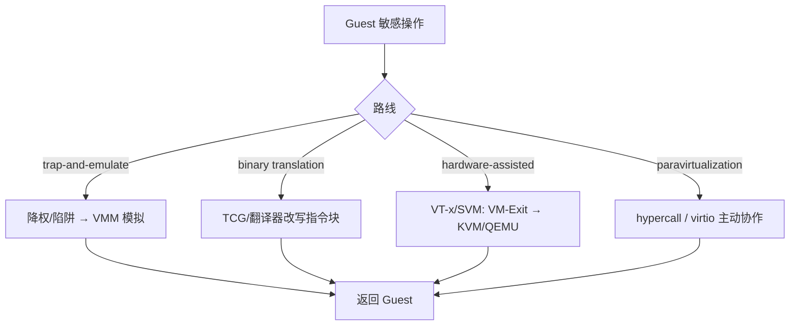
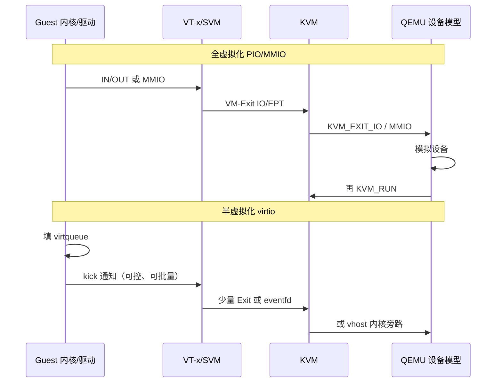

# 为什么 Guest 跑特权指令就 VM-Exit？全虚拟化、半虚拟化与硬件辅助一条线讲透

同一份镜像：在一台机器上近裸机，在另一台上 `kvm_exit` 刷屏、磁盘像插了软盘；换成「未改内核的 Windows」又突然只能走全模拟设备；再上 Xen 老集群，有人谈 PV、有人谈 HVM，名词对不上路径。根因往往不是「虚机开没开」，而是 **Guest 是否知情、敏感操作走 trap-and-emulate / 二进制翻译 / 硬件辅助 / 半虚拟化（PV）哪一条**，以及 CPU、内存、IO 三条线上落点是否一致。本文把四条技术路线对照讲透，落到 VT-x/SVM、KVM、Xen PV/HVM、hypercall 与 virtio，并给出可执行的配置、观测与排障。合并自 `articles/虚拟化技术/chapters/033～038`（全虚拟化与半虚拟化系列）；路径对齐 Linux `arch/x86/kvm/`、`arch/x86/xen/`、`drivers/virtio/`、`include/xen/` 与 QEMU `accel/`、`hw/virtio/`（以本机/上游版本为准；寄存器级细节以 Intel SDM / AMD APM / Xen 文档为准）。

## 阅读地图

1. **第一层：为何需要对照四条路线**——解决「全虚拟化 ≠ 硬件辅助、半虚拟化 ≠ 一定更快」的概念混淆。
2. **第二层：trap-and-emulate 与二进制翻译**——解决「无硬件时如何骗过 Guest、代价在哪」。
3. **第三层：硬件辅助全虚拟化（VT-x/SVM + KVM）**——解决「为何特权指令触发 VM-Exit、Exit 之后谁模拟」。
4. **第四层：半虚拟化（Xen PV、hypercall、virtio）**——解决「Guest 知情后如何主动协作、和 HVM 怎么拼」。
5. **第五层：性能差异与选型**——解决「CPU 近裸机了 IO 仍慢、何时 PV、何时透传」。
6. **第六层：配置、观测与排障**——解决「accel 选错、Exit 风暴、PV 驱动未装、Xen 模式认错」。

## 源码锚点

| 路径 | 作用 |
|------|------|
| `arch/x86/kvm/vmx/vmx.c` | Intel VT-x：VMCS、`vmx_handle_exit`、Entry |
| `arch/x86/kvm/svm/svm.c` | AMD SVM：VMCB、`handle_exit`、`svm_vcpu_run` |
| `arch/x86/include/asm/kvm_host.h` | `struct kvm_x86_ops`，抹平 Intel/AMD |
| `arch/x86/include/asm/vmx.h` / `asm/svm.h` | Exit reason / Exit code 宏 |
| `virt/kvm/kvm_main.c` | `KVM_RUN` 总入口 |
| `include/uapi/linux/kvm.h` | 用户态 `KVM_EXIT_*`、hypercall 相关 ABI |
| QEMU `accel/kvm/` / `accel/tcg/` | 硬件辅助 vs 二进制翻译加速器 |
| QEMU `hw/virtio/` | 用户态 virtio 后端（半虚拟化 IO） |
| `drivers/virtio/virtio_ring.c` | Guest 侧 virtqueue |
| `include/uapi/linux/virtio_ring.h` | ring 描述符与 feature 位 |
| `arch/x86/xen/` | Xen PV 客户机侧（Linux as DomU） |
| `include/xen/interface/` / `include/xen/xen.h` | hypercall 号、共享信息页等接口 |
| `drivers/xen/` | Xen 总线、前端驱动、事件通道 |
| Xen Hypervisor `xen/arch/x86/`（上游树） | PV/HVM 入口、hypercall 页、HVMOP |
| Intel SDM Vol.3 VMX / AMD APM SVM | 硬件 Exit 权威定义 |

特权指令 → Exit 的硬件侧（概念，数值以本机头文件/手册为准）：

```c
/* arch/x86/include/asm/vmx.h — 示意 */
#define EXIT_REASON_CPUID                10
#define EXIT_REASON_HLT                  12
#define EXIT_REASON_VMCALL               18   /* Guest 主动 hypercall 风格入口 */
#define EXIT_REASON_CR_ACCESS            28
#define EXIT_REASON_IO_INSTRUCTION       30
#define EXIT_REASON_MSR_READ             31
#define EXIT_REASON_MSR_WRITE            32
#define EXIT_REASON_EPT_VIOLATION        48
```

KVM 用户态可见的退出（与硬件 reason **不是**同一编号空间）：

```c
/* include/uapi/linux/kvm.h — 示意子集 */
#define KVM_EXIT_IO              2
#define KVM_EXIT_HYPERCALL       3
#define KVM_EXIT_MMIO            6
#define KVM_EXIT_HLT             5
#define KVM_EXIT_SHUTDOWN        8
```

virtio 环（半虚拟化 IO 的数据面契约）：

```c
/* include/uapi/linux/virtio_ring.h */
#define VRING_DESC_F_NEXT       1
#define VRING_DESC_F_WRITE      2
#define VRING_DESC_F_INDIRECT   4
#define VIRTIO_RING_F_INDIRECT_DESC  28
#define VIRTIO_RING_F_EVENT_IDX      29
```

## 调用链

### 四条路线总览：同一 Guest 行为，不同落点



### KVM 全虚拟化主路径 vs virtio 半虚拟化 IO



---

## 第一层：为何需要对照四条路线

### 1.1 两个正交维度

工程上常把「全 / 半」与「软 / 硬」搅在一起。先拆开：

| 维度 | 问题 | 典型答案 |
|------|------|----------|
| **Guest 是否知情** | Guest 内核/驱动是否按「我在虚机里」改造 | 不知情 → 全虚拟化；知情 → 半虚拟化（PV） |
| **CPU 如何执行** | 敏感指令靠陷阱、翻译还是硬件模式 | trap-and-emulate / binary translation / hardware-assisted |

于是出现组合，而不是非此即彼：

| 组合 | 例子 |
|------|------|
| 全虚拟化 + 硬件辅助 | 现代 KVM/QEMU：未改内核的 Linux/Windows + VT-x/SVM |
| 全虚拟化 + 软件 | 早期 VMware BT、QEMU TCG 跑 x86 Guest |
| 半虚拟化 + 软件/硬件 | Xen 经典 PV；KVM 上装 virtio 驱动（CPU 仍硬件辅助） |
| Xen HVM + PV 驱动 | HVM 跑未改内核，再装 PV 网卡/磁盘驱动加速 IO |

**KVM 上的「全虚拟化 Guest + virtio」** 是今天最常见形态：CPU/MMU 走硬件辅助全虚拟化，IO 走半虚拟化。说「KVM 是全虚拟化」只说对了 Guest 镜像兼容性这一面。

### 1.2 敏感指令问题（Popek & Goldberg 视角）

虚拟化要正确，必须捕获所有 **敏感** 行为。历史上 x86 存在「非特权却敏感」的指令：在非 Ring0 执行不陷阱，却能读到特权状态。这直接打穿纯 trap-and-emulate 的正确性假设。出路只有三条：

1. 改 Guest（PV）；
2. 改指令流（二进制翻译）；
3. 改 CPU（VT-x/AMD-V，把敏感行为变成可控 Exit）。

### 1.3 名词对照表（读文档时用）

| 说法 | 通常指 |
|------|--------|
| Full virtualization | Guest 不改即可跑；实现可用软件或硬件 |
| Para-virtualization (PV) | Guest 改接口：hypercall、前端驱动 |
| Hardware-assisted virtualization | VT-x / AMD-V / ARM VE 等 |
| HVM（Xen 语境） | Hardware Virtual Machine，硬件辅助跑未改 Guest |
| PVH / PVHVM | Xen 演进：更轻的 HVM 或 HVM+PV 驱动混合 |
| trap-and-emulate | 捕获后模拟；可发生在软件陷阱或硬件 Exit 之后 |
| Binary translation | 翻译 Guest 代码块，插入检查/helper |

### 1.4 本文边界

- CPU 特权与 Exit：与《VT-x 与 VM-Exit》文互补，本文强调 **路线对照**。
- virtio/VFIO 细节：与《IO 虚拟化》文互补，本文强调 **PV 在全虚拟化栈中的位置**。
- Xen 以 Linux DomU 与公开接口为主；Hypervisor 内部文件名随 Xen 版本变化，以你检出的树为准。

---

## 第二层：trap-and-emulate 与二进制翻译

### 2.1 trap-and-emulate 在干什么

经典做法：把 Guest「内核」放到低于 Host 的特权级（如 Ring1），真正 Ring0 给 VMM。Guest 执行特权指令 → 陷入 → VMM 解码并模拟，再返回 Guest。

```text
Guest: mov cr3, rax     （以为自己是内核）
  → #GP 或等价陷阱
  → VMM 模拟「换页表」语义（实际改影子页表等）
  → 恢复 Guest，下一条指令
```

对 **设备寄存器** 同理：PIO/MMIO 落入 VMM 映射的陷阱页，走设备模型。

优点：Guest 无需改。  
致命点（纯软件时代）：

1. 漏洞指令不陷阱 → 正确性危机；
2. 每次特权/敏感操作都陷阱 → 性能差；
3. 段、中断、实模式等边角与真机不一致，兼容性工程量巨大。

硬件辅助出现后，**trap-and-emulate 的思想还在**：只是陷阱源从「软件降权」换成了 **VM-Exit**。KVM 处理 Exit 后模拟 MSR/IO，本质仍是「捕获 + 模拟」，只是捕获由 CPU 保证完备。

### 2.2 二进制翻译（以 QEMU TCG 为例）

TCG 不依赖 VT-x：扫描 Guest 基本块，生成 Host 可执行代码；敏感指令变成 helper 调用。

```text
Guest TB
  → 译码
  → 敏感处 → helper（查权限 / 模拟 / 走软 MMU）
  → 缓存翻译块（TB）
  → 命中则直接跑 Host 码
```

| 维度 | trap-and-emulate（软） | TCG |
|------|------------------------|-----|
| 正确性来源 | 依赖指令是否陷阱 | 翻译器覆盖率 |
| 普通指令 | 原生（若降权成功） | 翻译执行 |
| 跨架构 | 难 | 擅长（x86 Host 跑 ARM Guest） |
| 无 VT-x | 勉强/不安全 | 可跑 |
| 典型命令 | 历史产品 | `qemu-system-* -accel tcg` |

验证加速器：

```bash
qemu-system-x86_64 -accel help
# 生产同架构：优先 kvm
# 无硬件 / 跨架构：tcg
```

### 2.3 两者与「全虚拟化」的关系

二者都服务于 **Guest 不知情** 的全虚拟化目标。区别是实现手段：一个靠运行时陷阱，一个靠静态/动态改写代码。当代服务器默认不再用它们做主 CPU 路径，但：

- CI 嵌套失败、笔记本 BIOS 关了虚拟化 → 会静默或显式落到 TCG，体感「突然变慢十倍」；
- 调试、跨架构仿真 → TCG 仍是正道。

排障第一问永远是：**现在到底是 kvm 还是 tcg？**

```bash
tr '\0' '\n' < /proc/$(pidof qemu-system-x86_64)/cmdline | grep -E 'accel|enable-kvm'
ls -l /dev/kvm
grep -E 'vmx|svm' /proc/cpuinfo
```

---

## 第三层：硬件辅助全虚拟化——特权指令为何变成 VM-Exit

### 3.1 VT-x / SVM 改写了执行世界

Intel **VMX**：Host 在 VMX root；Guest 在 VMX non-root。敏感事件按 **VMCS** 控制触发 **VM-Exit**。  
AMD **SVM**：`VMRUN` 加载 **VMCB**；退出称 **#VMEXIT**。

Guest 视角仍是「我在 Ring0 跑内核」；Host 视角是 non-root。特权指令不再靠「降到 Ring1」，而靠 **硬件拦截列表**。

```text
[ Host Ring0 + VMX root ]
      | VMLAUNCH / VMRESUME 或 VMRUN
      v
[ Guest 执行：普通指令原生]
      | 特权/敏感/外部事件
      v
[ VM-Exit → 读 reason → KVM 分发 ]
```

### 3.2 为何「跑特权指令就 Exit」

因为 VMM 在 Entry 前写好了控制字段，例如（概念）：

- CR 访问退出；
- 部分异常 bitmap；
- IO bitmap / 无条件 IO Exit；
- MSR bitmap；
- CPUID、HLT、PAUSE 等指令退出控制；
- 二级页表（EPT/NPT）使非法 GPA 访问变成 violation Exit。

Guest 执行 `cli`、`wrmsr`、`invlpg`、访问APIC、写设备 BAR——只要落在拦截集合，CPU **硬件强制** 退出到 Host，不会「悄悄以错误语义执行」。这正是硬件辅助相对纯软件 trap 的正确性优势。

### 3.3 KVM 如何接住 Exit

```text
ioctl(KVM_RUN)
  → kvm_main / x86.c
  → kvm_x86_ops.vcpu_run()     /* vmx 或 svm */
  → 硬件 Entry
  → 硬件 Exit
  → kvm_x86_ops.handle_exit()
       ├─ 内核可消化（补页、部分 MSR、halt）→ 再 Entry
       └─ 需用户态 → 填 kvm_run.exit_reason → 返回 QEMU
```

`kvm_x86_ops` 把厂商差异收口到一张函数表（见 `arch/x86/include/asm/kvm_host.h`）：公共逻辑不写满 `#ifdef`。

```c
/* 逻辑摘要：arch/x86/include/asm/kvm_host.h */
struct kvm_x86_ops {
    int (*hardware_enable)(void);
    int (*vcpu_run)(struct kvm_vcpu *vcpu);
    int (*handle_exit)(struct kvm_vcpu *vcpu, ...);
    /* MSR/CR/嵌套/TLB … */
};
/* vmx_x86_ops / svm_x86_ops 二选一挂接 */
```

### 3.4 「全虚拟化」在 KVM 上的含义

- **Guest 内核**：不必打 PV 补丁即可启动（实模式、ACPI、PCI 枚举由 QEMU 固件+设备模型提供）。
- **设备**：默认是模拟的 PCI 设备（e1000、ide…），走 Exit + 用户态模拟 → 慢。
- **优化路径**：换 virtio（半虚拟化驱动）、vhost、VFIO 透传——**不改变「Guest 可不改就能装」这一全虚拟化承诺**，只是装了更好的驱动。

### 3.5 hypercall 在硬件辅助世界里的位置

即便是全虚拟化 Guest，也可以 **主动** 呼叫 Hypervisor：

- Intel：`VMCALL`（常对应 Exit reason VMCALL）；
- AMD：`VMMCALL`；
- KVM：经 `KVM_HC_*` 等约定，用户态可见 `KVM_EXIT_HYPERCALL`（视配置与是否内核处理）。

这与 Xen PV 的 hypercall 页不同源，但思想相同：**知情协作比被动 Exit 更可控**。Linux Guest 上的 `kvm-clock`、异步页故障、pvspinlock 等，都是「全虚拟化底座 + 可选 PV 扩展」。

---

## 第四层：半虚拟化——Xen PV、hypercall 与 virtio

### 4.1 Xen 经典 PV：Guest 承认「我不是裸机」

Xen DomU（PV）启动时就知道底层是 Hypervisor：

- 通过 **hypercall** 做特权操作（换页表、关中断、发事件等），而不是直接执行敏感指令；
- 使用 **共享信息页、事件通道、授权表（grant table）** 做通知与零拷贝式 IO；
- 前端驱动（netfront/blkfront）对接 Dom0 后端。

Linux 侧常见锚点：

| 路径 | 作用 |
|------|------|
| `arch/x86/xen/` | PV 启动、cpu、mmu、irq 适配 |
| `include/xen/interface/xen.h` | hypercall 号等 |
| `drivers/xen/` | xenbus、前端、balloon 等 |

概念形 hypercall（号值以 `include/xen/interface/` 为准）：

```c
/* 逻辑示意：Guest 不写 CR3，而调用 */
HYPERVISOR_mmu_update(...);
HYPERVISOR_sched_op(...);
HYPERVISOR_event_channel_op(...);
```

相对全虚拟化：

| | Xen PV | KVM 全虚拟化 Guest |
|--|--------|-------------------|
| Guest 内核 | 必须 PV 感知（或 PVH 路径） | 可标准发行版 |
| 特权路径 | hypercall | 敏感指令 → VM-Exit |
| 设备 | 前端/后端 | 模拟 PCI 或 virtio |
| 未改 Windows | 经典 PV 难直接跑 | HVM/KVM 可跑 |

### 4.2 Xen HVM 与混合

**HVM**：借助 VT-x/SVM 跑未修改 Guest，接近 KVM 模型；IO 默认可走模拟。  
**PV on HVM / PVHVM**：HVM Guest 再装 Xen PV 驱动，加速网卡磁盘。  
**PVH**：进一步精简，减少模拟固件依赖（演进细节以当前 Xen 文档为准）。

读日志时先分清模式：

```bash
# Guest 内（Xen）
dmesg | grep -i xen
ls /sys/bus/xen
cat /sys/hypervisor/type 2>/dev/null
```

### 4.3 virtio：KVM 生态里的「半虚拟化 IO 标准」

virtio 不要求改整个内核特权模型，只要求 **装半虚拟化驱动**：

1. Guest 驱动按规范操作 **virtqueue**（desc/avail/used）；
2. kick 通知 Host（MMIO/PCI/event）；
3. Host 后端（QEMU 或 vhost）批量取缓冲、做真实 IO；
4. 回写 used，必要时中断 Guest。

相对 e1000/ide 全模拟：

- Exit/通知次数可降一个数量级以上（视批大小与 `EVENT_IDX`）；
- 语义为「队列 + 特征协商」，不是仿真某个真实芯片的全部 quirk。

源码阅读顺序建议：

1. `include/uapi/linux/virtio_ring.h` — 契约；
2. `drivers/virtio/virtio_ring.c` — Guest 实现；
3. QEMU `hw/virtio/virtio.c` — 后端；
4. 需要数据面旁路时再进 `drivers/vhost/`。

### 4.4 PV 的层次：从「改内核」到「改驱动」

```text
重度 PV（Xen 经典）：内核特权路径全面 hypercall 化
中度 PV（pvops / kvm guest）：时钟、自旋锁、tlb 等可选补丁
轻度 PV（virtio）：只换设备驱动，Guest 仍以为有 PCI 总线
```

选型时问：**兼容性约束在 OS 镜像，还是在 IO 性能？** 镜像不能改 → 全虚拟化 CPU + 能装驱动就装 virtio；镜像可控且历史 Xen 栈 → PV/PVH 路径。

### 4.5 三条「主动呼叫」对照

| 机制 | 入口 | 典型用途 |
|------|------|----------|
| Xen hypercall | 超调用页 / 专用指令约定 | MMU、调度、事件通道 |
| KVM hypercall | VMCALL/VMMCALL + `KVM_HC_*` | 时钟、特性、迁移辅助等 |
| virtio kick | 写队列通知寄存器 / eventfd | 数据面唤醒后端 |

都是半虚拟化思想；作用域不同，不要混称「都是 hypercall」。

---

## 第五层：性能差异与选型

### 5.1 开销落在哪一层

| 层 | 全模拟 / 软虚拟化 | 硬件辅助 + 模拟设备 | 硬件辅助 + virtio | 透传 VFIO |
|----|-------------------|---------------------|-------------------|-----------|
| 普通指令 | 翻译或频繁陷阱 | 近原生 | 近原生 | 近原生 |
| 特权指令 | 高 | Exit，可优化 | Exit，可优化 | Exit，可优化 |
| 网卡/磁盘数据面 | 极高（每包 Exit） | 高 | 低～中 | 近裸机 |
| 兼容性 | 高（TCG 跨架构） | 高 | 需驱动 | 需 IOMMU/硬件 |

经验法则：**CPU 算力** 在打开 KVM 后通常不是第一瓶颈；**IO Exit 风暴与中断路径** 才是。看到「开了虚拟化还是慢」，先画 Exit 直方图，再决定换 virtio 还是透传。

### 5.2 对照实验（同一 Host）

```bash
# A: 硬件辅助 + 模拟网卡（示意）
qemu-system-x86_64 -accel kvm -cpu host \
  -netdev user,id=n0 -device e1000,netdev=n0 ...

# B: 硬件辅助 + virtio
qemu-system-x86_64 -accel kvm -cpu host \
  -netdev user,id=n0 -device virtio-net-pci,netdev=n0 ...

# C: 强制 TCG（对照灾难路径）
qemu-system-x86_64 -accel tcg -cpu qemu64 ...
```

同时：

```bash
sudo perf kvm stat -p $(pidof qemu-system-x86_64) sleep 8
```

解读：A 相对 B 常见 IO/MMIO Exit 更高；C 的 Host CPU 占用形态完全不同（翻译开销），不要和 Exit 计数直接横比。

### 5.3 选型决策树

```text
需要跨架构或无 VT-x/SVM？
  └─ 是 → TCG（接受慢）
  └─ 否 → KVM/硬件辅助
        Guest 能否装 virtio？
          └─ 能 → virtio-net/blk/scsi（默认推荐）
          └─ 不能 → 模拟设备；性能敏感再评估 GPU/NIC 透传
        要近线速 / 绑物理功能？
          └─ VFIO / SR-IOV（独立排障 IOMMU 组）
Xen 存量平台？
  └─ 未改内核 Guest → HVM（+ 尽量 PV 驱动）
  └─ 可控 Linux → PV/PVH（按版本文档）
```

### 5.4 常见误区

1. **「半虚拟化一定比全虚拟化快」** —— 比的是路径。Xen PV 的 hypercall 快，不代表随便一个「半虚拟化概念」就快；KVM+e1000 全虚拟化设备可以比 KVM+virtio 慢很多。
2. **「开了 KVM 就没有模拟」** —— CPU 主路径硬件化；设备与固件仍大量软件。
3. **「virtio 是全虚拟化」** —— Guest 驱动是 PV 契约；只是不改特权模型。
4. **「Exit 越少越好到零」** —— idle HLT、必要中断仍会 Exit；目标是去掉 **无意义的设备噪声**。
5. **「嵌套里也能当裸金属调」** —— L2 的每次敏感操作可能变成 L0/L1 多级 Exit，选型要保守。

### 5.5 与安全、运维的交界

- 全虚拟化承诺：任意 OS 镜像可启动 → 攻击面在设备模型与 Hypervisor。
- PV 缩小「盲模拟」面，但 hypercall/前端接口本身是信任边界；Dom0/后端崩溃影响面大。
- 透传把设备驱动漏洞边界推进 Guest，需 IOMMU 隔离；组不可用时宁可退回 virtio。

---

## 第六层：配置、观测与排障

### 6.1 先钉死「当前走哪条路线」

```bash
# Host
grep -E 'vmx|svm' /proc/cpuinfo
lsmod | egrep 'kvm_intel|kvm_amd|xen'
ls -l /dev/kvm
cat /sys/module/kvm_intel/parameters/nested 2>/dev/null

# QEMU 进程
tr '\0' '\n' < /proc/$(pidof qemu-system-x86_64)/cmdline
```

| 观察 | 结论 |
|------|------|
| 无 vmx/svm | 只能 TCG 或失败 |
| 有标志但无 `/dev/kvm` | 模块/权限/`kvm` 黑名单 |
| cmdline 是 `tcg` | 性能对照应先改 accel |
| Guest `lspci` 见 `Virtio` | IO 已走 PV 驱动契约 |
| Guest 仅见 `e1000`/`rtl8139` | 全模拟设备路径 |

Guest 内：

```bash
dmesg | grep -iE 'kvm|xen|virtio|hypervisor'
cat /sys/devices/system/clocksource/clocksource0/current_clocksource
# KVM 上常见 kvm-clock；异常长期停在 pit/acpi_pm 需查 PV 时钟
ls /sys/bus/virtio/devices 2>/dev/null
```

### 6.2 Exit 观测（硬件辅助路径）

```bash
sudo perf kvm stat -p $(pidof qemu-system-x86_64) sleep 5

sudo bpftrace -e 'tracepoint:kvm:kvm_exit { @[args->exit_reason] = count(); }'
# 跑负载后 Ctrl-C
```

| 主导现象 | 更可能的路线问题 | 动作 |
|----------|------------------|------|
| IO/MMIO 极高 | 设备全模拟过吵 | 换 virtio；查是否误用老网卡型号 |
| HLT 高 | idle 正常或 halt 过频 | 结合 Guest steal/idle；调 halt_poll |
| EPT violation 高 | 缺页、气球、脏页 | 查内存超卖、migration |
| 整体极慢且 Exit 形态怪 | 实际在 TCG | 修 accel |
| VMCALL/hypercall 异常多 | Guest PV 扩展或恶意/错误循环 | 查 Guest 内核 PV 特性与版本 |

记住：用户态 `KVM_EXIT_*` 计数 **小于** 硬件 Exit 总数——大量 EPT 缺页在内核消化。

### 6.3 配置片段（libvirt / QEMU 意图）

目标：「硬件辅助 CPU + virtio IO」（推荐默认）：

```xml
<!-- libvirt 意图示意 -->
<domain type='kvm'>
  <vcpu>4</vcpu>
  <cpu mode='host-passthrough'/>
  <devices>
    <interface type='bridge'>
      <model type='virtio'/>
    </interface>
    <disk type='file' device='disk'>
      <driver name='qemu' type='qcow2' cache='none' io='native'/>
      <target dev='vda' bus='virtio'/>
    </disk>
  </devices>
</domain>
```

等价 QEMU 意图：`-accel kvm -cpu host` + `virtio-net-pci` / `virtio-blk-pci`。  
需要 Windows 且无 virtio 驱动时，可先模拟设备安装，再换 virtio 驱动包——这是 **全虚拟化兼容性** 与 **半虚拟化性能** 的衔接操作，不是架构矛盾。

### 6.4 Xen 模式认错

症状：文档写 PV 优化，实际 Guest 是 HVM 无 PV 驱动 → 慢；或期望跑任意 ISO，却建了只能 PV 的 DomU。

```bash
# 工具随发行版不同：xl / xe
xl list -l   # 看配置中的 builder / type 字段（以本机 xl 手册为准）
```

核对：

1. Guest 类型声明（pv / hvm / pvh）；
2. 是否加载了 netfront/blkfront；
3. Dom0 后端是否 up；
4. 事件通道是否风暴（异常中断率）。

### 6.5 「特权指令 Exit」类问题分层

```text
1. 是否硬件辅助？
2. Exit reason 是预期拦截还是策略过宽？
3. 该 Exit 在内核消化还是打到 QEMU？
4. 若是 IO：能否改为 virtio/vhost/VFIO？
5. 若是 CPU 特性：CPU 模型是否暴露了 Host 没有的位？
6. 嵌套？先在 L0 验证单层基线。
```

VM-Entry 失败与 VM-Exit 风暴不同：前者是进不去 Guest（控制块/特性不一致）；后者是进出过于频繁。dmesg 与 QEMU 日志要分开读。

### 6.6 二进制翻译误用排障

```bash
# 明确对比
qemu-system-x86_64 -accel kvm ...   # 应失败则暴露问题，勿默默改 tcg
qemu-system-x86_64 -accel tcg,thread=multi ...
```

嵌套场景：L1 内要跑 KVM，需 L0 打开 nested 并把 vmx/svm 传给 L1。L1 无标志时强行 `-accel kvm` 会失败；若管理层自动回落 TCG，会出现「同配置不同性能」的假象。

```bash
# L0
cat /sys/module/kvm_intel/parameters/nested
# 给 L1：-cpu host 或显式 +vmx
# L1 内再 grep vmx && modprobe kvm_intel
```

### 6.7 性能回归时的最小对比矩阵

固定镜像与负载，只变一列：

| 用例 | accel | 网卡 | 期望 |
|------|-------|------|------|
| 基线 | kvm | virtio | 正常 |
| 退化 A | kvm | e1000 | Exit↑ 吞吐↓ |
| 退化 B | tcg | virtio | Host CPU↑ 延迟↑ |
| 退化 C | kvm | virtio 但未装 Guest 驱动 | 回落模拟或不可用 |

矩阵比单看一个 `top` 更接近根因。

### 6.8 与同系列文章的分工

| 文章 | 主线 |
|------|------|
| CPU 虚拟化 VT-x 与 VM-Exit | Entry/Exit、原因码、`kvm_x86_ops` |
| KVM ioctl 到 QEMU | 用户态 API、fd、加速器未开 |
| IO 虚拟化 virtio 与 VFIO | 环、vhost、透传、IOMMU |
| **本文** | **全/半/软/硬四条路线对照与选型排障** |

---

## 重点知识串线

```text
敏感指令必须被捕获
  ├─ 软陷阱：trap-and-emulate（历史全虚拟化）
  ├─ 改代码：binary translation（TCG）
  ├─ 改CPU：VT-x/SVM → VM-Exit（现代全虚拟化底座）
  └─ 改Guest：hypercall / virtio（半虚拟化）

现代默认拼装：
  硬件辅助跑不知情 Guest（兼容）
  + virtio/vhost 降低 IO Exit（性能）
  + 必要时 VFIO（近裸机 IO）

Xen 平行宇宙：
  PV / HVM / 混合 —— 用「Guest 是否知情 + 是否用硬件」二维理解
```

性能差往往不是「虚机」本身，而是 **落在了更贵的那条捕获路径上**。排障时先命名路径，再调参数。

### 源章节对应

合并重写自 `虚拟化技术/chapters/033～038`（核心概念、实现机制、关键技术点、源码级分析、配置与使用、常见问题），替换模板叙述为可对照 KVM/Xen/virtio 与手册的路径。

### 延伸阅读

- Linux `Documentation/virt/kvm/`
- Intel SDM Volume 3：VMX；AMD APM：SVM
- `Documentation/virtual/virtio-*.rst`（若树中提供）与 virtio 规范
- Xen Project 文档：PV / HVM / PVH
- 同目录：《CPU 虚拟化 VT-x 与 VM-Exit》《IO 虚拟化 virtio 与 VFIO》《KVM 从 ioctl 到 QEMU》

---

## 附录 A：四条路线一页纸

| 路线 | Guest 知情？ | 捕获机制 | 代表 | 今日定位 |
|------|--------------|----------|------|----------|
| trap-and-emulate | 否 | 降权陷阱 | 早期 Hypervisor | 思想仍在 Exit 模拟里 |
| binary translation | 否 | 译码改写 | QEMU TCG、早期 VMware | 无硬件/跨架构 |
| hardware-assisted | 否（底座） | VMCS/VMCB Exit | KVM、Xen HVM | 服务器默认 CPU 路径 |
| paravirtualization | 是 | hypercall/队列 | Xen PV、virtio | 降 Exit、扩协作面 |

## 附录 B：从症状反推路线

| 症状 | 先怀疑 |
|------|--------|
| 同镜像有的机器快有的慢 | accel 是否 kvm；嵌套是否回落 tcg |
| `perf kvm` 里 IO 出口占满 | 模拟网卡/磁盘；换 virtio |
| Guest 无 virtio 设备 | 机器 XML/QEMU 设备型号 |
| Xen Guest 无前端 | HVM 未装 PV 驱动或总线未起来 |
| 非法指令 / 起不来 | CPU model；Entry 失败；特性位 |
| 只有计算慢、IO 还行 | 确认是否 TCG；绑核/偷取时间 |

## 附录 C：KVM 侧阅读顺序

1. `virt/kvm/kvm_main.c`：`KVM_RUN`；
2. `arch/x86/kvm/x86.c`：公共 run 与请求位；
3. `vmx/vmx.c` 或 `svm/svm.c`：`vcpu_run` + `handle_exit`；
4. 挑 `EXIT_REASON_IO_INSTRUCTION` 与 `EPT_VIOLATION` 两支精读；
5. 再读 virtio：把「少 Exit」对应回设备模型。

## 附录 D：Xen PV 阅读顺序

1. `include/xen/interface/`：hypercall 与共享结构；
2. `arch/x86/xen/`：Linux 如何把 PV ops 接到 Xen；
3. `drivers/xen/`：xenbus 与前后端；
4. 对照 HVM 启动路径，标出「何处不再 hypercall、改走硬件 Exit」。

## 附录 E：virtio 最小验证

```bash
# Guest
lspci | grep -i virtio
ls /sys/bus/virtio/devices
ethtool -i eth0 2>/dev/null | grep -i virtio
# Host
ps -ef | grep qemu | grep -i virtio
```

有 PCI virtio 功能、Guest 驱动绑定、后端进程/线程在跑——三点齐，半虚拟化 IO 路径才算闭合。

## 附录 F：hypercall 与 VM-Exit 的关系

```text
被动路径：Guest 执行敏感指令 → 硬件 Exit → VMM 模拟
主动路径：Guest 执行 VMCALL/VMMCALL 或 Xen hypercall → 也常表现为 Exit/陷入
         → 但语义是「有意调用」，参数在约定寄存器/页里
```

观测时把「意外敏感指令风暴」和「合法 PV 调用」分开：后者应随负载呈批次特征，前者常伴错误设备模型。

## 附录 G：配置检查命令束

```bash
# Host 能力
egrep -c '(vmx|svm)' /proc/cpuinfo
test -c /dev/kvm && echo kvm_dev_ok
modinfo kvm_intel 2>/dev/null | head -3
modinfo kvm_amd 2>/dev/null | head -3

# 运行中虚机
pidof qemu-system-x86_64
sudo perf kvm stat -p $(pidof qemu-system-x86_64) sleep 3

# Guest（SSH 进虚机后）
grep -i hypervisor /proc/cpuinfo
dmesg | grep -iE 'Booting paravirtualized|KVM|Xen|virtio'
```

把输出贴到工单比「虚机有点慢」有用一个数量级。

## 附录 H：性能数字怎么读才不翻车

- 不要拿 TCG 的 Host CPU% 和 KVM 的 Exit/s 直接比大小。
- 不要只优化 `vCPU` 个数却不看是否模拟 IDE。
- 迁移/脏页打开时 EPT violation 升高可能是机制成本，不是网卡选错。
- 云厂商「PV」营销词可能指 virtio 或自家前端，落到具体驱动名再调。

## 附录 I：安全边界一句话

全虚拟化扩大 Guest 形态兼容面，把复杂性留给 Hypervisor 与设备模型；半虚拟化把契约前移到 Guest，换性能与可推断性，同时扩大「前端/hypercall」攻击与误用面。透传最小模拟，最大依赖 IOMMU。路线选择即信任边界选择。

## 附录 J：手册与源码核对法

1. 先在本机头文件确认宏名（`asm/vmx.h`、`kvm.h`、`virtio_ring.h`）；
2. 再查 SDM/APM/Xen 文档字段含义；
3. 最后回 `handle_exit` / 前端驱动看真实分支。

禁止从二手文章背「Exit reason 30 = …」当真理——Intel/AMD 编号空间不同，且内核翻译到 `KVM_EXIT_*` 还有一层。

---

*合并源：articles/虚拟化技术/chapters/033～038；体裁：CSDN 合并长文；主线：四条路线对照 → 硬件 Exit → Xen/virtio PV → 性能选型 → 配置观测排障。*
