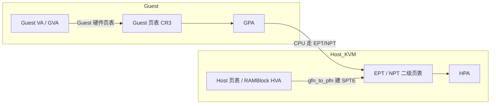
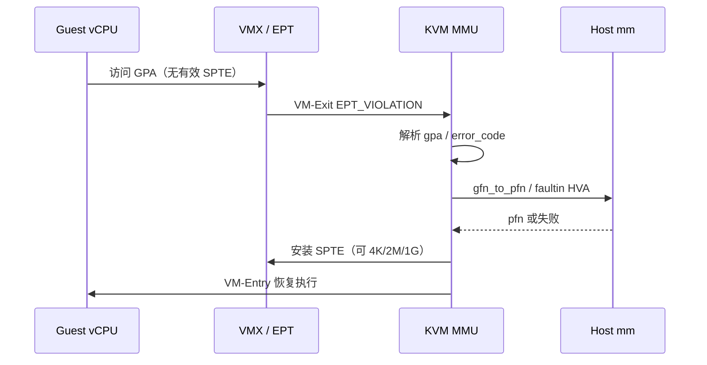
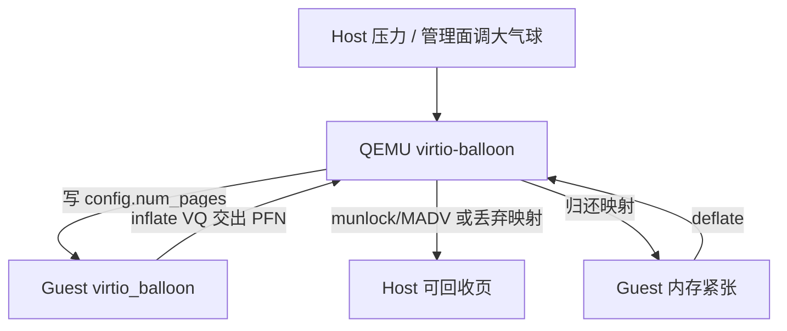

# GPA 翻成 HPA 翻车？从二级页表 EPT/NPT、Shadow、大页到 virtio-balloon 一条线讲透

虚机刚起来 `qemu` 进程 RSS 就顶穿宿主机、`perf top` 里全是 `kvm_mmu_page_fault`、开了 hugepage 却看不出 TLB miss 下降、气球回收后 Guest 反而疯狂换页——这类问题很少出在「会不会配 `-m 8G`」，而出在 **GVA→GPA→HPA 二级翻译、EPT 缺页风暴、大页未真正落到 SPTE、气球与超额认购的节奏** 没对齐。本文把内存虚拟化从地址空间语义、Shadow 与 EPT/NPT 对比、KVM MMU 建页、hugepage/THP、virtio-balloon/超额/NUMA，到缺页风暴与大页未生效的排障，合成一条可对照内核源码与 `/proc`、`kvm_stat` 验证的主线。

合并自 `articles/虚拟化技术/chapters/017～022`（内存虚拟化系列）；路径与符号对齐 Linux KVM / QEMU 上游常见布局（以你本机内核版本为准）。

## 阅读地图

1. **第一层：三地址空间**——解决「Guest 里的 VA、Guest 物理 GPA、Host 物理 HPA 各自是谁翻译、缺页发生在哪一层」。
2. **第二层：Shadow vs EPT/NPT**——解决「为何软件 Shadow 页表会把每一次 Guest CR3 切换打成 VM-Exit，硬件二级页表如何把代价压下去」。
3. **第三层：KVM MMU 建映射**——解决「`KVM_SET_USER_MEMORY_REGION` 到 EPT violation 再到 `gfn_to_pfn` 的真实调用链」。
4. **第四层：大页与 THP**——解决「hugetlbfs / 预分配大页 / 透明大页各自作用面，为何 `-mem-path` 开了仍像 4K」。
5. **第五层：气球、超额与 NUMA**——解决「virtio-balloon 如何把 Guest 空闲页还给 Host，超额认购何时变成连环 OOM」。
6. **第六层：排障闭环**——解决「缺页风暴、大页未生效、气球回收过猛怎么分层定位」。

## 源码锚点

| 路径 | 作用 |
|------|------|
| `include/uapi/linux/kvm.h` | `kvm_userspace_memory_region`、`KVM_SET_USER_MEMORY_REGION`、`KVM_MEM_*` |
| `include/linux/kvm_host.h` | `struct kvm`、`kvm_memory_slot`、`gfn_t`/`hva_t`/`pfn_t` 语义 |
| `virt/kvm/kvm_main.c` | `__kvm_set_memory_region`、slot 安装、用户态 HVA 绑定 |
| `arch/x86/kvm/mmu/mmu.c` | 传统 MMU / shadow / TDP 缺页入口（版本差异见下） |
| `arch/x86/kvm/mmu/tdp_mmu.c` | 较新内核的 Two-Dimensional Paging MMU |
| `arch/x86/kvm/vmx/vmx.c` | `handle_ept_violation` / `handle_ept_misconfig`（Intel） |
| `arch/x86/kvm/svm/nested.c` 等 | AMD NPT（Nested Paging）缺页路径 |
| `arch/x86/include/asm/kvm_host.h` | `struct kvm_mmu`、root HPA、role 位 |
| `mm/hugetlb.c` | hugetlb 预留、分配、`HugePages_*` |
| `mm/huge_memory.c` | THP 合并/拆分、`khugepaged` |
| `include/uapi/linux/virtio_balloon.h` | balloon feature、`virtio_balloon_config`、stats 枚举 |
| `drivers/virtio/virtio_balloon.c` | Guest 侧气球驱动（inflate/deflate） |
| QEMU `hw/virtio/virtio-balloon.c` | Host 侧气球设备、目标页数协商 |
| QEMU `softmmu/physmem.c` / `accel/kvm/kvm-all.c` | RAMBlock、KVM memory slot 注册 |
| `Documentation/virt/kvm/api.rst` | 内存槽 API、脏页日志语义 |
| `Documentation/admin-guide/mm/hugetlbpage.rst` | 大页配置与观测 |

用户态注册 Guest 物理内存槽（uapi，本机 headers 可直接对照）：

```c
/* include/uapi/linux/kvm.h */
struct kvm_userspace_memory_region {
	__u32 slot;
	__u32 flags;
	__u64 guest_phys_addr;
	__u64 memory_size; /* bytes */
	__u64 userspace_addr; /* start of the userspace allocated memory */
};

#define KVM_MEM_LOG_DIRTY_PAGES	(1UL << 0)
#define KVM_MEM_READONLY	(1UL << 1)

#define KVM_SET_USER_MEMORY_REGION _IOW(KVMIO, 0x46, \
					struct kvm_userspace_memory_region)
```

气球配置与特性位：

```c
/* include/uapi/linux/virtio_balloon.h */
#define VIRTIO_BALLOON_F_MUST_TELL_HOST	0
#define VIRTIO_BALLOON_F_STATS_VQ	1
#define VIRTIO_BALLOON_F_DEFLATE_ON_OOM	2
#define VIRTIO_BALLOON_F_FREE_PAGE_HINT	3
#define VIRTIO_BALLOON_F_PAGE_POISON	4
#define VIRTIO_BALLOON_F_REPORTING	5

struct virtio_balloon_config {
	__le32 num_pages;   /* Host 希望 Guest 交出的页数 */
	__le32 actual;      /* Guest 已装进气球的页数 */
	/* free_page_hint_cmd_id / poison_val ... */
};
```

## 调用链

### 地址翻译总览：GVA → GPA → HPA



### EPT violation 到建页（Intel / KVM 典型路径）



### virtio-balloon inflate 路径



文字补充（slot 注册）：

```text
QEMU 分配 RAMBlock（mmap / hugetlbfs）
  → kvm_set_user_memory_region
  → KVM __kvm_set_memory_region
  → 记录 gpa ↔ hva
  → 首次 Guest 触达 → EPT violation → 建 SPTE
```

---

## 第一层：三地址空间——谁在翻译谁

### 为什么必须拆成 GVA / GPA / HPA

物理机上进程只有 **VA→PA** 一层页表。虚拟机里 Guest 以为自己在管「物理内存」，于是出现两层语义：

| 名字 | 谁产生 | 谁翻译 | 典型观测 |
|------|--------|--------|----------|
| GVA | Guest 进程 / Guest 内核 | Guest 自己的页表（CR3） | Guest 内 `/proc/<pid>/maps` |
| GPA | Guest 内核认为的「物理地址」 | 在有 EPT 时由 **二级页表** 再翻一次 | QEMU `info mtree`、memory slot |
| HPA | 真正的机器物理页 | Host 页表 + EPT 叶子指向的 pfn | `/proc/kpageflags`、iomem |

关键点：**Guest 改 CR3 只换 GVA→GPA 的根；不会自动改 EPT。** EPT 根在 VMCS 的 EPT pointer 里，由 KVM 维护。所以「Guest 换进程」在有 EPT 的机器上通常 **不必** 因 CR3 写而 VM-Exit（对比 Shadow 时代）。

### Memory slot：GPA 窗口如何挂到 Host HVA

QEMU/KVM 并不把 Guest 整机内存当成一块神秘设备，而是一组 **memory slot**：

- `guest_phys_addr`：GPA 起始
- `memory_size`：长度
- `userspace_addr`：QEMU 进程里 mmap 出来的 HVA
- `flags`：脏页日志、只读等

slot 安装后，KVM 只建立「这段 GPA 对应这段 HVA」的元数据；**物理页往往延迟到 Guest 第一次访问才 fault 进来**（与普通进程 demand paging 同构）。这就是为什么「虚机刚创建，Host 空闲内存还在，一跑压力测试 Host 突然吃光」——不是泄漏，是 **GPA 被触达后才钉住 HPA**。

### 二级缺页 vs Guest 内部缺页

- Guest 进程缺页：Guest 内核处理，可能完全不离开 Guest（若 EPT 已映射对应 GPA）。
- **EPT violation**：GPA→HPA 无效、权限不够、或 misconfig。这是 Host 侧 KVM 的事。
- 二者叠加会出现「Guest 在补自己的 PTE，同时 Host 在补 EPT」——冷启动、气球刚放气、热迁移后的 **双层缺页风暴** 多源于此。

### 快速自证命令

```bash
# Host：是否支持 EPT / NPT
egrep -o 'ept|npt' /proc/cpuinfo | sort -u
# KVM 模块与调试接口（发行版路径可能略异）
ls /sys/module/kvm_intel/parameters/ 2>/dev/null
cat /sys/module/kvm_intel/parameters/ept 2>/dev/null   # 1=开
# 运行中虚机进程的 RSS / PSS 对照「名义内存」
ps -o pid,rss,cmd -C qemu-system-x86_64
# Guest 内看自己以为有多少物理内存
# free -h ; grep MemTotal /proc/meminfo
```

---

## 第二层：Shadow 页表 vs EPT/NPT——为何硬件二级页表赢了

### Shadow page table：软件维护「合成页表」

在没有 EPT/NPT 的年代（或强制关掉硬件辅助），KVM 采用 **Shadow**：

1. Guest 写 CR3 / 改 PTE → 往往触发 VM-Exit。
2. KVM 根据 Guest 页表内容，在 Host 侧构造一张「看起来像 Guest 页表、叶子却指向 HPA」的影子页表。
3. 真正跑 Guest 时，硬件只用这张影子表做 VA→HPA（一步到位）。

代价：

- Guest 内核频繁换地址空间（进程切换）→ 大量 Exit。
- Guest 改 PTE → 需要同步影子表，复杂且易错。
- TLB shootdown、权限模拟（NX、WP）都要软件兜底。

收益：在无 EPT 的老硬件上「能跑」。

### EPT（Intel）与 NPT（AMD）：硬件走两步

有 **Extended Page Tables / Nested Paging** 后：

1. Guest 页表照常：GVA→GPA。
2. CPU 再用 EPT/NPT：GPA→HPA。
3. Guest 改自己的页表 **不必** 为了「告诉 Host」而 Exit（除非你开了特定拦截）。

KVM 侧维护的是 **EPT 页表（TDP：Two-Dimensional Paging）**，而不是完整 Shadow Guest 页表。现代发行版默认走这条路径；`kvm_intel.ept=0` 会退回影子路径，性能通常肉眼可感地变差。

### 对照表

| 维度 | Shadow | EPT / NPT |
|------|--------|-----------|
| 硬件要求 | 无需二级页表 | 需 VMX EPT / SVM NPT |
| Guest 写 CR3 | 常 Exit | 通常不 Exit |
| 缺页类型 | 影子同步 + 权限模拟 | EPT violation / NPF |
| TLB | 软件影子 + 硬件 TLB | 有独立 EPT TLB 结构（实现相关） |
| 大页 | 可做，但同步更烦 | SPTE 可直接装 2M/1G |
| 今日默认 | 兼容/调试兜底 | 生产默认 |

### 设计动机一句话

**把「Guest 自己的地址空间管理」还给 Guest，把「GPA 落在哪块真内存」留给 Hypervisor。** 职责切开后，Exit 次数从「随进程切换爆炸」变成「随冷热页与权限变化」。

---

## 第三层：KVM MMU——从 slot 到 SPTE

### 注册内存：HVA 绑定 GPA

QEMU 在创建虚机时大致顺序：

1. 按 `-m` / memory backend 做 `mmap`（普通匿名、`memfd`、hugetlbfs、file-backed）。
2. 调 `KVM_SET_USER_MEMORY_REGION` 填 slot。
3. KVM 在 `virt/kvm/kvm_main.c` 的 `__kvm_set_memory_region` 里校验对齐、重叠、flags，挂到 `kvm->memslots`。

之后 **还没有** 完整 EPT 叶子；只有「这段 GPA 合法且对应这段 HVA」的账本。

### 缺页入口：violation → 建映射

Intel 路径概念上：

```text
Guest 访存
  → EPT miss / 权限错
  → VM-Exit (EPT_VIOLATION 或 EPT_MISCONFIG)
  → vmx.c: handle_ept_violation
  → mmu: 按 gpa 找 slot → hva = gpa 偏移 + userspace_addr
  → 对 hva 做 get_user_pages / faultin（可能睡）
  → 得到 pfn，写入 EPT PTE（SPTE）
  → 必要时 flush EPT TLB
  → VM-Entry
```

`EPT_MISCONFIG` 常表示叶子项位组合非法（保留位、错误内存类型等），和「单纯缺页」不同——排障时不要和 violation 混成一类。

### gfn / hva / pfn 三个记号

KVM 代码里常见：

- **gfn**：Guest Frame Number = GPA >> PAGE_SHIFT
- **hva**：Host Virtual Address（QEMU 进程地址空间）
- **pfn**：Host 物理页帧号

`gfn_to_pfn` 一族函数负责「查 slot + 解析 HVA + 拿到可映射的 pfn」。若 HVA 背后是文件、可换出页、或 THP 中间态，这里会成为延迟与失败点。

### 脏页日志与迁移

`KVM_MEM_LOG_DIRTY_PAGES` 打开后，写路径会记录脏 GPA，供热迁移 / 增量备份使用。副作用：写密集负载下 **写保护或脏位追踪** 会增加 Exit 与 TLB 刷新。生产上「迁移窗口突然变慢」有时不是磁盘，而是脏页日志放大了 MMU 开销。

### 观测：证明「在补 EPT」而不是 Guest 自己在抖

```bash
# 需 kvm_stat（qemu-kvm / kernel-tools 等包）
sudo kvm_stat -1
# 关注：mmu_page_fault / mmio / exits 等计数（名称随版本略异）
# 或
sudo perf top -e kvm:kvm_page_fault 2>/dev/null
# Host 看 QEMU 线程是否大量系统时间
pidstat -t -p $(pgrep -n qemu-system) 1
```

Guest 内若只有 `pgfault` 高而 Host `kvm_mmu` 不涨，优先查 Guest 应用与 Guest swap；两边一起涨，才是双层风暴。

---

## 第四层：Hugepage 与 THP——大页到底落在哪一层

### 三套「大页」不要混

| 机制 | 谁分配 | 典型页大小 | 和 KVM 的关系 |
|------|--------|------------|----------------|
| **hugetlbfs 预留大页** | 管理面 `nr_hugepages` | 2M / 1G | QEMU `-mem-path /dev/hugepages` 或 memory-backend-file |
| **透明大页 THP** | `khugepaged` / 故障路径合并 | 通常 2M | Host 匿名页可能合并；Guest 内也可开 THP |
| **EPT 大页 SPTE** | KVM MMU 在叶子用 2M/1G 项 | 与底层页对齐时 | **真正减少 EPT walk 与 TLB miss 的是这一层** |

很多人只开了 Host THP 或只 `echo 1024 > nr_hugepages`，却忘了：**若底层物理页不是连续大页，或对齐不够，KVM 只能装 4K SPTE。** 「开了大页没加速」十有八九卡在这一层。

### 预分配 hugepage 实操

```bash
# 查看与预留 2M 大页（数量按容量算：1024 ≈ 2GiB）
grep -E 'HugePages_|Hugepagesize' /proc/meminfo
echo 1024 | sudo tee /proc/sys/vm/nr_hugepages
# 挂载 hugetlbfs（若发行版未自动挂）
sudo mkdir -p /dev/hugepages
sudo mount -t hugetlbfs none /dev/hugepages
# QEMU 示例（参数以你所用版本为准）
# -m 2048 -mem-path /dev/hugepages -mem-prealloc
# 或 memory-backend-file：share=on, prealloc=on, size=2G, mem-path=/dev/hugepages
```

`mem-prealloc` 的意义：创建时就把 HVA 全部 fault 进大页，避免运行期第一次触达时的延迟尖刺；代价是启动更慢、Host 立刻占用。

### THP：Host 与 Guest 各自决策

Host：

```bash
cat /sys/kernel/mm/transparent_hugepage/enabled
# always / madvise / never
cat /sys/kernel/mm/transparent_hugepage/defrag
```

- 延迟敏感库（数据库、高频交易类）在 **裸机** 常关 `always`，改 `madvise`/`never`，避免合并卡顿。
- 对 **KVM 背板内存**，更稳的是 **显式 hugetlbfs / 1G 大页**，而不是赌 THP 合并时机。

Guest 内开 THP 只优化 Guest 自己的 VA→GPA；**不会自动**让 EPT 变成 2M，除非 Host 侧页帧本身满足大页映射条件。

### 如何验证「EPT 真的用了大页」

思路：

1. Host `HugePages_Free` 在虚机启动后下降，且与 `-m` 匹配。
2. `kvm_stat` 或 ftrace 看 large page 相关计数（内核版本字段名不同，以 `Documentation` / `tracepoints` 为准）。
3. 对比同负载下 `kvm_exit` 与 TLB miss（`perf mem` / PMU）是否下降。

若 `HugePages_Total` 很大但 `Free` 几乎不变，说明 QEMU **根本没从 hugetlbfs 分配**——检查 `mem-path`、权限、后端类型。

### 碎片：大页申请失败的常见根因

1G 大页对物理连续要求极高，开机后跑一段时间再 `nr_hugepages` 常失败。实践：

- 在 **early boot** 或专用 hugepage 节点预留；
- 或接受 2M；
- 或用 `compact_memory` 做尽力而为（不保证，且有停顿）。

```bash
echo 1 | sudo tee /proc/sys/vm/compact_memory   # 实验机；生产评估停顿
dmesg -T | tail
grep HugePages_ /proc/meminfo
```

---

## 第五层：virtio-balloon、内存超额与 NUMA

### 气球在解决什么问题

静态 `-m 8G` 且全部 prealloc 时，Host 无法把「Guest 暂时不用的内存」借给别人。**virtio-balloon** 让管理面要求 Guest：**把若干页「吹进气球」**（Guest 放弃使用），Host 侧即可回收对应物理页；Guest 需要时再 **放气** 要回。

协议核心在 `virtio_balloon_config`：

- Host 写 `num_pages`：目标气球大小（页数）；
- Guest 更新 `actual`：已经交出去的页数；
- inflate / deflate virtqueue 传递 PFN 列表。

### Guest 驱动与 Host 后端

- Guest：`drivers/virtio/virtio_balloon.c` 响应配置变更，分配页交给 VQ。
- Host：QEMU `hw/virtio/virtio-balloon.c` 收到 PFN 后，对对应 RAM 做可回收处理（实现随 QEMU 版本：`madvise`、丢弃、统计等）。

特性位决定行为边界：

| Feature | 含义 |
|---------|------|
| `MUST_TELL_HOST` | 归还前必须通知 Host |
| `STATS_VQ` | Guest 上报 swap/fault/free 等统计 |
| `DEFLATE_ON_OOM` | Guest OOM 时可放气自救 |
| `FREE_PAGE_HINT` / `REPORTING` | 更积极的空闲页提示（版本相关） |

### 超额认购（overcommit）怎么和气球共振

超额 = 所有 Guest 名义内存之和 > Host 物理内存。可行的前提是：

1. 同时触达的工作集之和仍 ≤ Host；
2. 气球 / 页共享 / 换出能在压力到来前腾出空间。

失败模式：

- 多台虚机同时升温 → Host 直接 reclaim / OOM kill **QEMU 进程** → 整机消失；
- 气球回收过猛 → Guest 自己开始 swap → 业务延迟爆炸，Host 却「看起来很空」。

```bash
# Host 超额相关（语义以 man 5 proc 为准）
sysctl vm.overcommit_memory vm.overcommit_ratio
# 看是否已在吃 swap / 直接 reclaim
grep -E 'pgmajfault|pswpin|pswpout|oom_kill' /proc/vmstat
# 气球统计（若启用 stats）：QEMU monitor / libvirt virsh dommemstat
virsh dommemstat <domain> 2>/dev/null
```

### NUMA：CPU 在 Node0，页在 Node1

跨 Node 访问会把「EPT 已经很快」的优势吃掉。实践要点：

1. 查拓扑：`numactl -H`、`lscpu`。
2. 虚机 vCPU 与 memory backend 绑同一 Node（libvirt `<numatune>` / QEMU `host-nodes=`）。
3. 大页也按 Node 预留：`/sys/devices/system/node/nodeX/hugepages/...`。

```bash
numactl -H
cat /sys/devices/system/node/node0/hugepages/hugepages-2048kB/nr_hugepages
# 进程实际落点
numastat -p $(pgrep -n qemu-system)
```

`numastat` 里 `foreign` / 远端命中偏高时，先修绑定再谈 EPT 调优。

### virtio-mem 与气球的分工（边界）

较新栈还有 **virtio-mem**：按块热插拔 Guest 物理内存，比气球「假装占用再交还」更接近真实加减内存。选型以平台手册与 libvirt/QEMU 版本为准；本文主线仍覆盖最常见的 balloon 超额场景。

---

## 第六层：排障——缺页风暴、大页未生效、气球过猛

### 现象 A：冷启动或压力测试时 Host CPU 飙高，Guest 卡顿

**分层问：**

1. 是 Guest 内部缺页？看 Guest `ps` 的 majflt、`/proc/vmstat`。
2. 是 EPT 补页？看 Host `kvm_stat`、QEMU 系统时间。
3. 是磁盘 / swap？看 Host `si/so`、Guest swap。

**常见根因与动作：**

| 根因 | 动作 |
|------|------|
| 未 prealloc，首次触达风暴 | `-mem-prealloc` 或启动后预热读写 |
| 气球刚大量 deflate | 错开业务高峰与放气；限速管理面 |
| 热迁移后脏页/缺页叠加 | 迁移后给预热窗口；检查脏页日志是否仍开着 |
| Shadow 模式误开 | 确认 `ept`/`npt` 参数为启用 |

```bash
sudo kvm_stat -1
vmstat 1
# Guest
grep -E 'pgfault|pgmajfault|pswpin' /proc/vmstat
```

### 现象 B：配置了 hugepage，性能几乎不变

检查链：

```bash
grep Huge /proc/meminfo
mount | grep -i huge
# QEMU 命令行是否真有 mem-path / memory-backend-file
tr '\0' ' ' < /proc/$(pgrep -n qemu-system)/cmdline ; echo
# 权限：QEMU 用户能否写 /dev/hugepages
ls -ld /dev/hugepages
```

典型失误：

1. 预留了大页，但 QEMU 仍用匿名 mmap；
2. 预留数量不够，静默退回 4K（看日志）；
3. 只开了 Guest THP，Host 背板仍是 4K；
4. NUMA 交叉，大页红利被远端内存抵消；
5. 页大小与 EPT 大页级别不匹配（例如想要 1G SPTE 但只有 2M 页）。

### 现象 C：Host 内存很空，Guest 却在疯狂 swap

优先怀疑 **气球目标过大**：Host 把页收回去了，Guest `MemAvailable` 很低。

```bash
# Host
virsh dommemstat <domain>
# Guest
free -h
grep -E 'Swap|MemAvailable|Balloon' /proc/meminfo
```

处理：下调气球目标；开启 `DEFLATE_ON_OOM`（需前后端协商支持）；避免在 Guest 业务高峰自动「压测式回收」。

### 现象 D：QEMU 被 OOM kill，多台虚机名义内存之和过大

```bash
dmesg -T | grep -iE 'out of memory|killed process|qemu'
# 统计所有 QEMU RSS
ps -o rss=,cmd= -C qemu-system-x86_64 | awk '{s+=$1} END{print s}'
```

方向：降低超额比、强制预留、按 NUMA 容量做调度上限、关键虚机 `oom_score_adj` 保护（仍非绝对）、监控 `MemAvailable` 而不是只看 `MemFree`。

### 现象 E：只读槽 / 脏页日志导致异常 Exit

- 代码页、firmware 只读槽误配可写 → 权限类 EPT violation；
- 迁移完成后忘记关掉 dirty log → 写路径持续变慢。

对照 `KVM_MEM_READONLY`、`KVM_MEM_LOG_DIRTY_PAGES` 与管理面开关。

### 一条可重复的实验（实验机）

```bash
# 1) 基线：普通内存，看启动后触达时的 kvm exits
sudo kvm_stat -1
# 2) 预留 2M 大页并 mem-path + prealloc 再建同规格虚机
# 3) 同负载对比 kvm_stat 与业务 P99
# 4) 对一台虚机逐步 inflate 气球，同时看 Guest free 与 Host MemAvailable
```

把四步的数字记下来，比背概念更能判断「大页 / 气球」在你的平台上是否生效。

---

## 重点知识串线

1. **三地址**：GVA 归 Guest 页表，GPA→HPA 归 EPT/NPT；slot 只是 GPA↔HVA 账本。
2. **Shadow vs EPT**：Shadow 用软件合成页表，Exit 随 CR3/PTE 更新爆炸；EPT 把职责切开，是今日默认。
3. **建页路径**：`KVM_SET_USER_MEMORY_REGION` → 首次触达 EPT violation → `gfn_to_pfn` → SPTE；冷启动风暴来自这里。
4. **大页三层**：hugetlbfs / THP / EPT SPTE；只有叶子 SPTE 真正吃到 TLB 红利，且依赖底层连续页。
5. **气球与超额**：气球把 Guest 空闲还给 Host；超额靠统计复用，失败就是 Host OOM 或 Guest swap。
6. **NUMA**：先绑定再谈 MMU 调优；远端内存会吞掉大页收益。
7. **排障顺序**：Guest fault → KVM mmu → 大页是否真正占用 → 气球/超额 → NUMA。

源码阅读顺序建议：`kvm.h` 内存槽 → `kvm_main.c` region 安装 → `vmx.c` EPT exit → `mmu/*.c` 建 SPTE → `virtio_balloon.h` + Guest/QEMU balloon → `hugetlb`/`huge_memory` 对照 `/proc/meminfo`。

---

> 合并源：`articles/虚拟化技术/chapters/017～022`（内存虚拟化：概念 / 机制 / 关键技术 / 源码 / 配置 / 排障）  
> 成稿：`articles/csdn-merged/虚拟化技术-内存虚拟化EPT与气球完整篇.md`
