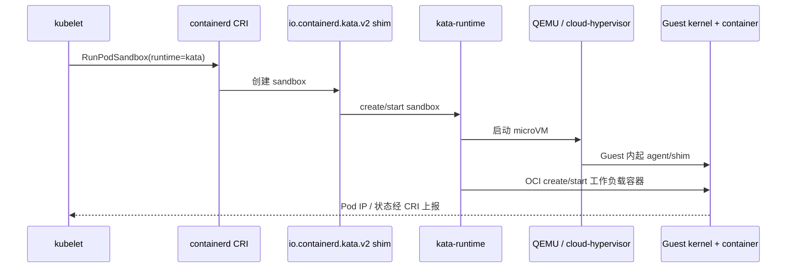
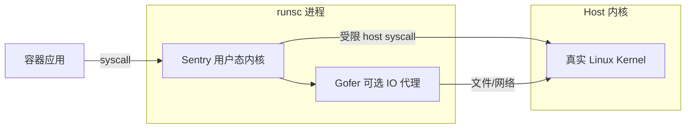

# 容器要强隔离又要像 docker run？Kata/gVisor/Firecracker 沙箱运行时怎么选

多租户平台跑用户提交的镜像：`docker run --privileged` 一放开就等于宿主机 root；内核 CVE 在容器场景是 **宿主机全局风险**；合规要求「等价 VM 隔离」但运维只肯接 **CRI/OCI、kubectl、现有镜像仓库**——传统 runc 容器在 **隔离** 与 **密度/启动速度** 之间缺中间层。本文沿 **共享内核风险 → 轻量 VM 容器思路 → Kata / gVisor / Firecracker 架构 → containerd runtime handler 接入 → 性能与隔离权衡 → 配置与排障** 讲透；路径以 **containerd**、`kata-runtime`、`runsc`（gVisor）、Firecracker 上游文档为准，Firecracker jailer 等以项目当前 layout 为准（版本间目录可能调整，文中标明「以官方文档为准」）。

## 阅读地图

1. **第一层：共享内核风险与需求**——解决「runc 边界在哪、何时不够」。
2. **第二层：轻量 VM 容器思路**——解决「每 Pod 一个 microVM / 独立内核视图如何仍走 OCI」。
3. **第三层：Kata / gVisor / Firecracker 架构**——解决「三套方案各在哪一层拦截 syscall/设备」。
4. **第四层：containerd shim 与 runtime handler**——解决「kubelet/CRI 如何选 runc 还是 kata」。
5. **第五层：性能、密度与选型**——解决「延迟、内存底噪、适用场景对照」。
6. **第六层：配置、观测与排障**——解决「Pod 起不来、慢、网络/storage 不通怎么查」。

## 源码锚点

| 路径 / 符号 | 作用 |
|-------------|------|
| `containerd/containerd/runtime/v2/` | Runtime v2 shim 框架 |
| `containerd/containerd/pkg/cri/` | CRI 插件：PodSandbox、RuntimeHandler |
| `/etc/containerd/config.toml` | `plugins."io.containerd.grpc.v1.cri".containerd.runtimes` |
| `kata-containers/kata-runtime` | Kata OCI runtime 入口 |
| `kata-containers/src/runtime/` | `kata-runtime` 创建 sandbox、VM |
| `kata-containers/src/runtime/virtcontainers/` | 对接 QEMU/Cloud Hypervisor 等 VMM |
| `google/gvisor` | gVisor 用户态内核 |
| `google/gvisor/runsc/` | OCI runtime 实现 |
| `google/gvisor/sentry/` | Sentry：syscall 拦截与模拟 |
| `firecracker-microvm/firecracker` | microVM VMM 二进制 |
| `firecracker-microvm/firecracker/docs/jailer.md` | **jailer** 降权与 cgroups（路径以官方 repo 为准） |
| `opencontainers/runc` | 默认 OCI runtime（对照） |
| `RuntimeClass`（K8s） | 按 Pod 选择 runtime handler |
| `io.containerd.kata.v2` | Kata containerd shim 常见命名 |
| `runsc` | gVisor CLI / OCI runtime 二进制 |

containerd CRI 配置中多 runtime 示例（`config.toml` 逻辑结构）：

```toml
[plugins."io.containerd.grpc.v1.cri".containerd]
  default_runtime_name = "runc"

  [plugins."io.containerd.grpc.v1.cri".containerd.runtimes.runc]
    runtime_type = "io.containerd.runc.v2"

  [plugins."io.containerd.grpc.v1.cri".containerd.runtimes.kata]
    runtime_type = "io.containerd.kata.v2"
    [plugins."io.containerd.grpc.v1.cri".containerd.runtimes.kata.options]
      ConfigPath = "/opt/kata/share/defaults/kata-containers/configuration.toml"

  [plugins."io.containerd.grpc.v1.cri".containerd.runtimes.runsc]
    runtime_type = "io.containerd.runsc.v1"
```

K8s `RuntimeClass` 指向 handler：

```yaml
apiVersion: node.k8s.io/v1
kind: RuntimeClass
metadata:
  name: kata
handler: kata
```

## 调用链

### containerd CRI 创建 PodSandbox（Kata handler）



### gVisor：syscall 经 Sentry 拦截



## 第一层：共享内核风险与需求

### runc 容器隔离边界

默认 runc 使用 **namespace + cgroup + capability 降权 + seccomp**（见同目录 seccomp/capability 篇）。**仍共享 Host 内核代码路径**：

- 容器内触发 **内核漏洞** → 可能逃逸到 Host。
- **`--privileged`** / 危险 capability → 边界接近 root on host。
- **/proc、/sys** 挂载不当 → 信息泄露或修改宿主机视图。
- **用户命名空间** 配置错误 → UID 映射突破。

```bash
# 容器与宿主机内核版本一致
docker run --rm alpine uname -r
uname -r
```

### 典型「需要更强隔离」场景

| 场景 | 原因 |
|------|------|
| 多租户 Serverless | 不可信用户代码 |
| 金融/政务合规 | 要求 VM 级或等效隔离 |
| 跑旧版/自定义内核模块 | 不能污染 Host |
| 批跑第三方 CI  job | 防 supply chain 恶意镜像 |

### 需求矛盾

| 想要 | 传统 VM | 传统 runc 容器 |
|------|---------|----------------|
| 强隔离 | 有 | 弱 |
| 秒级启动 | 无 | 有 |
| OCI/CRI 生态 | 无 | 有 |
| 镜像分层复用 | 差 | 好 |

**沙箱运行时** 目标：对外仍是 **`docker run` / CRI RunPodSandbox**，对内加 **VM 或用户态内核** 层。

## 第二层：轻量 VM 容器思路

### 架构模式

```
每个 Pod（或每个容器）→ 独立轻量 VM / 独立内核视图
Host 上仍由 containerd/kubelet 调度
镜像仍用 OCI 格式；启动仍走 CreateContainer
```

与完整 VM 差别：

- **更小内存 footprint**（microVM、精简 Guest kernel）。
- **更快 boot**（少设备、并行 agent）。
- **与 K8s Pod 模型对齐**（一 sandbox 多 container 或一 container 一 VM，依实现）。

### Kata 路径（hardware virtualisation）

- 用 **QEMU / Cloud Hypervisor / Firecracker**（视配置）起 VM。
- Guest 内跑 **kata-agent**，在 VM 里再跑 **容器**（真正 workload 仍在独立内核里）。

### gVisor 路径（software isolation）

- **不** 为每个容器起完整硬件 VM（默认）。
- **runsc** 启动 **Sentry** 进程模拟 Linux 内核 ABI；应用 syscall 进 Sentry，Sentry 再调受限 Host syscall。

### Firecracker 路径（microVM 专注）

- Amazon 开源，**极简设备模型** + **KVM**。
- 常作 **Kata 的 VMM 后端** 或 **Firecracker-containerd** 集成；不是完整 Docker 替代品，多与 containerd 插件配合。

## 第三层：Kata / gVisor / Firecracker 架构

### Kata Containers

**组件**：

| 组件 | 作用 |
|------|------|
| `kata-runtime` | OCI 兼容入口，对接 containerd/CRI-O |
| `virtcontainers` | 抽象 VM、sandbox、网络、存储 |
| VMM | QEMU（默认）、Cloud Hypervisor、Firecracker 等 |
| Guest kernel | 精简 Linux（kata-linux） |
| `kata-agent` | Guest 内 gRPC，创建容器、挂载 |

**流程摘要**：

1. Host：`kata-runtime create` → 起 VM，Guest 启动 agent。
2. Host：通过 vsock/hybrid 与 agent 通信。
3. Guest：agent 执行 **nsenter + runc 类逻辑** 在 VM 内起容器。

**隔离性**：工作负载 syscall 在 **Guest 内核** 处理；Guest 内核被攻破才到 VMM/Host——比 runc 多一层。

**代价**：每 Pod VM 内存底噪（常 **100MB+**，依配置）；启动 **秒级**。

配置主文件（安装路径依发行版）：

```bash
# 常见路径
/opt/kata/share/defaults/kata-containers/configuration.toml
/etc/kata-containers/configuration.toml
```

关键项（概念）：

```toml
[hypervisor.qemu]
  path = "/usr/bin/qemu-system-x86_64"
  kernel = "/usr/share/kata-containers/vmlinux.container"
  image = "/usr/share/kata-containers/kata-containers.img"
  default_vcpus = 1
  default_memory = 2048
  enable_vhost = true
```

### gVisor

**组件**：

| 组件 | 作用 |
|------|------|
| `runsc` | OCI runtime |
| **Sentry** | 用户态内核：syscall 解释/模拟 |
| **Gofer**（可选） | 文件访问代理，减 Sentry 攻击面 |
| **Platform** | ptrace / KVM（platform=kvm 时用 ring0 辅助） |

**隔离性**：不暴露完整 Host syscall 接口；**兼容性** 取决于 Sentry 实现程度（部分 ioctl/eBPF/perf 不支持或行为差异）。

**代价**：syscall 路径变长 → **CPU 密集应用** 可能慢 10%～数倍；内存底噪 **低于** Kata VM（无整 Guest OS 常驻同规模）。

运行示例：

```bash
runsc run --bundle /path/to/bundle mysandbox
runsc list
runsc spec --rootless  # 生成 OCI bundle
```

debug：

```bash
runsc --debug --debug-log=/tmp/runsc.log run ...
```

### Firecracker microVM

**特点**：

- 极简：**virtio-net、virtio-block、vsock** 等少量设备。
- **KVM** 必需；启动可达 **125ms 级**（官方 benchmark，依硬件）。
- **jailer**（见 `firecracker/docs/jailer.md`）：单独二进制，降权、chroot、cgroup、seccomp 后再 exec firecracker。

**与 Docker 关系**：通常 **不直接** `docker run --runtime firecracker`；走 **firecracker-containerd** 或 **Kata 选 firecracker hypervisor**。

Firecracker 手动启动概念（排障理解用）：

```bash
# 需已配置 kernel、rootfs、socket；生产由 containerd/Kata 驱动
firecracker --api-sock /tmp/firecracker.socket
# 另终端 curl --unix-socket ... PUT /machine-config ...
```

**jailer 概念**（路径以 [firecracker jailer 文档](https://github.com/firecracker-microvm/firecracker/blob/main/docs/jailer.md) 为准）：

```bash
# 逻辑：jailer 建 chroot + 降 uid/gid + cgroup 后启动 firecracker
jailer --id myvm --exec-file /usr/bin/firecracker --uid 1000 --gid 1000 ...
```

### 三者对照

| 维度 | Kata | gVisor | Firecracker |
|------|------|--------|-------------|
| 隔离机制 | 硬件 VM + Guest 内核 | 用户态 Sentry | 硬件 microVM |
| 典型内存底噪 | 高 | 中低 | 低（单 VM） |
| 启动延迟 | 秒级 | 亚秒～秒 | 亚秒 |
| syscall 兼容 | 高（真内核） | 中（模拟） | 高（Guest 内核） |
| 依赖 KVM | 是 | 可选 platform | 是 |
| 与 K8s | RuntimeClass + kata | RuntimeClass + runsc | 经 containerd 插件/Kata |

## 第四层：containerd shim 与 runtime handler

### Runtime v2 模型

containerd 每个 Pod/容器组有 **shim** 进程；CRI `RunPodSandbox` 选 **runtime handler** → 对应 `runtime_type` 与 options。

```bash
# 查看当前配置
containerd config dump | grep -A20 'runtimes'
```

### 安装 Kata 后 containerd 片段

```toml
[plugins."io.containerd.grpc.v1.cri".containerd.runtimes.kata]
  runtime_type = "io.containerd.kata.v2"
  pod_annotations = ["io.katacontainers.*"]
  [plugins."io.containerd.grpc.v1.cri".containerd.runtimes.kata.options]
    ConfigPath = "/opt/kata/share/defaults/kata-containers/configuration.toml"
```

重启：

```bash
sudo systemctl restart containerd
```

### K8s 使用 RuntimeClass

```yaml
apiVersion: node.k8s.io/v1
kind: RuntimeClass
metadata:
  name: kata
handler: kata
---
apiVersion: v1
kind: Pod
metadata:
  name: nginx-kata
spec:
  runtimeClassName: kata
  containers:
  - name: nginx
    image: nginx:1.25
```

```bash
kubectl get runtimeclass
kubectl describe pod nginx-kata | grep -i runtime
```

### CRI-O 对照（简）

CRI-O 用 `/etc/crio/crio.conf.d/` 中 `runtime_handler` 映射 `kata-runtime` / `runsc`；逻辑与 containerd 相同：**handler 名 → OCI binary**。

### containerd 与 Docker

Docker Engine 默认 **runc**；启用 Kata 需 containerd 配置 + `docker run --runtime io.containerd.kata.v2`（依 Docker 版本与集成方式，生产更常用 **K8s + containerd** 而非 dockerd 直连 Kata）。

```bash
# 部分环境
docker run --rm --runtime kata-containerd nginx:1.25
```

以本机 `docker info | grep -i runtime` 为准。

## 第五层：性能、密度与选型

### 基准维度（定性）

|  workload | runc | gVisor | Kata |
|-----------|------|--------|------|
| 静态 Web | 基线 | 接近 | 接近（网络 virtio 调优后） |
| 高频 syscall（编译、DB） | 基线 | 可能明显慢 | 接近原生（Guest 内核） |
| 需要 eBPF/perf/inotify | 全支持 | 部分限制 | Guest 内支持 |
| 密度（同节点 Pod 数） | 最高 | 中高 | 较低 |

### 选型建议（工程起点）

| 选 **Kata** | 选 **gVisor** | 选 **runc** |
|-------------|---------------|-------------|
| 要真内核兼容、ioctl 多 | 要更低内存底噪 | 可信内部 workload |
| 已有 KVM、可接受秒级启动 | 不可信代码、syscall 面可控 | 密度优先 |
| 合规写「硬件隔离」 | 不能依赖 KVM 的少数环境（ptrace 平台） | 无多租户威胁 |

**Firecracker**：偏 **FaaS / 高密度 microVM**；与 **Kata 组合** 常见，单独集成成本高于前两者之一。

### 资源规划

Kata Pod 需为 **VM 内存 + 容器 working set** 预留；忽略 VM 底噪会导致节点 OOM 或调度过度。

```bash
# Kata Pod 在 Host 上可见 qemu 或 cloud-hypervisor 进程
ps aux | grep -E 'qemu|cloud-hypervisor|firecracker'
```

gVisor：

```bash
ps aux | grep runsc
runsc list
runsc metrics <id>   # 若版本支持
```

## 第六层：配置、观测与排障

### 排障：Pod 一直 ContainerCreating

**K8s 链**：

```bash
kubectl describe pod <name>
kubectl get events --field-selector involvedObject.name=<name>
crictl pods
crictl inspectp <pod-id>
journalctl -u containerd -f
```

**Kata 常见**：

| 现象 | 方向 |
|------|------|
| `failed to create sandbox` | KVM `/dev/kvm`、qemu 路径 |
| Guest 内核不匹配 | `kernel`/`image` 路径错误 |
| 网络不通 | CNI 与 kata 网络模型（macvtap、tcfilter 等） |
| 权限 | user 是否在 kvm 组 |

```bash
sudo kata-runtime check
sudo kata-runtime kata-env
ls -l /dev/kvm
/opt/kata/bin/kata-runtime version
```

**gVisor 常见**：

| 现象 | 方向 |
|------|------|
| `permission denied` | user namespaces、/dev/shm |
| 应用 syscall 失败 | 查 runsc debug log，Sentry 未实现 |
| 性能极差 | 是否误用 ptrace platform |

```bash
runsc --debug --debug-log=/tmp/runsc.log run ...
grep -i error /tmp/runsc.log
dmesg | tail -20
```

### 排障：Kata 网络

```bash
# Host
ip link | grep -E 'tap|vxlan|kata'
iptables-save | grep -i kata

# Guest 内（通过 debug console 或 kata-runtime exec）
# 依 kata 版本文档开启 console
```

CNI 插件需与 Kata 文档推荐组合（如 **flannel + macvtap** 等，以当前 kata 网络文档为准）。

### 排障：存储 / 卷

- **9p/virtio-fs**：Guest 挂载 Host 目录，性能敏感场景需 tuning。
- **block 设备**：直接 virtio-blk。
- 日志：`Failed to mount rootfs`、`virtiofs` 相关 error 在 containerd 日志。

### 排障：Firecracker + containerd

- 确认 **firecracker-containerd** 或 Kata hypervisor 配置指向 firecracker 二进制。
- jailer 路径、uid/gid、cgroup 版本（v1/v2）不匹配会导致 silent fail——查 firecracker 官方 jailer 文档。

### 观测命令汇总

```bash
# containerd
ctr plugins ls | grep -E 'kata|runsc'
crictl info | jq '.config.cni' 2>/dev/null
crictl ps -a

# Kata
kata-monitor --listen-port 8090   # 若启用 metrics
journalctl -t kata

# gVisor
runsc list
runsc events <container-id>
```

## 重点知识

### OCI 不变，换的是 runtime binary

沙箱方案 **不** 改镜像格式；改的是 **谁执行 config.json**。K8s 用 **RuntimeClass** 把选择从镜像层挪到 Pod spec。

### Kata 是「VM 里再跑容器」

工作负载仍在 **Guest 内核** 的 namespace 里——不是「Kata 取代 runc」那么简单，而是 **两层**：VM 边界 + 容器边界。

### gVisor 是兼容性与隔离的 trade-off

上线前对 **真实应用** 做 syscall 覆盖测试（strace/runsc debug）；数据库、JIT、eBPF agent 常踩坑。

### Firecracker 是 microVM 引擎，不是完整 CRI 栈

多数场景通过 **Kata** 或 **firecracker-containerd** 间接使用；直接运维 firecracker 多见于 FaaS 平台团队。

## 验证闭环

### 实验 A：对比 runc 与 Kata 进程树

```bash
# runc Pod
crictl ps
ps aux | grep containerd-shim

# kata Pod（需已装 RuntimeClass）
kubectl run kata-test --image=nginx:1.25 --runtime-class=kata
ps aux | grep -E 'qemu|kata'
```

应看到 **VMM 进程 + kata-shim**。

### 实验 B：gVisor hello

```bash
mkdir -p /tmp/bundle/rootfs
docker export $(docker create alpine) | tar -C /tmp/bundle/rootfs -xf -
runsc spec -b /tmp/bundle
runsc run --bundle /tmp/bundle test
# 另终端
runsc list
```

### 实验 C：Kata 环境检查

```bash
sudo kata-runtime check --verbose
sudo kata-runtime kata-env | head -40
```

### 实验 D：内核共享 vs 独立（Kata Guest）

```bash
# Host
uname -r
# Kata Pod 内
kubectl exec kata-test -- uname -r
# 两者应不同（Guest kernel）
```

## 安全加固配置要点

### Kata

- 关闭不必要的 **agent debug**、限制 **vsock** 暴露。
- VMM 用 **非 root**（Kata 新版本 + QEMU 降权）。
- 保持 **Guest kernel** 与 **kata-runtime** 版本匹配升级。

### gVisor

- 默认 **network namespace** 隔离；选用 **KVM platform** 提升性能时也需 KVM 攻击面评估。
- **`--rootless`** 模式权限更小，部署复杂。

### Firecracker jailer

- 生产用 **jailer** 启动，不用 root 直接跑 firecracker。
- seccomp、cgroup、chroot 参数以官方文档为准（路径随 release 可能变）。

## 与周边技术关系

- **KVM / QEMU 基础**：同目录 Hypervisor 与 KVM 篇。
- **containerd CRI**：Docker 基础篇中的 CRI 插件路径。
- **seccomp/capability**：runc 层加固；沙箱是下一层。
- **K8s PodSecurity / PSA**：与 RuntimeClass 互补，不替代。

## 常见误区

1. **「上了 Kata 就不用管镜像安全」**——Guest 仍要防恶意；VM 缩短 Host 攻击链但不防资源耗尽。
2. **「gVisor 等于 VM」**——默认是用户态内核，威胁模型不同于硬件 VM。
3. **「Firecracker 替代 Kata」**——Firecracker 是 VMM；Kata 是完整 OCI 栈。
4. **「RuntimeClass 只设一次全局」**——按 Pod 选择；混部 runc + kata 常见。
5. **「sandbox 一定更慢不可用」**——I/O 密集、syscall 少的工作负载差距可接受；需 benchmark。

## 混部与调度注意

- 节点标签：`katacontainers.io/kata-runtime=true` 等（依版本）。
- **RuntimeClass scheduling**：`scheduling.nodeSelector` 限制 Kata 只到支持 KVM 的节点。
- **不要** 在无 `/dev/kvm` 的节点调度 Kata Pod。

```yaml
apiVersion: node.k8s.io/v1
kind: RuntimeClass
metadata:
  name: kata
handler: kata
scheduling:
  nodeSelector:
    kvm: "enabled"
```

## 版本与安装源（操作参考）

| 项目 | 常见安装 |
|------|----------|
| Kata | kata-deploy（K8s DaemonSet）、发行版包 |
| gVisor | `runsc`  release binary、apt 源 |
| Firecracker | GitHub release、`firecracker-containerd` 文档 |

安装后 **必须** 改 containerd/CRI-O 并 restart；仅装 binary 不改配置 **不会** 生效。

## 日志与 debug 开关

**containerd**：

```toml
# /etc/containerd/config.toml
[debug]
  level = "debug"
```

**Kata**：

```toml
# configuration.toml
[debug]
  enable_debug = true
  debug_console = true
```

**gVisor**：

```bash
runsc --debug --debug-log=/tmp/runsc.%d.log run ...
```

生产关闭 debug，避免敏感路径泄露与 I/O 开销。

## 性能调优起点

### Kata

- hypervisor 换 **Cloud Hypervisor**（依环境 benchmark）。
- **virtio-fs DAX**、多队列 virtio-net。
- 减小 **default_memory**（在稳定前提下）。

### gVisor

- `--platform=kvm`（需 KVM）。
- **Network passthrough** / **TPU proxy** 等特殊场景见 gVisor 文档。

### 通用

- 固定 **CPU set**、Huge pages（高级，依平台）。

## 故障案例摘要

**案例 1**：`create sandbox failed: qemu: could not open /dev/kvm`

- 根因：云主机未开嵌套虚拟化或用户无 kvm 组。
- 处理：`modprobe kvm_intel`、加组、换裸金属节点。

**案例 2**：gVisor 下 Java 应用随机崩溃

- 根因：Sentry 未完全实现特定 futex/ioctl 语义。
- 处理：换 Kata 或 runc，或升级 runsc。

**案例 3**：Kata Pod 网络 DNS 超时

- 根因：CNI 与 kata 二层模型不匹配。
- 处理：按 kata 网络指南换 macvtap/calico eBPF 兼容配置。

**案例 4**：Firecracker jailer cgroup v2 失败

- 根因：Host 纯 cgroup v2，jailer 参数仍按 v1。
- 处理：对齐 firecracker/jailer 文档 cgroup 配置（以官方为准）。

## 命令速查

| 目的 | 命令 |
|------|------|
| Kata 自检 | `kata-runtime check` |
| Kata 环境 | `kata-runtime kata-env` |
| gVisor 列表 | `runsc list` |
| containerd runtime | `containerd config dump \| grep runtimes -A30` |
| K8s RuntimeClass | `kubectl get runtimeclass` |
| Pod 用的 runtime | `kubectl describe pod \| grep -i runtime` |
| CRI 容器 | `crictl ps -a` |
| KVM | `ls -l /dev/kvm` |

## 总结主线

不可信 workload 在 **共享内核的 runc** 上风险集中；**Kata** 用 **轻量 VM + Guest 内核** 换隔离；**gVisor** 用 **Sentry** 收窄 Host syscall 面；**Firecracker** 提供 **极简 microVM 引擎**，多经 Kata 或 containerd 插件接入。接入点是 **containerd/CRI runtime handler + K8s RuntimeClass**，不是换镜像仓库。选型看 **兼容性、内存底噪、KVM 依赖、syscall 特征**；排障从 **describe pod → containerd 日志 → kata-runtime check / runsc debug → /dev/kvm 与 CNI** 顺序下钻。
