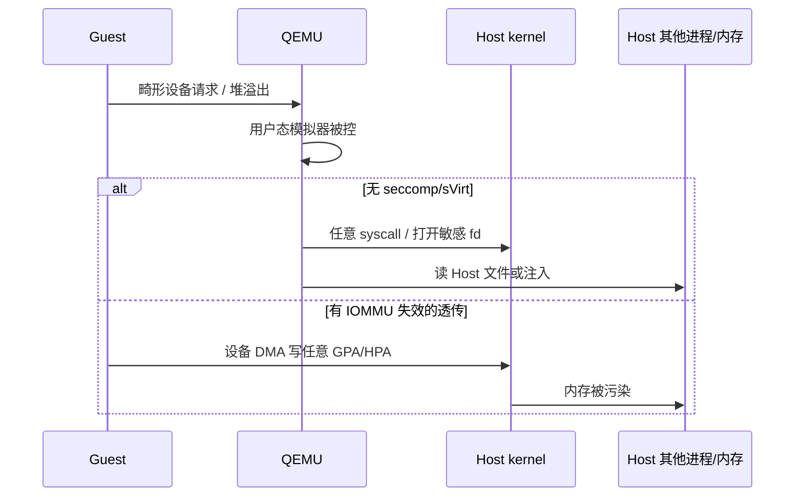
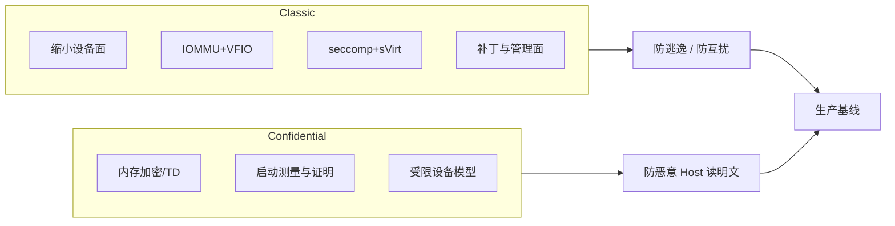

# Guest 逃到 Host？从隔离边界、IOMMU/VFIO 到 SEV/TDX 与加固清单讲透

「Guest 里打了个洞，Host 进程就变成 root」「SR-IOV 透传后 DMA 扫穿整机内存」「嵌套虚拟化一开，攻击面翻倍」「开了 SEV 却还在用默认 QEMU 设备模拟」——虚拟化安全事故很少出在「有没有开 KVM」，而出在 **隔离边界画在哪一层、设备 DMA 有没有被 IOMMU 管住、用户态模拟器（QEMU）权限是否被收束、机密计算是否真的把 Host 踢出信任域**。本文沿一条可验证主线：威胁模型与逃逸面 → 嵌套虚拟化放大面 → IOMMU/VFIO 设备隔离 → SR-IOV 透传边界 → QEMU seccomp 与 sVirt/SELinux → AMD SEV / Intel TDX（以平台手册为准）→ 加固动作与排障闭环。

合并自 `articles/虚拟化技术/chapters/073～078`（虚拟化安全系列）；路径对齐 Linux `virt/kvm/`、`drivers/vfio/`、`drivers/iommu/`、`security/` 与 QEMU `accel/kvm/`、`softmmu/`、`target/` 相关接口（版本与发行版差异处以本机头文件 / 上游文档 / CPU 厂商手册为准）。

## 阅读地图

1. **第一层：隔离边界与威胁模型**——解决「Guest 到底信任谁、逃逸通常打穿哪一层」。
2. **第二层：嵌套虚拟化（nested virt）**——解决「L0/L1/L2 为何让攻击面与 Exit 路径同时变复杂」。
3. **第三层：IOMMU 与 VFIO**——解决「设备 DMA 为何必须被 IOVA 约束、Group 不可用意味着什么」。
4. **第四层：SR-IOV 透传**——解决「性能换隔离时，哪些边界会变薄」。
5. **第五层：QEMU 用户态收束**——解决「seccomp 与 sVirt/SELinux 如何把模拟器钉在笼子里」。
6. **第六层：机密计算与加固排障**——解决「SEV/TDX 改了信任模型后，日常如何配、如何查」。

## 源码锚点

| 路径 | 作用 |
|------|------|
| `include/uapi/linux/kvm.h` | KVM ioctl、`kvm_run`、`KVM_SEV_*` / nested 相关能力 |
| `virt/kvm/kvm_main.c` | `/dev/kvm`、VM/vCPU 生命周期 |
| `arch/x86/kvm/vmx/vmx.c` / `svm/svm.c` | VT-x / AMD-V 入口与 Exit 处理 |
| `arch/x86/kvm/vmx/nested.c` / `svm/nested.c` | 嵌套 VMX / SVM |
| `arch/x86/kvm/svm/sev.c` | AMD SEV 与 KVM 协作（树内路径随版本调整） |
| `Documentation/virt/kvm/api.rst` | KVM 用户态 API |
| `include/uapi/linux/vfio.h` | Group/Container、`VFIO_IOMMU_MAP_DMA` |
| `drivers/vfio/vfio.c` | VFIO 容器与组 |
| `drivers/vfio/vfio_iommu_type1.c` | Type1 IOMMU DMA 映射 |
| `drivers/vfio/pci/vfio_pci_core.c` | PCI 透传（旧树多为 `vfio_pci.c`） |
| `Documentation/driver-api/vfio.rst` | VFIO 安全模型说明 |
| `drivers/iommu/` | IOMMU 驱动与 DMA API 后端 |
| QEMU `accel/kvm/kvm-all.c` | 打开 `/dev/kvm`、注册内存、跑 vCPU |
| QEMU `softmmu/` / `system/` 下 seccomp 相关 | `-sandbox` / seccomp 过滤器（路径随 QEMU 版本） |
| QEMU `hw/vfio/pci.c` | 透传设备挂接 |
| libvirt `src/security/security_selinux.c` 等 | sVirt 标签与动态 MAC |
| `/etc/libvirt/qemu.conf` | `security_driver`、`seccomp_sandbox`、namespaces |
| `Documentation/admin-guide/sysctl/kernel.rst` 等 | 与 unprivileged bpf/userns 等相关的 Host 面 |

本机可对的关键符号（数值随内核版本变化，以头文件为准）：

```c
/* include/uapi/linux/vfio.h */
#define VFIO_GROUP_FLAGS_VIABLE		(1 << 0)
#define VFIO_GROUP_GET_STATUS		_IO(VFIO_TYPE, VFIO_BASE + 3)
#define VFIO_GROUP_SET_CONTAINER	_IO(VFIO_TYPE, VFIO_BASE + 4)
#define VFIO_IOMMU_MAP_DMA		_IO(VFIO_TYPE, VFIO_BASE + 13)

struct vfio_iommu_type1_dma_map {
	__u32 argsz;
	__u32 flags;
#define VFIO_DMA_MAP_FLAG_READ  (1 << 0)
#define VFIO_DMA_MAP_FLAG_WRITE (1 << 1)
	__u64 vaddr;
	__u64 iova;
	__u64 size;
};
```

```c
/* include/uapi/linux/kvm.h — SEV 命令枚举摘录，以本机为准 */
enum {
	KVM_SEV_INIT = 0,
	KVM_SEV_ES_INIT,
	KVM_SEV_LAUNCH_START,
	KVM_SEV_LAUNCH_UPDATE_DATA,
	KVM_SEV_LAUNCH_MEASURE,
	KVM_SEV_LAUNCH_FINISH,
	/* ... migrate / debug / cert ... */
};
```

## 调用链

### 隔离边界总览

```mermaid
flowchart TB
    subgraph Guest
      GOS[Guest OS / 恶意负载]
      GDRV[模拟设备驱动 / VF]
    end
    subgraph QEMU_User
      QEMU[qemu-system 进程]
      DEV[设备模拟 / virtio 后端]
    end
    subgraph Host_Kernel
      KVM[kvm.ko / VMX|SVM]
      VFIO[vfio + IOMMU]
      MAC[SELinux/AppArmor]
    end
    subgraph Hardware
      CPU[CPU 虚拟化扩展]
      IOMMU[VT-d / AMD-Vi]
      TEE[SEV-SNP / TDX 模块]
    end
    GOS -->|MMIO/PIO/hypercall| KVM
    KVM -->|Exit 回用户态| QEMU
    QEMU --> DEV
    GDRV -->|DMA| IOMMU
    IOMMU --> VFIO
    QEMU -.->|seccomp / sVirt| MAC
    CPU --> KVM
    TEE -.->|改信任边界| Guest
```

### 逃逸典型路径（概念）



---

## 第一层：隔离边界与威胁模型——Guest 逃到 Host 打的是哪一墙

### 虚拟化「信任谁」

经典 KVM/QEMU 模型里，**Host 内核与 Hypervisor 在信任域内**，Guest 被当作不可信。机密计算（SEV/TDX）反过来：**想把 Host 运维方也踢出对 Guest 内存明文的信任**。先分清你要防的是：

| 目标 | 主要对手 | 依赖 |
|------|----------|------|
| 防 Guest→Host 逃逸 | 恶意/被攻陷 Guest | CPU 虚拟化 + 正确 MMU/IOMMU + 收束 QEMU |
| 防 Guest↔Guest 互扰 | 同机多租户 | EPT/NPT、IOMMU 组隔离、网络/存储配额 |
| 防 Host 窥探 Guest | 恶意或被胁迫的云运维 | SEV-SNP / TDX 等（以平台手册为准） |

VM escape（虚机逃逸）在工程上通常不是「一条神秘指令」，而是 **攻击面落在模拟设备与共享状态上**：QEMU 里成百上千的设备模拟代码、virtio 前后端协议解析、共享内存环、宿主机上的管理 API（libvirt、云控面）。

### 边界分层：CPU / 内存 / 设备 / 用户态

1. **CPU 边界**：Guest 指令在非 Root 模式跑；敏感操作触发 VM-Exit，由 `kvm.ko` 或回 QEMU 处理。相关路径：`arch/x86/kvm/vmx/vmx.c`、`svm/svm.c`。
2. **内存边界**：EPT/NPT 把 GPA→HPA 管住；错误的共享页、balloon、virtio-balloon、错误的 `memfd`/`hugetlb` 映射会把「隔离」撕开口子。
3. **设备边界**：纯模拟走 QEMU；vhost 把后端塞进内核；VFIO 透传把真实设备 DMA 交给 IOMMU 约束。
4. **用户态边界**：QEMU 是普通进程——**逃逸经常先变成「控住 QEMU」**，再借 QEMU 的权限打 Host。

### 常见逃逸/突破面（按出现频率）

- **设备模拟漏洞**：USB、显卡、网络设备、九头怪式遗留设备（`-device` 开得多 = 攻击面大）。
- **virtio 环与描述符**：错误长度、间接描述符、越界写 Host 后端缓冲。
- **共享文件系统 / 9p / virtio-fs**：把 Host 目录挂进 Guest，等于主动开窗。
- **管理面**：libvirt socket、QMP/QGA 未鉴权、云 API 令牌泄露——有时比「内核漏洞」更常见。
- **侧信道与推测执行**：跨 VM 的缓存侧信道；多数生产靠 CPU 微码、内核缓解与租户隔离策略，而不是单靠「开了 KVM」。

### 可动手验证的「边界是否还在」

```bash
# 1) 加速器与模块
ls -l /dev/kvm
lsmod | grep -E 'kvm|vfio|iommu'
dmesg | rg -i 'DMAR|IOMMU|AMD-Vi|kvm'

# 2) 本机是否宣称支持嵌套
cat /sys/module/kvm_intel/parameters/nested 2>/dev/null
cat /sys/module/kvm_amd/parameters/nested 2>/dev/null

# 3) libvirt 是否启用了 MAC / sandbox（若用 libvirt）
rg -n "security_driver|seccomp_sandbox|namespaces" /etc/libvirt/qemu.conf
```

阅读地图落到这一层的结论：**逃逸防护的第一原则是缩小「Guest 能触达的 Host 代码与 Host 内存」**，而不是堆砌口号。

---

## 第二层：嵌套虚拟化——L0/L1/L2 如何放大攻击面

### nested virt 在干什么

嵌套虚拟化让 **Guest（L1）自己再跑 Hypervisor**，其内再开 L2。Intel 路径在 `arch/x86/kvm/vmx/nested.c`，AMD 在 `svm/nested.c`。L0 要模拟「L1 以为自己在控制 VMCS/VMCB」的行为，Exit 路径更长，状态合成更复杂。

```bash
# 打开嵌套（持久化示例；模块名按 CPU）
echo 'options kvm_intel nested=1' | sudo tee /etc/modprobe.d/kvm_intel.conf
# 或
echo 'options kvm_amd nested=1' | sudo tee /etc/modprobe.d/kvm_amd.conf
sudo modprobe -r kvm_intel 2>/dev/null; sudo modprobe kvm_intel
cat /sys/module/kvm_intel/parameters/nested
```

向 L1 暴露虚拟化扩展时，QEMU/libvirt 通常要传递 `+vmx` 或 `+svm`（具体 CPU model 以你的机器与 libvirt XML 为准）。

### 安全含义：为什么「能嵌套」不等于「该嵌套」

| 现象 | 安全含义 |
|------|----------|
| Exit 路径变长、合成状态多 | 实现复杂度↑，历史 CVE 多出现在 nested 相关路径 |
| L1 获得「伪 Root」能力 | 恶意 L1 可对 L2 做更多攻击；L0 必须正确隔离 |
| 云上默认常关 nested | 减少不必要攻击面；仅 CI / 嵌套云场景按需开 |
| 嵌套 + 透传 | 设备分配与 IOMMU 组关系更难推理，出错代价高 |

### 实操观察

```bash
# L1 内看是否看到 vmx/svm
grep -E 'vmx|svm' /proc/cpuinfo | head
# Host 上对某 VM 的 Exit 统计（若启用 kvm 统计）
# 路径因发行版而异：debugfs /perf
sudo perf kvm stat live -p $(pgrep -n qemu-system) 2>/dev/null | head
```

**建议**：生产多租户默认关闭 nested；仅在明确需要（嵌套云、特殊 CI）时按租户白名单开启，并同步收紧设备列表与管理面权限。

---

## 第三层：IOMMU 与 VFIO——管不住 DMA，就谈不上设备隔离

### 为什么必须有 IOMMU

没有 IOMMU 的「设备直通」近似于：**设备可以用总线地址写物理内存**。Guest 控了设备 = 控了 DMA = 可打 Host。IOMMU（Intel VT-d / AMD-Vi）把设备眼里的地址变成 **IOVA→HPA** 映射，VFIO Type1 通过 `VFIO_IOMMU_MAP_DMA` 只映射该 VM 该拿到的页。

核心文档：`Documentation/driver-api/vfio.rst`。实现：`drivers/vfio/vfio_iommu_type1.c`。

### VFIO 安全模型：Group 是最小隔离单位

同一 IOMMU group 内的设备共享隔离上下文。**组不可拆**时，把组内一设备给 Guest，等于组内其它设备也进入同一信任问题。`VFIO_GROUP_FLAGS_VIABLE` 表示组当前可交给用户态。

```bash
# 看 IOMMU 组
find /sys/kernel/iommu_groups/ -type l | head
# 某 PCI 设备所属组
readlink -f /sys/bus/pci/devices/0000:01:00.0/iommu_group
ls /sys/bus/pci/devices/0000:01:00.0/iommu_group/devices/

# 内核是否启用 IOMMU（启动参数因发行版而异）
cat /proc/cmdline | tr ' ' '\n' | rg -i 'iommu|intel_iommu|amd_iommu'
dmesg | rg -i 'DMAR|AMD-Vi|IOMMU' | head
```

常见启动参数（**以主板/发行版文档为准**）：

```text
intel_iommu=on
# 或
amd_iommu=on
# 部分场景还需
iommu=pt
```

### 绑定 vfio-pci 与权限

```bash
# 查询厂商设备号
lspci -nn | rg -i 'Ethernet|VGA|NVMe'
# 示例：解绑原驱动、绑定 vfio-pci（生产请用脚本/udev，勿盲敲）
# echo <vendor> <device> | sudo tee /sys/bus/pci/drivers/vfio-pci/new_id
```

用户态打开 `/dev/vfio/<group>` 需要权限；libvirt 通常通过 ACL/`qemu` 用户处理。**切勿**把整个 `/dev/vfio` 随意 `chmod 666` 当作「好用」。

### 与 KVM 的协同

`virt/kvm/vfio.c`（若树内启用）处理 KVM 与 VFIO 在中断、设备上下文上的协作。QEMU 侧 `hw/vfio/pci.c` 把 BAR、配置空间、MSI/MSI-X 接到 Guest。排障时区分：

1. Host 未开 IOMMU → group 不存在或不可用；
2. group 内有「不该透传」的桥/同组设备 → `VIABLE` 失败；
3. 映射失败 → Guest 一 DMA 就 machine check / Host 不稳。

---

## 第四层：SR-IOV——性能最好的时候，隔离最薄

### SR-IOV 在安全叙事里的位置

SR-IOV 让一张物理卡分出多个 VF（Virtual Function），每个 VF 可 VFIO 透传给不同 Guest。数据面几乎不经 QEMU，**性能好、Exit 少**，但：

- VF 仍是「真硬件」：固件/驱动漏洞、错误队列编程、恶意 DMA 描述符，都比纯 virtio 模拟更「硬」。
- PF（Physical Function）留在 Host：PF 驱动与管理面成为高价值目标。
- 同卡多租户：依赖 NIC 固件的资源隔离与 IOMMU 映射正确性。

### 选型对照

| 方案 | 性能 | 攻击面 | 适用 |
|------|------|--------|------|
| 纯模拟 e1000 等 | 差 | QEMU 设备代码大 | 实验 |
| virtio + vhost | 较好 | 协议解析 + 内核 vhost | 通用云盘/网 |
| VFIO 整卡透传 | 很好 | 整设备 + 驱动 | 专有加速卡 |
| SR-IOV VF | 很好 | VF + PF 管理 + 固件 | 高密多租户网卡/部分 GPU |

### 配置观察（示例）

```bash
# 看是否支持 SR-IOV
lspci -vv | rg -A2 'Single Root I/O Virtualization'
# sysfs 启用 VF 数量（设备路径按实际）
# cat /sys/bus/pci/devices/0000:3b:00.0/sriov_numvfs
# echo 4 | sudo tee /sys/bus/pci/devices/0000:3b:00.0/sriov_numvfs
ip link show | head
```

安全侧动作（写进变更说明，而不是口号）：

- 只把需要的 VF 绑到目标 VM；PF 留 Host，限制谁能改 `sriov_numvfs`。
- 确认每个 VF 落在预期 IOMMU group；同组混布多租户设备要重新评估。
- Guest 内驱动版本与 Host PF 驱动版本纳入补丁节奏（厂商安全公告）。
- 对「必须透传」的负载，优先考虑 **机密计算是否仍兼容该设备**（许多设备在 SEV-ES/SNP、TDX 下受限，**以平台与设备手册为准**）。

---

## 第五层：QEMU 用户态收束——seccomp 与 sVirt/SELinux

Guest 打穿模拟设备后，下一步往往是 **在 QEMU 进程里执行任意代码**。若 QEMU 以高权限跑、能 `ptrace`、能开任意 socket、能读 `~/.ssh`，逃逸就完成了。收束分两条线：**系统调用过滤（seccomp）** 与 **强制访问控制（sVirt）**。

### seccomp for QEMU

QEMU 提供 sandbox / seccomp 支持（具体开关名随版本：`-sandbox`、`--sandbox` 或编译选项 `seccomp`）。libvirt 侧常见：

```bash
# /etc/libvirt/qemu.conf 片段概念
# security_driver = "selinux"
# seccomp_sandbox = 1
rg -n "seccomp|sandbox|security_driver|user|group|dynamic_ownership" /etc/libvirt/qemu.conf
```

手工启动时可关注（**以 `qemu-system-x86_64 -sandbox help` 本机输出为准**）：

```bash
qemu-system-x86_64 -sandbox help 2>&1 | head
# 示例：启用较严格的 sandbox（选项集合因版本而异）
# qemu-system-x86_64 -sandbox on,obsolete=deny,elevateprivileges=deny,spawn=deny,resourcecontrol=deny ...
```

观察进程是否已装过滤器：

```bash
# 对正在跑的 qemu
pid=$(pgrep -n qemu-system)
grep Seccomp /proc/$pid/status
# Seccomp: 0 无；2 过滤模式（常见）
ls -l /proc/$pid/fd | head
```

seccomp 的意义是：**就算 QEMU 被打穿，也难再 `execve` 出 shell、难再随意 `socket`/`ptrace`**。它不是 magicshell，不能替代「少挂设备」。

### sVirt / SELinux

sVirt 是 libvirt 把 SELinux/AppArmor 用到虚拟化场景的做法：每个 VM 动态生成标签，限制 QEMU 只能碰自己的磁盘镜像、tap、unix socket。相关实现可对照 libvirt 源码树 `src/security/`（如 `security_selinux.c`）。

```bash
getenforce
ls -Z /usr/bin/qemu-system-x86_64 2>/dev/null
# 运行中的 qemu 上下文
ps -eZ | rg qemu | head
# 镜像文件标签是否与 VM 匹配（概念：svirt_image_t:s0:cX,cY）
ls -Z /var/lib/libvirt/images/ 2>/dev/null | head
```

Enforcing 下，常见「盘起不来 / 无法写 qcow2」其实是 **标签没打对**，不是 KVM 坏了：

```bash
sudo ausearch -m avc -ts recent 2>/dev/null | rg qemu | tail
# 修复思路：restorecon / 使用 libvirt 管理镜像，避免手工 mv 破坏类别
sudo restorecon -Rv /var/lib/libvirt/images/
```

### 进程身份与命名空间

```bash
rg -n "user\s*=|group\s*=|namespaces\s*=" /etc/libvirt/qemu.conf
# 期望：qemu 跑在专用用户；启用 mount/pid 等 namespace（发行版默认不同）
id qemu 2>/dev/null || id libvirt-qemu 2>/dev/null
```

把 QEMU 当 root 跑、还挂一堆调试用 `-device`，等于邀请逃逸。

### 设备与管理面最小集

- 生产 XML/`-device`：只留需要的 virtio-blk/net/balloon；去掉 USB 红定向、多余显卡、测试用串口透传。
- QMP：绑定本地 socket + 文件权限；禁止匿名 TCP QMP。
- guest-agent：按需安装；能关则关，或严格限制允许的 agent 命令。
- 快照/备份路径：防止备份进程可读所有租户盘（配合 MAC 与独立密钥）。

---

## 第六层：机密计算 SEV/TDX 与加固排障

> **声明**：AMD SEV/SEV-ES/SEV-SNP 与 Intel TDX 的寄存器、启动测量、证明（attestation）流程、设备兼容列表以 **CPU 厂商平台手册 / 云厂商机密计算文档 / 内核与 QEMU 对应版本说明** 为准。下文讲清「改了哪条信任边界、KVM/QEMU 暴露了哪些接点」，不替代手册。

### AMD SEV：加密 Guest 内存

SEV（Secure Encrypted Virtualization）用内存加密密钥把 Guest 页加密，Host 读到的是密文。SEV-ES 进一步保护寄存器状态；SEV-SNP 加强完整性与攻击面控制（细节以 AMD 白皮书为准）。

KVM 通过 `include/uapi/linux/kvm.h` 中的 `KVM_SEV_*` 命令与 `struct kvm_sev_cmd` 与用户态协作；内核侧多在 `arch/x86/kvm/svm/sev.c` 一带。

```c
/* include/uapi/linux/kvm.h 逻辑摘录 */
struct kvm_sev_cmd {
	__u32 id;
	__u64 data;
	__u32 error;
	__u32 sev_fd;
};
```

典型生命周期概念：`INIT` → `LAUNCH_START` → `LAUNCH_UPDATE_DATA` → `LAUNCH_MEASURE` → `LAUNCH_FINISH`。测量值用于启动证明；迁移有单独的 `SEND_*` / `RECEIVE_*` 序列。

```bash
# 硬件/固件侧能力探测（输出因平台而异）
dmesg | rg -i 'SEV|SNP' | head
ls /sys/module/kvm_amd/parameters/ 2>/dev/null | head
# 用户态工具（发行版包名可能为 sevctl / snphost 等，以仓库为准）
which sevctl 2>/dev/null; which snphost 2>/dev/null
```

**工程注意**：

- 调试：`KVM_SEV_DBG_DECRYPT` 一类接口在生产应不可被滥用。
- 设备：DMA 进加密内存需要平台支持的 SWIOTLB / 受限设备列表；很多直通方案在 SEV 下不可用或需特殊配置。
- Host 仍可关机、删盘、做拒绝服务——机密计算防的是 **明文机密泄露**，不是防「云厂商断电」。

### Intel TDX：信任域虚机

TDX（Trust Domain Extensions）引入 Trust Domain，Guest 在更强的隔离下运行，Host/VMM 对 TD 内存与状态的可见性被硬件与 TDX 模块约束（以 Intel TDX 规格为准）。内核与 QEMU 支持随版本演进，部署前核对：

- CPU 型号与微码、BIOS 选项（TDX 相关开关名称以主板手册为准）；
- 内核 `CONFIG` 与模块；
- QEMU/libvirt 对 TD 的 machine/CPU 类型；
- 证明链路（quote / attestation）与你的密钥托管服务如何对接。

```bash
dmesg | rg -i 'tdx|TDX' | head
rg -i tdx /boot/config-$(uname -r) 2>/dev/null | head
# libvirt / qemu 是否识别 tdx 能力：查阅本机 virsh / qemu -cpu help
qemu-system-x86_64 -cpu help 2>/dev/null | rg -i tdx | head
```

### SEV/TDX 与传统加固的关系



机密计算 **不自动消灭** QEMU 设备漏洞带来的「同 Guest 内提权」；TD/SEV Guest 里仍要打补丁。它改变的是 **Host 是否还在内存信任域内**。

### 加固动作（可执行，按环境裁剪）

下面按「改配置 → 验证 → 留证据」写，避免空清单。

**1. Host 与固件**

```bash
# 虚拟化与 IOMMU 相关 cmdline
cat /proc/cmdline
# 微码
journalctl -k | rg -i 'microcode' | tail
# 关掉不需要的嵌套
cat /sys/module/kvm_intel/parameters/nested 2>/dev/null
```

**2. 收束 libvirt/QEMU**

```bash
sudo virsh dumpxml <vm> | rg -n "hostdev|usb|serial|filesystem|qemu:commandline"
# 检查 security 与 sandbox
rg -n "security_driver|seccomp_sandbox|namespaces|user|group" /etc/libvirt/qemu.conf
getenforce
ps -eZ | rg qemu | head
```

**3. 设备与 IOMMU**

```bash
find /sys/kernel/iommu_groups/*/devices -maxdepth 1 -type l | wc -l
# 对已透传设备确认组内无「意外邻居」
# virsh dumpxml <vm> 中 hostdev 地址 → 对到 iommu_group/devices
```

**4. 补丁面**

- Host 内核、QEMU、libvirt、OVMF/UEFI、virtio 后端（vhost）同步跟踪 CVE。
- Guest 内内核与驱动同样打补丁——逃逸链经常是 Guest 本地提权 + Host 模拟器漏洞组合。

**5. 观测**

```bash
# AVC / audit
sudo ausearch -m avc -ts today 2>/dev/null | rg -i 'qemu|svirt' | tail
# QEMU 崩溃与 Guest 异常退出
journalctl -u libvirtd -b --no-pager | tail -n 80
dmesg | rg -i 'vfio|IOMMU|SEV|TDX|kvm' | tail
```

### 排障闭环：从症状回到边界

| 症状 | 先查哪一层 | 验证命令/思路 |
|------|------------|----------------|
| Guest 能打挂 Host / Host 文件被改 | QEMU 权限、seccomp、sVirt | `grep Seccomp /proc/<pid>/status`；`ps -eZ`；减少 `-device` |
| 透传后偶发 Host 内存异常 | IOMMU 是否真开、映射是否完整 | `dmesg` DMAR/AMD-Vi；group viable；换 virtio 对照 |
| SR-IOV VF 起不来 | PF 驱动、numvfs、组绑定 | `sriov_numvfs`；`dmesg`；`lspci -k` |
| 嵌套 L1 无 vmx | Host nested、CPU model | `parameters/nested`；XML 中 cpu feature |
| SEV VM 起不来 | 固件/内核/QEMU 版本矩阵 | `dmesg \| rg SEV`；对照云厂商矩阵 |
| TDX 不可用 | BIOS/微码/内核 CONFIG | `dmesg \| rg tdx`；主板手册 |
| 只有 AVC 拒绝 | 标签被手工破坏 | `ausearch`；`restorecon`；用 libvirt 管盘 |

### 与 073～078 源章的知识对应

| 源章 | 合并后落点 |
|------|------------|
| 073 核心概念 | 第一层信任模型与边界分层 |
| 074 实现机制 | 第三～五层 IOMMU/VFIO、seccomp、sVirt 机制 |
| 075 关键技术 | nested、SR-IOV、设备最小集 |
| 076 源码级 | 全文锚点表与 uapi 摘录 |
| 077 配置与使用 | 各层命令、libvirt/`qemu.conf`、cmdline |
| 078 常见问题 | 第六层排障表与观测 |

### 一条推荐的验证路径（实验机）

1. 确认 `/dev/kvm` 可用，起一台仅含 virtio-blk/net 的最小 VM。  
2. 确认 `getenforce` 与 qemu SELinux 上下文；故意 `chcon` 错标签应拒绝启动。  
3. 打开 seccomp sandbox，对比 `Seccomp:` 字段。  
4. 若有空闲网卡/VF：开 IOMMU → 查 group → 绑定 vfio-pci → 透传；再故意制造「同组双设备」看 libvirt 是否拒绝。  
5. 尝试 `nested=1` 仅在实验租户打开，用 `perf kvm` 看 Exit 变化后关闭。  
6. 在支持的硬件上按厂商文档起 SEV 或 TDX 试验 VM，核对测量/证明工具链是否打通——**任何寄存器级细节以手册为准**。

---

## 重点知识串线

### 逃逸防护的本质

**把 Guest 能碰到的 Host 状态降到业务所需最小集**：更少设备模拟代码、更严的 syscall 与 MAC、一切 DMA 走 IOMMU、透传设备按 group 评审、嵌套默认关闭、管理面与 QMP 鉴权。

### IOMMU/VFIO 解决什么、不解决什么

解决：设备 DMA 越权写 Host。不解决：QEMU 仍被 Guest 通过 MMIO 协议打穿；不解决：恶意云控面删你的盘。

### seccomp 与 sVirt 的分工

seccomp 限制「能调用哪些 syscall」；sVirt 限制「能碰哪些文件标签与端口」。两者叠加上「非 root 用户 + namespace」才像完整笼子。

### SEV/TDX 把故事改写到哪一步

它们把「Host 可读 Guest 内存」从默认变成「默认不可读明文」，并引入证明。部署成本在硬件矩阵、设备兼容、证明与密钥体系；**不能替代** 前五层的逃逸面收缩。

### 设计为何如此

KVM 把性能敏感路径放内核，把复杂设备模拟放用户态——于是 **安全策略也必须跟随**：内核侧靠 EPT/IOMMU/权限，用户态靠 seccomp/MAC/最小设备集。VFIO 把「设备所有权」明确交给一个用户态容器并强制 IOMMU，是为了在直通性能与 DMA 安全之间给出可推理的模型。机密计算再往下沉到 CPU 与固件，是因为多租户云上「Hypervisor 也被视作对手」的威胁模型已经成立。

---

## 结语

Guest 逃到 Host，打穿的从来不是抽象的「虚拟化」三个字，而是 **某一层边界没画清或没被验证**：嵌套随便开、IOMMU 没开就透传、QEMU 当 root 裸跑、设备列表按实验室习惯堆满、SEV/TDX 当银弹却忽略设备与证明链。按阅读地图六层逐项对照源码锚点与本机命令，你得到的是可复验的隔离状态，而不是一份无法执行的概念说明。

路径与命令随内核、QEMU、CPU 微码、主板固件变化；涉及 SEV-SNP、TDX 证明格式、厂商特定 MSR/叶片命令时，**一律以平台手册与上游 `Documentation/` 对应版本为准**。
