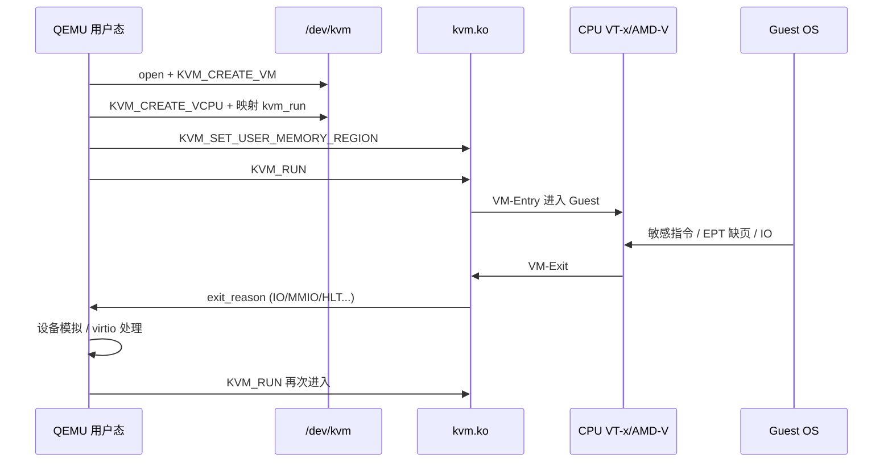
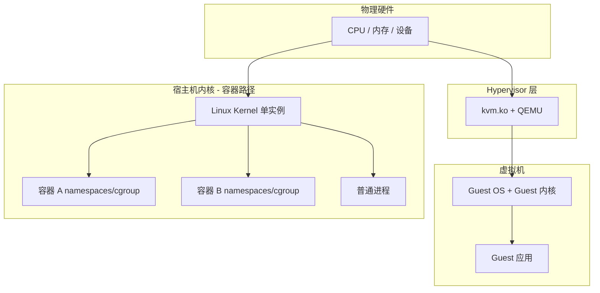

# VM 和容器差在哪一层？从 Hypervisor、特权级到隔离边界一条线讲透

面试里常说「容器是轻量 VM」——可容器里 `CAP_SYS_MODULE` 能 insmod、宿主机和 Guest 共用 `/dev/kvm` 时隔离语义完全不同；云厂商开 VM 报 `KVM not available`、BIOS 里没开 VT-x、嵌套虚拟化失败——这些也不是「装个 VirtualBox 就好」，而是 **CPU 特权级 / Hypervisor 类型 / 硬件辅助扩展** 在某一环没对齐。本文从 **虚拟化动机 → Type1/Type2 Hypervisor → CPU/内存/IO 虚拟化鸟瞰 → 全虚拟化/半虚拟化/硬件辅助 → 与容器隔离边界对照 → /dev/kvm 与 QEMU 角色** 串成一条可验证主线；路径对齐 Linux `virt/kvm/`、`arch/x86/kvm/` 与 QEMU 加速器接口，不重复展开 KVM ioctl 细节（见同目录 KVM 专题篇）。

## 阅读地图

1. **第一层：虚拟化动机与 VM 是什么**——解决「为何要虚拟化、VM 与进程/容器的抽象差在哪」。
2. **第二层：Hypervisor 类型与特权级**——解决「Type1/Type2、Ring -1/0/3、VMM 跑在哪」。
3. **第三层：CPU / 内存 / IO 虚拟化鸟瞰**——解决「三类资源各自虚拟化什么、瓶颈常见在哪」。
4. **第四层：全虚拟化、半虚拟化、硬件辅助**——解决「纯软件 trap、virtio 协作、VT-x/AMD-V 各补哪块」。
5. **第五层：与容器的隔离边界对照**——解决「共享内核 vs 独立 Guest OS、威胁模型差一个数量级」。
6. **第六层：/dev/kvm、QEMU 与排障**——解决「KVM not available、模块、权限、嵌套怎么查」。

## 源码锚点

| 路径 / 符号 | 作用 |
|-------------|------|
| `virt/kvm/kvm_main.c` | `/dev/kvm` 字符设备、VM/vCPU 生命周期 |
| `virt/kvm/kvm.h` | `struct kvm`、`struct kvm_vcpu` |
| `arch/x86/kvm/x86.c` | x86 公共虚拟化路径 |
| `arch/x86/kvm/vmx/vmx.c` | Intel VT-x：VMCS、VM-Entry/Exit |
| `arch/x86/kvm/svm/svm.c` | AMD-V：VMCB、#VMEXIT |
| `arch/x86/include/asm/kvm_host.h` | 架构相关 kvm 回调 |
| `include/uapi/linux/kvm.h` | `KVM_CREATE_VM`、`KVM_RUN` 等 ioctl |
| `Documentation/virt/kvm/api.rst` | KVM 用户态 API 文档 |
| QEMU `accel/kvm/kvm-all.c` | 打开 `/dev/kvm`、创建 VM、vCPU 线程 |
| QEMU `target/i386/kvm/kvm.c` | x86 KVM 特性、CPUID、MSR |
| `drivers/kvm/kvm.ko` | 可加载模块（或 built-in） |
| `/dev/kvm` | 用户态 Hypervisor 控制通道 |
| Intel VT-x / AMD-V | CPU 硬件虚拟化扩展（手册概念） |
| `CLONE_NEW*` / cgroup | 容器隔离（对照用，非 Hypervisor） |

KVM 创建 VM 的 ioctl 入口（`include/uapi/linux/kvm.h` 逻辑）：

```c
#define KVMIO 0xAE
#define KVM_GET_API_VERSION  _IO(KVMIO, 0x00)
#define KVM_CREATE_VM        _IO(KVMIO, 0x01)   /* 返回 VM fd */
#define KVM_CREATE_VCPU      _IO(KVMIO, 0x41)   /* 在 VM fd 上 */
#define KVM_RUN              _IO(KVMIO, 0x80)   /* 在 vCPU fd 上 */
```

QEMU 侧打开 KVM 的典型顺序（`accel/kvm/kvm-all.c` 概念）：

```c
kvm_fd = open("/dev/kvm", O_RDWR);
ioctl(kvm_fd, KVM_GET_API_VERSION, ...);
vm_fd = ioctl(kvm_fd, KVM_CREATE_VM, ...);
vcpu_fd = ioctl(vm_fd, KVM_CREATE_VCPU, ...);
/* mmap kvm_run; ioctl(vcpu_fd, KVM_RUN) 进入 Guest */
```

## 调用链

### 硬件辅助虚拟化：QEMU + KVM 运行 Guest vCPU



### 隔离边界：VM vs 容器 vs 裸进程



## 第一层：虚拟化动机与 VM 是什么

### 为何要虚拟化

| 动机 | 说明 |
|------|------|
| **资源整合** | 多工作负载共享物理机，提高利用率 |
| **隔离** | 故障、安全、版本冲突在 VM 边界内 |
| **迁移与弹性** | 整机状态可迁移（live migration 等） |
| **兼容性** | 跑与物理机不同的 OS/内核版本 |
| **云多租户** | 租户之间独立 Guest，计费与配额清晰 |

虚拟化 **不是** 为了「启动更快」——那是容器侧优势。VM 买的是 **完整硬件抽象 + 独立内核**。

### VM 的抽象

虚拟机 = **虚拟的 CPU + 内存 + IO 设备集合** + 其上运行的 **Guest OS**。Guest 认为自己独占机器，敏感操作（修改页表、执行 IN/OUT、读 MSR）被 Hypervisor 拦截或硬件辅助重定向。

与进程对比：

| 维度 | 进程 | 容器 | VM |
|------|------|------|-----|
| 内核 | 宿主内核 | 宿主内核 | Guest 内核 |
| 隔离单元 | 地址空间 | namespace + cgroup | 虚拟硬件 + Hypervisor |
| 启动 | ms 级 | ms～s 级 | s 级 |
| 镜像 | 二进制+库 | rootfs 分层 | 磁盘镜像含 OS |
| 逃逸面 | 内核漏洞 | 内核 + 配置错误 | Hypervisor + 设备模拟 |

## 第二层：Hypervisor 类型与特权级

### x86 特权级（简化）

传统 ring 模型：**Ring 0** 内核、**Ring 3** 用户态。硬件辅助虚拟化引入 **Root mode / Non-root mode**（Intel VMX：VMX root 跑 VMM，non-root 跑 Guest）。

概念上常把 VMM 称为 **Ring -1**——比 OS 内核更高权限，控制 Guest 的 CPU 状态切换。

### Type 1 vs Type 2

| 类型 | 位置 | 例子 | 特点 |
|------|------|------|------|
| **Type 1（裸金属）** | 直接在硬件上 | Xen Dom0、VMware ESXi、Hyper-V、KVM（Linux 作宿主） | 延迟低，数据中心常见 |
| **Type 2（托管）** | 宿主 OS 之上 | 早期 VirtualBox、VMware Workstation | 易安装，多一层宿主 OS |

**Linux KVM 的特殊性**：KVM 是内核模块（`kvm.ko`），把 Linux 变成 Type1 能力——**KVM 是加速/控制面**，常配合 **QEMU** 做 IO 设备模拟，整体仍是「宿主 Linux + KVM + QEMU」栈，而不是独立 Hypervisor 产品。

### VMM / Hypervisor / Host / Guest 术语

- **Host**：跑 Hypervisor 的物理机及其 OS（KVM 场景即 Linux）。
- **Guest / VM**：被虚拟化的客户机。
- **VMM（Virtual Machine Monitor）**：实现虚拟化的软件（kvm.ko + QEMU 各管一段）。

## 第三层：CPU / 内存 / IO 虚拟化鸟瞰

### CPU 虚拟ization

目标：Guest OS 在 Ring 0 执行「以为在管硬件」的指令，实际被 **trap** 或 **硬件辅助重定向**。

三类经典问题：

1. **敏感指令**：在非特权级执行行为与特权级不同 → 需 trap。
2. **特权寄存器**：CR、MSR、IDT/GDT → VMM 维护影子或硬件切换。
3. **中断/异常**：Guest 中断注入与 Host 中断协调。

硬件辅助（VT-x / AMD-V）让 **多数 Guest 指令原生执行**，仅在 VM-Exit 时进 VMM——性能数量级提升。专题见同目录《CPU 虚拟化 VT-x 与 VM-Exit》。

### 内存虚拟化

Guest 有 **Guest Physical Address (GPA)**，Host 有 **Host Physical Address (HPA)**。中间常经 **Guest Virtual → GPA → HPA** 两级翻译。

- **软件影子页表**：纯软件维护，开销大。
- **EPT（Intel）/ NPT（AMD）**：硬件二级页表 walk，KVM 路径见 `arch/x86/kvm/mmu/`。专题见《内存虚拟化 EPT 与气球》。

### IO 虚拟ization

Guest 访问磁盘/网卡/显卡：

| 方式 | 说明 |
|------|------|
| **完全模拟** | QEMU 模拟 IDE/VGA，慢但兼容 |
| **半虚拟 virtio** | Guest 装 virtio 驱动，与 Host 共享队列 |
| **设备直通 VFIO** | 物理设备直接交给 Guest，性能最好，隔离靠 IOMMU |

专题见《IO 虚拟化 virtio 与 VFIO》。

### 三类资源排障入口

```bash
# CPU：是否在 KVM 里跑
systemd-detect-virt
cat /proc/cpuinfo | grep -E 'vmx|svm'

# 内存：Guest 内 free；Host 上 qemu 进程 RSS
# IO：Guest 内 iostat；Host 上 virtio 队列（依工具而定）
```

## 第四层：全虚拟化、半虚拟化、硬件辅助

### 全虚拟化（Full Virtualization）

- Guest **无需修改**。
- 敏感指令通过 **二进制翻译** 或 **trap-and-emulate** 模拟。
- 代表：早期 VMware 二进制翻译、QEMU 纯软件 TCG。

优点：兼容性好。缺点：CPU 密集工作负载开销大。

### 半虚拟化（Paravirtualization）

- Guest **知情协作**：用 hypercall 代替敏感操作。
- 代表：Xen PV 内核、virtio 驱动（严格说 virtio 是 IO 半虚拟）。

```c
/* 概念：Guest 通过 hypercall 通知 Hypervisor（Xen 风格，非 Linux KVM 必需） */
hypercall(HYPERVISOR_sched_op, ...);
```

Linux 在 KVM 下常用 **virtio** 做 IO 半虚拟，CPU 仍多靠硬件辅助全虚拟。

### 硬件辅助虚拟化

| 厂商 | 扩展 | 核心机制 |
|------|------|----------|
| Intel | VT-x | VMCS、VM-Entry/Exit、EPT |
| AMD | AMD-V (SVM) | VMCB、#VMEXIT、NPT |

启用路径：

1. BIOS/UEFI 打开 **Virtualization Technology** / **SVM Mode**。
2. 内核 `CONFIG_KVM`、加载 `kvm_intel` 或 `kvm_amd`。
3. 用户态 `open("/dev/kvm")` 成功。

### 三者组合（现代 Linux 桌面/云主机常态）

```
CPU：硬件辅助（KVM）
内存：EPT/NPT
磁盘/网络：virtio 半虚拟
显示：virtio-gpu 或 SPICE
遗留设备：QEMU 全模拟兜底
```

对照表：

| 模式 | Guest 修改 | CPU 路径 | IO 典型 |
|------|------------|----------|---------|
| 全虚拟 | 无 | TCG / trap | 模拟 IDE/e1000 |
| 半虚拟 | 需驱动 | 可配合 PV | virtio-* |
| 硬件辅助 | 无（HVM） | VMX/SVM | virtio 或模拟 |

## 第五层：与容器的隔离边界对照

### 容器隔离在哪一层

容器 = **同一 Linux 内核** 上的 **namespace 视图** + **cgroup 限额** + **独立 rootfs**（见同目录 Namespace/Cgroup 篇）。**没有** Guest OS，没有虚拟 CPU 指令级重拦截。

```bash
# 容器与宿主机共享内核版本
docker run --rm alpine uname -r
uname -r   # 通常相同
```

### VM 隔离在哪一层

VM = **独立内核** + **Hypervisor 维护的虚拟硬件**。Guest 内核漏洞 **不直接等于** Host 内核被等同；但仍可能通过 Hypervisor 漏洞、侧信道、错误 passthrough 影响 Host。

### 威胁模型对比（工程表述）

| 风险 | 容器 | VM |
|------|------|-----|
| 内核漏洞 | 直接影响 Host | 先突破 Guest，再攻 Hypervisor |
| 错误配置 `--privileged` | 近似 Host | N/A（不同维度） |
| 多租户密度 | 高 | 相对较低 |
| 启动密度 | 高 | 低 |

**结论**：容器是 **进程级隔离增强**；VM 是 **机器级隔离**。说「容器等于轻量 VM」只在 **打包/交付形态** 上类比，**不能**在隔离语义上等同。

### 何时 VM、何时容器

| 选 VM | 选容器 |
|-------|--------|
| 必须跑不同内核/OS | 同 Linux 微服务 |
| 强合规多租户 | CI/CD、密度优先 |
| 遗留二进制强依赖内核模块 | 12-factor 应用 |
| 需要完整 syscall 兼容边界 | 可接受共享内核 |

中间态 **Kata / gVisor / Firecracker** 见同目录《容器虚拟化 Kata 与沙箱运行时》——「docker 体验 + 更强隔离」。

## 第六层：/dev/kvm、QEMU 与排障

### /dev/kvm 是什么

字符设备，用户态 VMM（QEMU、kvmtool、部分轻量运行时）通过 **ioctl** 创建 VM、映射内存、运行 vCPU。内核侧入口 `virt/kvm/kvm_main.c`。

```bash
ls -l /dev/kvm
# crw-rw----+ 1 root kvm ... /dev/kvm
groups    # 当前用户是否在 kvm 组
```

### QEMU 的角色

QEMU 职责拆分：

1. **机器模型**：芯片组、PCI、virtio 设备。
2. **加速器绑定**：`-accel kvm` 时 CPU 走 KVM；无 KVM 时回退 **TCG** 软件模拟。
3. **IO 路径**：MMIO/PIO 在 VM-Exit 后由 QEMU 处理。
4. **镜像**：qcow2/raw 磁盘、cloud-init 盘。

典型启动：

```bash
qemu-system-x86_64 \
  -accel kvm \
  -cpu host \
  -m 2048 \
  -smp 2 \
  -drive file=disk.qcow2,format=qcow2 \
  -netdev user,id=n1 -device virtio-net-pci,netdev=n1
```

### 本机能力探测命令

```bash
# 1. CPU 是否带虚拟化扩展
grep -E 'vmx|svm' /proc/cpuinfo | head -1

# 2. 内核模块
lsmod | grep kvm
# kvm_intel 或 kvm_amd

# 3. 设备节点
test -r /dev/kvm && echo "kvm readable" || echo "kvm NOT readable"

# 4. KVM API 版本（需 qemu 或 tiny 程序）
qemu-system-x86_64 -accel kvm -machine none -display none -S & sleep 1; kill $! 2>/dev/null

# 5. 若已在 VM 内，是否支持嵌套
cat /sys/module/kvm_intel/parameters/nested 2>/dev/null
cat /sys/module/kvm_amd/parameters/nested 2>/dev/null
```

### 排障：KVM not available

**现象**：QEMU 报 `KVM not available` / `Could not access KVM kernel module`。

**分层查**：

| 步骤 | 命令 / 动作 | 可能结论 |
|------|-------------|----------|
| BIOS | 进固件开 VT-x/SVM | `vmx/svm` 在 cpuinfo 中仍无 |
| 模块 | `modprobe kvm_intel` | 模块缺失 → 装 kernel-modules |
| 设备 | `ls -l /dev/kvm` | 不存在 → udev/模块未加载 |
| 权限 | `groups`, `sudo chmod` 测试 | 用户不在 kvm 组 |
| 云厂商 | 实例类型是否支持嵌套 | 部分 SKU 故意关闭 |
| 冲突 | VirtualBox 占用 VT-x | 卸载或关 Hyper-V（Windows） |

```bash
dmesg | grep -i kvm
# KVM: disabled by BIOS
# kvm: already loaded the other module
```

**disabled by BIOS**：只能改固件，OS 无解。

**已在 VM 内再开 KVM（嵌套）**：

```bash
# Intel 宿主示例（发行版参数名可能为 nested 或 nested=1）
echo options kvm-intel nested=1 | sudo tee /etc/modprobe.d/kvm-intel.conf
sudo modprobe -r kvm_intel kvm && sudo modprobe kvm kvm_intel
```

Guest 内再跑 `grep vmx /proc/cpuinfo` 验证。

### 排障：Performance 极差

1. 确认 **未** 误用 TCG：`ps aux | grep qemu` 看 `-accel kvm`。
2. Guest 磁盘/网卡是否 **virtio**。
3. Host 是否 overcommit 内存 → swap 抖动。
4. CPU pinning / NUMA（生产调优，另篇）。

### 排障：VM 内时间与 CPU

```bash
# Guest
timedatectl
lscpu

# Host 看 kvm steal time（若 guest 支持 paravirt clock）
# /proc/stat 中 steal 列
```

### 与 libvirt 的关系（接口层）

生产常不直接手写 qemu 命令，而用 **libvirt**（`virsh`, `virt-manager`）生成 QEMU 命令行并管理生命周期。底层仍是 **QEMU + KVM**；libvirt 是管理 API，不是第三种 Hypervisor。

```bash
virsh list --all
virsh dumpxml vm1 | grep -E 'kvm|qemu'
```

## 重点知识

### Hypervisor 管「假硬件」，容器 runtime 管「真内核上的视图」

这是 VM 与容器 **最根本** 的分界。排障、选型、安全审计都应先问：**问题发生在 Host 内核、Guest 内核，还是 namespace 层？**

### KVM 不是完整 VMM

**KVM** 提供 CPU/内存虚拟化加速；**QEMU**（或其他）提供设备与机器模型。缺 QEMU 仍可跑极简 Guest（kvmtool），但通用桌面/服务器镜像离不开 QEMU。

### 硬件辅助是桌面/cloud 默认可用前提

无 VT-x/AMD-V 仍可用 TCG 跑 QEMU，但慢一个数量级以上。开发机 `kvm-ok`（ubuntu cpu-checker）可快速体检：

```bash
kvm-ok 2>/dev/null || echo "install cpu-checker or check manually"
```

### virtio 是 IO 性能的关键杠杆

不改 CPU 虚拟化模式，只把 `--device e1000` 换 `--device virtio-net-pci` 常让网络吞吐明显改善——Guest 内需 `virtio_net` 驱动。

## 验证闭环

### 实验 A：确认走 KVM 而非 TCG

```bash
qemu-system-x86_64 -accel kvm -m 512 -cdrom /dev/null -display none -serial none &
QPID=$!
sleep 1
cat /proc/$QPID/cmdline | tr '\0' ' '
grep -E 'kvm|vmx' /proc/$QPID/maps 2>/dev/null | head -3
kill $QPID
```

### 实验 B：对比容器与 VM 内核

```bash
uname -r
docker run --rm debian:bookworm-slim uname -r
# 两者相同 → 容器共享内核

qemu-system-x86_64 ... # 在 Guest 内 uname -r 不同 → 独立内核
```

### 实验 C：最小 KVM ioctl（需 C 或现有工具）

用 `qemu-system-x86_64 -accel kvm -machine accel=kvm:tcg` 强制回退 TCG，感受启动与 CPU 负载差异（`top` 中 qemu CPU 占用）。

### 实验 D：模块与用户组

```bash
sudo modprobe kvm_intel
sudo usermod -aG kvm $USER
# 重新登录后
test -w /dev/kvm && echo OK
```

## 全虚拟化历史与 Xen 简对照

Xen 早期 **PV（半虚拟）** Guest 需打补丁内核；**HVM** 用硬件辅助跑未修改 OS。Linux 现以 **KVM 为主流**，Xen 在部分云与嵌入式仍见。概念对照：

| Xen | KVM/QEMU |
|-----|----------|
| hypercall | ioctl `/dev/kvm` |
| Dom0 管理 | libvirt / 自研 |
| PV drivers | virtio |

详见同目录 Xen 专题，本文不展开 Dom0 工具栈。

## CPU 虚拟化细节入口（不重复展开）

- **VM-Exit 原因**：CPUID、MSR、EPT violation、外部中断。
- **内核路径**：`arch/x86/kvm/vmx/vmx.c` 中 `vmx_handle_exit`。
- **观测**：`perf kvm`（内核配置允许时）。

## 内存虚拟化细节入口

- **EPT violation** → mmio 或 page fault 模拟。
- **大页**：`hugetlbfs` 降低 TLB miss。
- **气球**：`virtio-balloon` 回收 Guest 内存（云主机超卖）。

## IO 虚拟化细节入口

- **virtio 队列**：vring、kick/notify。
- **VFIO**：`vfio-pci` 绑定物理网卡给 Guest。
- **排障**：Guest 无 virtio 驱动 → 回退模拟设备极慢。

## 云主机与裸金属差异

| 环境 | 注意 |
|------|------|
| 公有云 VM | 嵌套 KVM 默认关；metadata 服务 |
| 裸金属 | 全特性；注意 IOMMU 分组 |
| WSL2 | 轻量 VM 跑 Linux，与原生 KVM 栈不同 |

## 常见误区

1. **「装了 QEMU 就等于有 KVM」**——QEMU 可单独 TCG；KVM 需模块与 `/dev/kvm`。
2. **「容器和 VM 可以互相替代」**——隔离与密度 trade-off 不同。
3. **「Type2 一定比 Type1 慢」**——KVM 在内核里，性能可接近裸金属；关键看 IO 与嵌套。
4. **「关闭 Hyper-V 与 Linux KVM 无关」**——双系统机器上 Windows Hyper-V 占用 VT-x 会导致 VirtualBox/KVM 冲突。
5. **「Guest 里看到的 CPU 就是物理 CPU 型号」**——QEMU 可伪装 `-cpu qemu64`；`host-passthrough` 才暴露宿主特性。

## 命令与配置速查

| 目的 | 命令 |
|------|------|
| CPU 虚拟化扩展 | `grep vmx /proc/cpuinfo` |
| 加载 KVM | `sudo modprobe kvm_intel` |
| 设备权限 | `sudo chmod 666 /dev/kvm`（临时）/ 加 kvm 组（推荐） |
| QEMU KVM 启动 | `qemu-system-x86_64 -accel kvm ...` |
| 是否虚拟机 | `systemd-detect-virt` |
| libvirt 列表 | `virsh list --all` |
| 内核 KVM 文档 | `ls Documentation/virt/kvm/` |

## 与后续章节关系

- **KVM ioctl 全链**：同目录《KVM 从 ioctl 到 QEMU》。
- **VM-Exit/EPT/virtio 深入**：CPU/内存/IO 三篇专题。
- **沙箱容器**：Kata/gVisor 在容器体验上补 VM 级隔离。
- **容器 Namespace**：隔离边界对照的另一半。

## 安全与虚拟化

- **Hypervisor 漏洞**（如历史 VENOM、VM escape 研究）影响所有 VM。
- **侧信道**（Spectre/Meltdown 类）需 microcode + 内核缓解，Guest/Host 都受影响。
- **设备直通** 绕过软件模拟，但 IOMMU 分组错误可能 DMA 攻击。
- **嵌套虚拟化** 扩大攻击面，云厂商常默认关闭。

## 性能调优起点（概述）

```xml
<!-- libvirt domain 片段：virtio + 多队列 -->
<interface type='network'>
  <model type='virtio'/>
  <driver name='vhost' queues='4'/>
</interface>
<disk type='file' device='disk'>
  <driver name='qemu' type='qcow2' cache='none' io='native'/>
  <target dev='vda' bus='virtio'/>
</disk>
```

- **CPU**：`-cpu host` 或 `host-passthrough` 暴露宿主特性（迁移性下降）。
- **磁盘**：`cache=none` + `io=native` 减缓存层。
- **网络**：vhost-net 减拷贝。

## 总结主线

虚拟化在 **Hypervisor 层伪造整台机器**，Guest 跑 **独立内核**；容器在 **同一内核** 上切 namespace/cgroup。**Type1/Type2** 描述 VMM 部署形态；**全虚拟/半虚拟/硬件辅助** 描述 CPU/IO 实现组合。Linux 常态是 **KVM + QEMU + virtio**。排障 `KVM not available` 从 **BIOS → 模块 → /dev/kvm → 权限 → 嵌套策略** 顺序查，不要先在 Guest 镜像里打转。
