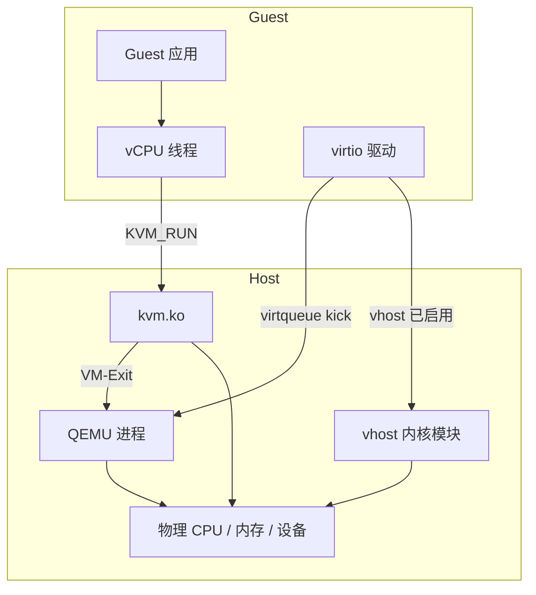
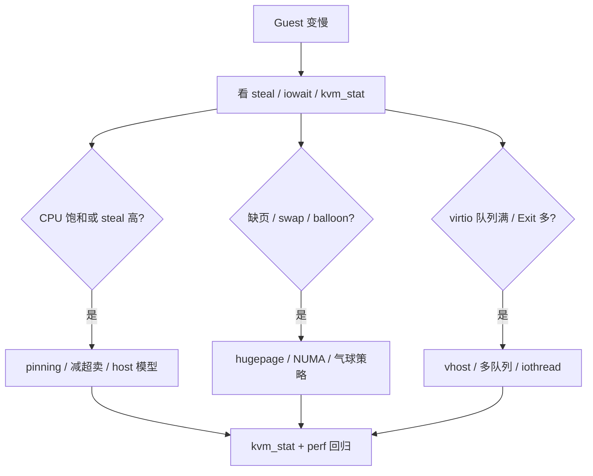

# Guest 很慢却不是缺 CPU？从 vCPU 超卖、CPU pinning、巨页到 IO 线程调优

`top` 里 Guest 的 vCPU 利用率只有 30%，业务却像「缺 CPU」一样卡顿；宿主机 CPU 明明还有余量，`steal time` 却长期偏高；绑核后延迟反而变大；开了 `-cpu host` 和 hugepage，磁盘 P99 仍被 IO 线程拖成长尾——这类现象很少是「再塞两个 vCPU 就能好」，而出在 **瓶颈分类错了**：CPU 超卖与调度抖动、内存翻译与 TLB、virtio/vhost 数据面、以及 **pinning / NUMA / 巨页 / IO 线程** 没在同一套观测里对齐。本文沿 **瓶颈分类 → CPU pinning 与 isolcpus → 巨页与 EPT → virtio/vhost 与 IO 线程 → balloon/NUMA → kvm_stat/perf 观测 → libvirt/QEMU 配置与排障** 一条主线讲透；路径对齐 Linux `virt/kvm/`、`drivers/vhost/`、QEMU `accel/kvm/` 与 libvirt `cputune`（以本机内核/QEMU 版本为准）。

## 阅读地图

1. **第一层：瓶颈分类**——解决「Guest 慢时先判 CPU、内存、IO 还是调度，避免 blind tuning」。
2. **第二层：vCPU 超卖与 CPU pinning**——解决「steal time、绑核、emulatorpin、isolcpus 各自作用面」。
3. **第三层：巨页、THP 与 EPT**——解决「`-mem-path`、hugetlbfs、`nr_hugepages` 与 TLB/EPT 缺页的关系」。
4. **第四层：virtio 队列与 vhost**——解决「多队列、iothread、vhost-net/blk 如何把 Exit 从数据面挪走」。
5. **第五层：balloon 与 NUMA**——解决「内存超额认购、气球回收、vCPU 与 RAM 同 NUMA 节点」。
6. **第六层：观测与排障闭环**——解决「kvm_stat、perf、`/proc/interrupts` 如何把调优前后钉成可回归数据」。

## 源码锚点

| 路径 | 作用 |
|------|------|
| `virt/kvm/kvm_main.c` | KVM VM/vCPU 生命周期、统计计数导出 |
| `arch/x86/kvm/x86.c` | vCPU 运行、`kvm_vcpu_ioctl_run`、退出原因 |
| `arch/x86/kvm/vmx/vmx.c` | Intel VM-Exit 处理、EPT violation |
| `arch/x86/kvm/mmu/mmu.c` | MMU 缺页、大页 SPTE 建立 |
| `include/uapi/linux/kvm.h` | `KVM_CAP_*`、内存槽、CPU 特性 |
| `drivers/vhost/vhost.c` | vhost 核心、virtqueue 内核处理 |
| `drivers/vhost/vhost_net.c` | vhost-net 数据面 |
| `drivers/vhost/vhost_scsi.c` 等 | 块/SCSI vhost 后端 |
| `include/uapi/linux/vhost.h` | `VHOST_SET_VRING_*` ioctl |
| `include/uapi/linux/virtio_ring.h` | virtqueue 环结构 |
| `include/uapi/linux/virtio_balloon.h` | balloon 特性与配置 |
| `drivers/virtio/virtio_balloon.c` | Guest 侧气球驱动 |
| QEMU `accel/kvm/kvm-all.c` | KVM 加速器、vCPU 线程 |
| QEMU `system/cpus.c` | `-smp`、CPU 拓扑 |
| QEMU `block/` | iothread、AIO 后端 |
| libvirt `src/conf/domain_conf.c` | XML `cputune`、`memoryBacking` |
| `Documentation/admin-guide/mm/hugetlbpage.rst` | 大页预留与观测 |
| `tools/kvm/kvm_stat/kvm_stat` | VM-Exit 等统计（包名因发行版而异） |

## 调用链总览

### Guest 请求到 Host 资源的性能路径



### 调优决策：先分类再动刀



---

## 一、虚拟机性能瓶颈分类

### 1.1 四类瓶颈与典型症状

| 类型 | Guest 侧信号 | Host 侧信号 | 常见误判 |
|------|-------------|-------------|----------|
| **CPU** | 单核 100%、run queue 长 | 宿主机某核打满、steal 高 | 再加 vCPU（超卖更严重） |
| **内存** | swap、major fault、OOM | `kvm_mmu_page_fault` 多、RSS 涨 | 只加 RAM 不开大页 |
| **IO** | iowait 高、块设备 await 大 | mmio/io exit、`qemu-io` 慢 | 换 CPU 模型不治本 |
| **调度** | 延迟抖动、P99 长尾 | vCPU 在不同 pCPU 迁移 | 以为 Guest 算力不足 |

Guest 内 `top` 的 `%Cpu(s)` 与 Host 上 **按 vCPU 线程** 看利用率不是一回事：KVM 的 vCPU 是 Host 上的 **pthread**，Guest 里「空闲」只说明 Guest OS 调度器没派活，Host 仍可能在 **VM-Exit 处理、IO 模拟、内存缺页** 上耗 CPU。

### 1.2 steal time：超卖的直接证据

在 Guest 里（需 virt 驱动支持）：

```bash
# Guest 内
top    # 看 %st
vmstat 1
mpstat -P ALL 1
```

`%st`（steal）表示 **本 vCPU 就绪却被 Hypervisor 挪走** 的时间比例。长期 >5%～10% 且业务延迟敏感，应怀疑 **Host 超卖** 或 **同核竞争**，而不是 Guest 内再调 `sysctl`。

Host 上对照：

```bash
# 找到 VM 的 vCPU 线程（qemu pid）
ps -eLo pid,tid,psr,pcpu,comm | grep "CPU [0-9]" | head
# 或
virsh vcpuinfo <domain> --live
```

### 1.3 VM-Exit：CPU「看起来不忙」的隐藏消耗

每次 Guest 访问敏感资源（IO、某些 MSR、EPT 缺页）会 **VM-Exit** 到 Host。Exit 次数多，Guest 内 CPU 利用率仍可能偏低，但 Host 上 QEMU/kvm 很忙。

```bash
# 需要 debugfs 与权限
sudo kvm_stat -1
# 或
sudo cat /sys/kernel/debug/kvm/*/exits 2>/dev/null
```

关注字段（名称随内核版本略有差异）：`halt`、`io`、`mmio`、`irq`、`nmi`、`ept_misconfig` 等。IO 型 Exit 多 → 查 virtio/vhost；EPT/缺页相关多 → 查内存与大页。

### 1.4 分层观测命令速查

```bash
# Host：VM 整体
virsh dominfo <name>
virsh domstats <name> --cpu-total --balloon --vm

# Host：QEMU 进程
pid=$(pgrep -f "qemu.*<name>")
perf top -p $pid
perf stat -p $pid sleep 10

# Guest：IO
iostat -xz 1
pidstat -d 1

# 中断是否打满错误 CPU
cat /proc/interrupts
grep -i virtio /proc/interrupts
```

---

## 二、vCPU 模型、超卖与 CPU pinning

### 2.1 QEMU `-cpu` 与特性暴露

```bash
# 常见：尽量接近 Host 特性，利于 KVM 硬件加速路径
-cpu host,hv_relaxed,hv_spinlocks=0x1fff,hv_vapic,hv_time

# 迁移兼容：指定较老模型，可能损失 AES/AVX 等
-cpu Haswell-v4
```

源码侧：QEMU `target/i386/kvm/kvm.c` 通过 `KVM_SET_CPUID2` 等 ioctl 把特性位交给 `kvm.ko`；Guest 看到的 CPUID 与 **迁移、Live patch、安全缓解** 都相关。性能场景优先 **host passthrough**（需接受迁移约束）；混部集群统一型号时用 **named model**。

libvirt XML 片段：

```xml
<cpu mode='host-passthrough' check='none'>
  <feature policy='require' name='vmx'/>
</cpu>
```

### 2.2 超卖：vCPU 数量 vs 物理核

规则直觉：**活跃 vCPU 总数不宜长期超过 Host 可Dedicated 的 pCPU**（还要扣掉 Dom0、存储网络、中断）。数据库、Java 堆、编译机各自占满核时，16 vCPU 的 VM 跑在 8 核 Host 上必然 steal。

排障步骤：

1. Guest `%st` + Host `virsh vcpuinfo` 看 vCPU 是否挤在同一 pCPU。
2. `mpstat -P ALL` 看 Host 是否已全核饱和。
3. 降 vCPU 数或 **pinning** 有时比加 vCPU 更有效（减少 cache 迁移）。

### 2.3 CPU pinning：vCPU 绑 pCPU

**目的**：减少 vCPU 在 pCPU 间迁移带来的 cache/TLB 抖动；与 **NUMA** 联用时把 vCPU 绑到 RAM 所在节点。

libvirt `cputune`：

```xml
<cputune>
  <vcpupin vcpu='0' cpuset='4'/>
  <vcpupin vcpu='1' cpuset='5'/>
  <vcpupin vcpu='2' cpuset='6'/>
  <vcpupin vcpu='3' cpuset='7'/>
  <emulatorpin cpuset='0-1'/>
</cputune>
```

| 元素 | 绑定对象 | 说明 |
|------|----------|------|
| `vcpupin` | 每个 vCPU 线程 | Guest 算力核 |
| `emulatorpin` | QEMU 主线程/部分辅助 | 避免与 vCPU 抢同一核 |
| `iothreadpin` | 磁盘 IO 线程 | 块设备延迟敏感时常用 |

QEMU 命令行等价：

```bash
-taskset -cp 4,5,6,7 qemu-system-x86_64 ... \
  -object iothread,id=io1 -device virtio-blk-pci,iothread=io1 ...
```

验证：

```bash
virsh vcpuinfo myvm --live
taskset -cp $(pgrep -f "qemu.*myvm")
```

### 2.4 isolcpus：Host 内核隔离

**注意**：`isolcpus=` 是 **Host 启动参数**，让通用调度器少往指定核放任务；**不会自动**把 IRQ、QEMU 线程迁走。常与 VM vCPU pinning 配合：把 4–7 核 isolcpus，VM vCPU pin 到 4–7，Host 后台任务留在 0–3。

```bash
# /etc/default/grub
GRUB_CMDLINE_LINUX="isolcpus=4-7 nohz_full=4-7 rcu_nocbs=4-7"

sudo update-grub && reboot
cat /proc/cmdline
```

IRQ 仍可能落在 isolcpus 上——必须再查 `/proc/interrupts` 并 `echo cpu > /proc/irq/N/smp_affinity_list`（或用 irqbalance 策略）。**只 pin vCPU 不处理 IRQ** 是绑核后延迟反升的常见原因。

### 2.5 `cpuset` 与 cgroup v2

systemd/libvirt 可把 VM  cgroup 限制在一组 CPU：

```bash
virsh cgroup myvm
# 或
cat /sys/fs/cgroup/machine.slice/machine-qemu/*/cpu.max
```

与 `vcpupin` 区别：`vcpupin` 是 **硬亲和**；cgroup 是 **上限/范围**。二者可叠加，别配成冲突集合。

---

## 三、巨页、THP 与 EPT

### 3.1 为何虚拟化特别吃 TLB

Guest 访问内存：**GVA → GPA（Guest 页表）→ HPA（EPT/NPT）**。两层翻译放大 TLB miss 代价。4K 小页下，大内存工作集容易把 **EPT 缺页** 和 **TLB shootdown** 推成热点（`arch/x86/kvm/mmu/mmu.c` 建 SPTE 路径）。

### 3.2 静态大页 hugetlbfs

Host 预留：

```bash
grep Huge /proc/meminfo
# HugePages_Total / Free / Size

# 例如 2MB 页，预留 4096 页 ≈ 8GB
echo 4096 | sudo tee /proc/sys/vm/nr_hugepages

# 永久
echo 'vm.nr_hugepages=4096' | sudo tee /etc/sysctl.d/99-huge.conf
sudo sysctl -p /etc/sysctl.d/99-huge.conf
```

挂载：

```bash
mkdir -p /mnt/hugepages
mount -t hugetlbfs nodev /mnt/hugepages
```

QEMU 使用大页 backing：

```bash
qemu-system-x86_64 \
  -m 8G \
  -mem-path /mnt/hugepages/myvm.mem \
  -mem-prealloc \
  ...
```

libvirt：

```xml
<memoryBacking>
  <hugepages/>
  <nosharepages/>
  <locked/>
</memoryBacking>
```

| 选项 | 作用 |
|------|------|
| `hugepages` | RAM 来自 hugetlb |
| `mem-prealloc` / 启动时分配 | 避免运行时 fault |
| `locked` | mlock，防 swap |
| `nosharepages` | 禁止 mergeable，利于安全/稳定 |

验证大页是否被 VM 吃掉：

```bash
grep Huge /proc/meminfo   # Free 下降
virsh dumpxml myvm | grep -A5 memoryBacking
```

### 3.3 THP 与虚拟化

**Transparent Huge Pages**（Host `always`/`madvise`）对 **Host 普通进程** 友好，对 **固定 hugetlb 的 VM** 不是替代品。THP 合并/拆分可能带来 **延迟抖动**；KVM Host 上常见建议：

- VM RAM 用 **显式 hugetlb**（上面 `-mem-path`）。
- 对延迟敏感 Host，评估 `echo never > /sys/kernel/mm/transparent_hugepage/enabled`（权衡其他 workload）。

Guest 内 THP 由 Guest 内核自己决定，与 Host hugetlb **独立**。

### 3.4 EPT 大页是否生效

开了 hugetlb 仍慢时，查 KVM 是否建立 **large SPTE**（内核版本不同 tracepoint 名不同）：

```bash
sudo kvm_stat -1
# 结合 perf（需 kvm  tracepoint）
sudo perf stat -e 'kvm:kvm_mmu_*' -a sleep 5 2>/dev/null | head
```

若 fault 仍密集：检查 **内存槽 alignment**、是否 **balloon 回收** 后碎片化、是否 **嵌套虚拟化** 削弱大页路径。

### 3.5 内存超额与 swap

Host 超卖内存 + 无 balloon 约束 → Host swap → 全体 VM 抖动。比加 vCPU 更隐蔽。看 Host：

```bash
free -h
vmstat 1
cat /proc/meminfo | grep -E 'Swap|Huge'
```

---

## 四、virtio 队列、vhost 与 IO 线程

### 4.1 从模拟到 vhost

纯 QEMU MMIO 模拟：每次寄存器访问 → VM-Exit → 用户态模拟，磁盘/网卡天花板低。

**virtio**：Guest 驱动与 Host 后端共享 **virtqueue**（`include/uapi/linux/virtio_ring.h`），批量描述符，Exit 次数大降。

**vhost**：后端进内核（`drivers/vhost/vhost_net.c` 等），数据面绕过 QEMU 用户态，进一步减 copy 与上下文切换。

libvirt 网络常用：

```xml
<interface type='network'>
  <model type='virtio'/>
  <driver name='vhost' queues='4'/>
</interface>
```

块设备多队列 + iothread：

```xml
<devices>
  <disk type='file' device='disk'>
    <driver name='qemu' type='qcow2' cache='none' io='native' iothread='1' queues='4'/>
    <source file='/var/lib/libvirt/images/disk.qcow2'/>
    <target dev='vda' bus='virtio'/>
  </disk>
  <iothreads>
    <iothread id='1'/>
  </iothreads>
</devices>
```

### 4.2 队列数怎么选

- **virtio-net `queues=N`**：通常 ≤ Guest 内 RSS 队列、≤ Host 物理队列；需 Guest 驱动 **多队列支持**（`ethtool -l eth0`）。
- **virtio-blk `queues`**：多队列对 **多并发随机 IO** 有帮助；单流顺序读收益有限。
- 队列过多 → 空转与锁竞争，需 **pin iothread** 到独立核。

### 4.3 vhost-net 与 vhost-user

| 模式 | 数据路径 | 典型场景 |
|------|----------|----------|
| vhost-net + tap | 内核 tap ↔ Guest | 简单桥接 |
| vhost-user + OVS/DPDK | 用户态 switch | 高性能 SDN |
| 无 vhost，纯 QEMU | 用户态 | 兼容/调试 |

确认 vhost 是否启用：

```bash
lsmod | grep vhost
grep -i vhost /proc/interrupts
virsh domxml-to-native qemu-argv myvm | tr ' ' '\n' | grep vhost
```

### 4.4 cache / io 模式

```xml
<driver cache='none' io='native'/>
```

| cache | 含义 | 性能 |
|-------|------|------|
| `none` | 绕过 Host 页 cache（O_DIRECT 语义） | 数据库常见 |
| `writeback` | 默认，Host 缓存 | 吞吐高，断电风险 |
| `directsync` | 直写 | 中间折中 |

`io='native'` 走 Linux AIO；`threads` 用线程池。延迟敏感 + NVMe 常选 `native` + `iothread`。

### 4.5 `-cpu host` 与 IO 无关但常一起出现

`-cpu host` 解决 **指令级加速**；IO 瓶颈要单独看 virtio/vhost。勿把「上了 host CPU 模型」当成 IO 调优完成。

---

## 五、virtio-balloon 与 NUMA

### 5.1 balloon 机制

`virtio-balloon`（`include/uapi/linux/virtio_balloon.h`）让 Host 向 Guest **回收空闲页**，提高 Host 内存超卖能力。inflate 过猛 → Guest 内 **kswapd** 活跃 → 应用延迟尖刺。

libvirt：

```xml
<memballoon model='virtio'>
  <stats period='10'/>
</memballoon>
```

观测：

```bash
virsh domstats myvm --balloon
virsh balloon myvm  # 手动设目标（慎用生产）
```

Guest 内：

```bash
grep -i balloon /proc/vmstat
free -h
```

调优原则：延迟敏感 VM **限制 balloon 目标** 或关闭；计算密集批处理可开 stats 做容量规划。

### 5.2 Host NUMA 与 VM 拓扑

跨 NUMA 节点取内存 ≈ 远程延迟。理想：**vCPU、pinned pCPU、backing RAM 同节点**。

```bash
numactl -H
virsh numatune myvm
```

libvirt：

```xml
<numatune>
  <memory mode='strict' nodeset='0'/>
</numatune>
<vcpu placement='static' cpuset='0-3'>4</vcpu>
```

QEMU `-numa` 在 Guest 内呈现 NUMA 拓扑（多 socket 仿真），与 **Host NUMA 绑核** 是两层概念，别混。

### 5.3 CPU 拓扑与 cache

```xml
<cpu mode='host-passthrough'>
  <topology sockets='1' dies='1' cores='4' threads='1'/>
</cpu>
```

错误拓扑（如把单核 Host 报成多 socket）影响 Guest **调度与 NUMA policy**，表现为「核很多却慢」。

---

## 六、perf、kvm_stat 与 `/proc/interrupts`

### 6.1 kvm_stat 读 Exit 构成

```bash
# 安装（发行版包名示例）
# RHEL/Fedora: qemu-kvm-tools / kernel-tools
sudo kvm_stat -1

# debugfs 原始计数
sudo mount -t debugfs none /sys/kernel/debug 2>/dev/null
sudo cat /sys/kernel/debug/kvm/*/exits
```

解读：

- **halt** 高：Guest idle 正常；若业务忙仍高 → Guest 可能在 spin-wait。
- **mmio/io** 高：IO 虚拟化路径；转 vhost/多队列。
- **irq** 高：设备中断注入多；查 virtio 中断合并、队列数。

### 6.2 perf 盯 QEMU 与 vCPU

```bash
QPID=$(pgrep -f 'qemu-system.*myvm')
sudo perf record -g -p $QPID -- sleep 30
sudo perf report

# 看 KVM 相关（内核支持时）
sudo perf top -e kvm:kvm_exit -a
```

对比调优前后 **同一 workload** 的 `perf report` top 符号：若从 `kvm_vcpu_ioctl` / MMIO 模拟切到 `vhost_*`，说明 IO 路径对了。

### 6.3 `/proc/interrupts` 与 virtio IRQ

```bash
watch -n1 'cat /proc/interrupts | head -1; cat /proc/interrupts | grep -E "virtio|vhost"'
```

某 CPU 上 virtio IRQ 计数疯涨 → 考虑 **IRQ affinity** 与 **vCPU/iothread pin** 错开；或与 `isolcpus` 冲突。

### 6.4 Guest 内 perf（可选）

```bash
# Guest 内
perf stat -e cycles,instructions,cache-misses,context-switches sleep 10
```

Guest perf 看的是 **虚拟 PMU**（依赖 KVM 透传），与 Host 上抓 QEMU 互补。

---

## 七、配置示例：libvirt 域 XML 片段

综合 **pinning + 大页 + virtio + vhost + iothread** 的生产向骨架（按机器改 cpuset/路径）：

```xml
<domain type='kvm'>
  <vcpu placement='static' cpuset='4-7'>4</vcpu>
  <cputune>
    <vcpupin vcpu='0' cpuset='4'/>
    <vcpupin vcpu='1' cpuset='5'/>
    <vcpupin vcpu='2' cpuset='6'/>
    <vcpupin vcpu='3' cpuset='7'/>
    <emulatorpin cpuset='0-1'/>
    <iothreadpin iothread='1' cpuset='2'/>
  </cputune>
  <memory unit='GiB'>8</memory>
  <memoryBacking>
    <hugepages/>
    <nosharepages/>
    <locked/>
  </memoryBacking>
  <cpu mode='host-passthrough' check='none'/>
  <iothreads>
    <iothread id='1'/>
  </iothreads>
  <devices>
    <disk type='file' device='disk'>
      <driver name='qemu' type='qcow2' cache='none' io='native' iothread='1' queues='4'/>
      <source file='/var/lib/libvirt/images/data.qcow2'/>
      <target dev='vda' bus='virtio'/>
    </disk>
    <interface type='bridge'>
      <source bridge='br0'/>
      <model type='virtio'/>
      <driver name='vhost' queues='4'/>
    </interface>
    <memballoon model='virtio'>
      <stats period='10'/>
    </memballoon>
  </devices>
</domain>
```

Host 侧准备：

```bash
echo 4096 | sudo tee /proc/sys/vm/nr_hugepages
grep Huge /proc/meminfo
# GRUB isolcpus 与 IRQ 迁移按第二节执行
virsh define myvm.xml
virsh start myvm
```

---

## 八、排障案例

### 8.1 现象：Guest CPU 不高，应用 P99 很高

**查**：

```bash
# Guest
mpstat -P ALL 1   # %st
# Host
virsh vcpuinfo myvm --live
sudo kvm_stat -1
```

**常见根因**：Host 超卖 steal；vCPU 与 emulator 同核；IRQ 风暴在 pinned 核。

**改**：减并发 VM / 降 vCPU；`emulatorpin` 与 `vcpupin` 分离；IRQ affinity；必要时 isolcpus。

### 8.2 现象：绑核后更慢

**查**：

```bash
cat /proc/interrupts
taskset -cp $(pgrep qemu)
```

**根因**：isolcpus 核仍承担 **网卡/virtio IRQ** + **vCPU** + **iothread** 三重竞争。

**改**：IRQ 迁到非 isolcpus；iothread 独立核；或放宽 pinning。

### 8.3 现象：大页配置了，内存仍 fault 多

**查**：

```bash
grep Huge /proc/meminfo
virsh dumpxml myvm | grep -A3 memoryBacking
sudo kvm_stat -1
```

**根因**：未 `mem-prealloc`；balloon 回收；qcow2 外层文件不在 hugetlb（backing 仅 RAM 区域）。

**改**：`-mem-prealloc`；限制 balloon；关键 VM 用 raw on LVM/NVMe + hugetlb。

### 8.4 现象：磁盘慢，CPU 不高

**查**：

```bash
sudo kvm_stat -1    # mmio/io
iostat -xz 1
virsh dumpxml myvm | grep -E 'driver|iothread|queues'
```

**改**：virtio-blk + `iothread` + `queues` + `cache=none`；Host 存储层排除 copy-up 瓶颈；考虑 vhost-scsi 或直透 NVMe（VFIO，另文）。

### 8.5 现象：网络吞吐上不去

**查**：

```bash
ethtool -l eth0    # Guest 队列
grep vhost /proc/interrupts
iperf3 -P 4 ...
```

**改**：`queues=4` + Guest RSS；Host `vhost`；IRQ/RPS 分散；MTU/ offload 与物理网卡对齐。

---

## 九、与相关专题的边界

| 主题 | 本文覆盖 | 延伸阅读（同目录专篇） |
|------|----------|------------------------|
| EPT/气球细节 | 巨页与 fault 观测 | 内存虚拟化 EPT 与气球 |
| virtio/VFIO 协议 | 队列与 vhost 调优 | IO 虚拟化 virtio 与 VFIO |
| KVM ioctl 建 VM | 仅性能相关引用 | KVM 从 ioctl 到 QEMU |
| 嵌套虚拟化 | 提及大页/Exit 代价 | CPU 虚拟化 VT-x 与 VM-Exit |

---

## 十、命令闭环：一次完整回归

```bash
# 0) 基线记录
date; virsh dominfo myvm > /tmp/before.txt
sudo kvm_stat -1 > /tmp/kvm_stat_before.txt

# 1) 负载（Guest 内按业务替换）
# stress-ng --cpu 4 --timeout 60s &
# fio ... &

# 2) 观测窗口
sleep 60
sudo kvm_stat -1 > /tmp/kvm_stat_under.txt
virsh domstats myvm --cpu-total --balloon >> /tmp/under.txt

# 3) 改 XML：pinning / hugepage / vhost / iothread
virsh shutdown myvm && virsh start myvm

# 4) 同负载再测
sudo kvm_stat -1 > /tmp/kvm_stat_after.txt
diff /tmp/kvm_stat_under.txt /tmp/kvm_stat_after.txt
```

把 **Exit 类型分布、Guest steal、iowait、业务 P99** 四列写进变更单，避免「感觉变快了」无法复盘。

---

## 十一、设计直觉：为何这些手段有效

**CPU pinning** 换 **迁移成本** 为 **可预测独占**；在 steal 已高的 Host 上，先解决 **超卖** 再 pin，否则 pin 到 busy 核仍慢。

**hugetlb** 换 **内存碎片与预留** 为 **更少 EPT 项与 TLB miss**；对 GB 级 RAM 的 VM，常是内存侧最稳杠杆。

**vhost** 换 **内核模块复杂度** 为 **用户态 QEMU 热点移除**；安全边界仍要信任 Host 内核。

**balloon** 换 **Host 内存利用率** 为 **Guest 回收抖动**；SLA VM 应保守。

**NUMA** 换 **配置复杂度** 为 **本地内存带宽**；双路 Host 上忽视 NUMA 相当于人为降频。

---

## 十二、常见配置反模式

1. **vCPU = Host 逻辑核 × N（N>1）** 且全 VM 同时跑满 → 必然 steal。
2. **只开 hugepage 不 prealloc** → 启动后仍见 fault 尖刺。
3. **pin vCPU 到 isolcpus 核但不迁 IRQ** → 延迟尾部更大。
4. **virtio 单队列 + 多线程应用** → Guest 内单队列成瓶颈。
5. **cache=writeback + 数据库** → Host cache 掩盖不了 Guest fs 语义，故障时丢数据风险。
6. **balloon 无上限** 于延迟敏感 VM → kswapd 周期性唤醒。
7. **`-cpu host` 在异构集群迁移** → 迁移失败或静默降特性。

---

## 十三、QEMU 命令行速查（无 libvirt）

```bash
qemu-system-x86_64 \
  -enable-kvm \
  -cpu host \
  -smp 4,sockets=1,cores=4,threads=1 \
  -m 8192 \
  -mem-path /mnt/hugepages/guest.mem \
  -mem-prealloc \
  -object memory-backend-file,id=mem,size=8G,mem-path=/mnt/hugepages/guest.mem,prealloc=on \
  -numa node,memdev=mem \
  -drive file=disk.qcow2,if=none,id=drive0,cache=none,aio=native \
  -device virtio-blk-pci,drive=drive0,iothread=io0,num-queues=4 \
  -object iothread,id=io0 \
  -netdev tap,id=n0,vhost=on,vhostforce=on \
  -device virtio-net-pci,netdev=n0,mq=on,vectors=10 \
  -device virtio-balloon-pci,id=balloon0 \
  ...
```

与 libvirt 生成 XML 交叉验证：

```bash
virsh dumpxml myvm > /tmp/dump.xml
virsh domxml-to-native qemu-argv myvm
```

---

## 十四、内核参数与 sysfs 索引

| 接口 | 用途 |
|------|------|
| `/proc/sys/vm/nr_hugepages` | 预留 2M/1G 大页数量 |
| `/sys/kernel/mm/hugepages/` | 各阶 hugepage 统计 |
| `/sys/kernel/mm/transparent_hugepage/` | THP 策略 |
| `/sys/kernel/debug/kvm/*/exits` | VM-Exit 计数 |
| `/proc/cmdline` | `isolcpus`/`nohz_full` |
| `/proc/interrupts` | IRQ  per-CPU 分布 |

---

## 十五、小结

Guest 性能问题要先 **分类**：CPU steal 与 Exit、内存 fault 与 balloon、IO 队列与 vhost、调度与 IRQ 是否同核。**CPU pinning** 与 **isolcpus** 解决可预测独占，但必须配合 **IRQ 与 emulator/iothread 分核**。**巨页** 降低 EPT/TLB 压力，要 **prealloc + 观测 kvm_stat** 确认。**virtio 多队列 + vhost + iothread** 是数据面主杠杆。**NUMA** 与 **balloon** 决定内存侧是带宽还是抖动。用 **kvm_stat、perf、`/proc/interrupts`、Guest steal** 做调优前后闭环，比逐项抄 XML 更可靠。

合并自 `articles/虚拟化技术/chapters/065～069`（性能优化系列）；与内存/IO/KVM 专篇交叉处已标边界，避免重复堆砌 EPT 协议细节。
