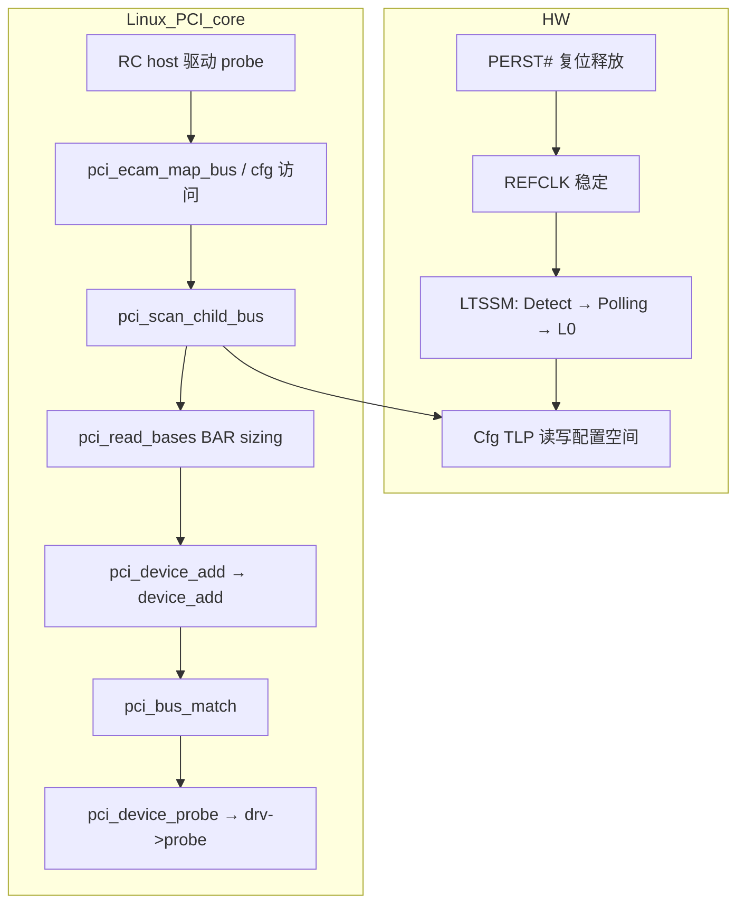
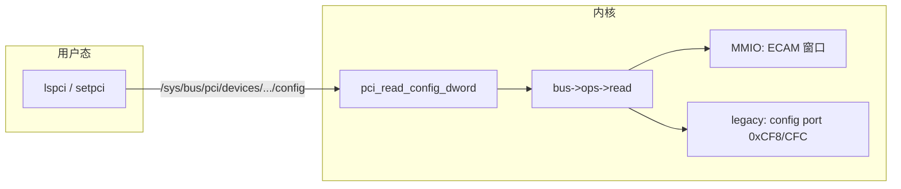
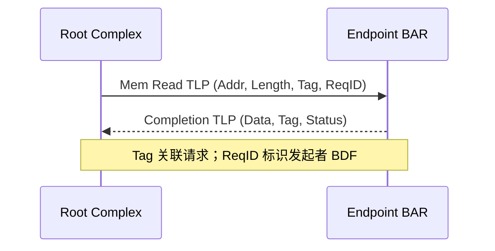

# PCI 与 PCIe 硬件原理、配置空间/BAR 与 Linux 驱动完整篇：从 LTSSM、TLP 到 ECAM 与 probe

板卡 `lspci -vvv` 能看到设备，BAR 却全是 0；链路训练卡在 Detect、RC 下挂 EP 永远枚举不到；驱动 probe 里 `pci_iomap` 成功但读寄存器全 0xff——这类问题往往不在驱动写法，而在 PCI/PCIe 硬件分层、配置空间语义、资源分配顺序没对齐。PCI 是并行共享总线；PCIe 是点对点串行协议栈，但软件仍通过同一套配置空间与 BAR 抽象设备。本文从总线演进、拓扑与 LTSSM、TLP/DLLP 报文、Type0/Type1 配置空间、BAR 探测、INTx/MSI/MSI-X、ECAM 访问路径，到 `pci_register_driver`/probe/DMA/sysfs/lspci，以及嵌入式 SoC Root Complex 的时钟复位与设备树，按内核真实路径合成一篇可对照源码动手验证的闭环。

---

## 源码锚点

| 路径 | 作用 |
|------|------|
| `include/uapi/linux/pci_regs.h` | 配置空间偏移、`PCI_COMMAND`/`PCI_BASE_ADDRESS_*`/Capability ID |
| `include/linux/pci.h` | `struct pci_dev`/`pci_driver`、`pci_register_driver`、BAR 资源编号 |
| `drivers/pci/probe.c` | 总线扫描、`pci_read_bases`、BAR sizing、`pci_setup_device` |
| `drivers/pci/pci.c` | `pci_enable_device`、`pci_request_regions`、`pci_set_master` |
| `drivers/pci/pci-driver.c` | `pci_device_probe`、`local_pci_probe`、驱动注册与绑定 |
| `drivers/pci/search.c` | `pci_match_device`、`pci_bus_match` |
| `drivers/pci/access.c` | `pci_read_config_*`/`pci_write_config_*` 统一入口 |
| `drivers/pci/ecam.c` | ECAM 映射与 `pci_ecam_map_bus` |
| `drivers/pci/controller/pci-host-generic.c` | 通用 ECAM host 驱动 |
| `drivers/pci/controller/dwc/pcie-designware-host.c` | DesignWare RC 常见 SoC 实现 |
| `drivers/pci/msi.c` | MSI/MSI-X 分配与 `pci_alloc_irq_vectors` 底层 |
| `Documentation/PCI/` | PCI 驱动编写、MSI、ACPI/DT 枚举 |
| `Documentation/devicetree/bindings/pci/` | SoC RC 设备树 binding |

配置空间标准头与 BAR 位域（内核头文件与 spec 一致）：

```c
/* include/uapi/linux/pci_regs.h */
#define PCI_VENDOR_ID           0x00
#define PCI_DEVICE_ID           0x02
#define PCI_COMMAND             0x04
#define  PCI_COMMAND_IO         0x1
#define  PCI_COMMAND_MEMORY     0x2
#define  PCI_COMMAND_MASTER     0x4
#define  PCI_COMMAND_INTX_DISABLE 0x400
#define PCI_STATUS              0x06
#define  PCI_STATUS_CAP_LIST    0x10
#define PCI_HEADER_TYPE         0x0e
#define  PCI_HEADER_TYPE_NORMAL 0
#define  PCI_HEADER_TYPE_BRIDGE 1
#define PCI_BASE_ADDRESS_0      0x10
#define  PCI_BASE_ADDRESS_SPACE_IO     0x01
#define  PCI_BASE_ADDRESS_MEM_TYPE_64  0x04
#define  PCI_BASE_ADDRESS_MEM_PREFETCH 0x08
#define PCI_CAPABILITY_LIST     0x34
#define  PCI_CAP_ID_MSI         0x05
#define  PCI_CAP_ID_EXP         0x10
#define  PCI_CAP_ID_MSIX        0x11
#define PCI_CFG_SPACE_SIZE      256
#define PCI_CFG_SPACE_EXP_SIZE  4096
```

`struct pci_dev` 缓存枚举结果，驱动不应再手搓 BDF：

```c
/* include/linux/pci.h — 节选 */
struct pci_dev {
    struct pci_bus  *bus;
    unsigned int    devfn;      /* BDF 编码：bus 在 bus->number */
    unsigned short  vendor, device;
    unsigned int    class;
    u8              hdr_type;   /* Type0/1/2 */
    u8              pin;        /* INTA..INTD */
    u8              pcie_cap;   /* PCIe Capability 在 config 中的偏移 */
    u8              msi_cap, msix_cap;
    struct resource resource[PCI_NUM_RESOURCES];
    struct device   dev;        /* sysfs: /sys/bus/pci/devices/... */
    struct pci_driver *driver;
};
```

BAR sizing 核心逻辑在 `probe.c` 的 `__pci_read_base()`：写全 1 读掩码算 size，再恢复并交给 resource allocator：

```c
/* drivers/pci/probe.c — 逻辑摘要 */
static void __pci_read_base(struct pci_dev *dev, unsigned int pos,
                            enum pci_bar_type type, struct resource *res)
{
    u32 orig, mask, size;
    pci_read_config_dword(dev, pos, &orig);
    pci_write_config_dword(dev, pos, ~0);
    pci_read_config_dword(dev, pos, &mask);
    if (mask == 0) { /* 未实现 BAR */ return; }
    size = (~mask) + 1;
    pci_write_config_dword(dev, pos, orig);
    res->start = 0;
    res->end = size - 1;
    res->flags = type;
}
```

`pci_device_probe` 绑定路径（`pci-driver.c`）：

```c
static int pci_device_probe(struct device *dev)
{
    struct pci_dev *pci_dev = to_pci_dev(dev);
    struct pci_driver *drv = to_pci_driver(dev->driver);
    const struct pci_device_id *id;
    int error;

    id = pci_match_device(drv, pci_dev);
    if (!id)
        return -ENODEV;
    pci_dev->driver = drv;
    error = local_pci_probe(dev->driver, pci_dev, id);
    if (error)
        pci_dev->driver = NULL;
    return error;
}
```

ECAM 地址计算（`ecam.c`）：

```c
/* drivers/pci/ecam.c — 逻辑摘要 */
static void __iomem *pci_ecam_map_bus(struct pci_bus *bus,
                                      unsigned int devfn, int where)
{
    struct pci_config_window *cfg = bus->sysdata;
    unsigned int busn = bus->number;
    return cfg->win + (busn << 20) | (devfn << 12) | (where & 0xfff);
}
```

配置访问统一入口（`drivers/pci/access.c`）：

```c
int pci_bus_read_config_dword(struct pci_bus *bus, unsigned int devfn,
                              int pos, u32 *val)
{
    if (pos > 4095 - 3)
        return -EINVAL;
    return bus->ops->read(bus, devfn, pos, 4, val);
}
```

`pci_enable_device` 关键路径（`drivers/pci/pci.c`）：

```c
int pci_enable_device(struct pci_dev *dev)
{
    int ret = pci_enable_device_flags(dev, PCI_ENABLE_RESOURCES);
    if (ret)
        return ret;
    return pci_enable_device_flags(dev, PCI_ENABLE_MSI | PCI_ENABLE_MSIX);
}
```

`pci_request_regions` 检查 `dev->resource[bar].flags & IORESOURCE_BUSY`，已被其它驱动占用返回 `-EBUSY`。`pci_set_master` 置 `PCI_COMMAND_MASTER` 允许 Bus Master DMA。

最小 PCI 驱动骨架（资源顺序与内核一致）：

```c
static const struct pci_device_id ids[] = {
    { PCI_DEVICE(0x8086, 0x1234) },
    { /* sentinel */ }
};
MODULE_DEVICE_TABLE(pci, ids);

static int my_probe(struct pci_dev *pdev, const struct pci_device_id *id)
{
    int err = pci_enable_device(pdev);
    if (err) return err;
    err = pci_request_regions(pdev, "mydrv");
    if (err) goto err_disable;
    pci_set_master(pdev);
    void __iomem *mmio = pci_iomap(pdev, 0, pci_resource_len(pdev, 0));
    if (!mmio) { err = -ENOMEM; goto err_release; }
    return 0;
err_release:
    pci_release_regions(pdev);
err_disable:
    pci_disable_device(pdev);
    return err;
}
```

---

## 调用链

### 上电 → 链路训练 → 枚举 → 驱动绑定



### 配置读写的软件路径（ECAM vs 传统）



### TLP 事务与 Completion 配对（Memory Read 示例）



枚举阶段 host 驱动先注册 `pci_host_bridge`，提供 `struct pci_ops`；`pci_scan_root_bus_bridge()` 对每个 devfn 读 Vendor ID，非 0xFFFF 则 `pci_setup_device()` → `pci_read_bases()` sizing → `pci_bus_assign_resources()` 写回 BAR → `pci_device_add()` 挂到 sysfs。驱动模块 `pci_register_driver()` 后，已注册设备若 `pci_match_device()` 命中 `id_table`，`pci_device_probe()` 调用 `drv->probe()`。

---

## 重点知识

### 1. PCI 与 PCIe：总线演进与软件可见差异

PCI（Conventional PCI）诞生于 1990 年代：32/64 位并行总线，多设备共享同一组 AD 线，由仲裁器决定谁占用总线。时钟 33 MHz（后 66 MHz PCI-X），带宽随设备数争用而下降。信号：`FRAME#`、`IRDY#`、`DEVSEL#`、INTx# 边带中断线。配置访问通过专用 Cfg 周期在总线上广播 BDF 与偏移。

PCIe（PCI Express）2003 起替代并行 PCI 的串行、点对点链路：每对差分线为一个 Lane；x1/x4/x8/x16 表示 Lane 数。不再有共享总线仲裁——Switch 内部路由 TLP（Transaction Layer Packet）。为兼容软件模型，PCIe 保留 PCI 配置空间布局（256 B 传统 + 4 KB 扩展），BAR/Command/Capability 语义基本一致。

| 维度 | PCI | PCIe |
|------|-----|------|
| 物理 | 并行多 drop | 串行点对点 |
| 拓扑 | 树（通过 PCI-PCI Bridge） | 树（Switch/Bridge 组件） |
| 带宽 | 共享 | 每 Link 独立 |
| 中断 | 真实 INTx 线 | 多数 MSI/MSI-X；INTx 消息化 |
| 配置访问 | Type0/1 Cfg 周期 | Cfg TLP |
| 软件 | 同一套 lspci/驱动 API | 同一套 API |

Linux 不区分 PCI 驱动与 PCIe 驱动——`struct pci_driver` 统一；差异在枚举路径（ACPI/DT/ECAM）与链路能力（`pcie_cap` 字段）。`lspci` 读到的 Class Code、BAR、Capability 与硬件 spec 一一对应；驱动只需按 `pci_dev` 已填好的 `resource[]` 工作。

PCI 时代的 IO 空间在 x86 上独立编址（`inb`/`outb`）；ARM64 通常 `CONFIG_PCI` 下仍保留 API 但 SoC 无 IO 译码，设备 BAR 几乎全是 MMIO。PCIe 的 Memory TLP 是访问 BAR 与主机内存（DMA）的主要载体。

带宽粗算：PCIe Gen3 x16 理论约 16 GB/s（128 GT/s × 8b/10b 编码 × 双向，单向约 16 GB/s 量级）；Gen4 翻倍。实际受 MPS、MRRS、TLP 开销与设备实现限制。驱动层通常不直接调 Link 速度，但 `lspci -vvv` 的 `LnkSta` 可确认协商结果，bring-up 阶段若宽度/速度低于 `LnkCap` 需查 SI、BIOS/固件或 Lane 反接。

**PCI 配置空间 endian：** 所有多字节 config 寄存器 little-endian；`pci_read_config_dword` 返回 CPU 字节序的 u32。MMIO BAR 内设备寄存器 endian 由设备定义，多数小端，网络芯片可能要求 `readl`/`ioread32be`。

**PCI-X 与 PCIe 共存：** 老服务器可见 PCI-X 并行槽；Linux 枚举路径相同。PCIe 插槽物理上不可插 PCI 并行卡。Mini PCIe / M.2 是机械规范，电气仍是 PCIe x1/x2/x4。

### 2. PCIe 拓扑：Root Complex、Switch、Endpoint

Root Complex（RC）是 CPU/SoC 侧 PCIe 根：发起配置与 Memory/IO 事务，连接内存域。ARM64/x86 上 RC 通常集成在 SoC/芯片组；Linux 由 host 驱动（`pci-host-generic`、`pcie-designware-host`）注册 `struct pci_host_bridge`，提供 config 读写 ops。

Endpoint（EP）是叶子设备：网卡、NVMe、FPGA、WiFi 模组。配置空间 Header Type 0（`PCI_HEADER_TYPE_NORMAL`）。每个 EP 至少有一个 BDF（Bus:Device.Function）：Bus 8 bit，Device 5 bit（slot），Function 3 bit。多功能设备同一 slot 多 function 共享 Vendor/Device ID，Header Type bit7=1 表示多功能。

Switch 内含多个 Port：上游 Port 连 RC 或其它 Switch；下游 Port 连 EP 或级联 Switch。Switch 内部用 PCIe Switch Routing 转发 TLP，对软件呈现为多个 PCI-PCI Bridge（Header Type 1）。枚举时内核为每个下游 bus 分配 bus number，Bridge 的 Primary/Secondary/Subordinate 寄存器记录子树范围。

Root Port 是 RC 上直接连设备的 Port，逻辑上类似 Bridge。拓扑记忆：RC 是树根，Switch 是分叉，EP 是叶子。BDF 路径 `00:1f.0` = bus0 dev31 fn0。`lspci -tv` 以缩进显示树形结构，与内核 `pci_walk_bus()` 遍历顺序一致。

RC Integrated Endpoint 是集成在 RC 内部的 EP（无外部 Link），仍有 Type0 配置空间，常见于 SoC 内置 SATA/USB3 控制器。软件处理与普通 EP 相同。

Peer-to-Peer（P2P）指两 EP 不经 CPU 内存直接 TLP 互访；需 Switch/ACS 支持。虚拟化直通与 GPU 直读 NVMe 场景会涉及 ACS 与 IOMMU 策略，日常嵌入式 RC+单 EP 较少遇到。

### 3. Lane、Link、LTSSM 与链路训练

Lane = 一对 TX/RX 差分对。Link Width = 活跃 Lane 数（x1/x4/...），在 Link Status（PCIe Capability + 0x12）可读：`Negotiated Link Width`、`Current Link Speed`（2.5/5/8/16 GT/s 对应 Gen1–4）。

LTSSM（Link Training and Status State Machine）是物理层状态机，上电后典型路径：

| 状态 | 含义 |
|------|------|
| Detect | 检测对端终端电阻，确认 Link 存在 |
| Polling | 位锁定、Lane 极性/顺序翻转 |
| Configuration | Link Number、Width 协商 |
| L0 | 正常工作，可传 TLP/DLLP |
| Recovery | 错误恢复或速度变更 |
| L0s/L1/L2 | 低功耗 |

若 PERST# 未释放、REFCLK 缺失或 Lane 接反，LTSSM 停在 Detect/Quiet——软件读配置空间全 0xFFFF 或 host 根本扫不到 bus。`lspci` 看不到设备时，先量硬件复位与时钟，再看 dmesg 里 host 驱动是否 probe 成功。

Ordered Sets（TS1/TS2/EIEOS 等）是物理层训练符号序列，用于建立同步——驱动日常不直接操作，但排障链路不起时要与 LTSSM 状态对应。示波器在 REFCLK 与 PERST# 上确认时序：PERST# 释放通常晚于电源与 REFCLK 稳定，DesignWare 等 IP 要求数 ms 级等待。

Link Capabilities（偏移 +0x0C）Advertised 最大宽度/速度；Link Status（+0x12）为协商结果。若 `LnkSta` 宽度 x1 而硬件走线 x4，查 BIOS/固件 Lane reversal 或 PHY 配置。Gen 降级（如只到 Gen1）常见于 SI 问题或对端只支持低 Gen。

### 4. TLP 事务层：类型、Header 字段、Posted 与 Non-Posted

PCIe 分层（自顶向下）：Transaction Layer（TLP）、Data Link Layer（DLLP、ACK/NAK、LCRC）、Physical Layer（Ordered Sets、8b/10b 或 128b/130b 编码）。

TLP 类型驱动/内核最常接触：

| TLP 类型 | 方向/用途 | Completion |
|----------|-----------|------------|
| Memory Read | RC/EP 读 MMIO 或主机内存 | 必须（Non-Posted） |
| Memory Write | RC/EP 写 | 无（Posted） |
| IO Read/Write | Legacy IO（x86） | Read 需 Cpl |
| Cfg Read/Write Type0 | 同 bus 目标 | Read 需 Cpl |
| Cfg Read/Write Type1 | 跨 Bridge | Read 需 Cpl |
| Message | MSI/MSI-X、INTx、ERR | 通常 Posted |
| Completion | 响应 Non-Posted | — |

Posted 写（Mem Write、部分 Msg）发射后不等待 Completion，适合高吞吐 DMA 写。Non-Posted 读/写（Mem Read、Cfg Read）必须等 Completion 返回，RC 用 Tag 匹配未完成事务；Tag 槽耗尽会反压新请求。

TLP Header 常见 3 DW（12 字节）或 4 DW（64 位地址）：

| 字段 | 位宽 | 作用 |
|------|------|------|
| Fmt/Type | — | 格式与 TLP 类型 |
| Length | 10 bit | 载荷 DW 数 |
| Requester ID | 16 bit | `{Bus[7:0], Dev[4:0], Fn[2:0]}` 发起者 BDF |
| Tag | 8 bit（可扩展） | 匹配 Outstanding Non-Posted |
| Address | 32/64 bit | Mem/IO 目标；Cfg 含 Register Number |
| Traffic Class / Attr | — | QoS、Relaxed Ordering、No Snoop |

理解 ReqID：CPU 通过 RC 读 EP BAR 时，Mem Read TLP 的 ReqID 通常是 RC 的 BDF；EP 回 Completion 带同一 Tag。DMA 时 EP 发起 Mem Write/Read，ReqID 是 EP 的 BDF，主机 IOMMU/ACS 会据此做隔离与地址翻译。

Completion Status 常见值：Successful、UR（Unsupported Request，如 BAR 未分配时读设备）、CA（Completer Abort）。驱动 `readl` 全 0xffffffff 有时是 UR 的 Completion 数据，需结合 BAR 是否已 assign、`pci_enable_device` 是否打开 MEM decode。

Cfg TLP 路由：Type0 目标在当前 bus；Type1 目标在 secondary bus 之后，Bridge 根据 Bus Number 字段转发并改写 Bus 号。这与 Header Type1 的 Primary/Secondary/Subordinate 寄存器直接对应。

Linux API 与 TLP 映射：`readl`/`writel` on `pci_iomap` → RC 发 Memory TLP 到 EP BAR 物理地址；`pci_read_config_dword` → Configuration Read TLP；`pci_alloc_irq_vectors` + MSI → 配置 MSI Capability，设备发 Message TLP；`dma_map_single` → IOMMU 建立映射，EP DMA 发 Memory TLP 到主机 IOVA。

**Configuration TLP Header 字段（Type0/Type1 差异在 Routing）：**

| 字段 | 说明 |
|------|------|
| Bus Number | 目标 bus |
| Device Number | 目标 device（5 bit） |
| Function Number | 目标 function（3 bit） |
| Register Number | 配置 dword 偏移 [9:2] |
| Ext Register Number | 扩展空间 [11:10] |

Bridge 收到 Type1 Cfg TLP 时，若 Bus Number 在 Secondary–Subordinate 范围内，转发到下游并更新 TLP 中的 Bus 字段；否则丢弃或 UR。

**Outstanding 事务与 Tag：** RC 通常支持数十到数百 Outstanding Non-Posted 事务。Tag 8 bit 循环使用；Completion 乱序返回时靠 Tag 匹配。驱动连续 `readl` 不会暴露 Tag——硬件自动管理；性能测试大量并发 Mem Read 时 Tag 耗尽会 stall。

**AtomicOp 与 TLP 前缀（了解）：** PCIe Gen3+ 支持 AtomicOp TLP；CXL 内存语义复用 PCIe 物理层。普通 EP 驱动不涉及。

### 5. DLLP 与 Data Link 层 Flow Control

Data Link Layer Packet（DLLP）在 Link 伙伴之间传递，驱动不直接构造。主要类型：

| DLLP | 作用 |
|------|------|
| Ack / Nak | 确认 TLP 接收，Nak 触发重传 |
| InitFC1/2、UpdateFC | 初始化与更新 Flow Control Credits |
| PM Enter L1/L2 等 | 链路低功耗协商 |

Credits 按 Virtual Channel 与类型（Posted/Non-Posted/Completion）分池；发送方消耗 Credit，接收方通过 UpdateFC 返还。Credit 耗尽时 Transaction Layer 不能发新 TLP，表现为吞吐下降或 latency 升高。链路 CRC 错误进入 Recovery，LTSSM 重训练，期间 TLP 暂停。

LCRC 保护 TLP 在 Link 上传输；AER 可记录 Bad TLP、Bad DLLP 等错误（见后文 AER 节）。日常驱动开发只需知道：链路不稳定时先查 `LnkSta`、AER 计数与物理层，而非改驱动 MMIO 顺序。

### 6. 配置空间：Type0/Type1、Command 与 Status

每个 Function 有配置空间。PCIe 设备通常 4096 B（`PCI_CFG_SPACE_EXP_SIZE`），前 256 B 与 PCI 兼容；256–4095 为 Extended Capability 链表。

**Header Type 0（Endpoint）关键偏移：**

| 偏移 | 寄存器 | 说明 |
|------|--------|------|
| 0x00 | Vendor ID / Device ID | 枚举首要依据；读回 0xFFFF 表空槽 |
| 0x04 | Command | IO/MEM decode、Bus Master、INTx Disable |
| 0x06 | Status | Cap List、错误位 |
| 0x08 | Revision / Class | Class Code 决定驱动类别 |
| 0x0E | Header Type | bit7=多功能；低 7 bit=0 Type0 |
| 0x10–0x24 | BAR0–5 | 地址空间需求 |
| 0x2C | Subsystem VID/DID | 板卡 OEM |
| 0x30 | Expansion ROM | Option ROM |
| 0x34 | Cap Pointer | Capability 链表头 |
| 0x3C | Interrupt Line/Pin | Pin=INTA–D；Line 由 ACPI/路由填写 |

**Header Type 1（Bridge）** 将 BAR 区域换成总线窗口：Primary/Secondary/Subordinate Bus；Memory Base/Limit、Prefetchable Memory Base/Limit（64 bit 需 Upper 寄存器）；IO Base/Limit；Bridge Control（含 Secondary Bus Reset）。枚举算法深度优先；每过 Bridge 分配新 secondary bus number，更新 subordinate 覆盖后代最大 bus。

**Command 实战位：**

| 位 | 宏 | 效果 |
|----|-----|------|
| bit0 | `PCI_COMMAND_IO` | 允许 IO BAR decode |
| bit1 | `PCI_COMMAND_MEMORY` | 允许 MEM BAR decode |
| bit2 | `PCI_COMMAND_MASTER` | 允许发起 DMA |
| bit10 | `PCI_COMMAND_INTX_DISABLE` | 屏蔽 Legacy INTx |

`pci_enable_device()` 会置 IO/MEM 位并分配 INTx/MSI 资源；`pci_set_master()` 置 Bus Master。Status 中 `PCI_STATUS_CAP_LIST` 表示 0x34 指针有效；Master Abort、Target Abort、Parity 在 `lspci` 可见。

Type0 vs Type1 Configuration TLP：CPU 发 Configuration Read 时，Bridge 比较 TLP 中的 Bus Number 与 Primary/Secondary/Subordinate，决定转发或本地响应。枚举前 Subordinate 未填会导致深层设备不可达。

**Bridge 窗口寄存器（Header Type 1，偏移 0x18–0x30）：**

| 偏移 | 寄存器 | 作用 |
|------|--------|------|
| 0x18 | Primary/Secondary/Subordinate | 子总线编号，枚举核心 |
| 0x1C | Memory Base/Limit | 32 bit MEM 窗口 |
| 0x20 | Prefetchable Mem Base/Limit | 低 32 bit prefetch 窗口 |
| 0x24/0x28 | Prefetch Upper | 64 bit prefetch 高地址 |
| 0x30 | IO Base/Limit | IO 窗口 |

Bridge 只在 CPU 地址落在其 MEM/IO 窗口内时转发 Memory/IO TLP 到下游；窗口由 `pci_bus_assign_resources()` 根据下游 BAR 需求累加计算。Subordinate Bus Number 必须 ≥ Secondary 下所有后代 bus，否则深层 Cfg TLP 无法路由。

**devfn 编码：** `devfn = (slot << 3) | function`，宏 `PCI_DEVFN(5, 0)` = 0x28。Linux 打印 `0000:01:00.0` 中 01 是 bus，00 是 slot（device），0 是 function。多功能设备 `lspci` 显示 `01:00.0`、`01:00.1` 等同 slot 不同 function。

### 7. Capability 链表与 PCIe Capability

自偏移 0x34 起为标准 Capability 链表：每项 `[Cap ID, Next Pointer]` + 私有寄存器。遍历 API：`pci_find_capability(dev, PCI_CAP_ID_*)`。

| Cap ID | 名称 | 驱动关注点 |
|--------|------|------------|
| 0x01 | PM | D0/D3hot/D3cold 电源状态 |
| 0x05 | MSI | 单/多向量 Message 中断 |
| 0x10 | PCIe | Link 能力、MPS、Device Type |
| 0x11 | MSI-X | 独立表项、多向量 |

PCIe Capability（`PCI_CAP_ID_EXP`）内 **Device/Port Type** 区分 EP、Legacy EP、Root Port、Switch Up/Downstream。Link Capabilities（+0x0C）、Link Control（+0x10）、Link Status（+0x12）用于速度与宽度、ASPM。Device Control（+0x08）含 Max Payload Size（MPS）、Max Read Request Size（MRRS）相关字段；与对端不匹配可能触发 AER。

内核在枚举时记录 `dev->pcie_cap`、`dev->msi_cap`、`dev->msix_cap` 偏移，驱动通过 `pcie_capability_read_word()` 等访问，避免硬编码偏移。

PM Capability：`pci_enable_device()` 将设备置于 D0；`pci_disable_device()` 配合 runtime PM 可进 D3hot。D3cold 需平台唤醒源，驱动 `suspend`/`resume` 与 `pci_save_state`/`pci_restore_state` 配合。

### 8. 4 KB 扩展配置空间与 ECAM

偏移 ≥ 0x100 为 **Extended Capability**，格式 `[Cap ID 16b][Version 4b][Next 12b]`，无 256 B 限制的单链表可多个并行结构（按 spec 规则遍历）。常见：

| Ext Cap ID | 名称 | 用途 |
|------------|------|------|
| 0x0001 | AER | 高级错误报告 |
| 0x0003 | SR-IOV | 虚拟功能 |
| 0x000D | ACS | 访问控制/P2P |

`lspci -xxx` 可 dump 全 4 KB；内核 `pci_read_config_dword(dev, 0x100+)` 需 `dev->cfg_size` 支持扩展空间。

**ECAM**（Enhanced Configuration Access Mechanism）把 `{Bus, Device, Function, Offset}` 映射到连续 MMIO：

```
offset = (bus << 20) | (devfn << 12) | (register_offset & 0xfff)
cfg_addr = ecam_base + offset
```

ACPI **MCFG** 表或 DT `reg` 给出 ECAM 物理基址与 bus 范围。`drivers/pci/ecam.c` 的 `pci_ecam_create()` 映射窗口；`pci-host-generic` 使用 `compatible = "pci-host-ecam-generic"`。

x86 早期还有 I/O 端口 **0xCF8/0xCFC**（CONFIG_ADDRESS/DATA）访问配置；ARM64/服务器几乎全 ECAM。统一 API：`pci_read_config_dword(dev, pos, &val)` → `dev->bus->ops->read()` → ECAM MMIO 或 legacy port。

用户态 `lspci` 读 `/sys/bus/pci/devices/BBBB:DD.F/config`（需 root 或 CAP），与内核同路径。写 config 错误可能破坏 Command/BAR，慎用 `setpci`。

### 9. BAR：位域、Size 探测、MMIO 与 Linux resource

BAR 描述设备需要的地址空间窗口。枚举前 BAR 初值由硬件/固件决定；OS 必须做 sizing 再分配物理地址写回。

**BAR 位域（Memory Space，bit0=0）：**

| 位 | 含义 |
|----|------|
| bit0 | 0=Memory，1=IO |
| bit2:1 | 00=32 bit BAR，10=64 bit（占连续两个 BAR 槽） |
| bit3 | 1=Prefetchable（适合帧缓冲），设备寄存器 BAR 必须 non-prefetchable |
| bit31:4 | 大小掩码/地址（sizing 后由 OS 写真实基址） |

**Size 探测算法**（`drivers/pci/probe.c` `pci_read_bases`）：

1. 保存原 BAR 值
2. 写 `0xFFFFFFFF`（32 bit）或 64 bit 写两个 BAR
3. 读回，可写位为 0 的位表示 size 掩码
4. `size = (~mask + 1) & 对齐掩码`
5. 恢复原值，再由 `pci_bus_assign_resources()` 分配 bus 地址，`pci_update_resource()` 写回 BAR

64 bit BAR：低 DWORD 写 1 后读 size 低位，高 DWORD 写 1 读 size 高位；若高 DWORD 非 0 表示需要 64 bit 窗口。两个连续 BAR 槽中第二个被占用，驱动不要假设 BAR2 一定存在。

**MMIO vs IO：** MMIO 用 `readl`/`writel` on mapped VA；IO Port 用 `inb`/`outb`（x86）。Linux 优先 `pci_iomap`/`devm_pci_iomap`；`pci_resource_flags()` 含 `IORESOURCE_MEM` 或 `IORESOURCE_IO`。

**Linux resource 索引：**

| 索引 | 含义 |
|------|------|
| 0–5 | BAR0–BAR5 |
| 6 | `PCI_ROM_RESOURCE` Expansion ROM |
| 更高 | Bridge window 等 |

API：`pci_resource_start/end/len(pdev, bar)`；`pci_iomap(pdev, bar, maxlen)`。勿在 BAR 未分配、`pci_enable_device` 未开 MEM 位时随意读设备寄存器——Completion UR 或全 1。

Expansion ROM（偏移 0x30）：bit0 使能 ROM decode；`pci_map_rom()` 读取 Option ROM，多数现代驱动忽略。Bridge Prefetch window 必须覆盖所有下游 prefetchable BAR，否则 64 bit prefetch 分配失败。

**64 bit BAR sizing  walkthrough 示例：**

假设 BAR0+BAR1 组成 64 bit non-prefetchable MMIO，size 256 MB：

```
1. 读 BAR0=0x0000000c（bit2:1=10 表示 64 bit mem）
2. 写 BAR0=0xffffffff → 读回 0xffff000c → 低 size 位 0x100000
3. 写 BAR1=0xffffffff → 读回 0x0000000f → 高 size 位
4. 合成 size = 0x10000000（256 MB）
5. assign 后写 BAR0=低32位地址|0xc，BAR1=高32位地址
```

驱动 `pci_iomap(pdev, 0, 0)` 只映射 BAR0 索引，内核合并 64 bit 资源到 `resource[0]`。`pci_select_bars(pdev, IORESOURCE_MEM)` 返回应映射的 BAR 位图。

**IO BAR 在 ARM64：** 多数平台 `IORESOURCE_IO` BAR 被忽略或映射到 MMIO 窗口；`pci_iomap` 对 IO BAR 可能失败。新设备应使用 MEM BAR。

### 10. 中断：INTx、MSI、MSI-X 与 pci_alloc_irq_vectors

**INTx：** 四根虚拟线 INTA–INTD，`PCI_INTERRUPT_PIN`（1–4）与 `PCI_INTERRUPT_LINE`。PCIe 用 INTx Message TLP 模拟边带线。Linux 传统 `pdev->irq` + `request_irq`；`PCI_COMMAND_INTX_DISABLE` 可屏蔽。ACPI _PRT 或 DT `interrupt-map` 描述 swizzle 与 GIC 中断号。

**MSI：** Capability `PCI_CAP_ID_MSI`，设备向固定 Address/Data 写 Message TLP。支持 1/2/4/8/16/32 向量（Power of 2），Mask 位可屏蔽。

**MSI-X：** Capability `PCI_CAP_ID_MSIX`，独立表项（Address/Data/Mask），每向量可单独屏蔽，适合多队列网卡/NVMe。

Linux 统一 API（`drivers/pci/msi.c`）：

```c
int pci_alloc_irq_vectors(struct pci_dev *dev, unsigned int min_vecs,
                          unsigned int max_vecs, unsigned int flags);
/* flags: PCI_IRQ_LEGACY | PCI_IRQ_MSI | PCI_IRQ_MSIX | PCI_IRQ_ALL_TYPES */
int pci_irq_vector(struct pci_dev *dev, unsigned int nr);
void pci_free_irq_vectors(struct pci_dev *dev);
```

典型用法：先 `pci_alloc_irq_vectors(pdev, 1, n, PCI_IRQ_MSI | PCI_IRQ_MSIX)`，返回值是实际分配数量；再用 `pci_irq_vector(pdev, i)` 取 Linux IRQ 号，`devm_request_irq()` 注册。ARM64 MSI 经 GIC ITS；DT 需 `msi-parent = <&its>` 与 `#msi-cells`。

`pci_intx()`/`pci_msi_enabled()` 等辅助判断当前模式。MSI 失败常见原因：ITS 未初始化、SMMU 隔离 SID 错误、BIOS 关闭 MSI。多队列设备若分配向量少于队列数，驱动应降级或报错，不能假设 `max_vecs` 一定全部分配。

remove 路径：`free_irq` → `pci_free_irq_vectors` → `pci_release_regions` → `pci_disable_device`；`pci_clear_master()` 防止 remove 后 DMA 继续。

**MSI Capability 寄存器（偏移因设备而异，通常 +0x04 起）：**

| 字段 | 作用 |
|------|------|
| Message Control | 使能 MSI、向量数（2^N）、64 bit 地址支持 |
| Message Address | 低 32 bit 目标地址（写 Message TLP 目的） |
| Message Upper Address | 高 32 bit（若支持） |
| Message Data | Message TLP 携带的 Data 字段 |

MSI-X 表在 BAR 映射的 MMIO 中（Table Offset/Table BIR 在 MSIX Capability）；驱动映射 BAR 后写表项 Address/Data，`pci_enable_msix_range()` 使能。`pci_alloc_irq_vectors` 优先 MSIX，失败回退 MSI，再回退 INTx（若 flags 允许）。

**INTx 消息化：** PCIe EP 无物理 INTx 线，断言/取消通过 Message TLP（Assert_INTA/Deassert_INTA 等）送达 RC，RC 转平台中断控制器。DT `interrupt-map` 四元组 `<addr addr addr irq>` 将 INTx 映射到 GIC SPI。

### 11. Linux 枚举、probe 顺序与 pci_register_driver

**枚举流程**（`drivers/pci/probe.c`）：

```
Host 驱动 probe → pci_host_bridge 注册
  → pci_scan_root_bus_bridge()
  → 对每个 devfn: pci_read_config_word(VENDOR_ID)
  → pci_setup_device() → pci_read_bases()
  → pci_bus_assign_resources() → pci_update_resource()
  → pci_device_add() → device_add()
  → /sys/bus/pci/devices/DOMAIN:BB:DD.F/
```

**驱动注册：**

```c
static struct pci_driver my_driver = {
    .name     = "mydrv",
    .id_table = my_ids,
    .probe    = my_probe,
    .remove   = my_remove,
};
module_pci_driver(my_driver);  /* 展开 pci_register_driver / unregister */
```

`struct pci_device_id` 可组合多种匹配方式：

```c
{ PCI_DEVICE(0x8086, 0x1521) },                          /* 精确 VID/DID */
{ PCI_DEVICE_SUB(0x8086, 0x1521, 0x103c, 0x1234) },      /* 含 Subsystem */
{ PCI_DEVICE_CLASS(0x020000, 0xffffff) },                /* 按 Class 匹配 */
```

`pci_match_device()`（`search.c`）按 vendor/device/subvendor/subdevice/class 匹配；表末必须空 sentinel；`MODULE_DEVICE_TABLE(pci, table)` 导出 modinfo 供 udev 自动加载。

**probe 契约：**

| 返回值 | 含义 |
|--------|------|
| 0 | 绑定成功 |
| 负 errno | 失败，不绑定 |
| -EPROBE_DEFER | 依赖未就绪，稍后重试 |

**推荐顺序：** `pci_enable_device` → `pci_request_regions` → `pci_set_master` → `dma_set_mask_and_coherent` → `pci_iomap` → `pci_alloc_irq_vectors` → `request_irq`。remove 逆序。推荐使用 `pcim_*`/`devm_*` managed API 避免泄漏。

`pci_device_probe()` 在 `pci-driver.c` 中调用 `local_pci_probe()`，最终执行 `drv->probe(pci_dev, id)`。同一设备同时只能绑定一个 `pci_driver`；`lspci -k` 显示 "Kernel driver in use"。

`pci_fixup_device()`、`drivers/pci/quirks.c` 在枚举后修正 broken BAR、MPS、MSI 缺陷设备；排障时搜 VID/DID quirk。

**深度优先枚举伪代码**（`pci_scan_child_bus` 核心逻辑）：

```
for devfn in 0..255:
    read vendor_id at (bus, devfn, 0)
    if vendor_id == 0xFFFF: continue
    setup pci_dev, read class/header_type
    if header_type == BRIDGE:
        assign secondary = ++next_busnum
        scan recursively on secondary bus
        update subordinate = max bus seen
    else:
        read_bases, add device
assign_resources on this bus subtree
```

Bridge 的 Secondary Bus Reset（Bridge Control bit6）用于复位下游设备；FLR 只复位单个 function。热插拔场景 `pci_hp` 子系统在枚举后通知用户态。

`-EPROBE_DEFER` 典型链：EP 驱动依赖 `regulator_get()` → regulator 驱动未 probe → PCI 核心稍后重试。`dmesg` 搜 `deferred probe pending` 可见依赖图。

### 12. DMA、IOMMU 与 Bus Master

设备 DMA 前必须：`pci_set_master()` 打开 Command 的 Bus Master 位；`dma_set_mask_and_coherent()` 声明设备可访问的物理/IOVA 地址宽度；分配或映射 DMA 缓冲区。

```c
if (dma_set_mask_and_coherent(&pdev->dev, DMA_BIT_MASK(64)) &&
    dma_set_mask_and_coherent(&pdev->dev, DMA_BIT_MASK(32)))
    return -ENODEV;

/* 一致性内存（小缓冲、描述符环） */
buf = dma_alloc_coherent(&pdev->dev, size, &dma_handle, GFP_KERNEL);

/* 流式映射（skb 等已存在页面） */
dma_addr_t map = dma_map_single(&pdev->dev, ptr, len, DMA_TO_DEVICE);
/* ... 设备完成 DMA 后 */
dma_unmap_single(&pdev->dev, map, len, DMA_TO_DEVICE);
```

IOMMU（Intel VT-d、ARM SMMU）下 `dma_handle`/`map` 是 **IOVA**，非物理地址。DT 中 `iommus = <&smmu sid>` 绑定设备 Stream ID；无 IOMMU 时恶意 EP 可 DMA 任意物理内存，生产环境必须开启。

**dma-ranges**（DT）描述 EP 可见的主机内存窗口；与 RC `ranges`（CPU→PCI outbound）方向相反。32 bit DMA 设备在 >4G 内存机器上可能走 **swiotlb** bounce buffer，性能下降。

RC outbound：`ranges` 定义 CPU 物理地址到 PCI 总线地址映射；inbound（DMA）：设备发起的 TLP 地址由 IOMMU 翻译到物理页。SoC 文档中的 AXI 地址与 PCI 地址需与 DT 一致，否则 DMA 成功但数据写到错误位置。

remove 前 `pci_clear_master()` 停止设备发起新 DMA；`dma_free_coherent`/`dma_unmap_*` 释放映射。

**Cache 一致性与 ARM SoC：** 设备 DMA 到 `dma_alloc_coherent` 缓冲区 CPU 可直接读；流式映射的 skb 缓冲区需 `dma_sync_single_for_cpu()` 在 CPU 访问前同步。部分 SoC 非一致 DMA 需 `arch_sync_dma_for_device()`，DT 中 `dma-coherent` 属性声明设备与 CPU 共享一致内存。

**pci_enable_device 内部**（`drivers/pci/pci.c`）：递增 `enable_cnt`；首次 enable 时分配 IRQ 资源、置 Command SERR/MEM/IO 位、唤醒 PM D0。与 `pci_disable_device` refcount 配对，重复 enable 安全。

### 13. sysfs 与 lspci 实战命令

枚举完成后每个设备对应 sysfs 目录 `/sys/bus/pci/devices/0000:01:00.0/`（domain 省略时为 0000）：

| 文件 | 内容 |
|------|------|
| vendor / device / class | 与配置空间一致 |
| config | 4096 B 二进制配置空间 |
| resource / resource0.. | start end flags（hex） |
| irq | 当前 Linux IRQ |
| enable | 写 1 等同 pci_enable_device |
| reset | 写 1 触发 FLR（若支持） |
| msi_bus | MSI 域信息 |
| modalias | 供 udev/modprobe |
| driver | 符号链接到 bound 驱动 |

**lspci 常用命令：**

```bash
# 列表与 ID
lspci
lspci -nn                    # [vendor:device]

# 拓扑
lspci -tv

# 单设备详情（Cap、Link、MSI）
lspci -vvv -s 01:00.0

# 全 4KB 配置 hex dump
lspci -xxx -s 01:00.0

# 内核驱动绑定
lspci -k -s 01:00.0

# Link 速度与宽度
lspci -s 00:01.0 -vvv | grep -E 'LnkCap|LnkSta'

# 读 Command 寄存器
setpci -s 01:00.0 COMMAND
setpci -s 01:00.0 COMMAND=0x0006   # 慎用：直接改硬件

# sysfs 交叉验证
hexdump -C /sys/bus/pci/devices/0000:01:00.0/resource0
xxd /sys/bus/pci/devices/0000:01:00.0/config | head
cat /sys/bus/pci/devices/0000:01:00.0/irq
ls -l /sys/bus/pci/devices/0000:01:00.0/driver

# 重新扫描（热插拔/调试）
echo 1 | sudo tee /sys/bus/pci/rescan

# 内核日志
dmesg | grep -i pci
```

`config` 前 4 字节 Vendor ID 应非 `ffff`；`resource0` 的 start/end 非零表示 BAR 已分配。`modinfo nvme | grep alias` 可对照 PCI class 与 udev 规则。

**调试内核 PCI 子系统：**

```bash
# 启动参数 verbose 枚举
pci=debug

# 动态打开 pci 核心 debug
echo 'file drivers/pci/* +p' > /sys/kernel/debug/dynamic_debug/control

# 查看设备 power 状态
cat /sys/bus/pci/devices/0000:01:00.0/power/runtime_status

# 强制绑定/解绑驱动（调试）
echo 0000:01:00.0 > /sys/bus/pci/drivers/nvme/unbind
echo 0000:01:00.0 > /sys/bus/pci/drivers/nvme/bind

# 查看 AER 错误计数（若 CONFIG_PCIEAER）
lspci -vvv -s 01:00.0 | grep -A5 "Advanced Error Reporting"
```

**Class Code 速查（lspci -nn 第三段）：**

| Class | 含义 | 典型驱动 |
|-------|------|----------|
| 0x020000 | Ethernet | igb/e1000 |
| 0x010802 | NVMe | nvme |
| 0x030000 | VGA | i915/nvidia |
| 0x0c0330 | USB xHCI | xhci_hcd |

Subsystem ID（偏移 0x2C）区分同芯片不同板卡；OEM 驱动有时匹配 `PCI_DEVICE_SUB` 而非仅 VID/DID。

### 14. 嵌入式 SoC PCIe RC：时钟、复位、设备树与 DesignWare

SoC 集成 RC 时，软件栈：`platform driver`（如 `pcie-designware-host.c`）→ `pci_host_probe()` → 标准 PCI 核心枚举。硬件 bring-up 三要素：**REFCLK**、**PERST#**、**PHY**。

REFCLK 常见 100 MHz 差分；PERST# 低有效复位，释放顺序：电源稳定 → REFCLK → 延时 → PERST# 释放 → 等待 LTSSM L0（常 ≥100 ms）。驱动中 `clk_prepare_enable()`、`reset_control_deassert()`、可选 `phy_init()`/`phy_power_on()`。

**设备树示例（DesignWare RC）：**

```dts
pcie0: pcie@40000000 {
    compatible = "snps,dw-pcie";
    reg = <0x0 0x40000000 0x0 0x1000>,   /* DBI */
          <0x0 0x50000000 0x0 0x100000>; /* config/ECAM */
    reg-names = "dbi", "config";
    device_type = "pci";
    #address-cells = <3>;
    #size-cells = <2>;
    bus-range = <0x0 0xff>;
    ranges = <0x81000000 0x0 0x00000000 0x0 0x60000000 0x0 0x00010000>, /* IO */
             <0x82000000 0x0 0x60100000 0x0 0x60100000 0x0 0x00f00000>; /* MEM */
    interrupts = <GIC_SPI 123 IRQ_TYPE_LEVEL_HIGH>;
    interrupt-map-mask = <0x0 0x0 0x0 0x7>;
    interrupt-map = <...>;  /* INTx swizzle → GIC */
    msi-parent = <&its>;
    phys = <&pcie_phy>;
    phy-names = "pcie-phy";
    resets = <&rst PCIe_RST>;
    clocks = <&clk PCIe_aclk>, <&clk PCIe_pclk>;
    dma-ranges;
    iommus = <&smmu 0x123>;
};
```

`drivers/pci/controller/dwc/pcie-designware-host.c` 解析 DT，`dw_pcie_host_init()` 配置 ATU、链 LTSSM、注册 host bridge。`pci-host-generic.c` 适用于简单 ECAM 内存映射无 DesignWare DBI 的平台。

**常见坑：**

| 现象 | 排查 |
|------|------|
| Vendor ID 0xFFFF | clk/reset/phy 未就绪；ECAM 基址错；PERST# 时序 |
| 设备可见但 BAR 全 0 | assign 失败，查 dmesg `pci_assign_resource`；MMIO 窗口不够 |
| MSI 分配失败 | ITS 未 probe；`msi-parent` 缺失；SMMU SID |
| DMA 失败 / 数据错 | `dma-ranges`/`iommus`；`dma_set_mask` 32 bit；cache 一致性 |
| 链路 x1 而非 x4 | DT `num-lanes`；PHY lane map；SI |

固定焊接 EP 无 hotplug；首次枚举失败需重启或 `remove` host 驱动再 probe。FPGA 作 EP 时 Host 仍走标准枚举，FPGA 内需配置 Type0 config space IP。

**DesignWare RC 初始化顺序**（`pcie-designware-host.c` 摘要）：

```
dw_pcie_host_init()
  → 解析 DT：reg(dbi/config), ranges, bus-range
  → clk/reset/phy 上电
  → dw_pcie_setup_rc() 写 DBI 链路参数
  → 释放 PERST#，等待 link up（读 DBI 或 LTSSM 状态）
  → dw_pcie_prog_outbound_atu() 映射 CPU→PCI MEM/IO
  → pci_host_probe() 进入标准枚举
```

`ranges` 三元组格式：`<flags pci_addr cpu_addr size>`。flags 高字节：`0x02000000` MEM、`0x01000000` IO、`0x42000000` prefetchable MEM。CPU 侧地址必须在 SoC memory map 内且不与其它外设重叠。

**PHY 层常见问题：** AC coupling 电容缺失导致 Detect 失败；TX/RX 反接需 polarity inversion（训练阶段自动或 DT `lane-reversal`）；参考时钟来自 SOC 还是 slot 需与硬件 strap 一致。`num-lanes` 大于实际走线宽度时，未连接 Lane 需在 PHY 侧 term 或软件 mask。

**RC 模式 vs EP 模式：** 同一 DesignWare IP 可配 RC 或 EP；RC 用 `pcie-designware-host.c`，EP 用 `pcie-designware-ep.c`。SoC 作主机扫 FPGA EP 是常见验证路径；FPGA 侧需实现配置空间与 BAR 响应逻辑。

### 15. AER、MPS/MRRS、电源管理、SR-IOV 与 FLR

**AER**（Advanced Error Reporting，Ext Cap 0x0001）：记录 Uncorrectable/Correctable 错误（Bad TLP、Completer Abort、ECRC 等）。内核 `CONFIG_PCIEAER` 启用后可通过 sysfs 与 `lspci -vvv` 查看。MPS/MRRS 不匹配、非法地址访问会触发 AER 计数增加。排障链路质量与 BAR 配置时先看 AER 日志。

**MPS**（Max Payload Size）与 **MRRS**（Max Read Request Size）：在 PCIe Device Control 与 Link Control 中配置。MPS 决定单个 TLP 最大载荷（128–4096 B）；MRRS 决定 Mem Read 请求大小。内核 `pcie_set_readrq(dev, size)` 调整 MRRS；部分设备 quirk 限制 MPS。过大 MRRS 在错误 MPS 对端上可能触发 UR。

**电源管理：** PM Capability 支持 D0（全功能）、D3hot（低功耗，配置空间可访问）、D3cold（主电源关）。驱动 `suspend`/`resume` 配合 `pci_save_state`/`pci_restore_state`；runtime PM 用 `pci_prepare_to_sleep`/`pci_wake_from_sleep`。L1 ASPM 降低链路功耗，latency 敏感设备可能禁用 ASPM（`pcie_aspm` 内核参数）。

**SR-IOV**（Ext Cap 0x0003）：Physical Function（PF）暴露多个 Virtual Function（VF），每个 VF 独立 BDF 与 BAR。`pci_enable_sriov(pf, num_vfs)` 创建 VF；VF 驱动仍用 `pci_register_driver` 匹配 VF 的 Vendor/Device。虚拟化场景常见；嵌入式单 EP 可忽略。

**FLR**（Function Level Reset）：PCIe Device Control 触发，复位 function 内部状态。FLR 后需重新 `pci_enable_device`、映射 BAR、配置 MSI。sysfs `reset` 写 1 触发；`NoSoftRst` 位表示 FLR 后无需等 firmware reload。

**Resizable BAR**（部分 GPU）：固件与内核 `pci_resize_resource()` 支持动态扩大 MMIO 窗口。

**AER 寄存器结构（Ext Cap +0x04 起）：**

| 寄存器 | 作用 |
|--------|------|
| Uncorrectable Error Status/Mask | Bad TLP、Poisoned TLP、Completer Abort 等 |
| Correctable Error Status/Mask | Receiver Error、Bad DLLP、Replay Timer |
| Header Log | 出错 TLP Header 快照，便于软件解析 ReqID/Tag |
| Root Error Command/Status | RC 侧汇总与中断使能 |

UR（Unsupported Request）常见于访问未实现寄存器或 BAR 未 enable；CA（Completer Abort）常见于设备内部错误。`lspci -vvv` AER 段 Non-Fatal/Fatal 计数非零时应查链路 SI 与驱动访问地址合法性。

**MPS/MRRS 协商：** 链路两端取较小 MPS；Mem Read TLP 长度受 MRRS 限制。NVMe/网卡驱动大包 DMA 前可 `pcie_set_readrq(dev, 4096)`；若对端 MPS=128，过大 MRRS 不会提升吞吐反而可能 UR。`drivers/pci/quirks.c` 中 numerous 设备有 MPS 强制 quirk。

**SR-IOV 软件模型：** PF 驱动加载后 `pci_sriov_set_totalvfs()`/`pci_enable_sriov()`；每个 VF 出现在 sysfs 独立 BDF；VF 可绑定 vfio-pci 直通虚拟机。PF reset 会销毁 VF，虚拟机需协调。

**ACS（Access Control Services）：** 控制 P2P 是否允许、是否强制经 RC 转发。虚拟化直通多 VF/PF 同域时，ACS 防止 VF 互相 DMA。

### 16. 典型故障分层排障与完整 probe 示例

按层次定位问题，避免在应用层反复改驱动：

| 层次 | 现象 | 手段 |
|------|------|------|
| 物理/LTSSM | 完全无设备、VID FFFF | 示波器 PERST#/REFCLK；`LnkSta` 是否在 L0 |
| ECAM/Host | 读 config 乱码、仅 bus0 可见 | 核对 MCFG/DT reg；host 驱动 probe 日志 |
| 枚举 | BAR 0、assign 失败 | dmesg `pci_assign_resource`；`pci=realloc=off` 测试 |
| 驱动绑定 | probe 不执行 | `lspci -k`；id_table vendor/device/class |
| MMIO | readl 全 ff | BAR 是否 assign；Command MEM 位；UR Completion |
| IRQ | 无中断 | `pci_alloc_irq_vectors` 返回值；ITS/GIC |
| DMA | 超时/数据错 | IOMMU/SMMU；mask；dma-ranges；swiotlb |

**完整 probe 示例（MSI + DMA，managed API）：**

```c
struct demo_priv {
    void __iomem *mmio;
    void *dma;
    dma_addr_t dma_handle;
};

static irqreturn_t demo_isr(int irq, void *data)
{
    struct demo_priv *priv = data;
    u32 stat = readl(priv->mmio + 0x04);
    if (!(stat & 0x1))
        return IRQ_NONE;
    writel(0x1, priv->mmio + 0x04);  /* ack */
    return IRQ_HANDLED;
}

static int demo_probe(struct pci_dev *pdev, const struct pci_device_id *id)
{
    struct demo_priv *priv;
    int err, irq;

    priv = devm_kzalloc(&pdev->dev, sizeof(*priv), GFP_KERNEL);
    if (!priv)
        return -ENOMEM;

    err = pcim_enable_device(pdev);
    if (err)
        return err;
    err = pcim_request_all_regions(pdev, "demo");
    if (err)
        return err;
    pci_set_master(pdev);

    if (dma_set_mask_and_coherent(&pdev->dev, DMA_BIT_MASK(64)) &&
        dma_set_mask_and_coherent(&pdev->dev, DMA_BIT_MASK(32)))
        return -ENODEV;

    priv->mmio = pcim_iomap(pdev, 0, 0);
    if (!priv->mmio)
        return -ENOMEM;

    err = pci_alloc_irq_vectors(pdev, 1, 1, PCI_IRQ_MSI | PCI_IRQ_MSIX);
    if (err < 0)
        return err;
    irq = pci_irq_vector(pdev, 0);
    err = devm_request_irq(&pdev->dev, irq, demo_isr, 0, "demo", priv);
    if (err)
        goto err_irq;
    priv->dma = dma_alloc_coherent(&pdev->dev, 4096, &priv->dma_handle,
                                   GFP_KERNEL);
    if (!priv->dma) {
        err = -ENOMEM;
        goto err_irq;
    }
    pci_set_drvdata(pdev, priv);
    dev_info(&pdev->dev, "BAR0 len=%pa, dma=%pad\n",
             &pci_resource_len(pdev, 0), &priv->dma_handle);
    return 0;
err_irq:
    pci_free_irq_vectors(pdev);
    return err;
}

static void demo_remove(struct pci_dev *pdev)
{
    struct demo_priv *priv = pci_get_drvdata(pdev);
    if (priv && priv->dma)
        dma_free_coherent(&pdev->dev, 4096, priv->dma, priv->dma_handle);
    pci_free_irq_vectors(pdev);
}

static const struct pci_device_id demo_ids[] = {
    { PCI_DEVICE(0x1234, 0x5678) },
    { }
};
MODULE_DEVICE_TABLE(pci, demo_ids);

static struct pci_driver demo_driver = {
    .name     = "demo",
    .id_table = demo_ids,
    .probe    = demo_probe,
    .remove   = demo_remove,
};
module_pci_driver(demo_driver);
```

**三个端到端实例（硬件 TLP ↔ 软件 API）：**

1. **配置读：** RC 读 EP `bus0 dev1 fn0 offset 0` → Cfg Read Type0 TLP → Completion 带 Vendor/Device ID。软件等价 `pci_read_config_word(dev, PCI_VENDOR_ID, &vid)`。

2. **Memory 读：** 驱动 `readl(mmio + 0x00)` → RC 发 Mem Read TLP 到 BAR 物理地址 + 0 → Completion 带 32 bit 数据到 CPU。

3. **MSI 中断：** `pci_alloc_irq_vectors` 配置 MSI Address/Data → 设备发 Message TLP → GIC ITS 触发 SPI/LPI → `demo_isr` 执行。

枚举写 BAR 路径：`pci_bus_assign_resource()` 确定物理地址 → `pci_update_resource()` 写 BAR 寄存器 → `pci_enable_device()` 置 MEM bit → 此后 Mem TLP 才能命中设备内部寄存器。

**分层排障实例：**

| 案例 | 现象 | 根因 | 验证 |
|------|------|------|------|
| SoC RC 首启 | 全树 FFFF | PERST# 过早释放 | 延时 100ms 后枚举 |
| NVMe 可见 | BAR0=0 | assign 失败 | dmesg ENOMEM；扩大 MMIO |
| 网卡 probe OK | 无 RX 中断 | MSI 未配 | alloc_irq_vectors=-1 |
| FPGA EP | DMA 花数据 | 无 SMMU map | dma_map 返回值 |
| 读寄存器 | 全 0xff | MEM 未 enable | setpci COMMAND |

**Documentation/PCI/ 阅读顺序：**

| 文档 | 内容 |
|------|------|
| `pci.txt` | 驱动模型总览 |
| `msix-howto.txt` | MSI-X 编程 |
| `pciebus-howto.txt` | PCIe 特性 |
| `pci-iov-howto.txt` | SR-IOV |
| `boot-interfaces.txt` | 内核启动参数 pci= |

x86 平台 MCFG ACPI 表描述 ECAM 段；ARM64 常用 DT `reg` 或 ACPI IORT 关联 SMMU/ITS。多 segment 服务器 `lspci` 显示 `[domain:bus:dev.fn]`，对应 `pci_domain_nr()`。

PCI/PCIe 对软件统一为 config space + BAR + DMA + IRQ。理解 LTSSM、TLP、ECAM 才能解释枚举与访问失败；驱动遵循 enable → request → master → iomap → irq → dma 顺序，用 lspci 与 sysfs 交叉验证。嵌入式 RC bring-up 同步验证 clk、reset、phy、DT ranges 与 ITS，再加载 EP 驱动。此文锚点与 `drivers/pci/`、`include/linux/pci.h` 一致，可随内核版本 diff 跟踪 API 变化。
