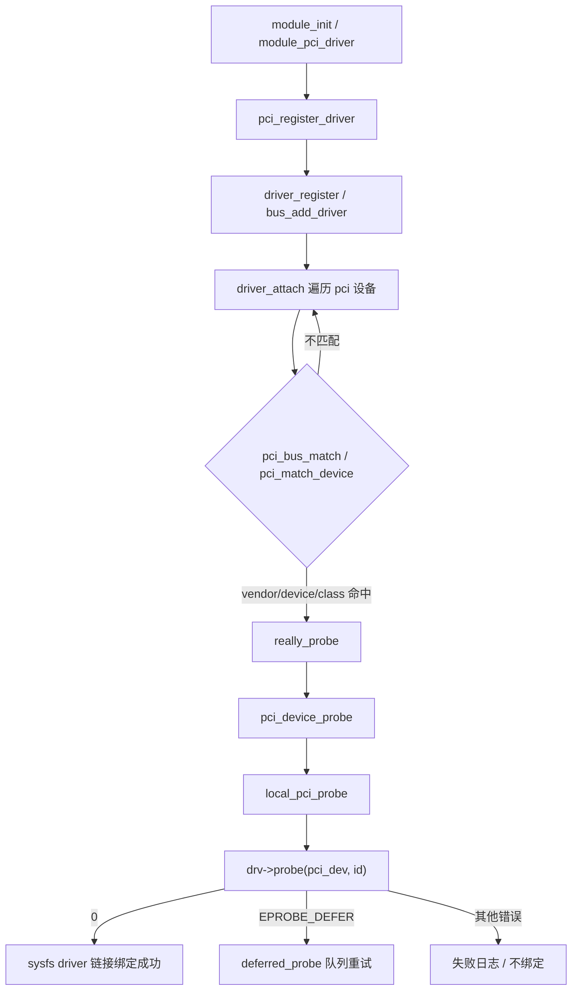
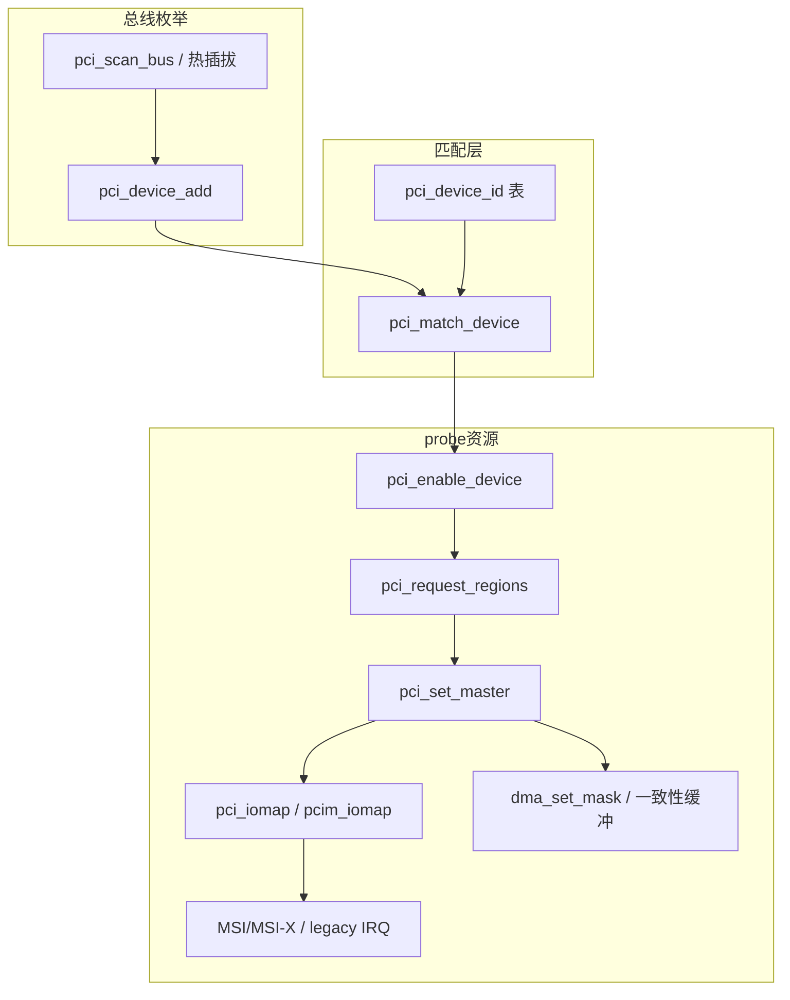

# Linux PCI 驱动完整篇：从 pci_register_driver、BAR/DMA 到 probe 绑定与排障

`lspci` 能看到设备，但 `dmesg` 里没有 probe；BAR 一读全是 `0xff`；DMA 配置「看起来对」却永不完成——多数卡在 **PCI 总线匹配与资源申请顺序**，而不是业务寄存器写法。PCI 与 platform 不同：枚举由总线扫描完成，驱动靠 `pci_device_id` 表自动绑定；少写一个 OEM 的 `subdevice`、漏掉 `pci_set_master`，就会出现「设备在、驱动永远不来」或「中断/DMA 静默失败」。

本文把 `pci_register_driver`、ID 表匹配、`pci_enable_device`/`request_regions`、BAR 映射、MSI/DMA、延迟 probe 与观测命令合成一篇闭环。源 chapter（051–053、055–057）为提纲；正文按主线 `drivers/pci/` 真实路径重写。

---

## 源码锚点

| 路径 | 作用 |
|------|------|
| `include/linux/pci.h` | `struct pci_driver`、`struct pci_device_id`、`pci_register_driver`、`PCI_DEVICE*` |
| `drivers/pci/pci-driver.c` | 注册、`pci_device_probe`、`local_pci_probe` |
| `drivers/pci/search.c` | `pci_match_device`、`pci_bus_match` |
| `drivers/pci/pci.c` | `pci_enable_device`、`pci_request_regions`、`pci_set_master` |
| `drivers/base/dd.c` | `really_probe`、deferred probe |
| `include/linux/pci_ids.h` | 常见 vendor/device 常量 |
| `Documentation/PCI/` | PCI 驱动编写与电源管理指南 |

结构骨架：

```c
/* include/linux/pci.h */
struct pci_driver {
	const char *name;
	const struct pci_device_id *id_table;
	int  (*probe)(struct pci_dev *dev, const struct pci_device_id *id);
	void (*remove)(struct pci_dev *dev);
	void (*shutdown)(struct pci_dev *dev);
	int  (*suspend)(struct pci_dev *dev, pm_message_t state);
	int  (*resume)(struct pci_dev *dev);
	struct device_driver driver;
};

struct pci_device_id {
	__u32 vendor, device;
	__u32 subvendor, subdevice;
	__u32 class, class_mask;
	kernel_ulong_t driver_data;
};

#define PCI_DEVICE(vend, dev) \
	.vendor = (vend), .device = (dev), \
	.subvendor = PCI_ANY_ID, .subdevice = PCI_ANY_ID
```

最小注册与 probe 资源序：

```c
static const struct pci_device_id my_ids[] = {
	{ PCI_DEVICE(0x1234, 0x5678) },
	{ PCI_DEVICE_CLASS(PCI_CLASS_STORAGE_EXPRESS << 8, 0xffff00) }, /* 示例：按 class */
	{ /* sentinel */ }
};
MODULE_DEVICE_TABLE(pci, my_ids);

static int my_probe(struct pci_dev *pdev, const struct pci_device_id *id)
{
	int err;

	err = pcim_enable_device(pdev);          /* 或 pci_enable_device */
	if (err)
		return err;
	err = pci_request_regions(pdev, "mydrv");
	if (err)
		return err;
	pci_set_master(pdev);

	/* BAR0：长度务必先查 pci_resource_len */
	void __iomem *bar = pcim_iomap(pdev, 0, 0);
	if (!bar)
		return -ENOMEM;

	/* dma_set_mask_and_coherent / 申请 MSI / 注册中断 … */
	return 0;
}

static struct pci_driver my_driver = {
	.name = "mydrv",
	.id_table = my_ids,
	.probe = my_probe,
	.remove = my_remove,
};
module_pci_driver(my_driver);
```

---

## 调用链

### 注册 → 匹配 → probe（主路径）



### 枚举、资源与 DMA 分层



热插拔 / 启动侧：

```text
pci_scan_bus → pci_device_add → device_add
  → bus_probe_device → 同上 match → probe
```

---

## 重点知识

### 1. 匹配靠 `id_table`，不是设备名字符串

`lspci -nn` 显示 `8086:15b8` 时，表项需 `PCI_DEVICE(0x8086, 0x15b8)`，或用 `class/class_mask` 匹配一类设备。`subvendor/subdevice` 默认 `PCI_ANY_ID` 可放宽；OEM 改了子系统 ID 却写死具体值时，会出现「同芯片有的板卡不绑定」。表末必须有空终止项；`MODULE_DEVICE_TABLE(pci, …)` 供模块自动加载（alias）。

```bash
lspci -nn
lspci -vv -s 0000:03:00.0
ls -l /sys/bus/pci/devices/0000:03:00.0/driver
modinfo mydrv | grep alias
```

### 2. BAR 与使能顺序不要反

推荐顺序（与多数 upstream 驱动一致）：

1. `pci_enable_device` / `pcim_enable_device` — 打开 MMIO/IO 译码
2. `pci_request_regions` — 独占 BAR，防与用户态/其他驱动冲突
3. `pci_set_master` — 允许 Bus Master，否则 DMA 发不出去
4. `pci_iomap` / `pcim_iomap` — 映射前检查 `pci_resource_len`、处理 64-bit BAR
5. 中断：优先 MSI/MSI-X，再回退 legacy；共享 IRQ 要 `IRQF_SHARED` 且 `dev_id` 正确
6. DMA：`dma_set_mask_and_coherent`，再 `dma_alloc_coherent` / streaming API

**踩坑**：未 `set_master` 却抱怨「描述符写了硬件不动」；64-bit BAR 当 32-bit 映射；映射长度写成 0 或超过 resource。

### 3. `-EPROBE_DEFER` 与电源/依赖

probe 里若时钟、PHY、IOMMU 域、regulator 尚未就绪，应返回 `-EPROBE_DEFER`，让 `drivers/base/dd.c` 的 deferred 队列重试。返回 `-ENODEV` 会被当成「此驱动不认该设备」，永久不绑定。

```bash
cat /sys/kernel/debug/devices_deferred   # 需 debugfs
dmesg | grep -iE 'pci|probe|defer|BAR'
cat /sys/bus/pci/devices/0000:03:00.0/enable
```

### 4. MSI 与 legacy IRQ

现代设备优先 `pci_alloc_irq_vectors`（或 `pci_enable_msi(x)` 旧接口）。MSI 未使能时仍走 INTx，需确认 `lspci -vv` 的 `Interrupt:` 与驱动申请的 IRQ 一致。多队列网卡/存储常按向量数分配 NAPI/mq 队列——向量数申请失败时要有降级路径。

### 5. 配置、Kconfig 与性能

- Kconfig：`CONFIG_PCI`、具体驱动 `CONFIG_*`；嵌入式 SoC 上还可能依赖 `CONFIG_PCIEPORTBUS`
- 性能：合理 MSI-X 向量、DMA 一致性缓冲对齐、避免在硬中断里做重活；PCIe Max Payload/Read Request 受根复合体与设备能力协商限制，盲目改 ASPM 可能导致掉设备
- 安全：用户态 `vfio`/`uio` 与内核驱动互斥占用同一 BAR 时，`request_regions` 会失败——先查谁占用

### 6. 常见问题速查

| 现象 | 优先查 |
|------|--------|
| 不 probe | `id_table` vs `lspci -nn`；模块未加载；`bind`/`driver_override` |
| BAR 全 ff / 全 0 | 未 enable；未上电；错误 BAR 号；链路未训练 |
| DMA 不动 | `pci_set_master`；IOMMU/`dma_mask`；描述符字节序 |
| 中断计数不涨 | MSI 失败静默回退；IRQ 号错；设备未 unmask |
| 热拔 oops | `remove` 未停 DMA/IRQ；在飞 completion |

---

## Checklist

- [ ] 能指出 `pci_register_driver` → `pci_match_device` → `pci_device_probe` → `probe` 的源码文件
- [ ] `lspci -nn` 与驱动 `pci_device_id` 逐字段对照（含 subsystem 若写死）
- [ ] sysfs 下 `driver` 符号链接存在，且 `enable` 为 1
- [ ] probe 内顺序：`enable` → `request_regions` → `set_master` → 映射 BAR
- [ ] DMA 问题先查 Bus Master、IOMMU、`dma_mask`
- [ ] 依赖未就绪用 `-EPROBE_DEFER`，并查 `devices_deferred`
- [ ] `remove`/`shutdown` 路径停中断与 DMA，无 UAF
- [ ] `MODULE_DEVICE_TABLE` 存在，`modinfo` alias 与 ID 一致

---

## 小结

PCI 驱动排障的第一问不是「寄存器手册第几页」，而是 **匹配表是否命中、资源使能顺序是否完整、Bus Master/MSI/DMA 是否同时满足**。把 `pci_match_device` 到 `probe` 的链走通，再用 `lspci -vv` 与 sysfs 交叉验证，绝大多数「看不见驱动 / DMA 静默失败」都能收敛到可修的配置或代码问题。
