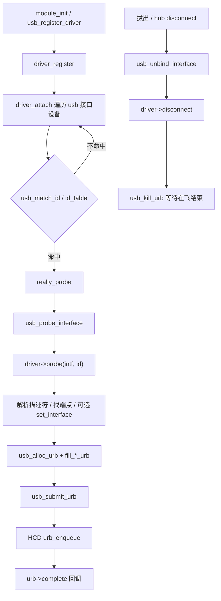
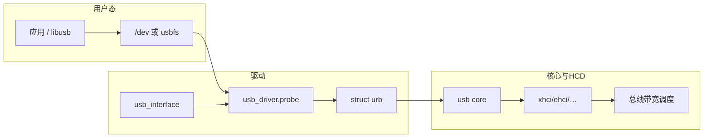

# Linux USB 驱动完整篇：从 usb_register_driver、接口匹配到 URB 生命周期与排障

`lsusb` 看得见设备，却没有对应 `/dev` 节点；bulk 传输返回 `-ENODEV`；插上后反复 `disconnect`——问题通常落在 **接口级匹配** 与 **URB 生命周期**，而不是某一个端点号写错那么简单。USB 驱动绑的是 `usb_interface`，不是整机根设备；复合设备有多接口时，绑错 interface 或漏 `usb_set_interface`，表现就是「枚举成功、功能全无」。拔出时若不 `usb_kill_urb`，完成回调里访问已释放的 `usb_device` 会直接 oops。

本文沿 `usb_register_driver` → `usb_probe_interface` → `usb_submit_urb` → `disconnect` 把绑定、描述符、URB、观测与常见坑串成闭环。源 chapter（061–063、065–067）为提纲；正文按主线 `drivers/usb/core/` 真实路径重写。

---

## 源码锚点

| 路径 | 作用 |
|------|------|
| `include/linux/usb.h` | `struct usb_driver`、`usb_device_id`、`struct urb`、pipe 辅助宏 |
| `drivers/usb/core/driver.c` | `usb_register_driver`、`usb_probe_interface`、`usb_unbind_interface` |
| `drivers/usb/core/message.c` | `usb_submit_urb`、`usb_kill_urb`、`usb_control_msg` 等 |
| `drivers/usb/core/hub.c` | 枚举、端口状态、disconnect 事件源 |
| `drivers/usb/core/config.c` | 配置/接口/端点描述符解析 |
| `drivers/usb/core/urb.c` | URB 生命周期细节 |
| `Documentation/driver-api/usb/` | USB 驱动 API 文档 |

结构骨架：

```c
/* include/linux/usb.h */
struct usb_driver {
	const char *name;
	int  (*probe)(struct usb_interface *intf,
		      const struct usb_device_id *id);
	void (*disconnect)(struct usb_interface *intf);
	int  (*suspend)(struct usb_interface *intf, pm_message_t message);
	int  (*resume)(struct usb_interface *intf);
	const struct usb_device_id *id_table;
	/* … */
};

struct usb_device_id {
	__u16 match_flags;
	__u16 idVendor, idProduct;
	__u8  bDeviceClass, bDeviceSubClass, bDeviceProtocol;
	__u8  bInterfaceClass, bInterfaceSubClass, bInterfaceProtocol;
	/* … */
};

struct urb {
	struct usb_device *dev;
	unsigned int pipe;
	void *transfer_buffer;
	dma_addr_t transfer_dma;
	u32 transfer_buffer_length;
	usb_complete_t complete;
	void *context;
	int status;          /* 完成后：0 或 -EPIPE/-ENODEV/… */
	/* … */
};
```

注册与一次 bulk 提交：

```c
static const struct usb_device_id my_ids[] = {
	{ USB_DEVICE(0x1234, 0xabcd) },
	{ USB_INTERFACE_INFO(0xff, 0x01, 0x00) }, /* vendor class 示例 */
	{ /* sentinel */ }
};
MODULE_DEVICE_TABLE(usb, my_ids);

/* probe 内解析端点后： */
urb = usb_alloc_urb(0, GFP_KERNEL);
usb_fill_bulk_urb(urb, udev, usb_sndbulkpipe(udev, ep_out),
		  buf, len, my_complete, ctx);
/* DMA：优先 usb_alloc_coherent，或正确使用 transfer_dma 标志 */
ret = usb_submit_urb(urb, GFP_KERNEL);
```

---

## 调用链

### 注册 → 接口 probe → URB（主路径）



### 主机栈分层与数据流



---

## 重点知识

### 1. 绑的是 interface，不是整机

一个物理设备可有多个 interface（音频+HID、CDC 复合等）。`id_table` 可用 `USB_DEVICE(vend, prod)`，也可用 `USB_INTERFACE_INFO(class, subclass, protocol)` 按功能类匹配。排障时先 `lsusb -t` 看树，再确认驱动挂在正确的 interface 上：

```bash
lsusb -nn
lsusb -v -d 1234:abcd
lsusb -t
ls -l /sys/bus/usb/devices/*/driver
cat /sys/kernel/debug/usb/devices   # 需 debugfs
modinfo mydrv | grep alias
```

### 2. URB 是异步核心，完成回调不能睡

`usb_submit_urb` 立即返回；真正结束在 HCD 中断路径调 `complete`。`complete` 中：**不可睡眠**；谨慎 `printk`；需要重提交时先检查设备是否仍在（`disconnect` 竞态）。错误码常见：`-EPIPE`（stall，需 clear halt）、`-ENODEV`/`-ENOENT`（已拔出）、`-EPROTO`/`-EILSEQ`（信号/协议）。

`disconnect` 必须：

1. 标记「禁止新 submit」
2. `usb_kill_urb` / `usb_kill_anchored_urbs` 等待在飞结束
3. 再释放缓冲与私有数据

漏 kill → 拔出后 complete UAF，是 USB 驱动经典 oops。

### 3. 端点与 pipe 来自描述符

不要假设 bulk 永远是 `0x01/0x81`。用接口当前 altsetting 的 endpoint 描述符，经 `usb_rcvbulkpipe` / `usb_sndbulkpipe` / `usb_rcvintpipe` 等编码进 `pipe`。若功能依赖特定 alt setting，先 `usb_set_interface`。

控制传输用 `usb_control_msg` 或手工 setup 包；注意 `wValue/wIndex/wLength` 与设备协议一致，且避免在 `probe` 里阻塞过久拖慢整条枚举。

### 4. DMA 缓冲

部分架构对 USB DMA 有对齐/cache 要求。优先：

- `usb_alloc_coherent` / `usb_free_coherent`
- 或保证 `URB_NO_TRANSFER_DMA_MAP` 等标志与 `transfer_dma` 使用方式符合 API

栈上缓冲、任意 `kmalloc` 未对齐地址，在部分平台会静默损坏或提交失败。

### 5. 配置、电源与观测

- Kconfig：`CONFIG_USB`、`CONFIG_USB_SUPPORT`、具体 HCD（`CONFIG_USB_XHCI_HCD` 等）、`CONFIG_USB_MON`（抓包）
- 电源：选择性 suspend 下设备休眠后需正确 `resume`；乱发 URB 可能 `-EHOSTUNREACH` 类错误
- 抓包：`usbmon`（`/sys/kernel/debug/usb/usbmon/`）对照 submit/complete；`udevadm monitor` 看插拔事件

### 6. 问题速查

| 现象 | 优先查 |
|------|--------|
| 无 `/dev` / 不 probe | `id_table`；绑错 interface；模块未加载 |
| 反复 disconnect | 线材/供电；probe 里致命错误；hub 过流 |
| bulk `-EPIPE` | clear halt；端点方向；协议状态机 |
| 拔出 oops | `disconnect` 未 kill URB；complete 未检查拔出 |
| 只有控制成功、bulk 失败 | altsetting；端点号；maxpacket |
| 复合设备半边工作 | 另一 interface 被别的驱动占用或未驱动 |

---

## Checklist

- [ ] 能口述 `usb_register_driver` → `usb_probe_interface` → `probe` 的调用位置
- [ ] `lsusb -nn` 与 `usb_device_id` / `MODULE_DEVICE_TABLE(usb, …)` 一致
- [ ] 确认匹配的是正确 interface（复合设备已核对 `lsusb -t`）
- [ ] 端点号来自描述符解析，而非硬编码
- [ ] 每个长期 URB 在 `disconnect` 有 `kill`/`free` 路径
- [ ] `complete` 中无睡眠；拔出竞态有标志位保护
- [ ] DMA 缓冲使用 `usb_alloc_coherent` 或等价正确映射
- [ ] 需要时用 usbmon 抓到 submit 与 complete 配对

---

## 小结

USB 驱动的两条生命线是 **接口匹配** 与 **URB 生命周期**：表对了才能进 `probe`，kill/complete 成对才能安全热拔。先用 `lsusb -v/-t` 钉死 interface 与端点，再沿 `usb_submit_urb` 看 HCD 完成状态，比在业务协议里瞎猜更快收敛。
