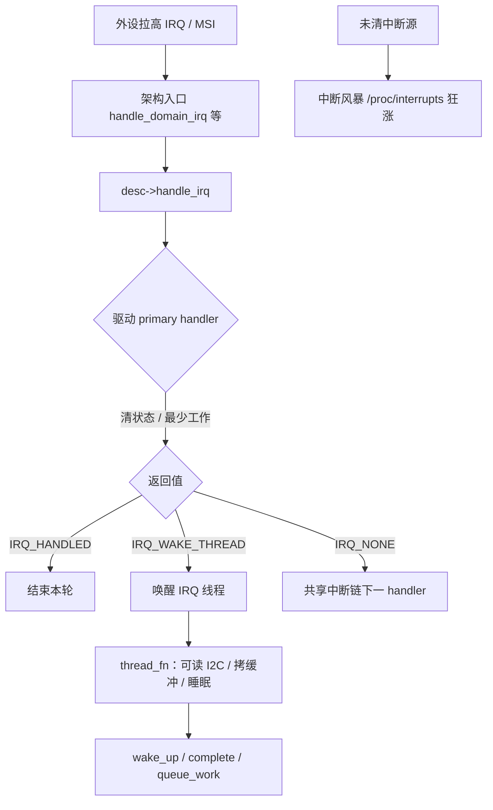
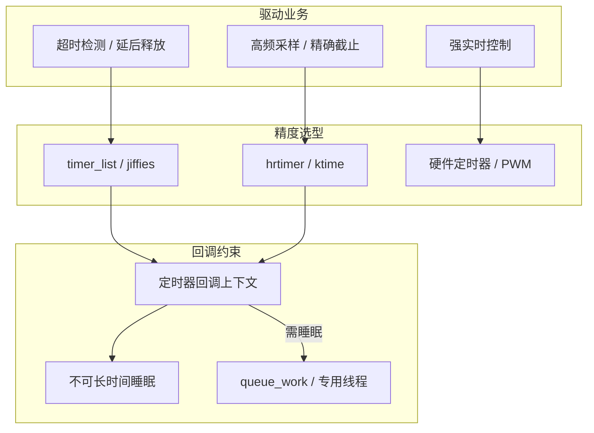

# Linux 驱动中断与定时完整篇：从 request_threaded_irq 到 hrtimer 选型与排障

外设「偶发丢中断」、下半部太重把调度延迟打爆、或用 `mod_timer` 做 100µs 周期控制却怎么都不准——根因通常是 **硬中断上下文约束被打破**，或 **定时器类型选错**。驱动侧真正该问的是：这件事必须在硬中断里做完吗？能睡吗？精度要到 jiffies 还是要 hrtimer/硬件定时器？

本文把 `request_threaded_irq`、主 handler/`thread_fn` 分工、`timer_list` 与 `hrtimer`、DT 取中断号、观测与卸载竞态合成一篇可验证闭环。源 chapter（081–083、085–087）为提纲；正文按主线 `kernel/irq/` 与 `kernel/time/` 真实路径重写。

---

## 源码锚点

| 路径 | 作用 |
|------|------|
| `include/linux/interrupt.h` | `request_irq`、`request_threaded_irq`、`IRQF_*`、`irqreturn_t` |
| `kernel/irq/manage.c` | 申请/释放 IRQ、线程化中断安装 |
| `kernel/irq/handle.c` 一带 | 通用中断处理入口（与架构入口衔接） |
| `include/linux/timer.h` | `timer_list`、`timer_setup`、`mod_timer`、`del_timer_sync` |
| `kernel/time/timer.c` | 低分辨率定时器轮 |
| `include/linux/hrtimer.h` / `kernel/time/hrtimer.c` | 高分辨率定时器 |
| `include/linux/workqueue.h` | 可睡眠重活的投递目标 |
| `Documentation/core-api/irq/` | IRQ 域、请求与线程化说明 |

线程化中断 API：

```c
/* include/linux/interrupt.h */
int request_threaded_irq(unsigned int irq,
			 irq_handler_t handler,     /* 硬中断；可 NULL */
			 irq_handler_t thread_fn,   /* IRQ 线程；可睡眠 */
			 unsigned long flags,
			 const char *name, void *dev);

/* 返回值：IRQ_HANDLED / IRQ_WAKE_THREAD / IRQ_NONE */
```

两类定时器骨架：

```c
/* jiffies 级 */
timer_setup(&dev->timer, my_timer_cb, 0);
mod_timer(&dev->timer, jiffies + msecs_to_jiffies(10));
/* 卸载：del_timer_sync(&dev->timer); */

/* 高分辨率 */
hrtimer_init(&dev->hr, CLOCK_MONOTONIC, HRTIMER_MODE_REL);
dev->hr.function = my_hr_cb;
hrtimer_start(&dev->hr, ms_to_ktime(1), HRTIMER_MODE_REL);
/* 周期：回调里 hrtimer_forward_now + return HRTIMER_RESTART
   卸载：hrtimer_cancel(&dev->hr); */
```

从 DT/platform 取 Linux IRQ 号：

```c
irq = platform_get_irq(pdev, 0);
/* 或 irq_of_parse_and_map(np, 0) */
if (irq < 0)
	return irq;
err = request_threaded_irq(irq, my_hard, my_thread,
			   IRQF_ONESHOT, "mydrv", priv);
```

---

## 调用链

### 硬件中断到驱动线程（主路径）



### 定时路径与可睡眠边界



---

## 重点知识

### 1. 硬中断里只做「最短必要」

硬中断上下文：**不可调度、不可睡眠**。允许：读/清中断状态寄存器、屏蔽该源、搬极少量数据、`IRQ_WAKE_THREAD`。禁止：`mutex_lock`、`kmalloc(GFP_KERNEL)`、阻塞 I2C/SPI 传输、大段 `printk`、在共享锁上等待进程上下文。

违反时轻则 `BUG`/`sleeping function called from invalid context`，重则系统卡死或随机丢中断。

### 2. 优先 `request_threaded_irq`

把「响应」与「处理」拆开：

| 部分 | 上下文 | 典型工作 |
|------|--------|----------|
| `handler` | 硬中断 | 清源、确认本设备、返回 `IRQ_WAKE_THREAD` |
| `thread_fn` | IRQ 内核线程 | 可读总线、拷贝缓冲、唤醒等待队列 |

`handler == NULL` 时内核使用默认主 handler，强制线程化——适合慢速外设。共享中断必须 `IRQF_SHARED`，且 `dev_id` 非 NULL、申请与 `free_irq` 指针一致；`IRQF_ONESHOT` 常与线程化联用，防止线程跑完前硬中断重入未处理完的逻辑。

Top-half 过重时的替代：`tasklet`（不可睡，渐少推荐）、`workqueue`、专用 kthread、NAPI（网络）。选型原则：**能睡用线程/work；要极短用硬中断+最小清源**。

### 3. `timer_list` vs `hrtimer`

| | `timer_list` | `hrtimer` |
|--|--------------|-----------|
| 基准 | jiffies | ktime（通常 CLOCK_MONOTONIC） |
| 精度 | ~1 tick（常见 1–10ms） | 亚毫秒～微秒级（视配置） |
| 适用 | 超时、延后释放、粗轮询 | 精确采样、截止时间、周期短任务 |
| 回调 | 不可睡眠 | 通常不可睡眠 |

周期 hrtimer：在回调里 `hrtimer_forward_now()` 并返回 `HRTIMER_RESTART`。需要睡眠的工作一律 `queue_work`。用 jiffies 定时器做 100µs 控制是选型错误，应改 hrtimer 或片上硬件定时器/PWM。

### 4. 配置与观测

```bash
# 中断是否进驱动
cat /proc/interrupts | grep -i mydrv
# 绑核（多队列/实时场景）
cat /proc/irq/<n>/smp_affinity
echo <mask> > /proc/irq/<n>/smp_affinity

# 路径与延迟
trace-cmd record -e irq:irq_handler_entry -e irq:irq_handler_exit sleep 2
# 关中断过久：kernelshark / ftrace irqsoff

# 定时器（输出大，调试时用）
# cat /proc/timer_list | head
dmesg | grep -iE 'irq|threaded|NONE'
```

设备树：`interrupts` / `interrupts-extended` 与 `interrupt-parent` 配错 → 申请到错误虚号或 probe 失败。平台驱动优先 `platform_get_irq` / `platform_get_irq_byname`，不要手写魔数。

Kconfig：`CONFIG_GENERIC_IRQ_DEBUGFS`、高精度定时 `CONFIG_HIGH_RES_TIMERS`（多数发行版已开）。

### 5. 卸载与竞态

推荐顺序：

1. 禁硬件中断源（写设备寄存器）
2. `disable_irq`（如需要）+ `free_irq`
3. `del_timer_sync` / `hrtimer_cancel`
4. `cancel_work_sync`
5. 再释放私有数据

**踩坑**：模块 `exit` 只 `kfree`，定时器/IRQ 仍可能触发 → UAF。共享 IRQ 的 `dev_id` 申请释放不一致 → `free_irq` 卸错 handler 或失败。

### 6. 问题速查

| 现象 | 优先查 |
|------|--------|
| `/proc/interrupts` 不涨 | 未 unmask；DT 映射错；请求了错误号；设备未触发 |
| 狂涨、系统卡 | 未清中断源；电平触发配置错 |
| 延迟大、实时差 | 重活在硬中断；线程优先级；关中断过久 |
| 定时不准 | 误用 jiffies；CPU 休眠影响；应 hrtimer/硬件定时 |
| 卸载 oops | 未 sync 取消定时器/work；未 free_irq |

---


---

## 小结

驱动里的中断与定时，本质是 **把工作放到对的上下文**：硬中断保响应，线程/work 保可睡眠与可调度，定时器表达未来时刻且回调同样受上下文约束。选对 `request_threaded_irq` 与 `hrtimer`，再用 `/proc/interrupts` 与 ftrace 验证，丢中断、延迟尖刺和「定时不准」大多能落到具体的一层去改。
